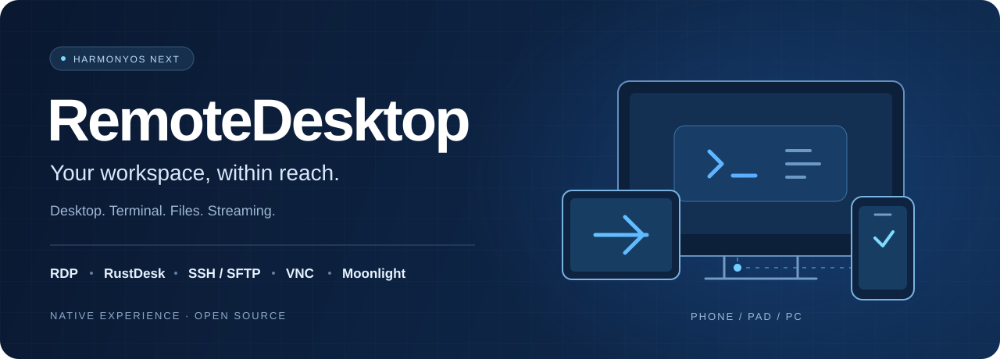

<div align="center">



# RemoteDesk · 鸿蒙远程桌面

**远程桌面、终端、文件与串流，一个工作台就够。**

面向 HarmonyOS NEXT 的原生多协议客户端，为手机、平板与 PC 打造。

[](#连接你的工作空间) [](docs/DEVELOPMENT.md) [](LICENSE) [](https://github.com/Mydstiny/RemoteDeskHarmonyOS/actions/workflows/open-source-compliance.yml)

[使用指南](docs/app-store/USER_GUIDE.md) · [从源码构建](docs/DEVELOPMENT.md) · [版本与发布](https://github.com/Mydstiny/RemoteDeskHarmonyOS/releases) · [反馈问题](https://github.com/Mydstiny/RemoteDeskHarmonyOS/issues)

</div>

---

## 连接你的工作空间

在 Windows 桌面上继续工作，在服务器终端中处理任务，或通过 Sunshine 串流应用。
RemoteDesk 将不同连接方式放进统一的主机工作台，按工作组整理、按协议筛选，让常用设备更容易找到。

| 连接方式 | 适用场景 | 主要能力 |
| :--- | :--- | :--- |
| **RDP** | Windows 远程办公 | FreeRDP / WinPR、证书预检、Microsoft / Azure AD 凭据、音视频、文本剪贴板与共享目录 |
| **RustDesk** | 跨平台远程控制 | ID / 中继 / 直连、远程画面与音频、键鼠输入、文本剪贴板与文件传输 |
| **SSH / SFTP** | 服务器维护与文件管理 | 多标签与多窗格终端、密钥认证、跳板机、端口转发、双栏文件工作区与传输中心 |
| **VNC** | 连接已有 VNC 服务 | TLS / 明文预检、证书与凭据确认、远程画面、输入、文本剪贴板与网关配置 |
| **Moonlight** | 通过 Sunshine 串流 | 主机发现、PIN 配对、应用目录、画面与音频、键鼠 / 触控 / 控制器输入 |

## 为鸿蒙日常使用而设计

<table>
<tr>
<td width="50%" valign="top">

### 多设备，自然适配

ArkTS + ArkUI 原生界面，适配 Phone、Pad 与 PC。结合窗口尺寸调整布局，提供远程键盘、浮动控制栏、画中画与前后台恢复。

</td>
<td width="50%" valign="top">

### 终端与文件，一起处理

SSH 多标签、多窗格、搜索和常用命令，搭配 SFTP 双栏浏览与传输中心，让终端操作和文件管理衔接起来。

</td>
</tr>
<tr>
<td width="50%" valign="top">

### 数据保护，掌握在自己手中

支持本地 AES-256-GCM 数据保护、HUKS / 生物认证集成、密钥库、TOTP 验证器与备份恢复。连接时核对远端身份，按需管理凭据。

</td>
<td width="50%" valign="top">

### 离线使用，按需同步

可离线管理本机数据；登录华为账号并完成云服务配置后，按需选择同步内容，提供显式同步、重试与本地恢复隔离。

</td>
</tr>
</table>

> 各项能力受远端服务、设备形态、系统权限和配置影响；剪贴板、文件传输等以当前协议与会话的实际可用状态为准。

## 开始使用

**了解产品** → 阅读[使用指南](docs/app-store/USER_GUIDE.md)，了解首次使用、添加主机与各协议的操作方式。

**准备连接** → 在远端启用对应服务，在 RemoteDesk 添加主机，核对证书或主机指纹；Moonlight 需先完成 Sunshine 配对。

**参与开发** → 克隆源码，按[开发与构建指南](docs/DEVELOPMENT.md)配置 DevEco Studio、本地依赖和私有构建文件。

```sh
git clone --recurse-submodules https://github.com/Mydstiny/RemoteDeskHarmonyOS.git
cd RemoteDeskHarmonyOS
```

> [!NOTE]
> 仓库当前版本为 **1.1.5.1**，仍处于测试与发布验证阶段。安装包可用性以 [Releases](https://github.com/Mydstiny/RemoteDeskHarmonyOS/releases) 为准；标记为 `unsigned` 的 HAP 未经应用签名，仅用于开发测试，不是 AppGallery 或生产分发安装包。

<details>
<summary><strong>1.1.5.1 更新摘要</strong></summary>

- PC 画面：改进画面翻转处理及诊断。
- RDP：改进凭据、输入、缩放和断线原因展示。
- RustDesk：改进工具栏、监控与文本剪贴板。
- SSH：改进常用命令和会话操作体验。
- 通用体验：改进退出保护、列表避让和鸿蒙快捷键设置。

详细变更及历史版本说明见[使用指南](docs/app-store/USER_GUIDE.md)。设备与协议矩阵验证仍在持续推进。

</details>

## 原生界面，多协议内核

```text
                     ArkTS · ArkUI
                页面 / 组件 / 响应式交互
                           │
               服务 · 策略 · 本地数据 · 云同步
                           │
                      NAPI / FFI
                           │
       ┌─────────┬─────────┼─────────┬──────────┐
     FreeRDP   RustDesk   libssh2    VNC     Moonlight
       RDP     Rust FFI   SSH/SFTP           Sunshine
       └─────────┴─────────┼─────────┴──────────┘
                  渲染 · 音频 · 输入桥接
```

原生库覆盖 **ARM64 / x86_64**。开发基准为 **API 26**，应用兼容目标与 native ABI 工具链分别核对；具体环境与构建步骤见[开发指南](docs/DEVELOPMENT.md)。

## 文档与参与

| 我想… | 入口 |
| :--- | :--- |
| 了解使用方法与版本变化 | [用户指南](docs/app-store/USER_GUIDE.md) |
| 搭建环境、查看架构与构建命令 | [开发与构建](docs/DEVELOPMENT.md) |
| 在 Windows / macOS 间协作 | [跨设备工作流](docs/CROSS_DEVICE_GITHUB_WORKFLOW.md) |
| 贡献代码或改进文档 | [贡献指南](CONTRIBUTING.md) |
| 提交问题或功能建议 | [GitHub Issues](https://github.com/Mydstiny/RemoteDeskHarmonyOS/issues) |
| 私密报告安全问题 | [安全政策](SECURITY.md) |
| 了解隐私与数据处理 | [隐私政策](docs/app-store/PRIVACY_POLICY.md) |

欢迎贡献文档、问题复现和改进建议。反馈时请说明协议、设备类型、版本与复现步骤，并移除凭据、主机地址、证书和用户数据。

## 开源与致谢

项目自有组合发行版采用 **[AGPL-3.0-or-later](LICENSE)**。感谢 FreeRDP / WinPR、RustDesk、libssh2、Moonlight、FFmpeg、OpenSSL、Mbed TLS、Opus 及其他上游项目；各依赖保留自己的许可证与分发条件。

[第三方声明](THIRD_PARTY_NOTICES.md) · [NOTICE](NOTICE) · [许可证文本](LICENSES/) · [SPDX SBOM](docs/compliance/SBOM.spdx.json) · [对应源码](docs/compliance/SOURCE_OFFER.md) · [网络源码提供政策](docs/compliance/AGPL_NETWORK_SOURCE_OFFER_POLICY.md)

---

<div align="center">
<sub>RemoteDeskHarmonyOS · 让远程工作，融入鸿蒙日常。</sub>
</div>
