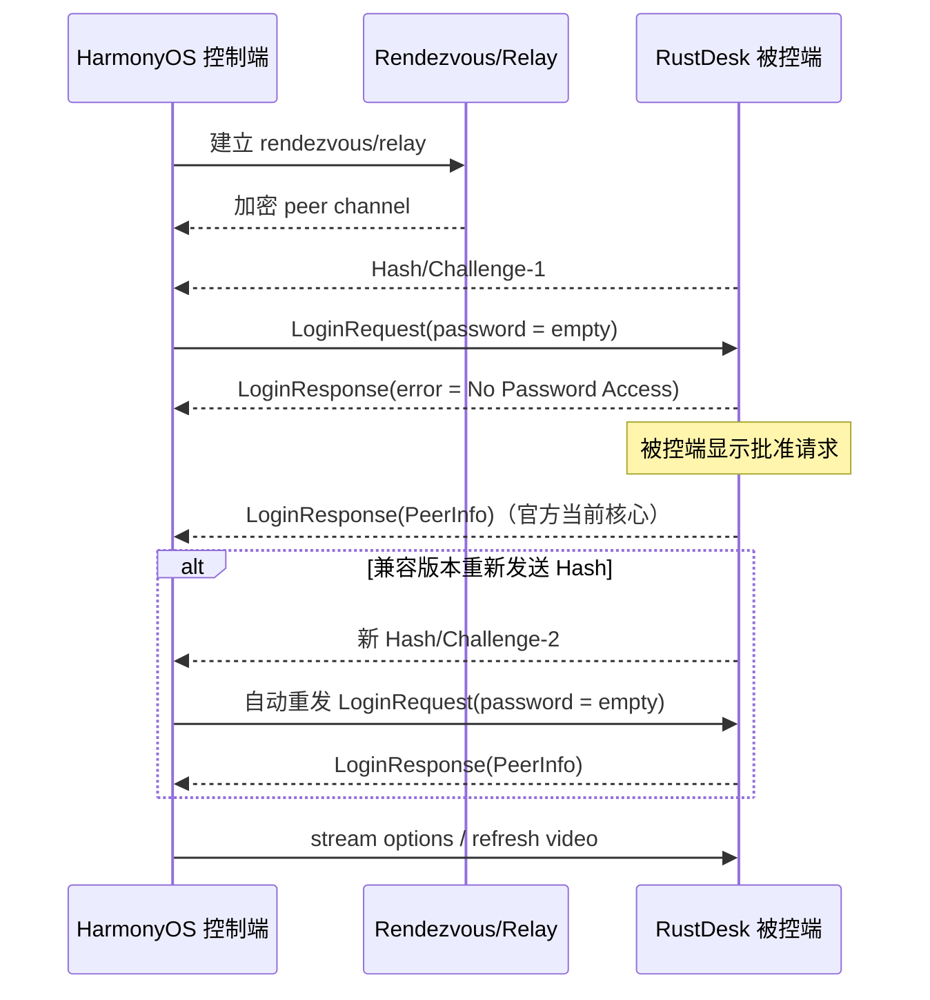

# RustDesk 官方密钥导入与免密码请求批准优化计划

> 复核日期：2026-07-16
> 适用分支：`codex/rustdesk-pro-account-sync` 及后续从公开 `main` 派生的实现分支
> 文档性质：架构、产品逻辑、测试与发布计划，并记录已执行的实现批次与未完成的真实环境门禁。

## 1. 结论先行

### 2026-07-16 执行批次（本轮）

本轮按本计划直接进入实现，不改变现有密码连接的默认行为。第一批交付范围固定为：

- 增加持久化的 RustDesk 认证策略：`password`（一次性/永久密码均由远端 RustDesk 策略决定）和 `request_approval`（空密码请求被控端点击批准）。
- 对齐官方 `No Password Access` 流程：保持同一加密通道等待批准；当前官方核心通常在批准后直接返回 `LoginResponse(PeerInfo)`，遇到兼容版本重新发送 Hash 时再自动重发空密码登录请求；密码模式仍走原有一次登录。
- 为 Server Pro 地址簿中没有密码的主机默认选择 `request_approval`，但不覆盖用户已经明确选择的认证策略。
- 将认证策略从 ArkTS 主机模型传递到 C++/Rust FFI，并保留旧 ABI 字段顺序；IPC helper 尚未具备完整 RustDesk core，会继续按其能力矩阵处理。
- 在 IPC helper 模式显式拒绝请求批准（错误码 `-40`），在直连模式显式拒绝请求批准（错误码 `-41`），避免空密码静默降级。
- 增加旧数据/旧数据库迁移、校验、定向 Rust 测试和 ArkTS/HAP 验证。
- 本地备份导出包含 `rustdeskauthmode`；旧版本备份仍可恢复，缺失该列时按默认 `password` 兼容。

本批次暂不宣称直连、文件传输和跨版本真实批准验收完成；这些入口必须在阶段 5 的真实设备矩阵中单独证明，未证明时保持密码模式或明确提示不支持。

这两个需求不是两个独立的 UI 小功能：

1. “粘贴官方密钥”本质是 RustDesk 官方连接字符串/自定义服务器配置的解析、可信材料校验、端点归一化和实际协议验证。
2. “不输密码直接连接”本质是 RustDesk 登录会话状态机扩展。被控端返回 `No Password Access` 后，控制端必须保留加密通道等待批准；官方当前路径会直接返回 `LoginResponse(PeerInfo)`，兼容路径才需要等待新的 Hash/Challenge 再重发 LoginRequest；不能把这个响应当成普通失败，也不能重新建立一条中继连接。
3. 控制端不能强制被控端弹窗。被控端必须已启用点击批准或兼容的批准模式，且其 RustDesk 版本、桌面状态、权限、隐私模式和二次验证策略允许该请求。

建议按以下顺序交付：

```text
数据契约与迁移
    -> 官方字符串/密钥导入
    -> 显式认证模式与表单校验
    -> FFI 登录等待/自动重试状态机
    -> Native 取消与 ArkTS 会话 UI
    -> 直连、文件传输、重连、Pro 地址簿一致性
    -> 真机与多版本 RustDesk 验收
```

预计总投入：12～20 个开发工作日；其中 Rust FFI、Native 生命周期和真机矩阵是主要不确定项。

## 2. 本次反审查发现的必须补项

原方案方向正确，但以下边界必须显式写入实现和验收，否则容易出现“看起来支持、实际连接失败”或“页面显示已取消但后台仍在连接”的问题。

| 优先级 | 必须补项 | 原因 |
|---|---|---|
| P0 | 区分 TCP 可达、密钥格式正确、密钥与 RustDesk 服务匹配、目标设备登录成功 | 端口探测不能证明公钥正确 |
| P0 | `No Password Access` 必须保持当前 CryptoChannel，等待批准后的 `PeerInfo`；兼容版本再处理新 Hash | 官方服务端会保持连接等待批准，直接返回错误会丢失批准流程 |
| P0 | 连接尝试在成功前就要有 attempt ID 和取消能力 | 当前 FFI handle 只有成功后才创建，等待批准期间无法可靠取消 |
| P0 | 空密码只能由显式 `request_approval` 模式产生 | 不能把“密码输入框为空”误当成用户授权的免密码连接 |
| P0 | 自建服务器没有 key 时不能静默回退到官方公钥 | 会导致握手失败，也会误导用户以为配置已生效 |
| P0 | 页面离开、重复点击、超时、拒绝、晚到的成功回调都要有终态处理 | 否则会重复请求、泄漏连接或把已取消连接显示为成功 |
| P1 | 直连模式、文件传输、重连和 Pro 地址簿主机必须复用认证模式 | 只改屏幕连接会造成同一主机不同入口行为不一致 |
| P1 | 端口语义统一；不要混用 ID、Relay 和 Peer 直连端口 | 当前代码存在 `21116/21117/21118` 默认值不一致 |
| P1 | 支持 IPv4、域名、括号 IPv6、URL 编码 query 和 Base64 padding 变体 | 官方连接字符串并不只包含简单域名 |
| P1 | 对二次验证、旧版 RustDesk、锁屏/无桌面、隐私模式进行明确分类 | 这些情况不能统一显示为“等待批准” |

## 3. 当前代码事实与约束

现有链路已具备一部分基础，但尚未闭合：

- `RustDeskRelayConfig.key` 经 `RemoteDesktop.rdServerKey` 和 `RustDeskFfiConfig.key` 传入 Rust FFI。
- 中继页面当前是普通输入框，保存时只做字符串 trim；测试按钮主要做 TCP 可达性检查。
- `RemoteHost.rustdeskPasswordMode` 已存在，但当前主要是传递字段，未形成独立的认证策略；空密码仍会被 `getValidationErrors()` 拒绝。
- `rustdesk_ffi/src/protocol/session.rs` 在收到任意带 error 的 `LoginResponse` 后直接进入 `Error`。
- `rustdesk_ffi/src/connector.rs` 的 `connect()` 会先走 rendezvous/relay，再建立加密通道并登录；成功前没有可供 ArkTS 使用的连接句柄。
- 官方 vendored 代码明确使用 `No Password Access` 作为请求批准时的登录响应，并将其标记为可重试等待错误。
- 官方 `custom_server.rs` 支持 `rustdesk-host=...,key=...,api=...,relay=...` 形式；官方 UI 文案还支持 `<id>@<server>?key=<key>` 形式。
- 当前工作区存在用户未提交改动；实现时不得覆盖或暂存这些文件之外的无关内容。

本计划补充并细化现有 `docs/RDP_RUSTDESK_UPGRADE_PLAN.md`，不替代其中关于协议合规、真实 RustDesk core、渲染和发布门禁的约束。

## 4. 产品范围和明确不承诺的行为

### 4.1 本期承诺

- 用户可以主动粘贴官方 RustDesk 公钥、官方连接字符串或官方自定义服务器字符串。
- 应用能明确告诉用户：输入是否可解析、key 是否为合法 32 字节公钥、端点是否可达、协议握手是否通过。
- 用户选择“请求对方批准”后，应用发送空密码请求；被控端批准后自动完成登录并进入远程桌面。
- 用户可取消等待；超时、拒绝、旧版本不支持、二次验证等均有可理解的错误分类。
- 同一主机的屏幕连接、文件传输和重连不会悄悄改用另一种认证方式。

### 4.2 本期不承诺

- 不能通过控制端代码强制被控端弹出批准窗口。
- 不能绕过被控端的永久密码、批准策略、隐私模式、权限策略或 2FA。
- 不能把任意字符串当作官方公钥；签名的 `rustdesk-licensed-...` 安装包令牌也不能直接当 raw key。
- 不在本期把 HarmonyOS 应用实现成 RustDesk 被控端；当前项目仍是控制端。
- 直连模式不在第一批直接宣称支持请求批准，必须先完成独立协议验收。

## 5. 数据模型与迁移方案

### 5.1 认证模式

在 `RemoteHost` 增加独立、可读的认证模式，建议使用字符串枚举而不是继续扩展数字含义：

```text
password          使用已保存/本次输入的密码
request_approval  空密码请求被控端批准
```

规则：

- 默认值为 `password`，兼容所有旧数据。
- `rustdeskPasswordMode` 继续表示一次性密码/永久密码等 RustDesk 密码语义，不与 `request_approval` 混用。
- `request_approval` 不清空已保存密码；密码仅作为用户显式选择“改用密码”时的回退材料。
- 不允许仅凭空密码自动推断 `request_approval`。
- FFI/NAPI 配置新增字段时只追加到结构体末尾，并保留旧 ABI 的默认值，避免现有调用方错位。

### 5.2 端点与公钥

建议引入内部归一化对象，避免继续让通用 `RemoteHost.host/port` 同时代表 ID 服务器、Relay 或 Peer：

```text
RustDeskEndpointProfile
  peerId
  idServerHost / idServerPort
  relayServerHost / relayServerPort
  directPeerHost / directPeerPort
  forceRelay
  keyCanonical
  keyFingerprint
  keySource
```

落地时可以先映射到现有字段，但必须保证：

- `peerId` 只保存远程 RustDesk ID；不要与 ID 服务器地址拼成不可逆字符串。
- 官方连接字符串中没有明确 `relay=` 时，不要把一个端口同时写入 ID 和 Relay。
- 没有明确直连配置时，不要因为 `host` 有值就自动切换为直连。
- 端口统一由一个 RustDesk 常量策略提供；默认 ID、Relay、Peer 端口分别为 `21116`、`21117`、`21118`，实际值必须允许用户覆盖并经过 1～65535 校验。

新增 JSON 字段必须可选读取、向旧版本回退，并保留未知字段之外的原数据。云同步迁移不得覆盖用户已有密码、锁定状态、显示设置、分组和最近连接信息。

### 5.3 密钥存储和同步

- 公钥不是密码，但它是服务身份信任材料；UI、日志和诊断中只显示指纹，不打印完整 key。
- 统一保存 canonical Base64 和 `SHA-256` 指纹，避免同一 key 因 padding 或 URL-safe 表示不同产生重复配置。
- `keySource` 建议区分 `public_default`、`raw_input`、`official_endpoint`、`custom_server_string`、`manual`。
- API 密码、Server Pro token 等凭据继续走现有本地安全存储策略，不因本功能复制到剪贴板或诊断日志。
- 是否同步公钥由现有 relay 云同步策略决定，但同步前后必须保持 endpoint/key 的原子一致性；不能出现新 key 配旧 endpoint 的中间状态。

## 6. 官方密钥粘贴/导入

### 6.1 支持的输入格式

实现一个纯策略解析器，例如 `RustDeskKeyImportPolicy`，UI 不直接解析字符串。

| 输入 | 解析结果 | 处理 |
|---|---|---|
| 原始 Base64 公钥 | key | 只填入 key，不猜测服务器地址 |
| `key=<Base64>` | key | 去除前缀、空白和外层引号后校验 |
| `<id>@<server>[:port]?key=<Base64>` | peer ID、ID 端点、key、`/r` 标志 | 展示解析预览，用户确认后写入对应字段 |
| `rustdesk-host=...,key=...,relay=...` | ID 端点、key、可选 relay | 支持官方文本配置格式；未提供字段不覆盖已有值 |
| `rustdesk-licensed-...` | 签名配置令牌 | v1 不作为 raw key；若后续支持，必须独立做官方签名验证 |

解析规则：

- 先 trim BOM、换行、制表符、外层引号；不删除 key 中合法的 `+`、`/`、`=`。
- query 参数按 URL 规则解码，不能用简单 `split('=')` 丢掉 Base64 padding。
- 支持标准 Base64 及官方可能使用的 URL-safe Base64；解码后必须严格为 32 字节 Ed25519 公钥。
- 支持括号 IPv6，如 `[2001:db8::1]:21116`；不把 IPv6 中的冒号误当成端口分隔符。
- ID 的 `/r` 强制 Relay 标记应保留为连接策略，而不是写入 peer ID 本身。
- 对多个 `key`、空 key、非法 query、非法端口、额外未知字段给出结构化错误；不得静默选择第一个值。
- 解析器输出来源、规范化结果和 fingerprint，但不输出完整 key 到日志。

### 6.2 UI 设计

中继编辑页和 RustDesk 主机编辑页使用同一组件/策略：

- 提供“粘贴官方配置”按钮，但只在用户主动点击时读取剪贴板；保留普通 TextInput 粘贴作为兜底。
- 剪贴板权限和签名 ACL 以本地 API 23 文档及实际 Profile 为准；权限不可用时不能阻塞手工输入。
- 粘贴后显示解析预览：ID、ID 服务器、Relay、key 指纹、来源和将要覆盖的字段。
- 保存前明确区分“默认公共服务器 key”和“自建服务器 key”；自建服务器缺 key 时显示阻断性提示。
- 不把“密钥可选”作为自建服务器的通用文案。可选仅适用于明确的公共服务器/已有默认信任策略。
- 提供“复制指纹”而不是默认“复制完整 key”；完整 key 复制必须是用户主动动作。
- 输入变化后清除旧的“已验证”状态，避免用户修改 endpoint 后仍显示旧验证结果。

### 6.3 验证分层

测试按钮必须区分四种结果：

1. `syntax_valid`：格式和 32 字节 key 校验通过。
2. `endpoint_reachable`：TCP/DNS 可达；不代表 key 正确。
3. `rendezvous_verified`：使用该 key 完成 RustDesk rendezvous/签名验证；没有目标 peer ID 时只能做到前两层。
4. `session_verified`：实际目标登录成功；不能在用户未发起远程连接时偷偷触发。

每层都有单独文案和超时/取消。错误至少区分 DNS、端口拒绝、TLS/协议不符、key 不匹配、目标不存在和目标要求认证。

## 7. 免密码请求批准的协议与状态机

### 7.1 官方流程



关键规则：

- `No Password Access` 是中间态，不是终态错误。
- 首个空密码请求只发送一次；同一个 challenge 不重复发送。
- 等待期间继续处理协议要求的 `TestDelay` 等保活消息，但不提前发送 stream options。
- 只有收到成功的 `PeerInfo/LoginResponse` 后才进入 `Connected`。
- 远端拒绝、连接关闭、2FA、隐私模式和其他错误立即进入对应终态，不继续盲重试。
- 不重复执行 rendezvous punch、Relay UUID 申请或 TCP 建连。

### 7.2 Rust 会话状态

将 `SessionState` 和连接器状态扩展为可观察状态，建议至少包含：

```text
Disconnected
ConnectingTransport
KeyExchanging
LoggingIn
WaitingRemoteApproval
RetryingApprovalLogin
Connected
Cancelled
TimedOut
Rejected
Error(classified_error)
```

`wait_login_response()` 不能再固定读取少量消息后把所有非成功结果当作错误。请求批准分支需要：

- 总等待时限，默认 90 秒；传输建连、协议握手和批准等待使用不同 deadline。
- 对兼容版本重新发送的 Hash/challenge 做去重，保存最近一次 challenge 的摘要。
- 识别官方错误常量 `No Password Access`，内部用错误码分类，UI 再做中文翻译。
- 收到兼容版本的新 Hash 后重新计算空密码登录请求；重试次数受 challenge 和总 deadline 双重限制；收到 `PeerInfo` 则直接完成登录。
- 对 `Empty Password`、`Wrong Password`、`2FA Required`、`Offline`、权限拒绝等保持不同错误类。
- 超时或取消时关闭 CryptoChannel、底层 TCP 和 relay 资源，保证 worker 结束后不会继续回调。

### 7.3 连接尝试取消和晚到回调

在 Native/FFI 层增加连接尝试级别的 `attemptId`：

- attempt 在启动后台 worker 之前创建；成功后的 session handle 只是 attempt 的产物。
- `cancel(attemptId)` 必须能在登录前调用，并通过取消 token、socket shutdown 或可控 read timeout 唤醒阻塞读。
- 所有 `CONNECTING/WAITING/CONNECTED/ERROR` 回调携带 attemptId 和 generation。
- ArkTS 只接受当前 generation 的回调；取消后到达的 `CONNECTED` 必须立即 disconnect，不能更新页面为已连接。
- 同一主机同一时间只允许一个登录 attempt；重复点击复用当前等待卡片或先取消再重试。

### 7.4 UI 状态和用户决策

主机表单增加明确的认证选项：

- `使用密码连接`
- `请求被控端批准（无需密码）`

等待页面显示：目标 ID、服务器指纹/端点、已发送请求、倒计时、取消按钮和“改用密码重试”入口。不得显示成“密码错误”或“连接失败，请检查密码”。

必须提示：

- 被控端需要启用点击批准/兼容批准模式并处于可显示请求的状态。
- 服务器/被控端版本过旧时可能不会返回可重试的官方错误。
- 被控端开启 2FA、隐私模式、IP 白名单、无活动桌面或禁止远程控制时，批准可能不会完成。

“改用密码重试”必须是用户主动操作；不得因为等待超时或批准失败而自动发送已保存密码。

## 8. 其他用户逻辑和一致性修复

### 8.1 所有入口统一认证语义

同一 `RemoteHost` 的以下入口都必须读取同一个 `rustdeskAuthMode`：

- 手动新增/编辑主机。
- HostList 快速连接、最近连接、收藏和批量操作。
- Server Pro 地址簿导入的托管主机。
- RustDesk 文件传输连接。
- 断线重连、后台恢复和连接失败后的重试。

文件传输如果是独立 LoginRequest，必须复用批准状态机；若当前协议实现无法安全复用，应在 v1 明确禁用该入口并说明原因，不能悄悄改用密码。

### 8.2 端点和字段问题

- 统一 ID server、Relay、Peer direct 的字段和默认端口；修复全局设置与每主机表单中 `21116/21118` 不一致。
- 直连配置只在 `directEnabled` 且 `directPeerHost/directPeerPort` 完整时生效；不能因为 generic `host` 有值就走直连。
- `RemoteHost.isValid()` 和 `getValidationErrors()` 按认证模式校验：请求批准允许密码为空，密码模式仍要求密码或明确的凭据引用。
- 修改 relay 时保留健康状态、API 登录状态、账户列表、同步版本和创建时间；不能因为编辑地址而把健康卡重置成新对象的默认值。
- Server Pro reconcile 只更新服务器拥有的 endpoint/peer 元数据；不得覆盖用户选择的认证模式、已保存密码、锁定状态和显示设置。
- 相同 `(relay, account, peerId)` 的主机要幂等合并；手动主机与 Pro 主机冲突时给出合并/保留选择，不静默生成重复主机。

### 8.3 安全与隐私

- 请求批准不是认证绕过，仍依赖 RustDesk 加密通道、服务端 key 和被控端明确批准。
- 不记录密码、完整 key、token 或剪贴板原文；诊断只记录 attemptId、错误码、协议阶段、端点脱敏值和 key fingerprint。
- 不因“请求批准”删除旧密码；云同步和本地加密迁移必须可回滚。
- 对被控端身份/Peer 公钥的验证策略要与现有 RustDesk key 逻辑一致；不能只验证 ID server 而忽略 peer key/signature 失败。
- 关闭/取消/超时后清理临时密钥、challenge 和回调引用。

### 8.4 版本和能力提示

应用内文案、用户指南和发布说明要明确：

- 当前功能是 RustDesk 控制端的连接请求批准，不是 HarmonyOS 被控端能力。
- 不同 RustDesk 版本和被控端平台的批准行为不同；至少覆盖 Windows、Linux、macOS。
- 旧版服务端可能直接断开或返回不同错误，必须显示“版本/策略不支持请求批准”，而不是让用户无限等待。
- 2FA 暂未自动处理时，显示可操作的“请改用密码/完成远端验证”提示。

## 9. 分阶段实施计划

### 阶段 0：契约冻结和基线

- 固定认证模式、端点对象、错误码和 JSON 迁移规则。
- 盘点现有 FFI/NAPI ABI、文件传输连接入口、重连入口和所有 host 校验调用点。
- 建立现有 88 个 RustDesk FFI host tests、Native 102 tests、ArkTS 编译和 HAP 构建基线。

阶段门：旧数据可读、旧的密码连接行为不变、没有空密码隐式分支。

### 阶段 1：纯策略和数据模型

- 实现 key/endpoint parser、canonical Base64、fingerprint、端口/IPv6 校验。
- 增加 `rustdeskAuthMode` 和迁移读写；补齐 `RemoteHost` 校验策略。
- 统一 RustDesk 端口常量和 endpoint resolver。
- 为 parser、migration、dedupe、validation 编写纯单测。

阶段门：不依赖网络即可覆盖所有合法/非法输入，旧 JSON round-trip 不丢字段。

### 阶段 2：官方密钥导入 UI

- 中继页和主机页接入同一导入策略。
- 增加主动粘贴、解析预览、指纹显示、覆盖确认和自建服务器 key 提示。
- 把 TCP 测试结果改为分层诊断结果。
- 验证剪贴板权限不可用时的手工输入和签名 Profile 行为。

阶段门：用户能看懂“格式正确但未验证”“端口可达但 key 不匹配”等不同结果。

### 阶段 3：Rust FFI 请求批准状态机

- 扩展 SessionState、错误分类和 LoginResponse 处理。
- 在 CryptoChannel 上实现等待 `PeerInfo`、兼容 Hash 重试、challenge 去重和空密码重登。
- 使批准等待超时可配置且可取消；处理 socket read timeout 和关闭。
- 为 connector、screen login、file-transfer login 明确哪些路径支持 `request_approval`。

阶段门：模拟通道测试能覆盖批准成功、拒绝、超时、取消、重复 Hash、2FA、旧版断连和晚到成功。

### 阶段 4：Native/ArkTS 生命周期和用户体验

- 创建 attempt ID、取消 API、generation 防晚到回调。
- 连接页面显示等待卡、倒计时、取消和显式密码回退。
- 处理页面离开、后台、重复点击、断线重连和批量连接。
- 统一手动主机、Pro 主机、最近连接和文件传输入口。

阶段门：取消后无残留 socket/worker；页面不会被晚到成功事件重新打开远程桌面。

### 阶段 5：真实环境验收和发布准备

- 使用真实自建 hbbs/hbbr 与官方 key 进行端到端测试。
- 使用 Windows/Linux/macOS 被控端分别测试批准模式、密码模式、拒绝和超时。
- 覆盖 relay、direct、IPv4、域名、IPv6、旧版 RustDesk、2FA、锁屏/无桌面和隐私模式。
- 更新用户指南、隐私/安全说明、release notes、SBOM/NOTICE/provenance（若依赖或 proto 发生变化）。

阶段门：完成设备矩阵和真实服务器证据后，才能把功能标为可用；仅有单测或端口测试不能作为发布依据。

## 10. 测试和验收矩阵

### 10.1 Parser/数据策略

- raw key：标准 Base64、URL-safe Base64、有无 padding、换行、BOM、外层引号。
- 官方 endpoint：域名、IPv4、括号 IPv6、带/不带端口、`?key=`、`/r`、URL 编码。
- 官方 custom server：`host/key/api/relay` 顺序变化、大小写、缺字段和重复字段。
- 非法 key：不可解码、解码非 32 字节、空值、非法字符、过长输入。
- 迁移：旧 JSON、空字段、未知字段、云端旧版本、重复 Pro/手动主机。

### 10.2 FFI 状态机

- 密码模式成功/错误，验证旧路径不回归。
- 请求批准：首个 Hash、`No Password Access`、远端批准后直接收到 `PeerInfo`；兼容版本再覆盖新 Hash、自动重登成功。
- 同一 Hash 重复、多个 Hash、TestDelay/PeerInfo 插入、响应乱序。
- 远端拒绝、连接关闭、2FA、隐私模式、旧版无 `No Password Access`。
- 90 秒超时、用户取消、页面销毁、网络中断、Relay 重连失败。
- 连接成功后 stream options、首帧、音频、剪贴板和文件传输能力不受影响。

### 10.3 Native/ArkTS

- attempt 创建早于 worker；取消前、取消中、成功后均安全。
- 同一主机双击、多个主机并发、后台恢复、页面返回、锁屏和应用退出。
- 旧 HAP/旧 JSON 升级后仍可密码连接。
- `default@OhosTestCompileArkTS`、生产 `assembleHap`、受影响 ABI 和 Light 合规门通过。

### 10.4 真机/服务端矩阵

| 维度 | 最低覆盖 |
|---|---|
| 被控端平台 | Windows、Linux、macOS |
| 服务路径 | ID+Relay、中继强制、直连（独立门） |
| 认证模式 | 密码、点击批准、两者皆可、拒绝/超时 |
| 状态 | 已登录桌面、锁屏、无活动桌面、隐私模式、2FA |
| 网络 | IPv4、域名 DNS、IPv6、端口阻断、网络切换 |
| 版本 | 当前 vendored 兼容版本、至少一个旧版、服务端不支持批准的版本 |
| 连接后能力 | 首帧、输入、音频开关、剪贴板、文件传输、断线重连 |

## 11. 风险、取舍和回滚

| 风险 | 影响 | 缓解/回滚 |
|---|---|---|
| 官方协议版本差异 | 批准等待不回 Hash 或错误文本变化 | 内部错误码兼容、版本矩阵；不识别则快速失败 |
| 阻塞读无法取消 | 页面显示取消但后台仍占连接 | attempt 级 cancel、socket shutdown、deadline；必要时隔离 worker |
| key 输入格式误解析 | 连接到错误服务器或错误显示已验证 | 解析预览、显式确认、分层验证、不自动猜 relay |
| 空密码误触发 | 安全和用户预期问题 | 显式 auth mode，默认 password，禁止隐式 fallback |
| 直连和文件传输另有协议路径 | 功能不一致 | v1 明确能力矩阵，未验证入口禁用而非伪成功 |
| Pro 同步覆盖本地设置 | 用户配置丢失 | 服务器字段白名单、稳定复合键、迁移前后快照测试 |
| 剪贴板权限/签名 ACL | 粘贴按钮不可用 | 主动读取、手工输入兜底、Profile 单独验收 |
| 依赖/proto 变化 | 合规和双 ABI 风险 | 同步 SBOM、NOTICE、provenance、哈希并走完整构建门 |

回滚策略：认证模式字段和 parser 可以独立关闭；FFI 状态机若真实矩阵未通过，保留密码模式，隐藏请求批准入口，不删除已有密码数据和 relay 配置。

## 12. 完成定义

只有同时满足以下条件，才能把两个功能标记为完成：

- 官方 key/endpoint parser 通过纯单测和真实自建服务验证。
- 自建服务器无 key、错误 key、错误端口都有明确且不同的提示。
- 请求批准在 Windows/Linux/macOS 至少各有一次真实“发起 → 被控端批准 → 自动连接成功”证据。
- 拒绝、超时、取消、旧版不支持、2FA 和页面离开没有残留连接或错误成功回调。
- 密码模式、直连模式、文件传输、重连和 Server Pro 地址簿主机的认证语义已明确；未支持项被禁用并解释原因。
- Rust/Native/ArkTS 定向验证、HAP 构建、双 ABI 和 Light 合规通过。
- 用户指南、设置文案和发布说明没有把“请求批准”描述成绕过密码，也没有把控制端描述成被控端。
