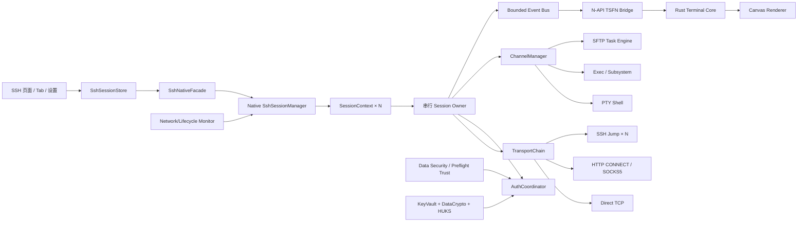
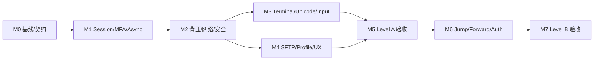
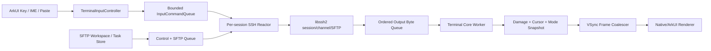

# SSH 模块全面升级执行计划 v2

> 文档状态：权威执行计划
> 文档版本：v2.1
> 盘点日期：2026-07-29 Asia/Shanghai
> 目标平台：HarmonyOS NEXT，API 23
> 初始审计分支：`codex/cloud-data-lifecycle-root-fix`
> 初始审计 HEAD：`6a9d430b1`
> 初始本地 `main`：`23940521a`
> 跨端 UX 增补审查：2026-07-30 Asia/Shanghai，参考工作树 `codex/rustdesk-control-plane-v3@bf7a0448f`
> 终端输入与 SFTP 专项复审：2026-08-01 Asia/Shanghai，`main@4c22e1f4c`
> 专项复审内容：物理键盘延迟/异常字符、终端内核与渲染、Pad/PC 双栏 SFTP、ArkUI 拖放与本地文件授权边界
> 外部源码锁定：见第 3 节
> 本文只定义升级路线、接口契约、验证和交付门槛；编写本文时不修改 SSH、RDP、RustDesk、VNC 或云数据代码。

本文取代 `docs/SSH_MODULE_UPGRADE_PLAN.md` 中作为未来执行依据的旧审计结论。旧文档保留为历史记录；若两者冲突，以本文和执行时的当前代码为准。

---

## 0. 结论、边界和当前距离

### 0.1 结论

当前 SSH 已经不是演示级空壳。它具备可工作的 SSH2 连接、密码/公钥认证、基础 keyboard-interactive、PTY Shell、exec/subsystem、HTTP CONNECT/SOCKS5、主机密钥二次校验、异步连接、基础 SFTP、Rust VT 核心和 Canvas 增量渲染。

剩余工作不是简单补几个按钮，而是把现有“单活动会话的可用实现”升级成：

1. 生命周期、认证和输出不会互相串扰的多会话客户端。
2. 遇到 MFA、代理、弱算法、网络切换和后台恢复时行为可解释的生产级客户端。
3. 对 Unicode、resize、OSC、搜索、输入模式和 SFTP 中断有成熟语义的终端产品。
4. 可选支持跳板、转发、agent、证书和企业认证的 OpenSSH 生态客户端。

### 0.2 完成度估算

这是基于代码能力簇的工程估算，不等同于 RFC 条目数量，也不代替真机验收。

| 目标层级 | 当前估算 | 达到下一层的主要缺口 |
| --- | ---: | --- |
| 基础直连 Shell | 60%～70% | 动态 MFA、完整会话隔离、网络恢复、输入/Unicode 边角 |
| 核心 SSH 客户端 | 40%～50% | 多会话、可靠 SFTP、算法策略、异步预检、错误和安全存储 |
| 成熟移动 SSH 终端 parity | 35%～45% | 搜索、reflow、终端协议、任务队列、后台状态、跳板和 UX |
| 企业 OpenSSH 生态 | 约 25%～35% | agent、证书、FIDO2、PKCS#11、GSSAPI、转发、ssh_config |

完成 P0 和 P1 后，日常运维型移动 SSH 的目标完成度应达到 75%～85%。P2/P3 属于企业生态和高级兼容能力，不应阻塞生产级 Shell/SFTP 首发。

### 0.3 不可破坏的产品边界

- SSH 设置栏固定在 `Windows RDP → RustDesk → SSH 终端 → 数据安全` 的相对顺序。
- 终端前景色、字号及后续纯 SSH 终端设置归 SSH 独立栏目。
- SSH 主机指纹管理暂时不迁移；数据安全和连接前预检继续是唯一信任入口。
- RDP、RustDesk、VNC 的设置、会话、数据所有者和网络实现不得因 SSH 升级改变。
- SSH 升级不得引入新的共享云表；配置继续使用既有用户设置、主机、密钥保险库和信任数据边界。
- 执行 HUKS/加密改造前，必须先完成当前账号/云数据生命周期任务的合并和迁移边界确认。
- 未实现能力必须明确显示“不支持”，不能静默改为直连、忽略安全校验或伪造成功。

### 0.4 “完全实现”的三个层级

#### Level A：生产级移动 SSH Shell/SFTP

必须完成 P0/P1，包括多会话隔离、动态 MFA、异步预检、可靠输出、常用终端兼容、可靠 SFTP、网络状态和 API 23 真机矩阵。

#### Level B：企业常用 SSH

在 Level A 上增加单/多跳 ProxyJump、local/remote/dynamic forwarding、agent、SSH certificate、有限 `ssh_config` 导入和安全算法策略。

#### Level C：OpenSSH 高级生态

评估 FIDO2、PKCS#11、GSSAPI/Kerberos、host-based auth、streamlocal、X11、ControlMaster、Kitty graphics/Sixel 等。它们可以明确不支持，不是 Level A 的完成条件。

---

## 1. 当前代码事实

### 1.1 已实现且应保留

| 能力 | 当前证据 | 规划判断 |
| --- | --- | --- |
| DNS、IPv4、IPv6 | `ssh_adapter.cpp` 和 `ssh_key_tool.cpp` 使用 `getaddrinfo(AF_UNSPEC)` | 已实现；补 Happy Eyeballs、地址诊断和测试 |
| HTTP CONNECT | `SshAdapter::connectThroughProxy` | 已实现基础握手；补认证交互、超时和代理诊断 |
| SOCKS5 | 支持无认证和用户名密码 | 已实现基础握手；补 DNS 策略和失败分类 |
| SSH2 非阻塞连接 | libssh2 EAGAIN + socket wait + async N-API connect | 已实现；补并发 pending、多会话 owner 和取消一致性 |
| 密码认证 | `authenticatePassword` | 已实现基础路径 |
| 公钥认证 | `libssh2_userauth_publickey_frommemory` | 已实现基础路径；补 identity 策略和企业认证 |
| keyboard-interactive | 有 callback 和预置响应数组 | 部分实现；动态 prompt 未实现 |
| 主机密钥 | raw blob + libssh2 SHA-256，连接时二次校验 | 当前算法正确；完整 known_hosts 未实现 |
| PTY Shell | PTY、Shell、resize | 已实现；TERM 固定，profile 未实现 |
| exec/subsystem | 独立 channel、stdout/stderr、exit status/signal/EOF | 已实现基础能力；缺 Channel Manager 和 UI profile |
| keepalive/延迟 | 协议级 latency probe | 已实现基础能力；不等于网络恢复 |
| 输出推送 | reader thread + 有界 64 项 TSFN | native 局部有界；ArkTS 端到端背压未完成 |
| SFTP | list/read/write/chunk/delete/mkdir/rename，异步包装 | 已实现单文件基础版 |
| 终端核心 | Rust `vte`、主/备用屏、滚动区、SGR、3000 行历史 | 已实现常用基础语义 |
| 输入 | ArkTS 统一策略、application cursor、mouse、bracketed paste | 已实现基础路径；native 通用输入接口仍为空 |
| 渲染 | Canvas 脏行/快照渲染、选择、复制、粘贴保护 | 已实现基础路径 |
| 独立设置 | SSH accordion、前景色、字号、预览、主机/密钥入口 | 已实现，顺序和所有权不得回退 |

### 1.2 部分实现但尚不能标记完成

| 编号 | 能力 | 当前问题 | 直接风险 |
| --- | --- | --- | --- |
| G-01 | 多会话 | native 有 `g_sessions`，但还有 `g_activeConnection`、单一 `currentSessionId`、单一 `g_pendingSshConnectId` | 输入/关闭目标依赖活动会话，无法形成成熟多 Tab 生命周期 |
| G-02 | 动态 MFA | callback 忽略 prompt 文本、name、instruction、echo，只按数组下标取答案 | PAM、OTP、多轮 MFA 无法可靠完成 |
| G-03 | 预检 | HostList 会构造代理，但遗留 `SshPreflightSheet` 不传代理；probe/key test/install 仍同步阻塞 | 同一主机不同入口行为不一致，可能卡住 ArkUI |
| G-04 | 输出背压 | native TSFN 有上限；ArkTS `terminalOutputQueue` 只有单批 512 KiB 限制，没有总量上限 | UI 忙时 JS 堆可能持续增长，缺失检测语义不足 |
| G-05 | SFTP | 单个 `sftpBusy`，单文件，写最终路径，普通 rename | 中断后暴露半文件，无递归、并发、持久恢复和元数据 |
| G-06 | 终端 parser | CSI/ESC/DEC/SGR 较完整，但无 OSC/DCS/APC handler | title、OSC 8、OSC 52、查询响应和部分 TUI 行为缺失 |
| G-07 | Unicode | 一个 Unicode scalar 一个 cell，`UnicodeWidthChar` 直接算宽度 | combining、emoji ZWJ、variation selector、宽字符边界错误 |
| G-08 | resize | 调整行宽时清空 wrapped 标记，不做完整 reflow | 改窗口/字体后历史行、光标和选择位置可能错位 |
| G-09 | 输入接口 | SSH 的 native `sendKey/sendMouse/sendMouseWheel` 是空实现，ArkTS 手工编码 | 模式逻辑分散，未来 Kitty/IME/鼠标扩展容易分叉 |
| G-10 | 算法策略 | 偏好列表硬编码，包含 SHA-1/ssh-rsa 兼容回退，压缩固定 none | 缺少安全等级、协商诊断、弱算法告警和按主机策略 |
| G-11 | 安全存储 | `SshKey` 注释宣称 HUKS，实际是 PBKDF2 + AES-GCM 应用层加密 | 产品声明和实现不一致，设备级保护与跨设备模型混淆 |
| G-12 | 主机信任 | 每个 RemoteHost 只有一条算法/raw/fingerprint/trust 记录 | 无多 key、轮换、CA、revoked、hashed host 和导入导出 |
| G-13 | 物理键盘输入快路径 | ArkUI 每个按键同步进入 N-API；`sendData()` 与 reader/SFTP 共用 `sessionMutex_`，reader 在锁内最长等待 100 ms `select()` | 单键可被固定网络等待和 SFTP 放大阻塞，直接造成输入卡顿和 UI input block |
| G-14 | IME/物理键盘双通道 | 透明 1×1 `TextInput` 同时使用 `onKeyPreIme`、`onWillInsert` 和 `onChange` 兜底，并在 Tab/Submit 后重新抢焦点 | 国际键盘、组合输入和平台回调差异下存在重复字符、顺序异常和焦点陷阱风险 |
| G-15 | 光标与 grapheme | Renderer 未应用 core 的 `cursorVisible`；core 把宽度 0 combining mark 强制成 1 列且每 cell 只存一个 scalar | `vim/tmux` 可能出现额外光标，重音、Emoji/ZWJ、CJK 边界可能漂移或出现“多余字符” |
| G-16 | 终端渲染桥 | output 在 ArkTS 合并后同步写 core，snapshot 以对象数组跨 N-API，Canvas 逐 cell `fillText` | 大输出时分配、解析、快照和绘制竞争 ArkUI，帧延迟与输入延迟互相放大 |
| G-17 | SFTP 呈现与拖放 | Pad/Phone/PC 共用 `bindSheet`，内容 `maxWidth: 620`，只有远端单列；Pad 仍按非 desktop 走 bottom Sheet | Pad 大面积遮罩/空白，PC/Pad 无本地面板；官方限制使弹窗类组件不能作为完整拖出源 |

### 1.3 完全缺失或尚无产品级接入

- 网络可用性/丢失/属性变化订阅和基于 generation 的自动恢复。
- 多 Tab、后台 SSH 会话列表、会话切换和独立关闭。
- ProxyJump、SSH bastion、多跳链路。
- local、remote、dynamic 和 streamlocal forwarding。
- SSH agent、agent forwarding。
- OpenSSH user/host certificate。
- FIDO2/security key、PKCS#11、GSSAPI/Kerberos、host-based auth。
- OpenSSH 风格 `ssh_config` 导入、Host/Match、Include 和字段优先级。
- 完整 known_hosts 语义。
- OSC、DCS、APC、title、OSC 8、OSC 52、bell 和终端查询响应。
- terminal search、匹配高亮、前后查找、结果上限和搜索 API。
- 完整 grapheme/emoji cell 模型、resize reflow、序列化恢复。
- SFTP 递归队列、原子完成、校验、权限/owner/time、持久任务和可靠断线恢复。
- X11 forwarding、Sixel/Kitty graphics、ControlMaster/ControlPersist。

### 1.4 跨端响应式、无障碍和用户生命周期现状

以下事实来自 2026-07-30 的只读代码审查，是第 7、10、15 节新增 UX/真机门禁的依据：

| 编号 | 当前代码事实 | 用户影响 | 计划判断 |
| --- | --- | --- | --- |
| UX-01 | `BreakpointUtil` 按窗口宽度计算 `sm/md/lg/xl`，但 `SshTerminal` 的方向、虚拟键栏和 Sheet 类型主要按 `isDesktopDevice` 二分 | Pad 被当成大手机；窄窗口 PC 仍保持桌面交互，设备类型和窗口能力互相冲突 | 响应式决策必须改为窗口宽度、触控、指针、物理键盘和折叠姿态的组合 |
| UX-02 | 所有非 `pc/2in1` SSH 会话进入时强制竖屏 | Pad 横屏、分屏和外接键盘场景被破坏；用户原方向偏好被覆盖 | Phone 可以有紧凑默认，但 Pad 不得无条件锁竖屏 |
| UX-03 | 非桌面统一显示固定 94 vp、双行 14 键虚拟键栏，单键高度 36 vp | 窄屏误触风险高；Pad 即使连接实体键盘也持续占用内容高度 | 键栏按可用宽度和输入设备自适应，支持收起、配置和状态可见 |
| UX-04 | SFTP 在所有设备上都是 `SshTerminal` 内单列 Sheet，PC 最大宽度约 620 vp | Phone 操作拥挤；Pad/PC 无双区、拖放、批量和并行查看终端的生产力布局 | SFTP 任务 owner 与 UI 解耦，并定义 Phone/Pad/PC 三种呈现 |
| UX-05 | `aboutToDisappear` 无条件清输出、停止 SFTP 状态并调用全局 `ExtensionLoader.disconnect()` | 返回列表即断线；无法切换会话；传输离页或页面重建后不可恢复 | 页面、会话和传输必须是三个独立生命周期 |
| UX-06 | SSH 页未接入 `remoteDesktopBgFlag`、后台连续任务或网络状态订阅 | Home、锁屏、前后台和网络切换后的连接承诺不可解释 | 纳入 P0-5，明确保持、暂停、重连、重新认证和用户停止语义 |
| UX-07 | probe/key test/key install 虽由 UI 显示 loading，但 N-API 仍同步阻塞 1～5 秒 | 动画、取消和返回可能冻结，用户会认为应用无响应 | 纳入 P0-3，所有安全预检和密钥操作必须真正离开 ArkUI 线程 |
| UX-08 | SFTP 上传/下载直接写最终目标，0B 文件被拒绝，任务/URI/checkpoint 只在页面内存 | 中断会暴露半文件；无法跨进程恢复；空文件语义错误 | 纳入 P1-4，临时文件、原子提交、持久 checkpoint 和 0B 必须成为门禁 |
| UX-09 | host-key changed 只展示旧算法，不并排展示旧/新完整指纹；一次点击“更新并继续”即可覆盖信任 | 用户无法有效比对，容易把 MITM 告警当成普通确认 | changed-key 默认阻断；完整比对、复制、核验说明和二次确认必须完成 |
| UX-10 | SSH/SFTP 关键图标、Canvas、虚拟键栏和列表缺少系统化 accessibility/focus 语义；Canvas 不可获焦，隐藏输入框捕获并重获 Tab | 读屏无法理解终端；键盘用户进入终端后难以遍历应用操作 | accessibility 和焦点逃逸是 Level A 条件，不是发布后 polish |
| UX-11 | 现代 SSH 新建流程只有密码/密钥，代理只在旧编辑器出现，且 HTTP CONNECT/SOCKS5 被标为“跳板机” | 新建与编辑能力不一致；可能误导用户以为支持 ProxyJump | 统一 profile 编辑器，能力未实现时准确命名并显式“不支持” |
| UX-12 | 已有基础教程提到 SSH/SFTP/指纹，但没有 MFA、指纹变化、代理认证、后台断线和 SFTP 恢复专项说明 | 用户遇到安全或失败状态时缺少下一步 | 用户文档与结构化错误、帮助入口同步交付 |
| UX-13 | FRP TCP 映射没有独立 transport 语义，用户容易把 frps 地址/端口填入 HTTP CONNECT/SOCKS5 或 SSH 跳板字段；KEX 失败只显示笼统的 `-22` | TCP 已连通但目标不是 SSH 时被误判为登录失败，无法区分控制端口、映射端口、非 TCP 模式和算法不兼容 | 增加 `frp_tcp` 透明映射 profile、首包非消费探测、阶段化错误和专门验收矩阵；FRP Visitor/非 TCP 模式单独立项 |

当前可接受范围仅限“单主机、前台、短时间 Shell”和“小文件、单任务、前台 SFTP”。在完成 P0/P1 及 API 23 真机矩阵前，不得把现状表述为成熟跨端 SSH/SFTP。

### 1.5 必须废弃的过时审计结论

后续实现和评审不得继续引用以下旧结论：

- “SSH 只支持 IPv4”——错误，当前已经使用 `AF_UNSPEC`。
- “SSH 完全没有代理”——错误，已有 HTTP CONNECT 和 SOCKS5。
- “主机指纹使用错误 DER”——错误，当前主机 key 使用 libssh2 raw host key 和 SHA-256。
- “SSH 主连接完全同步”——错误，已有 async connect。
- “TSFN 是无限队列”——错误，当前 native TSFN 上限为 64；真正缺口是 ArkTS 端到端总量和序列协议。
- “没有 exec/subsystem/stderr/exit status”——错误，当前已有基础实现。

---

## 2. 现有代码位置和冲突边界

### 2.1 Native/C++

- `entry/src/main/cpp/ssh/ssh_adapter.cpp`
  - transport、握手、认证、PTY、Shell、exec/subsystem、SFTP、reader。
- `entry/src/main/cpp/ssh/ssh_adapter.h`
  - 当前 SSH adapter 对外能力。
- `entry/src/main/cpp/ssh/ssh_key_tool.cpp`
  - 私钥解析/生成、远端 key probe、key auth test、proxy probe。
- `entry/src/main/cpp/ssh/ssh_algorithm_prefs.h`
  - 当前硬编码算法偏好。
- `entry/src/main/cpp/extensions/extension_loader_napi.cpp`
  - session map、global active context、async work、TSFN 和 ArkTS 导出。

### 2.2 Rust

- `rustdesk_ffi/src/terminal_core/parser.rs`
- `rustdesk_ffi/src/terminal_core/terminal.rs`
- `rustdesk_ffi/src/terminal_core/grid.rs`
- `rustdesk_ffi/src/terminal_core/cell.rs`
- `rustdesk_ffi/src/terminal_core/snapshot.rs`
- `rustdesk_ffi/src/terminal_core/ffi.rs`
- `rustdesk_ffi/src/terminal_core/tests.rs`

### 2.3 ArkTS/UI

- `entry/src/main/ets/pages/SshTerminal.ets`
- `entry/src/main/ets/components/NativeTerminalRenderer.ets`
- `entry/src/main/ets/components/TerminalEmulator.ets`
- `entry/src/main/ets/services/ExtensionLoader.ets`
- `entry/src/main/ets/services/SshTerminalInputPolicy.ets`
- `entry/src/main/ets/services/SshTerminalScrollPolicy.ets`
- `entry/src/main/ets/services/SshSettingsService.ets`
- `entry/src/main/ets/services/SshPreflightService.ets`
- `entry/src/main/ets/components/SshPreflightSheet.ets`
- `entry/src/main/ets/pages/HostListPage.ets`
- `entry/src/main/ets/services/KeyVaultService.ets`
- `entry/src/main/ets/services/DataCrypto.ets`
- `entry/src/main/ets/model/RemoteHost.ets`
- `entry/src/main/ets/model/SshKey.ets`

### 2.4 当前活动分支的冲突门禁

当前活动云数据任务正在修改：

- `DataCrypto.ets`
- `KeyVaultService.ets`
- `SshPreflightService.ets`
- `HostListPage.ets`
- 账号 scope、敏感数据屏障和会话清理相关服务。

因此 SSH 代码实施必须等该任务闭环后，从同步后的 `main` 开始。不得在该活动分支直接并行修改上述文件。执行时如果这些文件仍有未合并改动，SSH 任务只能做不重叠调查和测试准备。

---

## 3. 成熟项目源码和 OpenHarmony 官方约束

### 3.1 外部源码锁定

| 项目 | 审计提交 | 重点文件/能力 | 使用边界 |
| --- | --- | --- | --- |
| OpenSSH portable | `7e446d3f5917c2f2770981a89d0e54d5d064bf0c` | `readconf.c`、`sshconnect2.c`、`authfd.c`、`channels.c` | 参考协议、配置和测试语义，不复制代码 |
| libssh2 | `566c9f2c5d35b5dc68b9e50cfc3b06cb1e2fbd0d` | direct-tcpip、forward listen、SFTP POSIX rename、agent/X11 API | 复用项目已有依赖可提供的 API |
| xterm.js | `904ae935269eef5ec6a1415b64463c3d02eff1eb` | parser、OSC/DCS、受限 payload、search addon | 参考终端语义、资源上限和测试 |
| Alacritty | `852e971cddfabe222d2d5bcda466e130f53af207` | grid resize/reflow、wide cell、search | 参考 reflow、cursor、history 不变量 |
| ConnectBot | `5d414b03eb7d2a7eaff2c2919fcabe96ab89ea00` | `PromptManager.kt`、TerminalBridge、移动端会话 UX | 参考可取消异步 prompt 和移动生命周期 |

OpenSSH `readconf.c` 当前覆盖 `IdentityFile`、`CertificateFile`、`ProxyJump`、`LocalForward`、`RemoteForward`、`DynamicForward`、`ControlMaster`、`ControlPersist`、GSSAPI、PKCS#11、SecurityKey、RequestTTY、SessionType、Compression、RekeyLimit、KexAlgorithms、HostKeyAlgorithms 等。本项目不会一次性复制全部字段，而是以安全白名单逐阶段兼容。

### 3.2 许可证和供应链

- OpenSSH：BSD 风格；只参考行为和测试。
- libssh2：BSD-3-Clause；继续使用现有依赖，升级时更新 SBOM、NOTICE、provenance 和哈希。
- xterm.js：MIT；只参考语义，不移植 TypeScript 源码。
- Alacritty：Apache-2.0；只参考语义和测试。
- ConnectBot：Apache-2.0；只参考移动交互和 prompt 生命周期。
- 任何新增 Rust/C/C++ 依赖必须经过 API 23、双 ABI、许可证、CVE、体积、线程模型和可维护性审查。

### 3.3 OpenHarmony 官方约束

| 官方资料 | 必须进入实现的约束 |
| --- | --- |
| [Socket connection](https://gitee.com/openharmony/docs/blob/master/zh-cn/application-dev/network/socket-connection.md) | 应用退后台后 Socket 可能断开；回前台通信失败时必须按错误重建 Socket |
| [Network connection manager](https://gitee.com/openharmony/docs/blob/master/zh-cn/application-dev/network/net-connection-manager.md) | 使用 `netAvailable`、`netLost`、`netCapabilitiesChange`、`netConnectionPropertiesChange` 驱动状态机 |
| [N-API thread safety](https://gitee.com/openharmony/docs/blob/master/zh-cn/application-dev/napi/use-napi-thread-safety.md) | worker 不能直接操作 ArkUI；跨线程回调使用线程安全函数并定义关闭顺序 |
| [TaskPool](https://gitee.com/openharmony/docs/blob/master/zh-cn/application-dev/arkts-utils/taskpool-introduction.md) | 阻塞/耗时操作离开 UI 线程；不可序列化 native session 不直接作为 TaskPool 参数 |
| [HUKS](https://gitee.com/openharmony/docs/blob/master/zh-cn/application-dev/reference/apis-universal-keystore-kit/js-apis-huks.md) | 使用 alias、generate/import/delete、init/update/finish/abort session；错误时必须 abort |
| [Responsive grid](https://gitee.com/openharmony/docs/blob/df698866bbb5e25aa24c54ca7d818bc01d469c6f/en/application-dev/ui/arkts-layout-development-grid-layout.md?skip_mobile=true) | 以当前窗口宽度而非物理设备名称作为主要布局输入；自由窗口、分屏和旋转后重新计算 |
| [UIAbility lifecycle](https://gitee.com/openharmony/docs/blob/115c3238e4c0cd4534bf2543c0b722819e889ba4/en/application-dev/application-models/uiability-lifecycle.md?skip_mobile=true) | 区分 Foreground、Background、Destroy 和 WindowStage 可见/焦点事件，保存可恢复状态并明确资源重新申请 |
| [Continuous task](https://gitee.com/openharmony/docs/blob/3603a38ee6e0043b79dcf4ba42e4c806dca4f507/en/application-dev/background-task-management/background-task-overview.md) | 用户可感知的长时间 SFTP 使用 `dataTransfer` 连续任务和通知；不能仅声明权限而不建立任务 owner |
| [Accessibility attributes](https://gitee.com/openharmony/docs/blob/7084dbcbc98086006a81c83224e0c45fa7f4d342/zh-cn/application-dev/reference/apis-arkui/arkui-ts/ts-universal-attributes-accessibility.md) | 无文本图标提供 `accessibilityText`，危险操作用 `accessibilityDescription` 说明后果 |
| [Focus navigation](https://developer.huawei.com/consumer/cn/doc/design-guides/hmi-focus-0000001748650376) | Pad/PC 支持 Tab、Shift+Tab、方向键、Esc、Shift+F10；所有可交互控件可遍历且选中态与获焦态分离 |

补充原则：

- 实现前以本机 API 23 SDK 和项目本地 API 23 文档为最终接口依据。
- 不能因为 master 文档出现某接口，就假设 API 23 可用。
- HarmonyOS URI/file picker 授权可能只在当前生命周期有效；SFTP 持久任务必须保存可恢复元数据，而不是盲目持久化临时 URI。
- Pasteboard 读取必须来自明确用户动作；OSC 52 默认关闭。
- 后台保持连接不是永久承诺；必须控制功耗、重试次数和系统限制。

### 3.4 跨端人因和成熟产品基线

以下产品作为体验和行为基线，不引入源码依赖：

| 基线 | 本计划采用的成熟语义 |
| --- | --- |
| ConnectBot | 移动 SSH prompt 可取消、会话与页面分离、移动终端输入和生命周期 |
| ServerBox | 同一 SSH/SFTP 产品覆盖 Phone 和桌面，按平台改变工作区和信息密度 |
| Tabby | 多 Tab、分屏、会话恢复、可配置快捷键、多行粘贴保护、桌面 SSH 工作区 |
| WinSCP | 本地/远端文件工作区、后台传输队列、并发控制、临时文件、自动续传和冲突处理 |
| xterm.js / Alacritty | 终端序列、搜索、链接安全、Unicode、history 和 resize reflow |

人因原则：

- 频繁、高风险和破坏性操作必须区分视觉层级，不能依靠颜色作为唯一提示。
- 触控目标按可用空间保持稳定热区；不能为了同一行塞入更多操作而把四个以上高频动作压缩到窄屏。
- 修饰键锁定、传输运行、网络丢失、重连、主机指纹改变必须持续可见，避免 mode error。
- 用户离开页面、切后台、关闭会话、取消任务和退出账号是不同意图，不能共用一个隐式 `disconnect`。
- Phone 优先单手和软键盘可达；Pad 优先横屏、外接键盘和指针；PC 优先自由窗口、快捷键、右键、拖放和并行信息。

---

## 4. 目标架构



### 4.1 分层责任

#### SshSessionStore

- 保存 UI 可观察 session 列表、active tab、连接状态和非敏感摘要。
- 不持有 libssh2 指针、明文私钥、密码、OTP 或 proxy 密码。
- 页面销毁不等于自动关闭所有后台 session；关闭策略由用户设置和系统状态决定。

#### SshNativeFacade

- SSH 专用接口；不得复用“当前活动远程桌面”作为隐式目标。
- 所有操作显式携带 `sessionId`，channel 操作携带 `channelId`。
- 保留旧 ExtensionLoader 包装一个兼容版本，再逐步移除。

#### SshSessionManager

- 创建、查找、激活、重连和关闭多个 SessionContext。
- `g_activeConnection` 仅保留给尚未迁移的通用远程桌面路径；SSH 新接口不依赖它。
- 每个异步连接有独立 pending record，不再使用单一 `g_pendingSshConnectId`。

#### SessionContext

- 独占 transport、libssh2 session、auth broker、channel manager、event queue、generation、metrics 和 cancel token。
- 同一 libssh2 session 只能由一个串行 owner 驱动。
- 任何异步结果返回前验证 `sessionId + generation + lifecycle`。

#### Rust Terminal Core

- 是终端状态唯一真相：parser、screen、history、selection、modes、search。
- ArkTS 不重放历史、不解析 ANSI、不猜 cursor/mouse mode。
- Renderer 只消费 snapshot/diff。

### 4.2 线程和关闭顺序

- ArkUI 主线程：用户输入、状态绑定、轻量事件消费、绘制调度。
- SSH worker：DNS/transport/KEX/auth/channel 串行状态机。
- SFTP：任务可并发排队，但每个 session 的 libssh2 调用回到该 session owner。
- terminal core：按 handle 串行写入和快照。
- crypto：按现有 DataCrypto/未来 HUKS 的线程约束串行化。

固定关闭顺序：

1. lifecycle 进入 `Closing`，generation 递增。
2. 拒绝新命令和 prompt response。
3. 取消 reconnect、SFTP 和等待中的认证。
4. 停止 reader/producer。
5. 发送 channel EOF/close，关闭 libssh2 session 和 socket。
6. 推送最终结构化状态；迟到事件被 generation 丢弃。
7. 停止 TSFN 接收并释放 TSFN。
8. 清理队列、临时文件句柄和明文 secret。
9. 从 manager 移除 context。

### 4.3 Session 状态机

```text
Created
  -> Resolving
  -> Connecting
  -> ProxyHandshake / JumpConnecting
  -> SshHandshake
  -> HostVerification
  -> Authenticating
  -> Ready

Ready -> NetworkLost -> ReconnectScheduled -> Resolving
Ready -> Closing -> Closed
任意非终态 -> Cancelling -> Closed
任意状态 -> Failed(retryable, userAction)
```

规则：

- `HostVerification` 永远不能被重连、代理或跳板绕过。
- 重连生成新 epoch；旧 channel 和旧 callback 不可复用。
- PTY 重连不得伪装成原 shell 仍存活。默认新建 shell并提示；如果用户使用 tmux/screen，由用户或 profile 恢复。

### 4.4 Authentication 状态机

```text
DiscoverMethods
  -> PublicKey / Password / KeyboardInteractive / Agent / Certificate
  -> PromptPending
  -> PromptAnswered / PromptCancelled / PromptTimeout
  -> PartialSuccess -> DiscoverMethods
  -> Authenticated / Failed
```

必须支持：

- server method list 和用户 preferred methods 的交集。
- `partial success` 后继续下一方法。
- prompt 的 name、instruction、text、echo、序号和轮次。
- 单轮多个 prompt。
- 用户取消、超时、页面销毁、网络断开和 account scope 清理。
- 限制自动提交次数，避免账户锁定。

### 4.5 Channel 状态机

```text
Opening -> Open
Open -> EofReceived / EofSent
Open -> ExitStatus / ExitSignal
Open -> Closing -> Closed
任意状态 -> Failed
```

Shell、exec、subsystem 共用 ChannelContext，分别配置 PTY、环境、command/subsystem 和流处理。

### 4.6 SFTP 任务状态机

```text
Queued -> Inspecting -> AwaitingConflictDecision -> Transferring
Transferring -> Paused / Cancelling / Verifying
Verifying -> Committing -> Completed
任意非终态 -> Failed(retryable, checkpoint)
```

任务记录只保存恢复所需元数据：profile、方向、远端路径 hash/规范化路径、大小、offset、临时文件名、mtime、校验策略、stage 和错误。不得把明文凭据写入任务表。

### 4.7 跨端交互与页面/会话/任务生命周期契约

响应式上下文不能只暴露 `isDesktopDevice`，至少包含：

```text
windowWidthClass: compact / medium / expanded / large
touchAvailable
pointerAvailable
physicalKeyboardAvailable
foldPosture
orientation
safeInsets
imeInsets
```

布局契约：

- Phone compact：
  - 终端为主视图。
  - 工具栏只保留返回、会话状态和“更多”；SFTP/旋转/搜索进入可达菜单。
  - 虚拟键栏可收起、可配置；修饰键锁定状态持续可见。
  - SFTP 使用可滚动全高/大半模态，不在单行压缩四个以上操作。
- Pad medium/expanded：
  - 不无条件锁定竖屏。
  - 物理键盘存在时默认收起虚拟键栏。
  - SFTP 可用侧栏或终端/文件双区；横竖屏和分屏后保持选择、路径、滚动和任务状态。
  - 支持指针 hover、右键和标准焦点导航。
- PC/2in1 large：
  - 支持多 Tab、分屏、会话列表和工作区恢复。
  - SFTP 为可停靠工作区或独立 Tab，支持本地/远端双区、拖放、批量和队列。
  - 360 vp 最小自由窗口必须切换紧凑结构，不能因为设备类型保持超宽桌面工具栏。
  - 定义离开终端输入焦点的标准快捷键，并允许 Tab 遍历标题栏、会话栏和 SFTP。

生命周期契约：

```text
RouteDisappear != AbilityBackground != WindowHidden != UserClose != AccountTransition
```

- Route/page 只绑定当前视图，不拥有 SSH socket 或 SFTP task。
- 用户返回时提供“保持会话”或按明确策略返回会话列表；不得无提示全局断连。
- Ability background 时根据用户设置和系统能力进入保持、暂停或受控关闭，并发布可感知通知。
- WindowStage 重新可见/获焦时执行 health check，不把 stale socket 直接显示为 Connected。
- UserClose 停止目标 session；AccountTransition 取消全部 prompt/task/session 并等待安全清理完成。
- SFTP task 可在终端 Sheet 关闭后继续；只有明确取消或策略终止才结束。

---

## 5. 接口和数据契约

### 5.1 建议的 SSH 专用操作

```text
createSshSession(profileSnapshot) -> sessionId
connectSshSession(sessionId) -> Promise<ConnectResult>
cancelSshConnect(sessionId)
respondSshAuthPrompt(sessionId, requestId, responses)
cancelSshAuthPrompt(sessionId, requestId)
openSshShell(sessionId, options) -> Promise<channelId>
execSshCommand(sessionId, command, options) -> Promise<channelId/result>
openSshSubsystem(sessionId, name, options) -> Promise<channelId>
writeSshChannel(sessionId, channelId, bytes)
resizeSshPty(sessionId, channelId, cols, rows, pixelWidth, pixelHeight)
sendSshSignal(sessionId, channelId, signal)
closeSshChannel(sessionId, channelId)
reconnectSshSession(sessionId)
closeSshSession(sessionId)
listSshSessions()
activateSshSession(sessionId)
startSftpTask(sessionId, taskSpec) -> taskId
controlSftpTask(taskId, pause/resume/cancel/retry)
```

旧接口保留薄包装时必须明确：

- 包装只操作包装自己创建的 session。
- 不再从全局 active adapter 猜测目标。
- 兼容窗口至少一个发布版本。

### 5.2 事件 envelope

每个事件必须包含：

- `schemaVersion`
- `kind`
- `sessionId`
- `sessionGeneration`
- `channelId`、`taskId` 或 `requestId`
- `sequence`
- `monotonicTimestampNs`
- `priority`
- `payload`

事件分三条有界通道：

1. Control：状态、错误、认证 prompt、host-key；不得被输出淹没。
2. Terminal：stdout/stderr/PTY bytes；按 sequence 严格有序。
3. Progress：SFTP/metrics；允许合并 latest-value-wins，但不能影响终端字节。

### 5.3 输出背压

- native queue 同时限制事件数和总 bytes。
- ArkTS queue 同样限制总 bytes，不能只限制每批。
- 建议初始值：native terminal 4 MiB、ArkTS terminal 4 MiB、单事件 64 KiB、单次 drain 512 KiB；真机压测后冻结。
- 高水位 75%：减少 read batch 或暂停 reader poll。
- 低水位 40%：恢复读取。
- 无法继续背压时进入显式 `OutputOverrun`，记录最后连续 sequence，停止会话或要求用户确认；禁止静默丢字节。
- EOF/error 必须在所有先前 sequence 消费后交付。

### 5.4 结构化错误

```text
code
phase
messageKey
retryable
requiresUserAction
sessionId
generation
channelId/taskId
proxyHop/jumpHop
nativeCause
serverBannerClass
diagnosticId
```

错误阶段至少包括：

- config
- dns
- tcp
- proxy
- jump
- kex
- host-key
- auth
- channel
- terminal
- sftp
- network-lifecycle
- security-storage
- cancelled

用户错误消息不得包含密码、OTP、私钥、proxy secret、完整命令、远端文件内容或 host key raw blob。

### 5.5 Profile 配置分层

#### 全局 SSH 设置

- 终端字体、字号、前景/背景和主题。
- scrollback 上限。
- 多行粘贴保护。
- 默认 TERM、keepalive、安全策略。
- 默认重连策略。
- OSC 52、hyperlink、bell 等安全开关。

#### 每主机 profile

- host、port、username。
- transport：direct/frp_tcp/http_connect/socks5/ssh_jump。
- `frp_tcp` 只表示“由 FRP 暴露的原始 TCP SSH 端点”：App 连接 frps 公网地址和 `remote_port`，底层复用 direct TCP，不在 SSH session 内实现 frps 控制协议、token 或 Visitor。不得把 frps 控制端口、内网 `local_ip` 或 HTTP/SOCKS5 代理字段当作目标。
- credential reference 和 preferred auth。
- host-key policy reference。
- TERM、request PTY、locale、environment、shell/remote command、working directory。
- keepalive、reconnect、algorithm policy override。
- forwarding 和 SFTP policy。

#### 会话临时值

- proxy 密码。
- 一次性 OTP。
- 私钥临时 passphrase。
- prompt response。
- session/channel/task ID、generation。

会话临时值禁止写入 RemoteHost、普通 settings、日志或云记录。

---

## 6. 安全、隐私和威胁模型

| 威胁 | 强制控制 |
| --- | --- |
| MITM/主机冒充 | probe 与最终 connect 使用相同 transport；raw host key 二次校验；变更默认阻断 |
| 跳板替换 | 每一跳独立 host key 验证和错误上下文 |
| 凭据泄露 | credential ref、最短明文生命周期、secure clear、禁止日志和 telemetry |
| MFA prompt 欺骗 | UI 显示目标主机、当前 hop、服务端 instruction；禁止后台静默回答未知 prompt |
| 弱算法降级 | 安全策略默认禁用弱算法；兼容模式按主机显式开启并显示警告 |
| 代理绕过 | profile 明确 transport；配置代理失败时不得回退直连 |
| FRP 端点混淆 | `frp_tcp` 与 HTTP CONNECT/SOCKS5/ssh_jump 分开建模；不能因端口可达就跳过 SSH banner、host key 和算法策略 |
| 输出 DoS | 有界队列、payload 上限、OSC/DCS 长度限制、scrollback 上限 |
| OSC 本地副作用 | OSC 52 默认关闭；远端不能直接操作文件、导航、权限或系统设置 |
| SFTP 路径穿越 | 规范化路径、限制递归、明确 symlink 策略、特殊文件拒绝 |
| 半文件替换 | 同目录 `.partial.<taskId>`、fsync/close、POSIX rename 或明确非原子 fallback |
| forwarding 暴露 | 默认 loopback、端口范围、显式用户授权、连接/流量上限 |
| agent 滥用 | 每次/每 profile 授权、目标约束、签名确认策略、关闭即撤销 |
| 账号切换串数据 | account/session lease、scope barrier、清空 decrypted cache 和 pending prompt |
| 云同步破坏本地设备密钥 | HUKS ciphertext 不作为跨设备唯一副本；迁移可回滚 |

### 6.1 HUKS 和跨设备加密决策

当前真正实现的是主密码派生的 PBKDF2 + AES-256-GCM，而不是 HUKS。推荐采用双层 envelope：

1. 跨设备层继续使用主密码派生 KEK/DEK，保证同账号设备可解密云数据。
2. 设备本地可用 HUKS alias 包装本地缓存的 DEK 或设备级解锁材料。
3. HUKS alias 与 `userId + cryptoVersion + keyVersion` 绑定。
4. 云端不得只保存 HUKS 包装结果，因为其他设备无法解密。
5. 迁移使用新版本前缀和双读：旧格式可读，新写走新格式。
6. alias 缺失、设备重置、账号切换和生物认证取消都必须 fail closed。
7. HUKS session 任一阶段失败调用 abort；删除账号/关闭保护时删除 alias。

如果短期不实施 HUKS，必须先修正 `SshKey.ets` 和产品文案，明确“应用层主密码 AES-GCM”，不能继续宣称硬件保护。

### 6.2 主机指纹边界

- 当前 UI 位置不迁移。
- P0 只保证现有单条 trust 的正确 probe/connect 一致性、变更阻断和账号 scope 安全。
- 完整 known_hosts 作为 P2 独立项目，仍由数据安全和 preflight 呈现。
- 跳板每一跳都必须生成独立 trust record。

---

## 7. 分阶段实施计划

### Phase 0：冻结基线和准备测试（1～2 人周）

#### 目标

在不改变行为的前提下，建立可以证明后续每个改造正确的契约和测试环境。

#### 任务

- 等当前云数据生命周期任务闭环并同步 `main`。
- 创建唯一任务分支 `codex/ssh-terminal-complete-upgrade`。
- 记录 libssh2、OpenSSL、Rust crate、API 23 SDK、Node/Hvigor 和双 ABI 版本。
- 为现有能力建立 current-behavior tests：
  - DNS/IPv6。
  - HTTP CONNECT/SOCKS5。
  - host-key SHA-256/raw。
  - password/public-key。
  - Shell/exec/subsystem。
  - SFTP chunk/resume。
  - terminal scrollback/alternate screen/input。
- 建立 OpenSSH integration fixture：
  - password。
  - public key。
  - PAM keyboard-interactive/OTP。
  - 多种 host key。
  - SFTP。
- 建立 HTTP proxy、SOCKS5 proxy、旧算法 server 和网络故障代理。
- 冻结事件、错误、profile 和迁移 schema。
- 给每个 work package 分配 feature flag 和 rollback owner。

#### 完成证据

- 基线测试结果和已知失败清单。
- 环境/依赖锁定文档。
- schema review。
- 当前行为 HAP 可构建。

### P0-1：SSH 专用 SessionManager 和多会话隔离（3～5 人周）

#### 当前问题

- native session map 存在，但 active input/decoder 仍依赖 global。
- ArkTS ExtensionLoader 只有一个 current session。
- 同时只允许一个 pending SSH connect。

#### 实施

- 新增 `SshSessionManager`、`SshSessionContext`、`SshSessionCommandQueue`。
- 将 SSH connect/cancel/close/input/channel 改为显式 session API。
- 每个 pending connect 独立存储。
- 新增 generation/epoch，拒绝迟到 callback。
- 增加 session list、activate、background、close-one、close-all。
- 旧 global active path 暂留给 RDP/RustDesk/VNC；SSH 不再依赖。
- ArkTS 增加 `SshSessionStore`，页面只订阅对应 session。

#### 测试

- 8 个并发 session，分别连接/取消/关闭/输出。
- 一个连接 KEX 超时不影响另外 7 个。
- 快速切 Tab 时输入只进入 active SSH channel。
- 页面销毁后后台 session 按策略保留，callback 不访问旧页面。
- RDP、RustDesk、VNC 现有会话回归。

#### 完成标准

- 没有 SSH API 通过 `g_activeConnection` 选择目标。
- 没有单一 pending SSH connect。
- 多会话 ASAN/TSAN 或等价并发审计无 use-after-free。

### P0-2：动态 keyboard-interactive/MFA（2～3 人周）

#### 实施

- 新增 `AuthPromptBroker`。
- native callback 复制 name、instruction、所有 prompt text、echo。
- 通过 control event 发出 `auth.prompt`。
- worker 在 condition variable 上等待 ArkTS response、cancel、timeout 或 session close。
- response API 支持一轮多个答案。
- UI 显示主机、端口、jump hop、instruction、prompt 和剩余时间。
- `echo=false` 使用密码输入；`echo=true` 使用普通文本。
- 支持 partial success 后继续其他方法。
- 敏感答案使用后清理。

#### 测试

- 单密码 prompt。
- PAM password + OTP 两轮。
- 同轮两个 prompt。
- prompt 为空、Unicode、超长 payload。
- 用户取消、超时、网络断开、页面销毁。
- 连续错误不超过配置重试数。

#### 完成标准

- 不再使用预置数组作为唯一交互机制。
- Prompt 生命周期可取消、可超时、可在 session close 时释放。

### P0-3：统一异步 preflight/probe/key install（2～3 人周）

#### 实施

- 将 `probeSshHostKey`、`testSshKeyAuth`、`installSshPublicKey` 改为真正 native async work。
- 建立唯一 `SshPreflightCoordinator`。
- HostList 和遗留 SshPreflightSheet 都调用同一 coordinator；确认无路由使用后再删除重复 controller。
- preflight、key auth test、最终 connect 使用同一 immutable `SshTransportSnapshot`。
- 代理失败不得回退 direct。
- 增加 cancel/generation 和 UI progress。
- 代理密码只从一次性 handoff 获取，不写 RemoteHost。

#### 测试

- direct、HTTP CONNECT、SOCKS5 的 probe/auth/connect 三者路径一致。
- proxy 需要密码、错误密码、超时、DNS 失败。
- probe 后 server key 更换，最终 connect 二次校验阻断。
- 页面退出后 async result 不写旧 State。
- UI 线程无 100 ms 以上同步网络调用。

### P0-4：端到端输出背压和事件协议（2～4 人周）

#### 实施

- native event envelope、sequence、generation、channel ID。
- 分离 control/terminal/progress queue。
- ArkTS terminal queue 增加总 bytes、事件数、高/低水位。
- 对 TSFN queue-full 建立暂停/恢复或 session owner 协调。
- EOF/error 按 sequence 收尾。
- diagnostics 暴露 queue bytes、events、high-water、stall duration、overrun。

#### 测试

- `yes`、大日志、二进制控制序列、窗口最小化、慢 renderer。
- 终端 30 分钟持续输出，无无界内存增长。
- queue full 时不静默丢字节、不重复显示。
- close/切 session 时旧 sequence 不进入新 terminal。

### P0-5：网络和前后台生命周期（3～5 人周）

#### 实施

- 新增 `SshNetworkLifecycleMonitor`，使用 API 23 可用网络事件。
- session state 增加 `NetworkLost/ReconnectScheduled/ReauthRequired`。
- 指数退避加抖动；配置最大次数、总时间和后台策略。
- 每次重连重新 DNS、proxy/jump、KEX、host-key、auth、channel。
- session generation 隔离旧事件。
- 前台恢复主动 health check；失败重建 socket。
- 终端清楚显示“连接恢复”和“新 Shell”，不伪造远端进程延续。
- SFTP 任务按 checkpoint 和策略恢复。
- 区分页面离开、窗口隐藏、Ability 后台、用户关闭和账号切换，禁止统一映射为 `disconnect()`。
- SSH session、terminal view 和 SFTP task 分别拥有生命周期；页面销毁只 detach view。
- 后台 SSH/SFTP 仅在用户明确启动且系统允许时申请连续任务，并提供可停止通知。
- 回前台先显示“正在检查连接”，完成 health check 后才恢复 Connected。
- 网络恢复不能自动接受 changed host key，也不能无提示把新 Shell 伪装成旧远端进程。

#### 测试

- Wi-Fi 切换、网络丢失、飞行模式、代理重启、服务器重启。
- 前后台 1/5/30 分钟。
- Home、锁屏、窗口隐藏、返回主机列表、应用任务关闭和进程回收分别测试。
- 重连时 host key 变化必须阻断。
- 用户手动关闭后不得自动重连。
- 后台重试不无限耗电。
- 后台通知停止必须终止正确 session/task，不能误关其他协议。

### P0-6：安全存储和账号 scope（3～5 人周）

#### 实施前置

- 当前账号/云数据生命周期任务已完成。
- 明确跨设备主密码 envelope 与本地 HUKS wrapper 的责任。

#### 实施

- 修正当前 HUKS 错误声明。
- 设计 crypto schema v2、alias 命名、account binding、迁移 journal。
- HUKS wrapper 可选实施；若实施，覆盖 generate/import/delete/session/abort。
- account switch/logout/reset 清空：
  - decrypted key cache。
  - preflight token。
  - auth prompt。
  - pending connect。
  - session credential handoff。
- 旧 `sshKeyData` 只读兼容，优先引用 KeyVault。
- passphrase 不再长期复制到 RemoteHost；迁移到 credential policy/一次性 handoff。

#### 测试

- 老数据升级、升级中崩溃、重复迁移、回滚、alias 缺失。
- 两设备同账号解密。
- 切换账号无 SSH key/trust/prompt 串数据。
- 锁定、退出、关闭加密、重置云数据。
- 日志和备份无明文 secret。

### P0-7：统一错误、取消、诊断和安全清理（2～3 人周）

- 落地结构化错误 schema。
- 所有 async 操作使用统一 cancel token。
- 每个错误映射用户动作：重试、输入密码、更新 trust、修改 proxy、开启兼容算法、联系管理员。
- secure clear password/passphrase/OTP/proxy secret/temporary key。
- hilog 只记录 hash/长度/阶段/错误码。
- 增加 session diagnostics，不上传命令和文件内容。
- fault injection 覆盖每个状态转换。

### P0-8：物理键盘非阻塞快路径和单 owner reactor（专项新增）

- 按第 18.4 节 WP-T0～WP-T3 实施输入指标、native 有界队列、单 session reactor、IME 和焦点模型。
- ArkUI input callback 不得直接调用 `libssh2_channel_write()` 或等待 session mutex/socket。
- reader、writer、resize 和 SFTP 收口到单 owner；SFTP slice 不能饿死 terminal input。
- 此项是物理键盘可用性和 APP_INPUT_BLOCK 的 P0 发布阻断，不得后置到一般终端 polish。

### P0-9：SFTP 数据完整性底线（专项新增）

- 按第 18.6 节 WP-S0 实施 0B、partial、resume identity、verify、atomic commit 和取消语义。
- 双栏和拖放仍在 P1，但任何新入口只能创建可靠 task，不能继续 direct-to-final。
- 断点续传不能只按文件名/offset 推断同一文件；身份不匹配必须进入 conflict decision。

P0 退出条件：

- 多 session、MFA、async preflight、端到端背压、网络恢复、安全存储决策和结构化错误全部有实现及失败路径测试。
- WP-T0～WP-T3 的输入快路径、单 owner reactor、IME/焦点正确性达到第 18.10 节指标。
- WP-S0 的 partial/resume/verify/atomic commit 通过第 18.11 节故障矩阵。
- RDP/RustDesk/VNC 回归通过。

### P1-1：终端 parser、模式和安全事件（4～6 人周）

- 增加受限 OSC、DCS、APC 解析。
- 实现 title、bell、OSC 8 hyperlink。
- OSC 52 默认关闭；开启时仍需本地授权策略。
- 实现 DA/DSR/CPR 等必要终端查询并通过 channel 返回响应。
- 补 origin/insert/focus reporting、DEC 私有模式和 charset 边角。
- 未支持序列安全忽略，不能污染后续 parser 状态。
- payload、参数个数、数值和嵌套设置上限。
- parser chunk-invariance、fixture、property test、fuzz。

### P1-2：Unicode、grapheme、reflow、selection 和 search（4～7 人周）

- cell 从单个 `char` 升级为 grapheme/cluster 表示。
- 支持 combining、variation selector、emoji ZWJ、wide continuation。
- 设计 ambiguous width 策略，默认与常见 xterm/server locale 兼容。
- resize 保留 wrapped logical lines、cursor、selection、history 和 viewport。
- 参考 Alacritty 的 reflow 不变量，不复制实现。
- 增加 search API：
  - plain/regex/case/whole-word。
  - next/previous。
  - highlight limit。
  - result count 和当前索引。
  - resize/output 后增量更新。
- search 不阻塞 UI；超大 history 有时间预算和取消。

### P1-3：统一 terminal input encoder（2～4 人周）

- terminal core 暴露当前 input modes。
- 新增显式 `sendTerminalKey/sendTerminalMouse/sendTerminalPaste`。
- ArkTS 只产生语义事件：key、text、modifiers、mouse position/button/wheel。
- encoder 负责 normal/application cursor、keypad、function keys、modified arrows、mouse modes。
- IME preedit 不发送；只发送 commit。
- CJK/emoji soft insert、删除和组合输入有测试。
- Kitty keyboard protocol 作为能力开关后置。
- 多行粘贴始终经过本地保护，bracketed paste 只改变 wire 包装。

### P1-4：SFTP 可靠任务引擎（5～8 人周）

#### 功能

- 文件/目录上传下载。
- 递归遍历、进度、取消、暂停、重试。
- 可配置并发，默认每 session 1～2。
- conflict：询问、覆盖、跳过、重命名、全部应用。
- remote/local stat、size、mtime、权限。
- chmod/time；chown 只在能力和权限允许时展示。
- symlink：默认不跟随；可选择复制链接或在受限范围跟随。
- 特殊文件拒绝。
- `.partial.<taskId>` 和同目录原子 rename。
- `libssh2_sftp_posix_rename` 可用时使用；不支持时明确 fallback。
- fsync 能力探测。
- checksum 可选；优先大小+mtime，强校验需远端命令能力或协议扩展。
- checkpoint 持久化，凭据不持久化。
- URI 权限失效时要求用户重新授权。
- 0B 文件是合法文件，必须正确上传、下载、校验和完成。
- 单文件大小上限来自产品策略和真机资源测试，不能把 512 MiB 硬编码错误同时作为“空文件或超限”。
- 关闭 SFTP 面板、切换终端 Tab 或页面重建不能终止任务；运行任务进入全局传输队列。

#### 跨端 UI

- Phone：
  - 文件操作进入分层菜单，目录导航、选择、传输状态和取消动作在窄屏保持可达。
  - 运行任务可最小化到全局队列，并从通知/会话页重新进入。
- Pad：
  - 支持终端/SFTP 双区或侧栏；物理键盘和指针场景提供右键、批量选择和快捷键。
  - 横竖屏/分屏变化不丢目录、选择和任务状态。
- PC/2in1：
  - 本地/远端双面板或等效工作区、拖放、排序、列信息、批量、队列和冲突对话框。
  - SFTP 不再是遮挡整个终端的固定宽度单列模态。

#### 限制

- 最大递归深度、文件数、总大小、单文件大小、路径长度。
- 规范化 `.`、`..`、绝对路径和符号链接目标。
- 失败项清单和幂等 retry。

#### 测试

- 0B、4 KiB、32 MiB、1 GiB。
- 深层目录、空目录、Unicode 文件名、权限拒绝、空间不足。
- 中断恢复、服务器重启、partial 文件、同名冲突。
- symlink loop、path traversal、特殊文件。

### P1-5：PTY/profile、算法和诊断（3～5 人周）

- TERM 可配置，默认 `xterm-256color`。
- requestTTY：auto/yes/force/no。
- session type：shell/exec/subsystem/none。
- locale、环境变量白名单、remote command、working directory。
- keepalive、connect timeout、channel timeout。
- algorithm policy：
  - modern 默认。
  - compatibility 按主机显式开启。
  - custom 仅高级用户。
- 弱算法 SHA-1/ssh-rsa 默认禁用或强警告。
- 显示协商 KEX/host key/cipher/MAC/compression/server banner。
- compression 开关和 CPU/流量基准。
- rekey 时间/流量阈值和长连接测试。

#### FRP TCP 透明映射与 KEX 诊断

- `frp_tcp` 是 direct TCP 的显式产品语义，不是内置 frpc；配置只包含公网 `frps host`、映射 `remote_port`、目标 SSH 凭据和 host-key policy。
- 仅接受 FRP `type=tcp` 的原始字节转发。HTTP/HTTPS、UDP、STCP、XTCP、Visitor 和 frps 控制端口必须明确显示为不支持或进入独立能力流程。
- `probeSshHostKey`、密钥认证测试和正式 connect 必须使用同一份 resolved transport snapshot；预检不得直连而正式连接走代理，或相反。
- 在 libssh2 KEX 前使用有界、不可消费的 `MSG_PEEK`/等效读取检查首包，至少区分 SSH identification、HTTP 响应、TLS record、空连接和未知非 SSH 数据；不得记录完整首包、凭据或远端 payload。
- 将 libssh2 原始错误分为 `transport.not_ssh`、`kex.algorithm_mismatch`、`kex.protocol_error`、`kex.timeout` 和 `hostkey.mismatch` 等稳定诊断原因。`ERR_SSH_KEX_FAILED (-22)` 不能在 UI 中被翻译成“用户名或密码错误”。
- 诊断必须包含阶段、目标端口类型提示、server banner（成功读取时）和下一步；失败时不得自动改走 direct、HTTP CONNECT 或 SOCKS5。

验收：公网 frps `remote_port -> OpenSSH:22` 的密码/公钥/首次 host-key 信任/重连通过；误用 frps 控制端口、错误 `remote_port`、HTTP/HTTPS/UDP 映射、非 SSH 服务、断开和不兼容旧算法均返回可区分错误；高 RTT、丢包、frpc/frps 重启和网络切换不破坏取消、清理和重试语义。

### P1-6：多 Tab 和成熟终端 UX（3～5 人周）

- 会话列表、Tab 切换、关闭确认、后台状态。
- 每 Tab 独立 title、cwd hint、连接状态、latency 和未读输出标记。
- search、copy、paste、select all、clear、scroll to bottom。
- 响应式决策使用第 4.7 节的窗口/输入能力上下文，不再以 `isDesktopDevice` 二分全部 UI。
- Phone：
  - 紧凑标题栏和可达“更多”菜单。
  - 软键盘出现后仍保留可工作的终端行数和关闭/发送/特殊键操作。
  - 虚拟键栏可收起、可配置，触控热区通过真机误触测试。
- Pad：
  - 不无条件锁竖屏。
  - 物理键盘存在时默认隐藏虚拟键栏。
  - 横屏、分屏、侧栏、触控/指针混合和焦点状态均有设计。
- PC/2in1：
  - 自由窗口按当前宽度重排。
  - Tab、分屏、会话栏、右键、hover、拖放和快捷键形成完整工作区。
  - 终端定义 focus enter/escape；Tab/Shift+Tab 可遍历应用控件。
- 设置入口仍保持固定顺序。
- accessibility：
  - 所有图标、虚拟键、文件项、进度、连接状态和危险操作有 label/description/role/state。
  - 选中态、获焦态、按下态和禁用态分别可见且不只依赖颜色。
  - 状态/错误通过读屏可读，但进度更新限频，避免重复轰炸。
  - 字体缩放和高对比。
  - terminal screen reader 采用可选文本快照，不逐 cell 轰炸。
  - changed host key、删除、覆盖、取消传输等操作说明后果。
- i18n：错误 messageKey 与参数分离，不能把 native 英文直接作为唯一用户文案。
- 添加/编辑/preflight Sheet 使用固定 header/footer、可滚动 body 和 IME/小窗约束，操作永远可达。
- 统一现代新建与旧编辑能力；HTTP CONNECT/SOCKS5 不再标成未实现的 ProxyJump/跳板机。
- 用户错误优先给出阶段、影响和下一步；诊断码可复制但不作为唯一文案。

P1 退出条件：

- vim、less、nano、top/htop、tmux、git diff、交互式 REPL 可稳定使用。
- resize/Unicode/search/selection/SFTP/多 Tab 通过真机矩阵。
- Phone/Pad/PC 的布局、焦点、外设、读屏、前后台和传输恢复通过第 10.11～10.12 节。
- 达到 Level A。

### P2-0：FRP Visitor 与非 TCP 模式（按需独立立项）

- `frp_tcp` 不覆盖 STCP、SUDP、XTCP、Visitor、服务端 token 握手或通过 frpc 发现内网服务。
- 如产品必须支持这些模式，先在 transport 层评估移植受支持版本的 frpc 协议核心或受控 sidecar；不得让 SSH adapter 自己拼接 FRP 控制报文。
- 该能力必须独立管理 token/visitor 凭据、连接生命周期、前后台限制、网络切换、版本兼容、日志脱敏和资源上限，并为 SSH 的 probe/connect/close 提供同一条已建立的 byte stream。
- 未完成独立互操作矩阵前，UI 必须明确“不支持”，不能把这些模式伪装成 `frp_tcp`、HTTP CONNECT、SOCKS5 或 ProxyJump。

### P2-1：ProxyJump/Bastion（3～6 人周）

- TransportChain 支持每一跳：
  - host/port。
  - transport。
  - credential ref。
  - host-key trust。
  - timeout。
- bastion 建立后用 libssh2 direct-tcpip 打开目标 transport。
- 最大跳数默认 3。
- 每跳错误展示 hop index/label。
- 取消和关闭从目标向外层传播。
- 每一跳独立信任，不把 bastion key 当目标 key。

### P2-2：端口转发（4～7 人周）

- local forwarding。
- remote forwarding。
- dynamic SOCKS5。
- streamlocal 视 libssh2/API 23 支持情况。
- 每个 forward 有 ID、状态、监听地址、连接数、流量、错误和关闭。
- 默认只监听 loopback。
- 绑定所有接口需要风险确认。
- 端口范围、并发、流量和空闲超时。
- session/network/account close 时可靠释放。
- 后台转发必须遵守系统后台限制。

### P2-3：agent、证书和企业认证（5～10 人周）

- 应用内 agent protocol 和 identity list/sign request。
- agent forwarding 默认关闭，并可按主机确认。
- OpenSSH user certificate：CA、principals、valid-after/before、critical options。
- 多 identity 优先级、IdentitiesOnly。
- FIDO2/security key 做能力探测、用户在场和 PIN/确认 UX。
- PKCS#11、GSSAPI/Kerberos、host-based auth 分别做需求和平台可行性评审。
- 不支持时明确显示，不用密码自动降级掩盖策略失败。

### P2-4：安全子集 `ssh_config`（3～6 人周）

首批支持：

- Host pattern。
- HostName、Port、User。
- IdentityFile/CertificateFile 引用映射。
- PreferredAuthentications。
- ProxyJump。
- LocalForward/RemoteForward/DynamicForward。
- RequestTTY、SessionType、RemoteCommand。
- ConnectTimeout、ServerAliveInterval/CountMax。
- Compression、RekeyLimit。
- Kex/HostKey/Cipher/MAC policy。

后续支持：

- Include、Match、Canonicalize、Tag。

默认拒绝：

- 任意 shell `ProxyCommand`。
- `LocalCommand`。
- 未经用户确认的外部命令/文件执行。

parser 必须有 precedence、first-value-wins/append 语义测试和安全上限。

### P2-5：完整 known_hosts（独立安全项目，3～6 人周）

- 数据入口仍在数据安全和 preflight。
- 支持 host/port、多算法、多 key。
- hashed hostname。
- wildcard 和 negation。
- `@cert-authority`、`@revoked`。
- host key rotation/UpdateHostKeys 策略。
- 导入/export OpenSSH known_hosts。
- 删除单条、整主机、按算法重信任。
- trust record 版本、来源、最近验证时间。
- 云同步前做隐私评审；hashed hostname 不等于自动安全同步。

### P3：按需求交付的高级能力

- X11 forwarding：没有 HarmonyOS X server 产品形态时明确不支持。
- Sixel/Kitty graphics：先做内存、解码、DoS 和 Canvas/PixelMap 评估。
- Kitty keyboard protocol。
- ControlMaster/ControlPersist：移动后台价值和安全收益不足时不实现。
- SSH tunnel VPN/TUN：涉及系统能力和权限，独立立项。
- mosh：不是 SSH 本身，独立协议和依赖评审。

---

## 8. 文件级改造地图

### 8.1 建议新增 Native 文件

- `ssh_session_manager.h/.cpp`
- `ssh_session_context.h/.cpp`
- `ssh_command_queue.h/.cpp`
- `ssh_transport.h/.cpp`
- `ssh_proxy_transport.h/.cpp`
- `ssh_jump_transport.h/.cpp`
- `ssh_auth_coordinator.h/.cpp`
- `ssh_auth_prompt_broker.h/.cpp`
- `ssh_channel_manager.h/.cpp`
- `ssh_event_bus.h/.cpp`
- `ssh_error.h/.cpp`
- `ssh_algorithm_policy.h/.cpp`
- `ssh_known_hosts.h/.cpp`（P2）
- `ssh_forward_manager.h/.cpp`（P2）
- `sftp_task_engine.h/.cpp`
- `ssh_secure_memory.h/.cpp`

`ssh_adapter.cpp` 最终成为兼容 facade 或单 SessionContext 的底层实现，不继续吸收全部业务。

### 8.2 建议新增 Rust 文件

- `terminal_core/osc.rs`
- `terminal_core/dcs.rs`
- `terminal_core/modes.rs`
- `terminal_core/grapheme.rs`
- `terminal_core/reflow.rs`
- `terminal_core/search.rs`
- `terminal_core/input_encoder.rs`
- `terminal_core/events.rs`
- `terminal_core/limits.rs`

现有 parser/terminal/cell/snapshot 逐步迁移；每次只由 fixture 驱动，不做一次性全量重写。

### 8.3 建议新增 ArkTS 服务

- `SshNativeFacade.ets`
- `SshSessionStore.ets`
- `SshSessionPolicy.ets`
- `SshEventBridge.ets`
- `SshAuthPromptStore.ets`
- `SshNetworkLifecycleMonitor.ets`
- `SshProfileService.ets`
- `SshAlgorithmPolicy.ets`
- `SshTerminalSearchStore.ets`
- `SftpTaskStore.ets`
- `SftpConflictPolicy.ets`

### 8.4 共享文件最小化原则

- `ExtensionLoader.ets`：只添加 SSH facade 过渡，不改变其他协议语义。
- `extension_loader_napi.cpp`：SSH 导出拆分后保留其他协议路径。
- `HostListPage.ets`：只接 SSH 设置入口/profile，不重新排列其他栏目。
- `DataCrypto.ets/KeyVaultService.ets`：只在账号生命周期任务完成后改，且必须有 migration tests。
- `RemoteDesktop.ets`：SSH 不应要求修改其 RDP/RustDesk/VNC 输入/渲染路径。

---

## 9. 数据迁移、兼容和回滚

### 9.1 Schema 版本

新增 SSH profile/event/task/credential/trust schema 都必须有独立 `schemaVersion`。

### 9.2 迁移顺序

1. 只读加载旧 RemoteHost。
2. 生成新 profile snapshot，不删除旧字段。
3. 验证 host、port、credential ref、proxy、trust 映射。
4. 新版本双读，优先新结构。
5. 新写只写新结构和必要兼容字段。
6. 至少一个发布版本后再评估删除旧字段。

### 9.3 特殊迁移

- `sshKeyData`：优先迁移为 KeyVault ref；失败保留旧值并提示。
- `sshKeyPassphrase`：不得继续作为长期默认存储；迁移需用户解锁和确认。
- proxy：`legacy_gateway` 不自动推断为 HTTP/SOCKS/SSH jump，要求用户确认。
- host trust：当前单条记录原地保留，不迁移 UI；P2 known_hosts 再做可逆复制。
- terminal settings：继续通过 `SshSettingsService` namespaced keys 和 legacy alias。

### 9.4 回滚

- 每个大能力有 feature flag。
- 数据迁移 additive，不覆盖无法恢复的旧记录。
- 新 renderer/terminal core schema 可在测试版本切旧路径，但旧路径不能绕过 host-key/credential 安全。
- 关闭功能时仍能安全关闭已有 session/task/forward。
- 回滚不得恢复已撤销 credential、已删除 trust 或旧 account scope cache。

---

## 10. 完整测试矩阵

### 10.1 服务器矩阵

- OpenSSH 当前稳定/default。
- OpenSSH 老版本兼容配置。
- Dropbear 或另一不同实现。
- password only。
- public key only。
- PAM keyboard-interactive/OTP。
- 多方法 partial success。
- ed25519、ECDSA、RSA SHA-2 host key。
- 旧 SHA-1 server，仅在兼容模式通过。

### 10.2 网络和 transport

- IPv4 literal、IPv6 literal。
- A only、AAAA only、双栈。
- 首地址失败、后续地址成功。
- DNS timeout/NXDOMAIN。
- direct。
- HTTP CONNECT 无认证/认证/407/超时。
- SOCKS5 无认证/认证/remote DNS/地址类型。
- FRP `type=tcp`：公网 `frps host:remote_port` 到 OpenSSH 目标、首次信任、密码/公钥、重连和高 RTT。
- FRP 错误端点：控制端口、错误映射端口、HTTP/HTTPS/UDP/STCP/XTCP/Visitor、非 SSH 服务和端口关闭；验证 `-22` 被细分为可行动的 transport/KEX 原因。
- 单跳/多跳 ProxyJump。
- Wi-Fi 切换、断网、代理重启、服务器重启。

### 10.3 认证

- 密码成功/失败/超时/取消。
- OpenSSH/PEM/PKCS#8 私钥。
- 加密/未加密私钥。
- 错误 passphrase。
- keyboard-interactive 多轮、多 prompt、echo true/false。
- partial success。
- agent/certificate/FIDO2 等按阶段增加。
- account switch/logout 时等待 prompt 取消。

### 10.4 主机密钥

- 首次信任。
- 重连匹配。
- key 变化阻断。
- probe/connect TOCTOU。
- 不同端口。
- proxy/jump 每一跳。
- 多算法/rotation/CA/revoked（P2）。

### 10.5 Channel

- PTY shell。
- no-PTY exec。
- stdout/stderr。
- 非零 exit status。
- exit signal。
- EOF/remote close/local cancel。
- resize storm。
- shell + exec + SFTP 并存。

### 10.6 Terminal

- parser 分块不变量：1 byte、随机 chunk、整块。
- CSI/ESC/DEC/SGR。
- OSC/DCS/APC 长度和中断。
- primary/alternate screen。
- scroll region、tab、wrap、insert/origin。
- ASCII、CJK、combining、emoji、ZWJ、invalid UTF-8。
- resize grow/shrink/reflow。
- selection、search、hyperlink、title、bell。
- mouse tracking、bracketed paste、focus、application keys。
- vim、nano、less、top/htop、tmux、git diff、REPL。

### 10.7 SFTP

- 文件和目录。
- 0B/4 KiB/32 MiB/1 GiB。
- resume、cancel、retry。
- `.partial` 和 atomic commit。
- recursive limit。
- permission/space/connection errors。
- Unicode/path length。
- symlink loop/traversal/special files。
- conflict policies。
- URI permission loss。

### 10.8 生命周期和并发

- 8 个 session。
- 并发 connect/cancel。
- 页面销毁/重建。
- 横竖屏/窗口 resize。
- 前后台。
- account switch/logout。
- session close 与 callback 竞态。
- app process restart 后 SFTP task 恢复。

### 10.9 安全

- 日志 secret 扫描。
- 错误对象 secret 扫描。
- crash/backup/telemetry 内容审查。
- OSC injection。
- SFTP path traversal。
- proxy bypass。
- weak algorithm downgrade。
- host-key change。
- forwarding bind exposure。
- agent signing abuse。
- resource exhaustion。

### 10.10 Fuzz/property

- terminal parser。
- OpenSSH key parser。
- proxy handshake parser。
- known_hosts/ssh_config parser。
- SFTP path normalization。
- event envelope decoder。

### 10.11 HarmonyOS API 23 真机

- PC、Pad、Phone 至少各一种产品形态；能力不适用时记录。
- Phone：
  - 320/360/折叠态可用宽度。
  - 竖屏、横屏、软键盘展开/收起、系统字体缩放和安全区。
  - 虚拟键误触、修饰键锁定、长按、复制粘贴和 SFTP 窄屏操作可达。
- Pad：
  - 600～1439 vp 代表窗口，横竖屏和分屏。
  - 触控、外接键盘、鼠标/触控板及运行中热插拔。
  - 物理键盘存在时虚拟键栏策略、终端/SFTP 双区和状态保持。
- PC/2in1：
  - 360 vp 最小自由窗口、840/1440 断点和跨断点拖拽。
  - 键盘、鼠标、滚轮、右键、hover、拖放、多 Tab、分屏和 SFTP 工作区。
- 所有设备验证窗口宽度变化，而不只验证设备全屏分辨率。
- 字号/颜色持久化。
- 设置顺序和 fingerprint 入口。
- 后台/前台/网络切换。
- HUKS/生物认证可用与不可用设备。
- 长时间输出、SFTP 大文件和 24 小时连接。
- Home、锁屏、返回列表、窗口隐藏、任务关闭、进程重启和账号切换的差异化结果。

### 10.12 人因、焦点和无障碍

- Phone 单手：
  - 关键操作在安全区内可达。
  - 320/360 vp 不出现重叠、裁剪或不可关闭 Sheet。
  - 虚拟键、SFTP 操作和 destructive action 有误触/反悔验证。
- Pad/PC 标准键盘：
  - Tab/Shift+Tab 遍历全部应用控件。
  - 方向键在列表/菜单内移动；Enter/Space 激活；Esc 取消；Shift+F10 打开上下文菜单。
  - 终端输入焦点有明确进入和逃逸，不把所有 Tab 永久发送远端。
- 读屏：
  - 返回、旋转、SFTP、连接状态、虚拟键、文件项、进度、取消、删除、覆盖和 host-key changed 可理解。
  - terminal text snapshot 可开启/关闭，输出和进度播报限频。
- 视觉：
  - 系统字体缩放、高对比、深浅主题和色觉缺陷下不依赖单一颜色表达状态。
  - selected/focused/pressed/disabled/error/changed-key 状态可区分。
- 认知：
  - 首次信任和 changed-key 使用不同文案与操作层级。
  - loading 可取消且动画不中断；超过阶段预算时给出可解释状态。
  - 网络恢复明确说明“连接恢复”“新 Shell”或“需要重新认证”，不制造连续性错觉。

---

## 11. 性能、资源和可观测性门槛

阈值先作为目标，Phase 0 在真实设备测量后冻结。

| 指标 | 初始目标 |
| --- | --- |
| 输入到远端写入 P95 | 本地网络不超过 30 ms |
| 远端字节到 terminal state P95 | 不超过 30 ms |
| 远端字节到可见绘制 P95 | 不超过 100 ms |
| ArkUI 单次连续阻塞 | 不超过 16 ms |
| terminal native queue | 默认 4 MiB 上限 |
| terminal ArkTS queue | 默认 4 MiB 上限 |
| OSC/DCS payload | 默认 1 MiB 以下，按协议分别收紧 |
| scrollback | 默认 3000，可配置并有硬上限 |
| connect timeout | 分 DNS/TCP/proxy/KEX/auth 单独预算 |
| cancel 响应 P95 | 不超过 500 ms |
| SFTP cancel 响应 P95 | 不超过 1 s |
| reconnect | 指数退避，有最大次数和总时间 |
| session 数 | 至少 8 个隔离验证 |
| 长连接 | 24 小时无持续内存/线程增长 |

Diagnostics：

- connect phase duration。
- negotiated algorithms。
- queue bytes/events/high-water。
- terminal parse/render duration。
- output overrun。
- SFTP throughput/retry/checkpoint。
- reconnect count/reason。
- session/channel/task count。

不得采集：

- command text。
- terminal output。
- file content/path 原文。
- password、OTP、private key。
- raw host key。

---

## 12. 里程碑、依赖和工作量



| 里程碑 | 内容 | 估算人周 | 出口 |
| --- | --- | ---: | --- |
| M0 | 基线、schema、fixture、依赖锁定 | 1～2 | 可重复测试环境 |
| M1 | SessionManager、动态 MFA、异步 preflight | 7～11 | 多会话和认证可靠 |
| M2 | 背压、网络恢复、安全存储、错误 | 8～13 | P0 完成 |
| M3 | parser、Unicode/reflow、search、input | 10～17 | 终端核心成熟 |
| M4 | SFTP、profile/算法、多 Tab UX | 11～18 | 功能完成 |
| M5 | 互操作、性能、安全、API 23 真机 | 4～7 | Level A 发布候选 |
| M6 | Jump、forward、agent/cert、ssh_config、known_hosts | 18～35 | Level B |
| M7 | 企业矩阵、灰度、文档 | 4～7 | Level B 发布候选 |

Level A 总量约 41～68 人周。两名熟悉 ArkTS/C++/Rust 的工程师并行时，关键路径约 5～8 个月；实际以 Phase 0 fixture、API 23 设备和企业认证范围校准。该估算包含测试和硬化，不只是编码。

---

## 13. 开发流程和跨模组隔离

### 13.1 分支

- 当前云数据任务完成前不启动 SSH 代码分支。
- 之后：同步 `main` → `codex/ssh-terminal-complete-upgrade`。
- 一个大里程碑可拆多个 commit，但仍在唯一活动任务分支。
- 不使用持久 worktree。

### 13.2 Commit 顺序建议

1. tests/fixtures/schema。
2. SessionManager 和兼容 facade。
3. MFA 和 async preflight。
4. event queue/backpressure。
5. network/lifecycle。
6. security storage。
7. terminal parser/Unicode/reflow/search。
8. input encoder。
9. SFTP engine。
10. profile/algorithm/UI。
11. P2 能力分别独立 commit。

### 13.3 每个 commit 的最小证据

- 需求和失败路径测试。
- 受影响状态/线程/所有权说明。
- 资源上限。
- migration/rollback。
- cross-module diff 审计。
- `git diff --check`。
- 对应 native/Rust/ArkTS 测试。
- 强制两项 Hvigor。

### 13.4 强制构建门禁

```sh
source scripts/macos_env.sh
hvigorw --mode module -p module=entry -p product=default default@OhosTestCompileArkTS --analyze=normal --parallel --incremental --no-daemon
hvigorw --mode module -p module=entry -p product=default assembleHap --analyze=normal --parallel --incremental --no-daemon
```

附加门禁：

- Rust terminal tests。
- 双 ABI Rust/OHOS build。
- native SSH tests。
- `ohosTest@OhosTestCompileArkTS`，若任务图缺失则如实记录 blocker。
- Light open-source compliance。
- 子 agent 独立复核。
- API 23 真机矩阵。

### 13.5 不影响其他模组的证明

- RDP、RustDesk、VNC N-API 操作签名无意外变化。
- global active adapter 的旧行为在 SSH facade 迁移阶段保持。
- settings 顺序测试覆盖 RDP/RustDesk/SSH/数据安全。
- SSH 数据模型迁移不写 RDP/RustDesk/VNC 字段。
- SSH network monitor 不控制其他协议 socket。
- SSH terminal core 变化不进入 RustDesk 视频/音频/input path。
- 回归构建和现有 native test 全部通过。

---

## 14. 发布、文档和运维

### 14.1 Feature flags

- multiSession。
- dynamicMfa。
- boundedOutputV2。
- networkReconnect。
- terminalOsc。
- terminalReflow。
- sftpTaskEngine。
- algorithmPolicy。
- proxyJump。
- portForwarding。
- agentAuth。
- knownHostsV2。

安全修复不能通过关闭 flag 回退到绕过 host-key 或泄露 secret 的旧行为。

### 14.2 灰度

1. 开发/内部 fixture。
2. API 23 实验设备。
3. 少量真实主机和代理。
4. Level A beta。
5. 24 小时 soak 和大文件。
6. 正式发布。

### 14.3 用户文档

- 支持的认证/算法/代理。
- 为什么 host key 变化会阻断。
- 首次信任与 changed-key 的区别、如何复制并通过管理员核验新旧指纹。
- MFA、私钥 passphrase 和 proxy password 区别。
- 后台断线和重连语义。
- SFTP 队列、后台通知、partial/resume、原子提交、冲突和重新授权。
- Phone/Pad/PC 的终端焦点、虚拟键、快捷键、右键和 SFTP 工作区说明。
- 读屏、字体缩放、高对比和终端文本快照入口。
- 跳板/forwarding 暴露风险。
- 当前不支持能力。

### 14.4 运维

- libssh2/OpenSSL/Rust crate CVE 订阅。
- 每次依赖升级跑协议/双 ABI/许可证矩阵。
- 弱算法默认策略随 OpenSSH 安全基线更新。
- 错误码和用户帮助文档保持映射。

---

## 15. 最终完成审计

### 15.1 Level A 完成定义

只有以下证据全部存在，才能宣称“生产级 SSH/SFTP”：

1. 多 session 和 pending connect 完全隔离。
2. 动态 keyboard-interactive 多轮 MFA 通过。
3. probe/key test/install/connect 全部异步且 transport 一致。
4. native/ArkTS 输出有总量上限、sequence 和 overrun 语义。
5. 网络丢失、前后台和重连状态可解释。
6. host-key 首次信任、匹配、变化和 TOCTOU 通过。
7. HUKS 声明与实际实现一致，账号切换不串 secret。
8. terminal parser、Unicode、reflow、search、selection、input 通过 fixture。
9. SFTP 递归、atomic commit、cancel/retry/resume 和路径安全通过。
10. PTY/profile、算法诊断和弱算法策略完成。
11. 页面、session、terminal view 和 SFTP task 生命周期分离；离页、后台、关闭和账号切换行为可解释。
12. Phone/Pad/PC 按窗口宽度和输入能力适配，不再以设备类型二分全部 SSH UI。
13. Pad/PC 标准焦点导航、终端焦点逃逸、图标/状态/危险操作无障碍语义通过。
14. changed host key 完整新旧指纹比对、复制、默认阻断和二次确认通过。
15. API 23 PC/Pad/Phone 第 10.11～10.12 节矩阵通过。
16. 24 小时连接、长输出和后台 SFTP 无资源增长。
17. RDP、RustDesk、VNC 无回归。
18. 两项 Hvigor、native、Rust、合规、子 agent 复核全部通过。

### 15.2 Level B 完成定义

在 Level A 上：

1. ProxyJump 每跳信任和认证通过。
2. local/remote/dynamic forwarding 安全矩阵通过。
3. agent/certificate 和选定企业认证通过。
4. ssh_config 安全白名单、precedence 和 migration 通过。
5. known_hosts v2 在数据安全/preflight 中通过。
6. 企业服务器/代理/账号矩阵和灰度通过。

### 15.3 证据规则

- “代码存在”不等于完成。
- “测试绿”只有在覆盖对应要求时才是证据。
- 模拟器不能替代网络切换、HUKS、外设和后台真机验证。
- 旧 session 构建日志不能替代当前 commit 门禁。
- 找不到缺陷不是完成证明；必须逐项映射需求、测试、运行证据和发布状态。

---

## 16. 执行清单

> 2026-08-04 SSH-only checkpoint：WP-T0～WP-T3 与 WP-S0 已完成代码实现、定向测试和宿主构建门禁；设备矩阵尚未完成。WP-S1 仅完成恢复元数据 Task Store 基础，不能表述为完整任务引擎。其余工作包保持未完成，交由后续 session。

### 开始前

- [ ] 当前活动任务已闭环。
- [ ] `main == origin/main` 且工作树干净。
- [ ] 创建唯一 SSH 任务分支。
- [ ] 读取本文和 SSH test cases/work log。
- [ ] 锁定 API 23、libssh2、OpenSSL、Rust 和 Hvigor。
- [ ] 建立 fixture 和当前行为基线。

### P0

- [ ] SessionManager。
- [ ] 多 pending connect。
- [ ] 动态 MFA。
- [ ] async preflight/key test/install。
- [ ] transport snapshot 一致性。
- [ ] 端到端背压。
- [ ] network lifecycle/reconnect。
- [ ] 页面/会话/terminal view/SFTP task 生命周期分离。
- [ ] 后台连续任务、通知停止和前台 health check。
- [ ] HUKS/声明和账号 scope。
- [ ] 统一错误/cancel/diagnostics。
- [x] WP-T0 输入/渲染可观测基线（代码/宿主测试完成，设备指标待测）。
- [x] WP-T1 非阻塞 terminal input queue（代码/宿主测试完成，设备指标待测）。
- [x] WP-T2 单 owner SSH reactor 和 SFTP 公平调度（代码/宿主测试完成，设备指标待测）。
- [x] WP-T3 物理键盘/IME 单提交和焦点逃逸（代码/宿主测试完成，实体键盘真机待测）。
- [x] WP-S0 partial/resume identity/verify/atomic commit 数据完整性底线（代码/策略测试完成，API 23 provider/网络故障矩阵待测）。
- [ ] 其他模组回归。

### P1

- [ ] OSC/DCS/APC 和终端查询。
- [ ] grapheme/wide cell。
- [ ] resize reflow。
- [ ] search/selection。
- [ ] input encoder/IME/mouse。
- [ ] SFTP task engine/queue/checkpoint/0B/atomic commit。
- [ ] PTY/profile/algorithm policy。
- [ ] `frp_tcp` 透明映射、KEX 首包诊断、`-22` 错误细分和公网端点互操作矩阵。
- [ ] Phone 紧凑布局和可配置虚拟键栏。
- [ ] Pad 横屏/分屏/实体键盘/指针/SFTP 双区。
- [ ] PC 自由窗口/多 Tab/分屏/可停靠 SFTP/拖放。
- [ ] 标准焦点遍历、终端焦点逃逸和读屏文本快照。
- [ ] changed-key 新旧指纹比对、默认阻断和二次确认。
- [ ] 统一现代新建/旧编辑能力和准确代理命名。
- [ ] accessibility/i18n/结构化用户文案。
- [ ] Level A 全量验收。

### P2

- [ ] ProxyJump。
- [ ] FRP Visitor/STCP/SUDP/XTCP 等非 TCP 模式（仅在独立立项后启用）。
- [ ] forwarding。
- [ ] agent/certificate。
- [ ] 选定企业认证。
- [ ] ssh_config。
- [ ] known_hosts v2。
- [ ] Level B 全量验收。

### 每个里程碑

- [x] 定向测试。
- [x] Rust/native/ArkTS 测试（宿主 native 与 ArkTS 编译；ohosTest 未注册）。
- [x] 双 ABI（构建产物门禁完成；设备运行证据待测）。
- [x] `default@OhosTestCompileArkTS`。
- [x] `assembleHap`。
- [x] `git diff --check`。
- [ ] Light 合规。
- [x] 当前会话 self-review（用户已取消独立审查会话）。
- [ ] API 23 真机。
- [x] CURRENT/QUEUE 更新。

---

## 17. 源码和文档索引

### 项目

- `entry/src/main/cpp/ssh/ssh_adapter.cpp`
- `entry/src/main/cpp/ssh/ssh_key_tool.cpp`
- `entry/src/main/cpp/ssh/ssh_algorithm_prefs.h`
- `entry/src/main/cpp/extensions/extension_loader_napi.cpp`
- `entry/src/main/ets/pages/SshTerminal.ets`
- `entry/src/main/ets/pages/HostListPage.ets`
- `entry/src/main/ets/services/ExtensionLoader.ets`
- `entry/src/main/ets/services/SshTerminalInputPolicy.ets`
- `entry/src/main/ets/services/SshSettingsService.ets`
- `entry/src/main/ets/services/SshPreflightService.ets`
- `entry/src/main/ets/services/DataCrypto.ets`
- `entry/src/main/ets/services/KeyVaultService.ets`
- `rustdesk_ffi/src/terminal_core/`
- `docs/SSH_TERMINAL_TEST_CASES.md`
- `docs/SSH_TERMINAL_WORK_LOG.md`

### 外部源码

- [OpenSSH readconf.c](https://github.com/openssh/openssh-portable/blob/7e446d3f5917c2f2770981a89d0e54d5d064bf0c/readconf.c)
- [OpenSSH sshconnect2.c](https://github.com/openssh/openssh-portable/blob/7e446d3f5917c2f2770981a89d0e54d5d064bf0c/sshconnect2.c)
- [OpenSSH authfd.c](https://github.com/openssh/openssh-portable/blob/7e446d3f5917c2f2770981a89d0e54d5d064bf0c/authfd.c)
- [OpenSSH channels.c](https://github.com/openssh/openssh-portable/blob/7e446d3f5917c2f2770981a89d0e54d5d064bf0c/channels.c)
- [libssh2 direct-tcpip](https://github.com/libssh2/libssh2/blob/566c9f2c5d35b5dc68b9e50cfc3b06cb1e2fbd0d/docs/libssh2_channel_direct_tcpip.md)
- [libssh2 SFTP POSIX rename](https://github.com/libssh2/libssh2/blob/566c9f2c5d35b5dc68b9e50cfc3b06cb1e2fbd0d/docs/libssh2_sftp_posix_rename.md)
- [xterm.js OSC parser](https://github.com/xtermjs/xterm.js/blob/904ae935269eef5ec6a1415b64463c3d02eff1eb/src/common/parser/OscParser.ts)
- [xterm.js SearchAddon](https://github.com/xtermjs/xterm.js/blob/904ae935269eef5ec6a1415b64463c3d02eff1eb/addons/addon-search/src/SearchAddon.ts)
- [Alacritty resize/reflow](https://github.com/alacritty/alacritty/blob/852e971cddfabe222d2d5bcda466e130f53af207/alacritty_terminal/src/grid/resize.rs)
- [ConnectBot PromptManager](https://github.com/connectbot/connectbot/blob/5d414b03eb7d2a7eaff2c2919fcabe96ab89ea00/app/src/main/java/org/connectbot/service/PromptManager.kt)
- [ServerBox SSH/SFTP workspace](https://serverbox.lollipopkit.com/)
- [Tabby terminal/SSH features](https://tabby.sh/about/features)
- [WinSCP transfer queue](https://winscp.net/eng/docs/transfer_queue)
- [WinSCP transfer resume and temporary filename](https://winscp.net/eng/docs/resume)
- [xterm.js documentation](https://xtermjs.org/docs/)

### OpenHarmony

- [Socket connection](https://gitee.com/openharmony/docs/blob/master/zh-cn/application-dev/network/socket-connection.md)
- [Network connection manager](https://gitee.com/openharmony/docs/blob/master/zh-cn/application-dev/network/net-connection-manager.md)
- [N-API thread safety](https://gitee.com/openharmony/docs/blob/master/zh-cn/application-dev/napi/use-napi-thread-safety.md)
- [TaskPool](https://gitee.com/openharmony/docs/blob/master/zh-cn/application-dev/arkts-utils/taskpool-introduction.md)
- [HUKS](https://gitee.com/openharmony/docs/blob/master/zh-cn/application-dev/reference/apis-universal-keystore-kit/js-apis-huks.md)
- [Responsive grid](https://gitee.com/openharmony/docs/blob/df698866bbb5e25aa24c54ca7d818bc01d469c6f/en/application-dev/ui/arkts-layout-development-grid-layout.md?skip_mobile=true)
- [UIAbility lifecycle](https://gitee.com/openharmony/docs/blob/115c3238e4c0cd4534bf2543c0b722819e889ba4/en/application-dev/application-models/uiability-lifecycle.md?skip_mobile=true)
- [Background task overview](https://gitee.com/openharmony/docs/blob/3603a38ee6e0043b79dcf4ba42e4c806dca4f507/en/application-dev/background-task-management/background-task-overview.md)
- [ArkUI accessibility attributes](https://gitee.com/openharmony/docs/blob/7084dbcbc98086006a81c83224e0c45fa7f4d342/zh-cn/application-dev/reference/apis-arkui/arkui-ts/ts-universal-attributes-accessibility.md)
- [HarmonyOS focus navigation](https://developer.huawei.com/consumer/cn/doc/design-guides/hmi-focus-0000001748650376)

---

## 18. 2026-08-01 终端输入与双栏 SFTP 专项优化计划

### 18.0 适用范围和优先级覆盖

本节把 2026-08-01 的代码审查、Pad 实机截图、API 23 本地 SDK 和鸿蒙官方资料转化为可执行工作包。若本节与第 7、10、11、12、15、16 节在以下专项上冲突，以本节为准：

- 物理键盘延迟和字符正确性。
- terminal core、光标、Unicode、resize 和渲染。
- SFTP 数据完整性、Pad/PC 工作区、本机文件来源和拖放。
- 专项性能指标、真机矩阵和发布阻断条件。

本节仍是计划，不代表对应代码已经实现或验证。执行时必须从同步后的唯一任务分支开始，并遵守第 13 节门禁。

### 18.1 本次审查的可复核证据

| 证据编号 | 当前路径/事实 | 结论 |
| --- | --- | --- |
| E-T01 | `SshTerminal.ets::sendTerminalBytes()` 每个按键同步调用 `ExtensionLoader.sendData()` | ArkUI input callback 直接进入 native 写路径 |
| E-T02 | `extension_loader_napi.cpp::NapiSendText()` 同步调用 adapter，且逐次 INFO 日志 | 每键存在 N-API、查表、日志和 native 调用固定开销 |
| E-T03 | `ssh_adapter.cpp::sendData()` 在 `sessionMutex_` 内执行 `libssh2_channel_write()` 和 EAGAIN 等待 | 网络可写等待会反向阻塞 ArkUI |
| E-T04 | `ssh_adapter.cpp::readerLoop()` 在同一把锁内执行最长 100 ms `select()` | 即使无输出，单键也可能等待一次 reader poll；SFTP 并发会进一步放大 |
| E-T05 | 隐藏 `TextInput` 同时处理 `onKeyPreIme/onWillInsert/onChange`，Tab 后再次 `requestFocus()` | 存在双提交、IME 生命周期不清晰和焦点陷阱风险 |
| E-T06 | `NativeTerminalRenderer.drawCursor()` 未判断 snapshot 的 `cursorVisible` | 远端请求隐藏光标时仍可能出现额外本地光标 |
| E-T07 | `terminal.rs::print_char()` 使用 `width.unwrap_or(1).max(1)`，cell 只保存 `char` | combining mark 被错误推进一列，grapheme/Emoji/ZWJ 无法正确建模 |
| E-T08 | resize 把现有 `wrapped_rows` 全部清为 false | 历史逻辑行没有真正 reflow，窗口/字号变化后光标和内容可漂移 |
| E-T09 | ArkTS 合并最高 512 KiB output，snapshot 对象数组跨 N-API，Canvas 逐 cell `fillText` | 大输出时 UI 线程承担复制、对象化、解析触发和细粒度绘制 |
| E-S01 | `SftpTransferSheet()` 只有远端单列，内容 `maxWidth: 620` | Pad/PC 不能形成高效双区工作流 |
| E-S02 | Pad 仍按 `isDesktopDevice == false` 使用 bottom `bindSheet` | 实机出现大面积遮罩、空白和不合理操作距离 |
| E-S03 | 当前上传/下载依赖 `DocumentViewPicker.select/save`，没有本地目录 provider、UDMF drag 或常驻 task owner | 只能完成一次性选取/保存，不能形成文件工作区 |
| E-S04 | 鸿蒙官方拖拽文档明确“所有弹窗类组件不支持拖出” | Pad/PC 完整拖放不得继续构建在 Sheet/Dialog/Popup 中 |
| E-S05 | 本地 API 23 `2in1.json` 有 `FolderSelection/FolderAuthorization/FolderObtain`，`tablet.json` 无这些 syscap | PC/2in1 可做授权目录；Pad 必须设计 Picker + 应用传输箱降级 |

### 18.2 不得变更的专项架构决策

1. ArkUI 按键处理不得同步等待 libssh2、socket、SFTP、PTY resize 或 terminal parse/render。
2. 每个 SSH session 由一个 reactor/owner 串行拥有全部 libssh2 session、channel 和 SFTP handle；不能再用跨线程大锁包住网络等待。
3. 物理键盘与 IME 必须只有一次最终提交语义。IME preedit 不上行，只有 commit 上行。
4. 不做本地字符回显。屏幕只显示远端 PTY echo，避免本地状态与 shell 状态分叉。
5. terminal core 是字符、模式、光标、history、selection 和 reflow 的唯一真相；renderer 不另建协议状态。
6. Pad/PC SFTP 不再使用阻塞终端的单列 Sheet。Phone 可保留全高紧凑容器，但拖放不是 Phone 的主操作。
7. 拖放 UI 之前先完成 `.partial`、恢复身份校验、原子提交、取消和错误可恢复；不能把不可靠传输包装成更方便的拖拽。
8. 本机文件能力按 runtime syscap 和用户授权决定，不按设备名称假设可以遍历公共存储。
9. Remote → Local 和 Local → Remote 的默认拖拽语义都是 Copy。Move 必须是独立明确动作，成功后才允许删除源文件。
10. 任何 feature flag 回退都不能恢复同步主线程网络写、host-key 绕过或直接暴露半文件。

### 18.3 目标运行时架构



队列优先级：

1. P0 control：关闭、取消、host-key、auth prompt、错误。
2. P1 terminal input：按键、IME commit、paste chunk、terminal query response。
3. P2 terminal output/read：保证顺序和背压。
4. P3 SFTP control：pause/resume/cancel/conflict decision。
5. P4 SFTP data slice：按预算分片，不能独占 reactor。
6. P5 metrics/progress：允许合并 latest-value-wins。

reactor 每轮必须有公平预算：只要 P1 非空，就在下一个 poll cycle 优先尝试 terminal write；SFTP 单次 slice 大小和连续 slice 数由真机基准冻结。不能通过让多个线程同时调用同一 libssh2 session 来换取表面并发。

### 18.4 终端优化工作包

#### WP-T0：输入和渲染可观测基线（P0，所有终端改造前置）

实施范围：

- 给每个 input event 分配 `sessionId/channelId/sequence/monotonicTimestampNs`。
- 建立以下时间点：ArkUI capture、native enqueue、reactor dequeue、首次 write attempt、write complete、remote bytes read、core parse complete、frame present。
- 去除逐键 INFO 日志；开发诊断使用采样或计数器，默认不记录字符内容。
- 建立字节级 echo fixture：客户端发送的字节、服务端 PTY 收到的字节和客户端渲染字符可逐项比对。
- 记录 input queue depth、age、drop、duplicate、reorder、write EAGAIN 和 session owner stall。

完成门槛：

- 能区分本地输入管线延迟、网络 RTT 和远端 shell echo 延迟。
- 不采集按键文本、命令、密码、OTP 或终端输出。
- 现有卡顿场景有可重复基线，不再只靠主观感受判断。

#### WP-T1：非阻塞 native 输入队列（P0）

实施范围：

- 新增 SSH 专用 `enqueueTerminalInput(sessionId, channelId, bytes, sequence)`；ArkUI 调用只做校验、拷贝/移动和入队。
- 初始队列同时限制事件数和 bytes；控制键/普通小输入立即入队，大 paste 分片。
- API 返回 `accepted/queueFull/sessionClosed/staleGeneration`，不得继续使用无结果 `void` 掩盖失败。
- queue full 时停止接受普通 paste 并向 UI 显示背压；控制键和 cancel 保留独立容量。
- 顺序以 sequence 为准，跨 session/channel 不能共享隐式 active target。

完成门槛：

- ArkUI input callback 内没有 socket wait、mutex wait、libssh2 调用和逐键日志。
- 100000 个生成事件经压力测试无重复、丢失和乱序；故障注入下丢弃必须显式可观测。

#### WP-T2：单 owner SSH Reactor 和公平调度（P0）

实施范围：

- 把 connect、auth、reader、terminal writer、PTY resize 和 SFTP 调用收口到每 session 单一 owner。
- socket poll/select 由 owner 自己执行；生命周期控制通过 command queue 唤醒，不再让 UI 等待 owner mutex。
- 移除 reader 在 `sessionMutex_` 内 100 ms 等待的结构；disconnect 通过 generation、owner stop command 和固定关闭顺序避免 stale pointer。
- terminal write 采用小批量低延迟策略：控制键立即 flush；连续可打印字符最多等待一个极短合并窗口，窗口由真机数据冻结。
- SFTP 按 slice 运行；每轮检查 terminal/control 队列，避免大文件传输饿死输入。

完成门槛：

- 同一 libssh2 session 的调用 owner 可静态审计且运行时断言。
- 并发 SFTP、持续 output、resize storm 下 terminal input P95 达到第 18.10 节。
- disconnect/connect/cancel 压测无 use-after-free、死锁和迟到写入。

#### WP-T3：统一物理键盘、IME 和焦点模型（P0）

实施范围：

- `TerminalInputController` 先处理应用快捷键，再把未消费事件转成 terminal semantic event。
- 物理键盘只走 KeyEvent 路径；隐藏 TextInput 只用于软键盘/IME composition，不再处理同一物理字符的兜底发送。
- 为 composition 建立 `compositionId + revision + commitId`；preedit 只在本地输入法管理，不发送远端。
- commit 账本按短窗口去重；只用于防平台重复 callback，不能按文本内容粗暴吞掉用户真实重复按键。
- 支持 CJK、AltGr、dead key、Caps Lock、国际布局和 surrogate/grapheme 删除语义。
- Tab 在 terminal focus mode 发送远端；定义明确 `Enter terminal focus` 和 `Escape terminal focus`，禁止发送 Tab 后定时抢焦点。
- 应用快捷键与远端快捷键冲突必须可配置并有 UI 说明。
- bracketed paste 仅改变 wire 包装；多行粘贴保护、最大长度和取消仍由本地策略控制。

完成门槛：

- 中文拼音、日文、韩文、重音组合、AltGr、dead key、Emoji 和重复按键测试无双发。
- Tab/Shift+Tab 可以进入和离开终端焦点，Pad/PC 全应用焦点链无陷阱。
- 物理键盘热插拔不重建或丢失 terminal session。

#### WP-T4：成熟终端内核路线决策（P0 决策门，P1 实施）

候选路线：

| 路线 | 优点 | 主要风险 | 决策前必须验证 |
| --- | --- | --- | --- |
| 继续强化当前 Rust `vte` core | 现有 FFI/Canvas 集成成本最低，可渐进迁移 | grapheme、reflow、协议覆盖和长期维护成本最高 | 完整 fixture 差距、修复规模、两年维护成本 |
| 引入 Alacritty/WezTerm 类成熟 native terminal state engine | Rust/native 路线与现架构匹配，终端状态和 reflow 更成熟 | 内部 API 稳定性、裁剪体积、OHOS 交叉编译、许可证/SBOM | API 23 双 ABI、fixture、内存、包体、维护分支 |
| ArkWeb + xterm.js | 协议、IME、CJK、辅助功能和生态较完整，验证速度快 | ArkWeb/JS bridge、内存、启动、触控和离线资源风险 | 低端 Phone、Pad 键盘、PC 大输出、后台恢复、CSP/供应链 |

决策方法：

1. 三个候选使用相同输入、Unicode、resize、TUI、大输出和无障碍 fixture。
2. 权重：正确性 30%、物理键盘/IME 20%、性能与资源 20%、维护性 15%、包体 10%、许可证/安全 5%。
3. 任何候选若不能通过 host 应用 `vim/tmux/top`、grapheme、resize 和输入无重复硬门，直接淘汰，不用总分补偿。
4. 优先选择 native 成熟内核；只有 ArkWeb 路线在 Phone/Pad/PC 均满足指标且没有不可接受桥接/生命周期问题时才可转为主路线。
5. 冻结选定 commit/crate、裁剪清单、补丁策略、SBOM/NOTICE/provenance、CVE owner 和升级节奏。

#### WP-T5：光标、Unicode、reflow 和 terminal mode 正确性（P1）

实施范围：

- renderer 最终光标可见性为 `core.cursorVisible && localBlinkVisible && terminalFocused/策略状态`；core 状态优先。
- cell 保存 grapheme cluster，combining mark 附着到前一个 cluster；Emoji ZWJ/variation selector 不独占错误列。
- 固定 Unicode/wcwidth 版本并明确 ambiguous width profile；client/server locale 不一致时提供诊断。
- 宽字符必须维护 head/continuation 不变量，行尾自动换行、擦除、插入、删除和 selection 均有测试。
- resize 以 logical wrapped lines reflow，保持 cursor、selection、viewport anchor、history 和 alternate screen 语义。
- 完成 OSC 8、title、bracketed paste、mouse、focus reporting、必要 DSR/DA 查询；OSC 52 默认关闭。

完成门槛：

- Unicode/VT fixture 与选定成熟基线对齐。
- 1000 次随机 resize 和方向切换后内容 hash、cursor logical position 和 selection anchor 正确。
- `CSI ? 25 h/l`、alternate screen 和应用 cursor/keypad 模式在 renderer 可见结果上生效。

#### WP-T6：UI 线程外解析与按帧损伤渲染（P1）

实施范围：

- terminal bytes 在 worker/native owner 写入 terminal core，不在 ArkUI state update 中同步解析大块 output。
- snapshot 从“全 cell 对象数组”演进为有版本的 damage rows/runs、glyph/attr table 和 cursor/mode delta。
- output 以 vsync/显示刷新率合帧；一帧只消费预算内 damage，control/cursor 状态不被大 output 延迟。
- 优先行 run/text blob 或 glyph atlas，避免每 cell 独立 `fillText` 和重复设置 font/style。
- renderer 丢帧时合并 damage，不丢 terminal bytes；离屏/后台降低绘制频率但继续遵守 output queue 上限。
- resize、字体变化和 devicePixelRatio 变化执行一次原子 grid/surface 切换，不展示中间半帧。

完成门槛：

- `yes`、彩色日志、全屏 TUI 和 10K 行 burst 下没有持续 UI 长帧或无界内存增长。
- input latency 与 output throughput 分开达标；不能用降低 SSH read 到不可用来换取按键指标。

#### WP-T7：终端人因、无障碍和恢复体验（P1）

- 持续显示连接、重连、新 Shell、只读/失焦、修饰键锁定和 output overrun 状态。
- 终端 focus mode 有清晰边界；鼠标点击、触控、Tab 和快捷键的状态变化可预期。
- 选择、复制、粘贴、搜索、链接和清屏不能因输入焦点隐藏或失效。
- screen reader 使用节流文本快照和状态播报，不逐 cell/逐字符播报。
- 页面离开仅 detach view；返回时恢复 viewport、selection、search 和 focus policy，不把旧 socket 未检查状态显示为 Connected。

### 18.5 SFTP 数据与工作区架构

#### 18.5.1 组件边界

```text
SftpWorkspaceView
  ├─ RemoteFilePane -> RemoteSftpProvider(sessionId)
  ├─ LocalFilePane  -> LocalFileProvider(runtime capability)
  ├─ DragDropCoordinator -> UDMF/token validation
  ├─ SftpTaskStore -> durable task/checkpoint/progress
  └─ TransferQueueDock -> pause/cancel/retry/conflict/history
```

UI、local provider、remote provider 和 task engine 只能通过稳定 model/command/event 契约交互。关闭 pane、切换 Tab、窗口重排或 Ability 重建不能直接释放 task。

#### 18.5.2 本机文件 Provider 能力分层

| Provider | 适用形态 | 能力 | 限制/降级 |
| --- | --- | --- | --- |
| `AuthorizedFolderProvider` | PC/2in1，runtime syscap 通过 | 用户选择目录后浏览、创建、重命名、删除、拖入/拖出；可按权限持久化 URI | 必须显式授权；权限失效后重新选择，不能静默换目录 |
| `TransferBoxProvider` | Pad 默认，Phone 可选 | 应用沙箱内的本机传输箱、已下载文件、Picker 导入副本 | 不宣称是设备全盘；提供“导入文件”“保存到…”和“分享” |
| `PickerSelectionProvider` | Phone/Pad/PC 降级 | 临时展示本次用户选择的文件并发起上传/保存 | URI 生命周期短；不可假定跨重启继续可读写 |
| `PublicFolderProvider` | 仅 runtime syscap 和权限同时允许的 PC/2in1 | Download/Desktop/Documents 等官方目录 | 不通过编译设备类型硬编码；每次操作检查能力和权限 |

Pad 的目标体验是“视觉上完整的双栏工作区”，不是越权复制系统文件管理器：左侧远端服务器，右侧应用管理的本机传输箱与用户明确导入的文件。

#### 18.5.3 响应式布局规则

以下是本产品建议断点，执行时由 API 23 真机冻结，不冒充鸿蒙官方固定值：

| 当前窗口宽度 | 布局 | SFTP 行为 |
| --- | --- | --- |
| `< 600 vp` compact | 单 pane，顶部 Remote/Local 切换，底部明确上传/下载动作 | 不以拖拽为主；可使用全高页面/大半模态，但任务 owner 在页面外 |
| `600～839 vp` medium | 横屏且每 pane 可保留至少 280 vp 时双栏，否则 tabbed panes | 支持应用内拖拽、批量选择和可折叠 transfer queue |
| `>= 840 vp` expanded/large | 左 Remote、右 Local，分隔条可调，transfer queue 常驻底部或右侧 | 完整鼠标、右键、键盘、多选、拖放和列信息 |

布局只读取实时窗口宽度、方向、安全区、IME、touch/pointer/physical keyboard。Pad 横竖屏、PC 自由窗口和分屏跨断点时保持：

- 两侧当前路径和 breadcrumb。
- selected/focused item，但不存在项自动降级到最近目录。
- scroll anchor、排序、过滤和列宽。
- drag 取消或安全续接，不跨重建保留悬空 token。
- transfer queue、冲突决策和错误状态。

#### 18.5.4 双栏信息架构

每个 pane 必须包含：

- 标题与来源身份：远端显示 profile/host label，本机显示授权目录或“本机传输箱”。
- breadcrumb、返回/前进/上级、刷新、搜索/过滤、排序和视图密度。
- Name、Size、Modified、Type；PC expanded 可增加 Permissions/Owner。
- loading skeleton、空目录、权限失效、连接断开、部分加载和错误重试状态。
- 单击选择、双击/Enter 打开、Space 切换选择、Shift/Ctrl 多选、Shift+F10/右键菜单。
- focused、selected、dragging、drop-target、busy、error、disabled 状态分别可见，不能只依赖颜色。

全局工具区：

- Upload、Download、New Folder、Rename、Delete、Refresh。
- Transfer Queue、失败数、运行数和总进度。
- 破坏性操作与导航操作视觉分组；Delete 不与 Download 紧邻且必须说明影响范围。

#### 18.5.5 UDMF 拖放契约

应用内自定义类型：

- `com.remotedesk.sftp.remote-items.v1`
- `com.remotedesk.sftp.local-items.v1`

record 只携带短期 opaque drag token、来源 pane、item count、允许动作和过期时间；真实 session、路径、URI 和 credential 从进程内受控 store 解析。不得把密码、原始私钥、proxy secret 或完整敏感路径暴露给跨应用 UDMF record。

行为：

- Remote → Local：download/copy 到目标本机目录或传输箱。
- Local → Remote：upload/copy 到目标远端目录。
- drop 到文件夹：目标为该文件夹；drop 到 pane 空白：目标为当前目录。
- 多选 drag preview 显示首项缩略信息和总项数；不创建 N 个高成本预览。
- Hover 展开目录设置延迟和可取消反馈；List/Grid edge auto-scroll 使用系统能力并做速度上限。
- drop 立即返回视觉 accepted/rejected；真实任务进入 queue，不在 `onDrop` 内同步网络或文件 I/O。
- 默认 Copy；Move 只能通过显式命令，且源删除在目标完整校验和 commit 后执行。
- 外部 File Manager → PC local pane/remote pane 时只接受受支持 UDMF 文件 URI，逐项检查授权、scheme、size 和数量。
- 当前 Sheet 仅可保留为 Phone 显式按钮容器；因为官方不支持弹窗拖出，Pad/PC drag source 必须在普通页面/工作区。

#### 18.5.6 Transfer Queue 和冲突体验

队列项展示：方向、源/目标摘要、文件数、已完成/总大小、速度、ETA、stage、错误、重试次数和目标 session。路径默认脱敏/折叠，用户展开后查看。

支持：

- 单项/批量 pause、resume、cancel、retry 和 clear completed。
- conflict：Ask、Overwrite、Skip、Keep Both、Resume；可“仅此项/本批次全部”。
- 网络断开进入 `WaitingForConnection`，不能错误显示 Failed 或继续增长进度。
- auth/host-key 变化进入明确 `UserActionRequired`，不能自动接受或无限重试。
- 后台 dataTransfer 连续任务和通知只在用户明确启动长传输时申请；通知 Stop 精确取消目标 task/batch。
- 取消后说明 partial 是否保留用于恢复；清理 partial 是独立可恢复/可确认动作。

### 18.6 SFTP 可靠性工作包

#### WP-S0：现有单文件路径的数据完整性封口（P0）

- 上传永远写远端同目录 `.partial.<taskId>`，完成 size/可用校验、close/fsync 能力处理后原子 rename。
- 下载永远写本地 temporary/partial URI；完成校验并关闭后才替换或交付最终文件。
- 0B 文件作为合法输入输出；不得复用“空文件或超限”错误。
- resume checkpoint 至少绑定方向、规范化源/目标、源 size、mtime/identity、已确认 offset、partial identity 和 generation。
- 任何 identity 不匹配都回到 conflict decision，不能按同名文件盲续传。
- changed host-key、credential scope 改变或用户切换账号时 checkpoint fail closed。
- direct-to-final、普通 rename 非原子 fallback 和 partial 保留策略必须在 diagnostics/用户状态中可见。

退出门槛：断网、进程终止、服务器重启、磁盘满、权限拒绝和 cancel 任一点发生时，用户都看不到被误标为完成的半文件。

#### WP-S1：持久 Task Store 和 reactor 接入（P0/P1）

- task/batch/model 与 `SshTerminal` 页面 State 解耦。
- task store 只保存恢复元数据，不保存凭据和临时授权能力本身。
- 每个 task 具有 monotonic progress、sequence、generation 和 last verified offset。
- SFTP data 调用通过 session reactor slice 调度，terminal/control 优先。
- app restart 恢复为 `NeedsAuthorization/NeedsAuthentication/ReadyToResume`，不能静默假成功。

#### WP-S2：LocalFileProvider 和授权生命周期（P1）

- runtime 检测 `FolderSelection/FolderAuthorization/FolderObtain`，不以 `isDesktopDevice` 代替。
- PC/2in1 实现用户选择目录、权限持久化/激活/撤销和权限失效恢复。
- Pad/Phone 实现 TransferBox、Picker import、Save As/export 和 share。
- URI 访问在 worker/native I/O 路径执行；ArkUI 只发命令和展示状态。
- 用户撤销授权、系统重启、账号切换和应用数据清理均有明确状态转换。

#### WP-S3：Pad/PC 双栏工作区（P1）

- 从 `SshTerminal.bindSheet` 抽离为常规 workspace route/dock/tab。
- 先交付浏览、选择、按钮传输和 queue，再启用 drag/drop feature flag。
- 工作区可与 terminal 并排或切 Tab；不因打开 SFTP 阻断 terminal output/input。
- Pad 横屏优先双栏，竖屏/窄分屏自动 tabbed；PC expanded 固定左远端右本机。
- 运行中拖动分隔条、窗口 resize 和显示密度变化不重建 task/provider。

#### WP-S4：UDMF 拖放、键盘和指针效率（P1）

- 完成 18.5.5 的 token、类型、drop validation 和视觉反馈。
- 支持多选、右键、hover、edge auto-scroll、拖到目录和拖到空白。
- 键盘提供 Copy to Other Side、Upload、Download、Rename、New Folder、Delete、Focus Other Pane；快捷键不得覆盖系统保留键。
- 触控长按拖拽与上下文菜单手势冲突必须通过 Pad 真机任务测试确定阈值。

#### WP-S5：后台、恢复和用户生命周期（P1）

- 页面关闭只 detach；task 继续、暂停还是取消由任务策略和用户动作决定。
- 前台恢复检查 network、session generation、host-key、auth、URI permission 和 partial identity。
- transfer complete、failed、needs action 通过限频状态/通知可达；点击回到准确 task。
- User Close Session、Cancel Transfer、Clear Partial、Logout 四个动作分别处理，不能复用全局 disconnect。

### 18.7 全生命周期人因验收旅程

| 旅程 | 必须验证的连续性和反馈 |
| --- | --- |
| 首次连接 | profile → proxy → host-key → auth → terminal；每阶段可取消、错误给下一步，焦点进入 terminal 可预期 |
| 日常重连 | 已信任 key 匹配后快速进入；changed-key 永远阻断并并排展示新旧完整指纹 |
| 长时间键盘工作 | 物理键盘、IME、快捷键、Tab 焦点、选择/复制与远端 TUI 不冲突；无逐渐加重延迟 |
| Terminal → SFTP | 打开 workspace 不阻断 terminal；左右 pane 来源明确，任务进入 queue 后可返回 terminal |
| SFTP → 后台 | 用户知道是否继续、通知如何停止、系统限制下会暂停还是失败；回前台状态真实 |
| 网络切换 | terminal 显示连接丢失/重连/新 Shell；SFTP 显示 waiting/resuming/needs action，不制造无缝假象 |
| 窗口/方向变化 | 当前 terminal logical cursor、scroll、selection；SFTP 双路径、选择、队列都保持 |
| 关闭和退出账号 | 关闭单 session 不影响其他 session/协议；logout 取消 secret/prompt/task 并安全清理，不串账号 |
| 失败恢复 | 每个失败项可查看阶段、重试或导出脱敏诊断；不会出现“0% 卡住”或半文件冒充完成 |

### 18.8 实施顺序、依赖和提交边界

| 顺序 | 工作包 | 依赖 | 建议独立提交边界 | 回滚 flag |
| ---: | --- | --- | --- | --- |
| 1 | WP-T0 可观测基线 | Phase 0 fixture | metrics/schema/tests，不改行为 | diagnostics sampling |
| 2 | WP-T1 input queue | T0 | N-API queue + ArkTS facade + tests | `sshInputQueueV2` |
| 3 | WP-T2 session reactor | T1、P0-1 SessionManager | owner/poll/write/read/SFTP slice 分提交 | `sshReactorV2`，只允许回到安全 async facade |
| 4 | WP-T3 keyboard/IME/focus | T1 | semantic policy、IME、focus、tests | `terminalInputV2` |
| 5 | WP-S0 integrity floor | T2 可并行准备 | partial/verify/commit/resume tests | 不能回退 direct-to-final |
| 6 | WP-T4 core spike/ADR | T0 fixture | 三候选 prototype/benchmark/ADR | 无运行时 flag |
| 7 | WP-T5 core correctness | T4 决策 | cursor → grapheme → reflow → modes | `terminalCoreV2`，安全迁移 |
| 8 | WP-T6 renderer | T5 damage contract | worker/damage/frame/renderer 分提交 | `terminalRendererV2` |
| 9 | WP-S1/S2 task/provider | T2、S0 | task store、provider、permission lifecycle | `sftpTaskEngineV2` |
| 10 | WP-S3 workspace | S1/S2 | route/layout/panes/queue | `sftpWorkspaceV2` |
| 11 | WP-S4 drag/drop | S3 | UDMF token、drop、multi-select、external URI | `sftpDragDropV2` |
| 12 | WP-T7/WP-S5 生命周期与无障碍 | 前述工作包 | lifecycle、notification、a11y、docs | 分能力 flag |

并行规则：

- T3 可以在 T2 owner 收口期间基于 mock queue 开发，但不得先接回同步 `sendData()`。
- S0 的 transfer fixture 可先写，真实调用必须等 T2 定义 reactor owner。
- S3 不得先于 S1/S2 用页面 State 伪造 task/provider，否则会重复制造生命周期耦合。
- S4 拖放不得先于 S0/S1；数据完整性和 task owner 是拖放上线前置。

### 18.9 计划中的接口/数据契约

#### Terminal input command

```text
schemaVersion
sessionId
sessionGeneration
channelId
sequence
capturedAtNs
kind: key | textCommit | pasteChunk | mouse | resize | queryResponse
modifiers
terminalModeGeneration
payloadLength
payload
```

约束：payload 有硬上限；password/OTP prompt 不进入 terminal input command；stale session/mode generation 按规则拒绝并计数。

#### SFTP task specification

```text
schemaVersion
taskId / batchId
direction
sessionProfileRef
sourceProviderRef + opaqueItemIds
targetProviderRef + opaqueDirectoryId
conflictPolicy
resumePolicy
verificationPolicy
createdBy: button | keyboard | drag | retry
```

持久记录不保存明文 credential、临时 Picker grant、完整外部 UDMF payload 或远端文件内容。

#### Damage frame

```text
terminalHandle
screenGeneration
frameSequence
rows/runs changed
glyph/attribute table delta
cursor state
terminal mode delta
fullRedrawRequired
```

renderer 只消费单调 generation；旧 resize/frame 不能覆盖新 grid。

### 18.10 专项性能和正确性门槛

Phase 0 先测量再冻结，但 Level A 不得低于以下初始目标。所有“写入”指标指本地 key capture 到首次 `libssh2_channel_write` attempt，不包含网络 RTT 和远端 shell echo。

| 指标 | 无 SFTP | SFTP 并发/大输出 | 失败条件 |
| --- | ---: | ---: | --- |
| key capture → native accepted P95 | ≤ 4 ms | ≤ 8 ms | 任一同步 socket/大锁等待 |
| key capture → first write attempt P95 | ≤ 16 ms | ≤ 25 ms | P99 周期性接近 100 ms reader poll |
| input duplicate/loss/reorder | 0 | 0 | 任意未解释字节差异 |
| remote read → core parsed P95 | ≤ 8 ms | ≤ 16 ms | ArkUI 同步解析造成长帧 |
| core damage → present P95 | ≤ 16.7 ms（60 Hz 设备允许 ≤ 33.3 ms） | ≤ 33.3 ms | 持续积压或无界 queue |
| ArkUI 连续阻塞 | P95 ≤ 8 ms，单次 < 50 ms | 同左 | 出现 APP_INPUT_BLOCK/可感知冻结 |
| resize settle | 最后一次 resize 后 ≤ 100 ms 提交 PTY/grid | ≤ 150 ms | 中间状态覆盖最终状态 |
| drag drop feedback | ≤ 100 ms 显示 accepted/rejected/queued | 同左 | `onDrop` 等待网络/文件 I/O |
| SFTP progress monotonicity | 100% 单调且不超过总量 | 同左 | 回退、超量或完成后继续增长 |
| cancel acknowledgement P95 | terminal ≤ 100 ms | SFTP ≤ 500 ms，停止新 slice ≤ 1 s | cancel 后继续写新数据 |

资源门槛：

- 30 分钟持续 output、10 GiB 传输和 24 小时连接均无持续线程/句柄/内存增长。
- 终端和 SFTP 队列同时限制 count、bytes 和 oldest age。
- 大 paste、递归目录和多选 drag 都有 item/bytes/depth 上限和明确拒绝反馈。
- Phone、Pad、PC 分别冻结 CPU、内存、帧时间和包体预算；不能只在 PC 达标。

### 18.11 专项测试矩阵

#### 物理键盘与 IME

- US、中文拼音、日文、韩文、至少一种 AltGr 布局和 dead-key 布局。
- A-Z、数字、标点、Ctrl/Alt/Shift 组合、F1-F12、Home/End、Insert/Delete、方向键、数字键盘。
- Caps Lock、按键重复、长按、快速交替按键、键盘热插拔。
- CJK commit、Emoji、combining mark、ZWJ、variation selector、surrogate、删除和撤销组合。
- Tab/Shift+Tab、terminal focus enter/escape、系统快捷键和应用快捷键冲突。
- 10K 字符 paste、多行 paste 取消、bracketed paste on/off。

#### 终端协议和渲染

- `bash/zsh/fish` 基础编辑，`vim/nano/less/top/htop/tmux/git diff`。
- 光标 show/hide、alternate screen、application cursor/keypad、mouse/focus reporting。
- ASCII/CJK/Arabic/combining/Emoji/Powerline 字形和宽字符行尾。
- 320/360/600/840/1440 vp，字体缩放、方向切换、自由窗口连续 resize。
- `yes`、彩色日志、随机 VT stream、慢 renderer 和最小化/恢复。
- 网络延迟 20/100/300 ms、丢包、EAGAIN、SFTP 并发；本地 pipeline 不随 RTT 增加固定阻塞。

#### SFTP Phone/Pad/PC

- Phone：单 pane 切换、Picker upload/save、软键盘、小窗、取消和 queue 重新进入。
- Pad：横竖屏、600～839 vp 分屏、触控长按、鼠标、外接键盘、TransferBox 双栏和任务保持。
- PC/2in1：授权目录、权限持久化/失效、360/840/1440 vp、自由窗口、双栏、右键、键盘、内部/外部拖放。
- 文件：0B、4 KiB、32 MiB、1 GiB、10 GiB、空目录、深目录、Unicode、超长名、symlink、特殊文件。
- 故障：断网、重启、磁盘满、权限拒绝、URI 失效、host-key change、auth timeout、进程终止、账号切换。
- integrity：partial、resume identity mismatch、atomic rename 不支持、checksum mismatch、同名冲突和批量部分失败。

#### 人因任务测试

- 新用户在无说明情况下完成上传、下载、查看队列、取消和重试。
- 用户能区分本机/远端、Copy/Move、暂停/取消、断线/失败和首次信任/changed-key。
- 触控、指针和键盘分别完成相同核心任务；记录步骤数、误操作、返回次数和完成率。
- 高风险任务测试：删除目录、覆盖、清除 partial、更新 host-key，验证后果说明和反悔路径。
- 读屏完成连接状态理解、焦点进出 terminal、选择文件、启动/取消任务和处理错误。

### 18.12 官方能力依据和产品边界

- [HarmonyOS 拖拽控制](https://developer.huawei.com/consumer/cn/doc/harmonyos-references/ts-universal-attributes-drag-drop)：Phone、Tablet、PC/2in1 支持 `draggable/onDragStart/allowDrop/onDrop`；API 23 支持自定义数据类型；所有弹窗类组件不支持拖出。
- [HarmonyOS 设备兼容](https://developer.huawei.com/consumer/cn/doc/doccenter-architecture/device-compatible)：Pad/PC 需要多窗口、焦点导航、键盘/鼠标/触控和窗口布局变化兼容。
- [鸿蒙电脑应用开发入门](https://developer.huawei.com/consumer/cn/multidevice/pc/get-started/)：PC 支持全屏、分屏、自由窗口和多模态输入，内容需做响应式布局。
- [授权持久化](https://developer.huawei.com/consumer/cn/doc/HarmonyOS-Guides/native-fileshare-guidelines)：Picker URI 默认是临时授权；持久授权要求 `FolderAuthorization` syscap 和 `FILE_ACCESS_PERSIST`。
- [AppFreeze 开发态定位](https://developer.huawei.com/consumer/cn/doc/best-practices/bpta-app-freeze-in-develop)：同步网络、大文件 I/O、复杂 UI 和持锁等待会造成主线程/输入阻塞，建议异步化和移出 UI 线程。
- 本机 API 23 最终接口依据：`@ohos.file.picker.d.ts`、`@ohos.fileshare.d.ts`、`@ohos.file.environment.d.ts`、`device-define/2in1.json`、`device-define/tablet.json`。
- [Termius Windows SFTP](https://www.termius.com/free-ssh-client-for-windows) 和 [Termius iPad SFTP](https://termius.com/blog/termius-for-ios-new-navigation-and-sftp) 只作为拖放、桌面式 iPad 布局和持续传输区体验基线，不作为 HarmonyOS 能力证明。
- [xterm.js](https://github.com/xtermjs/xterm.js)、[Alacritty](https://github.com/alacritty/alacritty)、[WezTerm](https://github.com/wezterm/wezterm) 只作为候选实现/行为基线；选型前必须完成第 18.4 节决策门和供应链评审。

### 18.13 专项完成定义

#### 物理键盘/终端可标记完成，必须同时满足

- [ ] ArkUI input callback 不调用同步网络/native wait。
- [ ] 单 session owner 独占 libssh2，reader 不在共享锁内 100 ms poll。
- [ ] 物理键盘和 IME 单提交，无 duplicate/loss/reorder。
- [ ] Tab/Shift+Tab 和 terminal focus escape 无焦点陷阱。
- [ ] core cursor visibility、grapheme、wide cell、reflow 和 renderer 一致。
- [ ] 大 output、SFTP 并发、网络延迟下达到第 18.10 节。
- [ ] `vim/tmux/top`、CJK/Emoji/AltGr/dead key 真机通过。
- [ ] 成熟 terminal engine ADR、锁定版本、许可证/SBOM/CVE owner 完成。

#### Pad/PC 双栏 SFTP 可标记完成，必须同时满足

- [ ] Pad/PC 使用普通 workspace，不依赖弹窗 drag-out。
- [ ] PC/2in1 授权目录和 Pad TransferBox 能力降级真实可用。
- [ ] 左 Remote、右 Local，路径、选择和 queue 跨 resize/lifecycle 保持。
- [ ] 按钮、键盘和拖放三条入口都只创建同一种可靠 task。
- [ ] `.partial`、resume identity、verify、atomic commit、cancel/retry 通过故障矩阵。
- [ ] UDMF token 无 secret/敏感路径泄露，external URI 有权限和类型检查。
- [ ] Phone/Pad/PC 断点、焦点、触控、指针、键盘和读屏通过。
- [ ] SFTP 并发不使 terminal input 退化超过第 18.10 节阈值。

#### 发布仍必须满足

- [ ] 第 15.1 节全部 Level A 条件。
- [ ] 两项 Hvigor、Rust/native/ArkTS、双 ABI、Light 合规和真机矩阵。
- [ ] 其他协议无回归。
- [ ] 用户文档准确说明 Pad 本机传输箱、PC 目录授权、后台传输、partial/resume 和焦点快捷键。
