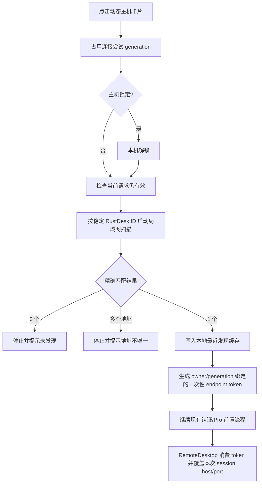

# RustDesk 直连固定 IP / 动态 IP 本地化设计计划

Status: 设计完成，未实施。本文件只描述后续实现方案，不授权本轮修改业务代码。

Date: 2026-08-04

修订记录：2026-08-08 基于代码现状重新审视，仅更新本计划文档（不改业务代码）。
更新内容包括：修正实现基线行号引用、新增跨模块影响矩阵、强化 `displayconfig`
云扩展隔离边界、补充本地备份/Pro 同步/统计语义，并扩展测试和验收矩阵。

## 1. 决策摘要

RustDesk 直连主机在添加时增加“固定 IP / 动态 IP”选项，并明确两种记录的
数据归属：

| 模式 | 保存位置 | 云同步 | 点击卡片时的连接地址 |
| --- | --- | --- | --- |
| 固定 IP | 现有 `remotehosts` | 正常上传和接收 | 使用保存的 IP/端口 |
| 动态 IP | 新增设备本地 RustDesk 主机表 | 不上传、不接收 | 每次点击先局域网发现，再使用本次发现的 IP/端口 |

动态主机的本地表不是 `remotehosts` 的一个带标记的普通行。当前
`remotehosts` 整表通过 `setDistributedTables` 参与端云同步，因此仅仅在保存时
不调用 `pushTable()` 不能满足“动态主机不被云同步接收”的约束。动态主机必须
从分布式表物理隔离，HostSyncService 再将固定主机和本地动态主机合并为主页列表。

核心连接原则：动态主机保存的是稳定的 RustDesk 设备 ID，不把旧 IP 当作连接
依据。扫描得到的 IP/端口只作为本次连接的临时 endpoint；可以记录为本机“最近
发现”缓存，但不能被旧 IP 回退逻辑或云同步逻辑使用。

## 2. 当前实现基线

### 2.1 主机模型和添加流程

当前 [RemoteHost.ets](/Users/mydestiny/Desktop/RemoteDesktop/RemoteDeskHarmonyOS/entry/src/main/ets/model/RemoteHost.ets:251)
已经包含 RustDesk 直连字段；`isValid()` 和 `getValidationErrors()` 对
`rustdeskDirectEnabled=true` 强制要求 `rustdeskDirectHost` 非空，动态模式必须新增
分支。`RemoteHost` 同时服务 RDP/SSH/VNC 记录，修改验证逻辑时这些协议的既有
行为必须保持不变。

- `rustdeskDirectEnabled`：是否绕过 ID 服务器使用直连。
- `rustdeskDirectHost` / `rustdeskDirectPort`：直连 endpoint，默认端口应为
  RustDesk peer TCP `21118`。
- `customHostname`：当前 RustDesk 添加流程把它作为“控制 ID”保存；本计划
  将它作为动态发现时的稳定 peer ID 来源，避免再引入第二套 ID 字段。
- `rustdeskTargetDevice`、认证模式、密码和 TOTP 绑定等后续连接配置。

当前 [RustDeskAddFlow.ets](/Users/mydestiny/Desktop/RemoteDesktop/RemoteDeskHarmonyOS/entry/src/main/ets/components/hostadd/RustDeskAddFlow.ets:112)
要求直连必须填写 IP，并已经具备一次性的局域网搜索和 peer 选择能力。动态
模式需要复用这套搜索来填充设备 ID/名称，但保存并连接时仍必须重新执行一次
发现，不能信任添加阶段的旧地址。

已核实：[HostListPage.ets](/Users/mydestiny/Desktop/RemoteDesktop/RemoteDeskHarmonyOS/entry/src/main/ets/pages/HostListPage.ets:11890)
调用 `RustDeskAddFlow` 时传入 `defaultDirectPort: this.rustdeskDirectPort`，该值来自
`AppStorage('rustdeskDirectPort')`，默认 `21118`（[HostListPage.ets](/Users/mydestiny/Desktop/RemoteDesktop/RemoteDeskHarmonyOS/entry/src/main/ets/pages/HostListPage.ets:657)）。
因此添加页默认端口与发现服务端口一致；实施时固定模式不得改变这个“全局偏好
驱动默认端口”的现有行为，动态模式则固定使用发现结果端口。

[RustDeskHostAddHandoff.ets](/Users/mydestiny/Desktop/RemoteDesktop/RemoteDeskHarmonyOS/entry/src/main/ets/services/RustDeskHostAddHandoff.ets)
已有 owner/generation/5 分钟 TTL 的跨 Sheet 内存草稿机制，地址模式字段必须加入
`RustDeskHostAddDraft` 和 `cloneRustDeskHostAddDraft`，否则用户切页后动态模式
选择会丢失。

### 2.2 云同步边界

当前 [CloudStore.ets](/Users/mydestiny/Desktop/RemoteDesktop/RemoteDeskHarmonyOS/entry/src/main/ets/services/CloudStore.ets:294)
的 `TABLES` 通过 `cloudSyncTableNames()` 生成并注册进
`setDistributedTables`（[CloudStore.ets](/Users/mydestiny/Desktop/RemoteDesktop/RemoteDeskHarmonyOS/entry/src/main/ets/services/CloudStore.ets:939)），
其中包含 `remotehosts`；[HostSyncService.ets](/Users/mydestiny/Desktop/RemoteDesktop/RemoteDeskHarmonyOS/entry/src/main/ets/services/HostSyncService.ets:376)
的 `addHost`（376）、`updateHost`（401）、`removeHost`（445）、`removeHosts`（464）
和连接观测写入都会落到该表并请求同步。

本轮重新审视发现两个比“写入路径”更隐蔽的云泄露口：

1. [CloudStore.ets](/Users/mydestiny/Desktop/RemoteDesktop/RemoteDeskHarmonyOS/entry/src/main/ets/services/CloudStore.ets:8986)
   `hostToBucket()` 会把 `rustdeskdirectenabled` / `rustdeskdirecthost` /
   `rustdeskdirectport` 直接写成 `remotehosts` 云表列。
2. [CloudStore.ets](/Users/mydestiny/Desktop/RemoteDesktop/RemoteDeskHarmonyOS/entry/src/main/ets/services/CloudStore.ets:5985)
   `hostCloudExtensionValues()` 把上述直连字段再次投影进 `displayconfig`
   云端扩展字段；[CloudStore.ets](/Users/mydestiny/Desktop/RemoteDesktop/RemoteDeskHarmonyOS/entry/src/main/ets/services/CloudStore.ets:5859)
   `applyCloudHostExtension()` 会在其他设备上还原它们。

因此动态模式的标记、peer ID、最近发现 IP 等任何配置都不能进入 `remotehosts`
列，也不能进入 `displayconfig` 云扩展；只在 CloudStore 层拦截 insert/update 还不够，
`hostCloudExtensionValues()` 必须显式排除地址模式相关字段（详见第 5 节）。

项目已有多个可复用的本地表模式：

- `localextensions`：不注册到 `setDistributedTables`，但更适合作为已有云行的
  扩展字段，不适合承载完整动态主机卡片。
- `vnclocalrecords`：带 owner、加密 envelope、版本和本地-only 标志，适合作为
  新本地记录设计的结构参考。
- `migrationreceipts` / `migrationquarantine`：可作为固定→动态迁移阶段恢复和
  云行残留隔离的持久化依据。

### 2.3 发现和连接路径

当前 [RustDeskLanDiscoveryService.ets](/Users/mydestiny/Desktop/RemoteDesktop/RemoteDeskHarmonyOS/entry/src/main/ets/services/RustDeskLanDiscoveryService.ets:1)
使用 RustDesk `PeerDiscovery` protobuf，通过 UDP 广播 `255.255.255.255:21119`
发送 ping，响应中的 peer ID 映射到来源 IP，直连端口默认为 `21118`。

当前 [HostListPage.ets](/Users/mydestiny/Desktop/RemoteDesktop/RemoteDeskHarmonyOS/entry/src/main/ets/pages/HostListPage.ets:3291)
的 `connectToHost()` 流程为：`beginConnectionAttempt`（3261）→ 锁定 gate →
RustDesk 直连校验 → Pro preflight → `router.pushUrl({url:'pages/RemoteDesktop', params:{hostId}})`，
再在成功/失败路径上 `releaseConnectionAttempt`（3278）。动态模式应插在锁定 gate
之后、Pro preflight 之前：扫描 → peer ID 精确匹配 → 一次性 endpoint token →
路由参数携带 token；扫描期间保持 connection attempt 占用，防止重复点击。

[RemoteDesktop.ets](/Users/mydestiny/Desktop/RemoteDesktop/RemoteDeskHarmonyOS/entry/src/main/ets/pages/RemoteDesktop.ets:10109)
在会话构建阶段读取 `rustdeskDirectHost`，空地址抛
`E-RUSTDESK-DIRECT-HOST`。动态模式必须改为消费 endpoint token 覆盖本次
`sessionHost/sessionPort`，token 失效时 fail closed，不能回退旧 IP。认证侧
（`openRustDeskAuthSheet` / `confirmRustDeskAuthChoice` 及认证选择持久化）动态和
固定模式共用同一套流程，只是临时 IP 不能写回主机配置。

### 2.4 跨模块影响矩阵（本轮审计结论）

| 模块 | 现有代码位置 | 动态模式影响点 | 兼容保证 |
| --- | --- | --- | --- |
| `RemoteHost` | 直连字段约 251 行，验证逻辑随 `isValid`/`getValidationErrors` | 新增 `rustdeskDirectAddressMode`；固定分支保持现有 IP 必填，动态分支允许空 IP 且必须有 peer ID | 缺失/未知模式按 fixed 兼容；RDP/SSH/VNC 验证路径不进入动态分支 |
| `CloudStore` | `TABLES` 294、`setDistributedTables` 939、`hostToBucket` 8986、`hostCloudExtensionValues` 5985、`applyCloudHostExtension` 5859 | 动态记录拒绝写云表；`displayconfig` 云扩展必须排除动态字段 | 固定/中继主机投影逐字节不变；旧记录反序列化行为不变 |
| `HostSyncService` | `loadFromCloud` 108、`clearForScopeTransition` 316、`visibleDataSignature` 295、CRUD 376-464、`reconcileRustDeskProHosts` 717 | 云加载后合并本地动态表；CRUD 分流；签名和统计包含合并后列表 | 云端固定主机加载/删除/同步语义不变；21116→21118 迁移只作用于云静态直连记录 |
| `HostListPage` | `connectToHost` 3291、connection attempt 3261/3278 | 动态点击时先扫描并生成 token；路由参数带 token | 固定主机点击不触发扫描；锁定 gate、Pro preflight 顺序不变 |
| `RemoteDesktop` | 会话构建 10109-10124、认证选择持久化 | 动态模式消费一次性 token，禁止旧 IP 回退 | 固定模式继续读 `rustdeskDirectHost/Port`；认证/密码/TOTP/方向配置路径不变 |
| `RustDeskAddFlow` / `RustDeskHostAddHandoff` | `buildHost` 111、草稿 clone | 地址模式选择、草稿恢复、保存并连接重新扫描 | 固定模式 IP 必填和默认端口来源不变 |
| `RustDeskLanDiscoveryService` | `startScan` 201、`seenPeers` 去重 211-250 | 保留同 ID 多地址并上报冲突；扫描 busy 显式化 | ping/protobuf/超时策略不变；固定主机不调用它 |
| `LocalBackupPolicy` / `BackupManifestV3` / `CloudStore` | 白名单 `['vnclocalrecords']`（32）、`exportAllLocalTableRows` 3294、restore 3717-3734 | 本地完整/脱敏备份扩展 `rustdesklocalhosts` | 恢复不触发 cloud push；旧备份 manifest 仍可读取 |
| `RustDeskProSyncService` / `RustDeskProSyncPolicy` | `getAllRelays` 162、`reconcileRustDeskProHosts` 717 | Pro reconcile 已按 `sourceType==='rustdesk_pro'` 过滤（策略 27-29 行），动态手工记录天然不被接管 | 增加防御性测试；动态记录绝不进入 Pro 写入分支 |
| `RelayDirectoryPolicy` / relay 系列 | 只处理 relay 配置 | 不遍历主机卡片，动态记录不参与 relay 目录 | 无影响 |
| `KeyVaultPage` 等消费者 | 通过 HostSyncService 取合并列表 | 动态卡片出现在合并列表中，凭据展示按现有本机规则 | 不引入任何云端语义；密码仍走 DataCrypto |
| 测试 | 既有 `RemoteHost`、`CloudSyncPolicy`、`CloudTableAdapter`、`LocalBackupPolicy`、`HostSyncMergePolicy` 等纯策略用例 | 新增动态端点/存储用例，不修改既有断言 | 既有用例作为固定模式回归基线 |

## 3. 用户体验合同

### 3.1 添加和编辑

RustDesk 选择“局域网直连”后，再显示地址模式分段控件：

1. 固定 IP：显示 IP 和端口输入框；IP 必填，端口可配置，默认 `21118`。
2. 动态 IP：隐藏或禁用 IP 输入框；显示“每次连接前搜索同一局域网”的说明；
   端口固定使用发现服务返回的 `21118`。动态模式必须填写或通过搜索选择
   RustDesk 控制 ID。

动态模式还要明确显示以下提示：

- 该主机只保存在本机，不会出现在同账号的其他设备上。
- 每次点击连接都会重新搜索局域网。
- 仅支持当前局域网发现；公网动态 IP 仍需 DDNS、VPN 或 RustDesk 中继。

编辑现有动态主机时保留动态模式和本机最近发现缓存。编辑现有固定主机切换
为动态时，必须先完成云行到本地行的迁移；迁移失败不能把卡片显示成半完成状态。

### 3.2 卡片显示

- 固定主机继续显示 `IP:端口`。
- 动态主机显示“动态 IP”以及可选的“最近发现：IP · 时间”辅助信息。
- 最近发现地址只是诊断/展示信息，不能被用户理解为下一次连接会直接使用的
  固定地址。
- 动态卡片增加“仅本机”或等价的本地标识，避免用户误以为云同步已经完成。
- 扫描期间卡片显示“正在搜索局域网”，禁止重复点击启动第二个扫描。
- 发现失败时保留卡片，但显示明确错误和重试入口；不删除配置，不自动降级到
  旧 IP。

### 3.3 保存和连接

“保存并连接”对动态主机的语义是：

1. 先保存本地动态卡片。
2. 进入连接前再次扫描。
3. 扫描成功后才进入现有 RustDesk 认证和会话流程。

因此添加页面此前发现的 IP 不足以绕过连接前扫描。

## 4. 数据模型合同

### 4.1 地址模式字段

在 [RemoteHost.ets](/Users/mydestiny/Desktop/RemoteDesktop/RemoteDeskHarmonyOS/entry/src/main/ets/model/RemoteHost.ets:293)
现有直连字段旁增加规范化字段：

```text
rustdeskDirectAddressMode: 'fixed' | 'dynamic'
```

规则：

- 缺失、空值、未知值全部兼容为 `fixed`，保证旧版本记录升级后行为不变。
- `toJSON/fromJSON` 必须提供该字段的兼容默认值；`serializedSnapshotChanged`
  基于 `toJSON` 做可见快照签名比较（[HostSyncService.ets](/Users/mydestiny/Desktop/RemoteDesktop/RemoteDeskHarmonyOS/entry/src/main/ets/services/HostSyncService.ets:295)），
  需要回归测试确保旧记录升级前后的签名稳定、不产生虚假数据变化事件。
- 该字段只描述 IP 生命周期，不改变 `rustdeskDirectEnabled` 的“直连/中继”
  协议选择。
- 动态模式只允许 `rustdeskDirectEnabled=true`、`protocol='rustdesk'`、
  `sourceType!='rustdesk_pro'` 的手工直连主机。
- `rustdeskProManaged=true` 的地址簿主机不能切换成动态模式；其 endpoint 由
  Pro 地址簿/控制面 owner 管理，不能被本地局域网发现覆盖。
- 该字段只在内存合并且落在本地动态表，不写入 `remotehosts` 云表列，也不进入
  `displayconfig` 云扩展字段。

### 4.2 字段语义

| 字段 | 固定模式 | 动态模式 |
| --- | --- | --- |
| `customHostname` | 继续保存当前控制 ID | 必须是稳定的 RustDesk peer ID，用于精确匹配 |
| `rustdeskDirectHost` | 配置的权威 IP/主机 | 最近一次发现的本机缓存，不是连接依据 |
| `rustdeskDirectPort` | 用户配置端口，默认 `21118` | 只允许发现结果中的 `21118` |
| `host` / `port` | 继续镜像直连 endpoint 以兼容现有代码 | 可以为空或保存本机缓存，但不得被当作权威 endpoint |
| `password` | 现有本地加密保存规则 | 使用同一加密规则，只保存在本机动态记录 |
| `groupId`、排序、锁定、显示设置 | 云同步 | 只保存在本机 |
| 最近发现时间 | 不使用 | 本机运行元数据，不上传云端 |

动态模式的验证规则：

- 控制 ID 不能为空；只按 `trim` 后的原始 ID 比较，不用设备名、MAC 或旧 IP
  替代 ID。
- IP 可以为空；动态主机刚创建且尚未成功发现时仍允许保存卡片。
- 端口使用 `21118`；动态自定义端口不在第一版范围内，因为当前
  `PeerDiscovery` 响应不携带 peer TCP 端口。
- 直连密码仍然是必需连接材料；动态模式不是免密码模式。

### 4.3 本地动态主机记录

新增专用本地表 `rustdesklocalhosts`，不加入 [CloudSyncPolicy.ets](/Users/mydestiny/Desktop/RemoteDesktop/RemoteDeskHarmonyOS/entry/src/main/ets/services/CloudSyncPolicy.ets:5)
的云表列表，也不加入 `setDistributedTables` 的 `TABLES`。

推荐字段：

| 字段 | 作用 |
| --- | --- |
| `id` | 主机卡片稳定 ID，沿用 `RemoteHost.id` |
| `userid` | 当前 owner scope，防止账号切换后泄露本地卡片 |
| `payload` | 动态 RustDesk 卡片的非敏感配置 JSON，带 schema version |
| `password` | DataCrypto envelope；不把明文密码放进 `payload` |
| `lastresolvedhost` | 最近一次发现到的 IP，仅本机缓存 |
| `lastresolvedport` | 最近一次发现到的端口 |
| `lastresolvedat` | 最近一次成功解析时间 |
| `createdat` / `updatedat` | 本地记录版本和排序依据 |
| `localonly` | 固定值 `1`，作为防误同步断言 |
| `deletedat` | 需要本地迁移/删除恢复时使用的本地 tombstone |

`payload` 至少覆盖主页和连接所需的 label、peer ID、地址模式、认证模式、
密码模式、目标设备、TOTP 条目引用、锁定/分组/排序/显示配置和连接观测字段。
不复制完整 `remotehosts` SQL schema；通过专用 DTO 做字段白名单，降低把 SSH、
RDP 或不相关密钥带入动态记录的风险。

密码写入和读取复用 [DataCrypto.ets](/Users/mydestiny/Desktop/RemoteDesktop/RemoteDeskHarmonyOS/entry/src/main/ets/services/DataCrypto.ets:540)
的 scoped envelope 语义，AAD 建议使用：

```text
scope = currentOwnerScopeId()
table = rustdesklocalhosts
recordId = RemoteHost.id
fieldName = password
```

当应用加密已配置但当前锁定时，动态卡片可以继续显示非敏感配置，但连接必须
遵循现有解锁/缺少密码策略；不能把密文当作明文传给 RustDesk。

### 4.4 存储 owner

新增 `RustDeskLocalHostStore` 作为本地动态表的唯一 CRUD owner：

- `loadAll(scope)`、`get(id)`、`insert(host)`、`update(host)`、`remove(id)`。
- `saveResolvedEndpoint(id, endpoint)` 只更新 `lastresolved*`，不调用
  `CloudSyncCoordinator`。
- `replaceMode(host, fixed/dynamic)` 提供模式迁移所需的事务边界。
- 所有查询和写入带当前 `ownerScopeId`，账号切换时清理内存缓存并重新加载。

`HostSyncService` 继续是主页和连接流程的统一主机 owner，但其内部数据源变为：

```text
visibleHosts = cloudRemoteHosts(static/ordinary) + localDynamicRustDeskHosts
```

UI 不直接查询 `CloudStore` 或 `rustdesklocalhosts`。

## 5. 云同步隔离设计

### 5.1 写入规则

所有主机写入先经过同一个纯策略判断：

```text
isLocalOnlyDynamicRustDeskHost(host)
  = protocol == rustdesk
  && rustdeskDirectEnabled == true
  && rustdeskDirectAddressMode == dynamic
  && rustdeskProManaged == false
```

当结果为 `true`：

- `HostSyncService.addHost/updateHost/removeHost` 走 `RustDeskLocalHostStore`。
- 不调用 `CloudStore.insertHost/updateHost/deleteHost`。
- 不调用 `pushTable('remotehosts')`。
- 连接健康、最近连接、最近发现 IP 等观测也只写本地表。

当结果为 `false`：

- 保持当前固定主机和中继主机的 CloudStore 路径。
- 固定直连仍然跟随现有 `remotehosts` 云同步选择和生命周期策略。

CloudStore 的 `insertHost` 和 `updateHost` 也应增加底层防线：如果收到动态
直连记录，直接返回明确的 `local_only_record_rejected`，防止未来新的调用方
绕过 HostSyncService 把动态记录写进云表。

`hostCloudExtensionValues()` 必须显式排除地址模式相关字段，包括：
`rustdeskdirectenabled`、`rustdeskdirecthost`、`rustdeskdirectport` 以及新增的
`rustdeskdirectaddressmode`。固定直连主机的这三个既有字段仍按现状投影进
`displayconfig`（保持旧行为），只有动态模式字段不参与投影。同步需要配套测试：
构造动态主机时断言 `projectRemoteHostCloudExtension` 输出不含上述键，构造固定
直连主机时断言输出与现状逐键一致。

另外，`displayconfig` 投影和 `applyCloudHostExtension` 还原是成对逻辑。若未来
固定主机与动态主机出现同 ID 的迁移窗口，`applyCloudHostExtension` 从云行
还原动态标记的异常路径必须在进入 `RemoteHost` 之前被云行防御过滤拦截，不能
靠反序列化后的二次判断兜底。

### 5.2 读取规则

HostSyncService 初始化和云回调时不能继续简单地 `hosts.clear()` 后只装入
`cloud.loadAllHosts()`。流程改为：

1. 先读取当前 owner 的本地动态主机。
2. 再读取云端 `remotehosts`。
3. 对云列表应用云行防御过滤：动态模式行不进入可见列表；旧行缺少模式时
   按固定模式兼容。
4. 合并静态云主机和本地动态主机，按现有分组/排序规则发出一次数据变化。

如果云端出现带动态标记的异常行，第一版不应自动在所有设备之间复制它。应记录
脱敏诊断并进入迁移/清理队列；只有确认该行是本机模式迁移残留时，才允许删除
云行。不能通过“云端动态行覆盖本地动态行”的方式恢复它。

读取顺序必须与端口迁移共存：`loadFromCloud` 中 21116→21118 的自动迁移
（[HostSyncService.ets](/Users/mydestiny/Desktop/RemoteDesktop/RemoteDeskHarmonyOS/entry/src/main/ets/services/HostSyncService.ets:160)）
只遍历云静态直连记录；本地动态记录在迁移循环之后合并，且永远不进入该迁移。
合并后的 `this.hosts` 已经是 `visibleDataSignature` 的数据源，因此动态记录
自然纳入快照签名；实施时保证合并发生在签名计算之前，避免云回调触发重复
emit 或漏 emit。

### 5.3 云同步选择和云端统计

- `rustdesklocalhosts` 不出现在云同步设置的可选表列表中。
- 动态主机不计入云端待上传、待下载、同步成功/失败行数。
- 云同步关闭时，动态主机仍然可以在本机使用。
- 手动本地备份是独立边界，不等同于云同步；若用户显式选择完整本地备份，
  可以备份动态卡片，但不能因此触发云上传。
- 云同步统计（行数、待上传/待下载、成功/失败）和设置页可选表列表都不包含
  `rustdesklocalhosts`。

HostSyncService 的统计口径：动态卡片进入合并后的 `this.hosts` 后，
`getHostCount` / `getLockedHostCount` / `getRustDeskHostCount` 等总览计数自然
包含动态卡片，这是期望行为；但 Pro/relay 关联、`reconcileRustDeskProHosts`
（[HostSyncService.ets](/Users/mydestiny/Desktop/RemoteDesktop/RemoteDeskHarmonyOS/entry/src/main/ets/services/HostSyncService.ets:717)）
和云端导出路径必须过滤动态记录。实现时新增纯函数
`isLocalOnlyDynamicRustDeskHost(host)`，所有统计/过滤调用方在接入前按调用意图
逐一确认（总览计数要含、云端和 Pro 路径要排除），并在测试中固定这两类断言。

### 5.4 本地备份边界

若动态表要参与本地完整/脱敏备份，实施范围必须同步扩展（不是单纯加一张表）：

- [LocalBackupPolicy.ets](/Users/mydestiny/Desktop/RemoteDesktop/RemoteDeskHarmonyOS/entry/src/main/ets/services/LocalBackupPolicy.ets:32)
  的本地表白名单扩展 `rustdesklocalhosts`，并补充对应的
  `localBackupLocalTableColumns()` 列白名单。
- [CloudStore.ets](/Users/mydestiny/Desktop/RemoteDesktop/RemoteDeskHarmonyOS/entry/src/main/ets/services/CloudStore.ets:3294)
  `exportAllLocalTableRows()` 与 `restoreDeviceLocalRows()`（5401）按新表适配；
  恢复动态表不得触发 `pushTable('remotehosts')`，也不得产生任何云写入。
- [BackupManifestV3.ets](/Users/mydestiny/Desktop/RemoteDesktop/RemoteDeskHarmonyOS/entry/src/main/ets/services/BackupManifestV3.ets:415)
  的 localTables 校验和脱敏逻辑加入新表：完整备份保留加密 envelope，脱敏备份
  去掉密码并要求恢复后重新输入。
- 旧版本备份（manifest 或 `LegacySharedStoreMigrator` 只认 `vnclocalrecords`）
  不包含动态表时按“没有动态卡片”处理，不报错、不迁移成固定主机。
- 恢复语义：动态卡片恢复后仍为 local-only，仍然每次连接前重新扫描；恢复过程
  不把任何记录写入 `remotehosts`。

## 6. 模式迁移和兼容

### 6.1 旧版本升级

旧版本所有 RustDesk 直连记录没有地址模式字段，统一解释为固定 IP：

- 不改变现有卡片位置、连接地址或云同步行为。
- 不因为升级自动扫描局域网。
- 不把已有云记录搬到本地表。

### 6.2 固定切换为动态

要求当前主机是手工 RustDesk 直连，并且控制 ID 非空。

推荐顺序：

1. 从当前主机生成动态本地记录，保留卡片 ID、凭据、显示设置、分组和排序。
2. 本地记录写入成功后，删除 `remotehosts` 中的旧云行，并请求一次
   `remotehosts` 同步。
3. 只有云行删除成功且本地记录完整时，才在内存中切换为动态卡片。
4. 迁移期间用本地 migration receipt/tombstone 记录阶段，应用重启后可继续
   清理未完成的旧云行。

如果云行删除失败：

- 保留固定模式作为可用配置；
- 不显示“动态已启用”；
- 不删除原云记录；
- 提示用户稍后重试。

本地动态记录与旧云行短暂同 ID 共存时，HostSyncService 在当前设备优先显示
本地迁移记录，并按 receipt 继续处理云行删除；不能出现两张相同卡片。

### 6.3 动态切换为固定

要求用户填写有效固定 IP 和端口。

1. 基于动态卡片生成固定 `RemoteHost`。
2. 先写入 `remotehosts` 并确认写入成功。
3. 请求云同步。
4. 云行写入成功后删除本地动态记录。
5. 任何云写入失败都保留本地动态卡片，不产生半固定、半动态的双卡片。

### 6.4 删除动态主机

删除动态卡片只删除本地动态行和本地密码/迁移元数据；不向云端发删除请求。
如果该卡片仍有同 ID 的历史云残留，删除动作应单独进入旧残留清理流程，不能
因为删除本地卡片而误删其他设备上的合法固定主机。

## 7. 动态点击连接流程

### 7.1 连接前置顺序

HostListPage 当前已经有连接尝试 generation 和锁定 gate。动态主机应按以下顺序：



扫描应在锁定 gate 之后执行，避免未授权用户通过点击锁定卡片触发网络探测。
动态扫描和固定主机连接不能共用一个“旧地址回退”分支。

### 7.2 发现匹配规则

新增纯策略 `RustDeskDynamicEndpointPolicy.ets`，输入目标 ID 和发现结果，输出
明确结果：

- `not_found`：没有 peer ID 完全相同的结果。
- `matched`：只有一个唯一 `(peerId, host, port)` endpoint。
- `ambiguous`：同一个 peer ID 对应多个不同 IP/端口。
- `invalid`：目标 ID、IP 或端口格式不合法。

当前发现服务按 peer ID 去重。为了正确处理同 ID 多 IP，实施时需要保留不同
来源地址，或至少在去重前记录冲突；不能在服务层静默丢弃第二个地址后让上层
误以为只有一个 endpoint。

匹配只允许：

- `peer.peerId.trim() === host.customHostname.trim()`；
- `peer.cmd === 'pong'` 且 peer ID 非空；
- `peer.host` 是有效地址；
- `peer.port` 在合法范围内且第一版为 `21118`。

设备名称、平台、MAC 和发现顺序只能用于展示或诊断，不能作为身份匹配替代品。

### 7.3 临时 endpoint handoff

新增进程内的 `RustDeskDynamicEndpointStore`，保存：

```text
token
hostId
peerId
resolvedHost
resolvedPort
resolvedAt
ownerScopeId
accountGeneration
connectionAttemptGeneration
expiresAt
```

HostListPage 路由只传 `hostId` 和随机 token，不传密码、不传完整主机 JSON。
RemoteDesktop 读取 token 时必须校验 owner、账号 generation、host ID、peer ID
和 TTL，并在消费后立即删除 token。

RemoteDesktop 当前在 [RemoteDesktop.ets](/Users/mydestiny/Desktop/RemoteDesktop/RemoteDeskHarmonyOS/entry/src/main/ets/pages/RemoteDesktop.ets:10109)
读取 `rustdeskDirectHost`。后续实现要改为：

- 固定模式：继续读取保存的 `rustdeskDirectHost/Port`。
- 动态模式：必须消费有效 endpoint token；token 不存在、过期或作用域不匹配时
  直接失败，不读取最近发现缓存，不读取添加时旧 IP。

`SessionConfig.host/port` 最终只接收解析后的 endpoint。认证、密码、TOTP、显示
和方向配置仍从 HostSyncService 的主机 owner 读取，避免把敏感信息复制到 handoff。

### 7.4 失败和重试

推荐稳定错误码：

| 错误码 | 用户提示 |
| --- | --- |
| `E-RUSTDESK-DYNAMIC-ID-MISSING` | 动态主机缺少 RustDesk 设备 ID，请编辑后补充 |
| `E-RUSTDESK-DYNAMIC-SCAN-BUSY` | 正在搜索局域网，请等待当前搜索结束 |
| `E-RUSTDESK-DYNAMIC-SCAN-TIMEOUT` | 未在规定时间内完成局域网搜索 |
| `E-RUSTDESK-DYNAMIC-NOT-FOUND` | 未发现目标设备，请确认双方在同一局域网 |
| `E-RUSTDESK-DYNAMIC-AMBIGUOUS` | 发现多个目标地址，无法安全选择 |
| `E-RUSTDESK-DYNAMIC-ENDPOINT-EXPIRED` | 动态地址已过期，请重新点击主机连接 |
| `E-RUSTDESK-DYNAMIC-CUSTOM-PORT` | 动态发现暂不支持自定义直连端口 |
| `E-RUSTDESK-DYNAMIC-LOCAL-STORE` | 本机动态主机保存失败，请稍后重试 |
| `E-RUSTDESK-DYNAMIC-CLOUD-BOUNDARY` | 动态主机不能写入云同步主机表 |

RemoteDesktop 内的连接失败重试不能直接重复使用旧 endpoint。第一版应返回主机
列表，让用户再次点击触发新扫描；后续如增加连接页重试按钮，也必须重新执行
resolver。

## 8. 发现服务和网络边界

### 8.1 第一版能力

- 复用现有 UDP `255.255.255.255:21119` 广播和 protobuf 编解码。
- 扫描超时默认 5 秒；重发机制沿用现有两次 probe。
- RustDesk peer TCP 端口固定 `21118`。
- 每个 HostListPage/连接 resolver 同时只允许一个扫描；添加页面的手动搜索
  和连接前动态搜索要经过同一并发保护，避免两个 UDP socket 互相覆盖状态。

### 8.2 明确不保证的网络场景

- VLAN、访客 Wi-Fi、AP client isolation、子网广播过滤和防火墙可能阻断发现。
- 目标 RustDesk 进程未启用 LAN discovery 或未监听 `21119` 时无法发现。
- 公网动态 IP 不属于该功能的覆盖范围。
- 动态自定义 TCP 端口不在第一版范围内，因为当前 discovery response 不携带
  peer TCP 端口。

这些情况必须进入用户可理解的失败提示和诊断日志，不能伪装成“设备离线”或
自动改走中继。

## 9. 安全和隐私要求

- 动态主机不进入 `remotehosts`，因此其密码、最近 IP、卡片配置都不进入云
  同步 payload。
- 动态密码必须沿用 DataCrypto 的 owner/AAD 绑定；加密已配置但锁定时不得
  暴露或误用密文。
- 日志只记录 host ID、peer ID 和 IP 的指纹/掩码，不记录密码、TOTP、token 或
  完整敏感配置。现有发现服务的 fingerprint 日志规则应保持。
- 连接前按 peer ID 精确匹配；不允许“发现任意第一台设备后连接”。
- endpoint token 绑定 host ID、账号作用域和连接 generation，并设置短 TTL、
  一次性消费。
- 动态卡片本地可见不代表可以绕过主机锁；锁定 gate 仍在扫描之前。
- 本地完整备份是用户主动行为。完整备份可包含动态卡片和加密密码；脱敏备份
  必须去除密码并在恢复后要求重新输入。恢复本地备份不触发云上传。

## 10. 预期文件范围

下表是实施阶段的候选范围，不是本轮代码修改清单：

| 层级 | 文件 | 计划职责 |
| --- | --- | --- |
| 模型 | `/Users/mydestiny/Desktop/RemoteDesktop/RemoteDeskHarmonyOS/entry/src/main/ets/model/RemoteHost.ets` | 地址模式字段、动态/固定验证、JSON 兼容默认值 |
| 添加草稿 | `/Users/mydestiny/Desktop/RemoteDesktop/RemoteDeskHarmonyOS/entry/src/main/ets/services/RustDeskHostAddHandoff.ets` | 地址模式在跨 Sheet 草稿中的保存和恢复 |
| 添加 UI | `/Users/mydestiny/Desktop/RemoteDesktop/RemoteDeskHarmonyOS/entry/src/main/ets/components/hostadd/RustDeskAddFlow.ets` | 固定/动态选择、动态提示、ID/端口约束 |
| 策略 | 新增 `RustDeskDynamicEndpointPolicy.ets` | 地址模式、匹配、云同步资格、错误码纯规则 |
| 本地存储 | 新增 `RustDeskLocalHostStore.ets` | `rustdesklocalhosts` CRUD、加密、owner scope |
| 数据库 | `/Users/mydestiny/Desktop/RemoteDesktop/RemoteDeskHarmonyOS/entry/src/main/ets/services/CloudStore.ets` | 本地表 schema、动态 CRUD、防误写云表、本地备份桥接 |
| 同步 owner | `/Users/mydestiny/Desktop/RemoteDesktop/RemoteDeskHarmonyOS/entry/src/main/ets/services/HostSyncService.ets` | 云静态主机和本地动态主机合并、迁移、观测写入分流 |
| 云策略 | `CloudSyncPolicy.ets`、`CloudSyncSelectionPolicy.ets`、`CloudTableAdapter.ets` | 确保本地表不进入分布式表、云选择或云行投影 |
| 云扩展投影 | [CloudStore.ets](/Users/mydestiny/Desktop/RemoteDesktop/RemoteDeskHarmonyOS/entry/src/main/ets/services/CloudStore.ets:5985) `hostCloudExtensionValues` | 动态模式字段不进入 `displayconfig` 云扩展；固定字段投影保持不变 |
| 发现 | `/Users/mydestiny/Desktop/RemoteDesktop/RemoteDeskHarmonyOS/entry/src/main/ets/services/RustDeskLanDiscoveryService.ets` | 冲突地址保留、扫描并发和结果去重规则 |
| 解析器 | 新增 `RustDeskDynamicEndpointResolver.ets` | 连接前扫描、超时、取消、ID 匹配 |
| handoff | 新增 `RustDeskDynamicEndpointStore.ets` | 短 TTL、作用域绑定、一次性 endpoint token |
| 主机列表 | `/Users/mydestiny/Desktop/RemoteDesktop/RemoteDeskHarmonyOS/entry/src/main/ets/pages/HostListPage.ets` | 点击动态卡片前解析、连接 generation、路由 token、模式迁移入口 |
| 连接页 | `/Users/mydestiny/Desktop/RemoteDesktop/RemoteDeskHarmonyOS/entry/src/main/ets/pages/RemoteDesktop.ets` | 消费 token，动态模式禁止旧 IP 回退 |
| 本地备份 | `LocalBackupPolicy.ets`、`CloudStore.ets`、`LocalBackupService.ets` | 完整备份/脱敏备份的本地动态表支持 |
| 备份清单 | `BackupManifestV3.ets` | localTables 校验、脱敏规则和 manifest 兼容 |
| Pro/relay 边界 | `RustDeskProSyncService.ets`、`RustDeskProSyncPolicy.ets`、`HostSyncService.ets` | 动态记录不进入 Pro reconcile 输入、relay 关联和云端导出 |
| 测试 | `/Users/mydestiny/Desktop/RemoteDesktop/RemoteDeskHarmonyOS/entry/src/test` | 纯策略、存储边界、迁移、匹配、token 和回归测试 |

不应修改 RustDesk native/FFI 连接协议；动态 IP 只改变连接前 endpoint 解析和
session config 输入。

## 11. 实施阶段

### P0：合同和纯策略冻结

交付：

- 地址模式类型、兼容默认值和验证规则。
- 云同步资格判断和 `remotehosts` 拒绝动态记录规则；`displayconfig` 云扩展
  排除规则（固定字段投影逐键不变）。
- discovery 结果匹配、0/1/多结果和端口限制策略。
- endpoint token 的 TTL、owner/generation 校验规则。
- Pro reconcile 输入过滤断言：动态手工记录不会被 `isManagedByAccount`
  接管。

完成条件：纯函数测试先通过；没有 UI 或数据库改动也能覆盖固定/动态边界。

### P1：本地表和 HostSyncService owner

交付：

- `rustdesklocalhosts` schema 和 DataCrypto 字段加密。
- `RustDeskLocalHostStore` CRUD。
- HostSyncService 合并云静态主机和本地动态主机。
- 账号切换、加密锁定/解锁、删除和连接观测的本地分流。
- `visibleDataSignature` 覆盖合并后的动态记录；`loadFromCloud` 的端口迁移
  循环明确排除动态记录。
- CloudStore `insertHost/updateHost` 对动态记录返回 `local_only_record_rejected`；
  `hostCloudExtensionValues` 不投影动态字段。
- 云行防御过滤：带动态标记的异常云行进入清理/迁移路径，不进入可见列表。

完成条件：动态新增/编辑/删除不会生成 `remotehosts` 行或 cloud push；固定
主机现有测试不回归；同账号不同 owner scope 不互相看到动态卡片。

### P2：添加、编辑和模式迁移

交付：

- RustDeskAddFlow 固定/动态选择和草稿恢复。
- 动态模式不再要求 IP；固定模式行为保持不变。
- 固定到动态、动态到固定的双阶段迁移和恢复 receipt。
- 动态卡片的“仅本机”和“最近发现”展示。
- 编辑现有固定/动态主机路径回归：编辑动态主机不写云行，编辑固定主机
  不触发扫描；固定→动态和动态→固定迁移失败都回到原可用模式。

完成条件：所有模式迁移失败都保持原可用模式，不出现重复卡片或丢失凭据。

### P3：连接前发现和 endpoint handoff

交付：

- 点击动态卡片触发新的扫描。
- peer ID 精确匹配、冲突地址处理、超时/取消/重复点击保护。
- endpoint token 路由到 RemoteDesktop。
- RemoteDesktop 动态模式禁止读取旧 IP 回退。
- 动态/固定共用认证流程回归：认证选择、密码、TOTP、锁定 gate 顺序不变。

完成条件：目标 IP 改变后第二次点击使用新 IP；扫描失败绝不启动 native
连接；固定模式不经过扫描且连接路径保持原有行为。

### P4：备份、诊断和真实设备验收

交付：

- 本地完整/脱敏备份策略。
- 本地备份恢复不触发 cloud push；`BackupManifestV3` 校验和脱敏覆盖新表。
- 脱敏日志和同步统计不包含动态记录。
- Phone/Pad/PC 小屏的卡片状态和扫描反馈验收。
- 同局域网真实 RustDesk 设备、不同子网失败场景和 IP 变更场景记录。

## 12. 测试计划

### 12.1 纯策略测试

建议新增 `RustDeskDynamicEndpointPolicy.test.ets`，覆盖：

- 缺失模式字段按 fixed 兼容。
- fixed 必须有 IP，dynamic 必须有 peer ID 但可以没有 IP。
- dynamic 自定义端口被拒绝，fixed 自定义端口被接受。
- Pro managed host 被拒绝切换为 dynamic。
- 0 个、1 个、多个匹配 peer 的结果。
- 同 ID 同 IP 去重；同 ID 多 IP 判定 ambiguous。
- 不同 ID、名称相同或 MAC 相同但 peer ID 不同，不能匹配。
- local-only 记录不允许 cloud upload/download。
- endpoint token 的 scope、generation、TTL 和一次性消费。
- `toJSON/fromJSON` 缺省地址模式兼容 fixed，且旧记录序列化快照签名不变。
- `isLocalOnlyDynamicRustDeskHost` 在总览计数（包含）和云端/Pro 路径（排除）
  两类调用意图下都返回正确结果。

### 12.2 HostSyncService/CloudStore 测试

- 动态 `addHost` 只写本地表，不调用 `insertHost('remotehosts')`。
- CloudStore `insertHost/updateHost` 收到动态记录返回
  `local_only_record_rejected`。
- `hostCloudExtensionValues`/`projectRemoteHostCloudExtension` 投影不含
  `rustdeskdirectenabled`、`rustdeskdirecthost`、`rustdeskdirectport`、
  `rustdeskdirectaddressmode`；固定直连主机投影与现状逐键一致。
- 动态的最近发现、lastConnected、health 不触发 cloud update。
- `loadFromCloud` 不会用云快照清空本地动态卡片。
- `loadFromCloud` 的 21116→21118 端口迁移不触碰本地动态记录。
- 云端固定主机仍能正常加载、更新、删除和同步。
- 同账号另一设备的云回调不会创建动态卡片。
- 当前设备账号切换后动态卡片不可见，切回原 scope 后可以恢复。
- 加密已配置但锁定时，动态密码不以可用明文暴露。
- 动态云行残留被过滤并进入清理/迁移路径，不重复展示。
- 合并后 `visibleDataSignature` 随动态记录增删变化；云快照不变时不会重复 emit。
- 计数语义：`getHostCount` 等总览计数包含动态卡片，Pro reconcile 输入和
  relay 关联路径不含动态记录。

### 12.3 UI 和连接测试

- 添加固定主机：保存 IP，直接点击连接，不启动 LAN scan。
- 添加动态主机：无 IP 也能保存，必须有 peer ID。
- “保存并连接”动态主机仍执行一次新扫描。
- 动态卡片点击时显示扫描状态，连续点击只产生一个连接请求。
- 目标设备换 DHCP 地址后重新点击使用新地址。
- 目标不在局域网、广播被隔离、设备未响应时不启动 native 连接。
- peer ID 不匹配时不连接发现到的其他设备。
- 动态连接的认证、密码、TOTP、锁定、方向和会话渲染行为与固定直连一致。
- dynamic -> fixed 和 fixed -> dynamic 都不产生重复卡片。
- RemoteDesktop 连接失败重试不会复用过期 endpoint。
- 编辑动态主机（改名称/分组/认证）不产生云写入，不改变地址模式。
- 编辑固定直连主机不触发局域网扫描；固定模式 IP 必填校验保持现状。
- 固定主机点击连接全程不调用 resolver，连接路径与现状一致。

### 12.4 本地备份测试

- 完整本地备份包含动态卡片且恢复后仍然是 local-only。
- 脱敏备份不包含动态密码，恢复后卡片可见但连接前要求重新输入密码。
- 恢复动态本地表不会把记录加入 `remotehosts` 或触发 cloud push。
- 旧版本备份（无动态表）恢复成功，不产生动态卡片也不报错。
- 云同步设置中看不到 `rustdesklocalhosts`。

## 13. 验收矩阵

| 场景 | 预期结果 |
| --- | --- |
| 新增固定直连 | 保存到 `remotehosts`，按现有规则参与云同步，点击不扫描 |
| 新增动态直连 | 保存到本地表，`remotehosts` 无对应行，其他设备无卡片 |
| 动态卡片首次点击 | 扫描并按 peer ID 匹配，成功后进入现有连接步骤 |
| 动态 IP 已变更 | 使用本次新发现 IP，不使用旧缓存 |
| 扫描超时/无结果 | 停止连接，保留卡片并给出重试提示 |
| ID 不匹配 | 停止连接，不连接任意发现设备 |
| 同 ID 多地址 | 停止连接并报告地址不唯一，不能静默选第一条 |
| 固定切换动态 | 云行删除成功后成为本地卡片；删除失败保持固定 |
| 动态切换固定 | 云行写入成功后移除本地卡片；写入失败保持动态 |
| 同账号其他设备 | 只收到固定主机，不收到动态主机 |
| 账号切换 | 动态记录按 owner scope 隔离，不跨账号泄露 |
| 应用重启 | 动态卡片恢复；连接前仍然重新扫描 |
| 云扩展字段 | 动态模式字段不进入 `displayconfig` 云扩展；固定直连投影与现状一致 |
| 云行残留 | 带动态标记的异常云行被过滤进入清理路径，不展示、不复制到其他设备 |
| 本地备份恢复 | 动态卡片恢复后仍 local-only，不触发 cloud push |
| 固定主机回归 | 旧直连记录、云同步、点击连接、RDP/SSH/VNC、Pro、备份恢复全部保持原行为 |
| 清除应用数据 | 动态卡片和本地密码随本地数据清除，不宣称云端可恢复 |
| 公网动态 IP | 明确提示不支持，不自动伪装成局域网发现成功 |

## 14. 风险和回滚

### 主要风险

1. `remotehosts` 目前承担所有主机的同步和本地 CRUD。若只在 UI 层过滤动态
   卡片，云端仍可能收到动态记录；必须在 CloudStore 和 HostSyncService 两层
   都做防线。
2. `displayconfig` 云扩展是比主表列更隐蔽的泄露口：`hostToBucket` 和
   `hostCloudExtensionValues` 都会投影直连字段。即使动态记录没有进入
   `remotehosts` 主行，扩展字段也可能把地址模式或最近 IP 带到其他设备；必须
   在投影函数层排除动态字段并配套固定投影回归测试。
3. 当前连接页通过 `hostId` 重新加载主机。若 endpoint token 丢失后回退到
   `rustdeskDirectHost`，IP 变更场景会重新出现旧地址连接风险；动态分支必须
   fail closed。
4. 当前发现服务按 peer ID 去重，多网卡或异常设备可能产生同 ID 多地址；实现
   前需要补充冲突语义，不能把静默去重当作安全匹配。
5. 本地动态表和云行迁移跨越两个持久化 owner，不能假设一个 RDB 事务覆盖两者；
   必须使用阶段 receipt/tombstone 和启动恢复。
6. HostSyncService 是统一主机 owner，`getAllHosts` 会被 Pro reconcile 消费；
   若动态记录意外进入该输入，Pro 同步会把它当作手工记录处理（策略本身按
   `sourceType` 过滤），因此需要过滤测试而不是依赖策略内过滤兜底。
7. 动态直连只解决局域网地址变化，不解决公网可达性、NAT 穿透或 RustDesk
   relay 选择。

### 回滚策略

- 实现阶段默认只对新添加的动态模式生效，旧直连记录继续按 fixed 解释。
- 发现服务不可用时，动态卡片保留但连接按钮只提示重新搜索；禁止自动回退旧 IP。
- 本地表迁移失败时保留原固定云行或原动态本地行，不删除唯一可用副本。
- 若发现动态连接路由回归，可以暂时关闭动态模式添加入口，但不能改变已有
  fixed 主机和现有中继连接行为。
- 关闭功能开关不应把动态记录重新写入 `remotehosts`；恢复只能通过显式
  dynamic -> fixed 转换。

## 15. 项目门禁和交付要求

本计划本身不替代后续实现门禁。实施任何代码后必须：

1. 执行项目规定的 `default@OhosTestCompileArkTS`。
2. 执行项目规定的 `assembleHap`。
3. 运行新增纯策略、HostSyncService、CloudStore、发现匹配和连接 handoff 测试。
4. 在有 HDC 和真实 RustDesk endpoint 时完成真实设备验收；没有设备或真实
   endpoint 只能记录 blocker，不能写成通过。
5. 完成独立 review，确认动态记录没有进入云表、云同步统计或普通固定连接回退。

本次只新增本计划文件，不更新当前 SSH 活动任务的 `CURRENT.md`、`QUEUE.md` 或
`STATE.json`，也不改变当前分支上的任何业务代码。
