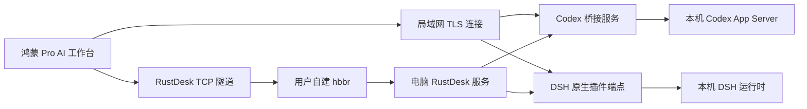

# Pro 远程 AI 工作台：鸿蒙端、Codex 插件与 DSH 插件完整实施计划

- 日期：2026-09-07；计划版本：1.2（电脑端 v0.2.0 发布与设置页安装提示词准备）。
- 状态：Codex/DSH 电脑端 v0.2.0 已发布，两个仓库已公开；真实引擎/本机 Docker/mTLS 及三平台 CI 通过。固定发行记录与未来设置页模板见[安装提示词](2026-09-07-remote-ai-agent-install.md)。[AI0 实施证据](2026-09-07-pro-remote-ai-ai0-evidence.md) 保留早期探针历史；鸿蒙工作台、双机 LAN 与中继仍未接入验收。
- 授权演进：初始为计划落盘；随后用户明确要求开始推进。插件分别使用独立 GitHub 仓库，通过 GitHub 管理分支/提交/PR；本地只保留临时测试副本，鸿蒙 App 使用当前本地工作区。
- 产品归属：RemoteDesk Pro，同一 `pro.lifetime` 买断权益。AI 账号、模型用量与用户自建中继费用由用户承担；我们不运营公网中继。
- 关联：[Pro 总体产品计划](2026-09-06-pro-product-roadmap.md)、[Pro M1/M2 实施计划](2026-09-07-pro-m1-m2-implementation.md)。本文是该路线图的专项功能计划，使用 AI0–AI7 编号，避免与 Pro M1–M7 混淆。
- 工作区：继续既有活动分支 `codex/pro-purchase-foundation`；调查基线 `0000d4ca4`，相对 `main@8edc18786` 超前 5 个提交。已有 Pro 文档改动由原任务维护，不覆盖、不纳入本任务独立交付。
- 证据等级：本文区分已交付电脑端、原型待证事项与未来 App 验收；当前可执行命令以 v0.2.0 固定提交的操作手册为准，下文原计划的拟定接口不自动成为已实现能力。

## 1. 交付目标与边界

用户在鸿蒙 Phone / Pad / PC 上选择自己的电脑和项目，使用 Codex 或 DeepSeek Harness（简称 DSH）聊天、查看执行过程、批准操作、检查代码变化，并在断网后恢复任务视图。模型、代码、命令和主要会话数据由远端电脑管理；鸿蒙端负责交互和经授权的访问。

必须交付三个部分，不能只完成一个聊天演示就宣布完成：

| 部分 | 交付物 | 所属仓库 |
|---|---|---|
| 鸿蒙端 | 原生 AI 工作台、Pro 接入、配对、安全连接、会话与审批、文件差异、恢复和诊断 | 当前 RemoteDeskHarmonyOS |
| Codex 插件 | 标准插件包、部署/诊断技能、常驻桥接服务、App Server 适配、安装升级卸载与完整文档 | [remotedesk-codex-plugin](https://github.com/Mydstiny/remotedesk-codex-plugin)，v0.2.0 已发布 |
| DSH 插件 | 可安装 Cordis 插件、运行时会话控制、同一通信协议、安装升级卸载与完整文档 | [remotedesk-dsh-plugin](https://github.com/Mydstiny/remotedesk-dsh-plugin)，v0.2.0 已发布 |

首发交付两种后端的完整局域网闭环；后续增加用户自建 RustDesk 的 TCP 隧道。鸿蒙界面、后端适配与连接方式解耦，增加中继时不重写会话业务。

明确不纳入当前首发：ZCode、我们托管的中继、模型转售、浏览器/语音/全量官方插件 UI 的完整复制、自动提交和推送代码、跨用户团队协作、任意主机端口代理、云端保存会话、后台云推送。未来需求分别立项，不暗示购买即可使用。

“类似官方”指会话、流式执行、审批、差异和恢复这些核心工作流。使用官方运行时不等于获得官方客户端的全部界面、历史同步和账户权益。不得承诺跨客户端同时控制同一运行中任务。

## 2. 已核对的基础与必须先证明的事项

### 2.1 上游与本地证据

| 对象 | 当前证据 | 对方案的约束 |
|---|---|---|
| Codex | 官方 App Server 提供会话与回合控制、事件、审批；本机 `codex app-server --help` 存在 stdio/WS 入口 | 优先由桥接服务持有 stdio 子进程；不把官方 App Server 直接开放到网络。[S1] |
| Codex 插件 | 标准包以 `.codex-plugin/plugin.json` 为入口，可附技能、MCP 和 Hooks | 插件负责安装管理；外部控制仍通过 App Server，单独一个 MCP 工具不等于远程会话服务。[S2] |
| DSH | Cordis 原生插件和服务可以扩展运行时；会话持久事件与实时运行状态分开 | 插件优先接入正常运行时，保持官方核心可升级。[S3] |
| DSH SDK | stdio SDK 提供提示与事件，但当前没有逐会话关闭/提示取消方法，也不返回逐提示最终结果 | SDK 仅可用于早期探针，不作为完整交互客户端的唯一接入层。[S4] |
| DSH 运行时 | Agent 接口有取消及输入路由；用户交互服务提供作用域化请求；Gateway 的普通 RPC 与事件流是不同契约 | 分别对接控制、审批、事件；必须证明消息与回合关联，不能把 idle 直接当某条消息完成。[S5–S8] |
| RustDesk | 官方 TCP 隧道可转发端口；hbbr 按协议配对后中继字节 | 复用标准端口转发会话，服务器无需理解 AI JSON；适配兼容性仍需实测。[S9–S11] |
| 本项目 | `rustdesk_ffi/src/connector.rs`、`crypto_channel.rs`、`peer_stream.rs` 有连接/加密/流基础；本地 proto 定义 `ConnType.PORT_FORWARD` 与 `LoginRequest.port_forward` | 仅证明构件存在，尚未找到完整鸿蒙端口转发业务链路。需要新增专用隧道 API 和生命周期。 |
| Pro | 当前策略仍为 featureIds 与 available/planned；隔壁 M1/M2 计划改为 lifetime 权益与统一运行时 | 本专项对接 M1/M2 新接口，不复制旧策略，不修改购买基础代码来临时绕过。 |

资料核对日期为本文日期；发布前锁定实际上游版本、提交和协议哈希。当前在线主分支的能力不能自动视为用户安装版本的能力。

### 2.2 AI0 必须回答的技术问题

1. Codex：目标正式版本的插件安装入口、App Server schema、登录环境、Windows/macOS/Linux 支持；正常取消、审批、断线期间继续运行是否可达。
2. Codex 历史：通过官方 API 读取/恢复哪些已有会话；如何识别并拒绝被其他客户端控制的活动线程。无法证明互斥时，只允许桥接服务自己创建和持有的会话，不扫描或修改私有会话文件。
3. DSH：原生插件注册、卸载、会话枚举/恢复、输入与取消、审批/提问的准确服务契约；共享 Web UI 时的控制权冲突与双重回复处理。
4. 鸿蒙：本地 API 23 的安全存储、TLS 客户端认证/证书校验、WebSocket、文件选择、二维码/粘贴导入、网络变化与前后台机制。仅在官方允许的能力上实现；ArkTS 接口不足时验证受支持的 native 网络层，不关闭证书校验。
5. RustDesk：固定客户端/hbbs/hbbr 版本的普通 TCP 端口转发、身份验证、加密、权限拒绝和关闭流程。已有 vendored proto 不含最新 multiplex 字段，首版不依赖该扩展、不暗中升级协议。
6. 执行权限：分别测试 Codex/DSH 的 shell、文件工具、MCP、子进程和子 Agent 能否越出已授权范围。项目列表/cwd 白名单不是进程沙箱；明确远端运行身份、读写根、网络出口及工具权限的真实边界。
7. 支持矩阵与打包：先确定各平台受支持版本与实际测试机器。缺少实机证据的组合保持实验状态，不在兼容表中写“全平台支持”。

退出条件：两个后端均以最小探针证明“发起任务→流式事件→审批/拒绝→取消→读取历史→客户端断线重连”。未知或失败项写出复现证据及替代路径；核心交互无法完成的后端不得标记 released。

## 3. 与隔壁 Pro 工作的集成契约

### 3.1 权益和发布状态

建议预留以下 ID，由 Pro 目录维护方在实施时统一登记；当前仅记录计划，不修改实际目录：

| featureId | 内容 | requiredEntitlementId | 首次发布 |
|---|---|---|---|
| `pro.ai.workspace` | 原生 AI 工作台、会话、审批与差异 | `pro.lifetime` | AI5 局域网首发 |
| `pro.ai.codex` | Codex 后端 | `pro.lifetime` | AI5，独立能力检查 |
| `pro.ai.dsh` | DSH 后端 | `pro.lifetime` | AI5，独立能力检查 |
| `pro.ai.rustdeskTransport` | AI 工作台经自建 RustDesk 隧道连接 | `pro.lifetime` | AI7 中继发布 |

这些 ID 是本功能的拆分开关，不是四笔收费。若 M1 目录采用不同命名，在 AI0 固定映射并迁移文档，避免重复 ID。两种后端和后续中继均纳入本次 Pro 买断范围；不额外收费。

既有 SSH、RustDesk、文件传输和在终端中运行 Codex/DSH 继续免费。只约束新增 AI 工作台；底层共享隧道今后被其他免费功能使用时，不继承 AI 的 Pro 限制。

### 3.2 双方责任

| Pro 底座提供 | AI 专项提供 |
|---|---|
| 可信权益、账号生命周期、缓存时间语义、统一访问策略、Debug 三态和发行隔离 | 功能声明、当前后端/设备/连接能力、入口订阅、每次业务操作的权限复查 |
| 恢复购买、退款、暂时无法验证与明确撤权的区分 | AI 会话安全收尾、设备授权隔离、恢复入口与明确错误原因 |
| 全窗口状态/revision 发布 | Phone/Pad/PC 与多窗口的刷新、焦点转移、取消订阅 |

本专项不新建 IAP SKU、登录系统或验单后端；桌面插件不收取购买凭据，也不把传入的 `isPro` 当作设备授权。Pro 是鸿蒙产品功能门禁，配对/项目授权是远端安全门禁，两者各自验证。开源插件不承担不可绕过 DRM 的承诺。

发布要求：released、适配设备/版本和有效 lifetime 权益全部满足才显示操作；planned/experimental 不通过模拟 Pro 暴露为正式功能。内部开发走隔离的 Debug 构建，沿用 M1/M2 的规则。

账号切换时关闭旧账号的远端控制通道并清理内存凭据，已配对设备配置按本机账户作用域隔离；不上传到云同步。明确撤权停止新增提示/新审批，保留历史和配置。已有任务按已确认的执行策略在远端继续或等待，客户端提供有限的停止、断开和本地回收入口；不得为了维持付费界面而杀死任务或清空数据。临时验单失败依照底座可信缓存处理，不当作退款。

上述 Pro 撤权属于产品权益变化；设备失窃/撤销配对属于远端安全事件，执行第 8.6 节更严格的即时失效规则，不能只隐藏鸿蒙入口。

### 3.3 同工作区协作规则

- 当前 Pro 基础任务未闭环，鸿蒙代码仍在其活动分支按计划追加检查点；不另开日常分支或持久 worktree。
- `services/pro/`、购买面板、账号接线由 Pro 任务维护；AI 实施先限定在独立 AI 目录、注册接口及最小导航落点，集成时串行处理共享文件。
- 不同时执行两次 Hvigor、修改共享状态或提交对方文件。每次落盘/集成前重新读取最新状态和文件内容。
- 本次只增加专项计划及必要的短卡/队列链接；不重写 Pro 总体计划或其 M1/M2 计划，也不把购买演示的旧 review PASS 扩展到 AI 功能。
- 同期 [API 26 基础 UI 计划](2026-09-07-api26-base-ui-upgrade.md) 面向所有用户独立推进。AI 首版以 API 23 能力验证为基础，不强制等待全部 API 26 UI 改造；共享页面与主题组件按该计划约定协调。

## 4. 架构与三个交付部分



图中的中继路径为强制中继验收场景；RustDesk 寻址/认证还需要用户的 hbbs 配置。真实连接也可能协商直连，界面按实际路径显示，不能只因选用了 RustDesk 就显示“已中继”。

### 4.1 共用协议与代码组织

拟定义 `RemoteDesk AI Bridge Protocol v1`：鸿蒙与两个插件使用同一份版本化 JSON Schema、行为规范和兼容测试向量。它是本项目新协议，不冒充 Codex、DSH 或 RustDesk 官方接口。

为避免第四个仓库，协议与纯传输/配对/事件缓存公共包初期放在 Codex 插件仓库的 `packages/protocol`、`packages/bridge-core` 中；DSH 插件依赖固定版本产物，鸿蒙使用同版本 schema 和测试向量。公共包不依赖 Codex 运行时；DSH 用户不需要安装 Codex。依赖变更同步版本、SBOM、NOTICE、来源和哈希，禁止复制两份各自演进。

两个插件分别拥有服务 ID、配对凭据和监听端点；鸿蒙可把它们分组到同一台电脑，首版各自配对。不能凭相同主机名/IP 自动共享信任。未来若做统一宿主进程，再制定显式迁移，不把单独安装变成双后端必装。

候选实现：远端公共库使用与两种生态相容的 Node.js/TypeScript；具体 Node 和包管理器版本在 AI0 锁定。DSH 是运行时内插件，Codex 桥接是受用户级服务管理器监督的独立进程。不得把“安装了 Skill”当作“常驻服务已运行”。

### 4.2 鸿蒙端模块

拟新增 `services/ai/`、`components/ai/` 及对应页面/测试目录；实际路径服从现有导航和会话管理，不另造一套主机库。

| 模块 | 职责 |
|---|---|
| 主机与后端配置 | 关联既有主机；记录后端 serviceId、配对证书引用、允许项目和连接方式；不存明文密钥 |
| Transport | 局域网与 RustDesk 两个实现，统一收发、背压、关闭和网络 generation；无 AI 业务逻辑 |
| Bridge Client | 握手、能力协商、请求关联、事件同步、错误映射与版本检查 |
| 会话运行时 | host/backend/session 分层状态、写入控制权、任务/审批、恢复、缓存限额 |
| 原生界面 | 项目/会话列表、输入、执行卡片、审批和提问、文件差异、设置与诊断 |
| Pro 接口 | 访问策略、账号/revision 订阅、业务入口复查和安全收尾 |

同一后端的多个项目和会话可浏览；首发每个会话只允许一个远程写入控制者，同一可写项目默认串行执行 AI 修改，避免两个后端同时修改文件。跨后端项目锁若无法跨进程可靠协调，首版要求用户为两个后端选择不同工作副本，界面明确检测/提示冲突，不宣称自动隔离。

## 5. 局域网首发设计

### 5.1 连接与配对

1. 插件安装后先以本机模式启动，未配对不能访问会话或项目。
2. 用户/被授权的本地 Agent 显式启用局域网访问，选择网卡和允许网段；服务显示配对二维码、到期时间、主机名称和证书指纹。
3. 鸿蒙扫描、导入二维码图片或粘贴配对信息。PC 无摄像头也可完成流程，手工配置作为发现失败的回退。
4. 二维码含协议版本、候选地址、serviceId、服务证书指纹及短时一次性配对凭据；不包含 AI 密钥、RustDesk 密码或购买信息。
5. 手机验证二维码提供的身份信息，电脑显示待配对设备及项目范围；用户确认后签发设备凭据。二维码泄漏、过期、重复使用必须失败，连接尝试限速。
6. 以后按配对身份认证。换 IP 不等于换主机；证书/密钥改变必须通过旧信任安全轮换或重新配对，不能自动接受。

传输候选为 HTTPS/WSS + 标准 TLS（优先 TLS 1.3）及双向设备认证。具体证书/客户端私钥处理在 AI0 用 API 23 验证；如 ArkTS WSS 无法满足，使用受支持的 native TLS 传输再桥接。禁止自创加密算法、接受任意证书或以明文 LAN 作为发布回退。

局域网监听与上游监听分开：Codex App Server 仍走 stdio；DSH 的既有 Web UI 不被直接暴露。开放的仅是带认证的插件端点。默认不绑定所有公网可达网卡，不自动 UPnP，不改路由器；IPv6 全局地址同样必须限制来源并按防火墙规则验收。

### 5.2 网络和运行条件

- 支持 IPv4、IPv6 字面量、域名解析和多网卡选择，链路本地 IPv6 包含作用域；自动发现仅为后续便利功能，不阻塞手工/二维码连接。
- 同一 Wi-Fi 不保证设备互通：访客隔离、防火墙、不同子网、VPN、虚拟网卡分别诊断。
- 插件与 AI 运行在用户电脑；电脑关机/休眠、退出 DSH 运行时会使服务离线。手机进入后台不负责维持远端任务进程。
- 首版保证前台连接及返回前台后的状态恢复，不承诺鸿蒙无限后台长连或关闭 App 后实时通知。系统允许的通知/后台能力后续单独验证。
- 首版附件限于用户明确选择的文本与图片，大小/数量限额可见；大文件走现有 SFTP 或后续流式附件协议，不把整个仓库同步到手机。

## 6. Codex 插件实施范围

交付“标准插件包 + 管理技能 + 桥接可执行服务”，而不是修改官方 Codex 二进制。标准插件让用户的 Agent 找到受支持的部署和管理流程，独立服务保障手机断线不会结束 App Server。

### 6.1 仓库构成与运行时

拟包含 `.codex-plugin/plugin.json`、`skills/remotedesk-setup/`、诊断/升级/卸载技能、桥接服务、公共协议/安全库、跨平台安装器、发布工作流、示例和文档。可选本地管理 MCP 仅暴露状态/诊断等受控操作，不把任意命令执行作为无条件管理接口。[S2]

服务使用已安装且版本受支持的 Codex CLI，持有一个或按隔离需求分组的 App Server 子进程，通过 stdio 通信。服务进程寿命独立于当前聊天和终端。用户级 launchd/systemd/Windows 登录任务等方案在各平台实测后择定，不能因部署方便默认提权到系统服务。

### 6.2 会话与权限映射

本节是拟实现映射；精确字段以锁定版本 schema 为准：[S1]

| 工作台能力 | Codex 接入方向 |
|---|---|
| 项目内创建/列出/恢复会话 | 官方 thread 接口，叠加桥接项目白名单与所有权登记 |
| 发起/追加/停止 | turn 接口；普通新回合和运行中追加分开显示 |
| 回复与执行过程 | item 事件，保留稳定 item ID 和状态 |
| 修改查看 | 回合 diff 和文件变更事件，检查路径范围 |
| 审批与提问 | 服务器发起的请求，按原始请求身份、有效选项和结果回复 |
| 模型/运行模式 | 仅展示后端实际支持且账号可用的选项，保留远端沙箱与组织策略 |

登录由远端官方 CLI/官方流程完成，桥接仅报告已登录/需要登录，不复制登录文件到手机、不收集原始 token。模型用量信息仅在后端返回时显示；缺失时标为不可用。

首发保证桥接创建/管理的会话；可选导入已有空闲会话必须通过官方 API 和显式授权。不得直接解析或修改 Codex 私有历史库来实现同步，不劫持官方桌面端正在执行的线程。不能可靠判断控制权时返回 `SESSION_BUSY`，由用户在原端完成/停止后恢复。

插件禁用/卸载与常驻服务停止必须分别可见：若官方插件系统没有可靠卸载回调，文档和管理器提供先停止服务再移除插件的完整流程，不声称关闭插件开关就一定撤销网络访问。

## 7. DSH 插件实施范围

### 7.1 安装与扩展路径

按锁定版本的官方插件机制交付可独立安装的包，通过 `dsh plugin` 支持的安装方式及 profile/patch 组合挂载，避免长期维护核心 fork。准确命令在 AI0 用目标版本 `--help` 核验后写入发布文档，本计划不臆造已存在的 CLI 参数。[S3]

首选挂载到正常 DSH Web profile/运行时，与本机 UI 共用业务服务及持久会话；插件自己提供认证过的 RemoteDesk 端点。可选专用远程 profile 作为独立运行方式，但须明确它管理的会话范围，不能假装已接入用户原有活动会话。

### 7.2 服务映射与生命周期

| 能力 | 拟采用路径与验收要求 |
|---|---|
| 项目/会话列表与历史 | 工作区/会话服务及官方持久投影，限制已授权范围；冷会话恢复遵守 Session Controller 所有权检查 |
| 提示和运行中追加 | Agent 的输入队列接口，记录 messageId、实际领取与 turn 边界；不把入队确认当完成 |
| 停止 | 调用准确的活动 Agent 取消接口并等待终态；排队输入是否保留由明确操作决定，不能杀整个 DSH 来冒充单任务停止 |
| 流式状态 | 持久 session 事件和实时 agent 状态分别转换；断线重放不重新触发模型输入 |
| 审批/提问 | 接入官方审批及作用域化用户交互服务；绑定活的运行实例，拒绝已取消或被本机 UI 回答的旧请求 |
| 差异 | 优先采用有来源的工具/文件变更数据；若用 Git diff，标为当前工作区差异，不能归因全部是本次 AI 修改 |

DSH Gateway 的普通 RPC 不包含完整流式协议；原生插件需要分别订阅事件并实现统一桥接协议。[S5–S8]

原生插件挂载、卸载、热重载时：停止接收新远程请求、注销事件监听、撤销待处理的远程审批所有权、关闭本插件套接字；不销毁其他插件或整个用户运行时。重新挂载使用新的 adapterEpoch，旧回复不能作用于新请求。

本机 UI 与鸿蒙端争用时，以服务端所有权/原子状态为准。远程进入控制模式必须显式认领；不能绕过本机审批或把未支持的选项转换为“全部允许”。不能证明一致性的场景禁止远程写入，并保留本机处理入口。

原型若仍无法完成可验证的审批/取消，DSH 保持 experimental；可继续 Codex 试用，但不得对外宣布双后端正式交付。

## 8. 统一协议、恢复和数据模型

### 8.1 握手与模型

拟定握手字段：`protocolMajor/minor`、`serviceId`、`backendKind`、`backendVersion`、`adapterVersion`、`adapterEpoch`、能力列表及帧/附件限额。配对身份先于业务握手；版本不兼容清楚拒绝，不试猜字段。

逻辑模型至少包含：Device、BackendService、Workspace、Session、Run、Item、Approval、Attachment、Connection。远端绝对路径仅由获准工作区映射得到；客户端以 opaque workspaceId 引用，不能提供任意 cwd 来扩大授权范围。

必须分清两种范围：项目白名单控制可列出/选取的数据；执行 profile 决定 Agent 及其工具实际可以读写和联网的范围。首发默认使用经 AI0 验证的受限执行 profile，约束文件、shell、MCP 和子进程/子 Agent；不能只过滤桥接文件 API 而留下任意工具出口。系统运行依赖、必要凭据代理和额外只读根逐项披露，不把“写入受限”宣传为“读取完全隔离”。

不能在目标平台证明执行边界时，禁止默认开放远程执行/写入并标明该组合尚不支持；使用受支持沙箱、容器或独立受限账户后重新验收。若未来提供沿用本机账户广泛权限的主机信任模式，须在电脑端单独明确授权，展示真实权限范围，不继承一次扫码配对或普通项目选择，也不称为项目级隔离。自管 Codex 与接入已有 DSH 会话均须检查实际执行 profile；权限不合格的已有会话只允许合规范围的只读展示。

拟定请求包括：会话列出/读取/创建/恢复、发送/追加、停止、订阅/补齐事件、审批/提问回复、附件上传、变更读取、设备撤销。每种请求均有鉴权、schema、大小上限、错误码和契约测试；不提供任意上游 RPC 透传入口。

### 8.2 幂等与崩溃窗口

- 每个改变状态的请求携带客户端生成的 `operationId`，服务端持久化受理状态、内容哈希与上游关联 ID。相同 ID/相同内容返回已知结果；相同 ID/不同内容拒绝。
- 应答区分“收到”“已交给后端”“执行中”“已完成/失败/取消”“结果待核对”。网络超时不等于后端没有执行。
- 桥接在交给上游后、落盘前崩溃，不能简单声称 exactly-once。恢复时先通过官方历史/消息标识核对；无法确定就标记未知、让用户检查后再决定，不自动重发写操作。
- 手机网络切换、双击发送、重复审批、客户端重启、服务重启都覆盖此规则。
- 幂等键绑定已认证设备、serviceId 和授权作用域。服务端签发带有效期的提交 epoch，事件日志保留期与去重保留期分离：拟定提交 epoch 有效期 24 小时，受理记录至少保留至该 epoch 到期后 7 天；AI0 可按存储预算调整，但必须同步协议与客户端策略。过期 epoch、已回收的历史 epoch 或无法查明的旧 operationId 一律返回 `OPERATION_EXPIRED_RECONCILE`，不能重新当作新请求执行。旧 epoch 的最小拒绝信息持久保存，服务重置使旧 epoch 全部失效；客户端重连不能给同一未决操作自动换新 epoch/ID。超过窗口仍需通过上游历史对账或由用户确认后发起明确的新操作。

### 8.3 事件与状态恢复

事件包含 sessionId、runId（尚未绑定时为空）、itemId、单调序号、adapterEpoch、事件类型与来源。磁盘维护有界事件日志及快照；上游持久历史仍是会话语义的来源，不另写一份无法对账的历史。

普通文本 delta 可批处理，审批、终态和错误不得静默丢弃。设置背压与有界队列；缓冲超限明确要求快照重同步。客户端按序号去重，出现缺口先补齐；日志已轮转时获取快照和新的游标，不从消息正文推断完成。

连接状态与任务状态分离：连接断开只改变在线状态，任务可仍在运行。恢复时先核对主机身份/能力/epoch，再读取任务和待审批真实状态。服务重启后的任务标记为待核对或已中断，不能恢复一个已不存在的“运行中”动画。

### 8.4 审批的强制身份边界

审批至少绑定 backend/service、workspace、session、run、item、上游 requestId、adapterEpoch、操作内容摘要和原始可选决策。回复前重新验证设备授权、当前控制权、有效请求和内容版本。

确认按钮发送后先显示“提交中”，只有后端确认解决才关闭；已解决、超时、取消、失去控制权和 epoch 改变都使旧按钮失效。断线期间默认等待或按上游策略拒绝/取消，绝不自动允许。持久日志保存审计事实，不能据此在重启后复活待审批执行对象。

### 8.5 文件与隐私

- 首发以 AI 修改、只读差异和用户选择的附件为主，不实现全功能 IDE。显示 diff 不自动执行脚本或加载远程 HTML。
- 校验项目根、符号链接/目录联接、大小写及 Windows UNC 路径；上传落入专属附件目录，校验大小和哈希，再引用给后端。
- 不根据 Git diff 声称文件仅由本次 AI 改动；保护用户未提交修改。首版不提供“一键回滚全部”或自动 commit/push。
- 端点私钥放系统安全存储或权限受控位置；会话缓存按账户隔离且可清除。手机缓存与桥接事件日志设上限/保留策略，备份默认排除凭据。
- 诊断默认只有版本、路径类型、连接阶段、错误码和耗时；内容、配对 token、API key、原始命令参数、真实路径和提示正文不进入默认日志。用户选择导出内容时明确预览范围。

### 8.6 设备与项目授权撤销

远端是配对授权的权威。撤销设备/缩减项目权限时原子更新授权 generation；每次请求在入队前和调用上游前检查当前授权，已认证长连接也不能继续使用旧权限。立即关闭受影响连接和订阅、清除写入控制权、拒绝未交给上游的请求及所有旧审批，撤销操作返回已完成失效或仍在收尾的真实状态。令牌/cert 到期与人工撤销分别处理，不能只等下一次 TLS 握手才失效。

安全撤销默认请求取消该设备发起且仍由其控制的活动执行，停止其尚未执行的队列；取消不可用或后端仍在收尾时告知电脑端操作者，不能谎称已停止，也不使用杀死整个宿主进程的方式影响其他任务。普通断网默认保持任务，与设备撤销不同；任务在断网后由本机明确接管的，后续设备撤销不误停当前本机拥有的执行，但该设备失去全部访问。任务归属和接管必须是服务端事实，不能由手机声明。

## 9. 后期 RustDesk 自建中继复用

### 9.1 前提与路径

适用前提：用户拥有或获管理员许可使用公网可达的 RustDesk hbbs/hbbr；远端电脑运行兼容的 RustDesk 服务并允许 TCP 隧道；用户具备该设备认证权限。若中继也只在家中内网且无公网入口，本方案不能凭空使其可达。

```text
鸿蒙 AI Client
  → 本机受控隧道端点
  → RustDesk PORT_FORWARD 会话（寻址、身份验证、加密）
  → 用户 hbbr（直连失败或强制中继时）
  → 电脑 RustDesk 服务
  → 127.0.0.1:插件端点
  → Codex App Server / DSH 运行时
```

插件端点在中继模式默认只监听回环；用户同时启用 LAN 时另加受限 LAN 监听。隧道内仍使用端到端设备认证和 TLS，鸿蒙验证配对时的逻辑服务身份，不能因本地入口是 localhost 就跳过服务证书校验。

只使用本项目明确支持的自建配置，不回退官方公共服务器。hbbr 不需要新增 AI 模块，也不接收 AI 登录凭据；自建服务器能看到连接元数据和流量量级，不能因此宣称“完全无可见信息”。

### 9.2 鸿蒙端必须新增的能力

1. 在 Rust FFI 中新增独立 PortForward 会话：连接类型、登录目标、认证/权限错误、流转发、取消和资源回收。
2. 复用已验证的 connector/加密/流实现，但不要复用桌面视频解析循环或要求打开远程画面。
3. 本机转发端口只绑定回环，随机可用端口或进程内流桥接；remote target 固定为所选插件的回环端口，不能由模型任意指定主机/端口。
4. 一个长连接先承载单后端的业务复用，不依赖 RustDesk 新 multiplex 扩展；如果后续修改 proto/gitlink，单独完成依赖与合规闭环。
5. 根据真实协商显示直连/中继和诊断，不把配置模式当作实际路径。保留显式强制中继用于测试和受限网络。
6. App 前后台、取消连接、账号切换、插件退出、RustDesk 断开、网络切换时关闭对应句柄；迟到回调不能影响新连接。
7. 隧道复用只改变运输方式，Pro 决策、配对、项目授权、审批与事件恢复全部保持同一契约。

### 9.3 两阶段路由策略

- 首版：用户明确选择局域网直连，未实现的中继入口保持 planned。
- 中继初版：用户明确选择 RustDesk，沿用已有自建服务器配置和认证入口；不得暗中从可用 LAN 切至收费流量路径。
- 后续自动模式：用户明确选择后，先尝试已配对身份的 LAN，再尝试其自建 RustDesk；同一任务只有一个有效写入租约。切换先暂停新写入、确认未决操作、重同步，再开放输入。
- 不新增自研公网穿透或修改当前待验收 UDP/KCP 策略。网络拓扑通过什么，就发布什么；仅测试 TCP 就不宣称 UDP/KCP 全面可用。

## 10. 用户操作流程与文档交付

两个插件仓库均需要中文首页、英文首页和完整文档索引，用户不必回到本项目翻找安装步骤。源码、文档和发布包版本一致；截图使用演示数据，不出现真实凭据。

### 10.1 必须提供的文档

| 文档 | 必须讲清楚的内容 |
|---|---|
| `README.md` / `README.en.md` | 产品作用、运行位置、支持平台/版本、Pro 与 AI 费用、快速入口、当前限制 |
| `docs/quickstart-*.md` | 每个平台从安装到首次真实消息的完整步骤与预期结果 |
| `docs/manual-install.md` | 不借助 Agent 的等价操作，包含服务管理与防火墙边界 |
| `docs/agent-deploy.md` | 可交给用户 Agent 的指令、机器可读结果、幂等/回滚、人工登录节点 |
| `docs/lan.md` | 网卡/网段选择、配对、地址变动、访客隔离、IPv6、证书错误 |
| `docs/rustdesk.md` | AI7 发布前标 planned；发布后列出服务器/客户端版本、开启隧道、连接验证与拒绝处理 |
| `docs/security.md` / `PRIVACY.md` | 数据位置、凭据、信任边界、权限、日志、撤销和失窃设备 |
| `docs/operations.md` | 启停、自启动、休眠、更新、备份、证书轮换、撤销、卸载 |
| `docs/troubleshooting.md` | 错误码→原因→验证命令→恢复步骤；脱敏诊断包 |
| `docs/compatibility.md` | 鸿蒙 App/协议/插件/上游/OS/连接方式的已验证版本矩阵 |
| `docs/architecture.md` / `docs/protocol.md` | 三层结构、数据流、请求/事件和状态机、扩展方式 |
| `CONTRIBUTING.md` / `SECURITY.md` / `CHANGELOG.md` | 本地开发、测试、贡献、漏洞反馈与版本迁移 |

快速安装文档中的命令必须在干净环境执行验证，不能让用户自行猜仓库地址、发行资产或参数。视频/GIF 为辅助，核心流程必须有可复制文字和可访问的图片说明。

### 10.2 局域网用户流程

1. 电脑先安装并登录 Codex 或配置 DSH，在本机完成一条正常任务。
2. 通过仓库发布页安装对应插件，或把版本固定的部署指令交给电脑上的 Agent。
3. 部署检查报告展示支持版本、运行用户、项目范围、监听地址、服务状态和所需网络规则；已授权步骤自动完成。
4. 用户选择允许访问的项目并启用局域网配对。鸿蒙 Pro 工作台“添加 AI 主机”扫描/导入配对信息，电脑确认设备。
5. 鸿蒙选择后端和项目，创建会话并发送无副作用测试消息；再在演示项目验证文件修改、审批、拒绝和停止。
6. 主动断开手机网络后重连，确认同一会话和真实执行状态；用户可切换现有远程桌面/SFTP 检查结果。
7. 设置中可停止服务或撤销设备；卸载默认保留用户项目、AI 账号和原生历史。

### 10.3 中继用户流程

1. 先确认相同设备通过其自建 RustDesk 可认证连接；检查服务器公网可达与隧道权限。
2. 插件启用回环端点；鸿蒙 AI 主机选择现有 RustDesk 配置、电脑 ID 和对应插件服务。
3. 完成独立 AI 设备配对。可先在 LAN 配对，也可通过已认证的 RustDesk 隧道传输配对请求，并由电脑本地确认；配对凭据仍是一次性的。
4. 在手机蜂窝网络、电脑局域网的真实跨网环境强制中继，验证消息、审批、差异和恢复；不能用同路由器访问公网域名替代。
5. 若失败，区分 ID 服务不可达、中继不可达、设备认证失败、隧道被禁、插件离线、AI 登录失效和版本不兼容，不统一报“网络错误”。

## 11. 让用户的 Agent 自己部署

### 11.1 安装器必须提供的能力

以下是待实现的命令契约，实际可执行名在仓库创建后固定；当前不可直接运行：

| 拟定动作 | 输入/输出契约 |
|---|---|
| `doctor --json` | 只读环境检查；版本、架构、运行时、端口、后端登录状态、能力、错误码与下一步；不输出秘密 |
| `install --dry-run --json` | 固定版本/来源，列出安装位置、依赖、配置差异、自启动/防火墙影响；不修改机器 |
| `install --version <fixed> ...` | 安装经校验的发行资产或固定源码，幂等写入本插件自己的配置 |
| `configure --dry-run` / `configure` | 明确项目、网卡、模式和限额，保留用户其他配置，事务性写入并记录本插件拥有的条目 |
| `start` / `stop` / `status --json` | 返回真实服务状态、PID 所有权和健康检查结果，不把后台启动命令返回视为就绪 |
| `pair` / `devices list` / `devices revoke` | 本机受控输出临时配对 UI，管理设备授权；机器日志只给凭据引用或脱敏值 |
| `upgrade --version <fixed>` / `rollback` | 检查兼容矩阵、优雅停止/等待任务、迁移备份、健康检查失败回滚 |
| `uninstall --dry-run` / `uninstall` | 默认撤销本插件设备、关监听、移除自有服务和配置；项目与原生会话不删除 |

JSON 结果字段至少含 `schemaVersion`、`status`、`changed`、`componentVersions`、`checks`、`actions`、`requiresUserAction`、`warnings`；明确非零退出码并区分不可兼容、缺少登录、待授权、网络失败、安装回滚。

### 11.2 Agent 部署状态机

`检查 → 生成变更计划 → 执行已授权步骤 → 后端就绪 → 配对等待 → 双端连通验证 → 部署完成`

- 安装入口指向维护者仓库的固定 release/commit，验证签名或可信发布证明及哈希；不能只把同源下载的 checksum 当独立来源认证，不执行浮动的远程 shell 管道。
- 优先用户级安装，包版本精确锁定；依赖缺失、磁盘不足、端口冲突、路径有空格/中文、代理不可用均提供明确诊断。
- 安装器拥有独立配置标记，重复运行不重复注册服务/插件，不覆盖整个 Codex 配置或 DSH profile。回滚仅撤销自己创建的项。
- Agent 可读取官方插件/部署文档并执行用户已授权步骤；运行时权限不足、登录/二次验证、配对确认等确需用户操作时停在明确节点。文档不能指示关闭沙箱、自动批准模型操作或打印密钥。
- 自启动和防火墙变化在 dry-run 中可见；用户明确授权后执行必要最小改动，不要求每条普通命令再次确认。没有授权的提权不能以“自动部署”为由跳过。
- Codex 部署不得通过在当前会话中递归启动无限 Agent 来维持服务；DSH 部署要区分插件安装成功、运行时已加载和端点可用。
- “完成”必须同时具备插件加载/服务健康、后端握手和鸿蒙真实配对收发证据；等待手机扫码只能记为“服务就绪，待配对”。纯本机 doctor 成功不能冒充跨设备成功。

### 11.3 发布时供用户复制的 Agent 指令模板

下文是文档模板；发布时把占位符替换为真实固定地址和版本：

> 请依据 `<维护者仓库的固定版本 docs/agent-deploy.md>`，把 RemoteDesk 的 `<Codex 或 DSH>` 插件部署到这台电脑，先使用局域网模式。先检查兼容性和已有配置，再展示安装位置、允许的项目、监听网卡、自启动及防火墙影响。自动完成我已经授权的步骤，保持现有 AI 账号和项目数据。使用固定版本并验证发行来源；需要我登录或确认设备时明确提示。最后运行 doctor、健康检查和鸿蒙配对验证，给出实际结果、停止服务和卸载方法，不输出密码或 token。

仓库内 `AGENTS.md` 面向维护者贡献；`docs/agent-deploy.md` 与部署 Skill 面向终端用户 Agent，职责分开。两种插件都要提供手工安装回退，不能只写“让 AI 帮你安装”。

### 11.4 设置页的可复制安装提示词

2026-09-07 补充：[安装提示词与设置页规范](2026-09-07-remote-ai-agent-install.md) 已提供 DSH/Codex v0.2.0 的完整可复制模板、固定发行 commit/资产 SHA256、独立 DSH profile 部署与当前对话保护，以及“复制成功 / 主机就绪 / 已配对 / 真实任务成功”的分别判定。未来设置页必须提供后端选择、最终文本预览、复制提示词和手工说明入口；不将配对邀请或账号密钥复制进去。当前仅准备资料，不实现鸿蒙页面。0.2.0 的真实命令以固定版本 operations 为准，11.1 的一体化安装器表仍是后续目标，不能当已实现命令。

## 12. GitHub 仓库、发布与维护

### 12.1 创建与所有权

用户已允许后续创建两个插件仓库。实施阶段核对当前 GitHub 身份与可写 owner，优先使用本项目既有维护者归属；名称以 `remotedesk-codex-plugin`、`remotedesk-dsh-plugin` 为候选并检查冲突，不覆盖同名仓库、不要求重复授权已允许的新建动作。若存在多个无法判断的 owner，再确认具体归属。

实施阶段已经获准开工并创建独立仓库，GitHub 为插件源码与版本的权威位置；先准备可评审初始内容，仓库初始为 private，面向用户分发前完成来源、许可、秘密扫描和发布检查。公开发布与官方插件目录上架分别处理，不能把 GitHub 建仓等同于获得官方认证。无需我们自己的后台即可通过 GitHub Release 提供下载和文档。

每个仓库包含：有效许可证及依赖说明、版本化构建、CI、自动化测试、安装文档、问题模板、贡献规范、漏洞报告入口和可验证的发布资产。不将本项目原始历史、`refs/archive/*`、签名材料或会话数据复制进去。

### 12.2 版本与资产

- 独立插件语义版本 + 统一桥接协议版本 + 精确上游兼容区间；发布兼容矩阵和机器可读 manifest。
- 首发目标：Windows x64、macOS arm64/x64、Linux x64；Linux arm64 作为后续候选。Codex/DSH 上游与实际测试机器共同决定正式支持，不具备条件的组合不得仅因代码跨平台就标支持。
- 每个正式支持平台提供安装/卸载入口；优先带受支持运行时或自动检测安装必要依赖的发行包，不能要求普通用户从仓库构建完整生态。
- 发行资产、校验值、来源证明、SBOM 和迁移说明一起发布。签名/系统公证能否完成作为对应平台安装体验门禁，不能提示用户全局关闭系统安全机制。
- 自动升级首版只提示，不在运行中的 AI 任务中途热替换；升级前检查活动任务，完成后健康检查并可回退。
- 首版支持当前已验收版本，后续维护当前及前一个兼容协议小版本；未知上游大版本拒绝启用写入，提供升级/降级指南。

### 12.3 许可与费用边界

新仓库许可证在确定实际依赖/复制代码范围后选择并记录。尽量通过上游公开协议/插件机制接入，不能假定“插件”这个名称消除上游许可证要求。涉及 RustDesk 或本项目代码/协议复制时，沿用项目合规流程更新 NOTICE、SBOM、来源与哈希，再发布。

Pro 收费对应鸿蒙产品体验；模型消耗遵守用户自己的 Codex/DSH 账号和提供方条件；中继带宽由用户承担。不承诺我们提供公网连接 SLA，不增加隐藏云存储或强制遥测服务。

## 13. 实施里程碑与可评审工作包

| 阶段 | 可独立检查的工作 | 依赖 | 退出条件 |
|---|---|---|---|
| AI0 接口验证 | 锁定版本、两后端控制/审批探针、API 23 安全传输原型、兼容表、Pro 接口冻结 | 本计划与允许开工 | 第 2.2 节核心问题有证据；不靠终端文本猜状态 |
| AI1 协议与配对 | 两仓初始内容、公共 schema/测试向量、TLS 设备配对、项目白名单、请求/事件存储 | AI0 | 两适配器通过同一契约测试；未配对/错身份拒绝 |
| AI2 Codex 插件 | 标准插件包、常驻桥接、会话/执行/审批/差异/恢复、安装维护 | AI1 | 单后端端到端与部署流程通过，官方 CLI 可继续正常使用 |
| AI3 DSH 插件 | 原生运行时插件、会话/取消/审批/事件、热卸载、安装维护 | AI1 与 AI0 的 DSH 验证 | 与本机 UI 的一致性通过，不依赖修改核心 |
| AI4 鸿蒙工作台 | 原生页面、Pro、两后端、配对、流式渲染、差异、账号/窗口/网络生命周期 | Pro M1/M2 接口稳定、AI1；可用模拟后端开发 UI | 两后端都经真实设备完成核心场景；模拟不能代替后端验收 |
| AI5 局域网首发 | 三部分集成、跨平台干净部署、文档/Agent 安装、安全与回归、发布资产 | AI2–AI4；销售另依赖 Pro 可信购买闭环 | 第 14 节 V1 必需项全部通过；正式支持矩阵与限制可核验 |
| AI6 RustDesk 隧道 | 专用 Rust FFI、标准 TCP 转发、回环插件端点、强制中继、鉴权与恢复 | AI5 协议稳定；用户自建测试环境 | 跨网真实传输与拒绝/断线测试通过；不修改 hbbs/hbbr |
| AI7 中继发布 | Codex/DSH 完整复测、拓扑/版本矩阵、文档升级、可选自动切换 | AI6 | 中继验收通过才放开 Pro 中继功能；无官方公共服务回退 |

实现顺序：先 AI0/AI1，再用 Codex 打通一条纵向链路；DSH 和鸿蒙可在接口稳定后按独立文件/仓库推进，跨仓协议修改集中协调。AI2/AI3 不必等 Pro 验单后端；AI5 正式收费不能绕过 Pro 销售门禁。

每个阶段拆成小范围提交：协议/安全基础、一个适配能力、鸿蒙消费、验收/文档。审查覆盖实际代码和对应计划增量；发现问题修复并复验后才合并。不能把本次计划审阅当作未来实现 PASS。

不在原型完成前给出虚假精确工期。AI0 结束后按接口缺口、平台数量和测试设备重新估时；首先决定 DSH 控制/审批和鸿蒙 TLS 两个高风险项是否需要额外适配。

## 14. 验收矩阵与发布门禁

### 14.1 V1 必需用例

| 类别 | 必须覆盖的场景 | 通过标准 |
|---|---|---|
| 双后端 | 新建/历史/恢复/普通后续输入/执行中追加/成功/失败 | Codex 和 DSH 各自真实运行，不以 mock 替代 |
| 停止 | 执行中停止、排队输入、连续停止、后端拒绝 | 准确到目标任务，后端确认终态，不误停其他会话 |
| 审批 | 同意/拒绝/取消/断线/重复回复/本机已处理/旧 epoch | 无误授权，提示对应准确操作，旧回复不生效 |
| 断线恢复 | 手机断网/后台/重启，电脑服务重启，发送后应答前断线，超过去重保留期重试 | 不重复执行，过期操作拒绝并核对，未知结果可解释，历史/状态可对账 |
| 文件 | 中文/空格/大文件、符号链接/目录联接、已有未提交改动 | 不越权/不覆盖；截断可见；差异来源准确 |
| 安全 | 错证书、二维码泄漏/过期/重放、设备撤销、非授权项目、shell/MCP/子 Agent 越界探针 | 连接或操作被拒绝，实际执行边界成立，日志无秘密 |
| 撤销 | 已认证连接持续收发时撤销、队列等待时缩减项目权限、旧审批回复、本机接管 | 连接/订阅/写权限即时失效，按归属取消任务，后端未停如实报告 |
| 局域网 | IPv4/IPv6、多网卡、网段变化、防火墙/访客隔离 | 成功路径实际可用，失败原因区分清楚 |
| 多端 | Phone/Pad/PC、深浅色、触摸/键鼠、窗口缩放、多窗口 | 阅读输入/审批可用，状态不串会话，焦点正确 |
| Pro | 免费/真实 Pro/Debug 三态、升级、账号切换、撤权/暂不可验 | 新入口受统一策略控制，免费功能和用户数据不受损 |
| 安装维护 | 两插件各支持平台干净安装、重复安装、失败回滚、升级/卸载 | 幂等、无残留监听/自启动，保留项目与原生 AI 数据 |
| Agent 部署 | 用户 Agent 只读发布文档完成安装到配对的实际演练 | 未依赖隐藏人工修复；登录/配对待办如实报告 |
| 并发/压力 | 多会话、长历史、日志轮转、慢客户端、队列满 | 无无限内存增长/静默丢审批，能重同步 |

基准目标（验收目标，非当前成绩）：同网空闲环境，剔除模型耗时后的控制请求往返 P95 ≤ 300 ms；健康长连接下事件呈现 P95 ≤ 500 ms；链路恢复且后端可达时 95% 的测试重连在 10 秒内完成状态同步。至少做 2 小时混合消息/断线测试及 100 次连接/断开循环，检查内存、句柄和重复订阅不随循环无界增长。基准设备、网络、消息量、样本数和失败率随报告记录。

### 14.2 RustDesk 额外必需用例

- 手机蜂窝网络→家庭宽带电脑，经公网自建 hbbr 强制中继，两端处于不同 NAT；提供真实路径证据。
- 普通 TCP 隧道的双后端消息、审批、附件/差异、停止和恢复；全程无需远程视频窗口。
- 错 server key、错误设备认证、隧道权限关闭、目标端口不存在、插件错证书、配对设备被撤销，逐项正确拒绝。
- 中继重启/断流、手机换网、连接取消、App 退出，资源可回收；模型任务不因客户端运输断开自动重发。
- IPv4/IPv6、CGNAT、UDP 被阻断及 TCP 可用、禁用 P2P/强制中继的矩阵；仅 443 可出的网络若未配置可用自建入口则明确不支持，不能声称天然穿透。
- 固定 RustDesk 客户端和 hbbs/hbbr 版本、OSS 首发；Server Pro 或定制版本只有独立通过测试才加入矩阵。
- LAN/RustDesk 手工切换必测；自动切换只有互斥、未决请求核对和恢复均通过才交付。

### 14.3 工程与证据要求

鸿蒙仓库每次改动执行当次门禁：

```sh
source scripts/macos_env.sh
hvigorw --mode module -p module=entry -p product=default default@OhosTestCompileArkTS --analyze=normal --parallel --incremental --no-daemon
hvigorw --mode module -p module=entry -p product=default assembleHap --analyze=normal --parallel --incremental --no-daemon
git diff --check
pwsh -NoProfile -File scripts/verify_open_source_release.ps1 -Mode Light -RepositoryRoot .
```

ArkTS 测试模块受影响时加 `ohosTest@OhosTestCompileArkTS`；Rust/C++/FFI 增量加定向测试及受影响 ABI，发行按仓库 Release 规则完成 clean clone、双 ABI 和真机矩阵。构建过程不改项目持久路径至临时目录。

插件仓库执行类型检查、单元/协议契约、真实锁定上游集成、安装维护、包内容/秘密扫描、依赖来源与发行验证。每个 release 的验收报告关联三个组件版本、提交、schema 哈希、平台、网络与测试结果；保留脱敏失败案例。上游升级触发对应适配器兼容回归，不能仅依靠编译成功。

独立审查至少检查远端权限和审批、幂等崩溃窗口、资源生命周期、安装器配置保护及 Pro 集成。用户自建中继未提供时，AI6/AI7 标记待实网验收，不能用本地模拟代替。

## 15. 风险、依赖和失败时的处理

| 风险/依赖 | 处理方式 | 阻塞的交付 |
|---|---|---|
| DSH 预览 API 变化 | 锁定兼容版本、原生插件探针、自动契约回归；无有效审批/取消不放行 | DSH released 与双后端首发 |
| Codex 官方桌面活动线程无法安全共享 | 首版仅桥接管理会话；已空闲会话导入独立验收 | 活动线程跨客户端接管，不阻塞自管会话 |
| 鸿蒙安全传输/密钥 API 不满足 | API 23 本地定义+设备验证，必要时受支持 native 实现；不降级明文 | 局域网正式发布 |
| Pro 底座/可信验单未就绪 | 先开发插件与隔离 Debug 联调，沿用统一接口 | 正式付费开放 |
| 用户没有公网可达的自建 RustDesk | 提供 LAN/已有自备网络方式，说明前提；不代运营服务器 | 该用户的跨网连接 |
| RustDesk 隧道/新版协议差异 | 先做固定版本普通 TCP，保持视频链路不回归 | AI6/AI7 |
| 两后端同项目并发修改 | 默认串行；跨进程锁无法证明时使用独立工作副本 | 同项目并发写入 |
| 发布签名/测试机器/网络环境缺失 | 明确支持矩阵与待验项，准备真实资源后补验 | 对应平台/路线发布 |
| 插件卸载不等于服务停止 | 独立状态、启停、撤销和卸载闭环 | 可维护性验收 |
| 会话日志或用户输出含敏感信息 | 内容默认不进诊断，限制缓存、授权导出、格式净化 | 隐私验收 |

## 16. 当前落盘结果与下一步

计划阶段交付为这份独立实体计划。现已开始 AI0，实际代码、仓库、验证及未完成项以[AI0 实施证据](2026-09-07-pro-remote-ai-ai0-evidence.md)为准；不将探针通过视为三个部分全部实现。

实施从 AI0 开始，持续读取最新 Pro M1/M2 状态；两个具备首批源码/文档/CI 的插件仓库已创建。后续补齐高风险执行与设备探针，按本计划推进；现有活动分支和其他任务的 Git 状态仍须核对。

需要在实施中落定而非凭空假定的配置：GitHub owner/最终仓库名、各后端和 Node 的锁定版本、最低系统版本、监听端口/证书实现、发布签名材料、正式设备矩阵、RustDesk 自建测试环境。它们不阻止本次完整计划落盘。

本计划的本地验证结果记录在共享短卡，若同期构建/提交影响代码快照，需明确结果属于实际受测状态。未来实现与真机/公网验收不能引用本次文档构建作为通过证据。

独立计划审阅：`/root/review_remote_ai_plan` 于 2026-09-07 完成初审和修订复查。已补齐执行权限与项目可见范围的区分、现有连接的设备撤销、幂等记录过期三个约束，并同步验收矩阵；最终结论为计划审阅通过，无剩余阻塞性意见。这不是代码 review PASS，也不证明原型或真机已通过。

## 17. 官方来源与本地定位

以下页面在 2026-09-07 核对，用于支持接口存在和约束；本文的 RemoteDesk 架构、命令契约、里程碑与产品策略是拟定设计。

- [S1：Codex App Server](https://learn.chatgpt.com/docs/app-server) — 会话、回合、事件、审批和差异。
- [S2：OpenAI 插件打包](https://developers.openai.com/plugins/build/plugins) — manifest、技能与分发结构。
- [S3：DSH 架构与 profiles](https://deepseek-harness.github.io/deepseek-harness/en/reference/) — 原生插件与运行时组合。
- [S4：DSH SDK Server](https://github.com/deepseek-ai/deepseek-harness/blob/master/packages/sdk/server/README.md) — stdio 服务的能力与当前限制。
- [S5：DSH Core](https://deepseek-harness.github.io/deepseek-harness/en/reference/subsystems/core) — Agent 输入、取消与状态。
- [S6：DSH User Interaction](https://deepseek-harness.github.io/deepseek-harness/en/reference/subsystems/user-questions) — 作用域化用户提问。
- [S7：DSH User Approval](https://deepseek-harness.github.io/deepseek-harness/en/reference/subsystems/approval) — 审批扩展点，具体适配需 AI0 证明。
- [S8：DSH API Gateway](https://deepseek-harness.github.io/deepseek-harness/en/reference/api-gateway) — 普通 RPC、身份解析和流式边界。
- [S9：RustDesk TCP tunneling](https://github.com/rustdesk/rustdesk/wiki/FAQ#how-to-use-tcp-tunneling-port-forwarding) — 官方端口转发用途。
- [S10：RustDesk port_forward.rs](https://github.com/rustdesk/rustdesk/blob/master/src/port_forward.rs) — 官方客户端隧道实现，线上新字段不等于本地已支持。
- [S11：RustDesk relay_server.rs](https://github.com/rustdesk/rustdesk-server/blob/master/src/relay_server.rs) — hbbr 配对/转发。
- [S12：DSH 官方介绍](https://deepseek.com/harness/en/) — 插件化定位及开发者预览状态。

本地实施入口（相对仓库根）：`entry/src/main/ets/services/pro/ProAccessPolicy.ets`、`ProEntitlementService.ets`、`SshForwardingController.ets`、`rustdesk_ffi/src/connector.rs`、`crypto_channel.rs`、`peer_stream.rs`、`rustdesk_vendor/libs/hbb_common/protos/message.proto`、`rendezvous.proto`。实际改动前重新搜索调用方和 API 23 声明，不把这些定位当作已经完成架构设计或代码适配。
