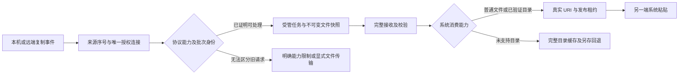

# RustDesk 文件复制粘贴体验补齐方案

日期：2026-09-08。状态：PLAN_ONLY / 尚未按本方案实施。用户要求“结合代码和官方，给我一个详细的方案”；本次只新增设计与验证安排，不修改功能代码、不升级依赖、不安装或操作设备。

代码核验基线：`9733a624d4762a63f3c2265cd72665f5b848db79`，活动分支 `codex/pro-purchase-foundation`，相对 main `8edc18786` ahead 91 / behind 0。已有文件能力的代码检查点为 `d3a4500d`，记录见[父计划第 13、14 节](2026-09-07-file-transfer-clipboard-remediation.md)。并行 Pro/Phone 修改不属于本方案；实施时继续同一活动分支，不创建持久 worktree。

## 1. 交付目标及当前结论

主目标是：PC 本机与远端反复复制普通文件或文件夹，在另一端的系统文件管理器粘贴，无需每换一批文件重连；开关开启且授权连接可运行时保持双向同步。手机/Pad 保留明确的选择、接收、另存交互，文字持续同步沿用已有机制。

用户原要求是“拖拽到本地，或者复制到本地粘贴”。因此本方案以复制粘贴为主线，真实远端桌面拖出是独立增强项，不作为复制粘贴主线完成的必要条件。不能把传输列表内的拖动算成远端资源管理器拖出。

必须区分三个层级：

| 交付层级 | 预期体验 | 当前判断 |
|---|---|---|
| A：兼容官方远端 | 现有双向文件任务、远端文件自动准备后本机粘贴、明确失败与目录回退 | 有实现基础；真实设备未验收。现有协议无法据此承诺无重连连续替换本机文件 |
| B：连续复制粘贴主线 | A→B→C 文件批次安全切换；支持目标设备的目录系统粘贴；不重连远程桌面 | 文件批次绑定需要远端配合的增强协议，或先取得等价的官方协议证据；目录能力需鸿蒙系统验证 |
| C：拖出与按需文件提供 | 从远端桌面拖出；系统粘贴时才开始网络读取 | 分别依赖远端拖放对象和鸿蒙文件提供机制；独立研究，不能混入 A/B 的完成声明 |

结论不是“RustDesk 只能复制一次”。官方实现有循环复制粘贴流程；本项目为防止迟到请求串读新文件，采取了禁止旧 publication 之后继续提供新文件的限制。要同时取得完整体验和严格文件归属，必须补齐请求与文件快照之间的协议契约。

RDP 是交互参照，不是所有能力已验收的事实：本项目 RDP 的目录系统粘贴、真实拖出和设备矩阵也尚未完成。文件会话的目标路径上传下载，与资源管理器 Ctrl+C/Ctrl+V 是不同操作。

## 2. 官方证据与本机 SDK 核验

以下均于本次编写时重新检索或读取。RustDesk 以项目锁定版本为实现依据，master 说明只用于理解，不作为静默升级依据。鸿蒙文档由官方开发者知识接口完整检索，并与本机 API 26、保留的 API 23 `.d.ts` 对照。

| 编号 | 官方事实及核验点 | 对设计的约束 |
|---|---|---|
| O1 | [RustDesk 文件剪贴板说明](https://github.com/rustdesk/rustdesk/blob/93d064a9b0eb58ab94db88ff727a877ef773c0d8/libs/clipboard/README.md)：先发布清单，再由目标应用请求文件内容；Windows 使用流，Unix 使用 FUSE | 复用现有文件任务和 Cliprdr，不把 OHOS 当成已有 Windows OLE/FUSE 环境 |
| O2 | [固定 message.proto](https://github.com/rustdesk/hbb_common/blob/387603f47cbb15c0d3dc3d67ae3396d3eb707daf/protos/message.proto) `Cliprdr`：清单、清单应答和内容请求/响应存在；没有 Lock/Unlock 消息；内容请求的 clip_data_id 可缺省 | 本机 generation 或新 format ID 不会自动成为远端内容请求的批次身份；ACK 不表示旧文件对象消失 |
| O3 | [固定 Windows 实现](https://github.com/rustdesk/rustdesk/blob/93d064a9b0eb58ab94db88ff727a877ef773c0d8/libs/clipboard/src/windows/wf_cliprdr.c)：内容请求使用 streamId、listIndex，clipDataId 为 0；锁定/解锁回调未实现实际绑定 | 旧 IStream 的首次读取可以晚于新清单；只记录“已见过的 streamId”不够 |
| O4 | [固定 Unix FUSE 请求](https://github.com/rustdesk/rustdesk/blob/93d064a9b0eb58ab94db88ff727a877ef773c0d8/libs/clipboard/src/platform/unix/fuse/cs.rs#L530)、[固定 Unix 文件服务](https://github.com/rustdesk/rustdesk/blob/93d064a9b0eb58ab94db88ff727a877ef773c0d8/libs/clipboard/src/platform/unix/serv_files.rs)及 O1：内容请求不带 clipDataId；服务按清单索引读取 | Windows 与 Linux/macOS 分别核验，不能把 Windows 验收推广到所有官方远端 |
| O5 | [鸿蒙剪贴板](https://developer.huawei.com/consumer/cn/doc/harmonyos-references/js-apis-pasteboard)：`getDataWithProgress` 自 API 15 起，明确不支持拷贝文件夹；`getData`、`getUnifiedData` 是读取接口 | 现有普通文件读取器不能直接放开目录判断；读取接口返回 Promise 不等于提供方能等待网络 |
| O6 | [标准化数据通路](https://developer.huawei.com/consumer/cn/doc/harmonyos-references/js-apis-data-unifieddatachannel)：`Folder` 自 API 10 起；同设备剪贴板 `GetDelayData` 自 API 12 起，同步返回 `UnifiedData` | Folder 是数据表示，不能证明系统文件管理器已支持目录粘贴；不得用 Promise 冒充同步返回契约 |
| O7 | [拖拽事件](https://developer.huawei.com/consumer/cn/doc/harmonyos-references/ts-universal-events-drag-drop)与 O6：`DataLoadParams` 自 API 20，`DelayedDataLoadHandler` 自 API 22，支持异步供数 | 可研究真实拖放的准备过程；不能将该接口直接用于系统剪贴板 Ctrl+V。超时、取消和接收方行为仍须实测 |
| O8 | O6 的 `UriPermission` / `uriAuthorizationPolicies` 自 API 26 起，仅在拖放场景生效；默认文件授权包含写与持久化 | API 26 拖出私有副本时显式限制为所需读权限；API 23 不调用该新字段。此权限策略不能用作剪贴板目录授权证据 |
| O9 | [申请剪贴板权限](https://developer.huawei.com/consumer/cn/doc/harmonyos-guides/get-pastedata-permission-guidelines)、[受限开放权限 READ_PASTEBOARD](https://developer.huawei.com/consumer/cn/doc/harmonyos-guides/restricted-permissions)、[文件授权持久化](https://developer.huawei.com/consumer/cn/doc/harmonyos-guides/file-persistpermission) | 检查实际签名/Profile、设备授权和 URI 生命周期；`usedScene.when=always` 不代替权限或后台执行资格，不持久化未经授权的 URI |

SDK 复核结果：API 26 和 API 23 都声明了同步 `GetDelayData`、`Folder`、API 22 异步拖放 handler；API 23 没有 API 26 的 `uriAuthorizationPolicies`。声明存在只证明可编译范围，需再检查 SysCap、运行版本和实际消费方。生产 target/min 当前仍保留 API 23，不能因开发 SDK 26 而直接放开 API 26 路径。

本次重新下载的固定官方源码 SHA-256：README `a971699ac41733b359ce2b195a216295ef17b714b8d085205a53987951e04f2a`；Windows C `78447b546243d068407ec6eee798e48a2bbe69261828834ea9700c293beb887c`；Unix serv_files `ae7093deb46ce448297fad95e333eb6c6edb271063f10c2dc3540ceb0f3b06c1`；clipboard lib.rs `6dc4d09972cf5667605d0bb111aae03290975dd2826dfdee40005ebccddc7eda`。依赖锁定来源见 [UPSTREAM.yml](../../../rustdesk_vendor/libs/hbb_common/protos/UPSTREAM.yml)。本次未修改 vendor/proto。

## 3. 当前代码基础与差距

行号只对应上述代码基线；实施前按函数名重新定位。

| 编号 | 当前接入点 | 已有能力 / 需要补的部分 |
|---|---|---|
| C1 | [file_clipboard.rs](../../../rustdesk_ffi/src/file_clipboard.rs)，`publish` 818、`revoke` 934、`serve_contents` 1028 | 已有受控 FD、描述符、范围读取、publication 和释放；`revoke` 将 `outbound_blocked` 置为 true，后续 `publish` 拒绝。此处不能仅删判断 |
| C2 | 同文件 `invalidate` 637、`poll` 675、`request_descriptor` 778、`process_format_list` / 响应分派 1237 | 正常入站可反复接收；描述符超时或请求未决时关闭/失权，会隔离无请求 ID 的入站通路。新清单先清诊断再因 blocked 返回，会掩盖恢复原因；晚描述符目前直接忽略。重新开开关不等于恢复 |
| C3 | [RustDeskClipboardClient](../../../entry/src/main/ets/services/RustDeskClipboardClient.ets)，`entries`、`publish`、`revoke`、`receive` | 已固定 session/generation、清单校验、5 秒收束观察、接收终态；缺少连续发布能力分级和明确的“仅此方向受阻”状态 |
| C4 | [PcRemoteClipboardFileService](../../../entry/src/main/ets/services/PcRemoteClipboardFileService.ets)，`publish` 237 | 已能自动接收全批后发布普通文件真实 URI；目录或带子路径的条目明确进入 cached，未发布目录 |
| C5 | [SystemClipboardFileProvider](../../../entry/src/main/ets/services/SystemClipboardFileProvider.ets)，`read`；[TransferDirectoryProvider](../../../entry/src/main/ets/services/TransferDirectoryProvider.ets)，`scanAuthorizedTransferDirectory` / `exportTransferArtifactTree` | 系统读取拒绝目录；已有授权目录扫描与整树导出可复用。目录 URI/子项授权和系统消费能力需另证 |
| C6 | [TransferArtifactStore](../../../entry/src/main/ets/services/TransferArtifactStore.ets)、[TransferArtifactPublicationService](../../../entry/src/main/ets/services/TransferArtifactPublicationService.ets) | 已有私有副本、manifest、partial、发布租约；还需独立的可供系统读取的实体目录树及消费生命周期验证 |
| C7 | [ClipboardBridgeService](../../../entry/src/main/ets/services/ClipboardBridgeService.ets)、[ClipboardCoordinator](../../../entry/src/main/ets/services/ClipboardCoordinator.ets)、[native authority](../../../entry/src/main/cpp/extensions/session_clipboard_authority.h) | 已有持续监听、来源防回环、跨 runtime 授权与最终同步写保护；须保留，不能用焦点恢复重新抢占 |
| C8 | [file_transfer.rs](../../../rustdesk_ffi/src/file_transfer.rs)、[connector.rs](../../../rustdesk_ffi/src/connector.rs)、[ManagedTransferTaskService](../../../entry/src/main/ets/services/ManagedTransferTaskService.ets) | 已有单独文件会话、FD 分块上下行、任务和取消；可作为兼容回退，但不能推断远端资源管理器当前目录 |
| C9 | [RemoteDesktop](../../../entry/src/main/ets/pages/RemoteDesktop.ets)、[ExtensionLoader](../../../entry/src/main/ets/services/ExtensionLoader.ets)、[RustDesk bridge](../../../entry/src/main/cpp/rustdesk/rustdesk_bridge.cpp) | 当前页面承担较多 orchestration；新增状态放服务/adapter，页面只处理用户入口和状态显示；FFI 两份类型镜像同步 |
| C10 | [RemoteSessionBackgroundTaskService](../../../entry/src/main/ets/services/RemoteSessionBackgroundTaskService.ets)、[FileTransferLiveTaskService](../../../entry/src/main/ets/services/FileTransferLiveTaskService.ets) | 已区分远程会话与实际传输后台任务。持续监听不能靠伪造 dataTransfer 永久保活 |

现有规模边界：页面的系统普通文件入口最多 15 条（provider 自身最多 256 条）；RustDesk Cliprdr 最多 256 条、单文件及清单总量受 2 GiB 限制；目录/缓存通用层最多 1024 条、32 层。各入口使用最严格的适用限制，不把 1024 的缓存能力当成 1024 条 Cliprdr 能力。当前 Rust 请求上限 4 MiB、待发送字节上限 8 MiB；私有文件复制块为 64 KiB。它们不等于整机内存上限。

## 4. 第一优先级：文件批次的协议契约

### 4.1 为什么不能只放开 successor

必须以以下序列作为反例：复制 A → 对端获得 A 的清单和文件对象，但尚未读取内容 → 本机复制 B → 对端旧对象首次请求 index=0。此时 streamId 可能是首次出现，clip_data_id 缺失；把请求绑定到“当前批次”会把 B 的内容写入原本应接收 A 的目标。

以下措施单独使用都不成立：增加本机 publicationId；每次改变 FileGroupDescriptor 的 format ID；等待清单 ACK；等待固定秒数；仅排空已经在途的请求；只维护已见 streamId/clipDataId；关闭再开启 UI 开关。必须证明未来旧请求不能与新批次发生歧义。

### 4.2 两条能力路线

**官方兼容路线**：保留当前格式协议和正常入站重复接收；完善状态、失败恢复及普通文件系统交付。旧文件可能仍被远端持有时，禁止暴露新快照的内容。允许提供显式文件会话上传回退，但必须让用户选定目标目录，不注入快捷键猜测文件对象或路径。清理本机资源的 drain 不视为对端旧对象的失效证明。

P0 必须复核官方固定实现及目标版本，记录：旧对象是否可在清单 ACK 之后继续读取、无 tag 请求、未读过的旧流、双方同时复制。若发现有可证明的标准隔离机制，先完成复现和非作者审查，再替代增强路线；目前没有这样的证据。不能先承诺“只改鸿蒙端即可完全兼容”。

**增强路线（连续文件主线的确定设计）**：在经过认证的同一 peer 连接上协商一项新能力，实现快照与每个请求的端到端绑定。需要鸿蒙控制端与远端 RustDesk 客户端同时实现。Windows 先行，Linux/macOS 分开接入；未升级远端保持兼容模式。此处不是要求修改 hbbs/hbbr 中继服务，是否需要任何传输封装调整仍在 P0 验证。

下面名称是建议消息语义，不是现有 API/已分配 proto tag：

| 消息 / 字段 | 必须满足的语义 |
|---|---|
| capability / version / limits | 双方明确支持；来自当前认证会话。平台或版本字符串不能代替握手，不以未知字段被忽略作为协商成功 |
| Offer(snapshotId, manifestDigest, entries) | snapshotId 在当前连接内不可复用；清单规范化，描述符及文件内容来自同一不可变快照 |
| Acquire(snapshotId, consumerId) / Ack | 对端取得文件对象时就绑定快照，早于首次内容读；不能等收到第一次 Read 才猜批次 |
| Read(snapshotId, requestId, index, offset, length) | 每次范围读取显式携带快照身份；边界/预算校验；32/64 位数值转换有检查 |
| Data(snapshotId, requestId, status, bytes) | 完整匹配请求；拒绝跨批响应、重复终态和越界长度。摘要没有可信来源时不伪装成完整性证明 |
| Release / Revoke / terminal acknowledgement | 区分消费者结束、源取消和对端确认；撤销后新读拒绝，在途写按真实状态结束；本机最后一个引用释放后才回收 |

新 copy 仅替换当前剪贴板入口。若旧粘贴已经通过 Acquire 开始，可在授权仍成立时保留旧快照完成该任务；新对象只绑定新快照。对端直到新 copy 后才首次使用的旧对象，必须携带旧 snapshotId，策略允许时读取旧快照，否则明确失败，绝不能转读新快照。关闭同步、撤销权限、换账号/连接后停止新的内容读取；已被对端接收的字节无法撤回。

最小安全增量可以先实现全链路 snapshotId/requestId，并在新 copy 后让旧读明确失败，从而安全接受新批次；若要保留正在进行的旧粘贴，则追加 Acquire/Release 和有界多快照保留。这两步分别测试、分别报告，不能把“旧读明确失败”描述成“旧任务仍不中断”。若清单分块/按需请求，描述符请求和响应也必须回显 snapshotId/requestId。消息可以采用协商后的新 envelope，具体 tag、版本与远端维护方共同冻结，不单方面占用官方编号。

原生状态建议为 `preparing -> announced -> acquired/serving -> superseded -> draining -> retired`，失败/取消是独立终态。逻辑 batch 与每次网络 attempt 分开；过期只停止提供，不依据超时推断远端保存成功。每连接限制同时存活快照、文件句柄和总磁盘占用，达到预算时明确繁忙而非覆盖旧快照。

### 4.3 入站无请求 ID 的恢复

现有描述符请求必须保持“最多一个未决”。超时后先禁止新的描述符请求，保留原请求的 revision/format；只有证实旧响应已经接收并丢弃、且固定对端满足一请求一响应时，才可重新获取最新清单。晚响应不能被当前新清单消费。

对端不回包、重复/异常响应、权限中断导致来源未知时，不能通过重置布尔值恢复。增强协议用 requestId/epoch 解歧义；兼容模式维持该方向受阻并提供明确操作。文件通路失效不关闭文字同步，不应要求整个应用重启。独立文件会话是其他功能回退，不冒充被重建的 Cliprdr 通路。

具体补丁还应保留 `QuarantinedWaitingLate` 的原因，避免新 FormatList 将它显示成无限等待。关闭或撤权期间可仅消费并丢弃唯一旧响应，不发布其内容、不发送新请求；恢复授权后再检查最新意图。只有写入观察事实证明请求从未开始发送时，才允许无回复移除 tombstone；部分写入/发送失败不能作为未发送证明。内容 SIZE/RANGE 已有不复用的 streamId，应按单个请求/任务取消，不与无 ID 的描述符隔离混为一谈。

## 5. PC 文件与目录的系统交付

该图描述共用逻辑；发送到远端时由 peer 的系统剪贴板实现 H/J，接收到鸿蒙时由本项目的 publisher 实现。显式文件传输回退必须有已选择的目标位置。

### 5.1 第一版使用完整副本发布

沿用“复制事件 -> 取得完整清单 -> 预留空间 -> 受管接收 -> 关闭并校验文件 -> 原子发布系统数据”。没有完整文件前不发布可供外部读取的虚假 URI；这意味着大文件在准备完成前尚不可粘贴，不能宣称已实现 Windows 式按 Ctrl+V 才开始下载。

任务/清单校验与真实内容哈希分开。若 peer 提供与快照绑定的源摘要则逐项比对；若官方协议只有长度/时间，UI 记录元数据校验，验收时在源/目标设备分别计算 SHA-256。自己对下载结果算一次 hash 不能证明它等于源文件。

任何 await 返回后重新检查账号、窗口、route、session attempt、native generation、授权 token 以及源复制序号。新的复制事件成为最新意图；旧准备完成不得覆盖它。已被外部系统消费的缓存保留独立 publication lease，不能随页面隐藏或网络断开立即删除。

### 5.2 目录先做双向平台验证

P1 最小验证必须完全脱离网络，先用本机合成文件夹测试：

1. 以 `Folder` / 受支持的文件 URI 数据发布真实实体目录，验证系统文件管理器能否枚举、读取子文件、保留空目录并粘贴；对自有测试消费方成功还不足以证明系统文件管理器支持。
2. 从系统文件管理器复制目录，用 `getUnifiedData` / 适用读取接口识别实际格式，验证根及子项授权。禁止仅拼接子 URI 后假定授权存在，不在 `getDataWithProgress` 的不支持路径上强行读取。
3. 验证单目录、多根目录、文件与目录混合、Unicode/大小写别名、目录链接、用户中途撤权、应用进入后台，以及外部粘贴开始后剪贴板被替换。
4. 分别执行 API 23 和 API 26 的 PC/2in1 测试。记录具体 OS、文件管理器和签名条件；Folder 类型存在、接口成功和外部成功粘贴是三份证据。

通过后才实施目录 publisher：从已有逻辑清单建立独立的实体发布树，保留相对层级、多根名称和空目录；不要把分散的受管接收槽路径直接当成一个完整文件夹。创建必须在自有目录中，拒绝 symlink/路径逃逸，冲突采取可解释的重命名/失败策略。需要复制一份发布树时预留额外磁盘空间；硬链接/零复制须单独证明不可变性及授权，不能作为默认捷径。

已有系统文件管理器若不支持目录消费，本阶段输出能力不支持和复现证据，保留整目录另存。压缩包不是文件夹粘贴，除非将来用户明确选择，不能自动换成 ZIP 宣称已完成。也不能把某个系统版本的回退写成所有 HarmonyOS 永久不支持。

### 5.3 按需供数单独判定

`GetDelayData` 的同步签名只排除了“直接返回网络 Promise”，不能推导所有 native 文件提供器都不存在。P1 同时检查普通应用可用的文件提供接口、调用线程、超时、随机范围读、读取消及权限；必须有官方契约和设备证明才能设计 native 方案。

不能在 ArkTS/UI 线程阻塞等网络；不能由 native 同步 getter 等待同一线程的 NAPI 回调形成死锁；不能因为拖放支持异步就复用到剪贴板。若无合适接口，完整接收后发布就是明确的第一版交付语义，按需网络读取保持独立未完成。

## 6. 双向持续同步、后台和资源策略

- 保留 `ClipboardCoordinator` 与 native authority。开关指定唯一授权连接，失焦/最小化不抢占；多窗口、多个 ArkTS runtime、账号切换不得串传。
- 本机与远端复制使用不同来源事件序号，内容 hash 只辅助比较。同内容再次复制也是新意图；自写 URI/tag 的回环过滤不能依赖短时间窗口。
- 自动准备只保留最新待处理意图；未被消费的旧准备取消，已绑定消费者的快照按第 4 节处理。仍显示正在传输的旧任务，不能用新复制的进度覆盖它。
- 权限拒绝、协议不支持、源变化、磁盘不足、准备失败分别显示；失败不推进“已同步”检查点，不把文件路径降级为文本，不自动向远端发送 Ctrl+V。
- 复用真实会话后台任务与实际传输的 dataTransfer 生命周期；不开关同步时也不能残留永久任务。锁屏、系统挂起、一次性权限失效均是要验收的暂停/恢复条件。
- 当前 PC 最多 2 个受管任务、Phone/Pad 1 个作为初始并发配置。剪贴板自动准备不得绕过手动任务队列或垄断文件会话。
- 当前 15/256/1024 条及 2 GiB 限制先明确展示和前置校验；放宽条目或支持超 2 GiB 单独验证序列化/整数/磁盘/CPU，不顺手改常量。
- 统一测量 native、Rust、ArkTS、桥接序列化和系统供数期间的内存副本。沿用父计划性能目标进行实测，8 MiB 待发送队列不能证明单任务内存小于 8 MiB。新复制反馈 500 ms、正常取消终态 2 秒是待测目标，不是本次已达成指标。

## 7. 真实远端拖出（独立增强项 D）

须取得远端操作系统创建的拖放源文件对象/句柄、动作类型、生命周期和取消事件；传来一张画面与鼠标坐标不能提供这些事实。Windows 优先研究官方远端组件中的 OLE 交接位置，明确是否需要新的 shell/原生适配；Linux/macOS 单独研究，不假定同一 hook 可通用。

协议层绑定 `dragId + snapshotId + 当前会话`，区分开始、跨边界、取消、接收与结束。鸿蒙侧用该 UIContext 的拖放 API 启动本地系统拖放，必要时使用 API 22 异步供数完成受管下载；所有取消点必须释放鼠标捕获、终止新读并收束任务。具体接口及手势时序先做实验，不把远端消息到达视为获得了本机合法拖拽手势。

API 26 对私有副本按实际需要限定拖放 URI 授权；API 23 走受验证的兼容路径。外部 drop 成功仅证明交接，应另看消费/落盘证据，不触发源删除。真实拖出不能靠自动 Ctrl+C、猜路径、远端截图识别或拖动本机传输列表替代。

## 8. 分阶段工作包与退出条件

| 阶段 | 主要工作 / 改动范围 | 依赖与退出条件 |
|---|---|---|
| P0：协议及目标确认 | 固定 peer 版本/OS/构建特性；审计官方旧对象行为；捕获最小消息序列，复现未读旧流；冻结能力矩阵 | 不改功能开关。独立报告说明 A/B 路线；连续绑定无官方证据时 B 明确需要远端组件，不能声称纯本机方案成立 |
| P1：鸿蒙平台验证 | 合成普通文件/目录双向复制；系统文件管理器消费、URI 授权、线程/延迟供数、API23/26；后台权限验证 | 给每个设备能力 PASS/FAIL/NOT RUN；目录/按需各自定案。设备未提供则保持待验收，不用 mock 填 PASS |
| P2：能力与恢复状态 | `file_clipboard.rs`、RustDeskClipboardClient、FFI/types；区分方向、旧快照、入站污染、权限和资源压力；仅有证明时晚响应排空恢复 | 保留原 P1/P2 安全回归；文字不被文件失效中断；兼容模式不绕过旧流限制 |
| P3：增强批次绑定 | 新协议规范、能力协商、Windows peer 快照/流、控制端原生状态机、请求关联及释放；随后分别接入 Unix | P0 决策完成，双方仓库/版本可用；所有交错请求回归 PASS；不支持扩展的官方远端仍能正常使用兼容能力 |
| P4：系统文件/目录交付 | PcRemoteClipboardFileService、SystemClipboardFileProvider、TransferDirectoryProvider、ArtifactStore/Publication；实体树和双向目录输入 | 普通文件先交付；目录只在 P1 通过的配置开放。外部目标哈希/层级/空目录验证 PASS，旧准备不覆盖新意图 |
| P5：交互及性能 | 页面精简状态入口、统一任务/错误/进度、权限恢复、后台、资源上限；复用现有服务 | 两端交替复制、连续切批、取消/断网/磁盘不足；性能目标有真实测量。Phone/Pad 显式流程不退化 |
| P6：集成验收与发布 | 固定官方/增强 peer 矩阵，双 ABI、签名包、非作者复核、依赖合规 | 第 10 节主线条件全部满足；再按共享分支流程 push/PR/required check/merge。其他任务未就绪时不合并整个分支 |
| D：真实拖出 | 远端系统拖放适配、drag 协议、本机系统拖放、权限/输入取消 | 以可用 snapshot 协议和系统拖放实验为前提；独立验收，不阻塞复制粘贴主线 |

P0 和 P1 可独立推进；P2 与平台验证结果整理可并行；P3 是 B 级连续批次的关键路径；P4 普通文件部分可先行，但不能借此关闭 P3。工期估算应在 P0/P1 给出结果、远端仓库和测试设备明确后再做，当前无法可信地把远端扩展承诺成几天的小修复。

若修改 vendor/proto/依赖版本，必须同步更新 UPSTREAM、SBOM、NOTICE、provenance 和哈希；远端 fork 需在其独立仓库审查/构建/发布，不能只在 App 的文档里声称已部署。扩大到真实远端安装、签名权限申请和设备操作，需要相应目标与授权；本方案未执行这些操作。

## 9. 可执行验收矩阵

每项记录：App commit/HAP hash、peer commit/安装包 hash/OS、能力 profile、连接方式、系统/API/设备形态、步骤、期望、实际、文件哈希或错误证据。mock、host、native、真实设备分栏，不合并为一个 PASS。

| 编号 | 场景 | 必须得到的结果 |
|---|---|---|
| V01–V04 | 本机 A→B→C、同内容 A→A、两端交替复制、文件→文字→文件 | 新复制按顺序生效；不串文件、不断文字；增强 profile 无需重连 |
| V05–V08 | 旧对象从未读取后迟到首次读；已读旧流迟到下一块；新 streamId/空 clipDataId；清单 ACK 后旧对象读 | 旧快照或明确失败，绝不返回新文件内容；兼容 profile 不靠侥幸放行 |
| V09–V12 | 描述符超时后晚回包；无回包；重复/乱序响应；请求未决时关闭/再开启或撤权 | 只在有来源证明时恢复；旧清单/响应不进入新请求；明确方向受阻 |
| V13–V16 | 0 B/Unicode/同名别名；单目录与空目录；多根与混合目录；symlink/路径穿越/超限 | 名称及层级正确，空目录保留；危险或超限清单整批拒绝，不发布残缺批次 |
| V17–V20 | 外部文件管理器粘贴；外部开始读后新 copy；网络断开后已有副本粘贴；缓存压力/退出重进 | 有效副本不提前删；旧准备不覆盖新意图；恢复不自动暴露其他账号/主机缓存 |
| V21–V24 | 取消与最终提交交错；断网/relay；磁盘满/只读；源文件在暂存时改变 | 有界收束，目标完整性或明确未知状态；不盲续传、不删源、不假报成功 |
| V25–V28 | 失焦/最小化/后台；锁屏/系统挂起；权限允许→禁止→允许；两个窗口与两个 runtime | OS 允许时继续；恢复不抢权，不回环、不向其他连接发文件 |
| V29–V32 | 15/256/1024 条边界；2 GiB 边界与多文件总量；PC 双任务/Phone 单任务；慢链路持续复制 | 各层上限明确，内存/FD/磁盘有界，交互不被准备阻塞，最新意图和旧消费不混淆 |
| VD1–VD4 | 真正远端桌面拖出；拖动途中取消；目标拒绝/供数超时；跨屏与输入捕获 | 源对象有证据，本机真实 drop；鼠标不卡住，失败不冒充粘贴，不删源 |

优先矩阵：HarmonyOS API26 PC ↔ 固定 Windows 官方远端与增强远端分别测试，再 API23 PC；Linux X11/Wayland、macOS 按实际文件剪贴板实现和构建特性分别测试，禁用特性作为负例。Phone/Pad 验证文本持续与显式文件交互；Android 不从平台名推断具备桌面文件剪贴板，不以不支持该能力的 peer 充当桌面兼容性 PASS。LAN 与 relay 都要覆盖；500 ms RTT/限速/丢包在可控测试环境执行，不更改用户全局网络配置。

实现阶段共同门禁：每个代码/文档增量执行当次 `default@OhosTestCompileArkTS`、签名 `assembleHap`、Light 和 `git diff --check`；Rust 改动运行定向及现有 Rust 测试，构建 arm64-v8a/x86_64，校验 FFI；按影响运行现有 core/page/client/PC/artifact/目录回归。非作者发现问题后复用原 reviewer 修复复核，不能把完整编译当成协议验收。

## 10. 完成判定与本次交付边界

主线 B 完成必须同时满足：连续批次身份可靠、实际两端重复文件复制无需重连、目标配置的目录系统粘贴通过、权限/后台/取消/来源边界通过、端点文件内容与层级验证通过、独立复核和构建合规通过。不支持扩展的官方 peer 必须显示真实能力范围，不能和增强 peer 混称“所有 RustDesk 都相同”。

若用户坚持完全不改变任何远端，且 P0 没有找到可证明的官方兼容机制，则只能交付 A 级能力，B 保持受阻；不得通过降低文件归属要求来宣称满足完整目标。目录系统能力在指定 OS 无法成立时，同样保留未完成项。按需下载与真实拖出单独报告，不用它们阻塞已经达成的复制粘贴主线，也不把回退说成增强项完成。

当前本方案所有 P0–P6 / D 均未按阶段验收。既有 `d3a4500d` 能力继续有效；本次新增内容是经过源码/官方核验的计划，不表示新协议、目录 publisher、远端组件或真机验收已经实现。跨端剪切仍按复制保留源，图片/富文本的 RustDesk 全格式对齐不属于这份文件体验主线。

本次计划经 `/root/clipboard_core` 非作者独立复核 PASS，协议前提另由 `/root/rustdesk_transfer_engine` 只读核验；无未闭合计划 finding。最终文档 SHA-256 与审查事实保存到 REVIEW_RECEIPTS，提交后仍为 PLAN_ONLY。

本次文档门禁：`default@OhosTestCompileArkTS` exit 0，`BUILD SUCCESSFUL in 558 ms`；签名 `assembleHap` exit 0，`BUILD SUCCESSFUL in 32 s 275 ms`（SignHap 914 ms）；Light、`git diff --check`、共享状态校验 PASS；20 个相对文件链接有效。门禁在共享工作区运行，不代表并行 Pro/AI 修改获得本方案审查，也不代表新协议、目录系统交付、远端组件或设备验收通过。
