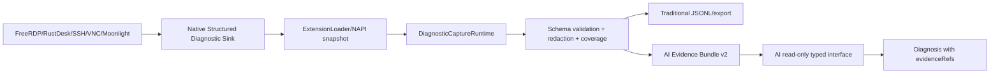

# RDP 可观测性、AI 取证接口与 GFX/H.264 分阶段升级计划

> 已合并：执行以 [2026-10-03 合并计划](2026-10-03-rdp-rustdesk-observability-direct-quality-plan.md) 为准；本文件保留为来源记录。

- 日期：2026-10-03（Asia/Shanghai）
- 计划状态：PLAN-ONLY；本文件不授权实现、发布或打开 H.264 默认路径
- 当前基线：`codex/pro-purchase-foundation`，工作区已有 Pro/AI 未提交修改；本计划不包含这些修改
- 适用项目：RemoteDeskHarmonyOS / RemoteDesktop
- 开发基准：HarmonyOS API 26；保留 API 23 兼容核对
- 目标顺序：先建立可证据化的统一日志与 AI 只读取证接口，再升级 RDPGFX/RFX，最后单独评估 AVC420/H.264

## 1. 结论和边界

当前 RDP 现场不能靠 `backend=gdi`、`codec=raw`、`path=relay`、`peerPlatform=unknown` 判断线上协议。1.1.5.1 的 RDP generic diagnostics 对 RDP 强制使用了本地 BGRA/GDI 标签，且没有把 `getRdpRenderStats()` 的 `graphicsMode`、`gfxChannelConnected` 和 FreeRDP 能力协商结果放入统一 capture。

当前源码同时明确把 `rdpGfxH264PathSafe()` 固定为 false，因此 H.264 运行时不向服务端通告。服务端开启 H.264 组策略不能覆盖客户端能力门禁。

本计划把以下事实分开记录：

```text
configured route       用户配置的 direct / gateway
observed transport     实际 TCP 路由、地址族、网络 generation
RDP capability         客户端声明、服务端确认、通道状态
wire codec             RFX / RemoteFX / AVC420 / AVC444 / raw / unknown
decoder                本地解码器初始化、重置、错误和帧结果
presentation           GDI BGRA、RDPGFX GDI consumer、renderer upload/present
fallback               发生阶段、generation、原因和恢复结果
AI evidence            证据来源、覆盖率、可信度、缺失项和引用
```

“完整日志”定义为所有可审计层都有结构化状态或明确的 `coverage_missing` 记录。它不包括无限制保存 raw hilog、原始 RDP payload、屏幕、音频、剪贴板、终端正文、密码、token 或私钥。

## 2. 当前缺口基线

### 2.1 结构化 capture

当前 capture 已有模块白名单、事件白名单、时间边界、容量限制、网络/窗口/runtime/protocol/resource facts 和脱敏导出，但 schema 当前为 v8、event catalog 为 v1、redaction policy 为 v3。默认 runtime 采样为 5 秒，full capture 为 1 秒。

RDP capture 当前存在这些缺口：

- `graphicsMode`、`gfxChannelConnected`、graphics epoch、resize/reset 状态未进入统一 RDP facts；
- FreeRDP `performance settings`、GCC early capability、RDPGFX caps advertise/confirm、wire codec selected 未进入 JSONL；
- native channel、decoder、surface、frame ACK、fallback 和 teardown 事件没有持久化到 capture；
- `receivedBytes` 与本地 GDI copy/presentation bytes 的来源边界不够明确；
- native hilog 只存在于设备日志中，无法与 capture 的 session/generation/elapsed timeline 自动关联；
- capture 丢弃、采样跳过、native source 不可用没有形成完整覆盖率结论。

### 2.2 AI 取证接口

当前 AI bundle 复用 capture 事件并限制在约 1 MiB，但主要是把事件安全映射成 JSON 文本。当前接口可以启动/停止/丢弃 capture，却缺少：

- 证据覆盖率和缺失证据；
- 字段来源和可信度；
- wire codec 与 presentation backend 分层；
- AI 按问题类型请求最小充分 capture 的 typed contract；
- session 对比、能力协商摘要、fallback 原因查询；
- AI 结果到事件 sequence 的强引用；
- “证据不足”作为一等结果，而不是让模型猜测。

### 2.3 RDP 行为

当前 FreeRDP 真实构建包含 RDPGFX 和 H.264 编译能力，应用策略仍将 `GfxH264=false`。RDPGFX channel callback、GDI graphics pipeline、graphics lifecycle 和 GDI frame pump 已存在，但实际线上 mode/codec 需要新观测层先确认。

在观测层通过前，禁止：

- 删除 H.264 gate；
- 增加用户可见的强制 H.264 开关；
- 修改服务端组策略作为“修复”；
- 把 `graphicsMode=gfx` 直接称为 H.264；
- 把本地 BGRA bytes 当作 TCP wire bytes；
- 把一次 GFX 失败转换成永久全局 GDI 选择。

## 3. 目标架构



Native sink 与 hilog 可以同时写入，但 AI 只读取结构化、脱敏、有界的 native events。raw hilog 只用于人工复核或外部设备取证，不作为 AI 默认输入。

## 4. 统一 schema 设计

### 4.1 版本策略

- `DIAGNOSTIC_CAPTURE_SCHEMA_VERSION`: v8 → v9；保留 v4–v8 读取兼容；不回写旧版本。
- `DIAGNOSTIC_EVENT_CATALOG_VERSION`: v1 → v2。
- `DIAGNOSTIC_REDACTION_POLICY_VERSION`: v3 → v4。
- `DIAGNOSTIC_AI_BUNDLE_SCHEMA_VERSION`: 独立从 v1 → v2。
- 导出 manifest 写入 `producerBuildId`、`sourceVersions`、`captureProfile`、`coverageMask`、`missingEvidenceCount`。

### 4.2 事件通用形状

每个事件都包含：

```text
sequence
elapsedMs
wallTimeMs
moduleId
sessionRef
generation
source
stage
eventCode
level
outcome
code
reason
durationMs
count
bytes
facts
evidenceLevel
provenance
```

`bytes` 必须携带语义来源，至少区分：

```text
wireBytes
callbackBytes
decoderBytes
copiedBytes
uploadBytes
presentedBytes
```

如果无法区分，使用 `unknown` 或 `coverage_missing`，不复用旧字段制造确定结论。

### 4.3 证据等级

```text
observed_native       native callback/settings/channel 实际观测
observed_arkts        ArkTS/NAPI 返回值实际观测
derived                由同一 session 的已验证字段推导
configured              用户配置或连接请求
inferred               有依据但未直接观测
missing                需要外部设备、抓包或服务端资料
```

AI 只能把 `observed_native`、`observed_arkts` 和有明确规则的 `derived` 作为确认事实；`inferred` 必须标为假设；`missing` 必须进入下一步取证建议。

## 5. Native Structured Diagnostic Sink

### 5.1 实现目标

新增一个 bounded、session-aware、generation-aware 的 native structured sink：

- 每 session ring buffer，同时保留进程级 capture boundary；
- 默认只保留低频状态、阶段和累计计数；deep profile 才提高采样频率；
- 记录事件溢出、采样丢弃、source unavailable 和 clock mismatch；
- 不在回调中执行阻塞 IO、JSON 序列化或网络请求；
- session teardown 后保留短时间的终止事件，禁止旧 generation 污染新 session；
- 提供 NAPI 有界查询，不暴露任意指针、文件路径或 raw payload。

### 5.2 Native 事件来源

首批接入：

- `freerdp_adapter.cpp`：route、settings、security、channel、GFX、decoder、GDI、frame、resize、reconnect、disconnect、teardown；
- `extension_loader_napi.cpp`：session registry、NAPI snapshot、diagnostic query、callback frame boundary；
- network observer：network generation、available/unavailable、winning address family、route owner；
- renderer/frame pump：copy/upload/draw/swap、queue、generation rejection、surface detach；
- 其他协议 adapter：保持统一 source/event 结构，先接入状态和错误阶段，再逐步增加协议特有字段。

### 5.3 RDP 深度事件目录

至少增加：

```text
rdp_transport_resolve
rdp_transport_connect_attempt
rdp_transport_connected
rdp_transport_closed
rdp_security_negotiation
rdp_client_capabilities
rdp_server_capabilities
rdp_graphics_settings
rdp_gfx_channel_connected
rdp_gfx_channel_disconnected
rdp_gfx_caps_advertised
rdp_gfx_caps_confirmed
rdp_wire_codec_offered
rdp_wire_codec_selected
rdp_decoder_init
rdp_decoder_reset
rdp_decoder_frame
rdp_surface_created
rdp_surface_deleted
rdp_start_frame
rdp_end_frame
rdp_frame_ack
rdp_presentation
rdp_resize
rdp_fallback
rdp_reconnect
rdp_disconnect
rdp_teardown
```

RDP facts 至少包含：

```text
endpointMode
configuredTransport
observedTransport
endpointFamily
networkGeneration
selectedProtocol
supportDynamicChannels
supportGraphicsPipeline
remoteFxCodec
gfxH264
compiledGfx
compiledH264
gfxResetSafe
h264PathSafe
gfxChannelState
gfxChannelGeneration
capabilityVersions
capabilityFlags
wireCodecOffered
wireCodecSelected
decoderBackend
decoderProfile
decoderInitResult
surfaceCount
frameId
frameAckCount
resetCount
resizeCount
fallbackReason
fallbackGeneration
```

任何密码、用户名、证书 PEM、token、RDP payload 和屏幕像素都禁止进入这些 facts。

## 6. Capture Runtime 与导出升级

### 6.1 Capture profile

增加明确的采集 profile：

| Profile | 用途 | 采样策略 |
|---|---|---|
| `minimal` | 普通支持 | 状态转移和低频快照 |
| `rdp-deep` | RDP 协商/编码/黑屏/高流量 | native 阶段全量，runtime 1 秒 |
| `all-protocol` | 跨协议问题 | 按选中模块采集 |
| `ai-triage` | AI 建议 | 问题分类后选择最小充分模块，并强制补依赖模块 |
| `full` | 用户明确授权的短时深度取证 | 所有允许模块，严格容量上限 |

### 6.2 Capture boundary

- capture start：创建 capture owner、绑定选定 session/generation、清空旧 native cursor；
- 每个事件：验证 source、schema、session、generation、大小和脱敏结果；
- capture stop/deadline：先采样 native terminal events，再写 summary；
- account/logout/refund/Pro revoke：取消未完成 AI capture，清理内存 bundle 和 temporary attachment；
- 多 session：每个 session 独立 generation，禁止用 sessionRef 相同但 generation 不同的事件拼接；
- capacity exceeded：写入 `capture_overflow` 和 `coverage_missing`，不能静默丢失。

### 6.3 导出内容

manifest 增加：

```text
captureProfile
eventCatalogVersion
redactionPolicyVersion
nativeSinkVersion
selectedSessions
coverageMask
coverageComplete
missingEvidence[]
droppedNativeEvents
droppedArktsEvents
clockAlignment
```

summary 增加按模块、session、source、eventCode 的计数，并区分：

```text
observed
inferred
missing
dropped
```

保留 v8 JSONL 导入能力，但新导出默认 v9。

## 7. AI Evidence Bundle v2

### 7.1 Bundle 结构

AI bundle 不再只是事件 JSON 字符串，改为：

```text
manifest
questionContext
capturePlan
evidenceCoverage
missingEvidence
sessionIndex
factSummary
eventIndex
events
provenance
```

`eventIndex` 为每条事件提供稳定引用，例如：

```text
capture-2/session-1/g3/seq-18
```

模型输出的每个结论必须引用一个或多个 evidenceRef。

### 7.2 AI 只读接口

在 `DiagnosticAiCaptureOrchestrator` 与 `DiagnosticAiAgentService` 之间增加 typed interface：

```text
diagnostic.plan_capture(question, scope)
diagnostic.start_capture(plan, consent)
diagnostic.get_capture_status(captureId)
diagnostic.stop_capture(captureId)
diagnostic.get_bundle(captureId, section)
diagnostic.get_missing_evidence(captureId)
diagnostic.compare_sessions(captureA, captureB)
```

这些是应用内部受控接口，不是让 Provider 获得通用工具权限。每次调用都重新检查：

- 当前账号 owner/generation；
- Pro entitlement；
- capture owner/lease；
- 页面/浮窗 generation；
- Provider profile revision；
- 用户 consent 是否仍有效。

### 7.3 AI 输出契约

```text
finding
confidence
evidenceRefs
confirmedFacts
hypotheses
missingEvidence
nextSteps
safeActions
unsupportedClaims
```

AI 不得根据字段名猜 wire codec。若缺少 `rdp_gfx_caps_confirmed` 或 `rdp_wire_codec_selected`，必须返回“协商结果未确认”。

### 7.4 Provider 安全

- API Key/OAuth secret 不进 bundle、日志、备份、云同步或邮件；
- AI 只收到二次脱敏 bundle；
- Provider 请求记录 providerId、modelId、bundle hash、大小、耗时和结果，不记录完整 prompt/response；
- 禁止任意 URL、任意 redirect、任意 Header、Shell、文件、连接和邮件工具；
- bundle、AI result 和 evidence index 使用短 TTL，本地可一键清理；
- Provider 返回内容视为不可信文本，不能改变诊断权限或动作白名单。

## 8. 实施阶段

### M0：契约和 fixture

交付：schema v9、event catalog v2、redaction v4、RDP facts 类型、AI bundle v2、证据等级、fixture 和迁移策略。

退出条件：所有字段语义、来源、上限、缺失行为和兼容策略完成评审。

### M1：Native sink 和 NAPI

交付：bounded native sink、session/generation 关联、NAPI 有界查询、ExtensionLoader bridge、native/ArkTS 时间对齐。

退出条件：native source 不可用、ring overflow、旧 generation、capture deadline 都能产生可解释事件。

### M2：统一 capture/export

交付：RDP deep profile、all-protocol profile、v9 JSONL、coverage summary、旧 schema 读取、脱敏和容量测试。

退出条件：一次短 capture 能完整导出 RDP 协商、GFX channel、codec、decoder、presentation、fallback 和 teardown 链路。

### M3：AI interface

交付：AI bundle v2、typed capture tools、missing evidence、evidenceRefs、session compare、账号/权益/owner 隔离。

退出条件：AI 无法访问 raw hilog 或任意系统能力；证据不足时不能生成确定性 H.264 结论。

### M4：现场复现基线

交付：用同一 Windows RDP 服务端重新采集 1.1.5.1/新基线，对照官方 RDP 客户端，确认：

```text
actual route
SupportGraphicsPipeline
GFX channel
wire codec
decoder
presentation bytes
wire bytes
fallback
```

退出条件：当前问题可以归类为 GFX/RFX、GDI fallback、H.264 gate、decoder、网络或日志缺口之一。

### M5：RDPGFX/RFX 稳定化

交付：确认并稳定当前 GFX/RFX 路径，覆盖 caps、channel、surface、StartFrame/EndFrame、ACK、resize、reset、后台、重连和回退。

退出条件：`graphicsMode=gfx` 与 `wireCodec=rfx/RemoteFX` 时证据可确认，GDI fallback 具备明确原因且不污染下一 session。

### M6：AVC420/H.264 独立实验

交付：decoder runtime probe、AVC420 capability、decoder frame telemetry、reset/resize/reconnect/stress、per-session gate。

退出条件：只有完整矩阵通过的设备/ABI/构建配置允许 `gfx-h264`；其他情况保持 GFX/RFX 或 GDI。

### M7：灰度与发布

交付：双 ABI、Windows 10/11/Server、HarmonyOS PC/Phone/Pad、direct/Gateway、IPv4/IPv6、1080p/2K/4K、AI 取证和协议回归。

退出条件：wire codec、presentation backend、network path 和 fallback 全部可从当前 capture 回溯；无 coverage 关键缺口。

## 9. 测试计划

### 9.1 单元测试

- schema v8→v9 兼容读取；
- event order、generation、clock alignment；
- native sink 并发、环形缓冲、溢出和清理；
- redaction canary：密码、token、API Key、私钥、地址、路径、终端文本；
- RDP facts 映射：GDI、GFX/RFX、AVC420、fallback、decoder fail；
- wire bytes 与 presentation bytes 分离；
- AI bundle schema、evidenceRefs、missingEvidence、truncate；
- capture owner、手动 capture/AI capture 冲突、账号切换、权益撤销。

### 9.2 Native/FreeRDP fixture

固定覆盖：

```text
GFX disabled
GFX connected + RFX
H264 compiled but not requested
H264 advertised
H264 rejected
AVC420 selected
decoder init failed
decoder reset failed
GFX timeout
RESET_GRAPHICS
resize
reconnect
stale callback
GFX fallback to GDI
```

### 9.3 真实设备和服务端

- Windows 10、Windows 11、Windows Server；
- 服务端 H.264/RemoteFX 开启和关闭；
- TCP direct、RD Gateway、IPv4、IPv6；
- 1080p、2K、4K、窗口 resize、后台/前台、Surface 重建、重连；
- RDP 官方客户端与 RemoteDesktop 同端点对照；
- 实际 socket/channel bytes 与本地 render bytes 分开测量；
- RustDesk、SSH/SFTP、VNC、Moonlight 协议隔离回归；
- AI provider、账号切换、Pro 撤权、bundle 清理和 evidenceRefs 回溯。

## 10. 回退和失败处理

- native sink 不可用：保留 ArkTS capture，并写 `coverage_missing(native)`；
- native ring overflow：写入 overflow 计数和缺失窗口；
- AI bundle 超限：保留 manifest、summary、evidence index 和最新关键事件，完整 bundle 留在本地；
- GFX channel/decoder/renderer 失败：当前 session 回退，不修改用户配置，不污染下一 session；
- H.264 失败：回退 AVC420→RFX/GFX→GDI，保留精确 fallback reason；
- AI Provider 失败：保留本地 bundle，传统日志导出和系统邮件流程仍可用；
- 账号、权益或 owner generation 改变：取消受保护请求，清理内存 secret 和未完成 AI capture。

## 11. 计划文件和实现文件边界

首批允许的实现范围：

```text
entry/src/main/cpp/diagnostics/DiagnosticEventSink.*
entry/src/main/cpp/extensions/extension_loader_napi.cpp
entry/src/main/cpp/extensions/protocol_adapter.h
entry/src/main/cpp/rdp/freerdp_adapter.cpp
entry/src/main/cpp/rdp/rdp_graphics_lifecycle.*
entry/src/main/ets/services/DiagnosticCapturePolicy.ets
entry/src/main/ets/services/DiagnosticCaptureRuntime.ets
entry/src/main/ets/services/DiagnosticCaptureExportService.ets
entry/src/main/ets/services/DiagnosticRuntimeSnapshotPolicy.ets
entry/src/main/ets/services/ExtensionLoader.ets
entry/src/main/ets/services/diagnosticAi/DiagnosticAiBundlePolicy.ets
entry/src/main/ets/services/diagnosticAi/DiagnosticAiCaptureOrchestrator.ets
entry/src/main/ets/services/diagnosticAi/DiagnosticAiAgentService.ets
entry/src/main/ets/services/diagnosticAi/DiagnosticAiModels.ets
entry/src/main/ets/types/rdpnapi.d.ts
entry/src/main/cpp/types/librdpnapi/index.d.ts
entry/src/test/*Diagnostic*
scripts/tests/*diagnostic*
entry/src/main/cpp/test/*diagnostic*
```

FreeRDP 子模块、依赖、FFmpeg、OpenSSL、RustDesk、SSH、VNC、Moonlight 行为在 M0–M4 不升级。只有 M6 明确需要依赖变化时，才同步 provenance、NOTICE、SBOM、hash 和双 ABI 产物。

## 12. 仓库执行顺序

当前工作区存在 `codex/pro-purchase-foundation` 活动分支和未提交 Pro/AI 修改。按 `AGENTS.md`：

1. 本计划先作为独立文档保存；当前 session 不实现代码；
2. 当前 Pro 分支先完成既有任务或明确归档；
3. RDP/诊断实现必须使用单独的后续活动分支，不能混入现有脏文件；
4. 每个 M 阶段独立 checkpoint、独立复核和独立回退；
5. 修改代码后才执行项目规定的 Hvigor、native 测试、diff-check、合规和设备门禁；
6. 旧日志不能替代新 schema、新 buildId 和真实设备证据。

## 13. 完成定义

只有同时满足以下条件，计划才算完成：

- 结构化 capture 能回答 RDP route、capability、wire codec、decoder、presentation、fallback 和 teardown；
- `gdi/raw/relay/unknown` 不再被当作线协议事实；
- AI bundle 具有证据来源、覆盖率、缺失项和可回溯 evidenceRefs；
- AI 在证据不足时明确拒绝确定性结论；
- RDPGFX/RFX 路径经过真实 direct TCP、resize、reset、重连和压力验收；
- AVC420/H.264 只在 decoder/lifecycle/stress 门通过后按 gate 放行；
- 所有失败都能回退到当前稳定路径；
- 传统手动日志、导出、反馈邮件和其他四协议不回归；
- 双 ABI、构建、合规、真机和 Windows 服务端证据均来自当前提交；
- 没有把 provider、设备、网络、服务端或生产环境未验证内容写成已完成。
