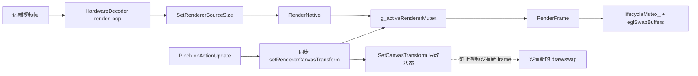
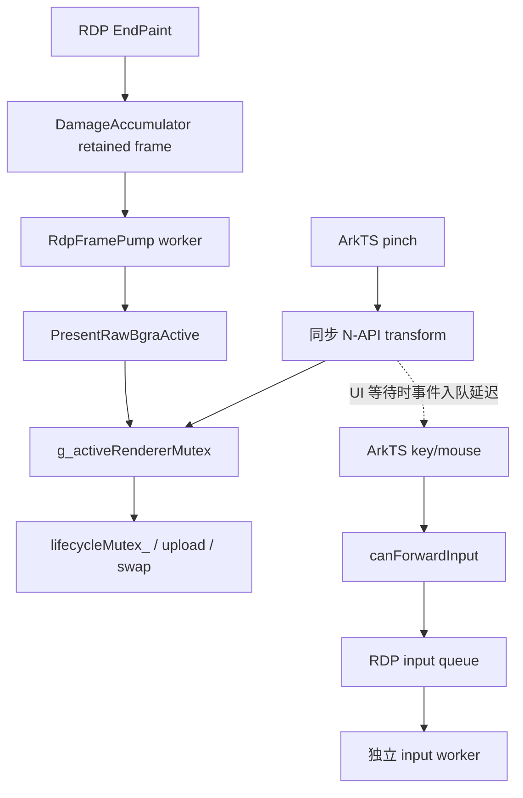
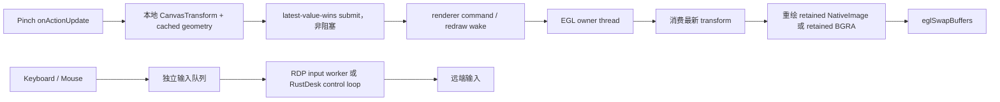

# RustDesk / RDP 双指缩放画布修复计划

状态：已实施并通过构建/自动化回归；真实设备会话矩阵待验收

日期：2026-07-24

适用仓库：`Mydstiny/RemoteDeskHarmonyOS`

调查基线：2026-07-24 的修复前代码。实施从 `main` 创建独立修复分支，保留工作区中与本任务无关的用户文档，不覆盖或回退已有修改。

## 实施结果（2026-07-24）

本计划已按阶段落地。实际修复分为以下提交，并保持每个步骤独立提交：

- 80974c440：将 canvas transform 改为非阻塞 latest-value-wins 提交，拆开 renderer registry 与 EGL/lifecycle 长临界区，并接入 retained-frame redraw。
- fb7355072、44d2a51de、5bc7a4be3：ArkTS 使用本地 pinch geometry 快照，只有 native start 接受后才占用输入，并覆盖 rejected input、stream resize、surface/PIP/后台/断连等幂等释放路径。
- f43a8101b、620544b14：RustDesk touch scale/pan update 合并为有界 latest-value-wins 队列，保留 start/end barrier，并在可靠键鼠/文本消息边界 flush touch update，避免输入重排。
- 6d16eb366：合并 retained decoder redraw wake，避免快速 pinch 堆积重绘请求。

已落地的关键行为：

1. UI pinch update 只发布最新 transform，不等待 EGL、GL 或网络，不在每个 update 读取 native viewport。
2. 硬解、软件解码和 RDP 都能从 render owner 消费最新 transform，并对 retained frame 触发合并重绘；RDP frame pump 保留 generation 检查和最新帧语义。
3. RDP 输入 worker 与 renderer lifecycle 独立；RustDesk 键盘、鼠标按钮和文本消息不会被 touch update 无限队列或跨越顺序边界。
4. Pinch end/cancel、Touch Up/Cancel、surface destroy、PIP、后台、control mode、缩放设置变化和断连均进入幂等释放路径。
5. RustDesk diagnostics 记录 touch active、pending、barrier 和 coalescing 状态，便于真机验收区分 UI、渲染、输入和协议队列问题。

本次没有新增灰度开关；修复直接采用已验证的非阻塞提交和 retained redraw 语义，避免把输入正确性依赖在多开关组合上。原有第 12 节的开关设计保留为后续需要快速回滚时的可选演进方案。

自动化验证结果：

| 验证项 | 结果 |
| --- | --- |
| ArkTS default@OhosTestCompileArkTS | 通过；仅有仓库/依赖已有 ArkTS 告警 |
| native rdp_native_tests | 129 passed, 0 failed |
| RustDesk FFI 全量 lib tests | 140 passed, 0 failed；网络监听测试在允许本地回环端口的环境执行 |
| assembleHap | BUILD SUCCESSFUL，约 55 秒 |
| 真实设备 | 尚未连接目标设备；Windows RustDesk、macOS 静止桌面、RDP 键鼠和 remote-app TouchScale 矩阵待执行 |


## 1. 结论摘要

本问题不是单一的缩放公式错误，而是三条链路同时存在设计冲突：

1. ArkTS 的 `PinchGesture.onActionUpdate` 每次手势更新都同步进入 N-API。N-API 先持有全局渲染器注册表锁，再进入 `GLRenderer::lifecycleMutex_`。渲染路径又会在该生命周期锁内执行纹理上传、绘制和 `eglSwapBuffers()`。因此缩放频率一高，UI 线程、视频线程和 RDP 帧泵互相等待。
2. `GLRenderer::SetCanvasTransform()` 只改变视口计算状态，不会绘制或交换缓冲。远端 macOS 内容静止时，缩放虽然更新了状态，但没有新的解码帧触发 `RenderFrame()`，所以画面看起来会停住；如果同时与硬解线程争锁，还会放大成视频流停滞。
3. RDP 已经有 `RdpDamageAccumulator`、`RdpFramePump` 和 `requestFrameRefresh()` 的保留帧刷新能力，但 pinch 没有接入这条本地重绘链路。同步 N-API 阻塞时，ArkTS 同一线程上的鼠标和键盘回调也无法及时执行，形成“缩放后输入失效”的表象。RDP 原生输入队列本身是独立 worker，修复重点是解除 UI 到 EGL 的同步等待，而不是把输入和绘制重新合并。

另外，RustDesk 的可选“远端应用触控缩放”路径会把每次 `TouchScale` 和 `TouchPanUpdate` 放入可靠 FIFO。该路径与本地画布缩放不同，必须单独做 latest-value-wins 合并，并保留 pinch start/end 的顺序。

最终目标：

- pinch update 只更新本地几何状态并提交一个非阻塞的最新变换值；UI 回调不读取 N-API viewport，不等待 EGL，不执行网络 I/O。
- 变换提交由真正拥有 EGL/NativeImage 的渲染 owner 消费，并触发一次合并后的保留帧重绘。
- RustDesk 硬解静止帧、RDP BGRA 保留帧和移动中的新视频帧共用明确的 renderer ownership 和 surface generation 规则。
- 鼠标、键盘、触摸结束和 surface 销毁在 pinch 期间保持可交付，任何 `Up`、`Cancel`、断连、后台或 surface loss 都能幂等清理 pinch 状态。

## 2. 范围与非目标

### 2.1 本次范围

- RustDesk 远程 Windows、远程 macOS 的本地画布双指缩放。
- RDP 端已接入的双指缩放，以及缩放期间鼠标和键盘可用性。
- RustDesk 可选远端应用触控缩放的可靠控制消息队列。
- XComponent surface、PIP、后台恢复、旋转和断连时的 pinch 状态清理。
- 变换提交、重绘、输入和控制队列的可观测性。

### 2.2 非目标

- 不改远端 Windows/macOS/RDP 的桌面分辨率协议。
- 不把本地画布缩放转换成远端鼠标坐标以外的远程显示协议操作。
- 不在 UI 线程中直接执行 OpenGL、EGL、NativeImage 或 FreeRDP 调用。
- 不通过简单删除 `lifecycleMutex_` 或在 `eglSwapBuffers()` 周围放锁来规避线程安全问题。
- 不在没有协议语义和设备验证的情况下让 RDP 使用 RustDesk 的 `TouchScale` protobuf。

## 3. 当前实现与证据

### 3.1 ArkTS pinch 热路径

当前入口在 [RemoteDesktop.ets](../entry/src/main/ets/pages/RemoteDesktop.ets:8475)：

```text
PinchGesture.onActionUpdate
  -> updateCanvasPinch()                         : RemoteDesktop.ets:1518
  -> currentCanvasViewport()                     : RemoteDesktop.ets:1399
  -> readRendererViewport() / getRendererViewport: RemoteDesktop.ets:3376
  -> applyCanvasTransform()                      : RemoteDesktop.ets:1422
  -> setRendererCanvasTransform()                 : ExtensionLoader.ets:479
  -> NapiSetRendererCanvasTransform()             : gl_renderer.cpp:1271
  -> g_activeRendererMutex
  -> GLRenderer::SetCanvasTransform()             : gl_renderer.cpp:948
  -> lifecycleMutex_
```

`applyCanvasTransform()` 在每次 update 后立即失效 viewport cache。这样，正常缓存节流会被 pinch update 打断，后续 update 可能再次进入 `getRendererViewport()`。虽然 `GetViewportSnapshot()` 使用原子快照，但 N-API 入口仍需等待 `g_activeRendererMutex`。

### 3.2 原生渲染锁与“没有重绘”

原始 BGRA 路径在 [gl_renderer.cpp](../entry/src/main/cpp/render/gl_renderer.cpp:713) 持有 `lifecycleMutex_`，直到完成：

```text
MakeCurrent
  -> texture upload / dirty upload
  -> glViewport / draw
  -> eglSwapBuffers
  -> ReleaseCurrent
```

硬解路径在 [gl_renderer.cpp](../entry/src/main/cpp/render/gl_renderer.cpp:858) 也持有相同的生命周期锁直到 `eglSwapBuffers()` 返回。`SetCanvasTransform()` 在 [gl_renderer.cpp](../entry/src/main/cpp/render/gl_renderer.cpp:948) 只更新 `canvasScale_`、`canvasPanX_`、`canvasPanY_` 并发布 viewport snapshot，没有触发任何 draw/swap。

硬解调用链为：



这解释了两个不同症状：

- 远程 Windows 或持续有帧的会话：视频线程仍会绘制，但 pinch update 与纹理上传、swap 竞争锁，表现为一帧一帧跳动。
- 远程 macOS 静止桌面：变换状态改变后没有新帧重绘，画面停在旧缩放状态；如果硬解线程正处于 swap，UI 提交还可能放大为视频线程停滞。

### 3.3 RDP 路径

RDP 的 EndPaint 在 [freerdp_adapter.cpp](../entry/src/main/cpp/rdp/freerdp_adapter.cpp:1565) 将受损区域复制到 `RdpDamageAccumulator`，再通过 `RdpFramePump::submitLatest()` 提交。在 [rdp_frame_pump.cpp](../entry/src/main/cpp/rdp/rdp_frame_pump.cpp:176) 才调用 `PresentRawBgraActive()` 或 dirty 版本进行 GL 上传和 swap。

RDP 已有可复用的保留帧刷新入口 [freerdp_adapter.cpp](../entry/src/main/cpp/rdp/freerdp_adapter.cpp:2551)：

```text
requestFrameRefresh()
  -> damageAccumulator->requestFullSnapshot(generation)
  -> framePump.submitLatest()
  -> 保留的 BGRA 帧再次进入 renderer owner
```

但当前 pinch 只调用 `setRendererCanvasTransform()`，没有触发这条路径。RDP 输入 worker 在 [freerdp_adapter.cpp](../entry/src/main/cpp/rdp/freerdp_adapter.cpp:689) 独立消费输入队列，键盘和鼠标入口在 [freerdp_adapter.cpp](../entry/src/main/cpp/rdp/freerdp_adapter.cpp:2700) 及后续函数。UI 阻塞时，输入回调不能及时把事件入队；解除同步 EGL 等待后，输入 worker 不应再被视频锁拖住。



### 3.4 RustDesk 远端触控缩放路径

本地画布缩放默认只改变本地显示；仅在 `rustdeskRemoteAppTouchScaleEnabled` 开启、协议为 RustDesk 且输入 ready 时，才进入 [RemoteDesktop.ets](../entry/src/main/ets/pages/RemoteDesktop.ets:1433) 的远端触控缩放分支：

```text
updateRustDeskRemoteAppTouchScale()
  -> sendRustDeskTouchScale()
  -> sendRustDeskTouchPan(phase=1)
  -> rustdesk_send_touch_scale/pan()
  -> ControlInbox::enqueue()
  -> connector streaming loop 先取 control batch 再 recv video
```

当前 [control_inbox.rs](../rustdesk_ffi/src/control_inbox.rs:71) 只合并 `MouseMove`、`RefreshVideo` 和 `VideoPressure`。`TouchScale`、`TouchPanStart`、`TouchPanUpdate`、`TouchPanEnd` 都进入 `reliable` FIFO。高速 pinch 会让可靠队列增长，并延迟键盘、鼠标按键和视频接收。

### 3.5 输入状态风险

当前 `canvasPinchInputConsumed` 在 [RemoteDesktop.ets](../entry/src/main/ets/pages/RemoteDesktop.ets:1548) 主要依赖最后一个 `TouchType.Up` 或 `TouchType.Cancel` 清理；手势的 `onActionEnd` 和 `onActionCancel` 在 [RemoteDesktop.ets](../entry/src/main/ets/pages/RemoteDesktop.ets:8477) 只调用 `finishCanvasPinch()`。另外，远端应用触控缩放分支会先 `claimCanvasPinchInput()`，再检查 `canForwardInput()`；如果输入 gate 尚未打开，可能已经吞掉触摸但没有建立可结束的远端 touch stream。

这不是所有“鼠标键盘失效”的唯一原因，但必须一并修复，否则任何漏发 Up/Cancel、surface loss 或输入 gate 竞态都可能留下粘住的 pinch 状态。

## 4. 根因分级

| 优先级 | 根因 | 影响 | 修复方向 |
| --- | --- | --- | --- |
| P0 | UI 同步 N-API 与 registry/lifecycle 锁竞争，渲染锁覆盖 `eglSwapBuffers()` | Windows pinch 卡顿，RDP 输入延迟或看似失效 | latest-value-wins 非阻塞提交；昂贵操作移出 registry 锁；EGL owner 单线程消费 |
| P0 | transform 不触发保留帧重绘 | macOS 静止内容缩放不动，RDP 静止帧缩放不更新 | transform wake + retained-frame redraw |
| P0 | RDP pinch 未连接 `requestFrameRefresh()` / frame pump | RDP 端没有本地重绘，且 UI 阻塞输入回调 | 将重绘请求接到 RDP frame pump，输入保持独立 |
| P1 | RustDesk touch update 全部进入可靠 FIFO | 启用远端应用触控缩放时控制队列膨胀，视频/键盘延迟 | 只合并 update，保留 start/end barrier 和顺序 |
| P1 | pinch 清理依赖 Touch Up，且远端 touch start 可能在 input gate 关闭时被吞 | 取消、后台、surface 重建后触摸或输入长期失效 | 统一幂等 release，所有 end/cancel/lifecycle 路径调用 |
| P1 | viewport cache 在每次 transform 后失效，pinch 期间重复 N-API read | 增加 UI 和 registry 锁压力，坐标映射可能读到旧帧 | pinch 使用本地几何快照；只在 resize/source/surface generation 变化时刷新 |

## 5. 官方实现与官方文档对照

### 5.1 官方 RustDesk 源码的可借鉴边界

调查的上游页面：

- [rustdesk/flutter/lib/desktop/pages/remote_page.dart](https://github.com/rustdesk/rustdesk/blob/master/flutter/lib/desktop/pages/remote_page.dart)，访问日期 2026-07-24。
- 已核验的代码区段包括：触摸/pointer wrapper 与 canvas composition 约在 [L583-L651](https://github.com/rustdesk/rustdesk/blob/master/flutter/lib/desktop/pages/remote_page.dart#L583-L651)，尺寸变化后的 `_ViewStyleUpdater` 约在 [L685-L733](https://github.com/rustdesk/rustdesk/blob/master/flutter/lib/desktop/pages/remote_page.dart#L685-L733)，`ImagePaint` 和 scale/render composition 约在 [L742-L871](https://github.com/rustdesk/rustdesk/blob/master/flutter/lib/desktop/pages/remote_page.dart#L742-L871)。上游页面可能随提交移动，实施时以当前 master 的符号和行为为准。

上游当前实现的关键结构：

| 上游结构 | 当前行为 | 对本项目的启示 |
| --- | --- | --- |
| `RawTouchGestureDetectorRegion` | 负责 remote canvas 的触摸手势 | 手势识别和画布状态在 UI/model 层完成，不把每次手势更新同步桥接到 GL |
| `RawPointerMouseRegion` | 独立处理 pointer/mouse | pinch 不应占用物理鼠标、键盘的输入 ownership |
| `ImagePaint` + `CanvasModel` | scale 属于画布模型，随 widget/render pipeline 使用 | 变换是可合并的最新 UI 状态，而不是可靠网络消息 |
| `_ViewStyleUpdater` | 只在尺寸变化时用 `SchedulerBinding.addPostFrameCallback` 更新 view size | viewport/size 更新应低频、按生命周期变化触发，不应在每个 pinch update 读 native |
| `CustomPaint` 或 `Texture` | 由 Flutter 渲染管线负责重绘纹理/画布 | HarmonyOS 需要等价的 render-owner wake；不能只更新 native 状态而不 draw/swap |

上游没有以 `InteractiveViewer` 作为当前远程桌面画布核心；不能简单把本项目改成套一个通用缩放组件来解决 native surface 与 retained frame 问题。要借鉴的是状态归属、输入隔离和帧调度，而不是直接移植 Flutter widget。

### 5.2 已核验的鸿蒙官方约束

以下结论来自华为开发者官方文档，访问日期均为 2026-07-24：

1. [PinchGesture](https://developer.huawei.com/consumer/cn/doc/harmonyos-references/ts-basic-gestures-pinchgesture)
   - 至少 2 指、最多 5 指；`onActionUpdate` 在捏合移动中回调。
   - `onActionEnd` 在最后一根满足条件的手指抬起后回调。
   - `onActionCancel` 在收到触摸取消事件后回调。
   - 官方示例使用 `event.scale`、`event.pinchCenterX/Y` 更新本地状态和矩阵，说明焦点保持和变换可在 UI 状态层完成。
2. [触摸事件](https://developer.huawei.com/consumer/cn/doc/harmonyos-references/ts-universal-events-touch)
   - `onTouch` 默认会冒泡；`stopPropagation()` 只应在确实需要消费事件时调用。
   - `TouchType.Cancel` 是正式事件类型，官方示例列出回到桌面、折叠屏切换等触发场景。pinch 状态不能只依赖 `Up`。
   - 鼠标左键按下也可能转换成触摸事件，因此触摸层和物理鼠标层要明确按 source/tool 隔离。
3. [绑定手势事件](https://developer.huawei.com/consumer/cn/doc/harmonyos-references/ts-gesture-settings)
   - `gesture`、`priorityGesture`、`parallelGesture` 决定手势竞争关系；手势事件是非冒泡事件。
   - 本项目需要确认 overlay 的 pinch 和 XComponent 的 touch handler 不会在同一触点上形成不可控的消费关系。
4. [XComponent](https://developer.huawei.com/consumer/cn/doc/harmonyos-references/ts-basic-components-xcomponent) 与 [自定义渲染 XComponent](https://developer.huawei.com/consumer/cn/doc/harmonyos-guides/napi-xcomponent-guidelines)
   - Surface 生命周期必须覆盖 created、changed、destroyed；大小变化在重新布局后通知。
   - 官方建议复杂跨语言交互、极致渲染性能或自主控制 Surface 生命周期的场景在 native 侧管理 Surface 生命周期。
   - 本项目的 renderer handle、surface generation、NativeImage/EGL owner 必须和这些生命周期回调一一对应。
5. [请求自绘制内容绘制帧率](https://developer.huawei.com/consumer/cn/doc/harmonyos-guides/displaysync-xcomponent)
   - XComponent native 场景可以注册每帧回调和期望帧率。
   - 官方明确 Callback 运行在 UI 主线程，耗时 UI 操作不能放在回调中；注册后不需要时要注销。
   - 因此即使采用 DisplaySync，也只能在回调中做原子状态交换或轻量 wake，不能在回调中执行 EGL draw/swap。
6. [Node-API](https://developer.huawei.com/consumer/cn/doc/harmonyos-references/napi)
   - `napi_create_async_work` 创建异步工作，`napi_queue_async_work` 将工作加入底层调度队列。
   - 该能力可用于延后非 GL 的桥接工作；不能把 N-API completion callback 当成 EGL 渲染线程，也不能让 pinch handler 等待异步结果。

## 6. 目标架构

### 6.1 目标数据流



### 6.2 必须保持的并发不变量

1. UI pinch handler 不得持有 `g_activeRendererMutex`、`lifecycleMutex_`，不得调用 `eglSwapBuffers()`，不得等待 RDP/RustDesk 网络结果。
2. `SetCanvasTransform` 只做参数校验、最新值原子发布和一次合并 wake；它不做 GL 状态修改。
3. EGL context、NativeImage attach/detach、纹理采样和 swap 必须由同一个明确的 owner 线程串行执行。当前硬解路径优先保持 `HardwareDecoder::renderLoop` 为 owner。
4. registry mutex 只保护 handle 到 `shared_ptr`、active handle 和 generation 的短临界区；不得跨越 frame upload、draw、swap 或 renderer destroy。
5. surface generation 失效时，任何旧 frame、旧 transform wake 和旧 retained texture 都只能被丢弃，不能触碰新 surface。
6. pinch transform 是本地显示状态，不进入 RustDesk/RDP 可靠控制 FIFO。只有显式开启的远端应用 touch scale 才进入协议控制队列。
7. `TouchPanStart` 必须先于所有对应 update，`TouchPanEnd` 必须晚于其尚未发送的最新 update；键盘和鼠标按键不可被无限 update 饥饿。
8. pinch 结束和取消都必须幂等；重复调用不能重复发送远端 touch end，也不能留下 `canvasPinchInputConsumed=true`。

### 6.3 最新变换提交契约

建议保留现有公开 N-API 名称以减少 ABI 变更，但改变其实现语义：

```text
submitRendererCanvasTransform(handle, scale, panX, panY): void

输入线程行为：
  - 校验 finite / range
  - 按 handle + generation 获取 renderer shared_ptr
  - 原子写入 pendingTransform
  - 若没有 redrawPending，则置 1 并通知 owner
  - 立即返回

owner 线程行为：
  - 在自己的 EGL/lifecycle 临界区消费 pendingTransform
  - 清除 redrawPending；若消费期间又有新版本，继续处理最新值
  - 更新 viewport snapshot
  - 绘制 retained frame 并 swap
```

`pendingTransform` 可以由 `std::atomic<double>` 加版本号实现，也可以使用短 seqlock 结构。实现时必须避免一个 transform 的 scale、panX、panY 被另一个版本拆开读取；推荐使用版本号包围的三值快照，并以 `std::memory_order_release/acquire` 发布。

## 7. 详细修复设计

### 7.1 ArkTS: 将 pinch 变成纯本地、非阻塞提交

目标文件：

- `entry/src/main/ets/pages/RemoteDesktop.ets`
- `entry/src/main/ets/services/ExtensionLoader.ets`
- `entry/src/main/ets/types/rdpnapi.d.ts`
- `entry/src/main/cpp/types/librdpnapi/index.d.ts`
- 必要时新增 `entry/src/main/ets/services/RemoteCanvasTransformSubmissionPolicy.ets`

实施要点：

1. 在 pinch start 读取一次有效的 `CanvasGeometrySnapshot`，包含 surface 像素尺寸、remote source 尺寸、当前 viewport 和当前 transform。后续 update 只使用该快照和 `event.scale/pinchCenterX/Y`。
2. `currentCanvasViewport()` 的 N-API read 不能出现在 update 热路径。viewport 只在以下事件刷新：renderer handle 变更、`onAreaChange`、source video size 变更、surface created/destroyed、PIP reattach、旋转/布局变化。
3. `applyCanvasTransform()` 只做本地 clamp、更新 ArkTS transform 和调用非阻塞 `submitRendererCanvasTransform`。提交后不立即 `invalidateRendererViewportCache()`；本地坐标映射使用预测后的 geometry snapshot，native snapshot 在 owner 绘制后再校正。
4. 不在每个 update 中调用 `requestFrameRefresh()`。重绘 wake 由 native transform submit 合并触发；RDP/RustDesk 后端各自使用本地 retained-frame 路径。
5. 手势 update 高频时允许丢弃中间 transform，但不能丢失最新 transform。`onActionEnd` 和 `onActionCancel` 必须提交一次最终值或至少确保最后一次 pending 值已被唤醒。
6. 保持 `PinchGesture({ fingers: 2, distance: 5 })`，同时增加 input source/tool 日志，验证 overlay 与 XComponent touch handler 的消费边界。
7. `ExtensionLoader.ets` 不做同步重试、不执行阻塞等待；异常只记录计数和 session generation。

建议的 ArkTS 状态机：

```text
Idle
  -- onActionStart + zoom enabled --> Active(snapshot captured)
Active
  -- onActionUpdate --> Active(latest transform replaced, native wake coalesced)
Active
  -- onActionEnd --> Finishing(final transform, release input)
Active
  -- onActionCancel / TouchType.Cancel / surface loss --> Canceling(release input)
Finishing/Canceling
  -- cleanup once --> Idle
```

### 7.2 Native GL: 拆开 registry ownership 与昂贵渲染

目标文件：

- `entry/src/main/cpp/render/gl_renderer.h`
- `entry/src/main/cpp/render/gl_renderer.cpp`
- `entry/src/main/cpp/extensions/extension_loader_napi.cpp`

实施要点：

1. 增加短临界区 helper，例如 `AcquireActiveRenderer(handle, expectedGeneration)`，在 `g_activeRendererMutex` 内复制 `std::shared_ptr<GLRenderer>` 和 generation，退出锁后再执行操作。`RenderNative`、`PresentRawBgraActive`、`GetPresentationStats`、viewport read 都不能在 registry lock 内完成 EGL/GL 工作。
2. `DestroyRendererHandle` 先在 registry lock 内清除 active handle、推进 generation 并摘出 `shared_ptr`，释放 registry lock 后调用 `renderer->Destroy()`。renderer 自己的 lifecycle lock负责和正在进行的 draw 串行化；旧调用通过 shared_ptr 保证对象生命周期，但必须在进入 draw 前重新检查 surface/generation。
3. 将 `canvasScale_`、`canvasPanX_`、`canvasPanY_` 的写入从 `lifecycleMutex_` 中移出，改为不可分割的 latest-value snapshot。`SetCanvasTransform` 不再调用 `CalculateViewport` 或 `PublishViewportSnapshot`，因为这些属于 owner 线程的渲染状态。
4. 在 renderer 中增加 `redrawPending`、`transformVersion` 和 `RequestRedraw()`。`RequestRedraw()` 只做 atomic exchange 和轻量 notifier，不等待 owner。
5. 在每个 render owner 的 draw 起点调用 `ApplyPendingTransformLocked()`，将最新 transform 应用到 GL viewport 计算，并发布 viewport snapshot。消费期间如果版本又变化，下一次 owner tick 继续消费最新值。
6. 继续持有 `lifecycleMutex_` 覆盖一整套 EGL context、GL 命令和 swap，直到明确完成 owner thread 迁移后再缩小锁范围。不能只把 `eglSwapBuffers()` 移出锁而不处理 EGL context 的线程归属。
7. 为 `SetCanvasTransform`、surface detach、destroy、generation mismatch 添加 reason 和耗时日志，确认 UI 端不会出现等待 EGL 的堆栈。

### 7.3 硬解 NativeImage: 在 EGL owner 上重绘静止帧

目标文件：

- `entry/src/main/cpp/render/hw_decoder.h`
- `entry/src/main/cpp/render/hw_decoder.cpp`
- `entry/src/main/cpp/render/gl_renderer.{h,cpp}`

推荐先保留当前 `HardwareDecoder::renderLoop` 为 EGL owner，不直接新建第二个 GL 线程。

实施要点：

1. 将 `HardwareDecoder` 的等待条件扩展为“新解码输出或 renderer redraw pending”。transform submit 通过安全的 render-wake callback 唤醒当前 render loop。
2. 如果没有新解码输出但 `textureId_` 仍代表当前有效 NativeImage，owner 使用 retained texture 调用 renderer 的 redraw-only path；该 path只更新 viewport、采样当前纹理并 swap，不重新解码、不从 UI 线程 attach/detach NativeImage。
3. 如果 API 23 设备验证发现 NativeImage 在没有新 output buffer 时不能安全重绘，保留 fallback：由 decoder owner 重新提交当前可用 output 或由 renderer owner走经验证的 `requestFrameRefresh` 等价路径。禁止在 UI 线程直接调用 `RenderNative`。
4. `NativeImage` attach/detach 和 `MakeCurrent/ReleaseCurrent` 继续通过同一 owner gate；surface generation 改变时，先停 owner、失效 wake、重新绑定，再允许新 redraw。
5. DisplaySync 只能作为低成本 tick/wake 的候选实现。官方文档声明其回调在 UI 主线程，因此回调中不得执行 `RenderFrame`、`eglSwapBuffers` 或任何阻塞操作。API 23 本地头文件和设备行为确认前，优先使用现有 render loop condition variable。

### 7.4 RDP: 接通已有 retained-frame 刷新能力

目标文件：

- `entry/src/main/cpp/rdp/rdp_frame_pump.h`
- `entry/src/main/cpp/rdp/rdp_frame_pump.cpp`
- `entry/src/main/cpp/rdp/rdp_damage_accumulator.h`
- `entry/src/main/cpp/rdp/rdp_damage_accumulator.cpp`
- `entry/src/main/cpp/rdp/freerdp_adapter.h`
- `entry/src/main/cpp/rdp/freerdp_adapter.cpp`
- `entry/src/main/cpp/render/gl_renderer.{h,cpp}`

实施要点：

1. 将当前 `FreeRdpAdapter::requestFrameRefresh()` 复用为“变换导致的本地 redraw”入口，或者抽出 `requestPresentationRedraw(reason)`。它必须只操作 `damageAccumulator` 和 `framePump`，不能进行网络 I/O。
2. renderer transform wake 不应从 UI 直接执行完整 `requestFrameRefresh()`；推荐由 `FreeRdpAdapter` 注册一个 generation-scoped redraw notifier，native submit 只置位/唤醒，RDP frame pump worker 执行 `requestFullSnapshot()` 和 `submitLatest()`。
3. `RdpFramePump` 增加 redraw-only submission 语义，允许没有新的 EndPaint 也从 retained `RdpDamageAccumulator` 取完整 snapshot。请求必须与当前 renderer generation 匹配。
4. 如果当前复用路径会重新复制整帧，先接受有界的复制成本，确保功能和输入正确；之后可增加 `GLRenderer::RenderRetainedRaw()`，直接复用当前 `rawTexture_`，减少 pinch 期间重复 CPU/GPU 上传。
5. frame pump 不能因为 transform wake 清空 `fullResyncRequired`、跳过最新帧或跨 generation 提交。增加 transform redraw、retained snapshot、present result 三个计数。
6. RDP 输入 worker 保持独立。`sendKey()`、`sendMouse()`、`sendMouseWheel()` 只入队；输入 queue 不应拿 renderer registry/lifecycle lock。缩放期间需要验证 key down/up 成对到达。

### 7.5 RustDesk: 合并可丢弃 update，保留协议边界

目标文件：

- `rustdesk_ffi/src/control_inbox.rs`
- `rustdesk_ffi/src/connector.rs`
- `rustdesk_ffi/src/lib.rs`
- `entry/src/main/cpp/rustdesk/rustdesk_bridge.cpp`
- `entry/src/main/cpp/extensions/extension_loader_napi.cpp`

实施要点：

1. `TouchPanStart`、`TouchPanEnd` 保持有序可靠消息；`TouchScale` 和 `TouchPanUpdate` 使用同一个带序号的 latest touch-update slot，slot 内保存两者的最新值，不再无限追加到 `reliable`。
2. 为可靠消息和可合并 slot 增加单调 sequence number。`take_batch()` 每次取最早 sequence 的待发送项，从而保证：
   - start 早于 update；
   - `TouchPanEnd` 晚于它之前尚未发送的最新 update；
   - 键盘、鼠标按键和文本仍保持可靠 FIFO；
   - 高频 update 不会占满 batch 或饿死其他控制消息。
3. pinch start 时清理上一轮未完成的 update slot；pinch end/cancel 作为 barrier，发送一次对应的 pan end。重复 end 只计数不重发。
4. `ControlInboxSnapshot` 增加 `coalesced_touch_scale`、`coalesced_touch_pan`、`touch_active`、`touch_barrier_wait` 或等价指标。connector 的诊断日志增加触控队列深度和发送延迟。
5. RustDesk streaming loop 当前在 `connector.rs:935` 附近先消费 control batch 再接收 video。修复后必须证明控制队列有界，并验证接收循环在连续 pinch 期间仍能处理 video。
6. FFI ABI 的 `rustdesk_send_touch_scale/pan` 可以保持不变；队列合并在 Rust 内部完成，避免把节流责任散落在 ArkTS、C++、Rust 三层。

建议 `ControlInbox` 的抽象行为：

```text
enqueue(TouchPanStart)  -> reliable(seq=10), touch_active=true
enqueue(TouchScale)     -> touch_update_slot(seq=11, latest.scale=value)
enqueue(TouchPanUpdate) -> replace same slot, seq=12, latest.pan=value
enqueue(TouchScale)     -> replace same slot, seq=13, coalesced_touch_scale++
enqueue(TouchPanEnd)    -> reliable(seq=14), touch_active=false

take_batch(): select smallest pending seq
  -> start(seq=10)
  -> latest touch update(seq=13, 按协议顺序发 scale/pan)
  -> end(seq=14)
```

上面的序列表达的是 barrier 要求。实际实现可以在统一 slot 内记录 scale/pan 各自的子序列，但一次 batch 必须按协议规定的固定顺序发出该 slot 的最新 scale/pan，不能让两个独立 slot 互相重排。

### 7.6 Pinch 输入状态、手势消费与 input gate

目标文件：

- `entry/src/main/ets/pages/RemoteDesktop.ets`
- `entry/src/main/ets/services/RemoteCanvasTransformPolicy.ets`
- `entry/src/test/RemoteCanvasTransformPolicy.test.ets`
- `entry/src/test/RemoteInputGuardPolicy.test.ets`

实施要点：

1. 将 `finishCanvasPinch()` 改为幂等的 `releaseCanvasPinch(reason, cancelled)`，统一执行：停止 active、恢复 last scale、flush/取消 pending transform、结束可选远端 touch stream、清除 `canvasPinchInputConsumed`、重置 touch drag/right-click 状态。
2. `onActionEnd`、`onActionCancel`、最后一个 `TouchType.Up`、`TouchType.Cancel`、`onXComponentDestroy`、disconnect、PIP transfer、background/surface loss 都调用同一个 release 函数。
3. `startRustDeskRemoteAppTouchScale()` 返回 `boolean`。只有在 `canForwardInput()` 成功且 start 消息入队成功后才调用 `claimCanvasPinchInput()`；失败时不吞触摸，或立即执行 release。
4. `consumeCanvasPinchTouch()` 继续必要的 `stopPropagation()`，但只消费确认属于 pinch 的触点；验证 `SourceTool`，避免鼠标左键转换来的 touch 被误当成无法结束的手势。
5. RDP 的 `inputForwardReady` gate 不因为 pinch 被强行设置为 true。RDP 连接后已有两秒视频稳定 gate，必须保留其安全语义；新增日志区分“尚未 ready 丢弃”和“pinch 后异常丢弃”。
6. pinch 不应把物理键盘焦点从 overlay 隐式移走。验证 `scheduleRemoteInputFocus()`、`onFocus/onBlur` 与 `canvasPinchInputConsumed` 的关系。

### 7.7 诊断与延迟遥测

目标文件：

- `entry/src/main/ets/pages/RemoteDesktop.ets`
- `entry/src/main/cpp/render/gl_renderer.{h,cpp}`
- `entry/src/main/cpp/rdp/rdp_frame_pump.{h,cpp}`
- `entry/src/main/cpp/rdp/freerdp_adapter.cpp`
- `rustdesk_ffi/src/control_inbox.rs`
- `rustdesk_ffi/src/connector.rs`
- 必要时 `entry/src/main/cpp/extensions/extension_loader_napi.cpp` 和类型声明

至少记录以下字段，按 session/generation 分组并限频：

| 层 | 指标 |
| --- | --- |
| ArkTS | gesture start/end/cancel、update count、local compute us、submit count、submit drop/coalesce count |
| N-API | transform enqueue us、registry lookup us、是否发生 wait、generation、surface detached |
| Renderer | transform version、redraw requested/consumed、render owner、draw us、swap us、last frame age |
| Hardware | retained texture redraw count、frame output count、render wake count、NativeImage attach generation |
| RDP | retained snapshot request、redraw submission、frame pump queue wait、present result、input queue depth |
| Input | `inputForwardReady`、drop source、key/mouse enqueue time、worker dispatch time、down/up pairing |
| RustDesk | reliable depth/max depth、touch scale/pan coalesced、touch barrier wait、control send errors、video receive gap |

日志不得包含密码、token、远端地址或完整用户输入；仅使用 session id 的脱敏/短值和数值指标。

## 8. 分阶段实施计划

### Phase 0: 基线和测试夹具（已完成）

修改范围：测试与诊断优先，不改变渲染语义。

文件：

- `entry/src/test/RemoteCanvasTransformPolicy.test.ets`
- `entry/src/test/RemoteInputGuardPolicy.test.ets`
- `entry/src/main/cpp/test/rdp_frame_pump_contract_test.cpp`
- `entry/src/main/cpp/test/rdp_damage_accumulator_test.cpp`
- `entry/src/main/cpp/test/rdp_input_queue_test.cpp`
- 新增 `entry/src/main/cpp/test/renderer_transform_queue_test.cpp` 或等价测试文件
- `rustdesk_ffi/src/control_inbox.rs` 内单元测试

交付：

- 固化 pinch transform 的焦点保持、clamp、连续 update 的最新值语义。
- 为 retained RDP snapshot、frame pump redraw、input queue 独立性补充测试契约。
- 为 RustDesk touch start/update/end 顺序和队列深度补充失败用例。
- 增加当前锁等待和 redraw 缺失的诊断点，记录未修复基线。

退出条件：测试可以在不连接真实设备的情况下稳定复现“transform state changed but no redraw”的逻辑缺口和 touch FIFO 无界增长。

### Phase 1: 非阻塞 transform bridge（已完成）

文件：

- `RemoteDesktop.ets`
- `ExtensionLoader.ets`
- 两份 `rdpnapi.d.ts`
- `gl_renderer.h/cpp`
- `extension_loader_napi.cpp`

交付：

- ArkTS pinch update 不再 read native viewport。
- `setRendererCanvasTransform` 改为 latest-value-wins atomic submit。
- registry lock 不再跨越 renderer operation；`shared_ptr` 生命周期和 generation 检查完整。
- UI 线程不执行 EGL/GL。

退出条件：在人工注入高频 transform 的测试中，submit p99 小于 2 ms，且不会因为 `eglSwapBuffers()` 延迟而抖动；旧 frame 仍能正常渲染。

### Phase 2: retained-frame redraw 和硬解 owner wake（已完成）

文件：

- `gl_renderer.h/cpp`
- `hw_decoder.h/cpp`
- `rdp_frame_pump.h/cpp`
- `freerdp_adapter.h/cpp`

交付：

- transform submit 能唤醒正确的 render owner。
- 硬解静止帧能在 NativeImage owner 线程重绘并 swap。
- RDP 能从 `RdpDamageAccumulator` 取 retained frame 进行本地重绘。
- surface generation、detach/destroy、PIP 迁移不会消费旧 wake。

退出条件：远程 macOS 静止桌面连续 pinch 时，transform redraw 计数持续增加且画面跟手；RDP 无新 EndPaint 时仍能显示最新缩放；未发生跨线程 EGL 调用。

### Phase 3: RDP 输入隔离和 pinch 清理（已完成）

文件：

- `RemoteDesktop.ets`
- `freerdp_adapter.cpp/h`
- `rdp_frame_pump.cpp/h`
- 相关 ArkTS policy tests 和 C++ input tests

交付：

- RDP transform redraw 不再阻塞 input queue worker。
- 鼠标按键、键盘 down/up、滚轮在 pinch 期间仍能入队和发出。
- `inputForwardReady` 的 gate 语义和日志保持清晰。
- Up/Cancel/SurfaceDestroyed/Disconnect/PIP/Background 均清理 pinch。

退出条件：5 秒连续 pinch 期间发送至少一组鼠标点击和键盘 down/up，事件无丢失；结束或取消后 `canvasPinchInputConsumed=false`、`touchLeftDown=false`、无重复 remote touch end。

### Phase 4: RustDesk touch control coalescing（已完成）

文件：

- `rustdesk_ffi/src/control_inbox.rs`
- `rustdesk_ffi/src/connector.rs`
- `rustdesk_ffi/src/lib.rs`
- RustDesk bridge/NAPI 类型文件如需增加 metrics

交付：

- touch update 使用 bounded latest slots。
- start/end barrier 顺序测试通过。
- key/mouse/text FIFO 不被 touch update 饿死。
- streaming loop 的 video receive gap 和 reliable depth 回到基线。

退出条件：开启远端应用触控缩放连续 10 秒，可靠队列不无限增长；pinch 结束后队列在一个或数个 control loop 周期内回到基线；远端触控语义不出现 start-after-end 或 end-before-update。

### Phase 5: 设备矩阵、灰度和收尾（构建已完成，设备验收待执行）

交付：

- API 23 ArkTS/native 编译、native tests、Rust tests 和 HAP 构建通过。
- HarmonyOS 真实设备完成 Windows RustDesk、macOS RustDesk、RDP 三类会话矩阵。
- 保留旧路径的 feature flag 可独立回滚。
- 文档、诊断字段和 release note 只记录已验证的事实。

## 9. 文件级变更清单

| 文件 | 计划变更 | 风险 |
| --- | --- | --- |
| `entry/src/main/ets/pages/RemoteDesktop.ets` | pinch geometry 快照、非阻塞提交、统一 release、source/tool 消费边界、lifecycle cleanup | ArkTS 状态机和焦点/触摸兼容 |
| `entry/src/main/ets/services/ExtensionLoader.ets` | transform submit wrapper，保持异常不传播到手势热路径 | N-API 接口错误处理 |
| `entry/src/main/ets/types/rdpnapi.d.ts` | 新语义/可选 metrics 类型声明 | ArkTS ABI 类型漂移 |
| `entry/src/main/cpp/types/librdpnapi/index.d.ts` | 与 ArkTS 声明同步 | 声明不一致 |
| `entry/src/main/cpp/render/gl_renderer.h/cpp` | atomic pending transform、短 registry lock、owner redraw、generation 校验 | EGL 线程归属、surface lifetime |
| `entry/src/main/cpp/render/hw_decoder.h/cpp` | render wake predicate、retained texture redraw | NativeImage output buffer 语义 |
| `entry/src/main/cpp/extensions/extension_loader_napi.cpp` | 非阻塞 transform/metrics/redraw bridge | C++/NAPI 生命周期 |
| `entry/src/main/cpp/rdp/rdp_frame_pump.h/cpp` | redraw-only retained frame submission | frame generation 和队列竞争 |
| `entry/src/main/cpp/rdp/rdp_damage_accumulator.h/cpp` | retained snapshot 请求边界和指标 | 大帧复制成本 |
| `entry/src/main/cpp/rdp/freerdp_adapter.h/cpp` | 注册 transform redraw notifier、保持 input worker 独立 | disconnect 时 callback 悬挂 |
| `rustdesk_ffi/src/control_inbox.rs` | touch update 合并、barrier、指标和单测 | reliable ordering |
| `rustdesk_ffi/src/connector.rs` | control metrics、send/receive gap 诊断 | streaming loop 饥饿 |
| `rustdesk_ffi/src/lib.rs` | 仅在需要时补充 queue contract/Ffi metrics 测试 | 当前工作区已有未提交修改，必须先合并理解 |
| `entry/src/test/RemoteCanvasTransformPolicy.test.ets` | 连续 update、预测 viewport、释放状态 policy tests | 覆盖不到真实 UI gesture |
| `entry/src/test/RemoteInputGuardPolicy.test.ets` | input gate 与 pinch cleanup policy tests | 不替代真实设备测试 |
| `entry/src/main/cpp/test/*.cpp` | renderer queue、RDP retained frame、input 独立性测试 | native build/toolchain |

## 10. 测试与验证矩阵

### 10.1 单元和契约测试

| 层 | 用例 |
| --- | --- |
| ArkTS geometry | 焦点点保持、scale clamp、pan clamp、viewport snapshot 不在 update 触发 N-API read |
| ArkTS lifecycle | End、Cancel、Touch Up、Touch Cancel、surface destroy、disconnect 均清零状态，重复 cleanup 幂等 |
| Native transform | 多线程提交只消费完整三值快照；中间值可丢，最后值必须消费；提交不等待 lifecycle lock |
| Native registry | renderer operation 不持有 registry lock；destroy 与 in-flight shared_ptr 操作安全；旧 generation 被拒绝 |
| Hardware | 新 frame 和 redraw wake 都能唤醒 owner；surface detach 后 wake 被丢弃；NativeImage owner 不迁移 |
| RDP | retained snapshot 仅使用当前 generation；redraw-only submission 不卡住 EndPaint；frame pump latest 语义保留 |
| RDP input | renderer redraw 时 key/mouse queue 可入队；down/up 顺序保留；输入 worker 不依赖 renderer mutex |
| RustDesk queue | scale/pan 最新值合并、start/end barrier、键鼠 FIFO、批量上限、队列深度恢复 |

### 10.2 编译和静态验证

按仓库 `AGENTS.md` 的当前规则执行：

```text
default@OhosTestCompileArkTS
ohosTest@OhosTestCompileArkTS
cargo fmt --check
cargo test --lib --no-default-features
assembleHap --mode module --module entry --product default
git diff --check
```

如果 native/Rust 代码发生修改，还要执行对应 ABI 的 RustDesk/Opus 构建和 native test target。当前机器若 `rustc`、API 23 SDK、签名或真实设备不可用，必须在验证报告中分开标记 toolchain blocker、build result 和 device result，不能用其中一层的通过替代另一层。

### 10.3 真实设备会话矩阵

每条会话至少执行：静止桌面 10 秒 pinch、动态视频/窗口拖动 pinch、连续缩放后鼠标点击、键盘字符输入、取消手势、回到后台、PIP 转移、旋转/resize、surface destroy/recreate、断连重连。

| 客户端 | 远端 | 重点 |
| --- | --- | --- |
| RustDesk | Windows | 连续视频帧下跟手、锁竞争、鼠标键盘不掉事件 |
| RustDesk | macOS | 静止桌面必须在无新远端帧时本地重绘，不得停滞 |
| RDP | Windows | retained BGRA redraw、frame pump 不停、键鼠 down/up 正常 |
| RustDesk remote-app touch flag | 支持 TouchScale 的远端 | queue bounded、start/update/end 顺序 |
| 所有协议 | HarmonyOS API 23 设备 | surface/PIP/background/cancel cleanup 和焦点恢复 |

## 11. 验收指标

以下为发布前必须测量的目标，最终阈值应以目标设备刷新率和基线采样校准：

1. `submitRendererCanvasTransform` UI 侧 p99 小于 2 ms，不包含 EGL 等待；UI 调用栈中不得出现 `eglSwapBuffers`。
2. 60 Hz 设备连续 pinch 时，transform presentation p95 不超过 20 ms，p99 不超过 33 ms；中间 transform 可以合并，但最后值必须显示。
3. 远程 macOS 静止内容：最后一次 pinch update 到 retained redraw/swap 不超过 50 ms；静止期间 render count 随 pinch 增加。
4. RDP 连续 pinch 5 秒：frame pump 不停止，retained redraw 请求成功率 100%，无跨 generation present；输入 queue depth 不持续增长。
5. RDP 鼠标和键盘：pinch 期间至少 100 组 down/up 抽样无丢失、无重复、无长于 100 ms 的异常 UI 阻塞。远端真实网络延迟需单独记录。
6. RustDesk remote-app touch scaling：10 秒连续 update 时可靠队列有界，`max_reliable_depth` 不随 update 数线性增长；结束后 touch slots 清空，video receive gap 回到非 pinch 基线。
7. 取消/后台/surface destroy 后：`canvasPinchInputConsumed=false`、`canvasPinchActive=false`、远端 touch stream 最多发送一次 end/cancel，下一次单指触摸可以正常移动鼠标。
8. 锁观测：pinch update 不在 `g_activeRendererMutex` 或 `lifecycleMutex_` 上出现可见长等待；renderer draw/swap 的等待只发生在 owner 队列内部。

## 12. Feature flag、灰度和回滚

建议拆成三个独立开关，默认值由现有 AppStorage/诊断配置控制：

- `canvasPinchAsyncTransformV2`：非阻塞 latest-value transform bridge。
- `canvasPinchRetainedRedrawV2`：transform wake 后的硬解/RDP retained redraw。
- `rustDeskTouchUpdateCoalescingV2`：RustDesk remote-app touch update 合并。

灰度顺序：

1. 默认关闭新 retained redraw，只启用诊断和非阻塞 submit，确认 UI 不再被 EGL 卡住。
2. 先在 RDP 开启 retained redraw，因为已有 `requestFrameRefresh` 和 damage accumulator 契约。
3. 再在 RustDesk hardware path 开启 NativeImage retained redraw，重点观察 macOS 静止帧和 surface 重建。
4. 最后开启 remote-app touch coalescing，核对远端 TouchScale 版本兼容。

回滚规则：

- 任一 feature flag 可独立关闭，不能要求重新安装才能恢复旧路径。
- 新 bridge 发生 renderer handle/generation 错误时，记录错误并回退到旧 transform state；不能在 UI 线程同步重试 EGL。
- retained redraw 失败时允许保留最后画面并等待下一帧/下一次 RDP refresh，但不得阻塞输入 worker。
- 如果 RustDesk 远端不接受 TouchScale，关闭 remote-app touch flag，不影响本地画布缩放和鼠标键盘。

## 13. 风险、替代方案和决策点

### 风险 A: NativeImage texture 是否允许无新 output 直接重绘

这是必须在 API 23 真机验证的事实。优先方案是同一 `HardwareDecoder::renderLoop` 使用当前 texture redraw；如果设备实现要求先收到新 output，再采用 owner 内部的重复提交/帧同步方案。无论哪种方案，都不从 UI 线程调用 EGL。

### 风险 B: 缩小 registry lock 后的销毁竞态

使用 `shared_ptr` 保证对象生命周期，使用 active handle 和 generation 拒绝旧操作。`Destroy()` 仍需持有 renderer 自身 lifecycle lock；surface detach 先推进 generation，再停止/清理 owner。必须增加 destroy 与 in-flight present 的并发单测。

### 风险 C: RDP retained frame 全帧复制成本

第一阶段复用 `requestFullSnapshot()` 以保证正确性，可能在高分辨率 pinch 时产生额外拷贝。性能稳定后再增加 raw texture retained redraw，避免把优化和协议/生命周期修复绑在一起。

### 风险 D: DisplaySync 误用

官方文档明确每帧 callback 在 UI 主线程。它只能做轻量标记或唤醒，不能替代 EGL owner。API 23 本地文档未确认前不将 DisplaySync 作为硬依赖。

### 风险 E: touch update 合并破坏协议顺序

不能只新增两个 `Option<ControlMsg>` 就结束。必须有 barrier/sequence 测试证明 start、latest update、end 的顺序；必要时使用一个统一 `TouchUpdate` slot 同时保存 scale 和 pan。

### 风险 F: 输入 gate 被误判为 pinch bug

RDP 在连接后有视频稳定 gate，`inputForwardReady=false` 时的丢弃是预期行为。诊断必须区分 gate 未打开、browse mode、session invalid、pinch consumed 和 native enqueue/worker dispatch 延迟。

## 14. 实施前置条件与未决项

1. 当前工作区已有 `rustdesk_ffi/src/connector.rs`、`rustdesk_ffi/src/lib.rs`、`rustdesk_ffi/src/protocol/session.rs` 修改。实施 RustDesk 队列前先阅读并整合这些修改，不能覆盖用户工作。
2. 当前还有未跟踪的 `docs/SSH_MODULE_UPGRADE_PLAN.md`；本计划与其无关，不应在提交时使用 `git add -A`。
3. 需要在目标开发环境确认 API 23 的本地 NDK 头文件是否包含所需 XComponent/DisplaySync 接口；官方当前网页是最新文档，不能单独作为 API 23 编译承诺。
4. 需要记录真实设备型号、HarmonyOS API 版本、刷新率、远端 RustDesk/FreeRDP 版本、编码器模式和是否启用 PIP。设备地址、账号、密码和原始日志不得写入仓库。
5. 需要确认 `rendererHandle` 的所有 NAPI 调用都经过同一 generation 规则，尤其是 `MakeCurrent/ReleaseCurrent`、`SetRendererSourceSize`、`RenderNative` 和 `PresentRawBgra*`。
6. 需要决定 RDP redraw notifier 的具体 ownership：优先由 `FreeRdpAdapter` 在 session 生命周期内注册并在 disconnect 前清除；不建议用全局裸函数指针。
7. 需要确认 RustDesk 远端应用 TouchScale 的官方 protobuf 版本和接受方行为；本地队列合并不应改变 protobuf 字段和阶段语义。

## 15. 参考资料

### 本仓库

- [RemoteDesktop.ets](../entry/src/main/ets/pages/RemoteDesktop.ets)
- [ExtensionLoader.ets](../entry/src/main/ets/services/ExtensionLoader.ets)
- [gl_renderer.h](../entry/src/main/cpp/render/gl_renderer.h)
- [gl_renderer.cpp](../entry/src/main/cpp/render/gl_renderer.cpp)
- [hw_decoder.cpp](../entry/src/main/cpp/render/hw_decoder.cpp)
- [rdp_frame_pump.cpp](../entry/src/main/cpp/rdp/rdp_frame_pump.cpp)
- [freerdp_adapter.cpp](../entry/src/main/cpp/rdp/freerdp_adapter.cpp)
- [control_inbox.rs](../rustdesk_ffi/src/control_inbox.rs)
- [connector.rs](../rustdesk_ffi/src/connector.rs)
- [RemoteCanvasTransformPolicy.test.ets](../entry/src/test/RemoteCanvasTransformPolicy.test.ets)

### 官方 RustDesk

- [RustDesk remote page](https://github.com/rustdesk/rustdesk/blob/master/flutter/lib/desktop/pages/remote_page.dart)
- [RustDesk repository](https://github.com/rustdesk/rustdesk)

### 华为 HarmonyOS 官方文档

- [PinchGesture](https://developer.huawei.com/consumer/cn/doc/harmonyos-references/ts-basic-gestures-pinchgesture)
- [触摸事件](https://developer.huawei.com/consumer/cn/doc/harmonyos-references/ts-universal-events-touch)
- [绑定手势事件](https://developer.huawei.com/consumer/cn/doc/harmonyos-references/ts-gesture-settings)
- [XComponent](https://developer.huawei.com/consumer/cn/doc/harmonyos-references/ts-basic-components-xcomponent)
- [自定义渲染 XComponent](https://developer.huawei.com/consumer/cn/doc/harmonyos-guides/napi-xcomponent-guidelines)
- [请求自绘制内容绘制帧率](https://developer.huawei.com/consumer/cn/doc/harmonyos-guides/displaysync-xcomponent)
- [Node-API](https://developer.huawei.com/consumer/cn/doc/harmonyos-references/napi)
