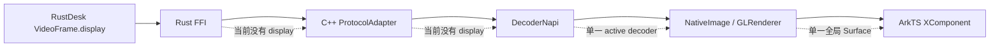

# RustDesk 多屏幕切换升级计划

状态：调研完成，待实施

日期：2026-07-24

适用项目：`RemoteDeskHarmonyOS`

## 1. 结论摘要

当前问题不是远端没有多屏协议，也不是只缺少一个 ArkTS 菜单，而是屏幕标识在视频链路中被逐层丢弃：



官方 RustDesk 已经在协议层和客户端核心层支持多显示器：`VideoFrame.display` 标识每一帧属于哪个屏幕，`PeerInfo.displays` 提供屏幕目录，`Misc.switch_display`、`CaptureDisplays` 和 `refresh_video_display` 用于切换、选择采集流和请求关键帧。

本项目当前只维护一个 `current_display`、一个分辨率列表、一个 active decoder、一个 active renderer 和一个页面 `XComponent`。因此建议采用两期路线：

1. **一期 P0/P1：单画布显示器切换。** 一次只显示一个远端屏幕，但可以可靠枚举、切换、重建解码器、更新几何和输入映射。这是首个可发布目标。
2. **二期 P1/P2：多画布同时显示。** 每个被选中的屏幕有独立队列、解码器、NativeImage、NativeWindow、纹理、渲染器和生命周期。输入需要额外处理 RustDesk 的会话/显示器路由，不能仅凭视频帧并行渲染就宣称“多屏均可控制”。

不修改 RustDesk protobuf 已有字段编号，不自定义 `VideoFrame` 或 `PeerInfo` 字段。先在现有协议基线上补齐 FFI、C++、渲染和 ArkTS 的屏幕维度；本地 IPC 若继续作为生产模式，则另行升级其版本化私有协议。

## 2. 调研基线与引用

### 2.1 项目基线

本次调研工作树干净，项目提交为：

`bfae6ef30c4c026a305513fed65462930ab1ac02`

项目已经固定了 RustDesk 协议来源，见 [`rustdesk_vendor/libs/hbb_common/protos/UPSTREAM.yml`](../rustdesk_vendor/libs/hbb_common/protos/UPSTREAM.yml)：

| 项目 | 固定值 |
| --- | --- |
| RustDesk | `93d064a9b0eb58ab94db88ff727a877ef773c0d8` |
| hbb_common | `387603f47cbb15c0d3dc3d67ae3396d3eb707daf` |
| 协议许可 | AGPL-3.0 |
| 本地协议文件 | `rustdesk_vendor/libs/hbb_common/protos/message.proto` |

官方最新 master 对照提交为 `b4af82157bc5b44b62e66c1e7b50cc945bc42532`。本计划不建议直接把 master 全量移植到 HarmonyOS；实施前只对多屏相关协议和 `io_loop` 行为做定向差异复核。

### 2.2 官方 RustDesk 源码

- [官方 `message.proto`，hbb_common 固定提交](https://github.com/rustdesk/hbb_common/blob/387603f47cbb15c0d3dc3d67ae3396d3eb707daf/protos/message.proto)
- [官方 `io_loop.rs`，对照提交](https://github.com/rustdesk/rustdesk/blob/b4af82157bc5b44b62e66c1e7b50cc945bc42532/src/client/io_loop.rs)
- [官方 `ui_session_interface.rs`，显示器切换与采集控制](https://github.com/rustdesk/rustdesk/blob/b4af82157bc5b44b62e66c1e7b50cc945bc42532/src/ui_session_interface.rs)
- [官方 `remote.rs`，显示器列表和显示回调](https://github.com/rustdesk/rustdesk/blob/b4af82157bc5b44b62e66c1e7b50cc945bc42532/src/ui/remote.rs)
- [官方 Flutter 多显示器纹理模型](https://github.com/rustdesk/rustdesk/blob/b4af82157bc5b44b62e66c1e7b50cc945bc42532/flutter/lib/models/desktop_render_texture.dart)

关键行为：

- `io_loop.rs` 维护 `HashMap<usize, VideoThread>`，收到视频帧后使用 `vf.display` 选择对应队列；显示器切换只重置目标显示器的线程，并保留每个屏幕独立的回调上下文。
- `ui_session_interface.rs` 的 `switch_display` 发送 `Misc.switch_display`，现代客户端还使用 `CaptureDisplays { set: [display] }`；切换后通过 `refresh_video_display` 请求目标屏幕刷新。
- `PeerInfo` 和 `SwitchDisplay` 都携带屏幕几何；`SwitchDisplay` 的 `resolutions` 属于目标屏幕，不能继续放入全局单一分辨率列表。
- 官方纹理模型按 `display` 建立 texture control；这可以作为二期 HarmonyOS `DisplaySessionManager` 的结构参考。

### 2.3 鸿蒙官方文档

- [AVCodec Kit 简介](https://developer.huawei.com/consumer/cn/doc/harmonyos-guides/avcodec-kit-intro)
- [视频解码](https://developer.huawei.com/consumer/cn/doc/harmonyos-guides/video-decoding)
- [XComponent 自定义渲染](https://developer.huawei.com/consumer/cn/doc/harmonyos-guides/napi-xcomponent-guidelines)
- [NativeImage 开发指导](https://developer.huawei.com/consumer/cn/doc/harmonyos-guides/native-image-guidelines)
- [NativeWindow 开发指导](https://developer.huawei.com/consumer/cn/doc/harmonyos-guides/native-window-guidelines)

本计划据此采用以下硬约束：

1. Surface 模式必须在 `Prepare` 前设置 decoder 的 Surface。
2. `Flush`、`Reset`、`Stop`、`Destroy` 不得从 AVCodec 回调线程调用。
3. `Flush`、`Reset`、`Stop` 后必须等待并重新发送 SPS/PPS 等解码初始化数据。
4. 不同 decoder 不共享同一个 `NativeWindow`；NativeWindow 销毁错误可能使其他 decoder 卡住。
5. Surface 模式不能通过 `OH_AVBuffer_GetAddr` 读取图像数据；硬解输出应走 NativeImage 和 GL 外部纹理。
6. 每个 XComponent 持有自己的 Surface；`onSurfaceCreated`、`onSurfaceChanged`、`onSurfaceDestroyed` 必须映射到对应显示器的 surface generation。
7. NativeImage、NativeWindow、外部纹理和 EGL 资源必须按显示器独立管理，并严格配对申请、Fence 等待、Flush、释放。

## 3. 当前代码证据与问题定位

### 3.1 Rust FFI 已有能力与缺口

| 位置 | 现状 | 影响 |
| --- | --- | --- |
| [`rustdesk_ffi/src/lib.rs:219-227`](../rustdesk_ffi/src/lib.rs) | `FfiVideoFrame` 有数据、尺寸、codec、时间戳和关键帧，但没有 `display` | 每个远端屏幕的帧在 FFI 边界变成同一个流 |
| [`rustdesk_ffi/src/lib.rs:318-359`](../rustdesk_ffi/src/lib.rs) | `RustDeskDisplayState` 只有一个 `current_display`、一组几何和一组 resolutions | 屏幕目录、每屏几何和每屏分辨率无法保存 |
| [`rustdesk_ffi/src/lib.rs:499-562`](../rustdesk_ffi/src/lib.rs) | `dispatch_video_frame` 从共享 state 取当前宽高，没有读取 `VideoFrame.display` | 交错帧会使用错误几何，且下游无法路由 |
| [`rustdesk_ffi/src/connector.rs:2645-2720`](../rustdesk_ffi/src/connector.rs) | 从 `PeerInfo.displays` 只选择 current display | 远端其他屏幕信息被丢弃 |
| [`rustdesk_ffi/src/connector.rs:2722-2765`](../rustdesk_ffi/src/connector.rs) | `Misc.switch_display` 只更新共享当前几何 | 切换不能形成每屏状态 |
| [`rustdesk_ffi/src/lib.rs:1155-1185`](../rustdesk_ffi/src/lib.rs) | snapshot 只返回一个屏幕及一组分辨率 | ArkTS 只能显示当前屏幕分辨率菜单 |

已有的 `change_display_resolution`、`refresh_video` 和 `switch_display` 协议控制应保留；需要补的是显示器目录、帧 display、目标屏幕刷新和按屏幕的状态。

### 3.2 C++ adapter 和 NAPI 缺口

| 位置 | 现状 | 改造方向 |
| --- | --- | --- |
| [`entry/src/main/cpp/extensions/protocol_adapter.h:124-137`](../entry/src/main/cpp/extensions/protocol_adapter.h) | `VideoFrame` 没有 display | 增加稳定的 display 字段，其他协议默认为 0 |
| [`entry/src/main/cpp/rustdesk/rustdesk_bridge.cpp:443-451`](../entry/src/main/cpp/rustdesk/rustdesk_bridge.cpp) | `RustDeskFfiVideoFrame` 没有 display | 与 Rust V2 FFI ABI 对齐 |
| [`entry/src/main/cpp/rustdesk/rustdesk_bridge.cpp:523-539`](../entry/src/main/cpp/rustdesk/rustdesk_bridge.cpp) | 回调只记录 codec、宽高和关键帧 | 复制 display 并在回调期间完成数据生命周期转换 |
| [`entry/src/main/cpp/extensions/extension_loader_napi.cpp:1226-1252`](../entry/src/main/cpp/extensions/extension_loader_napi.cpp) | 所有帧都调用 `DecodeActiveNative(frame)` | 改为按 display 交给 `DisplaySessionManager` |
| [`entry/src/main/cpp/rustdesk/rustdesk_bridge.cpp:856-900`](../entry/src/main/cpp/rustdesk/rustdesk_bridge.cpp) | display capabilities 只转换一个 snapshot | 增加完整 display list 和按屏幕切换接口 |

### 3.3 解码器和渲染器缺口

| 位置 | 现状 | 影响 |
| --- | --- | --- |
| [`entry/src/main/cpp/render/gl_renderer.cpp:32-39`](../entry/src/main/cpp/render/gl_renderer.cpp) | 进程级 `g_nativeWindow`、`g_surfaceId`、surface 尺寸 | 多个 Surface 无法并存 |
| [`entry/src/main/cpp/render/gl_renderer.cpp:1142-1162`](../entry/src/main/cpp/render/gl_renderer.cpp) | 进程级 `g_activeRendererHandle` | 所有输出只能指向一个 renderer |
| [`entry/src/main/cpp/render/hw_decoder.h:164-196`](../entry/src/main/cpp/render/hw_decoder.h) | 一个 `HardwareDecoder` 只有一个 NativeImage、NativeWindow 和纹理 | 不能将不同屏幕隔离 |
| [`entry/src/main/cpp/render/hw_decoder.cpp:694-725`](../entry/src/main/cpp/render/hw_decoder.cpp) | decoder registry 虽支持多个 context，但仍有一个 active decoder | 现有多 decoder 只是句柄层面存在，视频路由仍是单路 |
| [`entry/src/main/cpp/render/hw_decoder.cpp:1320-1332`](../entry/src/main/cpp/render/hw_decoder.cpp) | decode 入口按 context 解码，但没有 display 选择 | 需要 manager 决定目标 context |
| [`entry/src/main/cpp/render/hw_decoder.cpp:1456-1492`](../entry/src/main/cpp/render/hw_decoder.cpp) | bind 时写入全局 active decoder | 一期可保留兼容，二期必须改为按 display bind |

### 3.4 ArkTS 和 IPC 缺口

- [`entry/src/main/ets/types/rdpnapi.d.ts:261-276`](../entry/src/main/ets/types/rdpnapi.d.ts) 的 `RustDeskDisplayCapabilities` 只有 `currentDisplay` 和当前 resolutions。
- [`entry/src/main/ets/pages/RemoteDesktop.ets:1365-1397`](../entry/src/main/ets/pages/RemoteDesktop.ets) 只打开“远端显示分辨率”菜单，切换请求始终使用 `capabilities.currentDisplay`。
- [`entry/src/main/ets/pages/RemoteDesktop.ets:8300-8339`](../entry/src/main/ets/pages/RemoteDesktop.ets) 只渲染分辨率列表。
- [`entry/src/main/ets/pages/RemoteDesktop.ets:8341-8359`](../entry/src/main/ets/pages/RemoteDesktop.ets) 页面只有一个 Surface 型 XComponent。
- [`entry/src/main/ets/pages/RemoteDesktop.ets:355-365`](../entry/src/main/ets/pages/RemoteDesktop.ets) 和 [`:3579-3605`](../entry/src/main/ets/pages/RemoteDesktop.ets) 的输入映射使用单一 `remoteWidth`、`remoteHeight` 和 viewport，切换后必须按 active display 更新。
- [`entry/src/main/cpp/rustdesk/rustdesk_ipc.h:44-45`](../entry/src/main/cpp/rustdesk/rustdesk_ipc.h) 的 IPC 视频消息没有 display；[`rustdesk_ipc.h:100-108`](../entry/src/main/cpp/rustdesk/rustdesk_ipc.h) 的帧头也没有 display。
- [`rustdesk_helper/src/ipc.rs:128-140`](../rustdesk_helper/src/ipc.rs) 仍是调用 RustDesk core 的 TODO 骨架。因此 FFI 改造不会自动让 IPC 模式获得多屏能力，必须单独升级 IPC 或将多屏功能限定为真实 FFI 构建。

## 4. 协议字段映射与兼容原则

本地协议文件 [`rustdesk_vendor/libs/hbb_common/protos/message.proto`](../rustdesk_vendor/libs/hbb_common/protos/message.proto) 已包含以下字段，实施时不得重新编号或改类型：

| 官方字段 | 编号 | 用途 | 本项目目标映射 |
| --- | ---: | --- | --- |
| `VideoFrame.display` | 14 | 视频帧所属屏幕索引 | Rust FFI V2 -> C++ `VideoFrame.display` -> decoder manager |
| `PeerInfo.displays` | 4 | 屏幕目录、位置、尺寸、名称、在线状态、DPI 缩放 | Rust `DisplayCatalog` -> NAPI display list -> ArkTS state |
| `PeerInfo.current_display` | 5 | 对端当前屏幕 | 初始化 active display 和兼容旧端 |
| `DisplayInfo.x/y/width/height` | 1-4 | 屏幕几何 | viewport 和输入坐标基准 |
| `DisplayInfo.name/online/cursor_embedded` | 5-7 | UI 名称、在线状态、光标策略 | UI 标签、禁用离线项、光标重置 |
| `DisplayInfo.original_resolution/scale` | 8-9 | 原始分辨率、缩放 | 分辨率菜单和输入缩放 |
| `Misc.switch_display` -> `SwitchDisplay.display` | 5 / 1 | 请求或通知当前屏幕变化 | 一期切换控制、几何更新 |
| `Misc.capture_displays` -> `CaptureDisplays` | 30 | add/sub/set 采集屏幕 | 一期 set 单屏、二期选择多屏 |
| `Misc.refresh_video_display` | 31 | 请求指定屏幕刷新/关键帧 | 切换后和解码恢复后调用 |
| `Misc.change_display_resolution` | 36 | 指定屏幕分辨率 | resolutions 必须按 display 保存 |
| `Misc.follow_current_display` | 38 | 通知控制端当前屏幕变化 | 更新 UI active display，防止状态漂移 |
| `MessageQuery.switch_display` | 1 | 初始化或旧版本兼容请求 | PeerInfo 不完整时的 fallback |

### 4.1 一期单画布切换消息序列

1. 收到 `PeerInfo`，保存完整 display catalog，校验 `current_display` 范围；无效时选第一个 online 屏幕。
2. 用户选择 `display = N`，先锁定 `switchGeneration`，停止发送旧屏幕的待发送鼠标移动，释放按键/触摸状态并清空旧 viewport。
3. 向远端发送官方 `Misc.switch_display(SwitchDisplay { display: N })`。
4. 对现代远端发送 `Misc.capture_displays(CaptureDisplays { set: [N] })`，减少不需要的流量；旧版本失败时仅依赖 `switch_display`。
5. 向远端发送 `Misc.refresh_video_display(N)`，覆盖目标屏幕已经在采集但控制端缓存过旧的情况。
6. 收到 `Misc.switch_display` 回传时更新 N 的几何、缩放和分辨率，递增该屏幕 `geometryEpoch`。
7. decoder 控制线程 flush/reconfigure，等待 display N 的关键帧；在关键帧前丢弃 N 的 delta 帧和所有旧 generation 的帧。
8. 首个有效关键帧到达后更新 renderer source size、viewport、光标和输入映射，进入 `Presenting`。

切换动作应可合并：用户连续点击多个屏幕时只保留最后一个目标，旧目标的网络控制消息不能阻塞新目标。收到不认识的 display index 时保持当前屏幕并记录诊断，不崩溃。

### 4.2 旧版本兼容

- protobuf 的 `display` 默认值为 0，旧远端只发送屏幕 0 时自然落入单屏路径。
- `PeerInfo.displays` 为空时保持现有单屏 fallback，但 UI 不显示切屏控件。
- `CaptureDisplays` 不被远端识别时，不把它当作连接失败；继续使用 `SwitchDisplay` 和 `refresh_video_display`。
- 不对 RustDesk 官方 protobuf 做本地扩展；任何新增字段必须先在官方协议上游得到明确兼容策略。

## 5. 目标架构

### 5.1 逻辑对象

引入一个只负责视频显示路由的 `DisplaySessionManager`，不要继续扩张全局 active 变量。建议对象关系如下：

```text
RustDeskConnection
  └── DisplaySessionManager
       ├── DisplayCatalog
       │    ├── display 0: geometry, scale, online, resolutions
       │    └── display 1: geometry, scale, online, resolutions
       ├── DisplayPipeline[display 0]
       │    ├── encoded queue
       │    ├── decoder handle / backend
       │    ├── NativeImage + NativeWindow + texture
       │    ├── renderer handle / surface binding
       │    └── generation + telemetry
       └── DisplayPipeline[display 1]
```

一期允许 manager 只有一个物理 decoder 和一个 renderer，但仍然按 display 保存队列、generation 和几何；二期再把每个 `DisplayPipeline` 扩展为完整物理资源。这样可以先稳定屏幕路由，再承担多路硬解资源成本。

### 5.2 状态机

每个屏幕使用独立状态：

```text
Unavailable
  -> Catalogued
  -> Requested
  -> AwaitingSwitchGeometry
  -> ReconfiguringDecoder
  -> AwaitingKeyframe
  -> Presenting
  -> Suspended
  -> Destroying
```

每个 session 和 display 都有单调递增的 `generation`：

- Surface 重建、decoder 重建、屏幕切换都会递增 generation。
- 任何异步回调带上捕获时的 generation；不匹配时只释放数据并返回。
- `onSurfaceDestroyed` 后不得继续访问旧 `NativeWindow`、NativeImage 或 EGL surface。

## 6. 分阶段实施计划

### 阶段 0：基线、开关和测试夹具，P0

预计 1-2 人日。

- [ ] 固定本计划所列 RustDesk/hbb_common 版本和 SHA，不在功能开发中顺便升级 master。
- [ ] 确认正式构建使用 `RUSTDESK_USE_REAL_CORE` 的 FFI 模式还是 IPC 模式，并把结果写入构建产物诊断。
- [ ] 增加运行时能力开关：`legacy_single_display`、`single_canvas_switch`、`multi_canvas_preview`。
- [ ] 建立 fake peer fixture：3 个屏幕、不同宽高和 scale、交错 display 0/1/2 帧、切换几何、关键帧和分辨率消息。
- [ ] 记录当前单屏基准：首帧时间、切换前 FPS、解码 P95、内存、Surface 重建成功率。
- [ ] 为 Rust、C++ 和 ArkTS 约定 display index、geometry epoch、switch generation 的命名和单位。

退出条件：旧单屏路径可构建、测试夹具可发送交错帧、开关关闭时行为不变。

### 阶段 1：Rust 协议层和 FFI，P0

预计 3-5 人日，依赖阶段 0。

#### 1.1 完整 display catalog

- [ ] 将 `RustDeskDisplayState` 拆为 `DisplayCatalog`、`DisplayInfoState` 和 `active_display`。
- [ ] `PeerInfo.displays` 到达时完整复制每个屏幕的 `x/y/width/height/name/online/cursor_embedded/original_resolution/scale/resolutions`。
- [ ] `SwitchDisplay` 到达时只更新对应 display，更新 active display 和 geometry epoch；不能覆盖其他屏幕的 resolution。
- [ ] 处理 `FollowCurrentDisplay`、重复 PeerInfo、屏幕拔出和重新上线；active 屏幕下线时选择第一个 online 屏幕并通知上层。
- [ ] 将 resolutions 从单一 `Vec<(i32, i32)>` 改为 `display -> Vec<Resolution>`。

#### 1.2 FFI V2 frame ABI

不要在没有版本保护的情况下直接让 C++ 读取新增内存。建议新增版本化的 `FfiVideoFrameV2`，保留旧结构到迁移完成：

```c
struct FfiVideoFrameV2 {
    uint32_t abi_version;
    uint32_t struct_size;
    const uint8_t* data;
    size_t size;
    int32_t width;
    int32_t height;
    int32_t codec;
    int32_t display;
    uint64_t timestamp;
    uint32_t flags; /* bit 0 = key frame */
};
```

- [ ] Rust 使用 `#[repr(C)]` 定义 V2，并增加 `RUSTDESK_FRAME_ABI_VERSION = 2`。
- [ ] 增加 `rustdesk_connect_v2` 或等价的版本化 callback 入口；旧 `rustdesk_connect` 保持 V1 兼容。
- [ ] V2 dispatch 使用 `frame.display`，宽高从该 display 的状态读取，不能从全局 current display 读取。
- [ ] callback 期间只保证 `data` 指针有效；C++ 必须在 callback 内复制到自己的有界队列，禁止异步保存裸指针。
- [ ] 对 ABI 做 `size_of`、`align_of` 和 `offset_of` 断言；C++ 同步 `static_assert`。

#### 1.3 FFI 控制和查询接口

建议增加以下语义接口，具体 C ABI 名称可按现有命名风格落地：

```text
get_display_catalog(handle) -> version, active_display, geometry_epoch, displays[]
switch_display(handle, display) -> queued/accepted
capture_displays(handle, add[], sub[], set[]) -> queued/accepted
refresh_video_display(handle, display) -> queued/accepted
change_display_resolution(handle, display, width, height) -> queued/accepted
```

- [ ] 输出数组接口必须返回 `written_count`，容量不足时只写入容量范围，不越界。
- [ ] 列表读取必须是快照，不把 Rust 内部 `String` 或 `Vec` 指针暴露给 C++。
- [ ] `RustDeskDisplaySnapshot` 版本从 1 升为 2，旧字段保持前缀兼容；新增 display list 使用独立接口，避免破坏现有 snapshot ABI。
- [ ] 控制消息继续构造官方 protobuf 变体，不增加私有 wire 字段。

#### 1.4 Rust 测试

- [ ] 交错 display 0/1/2 的 `VideoFrame` 被 callback 逐帧保留正确 display。
- [ ] PeerInfo 三屏和 SwitchDisplay 更新后，每屏几何、scale、resolutions 独立存在。
- [ ] `capture_displays`、`refresh_video_display`、`switch_display`、`change_display_resolution` 的 protobuf union 和字段值正确。
- [ ] 空列表、非法 index、屏幕下线、旧帧默认 display 0、输出容量不足全部有测试。
- [ ] V1/V2 ABI 入口分别可调用，V2 版本或 struct size 不匹配时拒绝读取。

### 阶段 2：C++ adapter、单画布路由和 decoder 控制，P0

预计 4-6 人日，依赖阶段 1。

#### 2.1 数据路由

- [ ] `protocol_adapter.h` 的 `VideoFrame` 增加 `int display = 0`，RDP/VNC/SSH 等其他适配器固定为 0。
- [ ] `RustDeskFfiVideoFrame` 对齐 V2，`onFfiFrame` 复制 display、数据、关键帧、codec、尺寸和时间戳。
- [ ] 将 `DecodeActiveNative(frame)` 改为 `DisplaySessionManager::submitFrame(frame)`。
- [ ] manager 在一期只把 active display 送入物理 decoder；非 active display 不允许误进入当前屏幕。
- [ ] 为非 active display 保留有限的最新关键帧状态或直接丢弃 delta，切换时强制 refresh，不建立无限缓存。

#### 2.2 单画布切换流程

- [ ] `requestDisplaySwitch(display)` 做防抖、递增 generation、挂起旧 display 的输入和 presentation。
- [ ] 在非 AVCodec callback 线程执行 decoder detach、Flush/Reset/Stop/Destroy 或重建。
- [ ] 复用页面 XComponent 的 output surface 时，重新创建或配置 decoder，并在 `Prepare` 前设置同一个有效 Surface。
- [ ] 新 display 的首个关键帧到达前不显示旧 display 的纹理；收到关键帧后再恢复 render callback。
- [ ] 如果 codec 或源尺寸改变，按 codec+尺寸重建 decoder；不假设不同屏幕可以安全共用旧 SPS/PPS。
- [ ] 切换失败时恢复上一个稳定 display；若上一个也不可用，降级到 display 0 的 legacy 路径。

#### 2.3 保留现有硬解和软解能力

- [ ] `HardwareDecoder` 和 `SoftwareDecoder` 的选择移入每个 display pipeline 的 backend 状态。
- [ ] 硬解初始化失败、资源耗尽或输出回调持续失败时，先保证 active display 仍有画面，再按策略转软解。
- [ ] 软解输出要携带 display 和 generation，不能绕过 manager 直接写全局 active renderer。
- [ ] 复用现有 backpressure、丢帧、等待关键帧和 recovery policy，但计数器改为按 display 统计，同时保留 session aggregate。

### 阶段 3：GL、NativeImage、NativeWindow 生命周期，P0/P1

预计 3-5 人日，与阶段 2 并行但必须在真机验收前完成。

#### 3.1 一期最小改造

- [ ] 保持一个页面 XComponent，但将 `g_nativeWindow/g_surfaceId/g_surfaceWidth/g_surfaceHeight` 封装为当前 surface binding，不再让 display 逻辑直接访问全局变量。
- [ ] renderer 由 manager 通过句柄绑定到当前 display；旧 active handle 只作为兼容包装，不作为视频路由依据。
- [ ] 切换时按顺序执行：停止提交 -> 等待 callback gate -> detach decoder pipeline -> flush/recreate -> bind renderer -> request keyframe -> resume。
- [ ] `UpdateSurfaceImage`、纹理绑定和 EGL current 操作只能在既定 render thread/GL context 执行。

#### 3.2 二期多 Surface 改造

- [ ] 新增 `SurfaceRegistry`，key 为 `(sessionId, display)`，每项维护 surfaceId、NativeWindow 所有权、尺寸和 generation。
- [ ] `GLRenderer` 实例持有自己的 EGL surface、NativeWindow 引用和 source viewport；删除对进程级唯一 `g_nativeWindow` 的依赖。
- [ ] 每个 `HardwareDecoder` 独立 NativeImage、NativeWindow、外部纹理；绝不让两个 decoder 共享同一 NativeWindow。
- [ ] NativeWindow 的 acquire/release、request buffer、fence wait、flush 和 destroy 成对执行，异常路径也必须释放。
- [ ] Surface changed 只更新对应 renderer；Surface destroyed 只使对应 pipeline 失效，不销毁其他屏幕。

### 阶段 4：ArkTS UI、NAPI 和输入坐标，P0/P1

预计 2-4 人日，依赖阶段 1-3。

#### 4.1 NAPI/类型

- [ ] 将 `RustDeskDisplayCapabilities` 扩展为 `activeDisplay`、`displayCount`、`geometryEpoch`、`displays[]` 和 `switchState`。
- [ ] `RustDeskDisplayInfo` 至少包含 `display/x/y/width/height/originalWidth/originalHeight/scaleMilli/name/online/cursorEmbedded/resolutions`。
- [ ] 新增 `getRustDeskDisplays(sessionId)`、`switchRustDeskDisplay(sessionId, display)`；保留现有 resolution API 并要求显式传 display。
- [ ] Native 返回对象时做范围校验和默认值处理；ArkTS 不读取未定义字段来推断屏幕。
- [ ] 先用现有同步查询在连接、PeerInfo 更新、SwitchDisplay 更新和切换完成后刷新；后续可增加 display changed callback，避免高频轮询。

#### 4.2 单画布 UI

- [ ] 在现有 RustDesk 菜单中增加显示器选择区域；一个屏幕时隐藏切换项，多个屏幕时显示每个屏幕的名称、序号、在线状态和当前尺寸。
- [ ] 显示器选择和分辨率选择分离；分辨率操作传入所选 display，而不是读取旧的 `currentDisplay`。
- [ ] 切换中禁用重复操作并显示确定的 pending/failed 状态；收到 geometry epoch 更新后刷新菜单。
- [ ] 保留屏幕切换后的画面居中、缩放和旋转策略；不要把 display index 当作物理屏幕坐标。

#### 4.3 输入和光标

- [ ] `mapInputPoint`、`toSourceSpace`、`remoteWidth/remoteHeight`、viewport cache 都改为读取 active display 的 geometry snapshot。
- [ ] 切换开始时清空待发送 mouse move，释放本地 latch 的按键、触摸拖拽和滚轮 remainder，避免旧屏幕坐标发送到新屏幕。
- [ ] 切换完成后 clamp 到目标屏幕 `[0, width-1] x [0, height-1]`，使用目标屏幕的 scale 和旋转几何。
- [ ] 目标屏幕切换时隐藏旧光标位置，等待目标屏幕的 cursor position/shape 或以目标屏幕中心作为安全 fallback。
- [ ] 每个输入事件记录 `inputDisplay`, `geometryEpoch`, `viewport generation`，发现不一致时丢弃旧事件。

### 阶段 5：IPC 模式 parity，P0 发布门槛

预计 3-6 人日，取决于 helper 是否接入真实 RustDesk core。

当前 `rustdesk_helper` 的连接逻辑是 TODO，现有 IPC 视频头也没有 display，因此需要先做模式决策：

**推荐方案：** 多屏能力以真实 Rust FFI 模式为主线；IPC 模式在未完成 parity 前明确返回 `multi_display=false`，继续提供稳定的单屏行为。

如果正式包必须使用 IPC，则实施以下版本化私有协议：

- [ ] `RD_IPC_VIDEO_FRAME` 升级为带 `version/struct_size/display` 的 V2 header，保留 V1 解析。
- [ ] 增加 display catalog、switch、capture set、refresh 和 resolution control 消息；消息必须有长度校验、版本协商和拒绝未知版本的行为。
- [ ] helper 真正接入 RustDesk core，转发 `PeerInfo`、`VideoFrame.display` 和控制消息；不能只回复连接 ACK。
- [ ] IPC 的 display list 和 frame payload 仍使用有界队列，禁止 helper 和主进程之间保存悬空指针。
- [ ] IPC 模式单独做协议版本和升级回滚测试，不能把 FFI ABI 版本当作 IPC 版本。

## 7. 二期：多画布同时显示

### 7.1 视图模式

二期先交付只读/预览能力，再交付多屏独立输入。建议提供三种明确模式：

| 模式 | 采集控制 | 解码资源 | 输入 |
| --- | --- | --- | --- |
| 单屏 active | `set: [N]` | 1 个 decoder | 完整控制 N |
| 多屏预览 | `set: [N...]` | 每屏独立 pipeline，数量受限 | 默认只控制焦点屏 |
| 多屏独立控制 | 每屏独立 session 或官方 multi-UI session | 每屏独立 pipeline | 需要 per-display session 路由验收 |

ArkTS 可以使用多个 Surface 型 XComponent，每个节点通过 `XComponentController.getXComponentSurfaceId()` 注册到 `(sessionId, display)`。每个屏幕的 surface、NativeImage、NativeWindow、decoder 和 renderer 必须一一对应。

### 7.2 输入协议限制

RustDesk 当前 `MouseEvent` 本身没有 display 字段。单连接多路视频并不自动提供“鼠标发给哪块屏幕”的语义。因此二期必须在实现前做选择：

1. **优先使用官方 multi-UI session 机制。** 每个显示器保持独立 session handler 和输入通道，HarmonyOS manager 按显示器保存 connection/session handle。
2. **如果当前 FFI 没有暴露 multi-UI session，建立每屏独立 RustDesk session。** 代价是认证、带宽和 decoder 数量增加，但输入语义清晰。
3. **临时降级。** 多屏只做预览，只有焦点 display 可交互；切换焦点前显式发送 `switch_display`。不能把多个 XComponent 的坐标直接发入同一个没有 display 上下文的 `sendMouse`。

光标消息同样需要按 session/display 关联。若官方通道没有可用关联字段，不得依据帧到达顺序猜测光标属于哪个屏幕。

### 7.3 资源上限

- 默认最多同时显示 2 个屏幕；移动设备经真机验证后再开放 3-4 个。
- active/focused 屏幕优先硬解和完整帧率；非焦点屏幕可降低 FPS、降低分辨率或暂停采集。
- 每个 pipeline 有独立队列上限，默认沿用现有硬解队列 12 帧、软解队列 30 帧，再通过压测校准。
- 达到硬件 decoder 上限时，active 屏幕保持硬解，其他屏幕依次尝试软解；软解也不足时暂停最低优先级屏幕并显示降级状态。
- 禁止用无限队列缓解资源问题；必须把丢帧、等待关键帧和暂停原因计入诊断。

## 8. 硬解、软解和降级策略

### 8.1 选择优先级

1. 检测设备和 codec 能力，优先创建 active display 的硬件 decoder。
2. 其他 selected display 按焦点、可见面积、用户固定顺序创建硬解。
3. OH_AVCodec 创建、配置、Prepare 或 Start 因资源不足失败时，使用现有 `SoftwareDecoder` 支持的 codec 做软解。
4. active display 的硬解运行中出现连续输出失败时，先请求 keyframe；恢复失败再切软解。
5. 软解 CPU、内存或队列超限时，降低非焦点屏幕 FPS，仍超限则暂停其远端采集。

### 8.2 切换与恢复

- 切换屏幕不复用另一屏幕的 SPS/PPS、解码时间戳或 pending input buffer。
- 每次 decoder `Flush/Reset/Stop` 后将 pipeline 标记为 `AwaitingKeyframe`，丢弃非关键 delta。
- 软解和硬解切换都通过 manager 的串行 control queue 执行，回调线程只发事件。
- 任何 fallback 必须在 UI 显示 `hardware/software/paused` 状态，并写入 `decoderBackend`、`fallbackReason`。

## 9. 生命周期、线程和并发规则

| 线程/上下文 | 允许操作 | 禁止操作 |
| --- | --- | --- |
| Rust 接收线程 | 解析 protobuf、更新 Rust catalog、把帧复制到 FFI callback | 访问 C++ Surface 或阻塞等待 decoder |
| C++ FFI callback | 校验 ABI、复制帧、入 display queue、递增轻量计数 | 保存 Rust buffer 指针、直接 Reset/Destroy decoder |
| DisplaySessionManager control thread | 切换状态、Flush/Reset/Stop/Destroy、绑定/解绑 pipeline | 在锁内调用用户 UI callback |
| AVCodec callback thread | 取 input buffer、通知 output/frame available、记录错误 | 调用 Flush/Reset/Stop/Destroy、销毁 NativeImage/NativeWindow |
| Render thread | EGL current、UpdateSurfaceImage、绑定外部纹理、绘制 | 读已失效 Surface、跨 display 使用纹理 |
| ArkTS/UI | 创建销毁 XComponent、发送 display control、读取快照 | 直接持有 native 指针或假设 callback 同步返回 |

所有异步操作遵循以下顺序：

1. 取得 session/display/pipeline 的 generation。
2. 在队列中复制必要数据。
3. 执行异步工作。
4. 提交结果前重新校验 generation、surface generation 和当前 session state。
5. 失效时释放资源并记录 `stale_callback`，不触碰新对象。

PIP 和后台恢复沿用现有生命周期，但一期只转移 active display 的 renderer；二期每个 PIP surface 必须有独立 registry entry。后台只销毁 UI 绑定的 renderer，不应误销毁仍需保活的协议和其他 display pipeline。

## 10. 任务依赖和工期估算

以下为一名熟悉 Rust/C++/ArkTS 和 HarmonyOS 图形栈的工程师的开发量，不包含外部设备等待和发布审核：

| 阶段 | 内容 | 估算 | 前置 |
| --- | --- | ---: | --- |
| 0 | 基线、开关、fake peer、性能基准 | 1-2 人日 | 无 |
| 1 | Rust catalog、V2 FFI、控制和单测 | 3-5 人日 | 0 |
| 2 | C++ adapter、单画布路由、decoder control | 4-6 人日 | 1 |
| 3 | GL/Surface 生命周期和真机修复 | 3-5 人日 | 2 |
| 4 | ArkTS display UI、NAPI、坐标映射 | 2-4 人日 | 1-3 |
| 5 | IPC parity（若正式包需要） | 3-6 人日 | 1 |
| 6 | 集成、压力、回归和发布门禁 | 3-5 人日 | 0-5 |
| **一期合计** | **单画布可切换** | **13-22 人日** | **不含 IPC parity 时为 10-16 人日** |
| 7 | 二期多 Surface、多 pipeline、预览 | 8-14 人日 | 一期稳定 |
| 8 | 多屏独立输入/多 session | 5-10 人日 | 7、官方 session 路由确认 |

关键依赖不是 UI，而是：真实 build mode、Rust V2 ABI、远端 `CaptureDisplays` 行为、HarmonyOS 设备可用 decoder 数量、以及二期输入使用的 session 路由。

## 11. 测试和验收矩阵

### 11.1 单元和协议测试

- [ ] Rust：三屏 PeerInfo 解析、screen catalog 更新、屏幕下线/上线、current display 修正。
- [ ] Rust：交错 `VideoFrame.display` 路由、未知 display、默认 display 0、关键帧识别。
- [ ] Rust：所有多屏控制消息的 protobuf union、字段编号和 payload 断言。
- [ ] Rust/C++：V1/V2 ABI size、alignment、offset、版本拒绝和 callback 数据生命周期。
- [ ] C++：display -> pipeline 路由、非 active 丢帧、切换 generation、旧 callback 拒绝、队列上限和 keyframe gate。
- [ ] C++：硬解失败 -> 软解、软解过载 -> 降 FPS/暂停、恢复后重新请求关键帧。
- [ ] C++：Surface created/changed/destroyed、PIP transfer、重复 destroy、快速重建和 stale handle。
- [ ] ArkTS：display list 归一化、切换 pending/失败状态、resolution 按 display 更新、输入坐标 clamp。

### 11.2 协议集成场景

| 场景 | 预期 |
| --- | --- |
| 单屏旧 RustDesk peer | 无切屏 UI，display 0 正常显示 |
| 双屏/三屏 PeerInfo | UI 显示完整列表，默认选 current display |
| 交错 display 0/1/2 帧 | 任何时刻只把 active display 送到一期 decoder，不能串屏 |
| 0 -> 1 -> 2 快速切换 | 最后目标优先，旧 generation 帧不显示 |
| 目标屏幕已采集但无新帧 | `refresh_video_display(N)` 后收到关键帧 |
| `CaptureDisplays` 不支持 | 回退 `SwitchDisplay`，不报连接失败 |
| 目标屏幕分辨率不同 | decoder 重新配置，SPS/PPS 后出画面 |
| 旋转/scale 不同 | viewport、光标和输入坐标跟随目标 display |
| 屏幕拔出 | UI 标记 offline，active 自动迁移或提示无可用屏幕 |
| relay/direct 两种链路 | 两种链路均能切换，诊断记录路径 |
| FFI 与 IPC | 能力标志准确，不把 IPC skeleton 误报为多屏支持 |

### 11.3 真机验收矩阵

至少覆盖：

- HarmonyOS API 23 及项目实际支持的最低 API、当前主流 API；重点验证 API 23 的 XComponent surface callback/polling 路径。
- ARM64 真机，至少一款低端设备、一款中端设备；x86_64 模拟/开发设备只做功能回归，不替代图形验收。
- 远端 Windows 双屏/三屏，横屏+竖屏、不同 DPI、不同分辨率、主屏索引不为 0、热插拔。
- H.264/H.265；如果当前远端协商 VP8/VP9/AV1，则分别验证软解或硬解能力和降级提示。
- 首次连接、断线重连、前后台、锁屏恢复、PIP 进入/退出、Surface 重建、快速切换。
- 触摸、鼠标、滚轮、键盘和远端光标在每个 active display 上坐标正确；二期预览屏明确只读或焦点可控。

## 12. 性能指标与诊断字段

### 12.1 一期发布建议指标

先记录当前 baseline，再以相对值和绝对值双重判断：

- display switch 后首次有效目标关键帧：局域网 P95 <= 1.5 秒，中继 P95 <= 3 秒。
- 串屏泄漏：验收期间旧 display 帧在新 display 画布上显示次数为 0。
- 单屏切换后 active display 的平均 FPS、解码 P95 和内存相对 baseline 下降不超过 5%。
- active pipeline 队列保持在配置上限内；无无限增长、无 Surface 泄漏、无旧 handle 命中。
- Surface 重建 100 次循环无崩溃、无黑屏超过 3 秒、无其他 display 被销毁。

### 12.2 日志和 metrics

每条视频或切换诊断至少包含：

```text
sessionId
display
activeDisplay
peerDisplayCount
codec
sourceWidth/sourceHeight
geometryEpoch
switchGeneration
frameGeneration
keyframeWaitMs
decoderBackend=hardware|software|paused
queueDepth/queueMax
droppedFrames
surfaceGeneration
rendererHandle
captureSet
refreshReason
fallbackReason
```

日志不得包含密码、密钥或完整认证 payload。`surfaceId` 如需记录只记录 hash 或短生命周期诊断值。统计需同时提供 per-display 和 session aggregate，才能区分“某个屏幕卡住”和“整个会话卡住”。

## 13. 风险、决策门和回滚

### 13.1 风险

1. **ABI 不一致。** Rust/C++ field offset 错误会表现为随机 codec、尺寸或崩溃，必须使用 V2 版本、静态断言和构建时检查。
2. **远端版本差异。** 老版本可能忽略 `CaptureDisplays` 或不回传完整几何，必须保留 `SwitchDisplay`/display 0 fallback。
3. **硬件解码器资源不足。** 多屏不是无限创建 decoder；需要 active 优先、软解和暂停策略。
4. **Surface 生命周期竞态。** ArkUI 回调、NAPI、decoder callback 和 render thread 的时序不同，必须依赖 generation 和 callback gate。
5. **输入没有 display 字段。** 二期不能只做多个画布；必须先确定官方 multi-UI session 或每屏独立 session。
6. **IPC 路径未接真实 core。** FFI 方案完成不代表默认 IPC 构建完成，发布能力标志必须准确。
7. **AGPL 合规。** 不改变现有 vendor 来源、NOTICE、SBOM 和源码提供流程；任何重新生成 proto 的提交都要同步来源和 hash。

### 13.2 发布开关

建议使用：

```text
rustdeskDisplayMode = legacy_single | single_switch | multi_preview
rustdeskDisplayMaxPipelines = 1..4
rustdeskDisplayInputMode = active_only | focused_session
```

默认发布顺序：

1. `legacy_single` 作为立即回滚值。
2. 通过真机矩阵后默认开启 `single_switch`。
3. `multi_preview` 仅在硬解资源、Surface 生命周期和带宽测试通过后开放。
4. 多屏独立输入必须等 session 路由验收通过，不因 UI 已能显示就提前打开。

### 13.3 回滚方案

- 任一阶段出现黑屏、崩溃、Surface 泄漏或输入串屏，运行时切回 `legacy_single`，只接收/渲染 display 0。
- FFI V2 解析失败时回退 V1 callback；V1 不声明多屏能力，避免读取不存在的 display 字段。
- manager 应隔离在 `RustDeskDisplayMode` 分支后面，保留原有单 renderer/decoder 路径，便于按构建开关回滚，不回滚无关协议或 PIP 修复。
- IPC V2 协商失败时继续 V1 单屏，不能把 V2 控制消息发给未知 helper。
- 回滚后保留诊断字段和失败原因，便于定位而不是静默吞错。

## 14. 最终实施顺序与验收门槛

推荐按以下顺序合并，每一步都保持可构建：

1. **先做 Rust display catalog 和 V2 frame ABI。** 没有 display 字段，不进入渲染改造。
2. **再做 C++ `VideoFrame.display` 和 manager 单屏路由。** 先证明交错帧不会串屏。
3. **再做 decoder 重建和 keyframe gate。** 明确所有 Reset/Flush 在控制线程执行。
4. **再改 GL/Surface 生命周期。** 一期先复用一个 XComponent，二期才拆多 Surface。
5. **最后接 ArkTS display selector 和输入映射。** UI 只调用已经稳定的 NAPI snapshot/control API。
6. **IPC 单独做 parity 或显式限制能力。** 不把未实现的 helper 路径纳入一期“已支持”声明。
7. **通过单元、协议、真机和性能矩阵后，才把 `single_switch` 设为默认。**

一期完成的判定标准是：在真实双屏/三屏 RustDesk 被控端上，HarmonyOS 控制端能枚举所有 online 屏幕，选择任一屏幕后只显示该屏幕的正确关键帧，分辨率/缩放/光标/输入坐标同步，切换和 Surface 重建不黑屏、不串屏、不崩溃；二期是否同时显示不影响一期交付。
