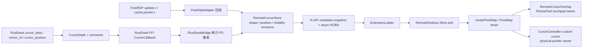
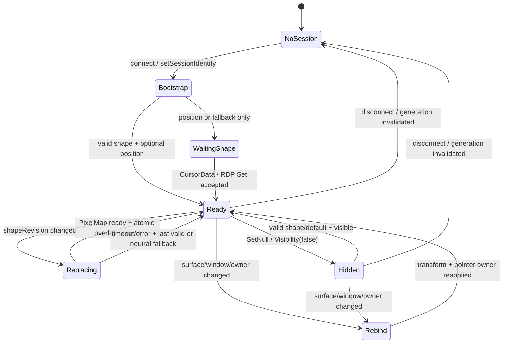

# RDP + RustDesk 真实远端鼠标形态长期运行升级计划

- 日期：2026-07-25
- 状态：RustDesk/RDP 代码阶段已落地，本地验证通过；真实设备 30 分钟/2 小时耐久验收待执行
- 范围：Phone/Pad 触控板模式的协议真实光标、PC/物理鼠标模式的系统/原生自定义光标，以及两者共用的形态生命周期
- 协议：RustDesk 真实 FFI 核心、RDP 真实 FreeRDP 3.x
- 目标：长时间运行、频繁形态切换、后台/前台恢复、窗口变化后，光标形态仍与远端协议当前形态一致，不被旧形态、永不结束的异步任务或系统指针回退污染

## 0. 当前落地状态（2026-07-26）

本轮已按本计划落地 RustDesk 与真实 FreeRDP 共用的远端光标形态链路修复：

- RustDesk：按 cursor ID 的长期缓存、压缩协议数据预算、cache miss 保留最后合法形态、预算淘汰诊断、重连 generation 隔离，以及携带代际上下文的 FFI 回调/断开保护。
- RDP：真实 FreeRDP `Set`、`SetPosition`、`SetNull`、`SetDefault` 回调和 connection generation 隔离；真实构建 profile 保持 `USE_REAL_FREERDP=ON`。
- 共用 native/N-API/ArkTS：形态/位置/可见性独立 revision，`sessionId + generation + revision + requestToken` 校验，PixelMap 异步 watchdog、原子替换、带 view-revision fence 的延迟释放、有界 retired 队列和窗口/布局/hover 恢复。
- 本轮补强：旧 PixelMap 只有在 grace 时间、Overlay view revision 和当前引用检查同时满足时才释放；retired 主队列固定 8 项，另有最多 2 个固定 handoff 槽位，admission 按总 pending 数量阻止继续换入，并记录 high-water/release 诊断；RustDesk 形态先从协议 buffer 解码，再复制已校验压缩数据，避免解码阶段重复持有压缩 buffer；协议回调通过 generation-gated store setter 和生命周期互斥锁把“代际检查→状态写入”收敛为同一保护路径，RustDesk 断开回调的可见性和句柄转移也在同一代际保护内完成。
- 已完成本地门禁：RustDesk Rust 全量单测 141/141、native focused suite 144/144、真实 FreeRDP/RustDesk/N-API 交叉语法检查、`default@OhosTestCompileArkTS`、双 ABI RustDesk FFI，以及代际并发修正后的最终非 daemon `assembleHap`（`BUILD SUCCESSFUL`）。`ohosTest@OhosTestCompileArkTS` 当前工程未注册该 task（Hvigor `00306054`）。
- 尚待真实设备执行第 6 节的 RustDesk/RDP 30 分钟和 2 小时矩阵；`ohosTest@OhosTestCompileArkTS` 当前工程未注册该 task（Hvigor `00306054`），不将其误报为通过。

RustDesk 当前的 32 MiB 预算按压缩协议 `colors` 计费，非当前形态只保留压缩数据，当前形态保留一次解压副本。预算淘汰会产生 `BudgetEvicted` 诊断，但由于现有 wire/API 没有光标专用 resync 请求，当前恢复语义是保持上一张合法形态并等待后续 `CursorData`；这不是已经完成的主动 recovery。

> 本计划明确同时覆盖 RustDesk 和 RDP。两种协议的“形态来源”不同，但最终都必须归一化为同一个 `RemoteCursorSnapshot`，再由唯一的光标所有者渲染。

## 1. 结论先行

### 1.1 已确认的 P0 根因：RustDesk 修复前的固定 4 项 FIFO 缓存会制造永久 cache miss

修复前代码证据：

- `rustdesk_ffi/src/connector.rs:872` 用 `CursorState::new(4)` 初始化形态缓存。
- `rustdesk_ffi/src/cursor_state.rs:17-20` 使用 `VecDeque<CursorShape>`。
- `rustdesk_ffi/src/cursor_state.rs:74-90` 新形态入队后从队首淘汰旧形态；形态数量超过 4 后，最早的合法形态会被删除。
- `rustdesk_ffi/src/cursor_state.rs:99-102` 的 `apply_id()` 在 cache miss 时仍然覆盖 `selected_id`，返回值虽然是 `false`，但选择状态已经指向不存在的形态。
- `rustdesk_ffi/src/connector.rs:1308-1321` 在 `cursor_id` miss 时只记录日志，不发新的 `Shape`；native `RemoteCursorStore` 因此没有新 `shapeRevision`。
- ArkTS 的 `RemoteDesktop.ets:4651-4671` 以 `shapeRevision` 决定是否重新取像素；revision 不变就不会重新加载 PixelMap。

典型故障序列：

```text
cursor_data(A) → cursor_data(B) → cursor_data(C) → cursor_data(D)
→ cursor_data(E)，A 被 4 项 FIFO 淘汰
→ cursor_id(A)
→ apply_id 返回 miss，但 selected_id 被改成 A
→ connector 不发 Shape，native shapeRevision 不变
→ ArkTS 不重新取图，界面继续显示上一张形态或陷入错误状态
```

这不是“把轮询频率调高”可以修复的问题，而是协议形态 ID 与本地缓存生命周期失去一致性。目标修复必须是按 ID 管理缓存、cache miss 保留最后合法形态，并有明确恢复路径。

### 1.2 RDP 没有证据表明存在同一个“4 项 FIFO”根因，但不能只修 RustDesk

当前真实 FreeRDP 路径已经包含：

- `entry/src/main/cpp/rdp/freerdp_adapter.cpp:1466-1509` 分离了 `Set`、`SetPosition`、`SetNull`、`SetDefault`。
- `entry/src/main/cpp/rdp/freerdp_adapter.cpp:2233-2236` 设置 `FreeRDP_GrabMouse=TRUE`，允许远端位置回调到达 `SetPosition`。
- `entry/src/main/cpp/rdp/freerdp_adapter.cpp:1429-1454` 将 RDP pointer mask 转换为 RGBA，并保留宽高和 hotspot。
- `entry/src/main/cpp/rdp/freerdp_adapter.cpp:2072-2079` 通过同一个 `RemoteCursorStore` 暴露形态快照。

但 RDP 仍有三个必须纳入升级和验收的风险：

1. `entry/src/main/cpp/CMakeLists.txt:243-265` 的默认值是 `USE_REAL_FREERDP=OFF`；默认 skeleton 路径不能证明真实 RDP 光标形态可用。真实 RDP 验收必须强制使用 `USE_REAL_FREERDP=ON` 的 FreeRDP 构建。
2. FreeRDP 官方把 `POINTER_POSITION_UPDATE`、`POINTER_SYSTEM_UPDATE` 和 pointer shape update 作为不同事件。任意一条回调路径漏接、错接或把 `SetDefault` 当成“显示上一张图”，都会表现为长期运行后的形态不一致。
3. RDP 与 RustDesk 共用 ArkTS PixelMap、N-API async work、系统指针和页面/窗口生命周期。即使 RDP 协议每次都正确送出形态，只要 PixelMap Promise 长时间不返回、旧 PixelMap 释放过早，或窗口恢复后系统指针回退，最终仍会显示旧形态。

因此，RDP 的计划重点是“完整覆盖官方事件语义 + 真实构建门 + 共用生命周期修复”，而不是复制 RustDesk 的缓存修复。

### 1.3 两协议共用的 P1 风险：异步像素加载和 PixelMap 释放缺少可验证的完成契约

当前代码证据：

- `entry/src/main/ets/pages/RemoteDesktop.ets:4538-4580` 的 N-API 像素 Promise 没有 watchdog；Promise 若长期不 resolve/reject，`remoteCursorPixelFetchInFlight` 会一直为真。
- `entry/src/main/ets/pages/RemoteDesktop.ets:4582-4636` 的 `image.createPixelMap()` 同样没有超时；`remoteCursorShapeLoading` 一直为真时，后续形态不会启动新的加载。
- `entry/src/main/ets/pages/RemoteDesktop.ets:4464-4478` 用“延迟两帧”释放旧 PixelMap，这是合理的短期保护，但仍是时序假设，不是“UI 已不再访问旧对象”的明确证明。
- `entry/src/main/cpp/extensions/extension_loader_napi.cpp:2483-2559` 使用 external ArrayBuffer 和 finalizer；所有 N-API 返回值、异常路径和所有权必须继续严格核对。
- `entry/src/main/cpp/extensions/extension_loader_napi.cpp:2502-2511` 把 `uint64_t` revision/ID 转成 JavaScript `number`；当前通常不会很快超过安全整数范围，但协议 ID/长期 revision 的 ABI 契约不应依赖这个假设。

### 1.4 已有的正确基础，升级时必须保留

- `RemoteCursorStore` 已将 `shapeRevision`、`positionRevision`、`visibilityRevision` 分开，见 `entry/src/main/cpp/input/remote_cursor_snapshot.h:18-40`。
- `cursor_position` 已独立于 `cursor_data/cursor_id` 处理，见 `rustdesk_ffi/src/connector.rs:1264-1274`。
- ArkTS 已使用 `RemoteCursorOverlay` 与 `@Observed/@ObjectLink` 隔离光标重绘，见 `entry/src/main/ets/components/RemoteCursorOverlay.ets:12-77`。
- 光标形态已经使用统一比例和 hotspot 投影，见 `entry/src/main/ets/pages/RemoteDesktop.ets:1159-1190`；后续只需把它纳入明确的 transform revision 和生命周期状态机，不要重新引入 X/Y 独立拉伸。

## 2. 现状链路与问题边界

### 2.1 两协议汇合前的链路



### 2.2 光标所有权边界

| 场景 | 唯一显示所有者 | 允许的回退 | 禁止事项 |
| --- | --- | --- | --- |
| Phone/Pad 触控板 | `RemoteCursorOverlay` | 旧的最后合法形态、短时中性 circle/fallback | 同时显示系统指针和 Overlay；把本地 prediction 当成远端 ACK |
| PC/物理键鼠 | Harmony `CursorController` / 系统 pointer | 系统默认箭头 | 继续绘制触控板圆环；Overlay 与系统指针双显 |
| 触控板切换为实体鼠标 | 控制模式切换时原子迁移 | 下一帧系统默认箭头 | 在同一帧保留旧 owner 的可见对象 |
| disconnect / surface destroy | 无远端光标 owner | 系统默认 pointer 可见 | 让旧 session 的 PixelMap 或回调污染新 session |

`pointer.setPointerVisibleSync()` 只负责系统指针可见性；它必须与形态、位置、Overlay、协议生命周期分开管理。

## 3. 官方实现对照

### 3.1 RustDesk 官方行为

已按 RustDesk 官方源码 commit `ad9dac100102008ba1ae20067c0a4dac0fc6847c` 核对：

- 服务端 `StateCursor.cached_cursor_data` 是按 cursor ID 索引的 `HashMap`，不是固定 4 项 FIFO。
- 客户端 `MouseCursorSub.cached` 同样按 ID 缓存；形态选择不能依赖“最近几个形态”的位置。
- 官方 `run_cursor()` 在首次遇到形态时发送完整 `CursorData`，之后可发送 `CursorId`；当前 snapshot 会发送当前完整形态。
- Flutter 客户端把 `cursor_data`、`cursor_id`、`cursor_position` 分开处理；位置事件不是形态事件。
- 官方 custom cursor 在没有可用形态时返回 defer/等待语义，不拿上一张不相关 bitmap 冒充新形态。

官方参考：

- [RustDesk input_service.rs](https://github.com/rustdesk/rustdesk/blob/ad9dac100102008ba1ae20067c0a4dac0fc6847c/src/server/input_service.rs)
- [RustDesk Flutter model.dart](https://github.com/rustdesk/rustdesk/blob/ad9dac100102008ba1ae20067c0a4dac0fc6847c/flutter/lib/models/model.dart)
- [RustDesk Flutter custom_cursor.dart](https://github.com/rustdesk/rustdesk/blob/ad9dac100102008ba1ae20067c0a4dac0fc6847c/flutter/lib/native/custom_cursor.dart)

### 3.2 FreeRDP 官方行为

仓库 `freerdp/` 当前 gitlink 为官方 FreeRDP commit `dae8276ac7361b8d14f7b87d41163fe03dbb944e`。关键源码：

- `freerdp/libfreerdp/cache/pointer.c:63-79`：`update_pointer_position()` 先检查 `FreeRDP_GrabMouse`，关闭时不调用客户端 `SetPosition`。
- `freerdp/libfreerdp/cache/pointer.c:81-101`：`SYSPTR_NULL` 调 `SetNull`，`SYSPTR_DEFAULT` 调 `SetDefault`。
- `freerdp/libfreerdp/cache/pointer.c:138-175,177-213,215-247,249-265`：颜色、大 pointer、新 pointer、缓存 pointer 都分别完成解码/缓存后调用 `Set`。
- `freerdp/libfreerdp/core/update.c:461-475`：远端 position 是独立的 `xPos/yPos` 更新。
- `freerdp/libfreerdp/core/update.c:506-555,634-685`：官方校验 pointer 尺寸和 hotspot，非法 hotspot 会归一化处理。

对应官方源码链接：

- [FreeRDP pointer cache](https://github.com/FreeRDP/FreeRDP/blob/dae8276ac7361b8d14f7b87d41163fe03dbb944e/libfreerdp/cache/pointer.c)
- [FreeRDP update parser](https://github.com/FreeRDP/FreeRDP/blob/dae8276ac7361b8d14f7b87d41163fe03dbb944e/libfreerdp/core/update.c)
- [FreeRDP graphics pointer contract](https://github.com/FreeRDP/FreeRDP/blob/dae8276ac7361b8d14f7b87d41163fe03dbb944e/include/freerdp/graphics.h)

### 3.3 鸿蒙官方 API 契约

本计划以 HarmonyOS API 23 兼容性为上限，实施前仍需在本机 API 23 reference 中确认具体签名。

- [Image Kit](https://developer.huawei.com/consumer/cn/doc/harmonyos-references/image-api)：图像能力入口。
- [PixelMap API](https://developer.huawei.com/consumer/cn/doc/harmonyos-references/arkts-apis-image-pixelmap)：PixelMap 是 native 资源，使用完必须主动释放；释放前必须确认异步操作已结束，释放后不能再访问。
- [createPixelMap](https://developer.huawei.com/consumer/cn/doc/harmonyos-references/arkts-apis-image-f)：创建时显式指定尺寸、`RGBA_8888`/必要时 `BGRA` 像素格式和 alpha 语义，不能依赖隐式格式。
- [pointer API](https://developer.huawei.com/consumer/cn/doc/harmonyos-references/js-apis-pointer)：系统 pointer 可见性是独立能力，不等价于远端形态或位置。
- [CursorController](https://developer.huawei.com/consumer/cn/doc/harmonyos-references/arkts-apis-uicontext-cursorcontroller)：`setCursor()` 下一帧生效；自定义 cursor 的 PixelMap 有尺寸上限（当前文档为 256×256），需要能力探测和回退。
- [@Observed/@ObjectLink](https://developer.huawei.com/consumer/cn/doc/harmonyos-guides/arkts-observed-and-objectlink)：适合观察嵌套 UI 状态，但不能替代 PixelMap native handle 的所有权管理。
- [HarmonyOS Node-API](https://developer.huawei.com/consumer/cn/doc/harmonyos-references/napi)：async work、external ArrayBuffer、finalizer 的生命周期和错误返回必须闭合。

## 4. 目标架构

### 4.1 统一的 `RemoteCursorSnapshot`

native 与 ArkTS 之间的契约至少包含：

```text
sessionId                 当前 N-API session
generation                连接/重连/窗口 owner 代际，旧事件必须丢弃
protocol                  rdp | rustdesk
shapeId                   协议形态 ID；JS 侧用 string 或 BigInt，不用不安全的 Number
shapeSource               protocol | default | fallback
width / height            原始 bitmap 尺寸
hotX / hotY               原始 hotspot，必须在同一坐标/缩放契约内
rgba                      仅在 shapeRevision 变化后异步提供
shapeRevision             仅在合法形态真正改变时递增
x / y                     远端逻辑坐标
positionAvailable         不以默认 0,0 伪造“已收到位置”
positionRevision          仅在位置真正改变时递增
visible                   协议可见性
visibilityRevision        独立于形态和位置
transformRevision         surface/viewport/远端桌面几何代际
```

native store 仍可保留当前 mutex + copy snapshot 的实现，但要增加 `generation`、明确的 `hasProtocolShape`/`shapeSource`，并保证 `setShape`、`setPosition`、`setVisible` 不相互改写语义。

### 4.2 必须保持的状态不变量

1. 形态、位置、可见性、生命周期、pointer owner 是五个独立维度。
2. 形态切换不重置远端位置；位置事件不修改 bitmap/hotspot；隐藏不清除最后合法形态。
3. cache miss 不得把“未找到的 ID”写入当前选择，也不得把系统/Overlay 隐藏掉。
4. 新形态的 PixelMap 未 ready 前可以短暂保留最后合法 PixelMap，但必须标记 `pendingShapeRevision`；超时后只能显示中性 fallback/系统默认，不得无限期把旧形态当新形态。
5. 每个异步结果必须携带 `sessionId + generation + shapeRevision + requestToken`，任意一项不匹配都丢弃。
6. 同一个远端 session 只能存在一个光标显示 owner；切换 owner 先提交新 owner，再清理旧 owner，不能双显。
7. surface、页面、PIP、后台恢复、hover、窗口布局变化只改变 `transformRevision`/lifecycle；不能隐式生成一个新的远端形态。

### 4.3 统一的状态机



## 5. 分阶段实施计划

### Phase 0：建立复现基线、真实协议构建门和诊断

目标：先证明问题分别来自哪一个协议层，避免把 RDP skeleton 的结果误判为真实 RDP 结果。

- [ ] 新增本地测试记录模板，记录 protocol、remote OS、cursor sequence、shape/position/visibility revision、PixelMap fetch/create latency、surface/lifecycle 事件。
- [ ] RustDesk 复现至少发送/触发 6 个以上不同形态，再回到第 1 个形态；记录 `cursor_data`、`cursor_id`、`cursor_position` 顺序。
- [ ] RDP 验收只使用 `USE_REAL_FREERDP=ON`、对应 ABI 的 `libfreerdp3.a`；skeleton 仅做“能力不可用”负向测试，不计入真实鼠标通过。
- [ ] 给 `RemoteCursorStore` 和 ArkTS loader 增加低频诊断开关；默认不输出像素内容、密码、主机地址或原始 FFI buffer。
- [ ] 记录当前默认基线：RustDesk FFI/RDP native tests、`default@OhosTestCompileArkTS`、`ohosTest@OhosTestCompileArkTS`、`assembleHap`。不要使用旧的 `default@OhosTestBuildArkTS` 作为门禁。

交付物：一份脱敏的 RustDesk/RDP 复现日志和一组协议事件 fixture；不把真实设备地址、凭据或原始日志提交到仓库。

### Phase 1：强化协议无关 native store 和 ABI

主要文件：

- `entry/src/main/cpp/input/remote_cursor_snapshot.h`
- `entry/src/main/cpp/input/remote_cursor_snapshot.cpp`
- `entry/src/main/cpp/extensions/protocol_adapter.h`
- `entry/src/main/cpp/test/remote_cursor_snapshot_test.cpp`
- `entry/src/main/cpp/CMakeLists.txt`

实施：

- [x] 把 `sessionId` 与 `generation` 纳入快照；`reset()` 同时清除形态、位置、可见性和 fallback 状态。
- [x] 将 `shapeSource` 作为明确字段，区分协议形态、RDP `SetDefault` 的稳定默认箭头、RustDesk 尚未收到协议 bitmap 时的本地 fallback。
- [x] `setShape()` 只接受正尺寸、最大 384×384、RGBA 长度严格等于 `width*height*4`、合法 hotspot；非法数据不得改变 revision。
- [x] `setPosition()` 维护 `positionAvailable`，允许合法的 `(0,0)` 成为第一个位置。
- [x] `setVisible()` 只修改可见性 revision，不清空最后合法 shape/position。
- [x] 增加 `lastValidProtocolShape` 语义或等价快照字段；cache miss/加载失败时只保留最后合法形态，不把 miss 的 ID 当成当前形态。
- [x] 增加按 `(sessionId, generation, shapeRevision)` 读取像素的测试；metadata snapshot 不复制 RGBA，pixel snapshot 才复制/转移 RGBA。
- [x] 测试 revision 单调性、相同形态不重复递增、跨 session 不污染、线程并发 snapshot、形态/位置/可见性独立变化。

完成标准：native store 可以被 RDP 和 RustDesk 两个 adapter 共同使用，且任何单一事件都不会改变另一个维度。

### Phase 2：RustDesk 按 ID 的长期缓存和 cache-miss recovery

主要文件：

- `rustdesk_ffi/src/cursor_state.rs`
- `rustdesk_ffi/src/connector.rs`
- `rustdesk_ffi/src/lib.rs`
- `rustdesk_ffi/src/protocol/session.rs`（仅在消息统计/恢复需要时）
- `entry/src/main/cpp/rustdesk/rustdesk_bridge.h`
- `entry/src/main/cpp/rustdesk/rustdesk_bridge.cpp`
- `entry/src/main/cpp/test/remote_cursor_snapshot_test.cpp`

#### 2.1 缓存实现

- [x] 用 `HashMap<u64, CursorCacheEntry>` 替换 `VecDeque<CursorShape>` 的固定 4 项策略；缓存 key 必须是 RustDesk cursor ID，不是“最近序号”。
- [x] `CursorCacheEntry` 保留已校验的 width/height/hotspot 和压缩 colors；把解压后的 RGBA 只保留当前 shape，避免长期运行中每个形态都占用最大 RGBA 内存。
- [x] 每个 session 建立新 cache，disconnect/reconnect/generation 变化时全部清除；不把上一个 session 的 ID 解释为当前 session 的 ID。
- [x] 保留单形态 384×384 上限；增加总压缩字节预算、当前形态保护和 `BudgetEvicted/CacheExhausted` 诊断。预算触发时不再静默地把 miss 当成新当前形态。
- [ ] 若官方协议/当前核心能提供 cursor snapshot 或 display refresh，预算触发和 cache miss 走一次去抖 recovery；若不能，保持最后合法形态并明确记录 degraded 状态，必要时由上层重连恢复。恢复路径要通过真实 RustDesk fixture 验证，不能假设 `refresh_video` 一定会重发 cursor。

#### 2.2 事件语义

- [x] `apply_data()`：解压、校验、写入 map；只有合法数据才成为当前 shape 并产生 `Shape` update。
- [x] `apply_id(id)`：命中时选择该 entry 并返回 shape；miss 时保留原 `selected_id`/最后合法 shape，只返回带原因的 `CacheMiss` 诊断，不覆盖选择状态。
- [x] `cursor_position`：无论当前是否有 shape，都独立发 `Position` update；不等 `Shape`。
- [x] visibility：只改变可见性；不因 miss 自动发 `Visibility(false)`，不把旧形态替换为箭头。
- [x] 事件重复、`cursor_id` 先到、`cursor_data` 先到、position 先到、形态/位置交错时，revision 和当前 shape 都保持可恢复。
- [ ] FFI `FfiCursorUpdate` 增加 generation/sequence 或等价字段；RGBA 指针只在 callback 调用期间有效，C++ callback 必须立即复制，Rust 不得把该指针跨线程保存。

#### 2.3 Rust 测试

- [ ] A→B→C→D→E 后重新选择 A：不得 miss；若人为触发预算恢复，必须保留旧合法形态并触发 recovery 计数。
- [x] `apply_id(missing)` 后 `current_shape()` 仍为上一张合法形态。
- [ ] 位置先于形态、隐藏后位置更新、`SetDefault`/fallback 语义等价的 RustDesk 测试。
- [ ] malformed zstd、长度不匹配、zero size、hotspot 越界、最大尺寸和重复 ID replacement 测试。
- [ ] 连续数万次 shape/id/position 事件的内存/延迟基准；确认 map 不因重复同一 ID 无界复制。

### Phase 3：RDP 真实 FreeRDP pointer 事件完整覆盖

主要文件：

- `entry/src/main/cpp/rdp/freerdp_adapter.h`
- `entry/src/main/cpp/rdp/freerdp_adapter.cpp`
- `entry/src/main/cpp/input/remote_cursor_snapshot.*`
- `entry/src/main/cpp/test/remote_cursor_snapshot_test.cpp`
- `entry/src/main/cpp/CMakeLists.txt`
- `scripts/build_freerdp_ohos.sh` 和真实 FreeRDP provenance/SBOM 文件（仅当依赖或构建产物发生变化）

#### 3.1 真实构建和能力边界

- [x] 把真实 RDP cursor integration test 的 configure/build profile 固化为 `USE_REAL_FREERDP=ON`；同时保留 skeleton 编译测试，但其 cursor capability 必须显式为 unsupported。
- [x] 构建并检查 arm64 与 x86_64 需要的 FreeRDP/WinPR/客户端 channel 产物；递归 gitlink 必须保持官方 provenance。
- [ ] 连接诊断记录最终 `GrabMouse`、`LargePointerFlag`、pointer callback registration 状态；不能只记录配置输入值。

#### 3.2 回调契约

- [x] `cbPointerNew()`：校验尺寸、mask 长度、RGBA/BGRA 转换、hotspot；失败时不写入 store。
- [x] `cbPointerSet()`：只更新 shape、hotspot、shape source 和 shape revision；保持当前远端 position，不从 hotspot 推导位置。
- [x] `cbPointerSetPosition()`：只更新 position/position revision；即使当前没有 bitmap，也要记录位置。
- [x] `cbPointerSetNull()`：只设不可见，保留最后合法 shape；后续 `Set`/`SetDefault` 可恢复。
- [x] `cbPointerSetDefault()`：写入稳定的默认箭头并设可见，不能只调用 `setVisible(true)` 让等待/调整大小位图继续显示。
- [x] 注册 `PointerColor`、`PointerLarge`、`PointerNew`、`PointerCached` 共用的 FreeRDP pointer callback 表；最终由 `Set` 归一化到同一 store。
- [x] FreeRDP pointer cache index 仅属于 FreeRDP 内部 cache；归一化到 app 的 `shapeId` 使用稳定 hash（像素+尺寸+hotspot），不要把 cache index 当跨事件/跨 session 的 ID。
- [x] position 更新和形态更新在高频交错时，store snapshot 保持独立 revision；真实构建启用 `FreeRDP_GrabMouse=TRUE` 以接收 pointer position。

#### 3.3 RDP 测试

- [ ] Windows RDP 形态序列：默认箭头、I-beam、等待、手形、水平/垂直/对角调整、隐藏、恢复默认。
- [ ] `SetPosition` 只移动 hotspot；`Set` 只换 bitmap；`SetNull` 后 position 仍可更新；`SetDefault` 不残留上一张 bitmap。
- [ ] 大 pointer、透明 mask、非法 hotspot、cached pointer 重放、远端桌面 resize、RDP reconnect 测试。
- [ ] 长时间循环至少 1000 次 pointer update，检查 `cbPointerFree`、RGBA buffer、store revision、PixelMap 释放计数无增长异常。

### Phase 4：N-API async snapshot 和像素所有权

主要文件：

- `entry/src/main/cpp/extensions/extension_loader_napi.cpp`
- `entry/src/main/ets/types/rdpnapi.d.ts`
- `entry/src/main/ets/services/ExtensionLoader.ets`
- `entry/src/main/cpp/test/remote_cursor_snapshot_test.cpp`（必要时增加 N-API conversion seam）

实施：

- [x] metadata poll 只返回 session/generation/revisions/geometry/visibility；像素只在目标 shape revision 变化时异步读取。
- [ ] async request 显式携带 `sessionId + generation + requestedShapeRevision + requestToken`；完成时对四项全部校验。
- [ ] 同一 session/revision 请求 coalesce；新 revision 到来时只保留 latest-wins 任务，不能在形态快速变化时无限堆积 async work。
- [ ] `napi_create_async_work`、`napi_queue_async_work`、Promise、external ArrayBuffer、finalizer 的所有返回值都检查；每条失败路径只释放一次 `RemoteCursorSnapshotAsyncData` 和 pixels owner。
- [x] external ArrayBuffer 的 finalizer 只释放明确转移的 heap vector；普通 ArrayBuffer fallback 与 external path 不重复释放 owner。
- [ ] `shapeId`、`shapeRevision`、`positionRevision`、`visibilityRevision`、`generation` 以 string 或 Harmony 支持的 BigInt ABI 传输；若 API 23 运行时不适合 BigInt，统一传十进制 string，并在 ArkTS 侧做严格解析。
- [x] `RemoteCursorSnapshot` 的 `rgba` 只作为一次性 transfer；PixelMap 创建完成前不释放 ArrayBuffer 所依赖的内存，创建完成后不访问已转移 owner。
- [ ] 增加异步队列深度、平均/P95/P99 fetch latency、reject、timeout、stale discard、external buffer finalize 计数。

### Phase 5：ArkTS PixelMap、Overlay、系统 pointer 生命周期

主要文件：

- `entry/src/main/ets/pages/RemoteDesktop.ets`
- `entry/src/main/ets/components/RemoteCursorOverlay.ets`
- `entry/src/main/ets/services/RemoteCursorStylePolicy.ets`
- `entry/src/main/ets/services/RemotePointerModePolicy.ets`
- `entry/src/main/ets/services/RemoteSurfaceTransformPolicy.ets`
- `entry/src/main/ets/types/rdpnapi.d.ts`
- `entry/src/test/RemoteCursorStylePolicy.test.ets`
- `entry/src/test/RemotePointerModePolicy.test.ets`
- 必要时新增 `RemoteCursorLifecyclePolicy.ets` 及对应测试

#### 5.1 统一应用 snapshot

- [x] 每次 33ms poll 读取一份 metadata snapshot，先校验 session/generation，再按 shape、position、visibility 三个 revision 原子应用；不能让旧 shape snapshot 覆盖新 position。
- [x] 形态 loader 状态改为 `idle → fetchingPixels → creatingPixelMap → ready/failed/timeout`；请求 token 失效时不触碰当前 PixelMap。
- [x] N-API fetch 和 `createPixelMap` 都有 watchdog、重试退避和上限；超时后释放 bookkeeping 状态，并允许最新 revision 继续尝试。原 Promise 晚到时只能被 token 丢弃，不能覆盖新形态。
- [x] RustDesk FFI 与真实 FreeRDP pointer 回调在 store mutation 前重新校验 generation；generation 条件与 shape/position/visibility 写入共用 store mutex，RDP session reset/post-disconnect 与 RustDesk FFI disconnect 的 cursor 生命周期也不会被旧回调跨代污染。
- [ ] 当前 PixelMap 在新 PixelMap ready 前保持显示，但必须带 `displayedShapeRevision`；超过最大 stale age 后显示中性 fallback/系统默认，不得无限期显示旧形态。
- [ ] `createPixelMap` 明确使用 `RGBA_8888`、alpha type 和尺寸；形态尺寸超出 Harmony `setCustomCursor` 的 256×256 限制时，Overlay 仍可按能力显示，系统 custom cursor 路径必须等比缩放或回退默认箭头。

#### 5.2 PixelMap 释放

- [x] 新 PixelMap ready 后执行一次原子替换，再将旧 PixelMap 放入 `retired` 队列。
- [ ] 释放条件同时满足：旧 map 不再是 `RemoteCursorOverlayState` 当前引用、对应的 create/fetch async 已结束或已被 token 放弃、UI 提交保护窗口已完成；当前实现已落地引用检查、view-revision fence 和 grace window，异步 lease 的独立证明仍待补齐。
- [x] 保留“两帧延迟”只能作为 API 23 的安全下限；增加 8 项主队列 + 2 个固定 handoff 槽位的总有界 admission、释放计数和队列水位告警，队列不能在持续形态切换中无界增长。
- [x] disconnect、surface destroy、PIP 转移、页面离开时先失效 generation/token，再停止新请求，最后释放所有可释放 PixelMap；迟到 Promise 不得重新显示旧 session 的 map。
- [x] 不在 PixelMap 仍被 `@ObjectLink`/Image 使用时直接 `release()`；当前通过 Overlay 引用比较、view-revision fence 和 grace window 延后释放，遇到 release 异常只记录 sanitized diagnostic，不把已释放对象重新放回状态。

#### 5.3 两种 pointer owner

- [x] Phone/Pad 触控板：`RemoteCursorOverlay` 是唯一 owner，保留 `virtualMouseStyle=circle|arrow` 兼容性；arrow 显示协议真实 bitmap/hotspot，circle 仍是用户明确选择的模式。
- [ ] PC/实体鼠标：Overlay 不渲染远端光标；在 PixelMap ready、尺寸合规且能力探测成功时调用 `CursorController.setCustomCursor()`，否则 `setCursor(DEFAULT)`。形态、hotspot、可见性必须来自同一个 snapshot。
- [ ] 由于 `setCursor()` 下一帧才生效，系统 pointer 设置必须使用 generation/owner token；晚到的下一帧不能把新 owner 改回旧 owner。
- [x] 在 `onSurfaceCreated`、`onAreaChange`、页面 foreground、PIP attach/detach、旋转、hover enter/leave、控制模式切换后重新同步 pointer。鸿蒙可能在布局变化、页面跳转、hover 区域变化、离开再返回时恢复系统样式。
- [x] `pointer.setPointerVisibleSync()` 与 `CursorController` 形态设置分离；触控板隐藏系统 pointer 时，不得因此清除远端形态；恢复系统 pointer 时不得重复绘制 circle。
- [ ] 添加 single-owner assertion/log：同一时刻 `overlayVisible + systemPointerVisible + customPointerActive` 的非法组合必须可诊断。

#### 5.4 坐标、等比和 hotspot

- [x] `RemoteSurfaceTransform` 继续作为唯一正向/逆向变换；远端逻辑桌面、renderer source、letterbox viewport、surface px、ArkUI vp 分开记录。
- [x] 形态 bitmap 与 hotspot 使用同一个 `cursorScale`；禁止 `ImageFit.Fill` 或 X/Y 两套比例。实际显示左上角必须是 `hotspotProjection - scaledHotspot`。
- [x] 远端位置、触控板 prediction、点击/拖拽坐标使用同一 transform revision；收到协议位置后清除/更新 prediction。
- [ ] RDP 的 `remoteLogicalSize` 不得被 renderer source 尺寸覆盖；RustDesk display switch/resize 要等第一帧新 display 到达后再提交 source geometry。

### Phase 6：观测、测试与耐久验收

#### 6.1 诊断指标

按协议和 session generation 分桶，低频输出以下指标：

```text
cursor.shape.received / accepted / rejected
cursor.shape.cache_hit / cache_miss / cache_resync
cursor.shapeRevision / positionRevision / visibilityRevision
cursor.pixel.fetch_started / completed / rejected / timeout
cursor.pixelmap.create_started / ready / failed / timeout
cursor.pixelmap.retired / released / release_error / retired_queue_high_watermark
cursor.stale_result_discarded / old_generation_discarded
cursor.pointer.reapply / custom_supported / custom_fallback_default
cursor.owner.overlay / owner.system / owner.switch / owner_conflict
cursor.position.not_delivered_grab_mouse_off
```

日志只记录尺寸、hotspot、revision、耗时、状态和协议；不记录 RGBA、密码、主机地址或可识别的远端内容。

#### 6.2 自动化测试矩阵

| 层 | RustDesk | RDP | 共用 |
| --- | --- | --- | --- |
| Rust | cache ID、miss 保留、事件乱序、压缩/越界、长序列 | 不适用 | FFI callback buffer lifetime |
| C++ | bridge copy、store generation/revision | pointer callback matrix、默认/隐藏/位置、真实 FreeRDP seam | N-API conversion、PixelMap metadata |
| ArkTS | FFI snapshot→Overlay | FreeRDP snapshot→Overlay/system owner | watchdog、token、PixelMap lease、transform、owner exclusivity |
| 集成 | Windows、macOS、display switch、形态回放 | Windows RDP pointer sequence、resize、reconnect | background/foreground、PIP、rotation、hover、surface recreate |
| 构建 | RustDesk FFI 两 ABI | `USE_REAL_FREERDP=ON` 两 ABI | `assembleHap`、API 23 test compile |

#### 6.3 30 分钟验收

- [ ] RustDesk Windows：至少 20 种形态切换循环，包含超过 4 个唯一 cursor ID 并回到第一个 ID；第一个 ID 的 bitmap、宽高、hotspot 均正确。
- [ ] RustDesk macOS：静态桌面和 display switch 后重复切换形态；不得因无新视频帧而停止 cursor 更新。
- [ ] RDP Windows：箭头/I-beam/等待/手形/调整大小/隐藏/默认循环至少 100 次；每次 `SetDefault` 都不能残留上一形态。
- [ ] 两协议：position 高频更新时形态不闪回；隐藏/恢复不把位置重置到中心或 0,0。
- [ ] 形态加载 P95 在目标设备上小于 500ms；任何单次 fetch/create 超过 2s 必须有 timeout/recovery 日志，不能永久阻塞后续 revision。
- [ ] Overlay、系统 pointer、custom pointer 只有一个可见 owner；切换控制模式和 hover 后下一帧内恢复正确 owner。
- [ ] 无 PixelMap release 崩溃、无 native buffer UAF/double free、retired 队列回落到 0 或稳定低水位。

#### 6.4 2 小时耐久验收

- [ ] 两协议各运行不少于 2 小时，形态变化、位置变化、隐藏/恢复、窗口 hover、横竖屏/窗口 resize、后台前台至少各循环 100 次。
- [ ] RustDesk 产生至少 100 个 shape 事件和 1000 个 `cursor_id/position` 事件；缓存命中、miss、recovery 与预期一致，不能出现“revision 不变但形态应变”的情况。
- [ ] RDP 产生至少 1000 个 pointer callback/update；FreeRDP pointer cache、RGBA 临时 buffer、RemoteCursorStore、PixelMap retired 队列没有单调增长。
- [ ] native RSS、ArkTS 内存、PixelMap 队列在前 10 分钟升高后进入平台；不能因每次形态变化永久保留 PixelMap/ArrayBuffer。
- [ ] 2 小时内无旧 generation 结果应用、无旧 session PixelMap 显示、无 pointer owner 冲突、无未清理 timer/async bookkeeping。
- [ ] 断开、重连、PIP、页面销毁后新 session 第一个真实形态和位置都能正确显示；旧 session 的最后形态不得短暂冒出。

## 6. 文件级修改清单

### 必改

- `rustdesk_ffi/src/cursor_state.rs`：HashMap ID cache、cache miss 语义、压缩/预算策略、Rust tests。
- `rustdesk_ffi/src/connector.rs`：cursor data/id/position dispatch、cache miss recovery 和统计。
- `rustdesk_ffi/src/lib.rs`：FFI update ABI、generation/sequence、callback lifetime。
- `entry/src/main/cpp/rustdesk/rustdesk_bridge.h/.cpp`：立即复制 FFI buffer、store generation、miss/recovery 统计。
- `entry/src/main/cpp/rdp/freerdp_adapter.h/.cpp`：真实 FreeRDP callback matrix、GrabMouse/large pointer 能力、RDP diagnostics。
- `entry/src/main/cpp/input/remote_cursor_snapshot.h/.cpp`：generation/source/last-valid/lease-compatible snapshot。
- `entry/src/main/cpp/extensions/extension_loader_napi.cpp`：N-API numeric ABI、async coalescing、所有权和错误路径。
- `entry/src/main/ets/types/rdpnapi.d.ts`：snapshot 字段和 string/BigInt ID/revision 契约。
- `entry/src/main/ets/services/ExtensionLoader.ets`：请求 token/版本参数和异常归一化。
- `entry/src/main/ets/pages/RemoteDesktop.ets`：snapshot state machine、watchdog、PixelMap lease、owner/lifecycle reapply。
- `entry/src/main/ets/components/RemoteCursorOverlay.ets`：原子分支提交和不提前释放 PixelMap 的引用边界。
- `entry/src/main/ets/services/RemoteCursorStylePolicy.ets`、`RemotePointerModePolicy.ets`、`RemoteSurfaceTransformPolicy.ets`：策略和纯函数测试。
- 对应 C++/Rust/ArkTS 测试文件以及 `entry/src/main/cpp/CMakeLists.txt`。

### 条件修改

- `scripts/build_freerdp_ohos.sh`、FreeRDP gitlink、`sbom.spdx.json`、`NOTICE`、provenance/hash：只有真实 FreeRDP 构建输入或版本变化时修改，并同步公开依赖记录。
- `docs/test-results/`：只提交脱敏的结果和统计，不提交设备地址、账号、原始日志、截图或 session 数据。
- 不新增云表字段；`virtualMouseStyle` 继续兼容 `circle|arrow`，不把本次实现细节写入用户设置 schema。

## 7. 推荐提交顺序

1. `test(cursor): add RDP/RustDesk event fixtures and baseline counters`
2. `fix(cursor): make native snapshot generation and ownership explicit`
3. `fix(rustdesk): replace fixed cursor FIFO with ID cache and miss recovery`
4. `fix(rdp): complete FreeRDP pointer callback contract`
5. `fix(napi): harden cursor snapshot async ownership and ABI`
6. `fix(arkts): add cursor watchdog and PixelMap lease lifecycle`
7. `fix(pointer): enforce single owner and reapply across Harmony lifecycle`
8. `test(cursor): add protocol integration and two-hour soak evidence`

每个提交只包含本阶段文件；保留工作区现有的用户未跟踪文件，不使用 `git reset --hard`、`git checkout --`、`git clean` 或全量 `git add`。

## 8. Feature flag、灰度与回滚

建议使用运行时/编译时双层开关，但不改变已有用户设置含义：

```text
remoteCursorPipelineV2       总开关，默认关闭到内部真机验收通过
remoteCursorRustDeskCacheV2  RustDesk ID cache/recovery
remoteCursorRdpCallbacksV2   RDP callback normalization
remoteCursorNativePointerV2  PC/实体鼠标的 CursorController custom cursor
```

开关要求：

- [ ] 默认关闭时保留当前 circle/system-default 安全回退，但仍保留协议诊断，便于对比。
- [ ] 开启后不得同时渲染旧 cursor path 和新 Overlay/custom pointer path。
- [ ] 不把 feature flag 上传云端，不新增 cloud schema；只用于本地内部灰度或编译 profile。
- [ ] 发生 PixelMap UAF、native crash、双光标、旧形态持续超过 3 秒、2 小时内内存单调增长、或任一协议有效形态丢失时立即关闭对应协议 flag，保留位置/输入功能。
- [ ] 回滚只能回退 cursor owner/shape rendering；不能回退已验证的协议输入、视频、音频、剪贴板和 session teardown 修复。

## 9. 完成判定

只有同时满足以下条件，才可把本计划标记为完成：

1. RustDesk 的固定 4 项 FIFO 根因已消除，并通过超过 4 个 ID 的回访测试。
2. RDP 真实 FreeRDP 构建下所有官方 pointer 事件路径均有测试，skeleton 未被误当作真实 RDP 能力。
3. 两协议都通过形态/位置/可见性独立 revision、generation 丢弃、PixelMap watchdog 和释放生命周期测试。
4. Phone/Pad Overlay 与 PC/实体鼠标系统 pointer/custom pointer 的 owner 互斥，窗口/页面/hover/后台恢复后可重新同步。
5. 两协议均通过 30 分钟和 2 小时真机耐久标准；自动化测试、构建、Light 合规门和脱敏验收记录齐全。

## 10. 官方参考链接汇总

- [RustDesk 官方仓库](https://github.com/rustdesk/rustdesk)
- [RustDesk input service（固定 commit）](https://github.com/rustdesk/rustdesk/blob/ad9dac100102008ba1ae20067c0a4dac0fc6847c/src/server/input_service.rs)
- [RustDesk Flutter model（固定 commit）](https://github.com/rustdesk/rustdesk/blob/ad9dac100102008ba1ae20067c0a4dac0fc6847c/flutter/lib/models/model.dart)
- [RustDesk Flutter custom cursor（固定 commit）](https://github.com/rustdesk/rustdesk/blob/ad9dac100102008ba1ae20067c0a4dac0fc6847c/flutter/lib/native/custom_cursor.dart)
- [FreeRDP pointer cache（固定 commit）](https://github.com/FreeRDP/FreeRDP/blob/dae8276ac7361b8d14f7b87d41163fe03dbb944e/libfreerdp/cache/pointer.c)
- [FreeRDP update parser（固定 commit）](https://github.com/FreeRDP/FreeRDP/blob/dae8276ac7361b8d14f7b87d41163fe03dbb944e/libfreerdp/core/update.c)
- [FreeRDP graphics pointer API（固定 commit）](https://github.com/FreeRDP/FreeRDP/blob/dae8276ac7361b8d14f7b87d41163fe03dbb944e/include/freerdp/graphics.h)
- [HarmonyOS Image API](https://developer.huawei.com/consumer/cn/doc/harmonyos-references/image-api)
- [HarmonyOS PixelMap API](https://developer.huawei.com/consumer/cn/doc/harmonyos-references/arkts-apis-image-pixelmap)
- [HarmonyOS createPixelMap](https://developer.huawei.com/consumer/cn/doc/harmonyos-references/arkts-apis-image-f)
- [HarmonyOS pointer API](https://developer.huawei.com/consumer/cn/doc/harmonyos-references/js-apis-pointer)
- [HarmonyOS CursorController](https://developer.huawei.com/consumer/cn/doc/harmonyos-references/arkts-apis-uicontext-cursorcontroller)
- [HarmonyOS @Observed/@ObjectLink](https://developer.huawei.com/consumer/cn/doc/harmonyos-guides/arkts-observed-and-objectlink)
- [HarmonyOS Node-API](https://developer.huawei.com/consumer/cn/doc/harmonyos-references/napi)
