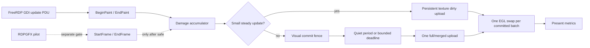

# RDP 官方帧边界对齐与刷新稳定性修复计划

> 日期：2026-07-28（Asia/Shanghai）
> 代码基线（实施前）：本地 `main` / `98180b927`
> 计划状态：P1 快速修复已实施；P0 真机验收待执行；P2/P3 未启动
> 本轮实施约束：只修改 RDP native damage accumulator 及对应 native 测试；不修改渲染器、连接、认证、其他通道或其他协议

## 0. 目标与完成定义

### 0.1 用户问题

RDP 连接整体流畅，但首次进入桌面、Windows 登录后的桌面加载、浏览器或文件管理器大面积刷新时，画面会像 CRT 显示器一样出现明显的横向逐行扫描。

当前有线 `hdc` 复现已经排除了“无线链路不稳定”这一主因：TLS/RDP 传输和 EGL/GL 交换能够正常完成，但连续的刷新条带被过早提交到屏幕，导致用户看到中间态。

### 0.2 目标

- 首帧和大面积刷新不再把连续条带逐批直接显示到屏幕。
- 小范围光标、工具栏、拖动和输入反馈仍保持低延迟 dirty-rect 路径。
- 不改变 RDP 连接、认证、TLS、证书、输入、剪贴板、音频、驱动通道、重连、缩放或会话生命周期语义。
- 不改变 RustDesk、SSH/SFTP、VNC 或共享云同步/设置 owner。
- RDPGFX/H264 只作为独立的、可回退的后续阶段，不与本次 GDI 修复捆绑强制开启。

### 0.3 完成定义

只有同时满足以下条件，计划才算完成：

1. 首次进入桌面、Windows 登录桌面加载、浏览器整页刷新和文件管理器大刷新无持续可见扫描带。
2. 小范围持续更新不会被过度延迟；稳态输入延迟、帧率和 CPU/内存占用不劣于当前基线。
3. RDP 断线、重连、后台/前台、Surface 重建、分辨率变化和取消连接没有旧帧污染、死锁或崩溃。
4. RDPGFX 未通过单独的生命周期和解码器门禁前，GDI fallback 始终可用；GFX 试验失败时连接仍可回退到 GDI。
5. native 测试、ArkTS 编译、HAP 构建、合规检查和真机验收均有当前提交的证据；旧日志不能替代当前验收。

## 1. 当前基线与根因边界

### 1.1 已完成的基线，不在本计划中重复改写

以下提交视为本计划的现有基线，实施阶段先安装和验证对应 HAP，再决定是否需要继续改动：

- `97f3b0085`：RustDesk Pro 会话传递和 RDP 初始视觉提交边界。
- `9eb1d7722`：扩大宽条刷新识别并保持短暂 burst continuation。
- `9fc3d8fcb`：合并持续刷新 burst，保留 `full`、`dirty`、`deferred` 展示指标。

当前工作树已有用户-owned 的 VNC 修改和 VNC 计划文件；它们不属于本计划，实施前必须继续原样保留，不能暂存或提交到 RDP 任务中。

### 1.2 当前运行路径

当前日志表明：

- RDP 采用 `mode=gdi`。
- `SupportGraphicsPipeline=false`、`GfxH264=false`，没有使用 RDPGFX 的 `StartFrame/EndFrame` 协议帧边界。
- FreeRDP GDI 更新经过 `BeginPaint/EndPaint`，随后进入本项目的 damage accumulator、快照队列和 GL 上传/交换线程。
- 有线复现中大量 snapshot 被替换，EGL/GL 没有 surface rejection 或 detach；问题位于“刷新批次到显示提交”的边界，而非 hdc 连接质量。

### 1.3 根因假设

根因按优先级排列如下：

1. GDI fallback 没有协议级完整帧边界，大面积刷新由多个局部 update PDU 组成。
2. 局部 dirty 区域在页面刷新尚未结束前被提交，用户看到连续的中间条带。
3. 快照复制、单槽 latest-value-wins 队列和 GL swap 的节奏没有完全形成“更新批次只提交一次”的语义。
4. RDPGFX 的真实帧边界、surface invalid region 合并和 Frame Acknowledge 当前没有参与运行路径。

本计划不把“提高网络带宽”“盲目打开 AsyncUpdate”“强制打开 H264”当作根治方式。

## 2. 官方 FreeRDP 依据与采用结论

### 2.1 RDPGFX 的官方帧边界

官方 RDPGFX 客户端以 `StartFrame` 开始记录帧，以 `EndFrame` 结束帧并发送 `FRAME_ACKNOWLEDGE`；GDI graphics pipeline 在 GFX frame 内合并 surface 的 invalid region，并在 `EndFrame` 时统一执行 `UpdateSurfaces`：

- [FreeRDP `rdpgfx_main.c`](https://github.com/FreeRDP/FreeRDP/blob/master/channels/rdpgfx/client/rdpgfx_main.c)
- [FreeRDP `libfreerdp/gdi/gfx.c`](https://github.com/FreeRDP/FreeRDP/blob/master/libfreerdp/gdi/gfx.c)
- [FreeRDP `update.h`](https://github.com/FreeRDP/FreeRDP/blob/master/include/freerdp/update.h)

采用结论：RDPGFX 的 `EndFrame` 可以作为真正的“协议帧完成”信号，但它不能直接替代 OHOS GL renderer 的线程安全、Surface generation 和一次性 Present 设计。

### 2.2 官方客户端的持久化画布模式

FreeRDP SDL3 客户端使用持久化纹理和 render target，只上传 dirty rect，把多个 dirty rect 绘制完成后再 Present；这比每个条带都刷新一次屏幕更接近本项目需要的 OHOS 实现：

- [FreeRDP SDL3 context](https://github.com/FreeRDP/FreeRDP/blob/master/client/SDL/SDL3/sdl_context.cpp)
- [FreeRDP SDL3 window](https://github.com/FreeRDP/FreeRDP/blob/master/client/SDL/SDL3/sdl_window.cpp)

采用结论：GDI fallback 也应保持持久化显示缓冲，并将“上传脏区”和“交换到屏幕”严格分开；一批更新只允许一次成功的 Present。

### 2.3 AsyncUpdate 不能作为默认修复

FreeRDP 官方曾记录异步更新丢失、旧内容残留的问题，后续变更记录中停用了 AsyncUpdate：

- [FreeRDP issue #10153 — Some asynchronous updates lost](https://github.com/FreeRDP/FreeRDP/issues/10153)
- [FreeRDP ChangeLog](https://github.com/FreeRDP/FreeRDP/blob/master/ChangeLog)

采用结论：不得用通用 `+async-update` 掩盖提交边界问题；如需解耦协议线程和渲染线程，只能使用有界、可统计、不会丢失更新的本地队列。

### 2.4 官方路径不是“识别浏览器整页刷新”

FreeRDP 不会识别“浏览器刷新”这一页面语义。它依靠 RDPGFX 帧边界，或者在 GDI fallback 中依靠 update PDU/EndPaint 批次。因此 GDI 模式下允许渐进显示是协议能力的一部分；本项目要消除用户可见的扫描带，必须在本地增加受控的视觉提交策略，而不是假设 FreeRDP 会自动等待整页结束。

## 3. 变更范围与隔离门

### 3.1 允许触碰的最小范围

实现阶段只允许在确认必要后修改下列 RDP native 文件和对应 native 测试：

| 范围 | 允许用途 |
| --- | --- |
| `entry/src/main/cpp/rdp/rdp_visual_commit_policy.h` | 纯策略：刷新 burst 判断、quiet period、最大等待、continuation window |
| `entry/src/main/cpp/rdp/rdp_damage_accumulator.h/.cpp` | 合并 dirty 区域、快照提交边界、失败时保留 pending 状态 |
| `entry/src/main/cpp/rdp/rdp_frame_pump.h/.cpp` | 有界队列、替换统计、deferred/full/dirty 展示和线程间提交 |
| `entry/src/main/cpp/render/gl_renderer.h/.cpp` | 仅在证据证明需要时，保持持久化纹理、dirty upload 和一次 EGL swap |
| `entry/src/main/cpp/rdp/freerdp_adapter.h/.cpp` | 仅用于 RDP GDI/GFX feature gate、帧边界回调和诊断；不得改变认证、连接或通道配置 |
| `entry/src/main/cpp/test/rdp_*_test.cpp` | 策略、队列、坐标、生命周期和失败路径测试 |

如果只靠现有 GDI fence 和 renderer 即可消除扫描带，不得扩大到 FreeRDP 子模块或 ArkTS/N-API。

### 3.2 明确禁止触碰的范围

- `entry/src/main/ets` 的 RDP UI、全局设置、连接参数和用户偏好；本计划不增加用户可见开关。
- RustDesk API、地址簿、relay、Pro token、Rust FFI 和 RustDesk native 目录。
- SSH/SFTP、VNC、`RemoteHost`、云同步表、加密表和共享设置 owner。
- RDP 的 NLA、TLS、证书验证、用户名/密码、重连、输入、鼠标、键盘、剪贴板、音频、驱动通道和文件重定向。
- FreeRDP gitlink、codec 版本、FFmpeg/OpenH264/Opus/OpenSSL/libssh2 依赖；本计划不升级依赖。
- EGL context 创建、Surface 生命周期所有权模型；除非专项复核确认 renderer 修改不会改变现有 generation/attach/detach 语义。

### 3.3 兼容性和开关规则

- GDI 视觉提交策略是唯一 P0 修复路径；默认必须保持当前已验证的 GDI 行为。
- RDPGFX 试验必须有 RDP 专用 feature gate，默认关闭，不落入全局用户设置，不写入云端。
- GFX/H264 未通过解码器、动态分辨率、Surface 重建、重连和压力测试前，不得改变生产默认值。
- 任意策略判断失败、内存分配失败、GL upload 失败或 Surface generation 失效，都必须保留连接和现有 fallback 能力，不得把显示优化失败升级成 RDP 断线。
- 不引入“GFX 失败后自动改变用户配置”的隐式降级；只允许在当前连接内安全回退到 GDI，并记录非敏感原因。

## 4. 目标数据流



核心不变量：

1. FreeRDP 协议线程不直接执行 EGL swap。
2. 一批更新可产生多个 upload，但最多产生一个屏幕提交。
3. deferred snapshot 被替换时，旧快照不得污染新 Surface generation。
4. full-frame copy/upload 失败时，pending visual fence 不能被错误清空。
5. 小范围更新不能因为一次大刷新把 quiet period 无限延长。

## 5. 分阶段执行计划

### 阶段 P0：安装当前基线并建立非回归数据

**目的：** 先判断当前已提交的 GDI fence 是否已经解决用户设备上的问题，不在未安装验证前继续扩大改动。

- [ ] 使用当前 HEAD 生成的确切 signed HAP 安装到有线 `hdc` 设备；记录 HAP 路径、版本和安装时间。
- [ ] 采集一次基线日志，确认 `mode=gdi`、GFX/H264 开关、Surface generation、`RDP-PRESENT` 的 `full/dirty/deferred` 计数。
- [ ] 复现：首次进入、Windows 登录桌面、浏览器刷新、文件管理器刷新、窗口拖动、视频、滚动、窗口调整大小。
- [ ] 保存只含尺寸、模式、计数和耗时的脱敏摘要；不保存地址、账号、密码、token、主机名或原始屏幕内容。
- [ ] 如果扫描带消失，仅完成验收，不新增代码。
- [ ] 如果仍存在扫描带，使用日志确定是“分类漏检”“队列泄漏”“全帧复制过多”还是“renderer 多次 swap”，再进入 P1；禁止凭感觉调大等待时间。

**退出门：** 形成当前 HAP 的真机基线表；没有基线证据不得进入 P1。

### 阶段 P1：GDI fallback 的最小安全修复

**目的：** 只修复当前生产路径中的视觉提交边界，不改变 RDP 连接和其他通道。

- [ ] 保留现有小 dirty 更新快速路径；光标、工具栏和局部输入反馈不能进入长时间 fence。
- [ ] 对中等宽度/高度条带、连续相邻条带和全宽/全高刷新进行受控 burst 合并；分类依据必须是矩形数量、覆盖率、方向、时间连续性和当前 Surface 尺寸的组合。
- [ ] 为每次 burst 设置有限 quiet period、最大等待和 continuation window；所有数值写入纯策略头文件并用单元测试覆盖。
- [ ] deferred 期间禁止 EGL swap；允许新 snapshot 替换旧 snapshot，但不能丢失“仍有 pending 更新”的状态。
- [ ] full snapshot 只在成功复制后清理 accumulator；内存分配或复制失败必须保留 pending 状态并走可诊断 fallback。
- [ ] 保持现有 top-left `dirtyY` 坐标契约；除非上下纯色条带测试证明错误，否则不改坐标方向。
- [ ] 日志区分 `dirty`、`full`、`deferred`、`replaced`、`presented` 和失败原因，采样限流，避免每个条带刷屏。

**P1 禁止项：** 不修改 `freerdp_connect` 参数、不改认证/证书、不改输入和通道、不打开 GFX/H264、不增加 ArkTS 开关。

### P1 快速修复实施记录（2026-07-28）

- 已在本地 `main` 提交 `46e996e36 fix(rdp): fence narrow refresh continuations safely`。
- 实际修改仅限：`entry/src/main/cpp/rdp/rdp_damage_accumulator.h/.cpp` 和 `entry/src/main/cpp/test/rdp_damage_accumulator_test.cpp`。
- 窄条延续判定使用当前帧尺寸的 8% 长度、至少 2px 厚度和不超过 12% 厚度；只有已有真实 broad/medium refresh burst 或已提交的 burst continuation 才能触发，首次全量同步本身不会开启延续尾窗。
- 初始全帧后的普通窄条保持 dirty-only；新增测试覆盖 8%/2px 下界、两轴均超过 12% 的负例、刷新 burst 后的横向窄条、游标和首次全帧后的低延迟路径。
- 本次验证：native `150 passed, 0 failed`；`default@OhosTestCompileArkTS` 通过；`assembleHap` 通过；Light open-source compliance 通过；`git diff --check` 通过。
- 当前签名产物：`entry/build/default/outputs/default/entry-default-signed.hap`。
- 独立只读复核已完成：未发现 P0 或跨模块越界；复核提出的窄条误判风险和测试覆盖缺口已在本记录对应提交中处理。
- 真机验收仍未完成：当前 `hdc` 返回 `Connect server failed`，无法安装此 HAP 或采集新一轮首帧/大刷新日志；不能以本地构建结果代替真机结论。
- 未启用 RDPGFX/H264，未修改 renderer、frame pump、FreeRDP 连接参数、认证、输入、音频、RustDesk、SSH/SFTP、VNC 或共享同步。

### 阶段 P2：对齐官方 SDL3 的持久化渲染模式

**触发条件：** P1 后仍有扫描，或日志证明主要损耗来自重复全帧复制/上传，而不是 burst 分类。

- [ ] 保留一个与当前 Surface generation 绑定的持久化画布/纹理；不要让每个 update PDU 创建新 GL 资源。
- [ ] 将 dirty rect 上传到持久纹理或渲染目标，最后一次性提交；禁止在 dirty rect 循环内调用 `eglSwapBuffers`。
- [ ] 将协议线程、快照/队列线程和 EGL 线程的锁边界写成不变量，避免在 FreeRDP callback 内执行长时间全帧复制。
- [ ] Surface detach、resize、recreate 时递增 generation 并清理旧纹理/队列；旧 generation 的快照只能丢弃，不能显示到新 Surface。
- [ ] 对上传、绘制、swap 分别计时；任何一次 Present 失败只影响该帧，不得关闭 RDP session。
- [ ] 保留当前 dirty-only fallback；如果持久化纹理初始化失败，回退到当前已验证的 renderer 行为并记录原因。

**退出门：** 在无扫描带的同时，steady-state 输入延迟和帧率不得超过基线允许范围；P2 不改变 RDP 协议协商。

### 阶段 P3：RDPGFX 官方帧边界试验（独立任务）

**目的：** 学习并接入官方的协议帧边界，不把它冒充成 P1/P2 的必要条件。

- [ ] 增加仅限 RDP 的实验 gate，默认关闭；不写入 usersettings、云端或跨协议配置。
- [ ] 在 FreeRDP GFX callback 中记录 `StartFrame(frameId)`、surface 更新数量、invalid region 总面积、`EndFrame(frameId)`、解码耗时和提交耗时。
- [ ] 只在 `EndFrame` 后把该帧的 surface dirty region 交给 renderer；Frame Acknowledge/QoE ACK 的发送与显示提交结果分开记录。
- [ ] 验证 GFX codec 实际可用性、OpenH264/FFmpeg/平台 decoder 生命周期、动态分辨率、Surface 重建和重连。
- [ ] 如果 GFX callback、decoder 或 surface lifecycle 任一项失败，当前连接回退 GDI；回退不能重试认证或改变用户配置。
- [ ] 仅在 P3 全部真机门通过后，另行评审是否更改生产默认协商；本计划不授权直接打开 `SupportGraphicsPipeline` 或 `GfxH264`。

### 阶段 P4：回归、灰度与发布

- [ ] 在 1080p、2K、4K 以及低/高 DPI 设备分别验收。
- [ ] 进行连接建立、断开、重连、后台/前台、锁屏/解锁、Surface 重建、分辨率切换和快速取消测试。
- [ ] 做 RDP 功能回归：NLA/TLS、证书错误、密码错误、键鼠输入、剪贴板、音频、驱动通道、文件重定向、缩放和多显示器（若当前版本支持）。
- [ ] 做协议隔离回归：RustDesk Pro、SSH/SFTP、VNC 的连接和设置读取不受影响；不得因为 RDP 日志或策略异常阻塞其他协议。
- [ ] 先小范围灰度，默认保留 GDI fallback；出现扫描、错位、卡顿、输入延迟或 Surface 崩溃时关闭实验 gate 或回退到上一 RDP 提交。

## 6. 测试与验收矩阵

### 6.1 Native 单元测试

| 测试组 | 必须覆盖 |
| --- | --- |
| `rdp_visual_commit_policy` | 小 dirty、宽条、窄条、连续条带、静默提交、deadline 提交、continuation window 上限 |
| `rdp_damage_accumulator` | dirty union、全帧 snapshot、替换、复制失败后 pending 保留、不同 stride/尺寸 |
| `rdp_frame_pump` | latest-value-wins、有界队列、deferred 不 swap、单批次单提交、取消和 generation 丢弃 |
| renderer contract | top-left 坐标、上下纯色条带、纹理尺寸变化、upload/swap 失败、Surface 重建 |
| GFX pilot（独立） | Start/End frame 配对、frameId、ACK 统计、异常结束、回退 GDI |

### 6.2 真机验收

每个场景都记录：首帧时间、可见扫描结论、`deferred/full/dirty/presented/replaced` 计数、p95 Present 耗时、输入反馈和连接状态。

- 首次进入远程桌面。
- Windows 登录后的桌面和任务栏加载。
- 浏览器整页刷新、滚动和多标签切换。
- 文件管理器打开目录、大图标/列表切换和窗口最大化。
- 拖动窗口、调整窗口大小和系统菜单展开。
- 视频播放、快速滚动和连续光标移动。
- 1080p/2K/4K，横竖屏或 Surface 重建（设备支持时）。
- 有线 hdc 下重复三次，避免把无线变量混入结论。

### 6.3 非回归门槛

- RDP 连接成功率不低于当前基线。
- 稳态输入 p95 延迟不高于基线一个显示帧以上；如设备测量能力不足，至少不得出现主观可见的输入滞后。
- 稳态帧率不低于基线 5%；CPU、内存和 native queue 不得持续增长。
- 首帧/大刷新最多等待有限 deadline，不得无限等待或造成“连接成功但黑屏”。
- 任何 RDP 优化异常不得导致其他协议、共享设置、云同步或 RustDesk Pro 会话失效。

## 7. 验证和提交门禁

实现阶段每个代码 checkpoint 必须只暂存 RDP allowlist 和对应测试；不能使用 `git add -A`，不能带入当前 VNC 用户变更。

必须执行并记录当前提交的：

```sh
source scripts/macos_env.sh
hvigorw --mode module -p module=entry -p product=default default@OhosTestCompileArkTS --analyze=normal --parallel --incremental --no-daemon
hvigorw --mode module -p module=entry -p product=default assembleHap --analyze=normal --parallel --incremental --no-daemon
```

此外要求：

- RDP native focused tests：当前目标全部通过，记录 `passed/failed` 数量。
- `git diff --check`：通过。
- Light open-source compliance：通过。
- 如修改 native/codec/FreeRDP provenance：补充 ABI、SBOM、NOTICE、provenance 和哈希验证；本计划默认不改依赖，因此默认不触发依赖变更。
- `ohosTest@OhosTestCompileArkTS` 若未注册，必须记录实际环境 blocker，不能写成通过。
- 真机证据必须来自安装了当前 HAP 的设备；不能使用旧版本日志代替。

## 8. 回滚方案

### 8.1 P1/P2 GDI 回滚

按单个 RDP 提交回滚到上一个已验证提交，保留 RDP 连接和其他协议不变。若只出现视觉问题，优先关闭新 visual-commit 策略或恢复 dirty-only renderer，不回滚认证、通道或共享模块。

### 8.2 P3 GFX 回滚

- 实验 gate 关闭后继续使用 GDI，不清除用户配置，不修改云端，不要求重新登录。
- GFX decoder、callback、Surface 或 ACK 异常只能导致当前连接回退或提示连接能力不足，不得自动改变下一次连接设置。
- GFX 相关代码必须保持独立提交，便于只回滚 GFX 而保留已经验证的 GDI 修复。

### 8.3 数据与安全回滚

本计划不新增数据库表、字段、token、密码、用户设置或持久化开关，因此回滚不需要迁移、清理云端数据或处理旧版本数据。

## 9. 风险清单与决策点

| 风险 | 防护 | 进入下一阶段的条件 |
| --- | --- | --- |
| quiet period 过长导致卡顿 | 明确 deadline，区分小更新和 burst | 首帧/输入延迟满足门槛 |
| medium band 误判导致光标延迟 | 使用方向、面积、连续性组合；保留 dirty fast path | 光标/工具栏场景不进入长 fence |
| full snapshot 内存压力 | 有界队列、复用 buffer、复制耗时统计、失败保留 pending | 4K 压测无持续增长 |
| GL 坐标翻转 | 上下纯色条带测试，保持现有 top-left contract | 无上下错位 |
| Surface 重建显示旧帧 | generation 绑定和旧队列丢弃 | 后台/前台、旋转、resize 通过 |
| GFX decoder 不稳定 | gate 默认关闭，独立测试和 GDI fallback | 所有 GFX 生命周期场景通过 |
| AsyncUpdate 丢更新 | 不启用通用 AsyncUpdate | 无需该开关也满足目标 |
| 修改范围扩散到其他协议 | allowlist、独立提交、diff review、协议回归 | diff 无越界文件 |

## 10. 计划执行检查清单

### 实施前

- [ ] 用户 VNC 未提交变更已识别并原样保留。
- [ ] 当前 HAP 已安装并完成 P0 复现。
- [ ] 当前分支、HEAD、工作树和活动任务已记录。
- [ ] 只建立 RDP 任务分支；不得与其他活动任务共用分支或 worktree。

### 实施中

- [ ] 每个 checkpoint 只包含 RDP allowlist 文件和对应测试。
- [ ] P1 GDI、P2 renderer、P3 GFX 分开提交和验证。
- [ ] 没有改认证、连接参数、输入、剪贴板、音频、RustDesk、SSH、VNC 或云同步。
- [ ] 任何性能优化失败都有不影响连接的 fallback。

### 交付前

- [ ] Native focused tests 通过。
- [ ] `default@OhosTestCompileArkTS` 通过。
- [ ] `assembleHap` 通过。
- [ ] `git diff --check` 和 Light compliance 通过。
- [ ] 真机矩阵通过，证据来自当前 HAP。
- [ ] 子 agent 完成独立 diff/计划/验收复核，发现的问题已修复并重新验证。
- [ ] 回滚点、feature gate 状态和剩余 blocker 已写入 `docs/codex/CURRENT.md`。

## 11. 参考资料

- [FreeRDP 官方仓库](https://github.com/FreeRDP/FreeRDP)
- [FreeRDP RDPGFX client](https://github.com/FreeRDP/FreeRDP/blob/master/channels/rdpgfx/client/rdpgfx_main.c)
- [FreeRDP GDI graphics pipeline](https://github.com/FreeRDP/FreeRDP/blob/master/libfreerdp/gdi/gfx.c)
- [FreeRDP SDL3 context](https://github.com/FreeRDP/FreeRDP/blob/master/client/SDL/SDL3/sdl_context.cpp)
- [FreeRDP SDL3 window renderer](https://github.com/FreeRDP/FreeRDP/blob/master/client/SDL/SDL3/sdl_window.cpp)
- [FreeRDP asynchronous update loss issue](https://github.com/FreeRDP/FreeRDP/issues/10153)
- [FreeRDP compilation and codec options](https://github.com/FreeRDP/FreeRDP/wiki/Compilation)

## 最终约束

本文件仍是分阶段实施计划：P1 GDI 快速修复已完成并有当前提交的本地验证证据，P0 真机验收仍待 `hdc` 恢复后执行；P2 renderer 对齐和 P3 RDPGFX/H264 试验尚未启动，也不能在生产环境打开。任何后续阶段都不得以牺牲 RDP 其他功能或其他协议稳定性换取画面效果。
