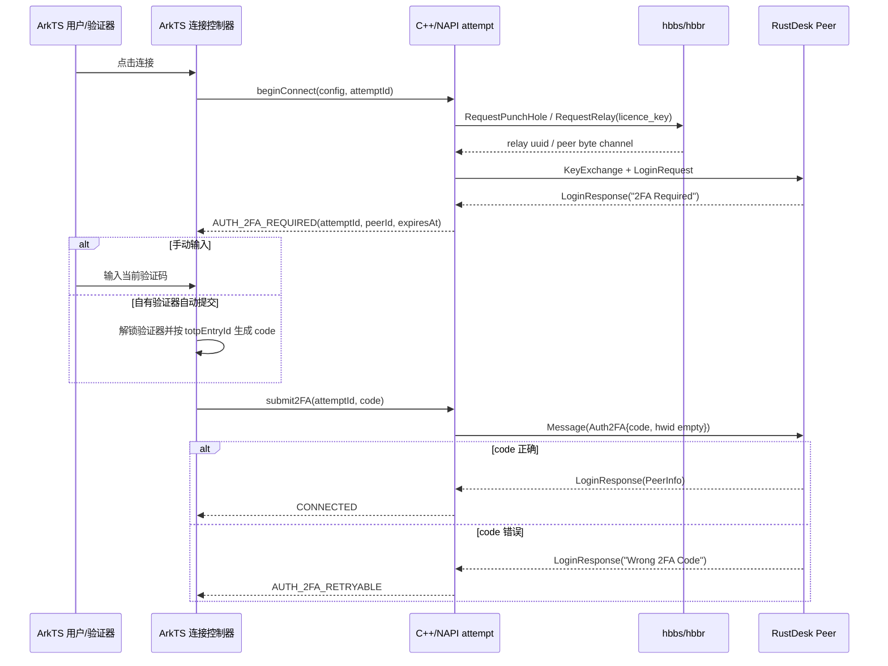

# RustDesk 中继/Peer 2FA 与 HarmonyOS 连接链路升级计划

> 计划日期：2026-07-28（Asia/Shanghai）
> 计划类型：架构、协议、产品逻辑、测试和发布门禁；本文件只定义升级方案，不代表本轮已经修改代码。
> 当前工作区：`codex/real-remote-cursor-shape`；项目实际目录为 `RemoteDeskHarmonyOS/`。
> 首要目标：解决用户反馈的“连接时中继报错、需要 2FA”问题，并评估自有 TOTP 验证器自动提交 RustDesk 2FA 的安全可行性。

## 1. 结论先行

### 1.1 首要根因判断

RustDesk 官方链路把两个概念分开：

1. **Rendezvous/Relay 阶段**：服务端校验 `licence_key`，匹配 relay UUID，然后转发 Peer 字节流；中继本身不计算 TOTP。
2. **Peer 登录阶段**：被控端在加密通道内返回 `LoginResponse(error = "2FA Required")`，控制端提交 `Auth2FA.code`，成功后才继续建立远程会话。

官方当前源码证据：

- RustDesk 服务端连接对象持有 `require_2fa`，发出 `2FA Required` 后保持连接；收到 `Auth2FA` 后校验 TOTP 并继续授权。[connection.rs](https://raw.githubusercontent.com/rustdesk/rustdesk/dabdbf73bb80f1718879fe879619d83c72103041/src/server/connection.rs)
- 官方 hbbr relay 只比较 `rf.licence_key`，匹配 UUID 后转发数据；源码没有 TOTP 登录流程。[relay_server.rs](https://raw.githubusercontent.com/rustdesk/rustdesk-server/master/src/relay_server.rs)
- 官方客户端将 `2FA Required` 和 `Wrong 2FA Code` 作为可继续交互的登录错误，而不是直接结束连接。[client.rs](https://raw.githubusercontent.com/rustdesk/rustdesk/dabdbf73bb80f1718879fe879619d83c72103041/src/client.rs)

因此，如果用户看到的原始错误确实是 `2FA Required`，当前最高概率根因是：**本地已经把 Peer 登录错误误归类为中继连接失败，但没有实现官方的“保持加密通道、提交 Auth2FA、再完成登录”状态机。**

这不是绕过 2FA，也不是修改 relay Key；应实现官方兼容的认证交互。

### 1.2 本地代码事实

本地 protobuf 已经定义了需要的线协议字段：

- `Auth2FA { code, hwid }`：[rustdesk_vendor/libs/hbb_common/protos/message.proto](../../rustdesk_vendor/libs/hbb_common/protos/message.proto#L97-L100)
- `Message.auth_2fa`：[rustdesk_vendor/libs/hbb_common/protos/message.proto](../../rustdesk_vendor/libs/hbb_common/protos/message.proto#L952-L984)
- `LoginRequest.hwid` 和 `LoginResponse.enable_trusted_devices` 也已存在。

但实现不完整：

- `session.rs` 仅在诊断函数里列出 `auth_2fa`，没有发送方法或认证状态：[rustdesk_ffi/src/protocol/session.rs](../../rustdesk_ffi/src/protocol/session.rs#L595-L641)
- `wait_login_response()` 对除请求批准特殊错误外的所有登录错误直接返回 `PermissionDenied`：[rustdesk_ffi/src/protocol/session.rs](../../rustdesk_ffi/src/protocol/session.rs#L521-L578)
- `rustdesk_connect_impl()` 阻塞到登录完成后才创建会话句柄；登录遇到 2FA 时返回空句柄：[rustdesk_ffi/src/lib.rs](../../rustdesk_ffi/src/lib.rs#L1013-L1026)、[rustdesk_ffi/src/lib.rs](../../rustdesk_ffi/src/lib.rs#L1142-L1300)
- C++/NAPI 暴露了连接状态和 last error，但没有提交 2FA 的 API：[rustdesk_bridge.cpp](../../entry/src/main/cpp/rustdesk/rustdesk_bridge.cpp#L23-L58)、[rdpnapi.d.ts](../../entry/src/main/ets/types/rdpnapi.d.ts#L33-L42)
- 普通连接页和 Server Pro 预认证都只等待 `CONNECTED`，不能停在可交互的 2FA pending 状态：[RemoteDesktop.ets](../../entry/src/main/ets/pages/RemoteDesktop.ets#L4570-L4605)、[HostListPage.ets](../../entry/src/main/ets/pages/HostListPage.ets#L3124-L3193)

### 1.3 自有 TOTP 自动提交结论

**技术上可行，但必须先完成手动 2FA，再做显式主机绑定。**

本地已有标准 TOTP 引擎，支持 RFC 6238、SHA1/SHA256/SHA512、6/8 位和 30/60 秒周期：[TotpEngine.ets](../../entry/src/main/ets/services/TotpEngine.ets#L424-L529)。RustDesk 官方当前设备 2FA 使用 TOTP；官方 `auth_2fa.rs` 当前构造为 SHA1、30 秒、服务端配置位数。[auth_2fa.rs](https://raw.githubusercontent.com/rustdesk/rustdesk/dabdbf73bb80f1718879fe879619d83c72103041/src/auth_2fa.rs)

自动提交的前提是：

- 用户已经把**同一个 RustDesk 被控端的 Secret**导入自有验证器；
- 主机与 TOTP 条目有明确绑定，不能根据 issuer、域名或 relay Key 猜测；
- 验证器已解锁或通过系统认证授权；
- 设备时间、服务端时间、算法、位数、周期和 Secret 一致；
- 跨 Rust FFI 边界只传一次性 code，不传 Secret、不传完整 TOTP 条目、不写日志。

Relay Key、RustDesk Pro access token、设备密码和 Pro 账号 2FA 都不能直接当作该设备 TOTP Secret。

### 1.4 计划的交付顺序

```text
错误分层与现场证据
    -> Peer 2FA 手动流程
    -> FFI/NAPI pending attempt 生命周期
    -> 普通连接与 Pro preflight 统一接入
    -> 自有 TOTP 显式绑定与自动提交
    -> 中继端口/force-relay/Key 诊断补齐
    -> 双 ABI、API 23 真机、官方多版本端到端验收
```

第一版不做 trusted device 自动信任、不绕过 Pro 账号认证、不迁移现有 TOTP 密钥存储格式。

## 2. 证据快照与版本基线

### 2.1 官方 RustDesk 快照

本计划使用 GitHub CLI 只读获取的官方源码快照：

| 项目 | 版本/对象 | 计划用途 |
|---|---|---|
| `rustdesk/rustdesk` master | `dabdbf73bb80f1718879fe879619d83c72103041`，GitHub CLI 查询时间 2026-07-28 | 服务端连接、客户端登录错误、2FA 行为基线 |
| `src/server/connection.rs` | blob SHA `353a06e4831a3c01649bb3e69d8aa770f72cea64` | `require_2fa`、`2FA Required`、`Auth2FA`、trusted device |
| `src/client.rs` | blob SHA `f711c227c72079eb7ba40a9f4096adbd305a47ea` | 官方错误分类与 2FA UI 触发 |
| `src/auth_2fa.rs` | blob SHA `1c243bc77646ba94b8c27682439a6dc49e4a7ccd` | TOTP 算法、Secret、位数与周期 |
| `rustdesk-server/src/relay_server.rs` | blob SHA `de1a7eae900cb35149e919a322b9690490e25c4c` | relay Key 校验和字节转发 |
| `rustdesk/hbb_common` main | `message.proto` blob SHA `8b213681149702a68c77798b3bdb0ec843f8231e`；`rendezvous.proto` blob SHA `b2e5c015725e028c7e58203b9872c8a21f3aec68` | 当前 wire schema 对比 |
| `rustdesk/rustdesk` 当前 submodule 指针 | `libs/hbb_common` 指向 `559176122bdd5c8afa4e8fd5b706c3d901fb0c15` | 是否更新本地协议快照的决策依据 |
| RustDesk issue #1031 | 已关闭，官方当时未规划 2FA 议题 | 仅作为历史背景，不作为实现规格：[issue #1031](https://github.com/rustdesk/rustdesk/issues/1031) |

本地 vendored 协议仍记录为 RustDesk `93d064a9...`、hbb_common `387603f...`，早于当前官方 master：[UPSTREAM.yml](../../rustdesk_vendor/libs/hbb_common/protos/UPSTREAM.yml)。协议更新必须做逐字段 diff、生成代码 diff、测试和合规更新，不能直接复制当前 master 覆盖旧快照。

### 2.2 鸿蒙官方文档基线

当前工具会话未暴露专门的 HarmonyOS 文档 MCP resource，项目本机也未发现共享的 `openharmony-docs-api23` 路径。因此本计划使用华为官方文档站链接作为 API 依据，并把 API 23 本地 reference 核验设为实现前门禁，不把不可验证的新 API 写进方案：

- HarmonyOS 官方文档中心：[文档中心](https://developer.huawei.com/consumer/cn/doc/?istab=1)
- ArkTS 官方入口，明确提供 TaskPool/Worker 并发 API：[ArkTS](https://developer.huawei.com/consumer/cn/arkts/)
- TaskPool 指南入口：[TaskPool](https://developer.huawei.com/consumer/cn/doc/harmonyos-guides-V5/taskpool-introduction-V5)
- User Authentication Kit：提供锁屏密码、人脸、指纹等本地用户认证：[User Authentication Kit](https://developer.huawei.com/consumer/cn/sdk/user-authentication-kit?ha_source=hms1)
- Asset Store Kit：针对短敏感数据提供安全存储和用户认证访问控制：[Asset Store Kit](https://developer.huawei.com/consumer/cn/doc/harmonyos-guides-V14/asset-store-kit-overview-V14)
- UIAbility 生命周期参考：[UIAbility](https://developer.huawei.com/consumer/en/doc/harmonyos-guides-V5/uiability-V5)

实现前必须在实际机器上定位并阅读 API 23 reference，确认：

- `@kit.ArkTS` TaskPool/Worker 的 API 23 可用性和 Sendable/跨线程限制；
- `@kit.UserAuthenticationKit` 调用方式、认证有效期、错误码和设备支持矩阵；
- `@kit.AssetStoreKit` 是否已纳入本项目目标 SDK，以及是否值得替换现有 `DataCrypto` 路径；
- UIAbility 前后台切换时 pending 连接、Dialog/Sheet 和生物认证回调的生命周期。

本期不因计划引入 API 26-only Kit；项目持续以 API 23 为兼容上限。

## 3. 现状、问题边界与非目标

### 3.1 三条独立认证链

| 链路 | 认证材料 | 发生位置 | 本期处理 |
|---|---|---|---|
| hbbs/hbbr relay | 公钥或共享 `-k` 文本，作为 `licence_key` | Rendezvous/Relay | 修复错误分层、端口和 Key 诊断；不把它当 TOTP |
| RustDesk Peer | 设备密码、请求批准、Peer TOTP | 加密 Peer channel | P0，增加官方兼容 `Auth2FA` 流程 |
| RustDesk Server Pro 账号 | `/api/login` 的账号登录、Token、服务端额外验证 | Pro HTTP API | 单独处理；不能拿 Peer TOTP 直接替代 |

当前 Pro API policy 在 `type = email_check` 时抛出 `two_factor_required`，但 service 只有一次 `/api/login` 请求，没有后续验证步骤：[RustDeskProApiPolicy.ets](../../entry/src/main/ets/services/RustDeskProApiPolicy.ets#L72-L95)、[RustDeskProApiService.ets](../../entry/src/main/ets/services/RustDeskProApiService.ets#L105-L109)。该问题不能和 Peer `Auth2FA` 合并实现。

### 3.2 中继实现中的次要风险

- `request_punch_hole` 固定设置 `force_relay=true`：[rendezvous.rs](../../rustdesk_ffi/src/protocol/rendezvous.rs#L56-L68)。这可以作为当前“优先复现中继”的策略，但也会掩盖直连路径问题；后续应增加明确的 `auto/direct/force_relay` 语义。
- `RustDeskRelayConfig` 保存 `relayPort`，但 host endpoint policy 主要把 `idServer/idServerPort` 传给 FFI：[RustDeskRelayConfig.ets](../../entry/src/main/ets/model/RustDeskRelayConfig.ets#L33-L44)、[RustDeskHostConfigPolicy.ets](../../entry/src/main/ets/services/RustDeskHostConfigPolicy.ets#L115-L132)。FFI `create_relay()` 默认连接 21117：[rendezvous.rs](../../rustdesk_ffi/src/protocol/rendezvous.rs#L351-L373)。如果 hbbs 返回的 relay endpoint 不含显式端口，自定义 relay 端口可能被忽略。
- `licence_key` 在本地同时兼容公钥和共享 Key：[rendezvous.rs](../../rustdesk_ffi/src/protocol/rendezvous.rs#L56-L79)。公共 Ed25519 key、hbbs/hbbr 共享 `-k` 和设备 TOTP Secret 必须在数据模型、UI 文案和日志中彻底分离。

这些问题可能造成真正的 relay failure，但不能解释 Peer 已返回 `2FA Required` 的情况；实现时必须用阶段化日志区分它们。

### 3.3 非目标

- 不通过控制端绕过远端 2FA、密码、权限或隐私模式。
- 不在本期自动启用 trusted device 或写入 `LoginRequest.hwid` 以跳过后续 2FA。
- 不把 relay Key、Pro Token、设备密码转换为 TOTP Secret。
- 不在本期重写整个 RustDesk core、视频编解码或中继服务端。
- 不在本期迁移现有 TOTP 数据库到 Asset Store；只评估并维持现有加密存储，另设安全迁移任务。
- 不在本期完成 RustDesk Pro 账号 `email_check` 的服务端私有协议猜测；必须先确认目标 Pro 版本的官方客户端/API 契约。

## 4. 目标架构

### 4.1 端到端 2FA 时序



### 4.2 Attempt 与 Session 分离

当前成功后句柄模型不适合交互式 2FA。目标模型：

```text
ConnectAttempt
  attemptId / generation
  transportStage
  peerId / relayEndpoint
  pendingAuth = none | remote_approval | peer_2fa
  deadline / cancellation
  sessionHandle?       // 登录成功后才填充

RemoteSession
  sessionHandle
  streaming / controls / disconnect
```

关键原则：

- `attemptId` 在登录完成前就存在，可取消、可观察、可提交 2FA；
- `sessionHandle` 只代表已认证可用的远程会话，不把半认证连接误暴露给控制输入；
- pending attempt 使用同一底层 CryptoChannel，不能因为收到 2FA 而重新申请 relay UUID；
- UI 页面销毁、重复连接、超时和后台切换都通过 generation 丢弃晚到回调。

## 5. 分阶段实施计划

### Phase 0：问题确认、错误分层和现场诊断（P0）

**目标**：在修改协议前确认用户反馈对应哪条链路，避免把 Pro 账号或 relay Key 问题误当 Peer 2FA。

- [ ] 为连接诊断定义阶段枚举：`rendezvous_connecting`、`relay_requesting`、`relay_tcp_connecting`、`peer_key_exchange`、`peer_login`、`peer_2fa_pending`、`pro_account_login`、`streaming`。
- [ ] 规范化错误分类和稳定错误码：`E-RUSTDESK-RELAY-KEY`、`E-RUSTDESK-RELAY-PORT`、`E-RUSTDESK-PEER-2FA`、`E-RUSTDESK-PEER-2FA-WRONG`、`E-RUSTDESK-PRO-2FA`、`E-RUSTDESK-TIMEOUT` 等。
- [ ] 日志只允许记录阶段、attemptId、peer ID 脱敏值、端点、Key mode、Key fingerprint；禁止完整 Key、密码、TOTP Secret、验证码和 Pro Token。
- [ ] 收集一次最小证据包：ArkTS last error、Native last message、Rust stage log、hbbs log、hbbr log、被控端 RustDesk log、Pro API HTTP status/type。原始日志留在设备，不进入仓库。
- [ ] 使用官方桌面客户端对同一 peer、同一 ID server、同一 relay、同一 Key 做对照连接：
  - 官方成功、本地出现 `2FA Required`：确认本地 Peer 2FA 缺口；
  - 官方也失败且 hbbr 报 invalid key：先修 relay Key；
  - Pro `/api/login` 返回 `email_check`：走 Pro 账号分支；
  - 仅自定义端口失败：验证 relay port 传递和 hbbs 返回 endpoint。
- [ ] 用当前 `force_relay=true` 路径先固定复现中继；之后增加直连/自动路径对照，不能用“直连成功”证明 relay 认证成功。

**完成标准**：每次失败都能回答“错误发生在 relay 之前、relay 建连、Peer 加密、Peer 登录、Peer 2FA 还是 Pro API”。

### Phase 1：RustDesk 协议快照与 wire 兼容门禁（P0）

**目标**：确认当前 `Auth2FA` 字段与官方当前协议一致，且升级不会破坏已有消息编号。

- [ ] 对比本地 `message.proto`/`rendezvous.proto` 与官方 hbb_common 当前 main；优先确认 `Auth2FA`、`LoginRequest.hwid`、`LoginResponse.enable_trusted_devices`、`RequestRelay.licence_key` 和 `force_relay` 字段。
- [ ] 如果 P0 手动 2FA 所需字段完全兼容，保留当前本地协议快照，只在代码和测试中引用既有生成类型；不要为功能修复顺带升级全部 protobuf。
- [ ] 如果必须升级协议，固定 RustDesk commit、hbb_common submodule commit、每个 proto 的 SHA-256，并同步：
  - `rustdesk_vendor/libs/hbb_common/protos/UPSTREAM.yml`
  - `rustdesk_vendor/libs/hbb_common/protos/NOTICE`
  - `docs/compliance/SBOM.spdx.json`
  - `docs/compliance/THIRD_PARTY_ARTIFACTS.sha256`
  - 相关 source provenance/license 记录
- [ ] 生成代码后检查 wire field number、oneof variant 和 Rust protobuf enum 没有非预期变化。
- [ ] 保留旧 RustDesk 设备兼容测试；当前 master 的协议更新不能自动等同于所有部署版本可用。

**完成标准**：协议 diff 可审计，`Auth2FA` 能在本地生成类型中序列化/反序列化，旧密码连接和请求批准测试不回归。

### Phase 2：Rust Session 实现 Peer 2FA 状态机（P0）

**目标**：在同一加密 Peer channel 上实现官方兼容的手动 2FA。

- [ ] 在 `SessionState` 增加至少 `WaitingPeer2FA`、`RetryingPeer2FA`、`Cancelled`、`TimedOut` 或等价内部状态；不要把 `2FA Required` 直接写成 `Error`。
- [ ] 增加 `send_auth_2fa(channel, code, hwid)`：构造 `Message_oneof_union::auth_2fa(Auth2FA)`，只发送 code；第一版 `hwid` 为空。
- [ ] 在 `wait_login_response()` 中识别官方稳定错误文本/分类：
  - `2FA Required`：设置 pending，保持 CryptoChannel 和 deadline；
  - `Wrong 2FA Code`：保持 pending，返回可重试事件，不断开；
  - `PeerInfo`：清理 pending，进入 Connected；
  - 其他错误：按分类结束 attempt。
- [ ] 2FA pending 时继续处理协议保活消息，如 `TestDelay`；不要发送 stream options，直到登录真正成功。
- [ ] 采用单调时钟 deadline；建议验证码交互总窗口 90 秒，具体值以官方兼容测试和产品体验定稿。
- [ ] code 输入校验只接受官方实际位数；禁止空字符串、超长字符串、非数字和无限重试。
- [ ] 当前登录请求的密码、审批、2FA 三者保持独立：
  - password：正常密码挑战；
  - request approval：空密码 + `No Password Access` 等待；
  - peer 2FA：登录错误后发送 `Auth2FA`。
- [ ] 直连模式和 relay 模式共用 Peer 2FA 状态机；2FA 不应被写在 relay 分支内部。
- [ ] File transfer、重连和未来 terminal/port-forward 入口复用同一登录函数，不能只修屏幕连接。
- [ ] 不在第一版处理 `enable_trusted_devices`/`hwid` 持久化；记录为后续安全设计。

**完成标准**：模拟 Peer 返回 `2FA Required` 时连接不关闭；提交正确 code 后收到 `PeerInfo` 并继续 stream options；错误 code 可有限重试；取消/超时能关闭底层资源。

### Phase 3：FFI、C++ Bridge 和 NAPI 交互式生命周期（P0）

**目标**：让 ArkTS 能在登录成功前观察并响应 2FA，而不是等待一个永远无法返回的同步 connect。

- [ ] 设计追加式 C ABI，不改变现有 `RustDeskConfig` 字段顺序；建议能力包括：
  - `rustdesk_begin_connect(...) -> attempt_handle`
  - `rustdesk_get_attempt_state(attempt_handle)`
  - `rustdesk_submit_2fa(attempt_handle, code, code_len)`
  - `rustdesk_cancel_attempt(attempt_handle)`
  - `rustdesk_take_session(attempt_handle)` 或让 begin 成功后通过事件发布 session handle
  - `rustdesk_destroy_attempt(attempt_handle)`
- [ ] 保留旧 `rustdesk_connect_v2` 兼容包装，内部可以复用新 attempt；密码-only 旧调用方不能因 ABI 增加字段而错位。
- [ ] 将 `on_disconnect` 扩展为可携带 attemptId/generation 的状态事件，或增加新的事件回调；C++ 不能只依赖全局 `rustdesk_last_error`，因为并发 attempt 会覆盖它。
- [ ] C++ Bridge 增加 `AUTH_2FA_REQUIRED`、`AUTH_2FA_RETRYABLE`、`AUTH_FAILED` 等状态，并将 detail 做脱敏。
- [ ] NAPI/`rdpnapi.d.ts` 增加强类型接口，避免 ArkTS 通过未声明的动态调用访问 native。
- [ ] `ExtensionLoader.ets` 统一包装 begin/submit/cancel/state 读取，并在页面退出时先 cancel attempt，再等待 teardown。
- [ ] 所有回调带 attemptId 和 generation；旧页面/旧连接的晚到 `CONNECTED`、`AUTH_2FA_REQUIRED` 和 `ERROR` 必须被丢弃。
- [ ] 连接线程继续在 native 后台运行；ArkTS 线程不执行阻塞 socket read，不用 TaskPool 代替 native socket 生命周期。
- [ ] 如果 TaskPool 仅用于 ArkTS 侧 TOTP 计算/轻量策略，必须先验证 API 23；避免把 C++ 指针、CryptoChannel 或 native handle 跨 TaskPool 传递。

**完成标准**：连接开始后能先拿到 attempt；收到 Peer 2FA 事件后 ArkTS 可提交 code；提交成功后得到正式 session；取消、页面返回、重复点击和超时均无资源泄漏或假连接。

### Phase 4：ArkTS 用户逻辑和两处入口统一（P0）

**目标**：普通连接、Server Pro preflight、文件传输和重连显示一致的认证状态。

- [ ] 抽出 `RustDeskAuthAttemptController` 或等价策略对象，统一管理 attempt、deadline、cancel、pending auth 和结果。
- [ ] `RemoteDesktop.ets` 增加 Peer 2FA sheet/inline 状态：
  - 标题明确写“远端设备要求 2FA”，不写“中继错误”；
  - 显示目标主机和倒计时；
  - 提供手动 code 输入、提交、重新生成、取消；
  - 错误 code 时保留当前 attempt；
  - 超时后提供“重新连接”而不是静默重试。
- [ ] `HostListPage.ets` 的 Pro preflight 不再把所有非 `CONNECTED` 都当最终错误；收到 2FA pending 时展示同一个认证流程，成功后再建立 preauthenticated session record。
- [ ] 普通主机、Pro 地址簿主机、文件传输和重连复用同一个 `RustDeskAuthMode`/attempt policy，避免入口行为不一致。
- [ ] UIAbility `onBackground/onForeground` 场景：
  - 后台期间不自动提交过期 code；
  - 恢复前检查 attempt 是否仍有效；
  - 若验证器页面/认证弹窗回调晚到，按 generation 丢弃；
  - pending relay socket 的存活策略必须由 native attempt 决定，不依赖 ArkTS 页面存活。
- [ ] 键盘输入 code 时禁止复制到系统剪贴板，或按 API 23/产品安全策略明确处理；日志和 crash message 不包含 code。

**完成标准**：普通 RustDesk 和 Pro preflight 都能完成手动 2FA；页面离开/恢复/重复点击不会把旧 attempt 显示为新连接。

### Phase 5：自有 TOTP 验证器的显式绑定和自动提交（P1）

**目标**：在手动流程验证成功后，安全地复用已有 TOTP vault 自动提交 Peer 2FA。

#### 5.1 数据模型

- [ ] 在 `RemoteHost` 增加可选字段：
  - `rustdeskTotpEntryId: string`：只保存 TOTP 条目 ID；
  - `rustdeskTotpMode: 'manual' | 'auto'`：默认 `manual`；
  - 可选 `rustdeskTotpAutoUnlock: boolean`：默认关闭，是否允许连接时弹出系统认证。
- [ ] `RemoteHostJSON`、云同步、备份、恢复和旧数据迁移支持缺省字段；旧主机默认不自动使用 TOTP。
- [ ] 绑定键优先使用本地主机 ID；展示和校验同时保存/比较 RustDesk peer ID（Pro 场景优先使用 `rustdeskProPeerId`，手工主机使用 `customHostname`/peer ID）。
- [ ] 不把 `TotpEntry.secret`、解密明文、当前 code 写进 `RemoteHost`、云表、备份、Pro host payload 或 FFI config。
- [ ] 条目删除、云端冲突、主机换 ID、relay 切换时清除或标记失效绑定，不能自动绑定另一个同名条目。

#### 5.2 绑定交互

- [ ] 第一次收到 `2FA Required` 时提供“手动输入”和“从我的验证器生成”两种选择。
- [ ] 用户选择条目并成功连接后，询问是否绑定到该 RustDesk 主机；默认不自动绑定。
- [ ] 绑定预览显示 issuer/account/条目 ID 的脱敏信息、peer ID 和 relay fingerprint；不显示 Secret。
- [ ] 相同 issuer 不足以证明同一设备；必须由用户确认。
- [ ] 更换主机密码、relay、Pro 账号或 peer ID 时不自动沿用绑定，除非稳定 peer ID 仍一致并且用户确认。

#### 5.3 自动提交流程

- [ ] 只在 native 明确报告 `AUTH_2FA_REQUIRED` 后生成 code，不在连接开始前预生成。
- [ ] ArkTS 先通过现有 `showLockGate`/User Authentication Kit 保护打开验证器；验证器页面锁定时不能静默读取 Secret。
- [ ] 通过 `CloudStore`/`DataCrypto` 读取并解密指定 `TotpEntry`，调用 `TotpEngine.generateCode()`，只把当前 code 传给 `submit2FA`。
- [ ] code 只存在于最短必要生命周期；提交后清空 ArkTS 临时变量、输入框和错误上下文，不写 hilog/last error/Crash dump。
- [ ] 若剩余时间不足以安全提交，重新生成下一个周期 code；不盲目多次提交。
- [ ] 首次自动提交失败转手动；`Wrong 2FA Code` 只允许有限重试，并提示检查设备时间、Secret、位数和算法。
- [ ] 默认不传 `hwid`，不启用 trusted device。另起安全评审后，才讨论设备级信任和撤销。

#### 5.4 HarmonyOS 安全约束

- [ ] 先按 API 23 reference 验证 User Authentication Kit 的可用接口和认证有效期；不能直接复制高 API 示例。
- [ ] 现有 `DataCrypto` 已对 TOTP Secret 做加密迁移；P0/P1 不改变数据库格式，避免把连接问题和密钥迁移绑在同一个发布风险中。
- [ ] 对 Asset Store Kit 做单独 ADR：短敏感数据和用户认证访问控制与官方能力匹配，但迁移会影响云同步、备份、重置和跨设备恢复；除非明确批准，不在本计划的 P0/P1 中切换。
- [ ] 任何跨 C++/Rust/ArkTS 边界都只传 code；Rust 侧不得增加 Secret 字段或日志打印。

**完成标准**：手动模式可用；用户明确绑定后自动模式只在匹配主机上生成一次 code；错误条目、锁定验证器、时间漂移和过期 code 都能回退手动且不泄漏 Secret。

### Phase 6：RustDesk Pro 账号 2FA 单独处理（P1/P2）

**目标**：避免把 Pro `/api/login` 的额外验证误当 Peer `Auth2FA`。

- [ ] 通过目标 RustDesk Server Pro 版本和官方客户端确认 `email_check` 的真实协议：是邮箱验证码、TOTP、Web challenge 还是其他步骤。
- [ ] 补充显式 `ProAccountAuthState`：`logged_out`、`password_pending`、`second_factor_pending`、`logged_in`、`expired`。
- [ ] 如果官方 API 有稳定的第二步 endpoint，按服务端版本实现请求/响应；如果没有公开契约，不猜测字段，不把 Peer `Auth2FA` 包直接发送到 Pro HTTP API。
- [ ] Pro 账号验证器条目和 Peer 设备条目分开绑定；不能因为同一用户名或同一 issuer 自动复用。
- [ ] Pro token 过期、地址簿同步失败和 Peer 2FA 失败分别显示，避免用户误以为 relay 已经拒绝 2FA。
- [ ] Pro preflight 成功后再写入 `ActiveRemoteSessionRegistry`；2FA pending 期间不写入已认证 session。

**完成标准**：Pro 账号的额外验证有独立状态和证据；Peer 连接的 `Auth2FA` 不承担 Pro 登录职责。

### Phase 7：中继端口、force-relay 和 Key 诊断修复（P1）

**目标**：修复真正的 relay failure，并使 relay 与 Peer 2FA 错误可并行诊断。

- [ ] 将 `relayServer + relayPort` 作为明确结构传入 Rust connector；不依赖默认 21117 猜端口。
- [ ] 统一端点模型：`idServerHost/idServerPort`、`relayServerHost/relayServerPort`、`directPeerHost/directPeerPort`、`forceRelay`，不要继续让通用 host/port 同时承载三种含义。
- [ ] `create_relay()` 使用明确端口；若 hbbs `RelayResponse.relay_server` 自带端口，显式端口优先并记录来源。
- [ ] 将 `force_relay` 改为配置策略：
  - `auto`：遵循官方 direct-first/relay-fallback 行为；
  - `force_relay`：用于复现和用户明确要求；
  - `direct`：仅在已有 direct endpoint 时使用。
- [ ] 保持 public key mode 和 shared access key mode 的严格区分；shared Key 按官方 `-k` 文本逐字比较，不做 Base64 规范化。
- [ ] relay handshake 失败时记录 hbbs/hbbr stage 和 `licence_key` fingerprint，不把它转换成 2FA 错误。
- [ ] 端口探测只报告 TCP 可达；不能把 TCP health test 当作 key、Peer 登录或 2FA 成功证明。

**完成标准**：自定义 relay 端口能够被实际使用；错误信息能明确区分 relay authentication、relay TCP、Peer key exchange 和 Peer 2FA。

## 6. 测试与验收矩阵

### 6.1 Rust 单元/协议测试

- [ ] `Auth2FA` protobuf 序列化、反序列化、`code` 和空 `hwid` 字段测试。
- [ ] Fake CryptoChannel：Peer 返回 `2FA Required` 后 channel 保持可读写。
- [ ] 正确 code：发送 `Auth2FA` 后收到 `PeerInfo`，继续发送 stream options。
- [ ] 错误 code：收到 `Wrong 2FA Code`，不关闭 channel，可限次重试。
- [ ] 2FA pending 期间 `TestDelay`/保活消息不导致误进入 Connected。
- [ ] timeout、cancel、socket close、重复 submit、旧 attempt code、late callback 测试。
- [ ] password、request approval、peer 2FA 三种模式组合测试。
- [ ] direct 和 relay 共享同一 Peer 2FA 流程测试。
- [ ] relay port explicit endpoint、默认 21117、IPv4、域名、括号 IPv6 测试。
- [ ] public key/shared key/license mismatch 分类测试。

### 6.2 C++/NAPI/ArkTS 测试

- [ ] ABI struct layout 测试，确认新增字段只追加且旧调用方默认值安全。
- [ ] attempt state event 顺序测试：`CONNECTING -> AUTH_2FA_REQUIRED -> SUBMITTING -> CONNECTED`。
- [ ] cancel/teardown/generation 测试，确认旧连接不会恢复成 CONNECTED。
- [ ] ArkTS policy 测试：TOTP entry 绑定只保存 ID，不输出 Secret/code。
- [ ] TOTP 条目删除、锁定、冲突、云同步恢复和主机 ID 变化测试。
- [ ] Pro preflight pending 2FA、成功后 session registry、失败清理测试。
- [ ] API 23 ArkTS strict mode 编译检查，禁止 `any`/未声明 NAPI/不兼容 Kit。

### 6.3 官方端到端矩阵

至少准备：

| 场景 | 预期 |
|---|---|
| 官方 Peer 开启密码、未开启 2FA | 原密码连接不回归 |
| 官方 Peer 开启 TOTP，正确手动 code | 中继和直连均连接成功 |
| 官方 Peer 开启 TOTP，错误 code | 可重试，不误报 relay failure |
| code 在周期边界过期 | 回退手动/重新生成，不无限重试 |
| 同一 relay Key 错误 | 明确 relay key 错误，不出现 2FA UI |
| hbbr 不可达/端口错误 | 明确 relay TCP/timeout |
| 自定义 relay port | 真实使用配置端口 |
| Pro 账号未登录/Token 过期 | Pro 登录提示，不误报 Peer 2FA |
| Pro `/api/login` `email_check` | 进入独立 Pro second-factor 流程或明确不支持 |
| 请求批准 + Peer 2FA | 观察官方实际优先级，禁止两个 pending 状态互相覆盖 |
| 直连模式 + Peer 2FA | 若远端协议支持，则与 relay 共用 Peer 2FA；否则明确版本能力 |
| 普通连接/Pro preflight/文件传输/重连 | 认证策略和错误分类一致 |

### 6.4 HarmonyOS 真机矩阵

- [ ] API 23 目标设备，至少 arm64；若发布仍包含 x86_64，补齐 x86_64 native build。
- [ ] 前台等待 2FA、后台 2FA、恢复前台、锁屏、页面返回、旋转/窗口变化。
- [ ] 生物识别成功、取消、失败、设备无生物识别、认证超时。
- [ ] TOTP 剩余 1 秒、网络延迟、系统时间偏移提示。
- [ ] 连接取消后 native thread、socket、CryptoChannel、relay 都已释放。
- [ ] 多次连续连接/断开/失败重试，无旧 attempt 回调污染。
- [ ] 两台设备共享云账号时，TOTP binding 只同步条目 ID 和主机绑定策略，不泄漏 Secret 或当前 code。

## 7. 安全、隐私和开源合规门禁

### 7.1 Secret/Code 处理

- [ ] TOTP Secret 只在已授权的 vault 解锁上下文中短暂明文存在。
- [ ] 只发送当前一次性 code；不把 Secret 放进 RustDeskConfig、C ABI、NAPI JSON、云同步 payload 或日志。
- [ ] `rustdesk_last_error`、Native message、UI error、Rust eprintln 和 Pro API preview 全部做敏感字段过滤。
- [ ] 不把 code 写入系统剪贴板、URI、备份、崩溃报告或截图测试产物。
- [ ] 自动提交默认关闭，用户必须明确绑定并开启；第一次自动提交前显示主机和验证器条目确认。
- [ ] trusted device/hwid 另做威胁建模、撤销策略和用户确认，不能作为 P0 顺手打开。

### 7.2 AGPL/依赖来源

如果只使用当前已 vendored 的 `Auth2FA` protobuf，不应引入新第三方依赖。若更新 RustDesk/hbb_common：

- [ ] 固定公开 commit、submodule、proto hash、Cargo lock 变化和 license。
- [ ] 更新 `UPSTREAM.yml`、`NOTICE`、SBOM、artifact hash、source offer/provenance。
- [ ] 检查是否把 RustDesk AGPL 代码/生成代码从 IPC 隔离边界扩大到产品 native；遵守项目现有 AGPL 网络源码和发布政策。
- [ ] 不提交签名文件、AGConnect secret、Token、真实 endpoint、设备日志和用户数据。

## 8. 构建、验证和交付门禁

本计划文件本身是仓库文档变更；按项目门禁仍需运行并记录：

```sh
cd RemoteDeskHarmonyOS
source scripts/macos_env.sh
hvigorw --mode module -p module=entry -p product=default default@OhosTestCompileArkTS --analyze=normal --parallel --incremental --no-daemon
hvigorw --mode module -p module=entry -p product=default assembleHap --analyze=normal --parallel --incremental --no-daemon
git diff --check
```

实现阶段额外要求：

```sh
cargo fmt --check
cargo test --lib --no-default-features
bash scripts/build_rustdesk_ffi_ohos.sh all
```

若协议/依赖/native/FFI 改动：

- [ ] arm64-v8a 与 x86_64 都完成 RustDesk FFI 构建；
- [ ] native 定向测试覆盖真实 FFI 和连接 attempt；
- [ ] `ohosTest@OhosTestCompileArkTS` 在任务注册后执行；若环境未注册，记录为 blocker，不写成通过；
- [ ] Light open-source compliance gate 通过；
- [ ] 按 D-020 要求由独立 reviewer 对照用户问题、计划、diff 和验证证据复核；
- [ ] 只有实现、双 ABI、真机和官方端到端矩阵完成后，才允许宣称“已解决中继/2FA 问题”。

## 9. 风险、决策点和阻塞项

| 风险/决策 | 影响 | 处理 |
|---|---|---|
| 当前 FFI connect 阻塞到登录成功 | 无法提交异步 2FA | P0 采用 attempt/session 分离；不在配置里预填一次性 code 作为长期方案 |
| 官方文本错误可能随版本变化 | 字符串匹配脆弱 | 保留官方常量映射、版本测试和稳定内部错误类；必要时同步 protocol response 语义 |
| hbb_common 当前 master 与本地快照不同 | 更新可能引入 wire/regression | P0 先字段兼容；任何升级做 hash/diff/generated code/provenance 门禁 |
| Pro `email_check` 私有协议不明确 | 不能安全猜测自动流程 | 先拿目标 Pro 版本官方客户端/API 证据；未确认前独立显示不支持 |
| API 23 reference 在当前机器不可定位 | 不能保证新 Kit/接口可用 | 实现前必须补齐本机 API 23 文档 blocker；不直接使用 API 26 示例 |
| 当前 force relay | 影响直连对照和官方 fallback 行为 | P0 保持可复现，P1 引入显式 force/auto/direct 策略 |
| relayPort 可能未传入 FFI | 自定义 hbbr 端口连接失败 | P1 先增加端口来源日志和测试，再改结构传递 |
| TOTP Secret 与主机绑定错误 | 误向错误 Peer 发送 code | 只允许显式用户绑定；不按 issuer/域名自动匹配 |
| 后台/锁屏期间 code 过期 | 自动提交失败或 UI 状态失真 | 以 native attempt deadline 为准，恢复前重新检查并回退手动 |
| 可信设备 hwid | 可能降低后续安全级别 | P0 明确不支持，另起安全评审 |

当前已知工作区阻塞：`CURRENT.md` 记录的活动分支与实际分支不一致，且工作区有已有未跟踪计划文件。实现任务开始前必须由负责人确认分支归属；本计划不切换、stash、reset 或覆盖这些用户文件。

## 10. 交付分批与完成定义

### Release A：诊断和手动 Peer 2FA

- 错误分层完成；
- relay/Peer/Pro 文案和错误码分开；
- 普通连接和 Pro preflight 都能显示 Peer 2FA pending；
- 手动 code 能通过同一 CryptoChannel 完成登录；
- 不支持 trusted device；
- 双 ABI 构建、定向测试和至少一台 API 23 真机通过。

### Release B：TOTP 显式绑定和自动提交

- 主机绑定只存 `totpEntryId`，旧数据兼容；
- vault 解锁/用户认证成功后才读取 Secret；
- 只传一次性 code，不产生日志或云端泄漏；
- 自动失败可安全回退手动；
- 错误绑定、删除条目、时间漂移和后台恢复有覆盖测试。

### Release C：Relay/Pro 完整性和体验补齐

- 自定义 relay port、force/auto/direct 语义和 Key fingerprint 诊断完成；
- Pro 账号 second factor 有真实服务端契约或明确支持边界；
- 文件传输、重连和其他认证入口复用一致 attempt；
- 官方多个 RustDesk 版本、服务端配置和真实 hbbr 环境验收通过。

## 11. 实施任务清单（建议顺序）

- [x] 负责人确认实际分支、当前未跟踪计划文件归属和本任务是否允许在现有活动分支落地。
- [ ] 建立现场错误分类和日志字段设计，不先改 UI 文案掩盖根因。
- [x] 固定官方 RustDesk/hbb_common 版本证据，完成 proto diff 和合规影响评估。
- [x] 实现 Rust Session 手动 Peer 2FA；补官方消息 oneof 序列化和 FFI code-format 测试。
- [x] 实现 attempt/session FFI/C++/NAPI contract；补取消和 generation 边界。
- [x] 接入 RemoteDesktop 普通连接和 HostList Pro preflight。
- [ ] 在真实 Peer + hbbr 上完成手动 2FA 端到端验证。
- [x] 增加 RemoteHost TOTP binding 字段和兼容扩展；默认 manual。
- [x] 接入现有 TOTP vault、API 23 User Authentication Kit 认证和 code-only FFI 提交。
- [x] 完成自动提交安全边界和失败回退实现；真实时间漂移/后台恢复测试待设备验收。
- [ ] 修复 relayPort/force-relay/Key diagnostics，并完成 Pro second-factor 单独评估。
- [x] 运行 Hvigor、HAP、Rust/native、双 ABI 和 diff 门禁；真机、ohosTest 任务注册和独立 reviewer 仍待外部/工具条件满足。
- [x] 更新共享状态文档、提交任务范围内文件；提交当前本地 main，远端交付不在范围内。

## 12. Implementation checkpoint (2026-07-29)

本次用户已明确允许在本地 `main` 上直接实现。按代码现状完成了 Release A，
并落地了 Release B 的显式 TOTP 绑定与 code-only 自动提交路径：

- Rust Session 识别官方 Peer 登录响应中的 `2FA Required` / `Wrong 2FA Code`，
  通过官方 `Message.auth_2fa(Auth2FA)` oneof 在同一加密通道重试；pending attempt
  有独立 epoch、超时和取消清理，不支持 trusted-device/hwid 自动信任。
- C FFI 增加 v3 auth callback、pending 2FA submission 和取消边界；C++/NAPI/ArkTS
  仅传递一次性数字 code，不把 TOTP secret 交给 native，也不写日志。
- 普通 RemoteDesktop 与 RustDesk Pro preflight 都支持等待、手动输入、错误重试、
  取消和超时；显式主机绑定只保存 `totpEntryId` 与自动提交开关，跨设备复用不携带
  TOTP secret。自动提交前使用已有系统认证 gate，失败回退手动输入。
- 新增 TOTP 发行方 Logo/首字母头像策略。真实 Logo 只使用发行方白名单映射到
  Simple Icons CDN slug，未知发行方、网络错误或用户选择首字母时使用固定高对比度
  本地首字母头像；`totpLogoMode` 进入个性化设置及可同步偏好。
- `RemoteHost`/display extension/CloudStore 保持兼容，不新增云表，不改变 RDP、SSH、
  VNC 数据 owner；RustDesk 2FA 绑定字段继续作为主机扩展字段保存。

本 checkpoint 已完成的本地验证：

- `cargo check --lib --no-default-features`：通过。
- `cargo test --lib --no-default-features`：145 passed, 0 failed。
- `bash scripts/build_rustdesk_ffi_ohos.sh arm64-v8a`：通过。
- `bash scripts/build_rustdesk_ffi_ohos.sh x86_64`：通过。
- `default@OhosTestCompileArkTS`：通过；仅有仓库既有依赖/弃用/权限警告。
- `assembleHap`：`BUILD SUCCESSFUL`；C++ native Ninja 构建通过。
- `git diff --check`：通过。

仍需真实环境验收后才能宣称端到端解决：真实 RustDesk Peer 开启/关闭 2FA、
hbbr 中继、错误码版本差异、TOTP 时间漂移/后台恢复、自动绑定安全提示，以及 API 23
设备上的 Logo CDN 离线回退和设置同步。`ohosTest@OhosTestCompileArkTS` 仍受项目任务
未注册（00306054）限制；本次没有把它写成通过。D-020 要求的独立 reviewer 工具在
当前 session 未提供，已完成自审，但独立复核仍是交付前门禁。
