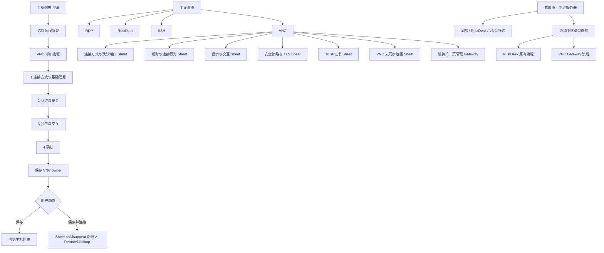

# VNC 设置、中继目录与 FAB 分步添加体验升级计划

> 计划日期：2026-07-28
> 状态：实施阶段；本地 `main` 已完成代码实现，尚未推送远端
> 适用仓库：`RemoteDeskHarmonyOS`
> 目标：在不影响 RDP、RustDesk、SSH/SFTP 的前提下，重新组织 VNC 的设置、第三页中继入口、官方图标和主机添加流程。

## 0. 本轮边界与最终决策

本轮已按本计划在用户明确授权的本地 `main` 上实施 ArkTS、测试和共享交接文档变更；不推送远端、不创建 PR、不合并远端 `main`。云表仍由用户在 AGC 部署，真机和真实 VNC 端点验收仍是外部门禁。

实施时必须继续遵守已经落地的 VNC 隔离边界：

- VNC 使用自己的 model、service、session、trust、secret 和 cloud projection。
- RDP 继续使用 `RemoteHost`、RDP credential 和现有 RDP 连接链路。
- RustDesk 继续使用 `RustDeskRelayConfig`、RustDesk account、RustDesk health 和自己的连接链路。
- SSH/SFTP 继续使用 SSH key、known-host trust、terminal 和文件传输 owner。
- VNC 不写 `remotehosts`、`rustdeskrelays` 或 `usersettings` 的协议业务字段。
- 云端只增加一张物理表：`vncrecord`。不创建 `vnc`、`vnchosts`、`vncgateways`、`vncsecrets`、`vncsettings` 或 `vnctrusts`。
- `vncrecord.recordtype` 继续承载 `settings`、`host`、`gateway`、`secret`、`trust` 五种逻辑记录。
- VNC password、Gateway access token 和私钥引用不能进入卡片、普通日志、普通备份或其他协议表的明文字段；mode12 的 target ID 是路由引用，不作为 secret 保存。
- UltraVNC Repeater 只开放已验证的 viewer `mode12`；`mode2` 保持 server-side listener 的不可用状态。
- WebSocket Gateway、公网 relay、SSH tunnel、reverse/listen 没有正式服务端契约和真实验收前，必须保持运行时 fail-closed。

本计划解决的是当前入口和体验断裂：VNC FAB 表单过密、VNC 设置整页过密、Gateway 被放在 VNC 设置而不是第三页、第三页只有 RustDesk、中继卡片缺少协议身份、协议图标来源不统一，以及这些 UI 变化可能对云同步和加密边界造成的回归风险。

## 1. 实施前基线与问题诊断

### 1.1 已有实现基线

| 区域 | 当前代码事实 | 问题 |
| --- | --- | --- |
| 主机 FAB（实施前） | `entry/src/main/ets/components/hostadd/VncAddFlow.ets` 把 transport、名称、地址、端口、用户名、密码、Gateway、TLS、只读、安全策略和保存动作放在一个 Scroll | 首次使用者需要同时理解连接拓扑、认证、加密、显示和数据保存；移动端滚动后容易遗漏前置项 |
| 协议选择 | `HostProtocolPicker.ets` 已能进入 VNC；现代和经典 FAB 最终都由 `HostListPage.ets` 交给 VNC flow | 入口一致，但 VNC flow 内部没有 RDP/RustDesk/SSH 那样的分步节奏 |
| VNC 设置（实施前） | `VncSettingsPage.ets` 同时包含连接显示、三个 timeout、TLS/安全策略、云同步 scope、主机、Gateway 和 trust | 责任不同的设置被放在同一长页，Gateway 管理和主机添加出现重复路径 |
| 中继第三页 | `HostListPage.ets` 的第三页挂载 `RustDeskRelayPage`；该页面 owner 只有 RustDesk | VNC Gateway 没有与 RustDesk relay 平级的统一目录，用户只能从 VNC 设置找到它 |
| 中继 FAB | `ResourceFabPicker(kind='gateway')` 当前只提供 RustDesk 中继 | “添加中继”无法选择 VNC Gateway |
| 中继卡片 | RustDesk 卡片以 RustDesk 数据模型和字段为中心 | 若直接塞入 VNC 字段会导致 owner 串线、敏感字段误显和语义混淆 |
| 图标 | 设置/Tab 有 `SymbolGlyph`，桌面侧栏和部分身份路径仍依赖 `icons/*.svg` | 同一协议在设置、Tab、FAB、主机卡片和中继卡片上不一定使用同一官方图标 |
| Sheet 生命周期 | `HostListPage.ets` 已有单一设置叶子 Sheet 和关闭/重入策略 | 新 VNC Sheet 必须沿用单宿主和 `onDisappear` 收尾，不能再叠加独立的嵌套 Sheet 状态机 |

### 1.2 当前用户体验风险

1. 用户在还没有选择连接方式时就看到密码、TLS、只读和安全策略，违反渐进披露。
2. Repeater 的 Gateway 地址、target ID 和 VNC server 地址容易被混为同一个“地址”。
3. 当前 VNC flow 仍有“用户名”字段，但现有 VNC V1 native 能力没有可靠的通用用户名认证契约；继续展示会制造虚假的能力预期。
4. `secure_only`、TLS 开关和 `allow_plaintext` 同屏时，用户容易形成互相矛盾的配置。
5. 把 Gateway 管理放在 VNC 设置页，导致“设置”和“资源目录”职责混合，也无法与 RustDesk 中继建立可比较的第三页体验。
6. 一旦为省事而复用 RustDesk relay model 或普通云表字段，VNC 的 token、状态和同步选择就可能泄露到其他协议。

## 2. 体验目标与人因原则

### 2.1 目标

- 新用户在每一步只做一个主要决策，并能知道下一步为什么需要该信息。
- 高风险操作（密码保存、明文连接、trust 确认、敏感云同步）晚出现、默认关闭、可解释且可撤销。
- 直连和 Repeater 的字段只在对应 transport 下出现，避免显示无关输入框。
- “保存”和“保存并连接”语义清楚；保存后再连接必须等待 Sheet 完全消失，不能触发双重连接。
- VNC Gateway 只在第三页作为一种中继资源出现；VNC 设置页提供跳转入口，不复制另一份 Gateway CRUD 表单。
- 卡片一眼能看出“RustDesk 中继”还是“VNC Gateway”，但不显示 token、密码或完整 trust 敏感信息。
- 所有新交互在 API 23 手机、Pad、PC/2-in-1 的断点下保持可读、可操作、无遮挡。

### 2.2 具体人因规则

- **先选择拓扑，再填写端点**：先决定 TCP 直连还是已配置 Gateway，再出现相应地址字段。
- **先完成可连接条件，再配置偏好**：认证和安全独立一步，显示和剪贴板放到下一步。
- **一次只暴露必要字段**：未选择 Repeater 时不显示 target ID；未选择 WebSocket 时不显示 path；未实现用户名认证时不显示用户名。
- **安全默认值保守**：只读开启、剪贴板关闭、敏感云同步关闭、mode12 可用、mode2 不可选、明文需要显式选择和二次确认。
- **错误贴近原因**：在对应步骤显示字段级错误；不把 native 错误、云同步错误和表未部署错误混成“保存失败”。
- **草稿可回退**：步骤间返回不得丢失已填内容；取消才丢弃草稿，且存在敏感内容时必须清理内存。
- **可预测的退场**：所有保存、跳转、删除和二次确认都由统一 Sheet 生命周期协调；不在 `onClick` 中直接同时关闭 Sheet 和路由。
- **显示能力与实际实现一致**：只有 native 已实现并测试的缩放、Raw/CopyRect、只读、剪贴板能力才可开启；未实现能力显示不可用原因，不显示假开关。

## 3. 总体入口和导航模型



### 3.1 设置顺序

设置页的协议设置顺序固定为：

```text
Windows RDP
RustDesk
SSH 终端
VNC
```

VNC 必须紧跟 SSH，不能再放入云同步数据内容、个性化内容或 RustDesk 中继内容中。通用账户、数据安全和个性化设置继续保留在自己的既有分组；VNC 只拥有自己的设置入口和逻辑 scope。

### 3.2 统一 Sheet 规则

- `HostListPage` 保留现有设置 Sheet 的单宿主、关闭延迟、防重入和 `onDisappear` 清理策略。
- `VncSettingsPage` 若作为独立 `@Entry` 页面承载叶子 Sheet，则只新增一个 VNC Sheet 宿主，并复用 `SettingsSheetRoutePolicy.ets`、`SettingsLeafSheetLifecyclePolicy.ets` 和 `SheetTransitionPolicy.ets` 的生命周期规则；不得为每个设置项分别增加一个 `bindSheet`。
- FAB 主机添加流程和第三页中继添加流程分别使用自己的单一 Sheet 宿主；同一个宿主内使用有限状态路由，不嵌套第二个 native Sheet。
- 手机使用 bottom sheet；Pad/PC 按 breakpoint 使用 center sheet。长内容只允许在 Sheet 内部 Scroll，标题、步骤指示器和底部动作区保持固定。
- `onWillDismiss` 只负责判断是否允许关闭、处理未保存草稿和阻止 busy 状态退场；最终状态清理、敏感内存清理和待处理路由均在 `onDisappear` 完成。
- 设置保存失败时保留当前草稿和错误；连接保存成功后只传递稳定 VNC host ID，不把密码或表单对象传入后续路由。

## 4. VNC 设置页重构

### 4.1 页面职责

`VncSettingsPage` 变成 VNC 设置目录和状态摘要页，不再把所有字段持续展开。页面首屏只显示：

- VNC 当前默认 transport、默认端口和安全状态摘要。
- “连接方式与默认端口”“超时与连接行为”“显示与交互”“安全策略与 TLS”“Trust/证书”“云同步范围”六个设置入口。
- 主机数量、Gateway 数量和 trust 数量的只读摘要。
- “管理 VNC 主机”和“前往中继服务器管理 VNC Gateway”两个明确的资源入口。
- crypto locked、cloud table unavailable、Gateway unavailable 等状态提示，但不显示密文、token 或完整证书内容。

### 4.2 叶子 Sheet 内容

| Sheet | 只放这些内容 | 明确不放 |
| --- | --- | --- |
| 连接方式与默认端口 | 默认 TCP 直连/已配置 Gateway、默认端口、默认 Gateway、Repeater mode12 能力说明 | 密码、剪贴板、trust、复杂 timeout |
| 超时与连接行为 | connect timeout、authentication timeout、first-frame timeout、自动刷新等当前已实现行为；逐项显示取值范围和默认值 | transport 端点、密码、云同步 scope |
| 显示与交互 | 只读默认值、缩放模式、文本剪贴板开关；显示 native 支持范围 | TLS、secret、Gateway token |
| 安全策略与 TLS | `secure_only`、`trusted_network`、`allow_plaintext`，TLS/安全协商状态，安全策略解释和失败回退规则 | trust 指纹列表、密码明文、云同步选项 |
| Trust/证书 | 已确认指纹的 redacted 列表、来源、确认时间、撤销/重新确认入口；新设备恢复后的再次确认 | 自动信任开关、完整证书链、私钥 |
| VNC 云同步范围 | `settings`、`hosts`、`gateways`、`secrets`、`trust` 五个逻辑 scope；物理表 `vncrecord` 状态；crypto gate 和风险确认 | 把五个逻辑 scope 误显示为五张云表 |

### 4.3 保存和状态策略

- 每个叶子 Sheet 保存自己的字段子集，但最终仍由 `VncSettingsService` 做完整 model 校验和事务性写入。
- 进入 Sheet 时保存原始快照；取消时恢复草稿，不写本地或云端。
- 关闭带未保存修改的 Sheet 时使用 `onWillDismiss` 阻止直接丢弃，提供“继续编辑 / 放弃修改”。
- 开启 `secrets` 或 `trust` 同步时，先检查 `DataCrypto.isReady()`，再显示明确说明并要求确认；确认前不改变 scope。
- 关闭 settings scope 时不能把“关闭同步”的本地设置先写入云端；保持已有的 scope 变更顺序和失败回滚策略。
- 页面状态摘要只显示“已启用、未选择、加密已锁定、云表未部署、等待拉取”等状态，不显示 token 是否具体有效。

### 4.4 主机和 Gateway 的入口边界

- VNC 主机 CRUD 由 `VncHostService` 所有；主机管理可以是独立页面或受控长 Sheet，但不能改写 `RemoteHost`。
- Gateway CRUD 由第三页统一管理；VNC 设置页只显示数量、默认 Gateway 和跳转动作。
- 设置页中的“添加 Gateway”必须关闭当前叶子 Sheet 后，切换到第三页并打开统一中继类型选择；不能从 VNC 设置页再开一套隐藏 Gateway 表单。

## 5. VNC FAB 主机添加流程

### 5.1 流程状态

VNC flow 使用单一草稿和四个显式步骤：

```text
endpoint -> security -> display -> review
```

概念状态必须包含：

- `draft`：当前 VNC host 草稿，不包含可被日志输出的 secret。
- `step`：当前步骤，返回上一步不得重置字段。
- `validationState`：当前步骤的字段错误和 native/cloud capability 错误。
- `saveState`：idle、saving、saved、failed。
- `pendingConnect`：只保存稳定 host ID，不保存完整表单和密码。
- `sheetClosing`：防止重复点击、重复保存和重复连接。

同一个组件要被现代 FAB、经典 FAB、协议选择器和 VNC 主机管理入口复用，不能保留一份密集表单和一份分步表单。

### 5.2 第一步：连接方式与基础信息

标题建议为“连接方式与基础信息”，副标题明确 `1/4`。

#### TCP 直连

- 连接方式：TCP 直连。
- 名称：必填，用于主机列表展示。
- VNC 服务器地址：必填，IP 或域名。
- 端口：默认 `5900`，可编辑，范围 `1-65535`。
- 不显示 Gateway、target ID、WebSocket path 和 token。

#### UltraVNC Repeater

- 连接方式：已保存的 VNC Gateway/UltraVNC Repeater。
- Gateway：只列出当前 `VncGatewayService` 中启用且 `repeaterMode=mode12` 的 VNC Gateway。
- target ID：必填，按 Repeater 官方 mode12 语义展示；不能把 Gateway 地址当作 target ID。
- Gateway 端口：从 Gateway 卡片显示为只读摘要；端口在第三页 Gateway 编辑流程维护。
- `mode12` 显示为可用；`mode2` 显示为禁用，并说明其是 server-side listener 角色，不是当前 HarmonyOS viewer 的连接方式。
- 没有可用 Gateway 时显示“前往中继服务器添加 VNC Gateway”，关闭当前 flow 后切换第三页；不跳转旧的 VNC 设置大表单。

#### 第一步的认知约束

- 不显示密码、TLS、剪贴板、只读和高级 timeout。
- 只有选择 Repeater 后才创建 target ID 输入状态；切回 TCP 直连时清除 Gateway 绑定，避免保存矛盾配置。
- 下一步按钮只有在名称、端点、端口或 Gateway/target ID 满足条件时可用；错误显示在字段附近。

### 5.3 第二步：认证与安全

标题建议为“认证与安全”，副标题 `2/4`。

- VNC password：可选；使用 Password 输入类型；只进入 VNC secret owner。
- 不再展示“用户名（可选）”。当前 VNC V1 没有可验证的通用 username authentication；如果未来 native 支持新安全类型，另建能力评审和字段契约后再增加。
- 安全策略使用互斥选择：
  - `secure_only`：只允许当前已实现并通过策略的安全认证/加密路径。
  - `trusted_network`：用户明确声明网络可信时，允许策略规定的较宽范围；必须显示风险说明。
  - `allow_plaintext`：危险选项，默认不选，选择后需二次确认。
- TLS 或安全协商控件只在对应 transport/capability 下显示；不能让独立 TLS 开关与 `secure_only` 形成互相矛盾的状态。若 model 仍保留 `tls` 字段，UI 必须由策略计算可选值并在保存前统一校验。
- crypto locked 时，允许用户临时输入密码用于一次性连接，但禁止保存到本地、Preferences 或云端；“保存并连接”必须明确提示密码不会持久化。
- VNC secret sync 不在主机添加 flow 中单独设置。是否镜像到 `vncrecord` 由 VNC 云同步叶子 Sheet 的 scope、crypto ready 和用户确认共同决定，避免用户误以为“保存密码”必然上传。

### 5.4 第三步：显示与交互

标题建议为“显示与交互”，副标题 `3/4`。

- 只读模式：默认开启；关闭时显示“将允许键盘和鼠标输入”的清晰状态。
- 缩放模式：`适应窗口`、`整数缩放`、`1:1`、`平移`，只显示 native 已支持的选项。
- 文本剪贴板：默认关闭；开启前说明 VNC ServerCutText/ClientCutText 的边界，不暗示文件剪贴板支持。
- 不在此步骤放连接超时、认证超时或首次帧超时；这些是全局/默认连接行为，回到 VNC 设置页管理。
- 按钮保持“上一步 / 下一步”，不要在中间步骤显示两个容易误触的保存动作。

### 5.5 第四步：确认

标题建议为“确认 VNC 主机”，副标题 `4/4`。

只展示非敏感摘要：

- 连接类型：TCP 直连或 VNC Gateway + mode12。
- 名称。
- 脱敏后的服务器地址和端口；Repeater 显示 Gateway 名称、target ID 的部分掩码和 Gateway 端口。
- 安全策略/TLS 状态。
- 只读状态、缩放模式、剪贴板状态。
- 密码只显示“已填写/未填写”，不得显示长度、密文或 token。

底部固定两个动作：

- “保存”：保存后回到主机列表。
- “保存并连接”：保存成功后先关闭 Sheet，等待 `onDisappear`，再使用新生成的 VNC host ID 进入 `RemoteDesktop`。

保存失败时停留在确认页，保留草稿和可操作错误；禁止因保存失败而清空已输入数据。

### 5.6 关闭、返回和错误

- 顶部返回按钮只返回上一步；第一步返回协议选择器。
- Sheet 下滑或系统关闭按钮在有未保存草稿时必须走 `onWillDismiss`；用户确认放弃后才允许退场。
- 关闭后在 `onDisappear` 清理密码临时值、target token 临时值、Gateway 列表快照和 pending route。
- 重复点击保存、保存并连接、返回或 Gateway 跳转必须被幂等策略拒绝。
- native capability 不可用、cloud table 未部署、crypto locked、Gateway disabled、mode2 不支持分别使用独立错误类别；不能显示“即将支持”后仍允许保存为可连接状态。

## 6. VNC Gateway 添加/编辑流程

### 6.1 入口

第三页 FAB 点击“添加中继服务器”后进入统一类型选择器：

```text
RustDesk 中继
VNC Gateway
```

RustDesk 原有类型选择、导入、Server Pro 账户和健康测试流程保持原样。选择 VNC Gateway 后才进入 `VncGatewayAddFlow`，不调用 RustDesk service。

### 6.2 VNC Gateway 三步流程

#### 第一步：类型与端点

- Gateway 名称。
- transport：UltraVNC Repeater mode12；WebSocket gateway/public relay/SSH tunnel 仅在正式契约和 capability 开放后显示，否则显示不可用原因。
- host、port；WebSocket transport 只有在启用时才显示 path。
- Repeater mode12 为 viewer pairing 能力；mode2 显示 server-side listener 不可用。

#### 第二步：配对与安全

- Repeater target ID 或 gateway access token 只在对应 transport 下出现。
- token 只进入 `VncSecretService`，不能进入 `RelayDirectoryEntry`、卡片摘要、日志和普通导入文件。
- TLS/安全策略与 Gateway capability 绑定；不能保存“UI 选择了 TLS、实际 transport 不支持 TLS”的配置。
- “测试 Gateway”只证明端点/配对/协议阶段到达的真实状态，不把 TCP 可达误报成 RFB 可用。

#### 第三步：确认

- 显示 Gateway 名称、类型、host:port/path、mode12、TLS、启用状态和测试结果。
- 不显示 token 明文。
- “保存”和“保存并返回中继目录”两个动作；编辑流程复用同一组件，不复制 RustDesk 表单。

### 6.3 Gateway 卡片

第三页统一聚合为只读目录模型：

```text
RelayDirectoryEntry {
  kind: 'rustdesk' | 'vnc',
  id: string,
  title: string,
  endpointSummary: string,
  status: 'configured' | 'available' | 'unavailable' | 'error' | 'testing',
  statusReason: string,
  enabled: boolean,
  secretState: 'none' | 'configured' | 'locked',
  owner: 'rustdesk' | 'vnc'
}
```

卡片必须使用明显的身份标签：

- `RustDesk 中继`
- `VNC Gateway`

VNC 卡片显示 Gateway 名称、`host:port/path`、`mode12`、TLS 状态、启用状态、能力/健康状态和绑定主机数（若已有安全的只读投影）。RustDesk 卡片继续显示 ID/Relay/API/Pro 状态。两者不能共用一个可变业务 model。

第三页增加筛选：

```text
全部 / RustDesk / VNC
```

编辑、删除、测试、绑定主机按 `kind` 分派：

- `rustdesk` → `HostSyncService`/`RustDeskRelayConfig`/RustDesk health owner。
- `vnc` → `VncGatewayService`/`VncCloudSyncService`/VNC health owner。

聚合目录只负责展示和路由，不负责持久化、不负责云同步、不负责解密 token。

## 7. 官方图标统一方案

### 7.1 注册表

新增统一的协议图标策略（建议：`entry/src/main/ets/services/ProtocolIconPolicy.ets`），对外提供只读注册信息：

```text
rdp
rustdesk
ssh
vnc
rustdesk_relay
vnc_gateway
```

每个注册项至少包含：显示标题、协议/资源 kind、API 23 可用的官方 `Resource`、无障碍描述和颜色语义。组件只从注册表取 `Resource`，不在页面中散落 raw file 路径。

### 7.2 使用范围

注册表必须覆盖：

- 设置手风琴。
- 手机/Pad Tab。
- PC 侧栏。
- HostProtocolPicker。
- FAB 资源类型选择器。
- VNC/RustDesk 主机卡片。
- 第三页 RustDesk/VNC 中继卡片。
- Gateway 编辑/测试状态。

优先使用 API 23 已在本地声明和工程编译中确认的 `SymbolGlyph` 官方符号，例如 VNC 的 `sys.symbol.display`。具体 RDP、RustDesk、SSH、relay 资源名必须在实现前逐个查 API 23 `symbolglyph.d.ts` 和当前产品编译结果确认；不存在的符号不能用猜测名称硬写。

### 7.3 禁止事项

- 协议身份路径不再依赖 `icons/computer-desktop.svg`、`icons/globe-alt.svg`、`icons/command-line.svg` 等 raw SVG。
- 不为 VNC 额外制作未经设计系统确认的自定义 SVG 作为协议身份图标。
- Relay 和 Gateway 可以使用同一类官方服务器/网络符号，但必须通过文字身份标签区分，不以颜色作为唯一依据。
- 图标变更不得改变 RDP、RustDesk、SSH 的点击、筛选和数据 owner。

## 8. 云同步、加密与新设备安全边界

### 8.1 唯一云表 `vncrecord`

云端只创建以下一张表，`id` 为端侧去重主键。字段名称必须与代码和 AGC 配置逐列一致：

| 字段 | 类型 | 约束/用途 |
| --- | --- | --- |
| `id` | String/TEXT | 主键；随机记录 ID |
| `userid` | String/TEXT | 稳定账号 scope |
| `recordtype` | String/TEXT | `settings`、`host`、`gateway`、`secret`、`trust` |
| `ownerid` | String/TEXT | host/gateway/账户逻辑 owner |
| `ownertype` | String/TEXT | `account`、`host`、`gateway` |
| `secretkind` | String/TEXT | secret 行的非敏感类型，其他行为空 |
| `payload` | String/TEXT | canonical JSON；secret 行只放元数据 |
| `ciphertext` | String/TEXT | 仅 secret 行的 VNC v2 密文 |
| `envelopeversion` | Integer | secret 行为 2，非 secret 行为 0 |
| `cryptoversion` | Integer | VNC crypto contract 版本 |
| `keyversion` | Integer | DEK/key 版本 |
| `aadversion` | Integer | AAD 版本 |
| `payloadhashsha256` | String/TEXT | canonical payload 完整性摘要 |
| `syncversion` | Integer | 记录版本 |
| `schemaversion` | Integer | payload/schema 版本 |
| `resetepoch` | Integer | VNC 加密重置 epoch |
| `createdat` | Integer | 创建时间 |
| `updatedat` | Integer | 修改时间 |
| `deletedat` | Integer | tombstone 时间；0 表示未删除 |

不能创建任何同义物理表。若云端曾误建名为 `vnc` 的旧表，不得在客户端双写或自动把它当成 `vncrecord`；部署阶段必须由云端管理员完成迁移/清理，客户端在 `vncrecord` 不可用时只关闭 VNC scope 并保留本地数据。

### 8.2 五种逻辑记录

| `recordtype` | 内容 | 敏感性 |
| --- | --- | --- |
| `settings` | VNC 默认 transport、端口、timeout、显示、安全和 scope 意图 | 非敏感，但必须绑定账号 |
| `host` | 名称、地址、端口、Gateway 引用、显示偏好和 transport | 非敏感字段；不含 password |
| `gateway` | Gateway 类型、端点、path、mode12、TLS、启用状态和 capability | 非敏感端点；不含 token |
| `secret` | VNC password、Gateway access token（若服务端契约启用）或证书引用 | 只允许 v2 ciphertext；mode12 target ID 是 host/gateway 的非敏感路由引用 |
| `trust` | 指纹、确认状态、来源和时间 | 安全敏感；云恢复不能自动信任新设备 |

本地可以继续使用 `vnclocalrecords` 保存完整 VNC 本地状态，但它不注册为 distributed cloud table。健康观测、frame cache、clipboard history、连接日志和 retry journal 也不进入云表。

### 8.3 加密规则

- VNC 新 secret 只写 AES-GCM v2 envelope。
- AAD 至少绑定 `scope=vnc`、`table=vncrecord`、`recordId`、`field=ciphertext`、schema version、AAD version 和 key version。
- 把 VNC ciphertext 复制到 RustDesk、RDP、SSH 或另一个 VNC record 时必须解密失败。
- secret 默认不参与同步；只有 VNC scope 被选中、crypto ready、用户明确确认三者同时满足时，才允许镜像。
- crypto locked 时，UI 只显示 redacted 状态；一次性输入的密码不得落盘。
- reset 时清理 VNC secret 内存、retry/journal 和 trust sync 状态，递增 `vnc_reset_epoch`；旧 epoch 密文和旧 retry 必须 fail closed。
- 关闭应用加密时，如果仍存在可用的 VNC v2 ciphertext，必须拒绝降级为明文或清除 DEK 后留下不可恢复的数据。

### 8.4 云同步组件升级范围

实施阶段必须逐个审计以下组件，确保新 UX 没有绕开既有云同步安全边界：

| 组件 | 必须保证的行为 |
| --- | --- |
| `CloudTableAdapter.ets` | 物理表白名单增加/保持 `vncrecord`，严格校验 19 列、recordtype、owner、schema 和 envelope；拒绝未知 VNC 列和跨 owner 引用 |
| `CloudStore.ets` | 注册 `vncrecord` 和本地 `vnclocalrecords`；不改旧七张表的 SQL、同步顺序和 callback 语义 |
| `CloudSyncPolicy.ets` | 普通表选择器显示物理表 `vncrecord`，不把它伪装成五张物理表；普通全量同步不隐式包含 secret |
| `VncCloudSyncSelectionPolicy/Store.ets` | 维护五个 VNC 逻辑 scope，scope 取消不写反向 cloud tombstone |
| `CloudSyncCoordinator.ets` | VNC request、retry、progress、空快照保护和 reset epoch 独立；不触发 `HostSyncService` 重载其他协议 |
| `DataCrypto.ets` | 保留 RDP/RustDesk/SSH/TOTP v1 兼容；VNC 新数据只用 v2，并在锁定、篡改、错误 key、错误 AAD 时拒绝 |
| `LocalBackupPolicy.ets` | VNC 记录进入备份白名单，但默认不导出明文 secret；恢复不能降低 reset epoch |
| `HostSyncService.ets` | 不解析 VNC 表、不拥有 VNC CRUD；只在需要统一列表时接受 VNC 只读投影 |
| `VncSettingsService/VncHostService/VncGatewayService/VncSecretService/VncTrustService` | 所有 CRUD 带 `userid` 和 VNC owner boundary；UI 只能通过这些 owner 保存 |

### 8.5 防止新设备空数据覆盖云端

单设备和多设备都必须使用同一条 cloud-first barrier：

1. 先确定当前账号和 VNC schema 状态。
2. 新设备在首次 authoritative pull 完成前不得发布本地默认设置、空主机集合或空 Gateway 集合。
3. 云端空快照、云表未部署、账号不匹配、解密失败、selection 变化和 tombstone 清理失败都不能清空本地 VNC。
4. 首次 pull 成功后才允许本地默认设置进入 native-first 上传队列。
5. foreground、云事件、手动下载和启动恢复必须进入同一个串行队列，不能出现启动恢复与 UI 保存并发覆盖。
6. scope 取消只改变本机投影和上传资格，不对共享云行写反向墓碑。
7. 用户明确删除记录才写普通 tombstone；tombstone 保留时间必须覆盖最长离线设备周期。

## 9. 迁移和兼容策略

### 9.1 旧 `remotehosts.protocol=vnc`

- 只扫描 `protocol == vnc` 的旧行；RDP、RustDesk、SSH 行完全不触碰。
- 只迁移名称、地址、端口、收藏、分组、排序、时间和经过校验的显示偏好到 `recordtype=host`。
- 旧 `username` 不再自动迁移为 VNC 用户名能力；旧 password 不直接复制，必须由用户解锁 crypto 后显式确认迁移为 v2 secret。
- 迁移成功后写明确 migration marker；兼容窗口内不物理删除旧行，避免旧版本恢复造成数据丢失。
- 新建、编辑、删除 VNC 不再写 `remotehosts`；旧明文 password 必须在成功迁移并确认后清理或墓碑化。

### 9.2 旧 VNC Relay Preferences

- `VncRelayConfigService` 旧 Preferences 只作为一次性读取兼容层。
- name、host、port、transport、mode12 等非敏感配置迁移到 `recordtype=gateway`。
- mode12 target ID 作为 host 的路由引用迁移；access token 等真正敏感内容必须经 crypto ready、用户确认和 v2 加密后写入 `recordtype=secret`。
- 新 owner 读写和重启校验成功前，不清理旧 Preferences；失败保留 pending marker，保证可重试。

### 9.3 未部署能力

- mode2 不在 viewer FAB、Gateway 选择器或设置中作为可连接选项开放。
- WebSocket/public relay/SSH tunnel/reverse listen 只有在 endpoint、版本、认证、TLS/trust、心跳、背压、关闭和重连契约落盘并通过实机验收后才解除 gate。
- 不得用“即将支持”作为可点击的伪完成状态；应显示“当前不可用”和明确原因。

## 10. 文件级实施顺序

本轮按用户授权直接在本地 `main` 执行，保留用户修改且未推送远端；后续独立任务仍应遵守项目分支闭环。实际文件顺序和状态如下：

### Task 1：冻结 UI、owner 和能力契约（已完成）

计划文件：

```text
entry/src/main/ets/services/RelayDirectoryPolicy.ets
entry/src/main/ets/services/ProtocolIconPolicy.ets
entry/src/main/ets/services/VncGatewayProtocolPolicy.ets
entry/src/test/RelayDirectoryPolicy.test.ets
entry/src/test/VncRecordPolicy.test.ets
```

要求：

- 定义四步 VNC host flow 的字段、默认值、转换、校验、返回和关闭状态。
- 定义 Gateway flow 的 transport/capability allowlist，mode2、WebSocket、public relay、SSH tunnel 失败关闭。
- 定义 `RelayDirectoryEntry` 的 kind、owner、status、敏感字段屏蔽规则。
- 定义协议图标注册项和 API 23 资源验证清单。

完成结果：Relay directory kind/owner 映射和 VNC record 兼容校验已落盘；组件级 flow 对无效 transport、mode2、disabled Gateway 和未加密 secret fail-closed。

### Task 2：统一官方图标（已完成）

计划文件：

```text
entry/src/main/ets/services/ProtocolIconPolicy.ets
entry/src/main/ets/pages/HostListPage.ets
entry/src/main/ets/components/hostadd/HostProtocolPicker.ets
entry/src/main/ets/components/resourceadd/ResourceFabPicker.ets
entry/src/main/ets/pages/RustDeskRelayPage.ets
```

要求：

- 所有协议身份和中继身份通过同一注册表获取 `SymbolGlyph(Resource)`。
- 先在本地 API 23 declarations 中核对符号，再改 UI。
- 删除身份路径对 raw SVG 的依赖；保留真正属于装饰或非协议身份的资源时，必须单独说明。

### Task 3：重构 VNC 设置信息架构（已完成）

计划文件：

```text
entry/src/main/ets/pages/HostListPage.ets
entry/src/main/ets/pages/VncSettingsPage.ets
entry/src/main/ets/services/SettingsAccordionPolicy.ets
entry/src/main/ets/services/SettingsSheetRoutePolicy.ets
entry/src/main/ets/services/SettingsLeafSheetLifecyclePolicy.ets
```

要求：

- 固定 RDP → RustDesk → SSH → VNC 顺序。
- VNC 页面变成目录摘要 + 单宿主叶子 Sheet。
- 每个叶子 Sheet 只编辑一类设置；关闭和保存走统一生命周期。
- Gateway 管理只跳转第三页；不保留第二套 Gateway CRUD。
- 所有保存仍回到 `VncSettingsService`，不改变 VNC cloud scope 和加密事务。

### Task 4：实施 VNC 四步 FAB flow（已完成）

计划文件：

```text
entry/src/main/ets/components/hostadd/VncAddFlow.ets
entry/src/main/ets/pages/HostListPage.ets
entry/src/main/ets/services/VncHostService.ets
```

要求：

- 现代 FAB、经典 FAB、协议 picker、主机管理统一使用同一个四步组件。
- 保存、保存并连接只传稳定 VNC host ID；`onDisappear` 后再路由。
- 删除无实现的 username 输入；password、token 和字段错误按本计划分层。
- Direct TCP 和 Repeater mode12 的字段互斥且可回退；没有 Gateway 时提供第三页跳转。
- 不把 VNC 主机保存成 `RemoteHost`，不改其他协议的 add flow。

### Task 5：第三页聚合 RustDesk 与 VNC（已完成）

计划文件：

```text
entry/src/main/ets/pages/HostListPage.ets
entry/src/main/ets/pages/RustDeskRelayPage.ets
entry/src/main/ets/components/resourceadd/ResourceFabPicker.ets
entry/src/main/ets/components/resourceadd/VncGatewayAddFlow.ets
entry/src/main/ets/services/RelayDirectoryPolicy.ets
entry/src/main/ets/services/VncGatewayService.ets
```

要求：

- 第三页展示聚合目录，按全部/RustDesk/VNC 筛选。
- RustDesk 卡片和操作保持现状；VNC 卡片使用 VNC owner 和独立状态。
- FAB 类型选择器同时提供 RustDesk 中继和 VNC Gateway。
- VNC Gateway 保存、编辑、删除、测试均不进入 RustDesk service 或 `rustdeskrelays`。
- 统一页面只做 read-only projection 和 kind dispatch，不解密敏感值。

### Task 6：复核云同步和加密接线（既有实现已复核，本轮 UI 接线未越界）

计划文件：

```text
entry/src/main/ets/services/CloudStore.ets
entry/src/main/ets/services/CloudTableAdapter.ets
entry/src/main/ets/services/CloudSyncPolicy.ets
entry/src/main/ets/services/CloudSyncCoordinator.ets
entry/src/main/ets/services/VncCloudSyncService.ets
entry/src/main/ets/services/VncCloudSyncSelectionStore.ets
entry/src/main/ets/services/DataCrypto.ets
entry/src/main/ets/services/LocalBackupPolicy.ets
```

要求：

- 普通“管理云同步数据表”显示物理表 `vncrecord`。
- VNC 页面显示五个逻辑 scope，但不把它们显示为五张表。
- 新设备 cloud-first barrier、空云保护、scope 取消不反向 tombstone、账号切换和 reset epoch 保持不变。
- VNC secret 只能在 v2/AAD/crypto ready/用户确认条件同时满足时同步。
- 所有 VNC cloud event 只通知 VNC services，不触发 RDP、RustDesk、SSH 的 reload。

### Task 7：测试、文档和发布闭环（代码门禁完成，外部验收待执行）

计划文件：

```text
docs/VNC_GATEWAY_PROTOCOL.md
docs/codex/CURRENT.md
docs/codex/QUEUE.md
docs/superpowers/plans/2026-07-28-vnc-settings-relay-fab-ux-upgrade-plan.md
entry/src/test/RelayDirectoryPolicy.test.ets
entry/src/test/VncRecordPolicy.test.ets
```

要求：

- 本计划逐列写明 `vncrecord` schema、逻辑 recordtype、部署顺序和失败回滚；AGC 实体创建仍由用户执行。
- UI、云同步、crypto、native transport 和真机验收分别记录，不能用编译成功代替云端/真机证据。

## 11. 测试矩阵与完成标准

### 11.1 策略和 ArkTS 测试

- VNC 四步状态转换、返回保留草稿、取消清理、重复提交幂等。
- Direct TCP 与 Repeater mode12 字段互斥；mode2 始终 rejected/unavailable。
- 没有 Gateway、Gateway disabled、Gateway 非 mode12、cloud table 未部署、crypto locked 的错误类别和用户动作。
- secure_only 与 TLS/security policy 的组合校验；allow_plaintext 二次确认。
- 不展示 username 能力；不可用 capability 不产生可连接配置。
- Relay directory kind dispatch；VNC 操作不能调用 RustDesk owner。
- 图标注册表的 API 23 资源非空、协议和 relay kind 映射稳定。

### 11.2 UI smoke matrix

| 设备/断点 | 必测内容 |
| --- | --- |
| API 23 手机 | FAB → VNC → 四步；bottom sheet 滚动、键盘、返回、保存并连接；VNC 设置叶子 Sheet；第三页筛选和卡片 |
| API 23 Pad | center/bottom 选择、长内容约束、叶子 Sheet 关闭、主机/Gateway 跳转不重叠 |
| API 23 PC/2-in-1 | 侧栏协议图标、第三页目录、FAB 位置、center sheet、窗口缩放和键盘操作 |
| 深色/浅色 | 文本对比度、危险项、disabled mode2、Gateway/VNC 身份标签 |
| 旋转/重建 | 草稿不串到旧 flow；关闭后不会重复保存/连接；旧 generation callback 被丢弃 |

### 11.3 跨协议隔离测试

在打开 VNC 设置、添加 VNC 主机、编辑 VNC Gateway、切换 VNC scope、加密锁定/解锁和云恢复前后，对 RDP、RustDesk、SSH 做快照比较：

- RDP host、credential、certificate、display 偏好完全不变。
- RustDesk relay、account、health、key、Pro 状态完全不变。
- SSH key、known-host trust、terminal appearance、SFTP 状态完全不变。
- VNC cloud event 不触发其他协议的 service callback。
- 物理表查询证明 VNC 记录只出现在 `vncrecord`，不出现在 `remotehosts`、`rustdeskrelays` 或 `usersettings`。

### 11.4 云同步矩阵

- 单设备：首次使用、离线保存、云表未部署、重新启用 `vncrecord`、scope 取消和恢复。
- 多设备同账号：设备 A 有完整 VNC，设备 B 本地为空；B 首次启动不能上传空集合覆盖 A。
- 多设备编辑：settings、host、gateway 的版本冲突；secret 冲突必须 redacted 并要求用户选择；trust 冲突不能自动信任。
- 删除：用户明确删除写 tombstone；scope 取消不写反向 tombstone；旧设备不能复活删除记录。
- 账号切换：旧账号数据不能投影到新账号；新账号为空时不能覆盖旧账号云端。
- crypto：locked、unlock、reset、旧 epoch、错误 AAD、错误 key、篡改 ciphertext、截断 envelope。
- 备份恢复：不导出 plaintext secret，恢复不能降低 reset epoch 或自动信任新设备。

### 11.5 Native/真实端点验收

- 真实 VNC server：RFB 3.3/3.7/3.8 协商、VNC password、Raw/CopyRect、首帧、view-only、键鼠、文本剪贴板、断开重连。
- 真实 UltraVNC Repeater：viewer mode12 pairing、固定 250-byte ID 字段、RFB 交接、输入、断开重连。
- mode2：只在独立 server-side listener 部署后验证；不能用当前 HarmonyOS viewer 代替。
- WebSocket/public relay/SSH tunnel/reverse：没有版本化服务端合同前，只验收 unavailable/fail-closed，不宣称可用。

## 12. DevEco 与分支闭环门禁

本轮已完成本地 `main` 的代码门禁；后续任何代码/ArkTS/native/Rust/测试/配置改动均必须：

1. 从同步的 `main` 创建唯一 `codex/<task>` 分支；保留无关用户修改（本轮是用户明确授权的本地 `main` 例外）。
2. 按 Task 逐步修改并做任务范围 commit；不得 `git add -A`。
3. 在当前 commit 执行以下两项门禁，不能用历史日志代替：

```sh
cd RemoteDeskHarmonyOS
source scripts/macos_env.sh
hvigorw --mode module -p module=entry -p product=default default@OhosTestCompileArkTS --analyze=normal --parallel --incremental --no-daemon
hvigorw --mode module -p module=entry -p product=default assembleHap --analyze=normal --parallel --incremental --no-daemon
```

4. 受 ArkTS 测试模块影响时，额外运行 `ohosTest@OhosTestCompileArkTS`；任务未注册的 `00306054` 或没有设备服务的 `00308018` 必须记录为当前环境 blocker，不能写成测试通过。
5. 执行 `git diff --check`、定向策略测试、native 测试和 Light 合规门；构建、单测、真机、云端和后端契约证据分开记录。
6. 主 agent 完成后由独立子 agent 对照用户问题、计划、diff、测试和隔离边界复核；若当前环境没有可用子 agent，必须明确记录为自复核而不是伪造独立 review。
7. 复核通过、门禁成功后合并回 `main`，同步 `main`，再清理已合并分支；不能带着未解决 review finding 合并。

## 13. 交付验收清单

- [x] 设置页顺序为 RDP → RustDesk → SSH → VNC，VNC 是独立顶层协议设置。
- [x] VNC 设置页面是分类目录；连接、timeout、显示、安全、trust、云同步使用独立叶子 Sheet。
- [x] VNC FAB 是四步流程，信息按连接、认证安全、显示交互、确认渐进展开。
- [x] VNC flow 不显示未实现的通用用户名认证；mode2 不作为 viewer 连接方式。
- [x] “保存并连接”只在 Sheet `onDisappear` 后进入 VNC RemoteDesktop。
- [x] 第三页同时展示 RustDesk relay 和 VNC Gateway，卡片身份标签清楚，支持全部/RustDesk/VNC 筛选。
- [x] VNC Gateway 的添加、编辑、测试、删除只调用 VNC owner；RustDesk 流程无变化。
- [x] 设置、Tab、FAB、主机卡片和中继卡片使用同一个 API 23 官方图标注册表。
- [x] 普通云同步选择器显示物理表 `vncrecord`；VNC 页面独立管理五个逻辑 scope。
- [x] 客户端只认 `vncrecord` 19 字段；没有新增任何 VNC 同义物理表。
- [x] 新设备 cloud-first；本地空数据不能覆盖云端；scope 取消不写反向 tombstone。
- [x] VNC secrets 默认不同步，v2/AAD/crypto ready/用户确认缺一不可；trust 恢复不能自动信任。
- [x] RDP、RustDesk、SSH 的模型、服务、云表、设置和连接行为未被本轮 VNC 变更直接改写。
- [x] 当前工作树的 Hvigor compile 和 `assembleHap` 通过；ArkTS `ohosTest` 因 `00306054` 未注册不能执行，不能标记为通过。
- [ ] 独立 review、API 23 真机 UI、AGC 云表部署、双设备云同步和真实 VNC/Repeater 端点验收。

## 14. 本轮实施结果与未完成外部门禁

本轮已在用户授权的本地 `main` 完成 VNC 设置目录/叶子 Sheet、四步主机 FAB、第三页 VNC Gateway 目录、RustDesk/VNC owner 隔离、官方 SymbolGlyph 注册表和 VNC 连接投影的代码实现，并新增/更新对应策略测试与共享交接记录。代码尚未推送远端、未创建 PR、未合并远端 `main`。

客户端唯一新增云表仍是 `vncrecord`，字段为 `id`、`userid`、`recordtype`、`ownerid`、`ownertype`、`secretkind`、`payload`、`ciphertext`、`envelopeversion`、`cryptoversion`、`keyversion`、`aadversion`、`payloadhashsha256`、`syncversion`、`schemaversion`、`resetepoch`、`createdat`、`updatedat`、`deletedat`；`recordtype` 取 `settings`、`host`、`gateway`、`secret`、`trust`。用户需要在 AGC 手动创建这张表，不能创建 VNC 同义表。

剩余工作是代码提交前的最终差异门禁，以及外部的独立复核、API 23 真机、`vncrecord` 部署、单/多设备同步和真实 VNC/Repeater 验收。`ohosTest` 当前的 `00306054 task not registered` 属于环境/任务图 blocker，不得写成测试通过。
