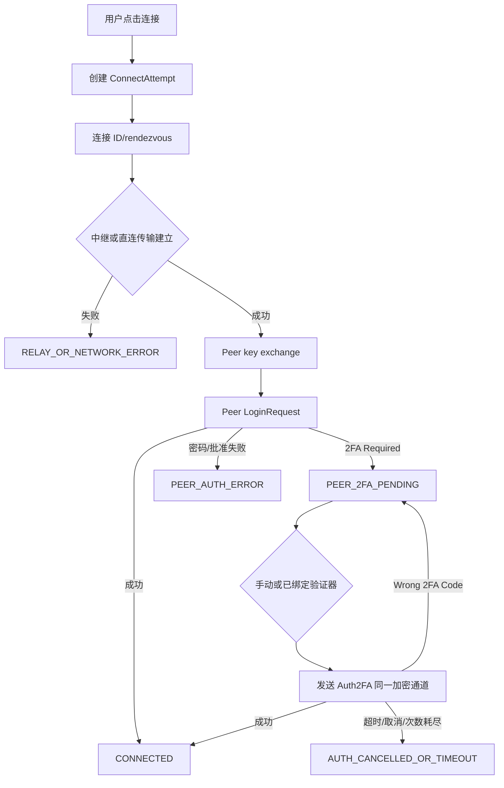

# RustDesk 中继、Peer 2FA、TOTP 与验证器品牌修复升级计划 v2

> 计划日期：2026-07-29（Asia/Shanghai）
> 计划状态：实施中；P0/P1 本地实现与本轮构建门禁已完成，relay fallback port 已贯通 ArkTS/NAPI/C++/Rust 并通过 focused Rust socket tests；独立 reviewer 和真实端点验收仍待完成
> 当前基线：用户授权的 `main` / `6802a716c`
> 远端参照：`origin/main` / `bfae6ef30`
> 工作树：相对 `origin/main` 领先 89 个提交；当前有本任务实现、计划/测试文件和用户已有的其他模组修改；不 reset、不 stash、不覆盖

## 0. 目标与结论先行

本计划要解决的首要问题不是“给中继增加 TOTP”，而是把连接失败准确分成三条互不混用的认证链：

1. **hbbs/hbbr 中继链**：负责 rendezvous、relay endpoint、relay key/shared `-k` 和字节转发。它不生成也不验证 Peer TOTP。
2. **RustDesk Peer 登录链**：被控端在加密 Peer channel 上返回 `2FA Required`，控制端随后发送官方 `Auth2FA` 消息。用户反馈中的“中继报错，需要 2FA”很可能是这条链路的错误被本地 UI 归类成 relay error，也可能是真实 relay endpoint/key 失败后根本没有进入 Peer 认证。
3. **RustDesk Server Pro 账号链**：`/api/login` 和 Pro 账号自身的二次认证，不能复用 Peer 的 `Auth2FA` protobuf。

### P0 成功定义

- 真实 relay TCP/握手/key/endpoint 失败时，界面只显示 relay/network 层错误，不弹 Peer 2FA。
- Peer 已经返回 `2FA Required` 时，不再显示“中继报错”；连接保持在同一加密通道和同一 attempt 上，用户可以手动提交验证码并继续登录。
- 服务器未启用 Peer 2FA 时，不激活 2FA 路径：Peer 直接返回成功后进入会话。
- 同时连接多个主机、取消后重新连接、页面销毁/恢复、超时以及晚到回调均不能串用旧验证码或旧连接状态。
- 普通主机连接和 Pro preflight 使用同一套 Peer 认证控制器，但 Pro 账号二次认证仍保持独立状态机。

### 本轮边界

本轮已按用户授权在当前 `main` 落地 RustDesk relay control-plane profile、错误来源/Token 失效边界、Peer 2FA session/epoch 隔离和普通连接/Pro preflight 用户流程；没有改 RDP/VNC/SSH 的协议 owner。现有用户修改继续保留，未创建分支、未 push、未建 PR。真实 Server Pro、OSS+三方地址簿 A/B、hbbs/hbbr、Peer 2FA 和 API 23 验收仍属于后续门禁。

## 1. 当前基线和用户修改保护

### 1.1 仓库状态

最新启动/实施检查已确认：

- 项目根目录：`/Users/mydestiny/Desktop/RemoteDesktop/RemoteDeskHarmonyOS`
- 当前分支：`main`
- 当前 HEAD：`6802a716c`
- `main` 相对 `origin/main` 领先 89 个提交
- 活动 `codex/<task>` 分支：无
- 工作树包含本任务 RustDesk/C++/ArkTS/测试和计划文件，也包含既有 RDP/VNC/SSH 修改。

本任务触及的 RustDesk 文件以 `rustdesk_ffi/src/{connector.rs,lib.rs,protocol/session.rs}`、
`entry/src/main/cpp/rustdesk/*`、`entry/src/main/ets/{pages/HostListPage.ets,pages/RemoteDesktop.ets,services/RustDesk*,model/RustDesk*,components/hostadd/RustDeskAddFlow.ets,components/resourceadd/modern/ModernRelayAddFlow.ets}`
及对应测试为限；同文件中的其他模组 diff 继续按用户已有修改保护。不得使用 `git reset --hard`、`git checkout --`、stash、整文件覆盖或 `git add -A`。

### 1.2 本地实现 checkpoint 与未闭环项

| 模块 | 当前已落地 | 仍缺少的闭环 |
|---|---|---|
| Peer 2FA Rust | `WaitingPeer2FA`/`RetryingPeer2FA`、`2FA Required`/`Wrong 2FA Code`、同一加密通道 `Auth2FA`、`TestDelay` 保活、90 秒 pending | 真实启用 Peer 2FA 的 wire 验收；完整 `cargo test --lib` 仍被本机 `libopus` 链接阻塞 |
| FFI/C++/NAPI | pending registry 按 session/epoch 隔离；session-specific submit/cancel API；旧无参导出保留兼容；ABI 字段追加 | 双 ABI release/设备验收、真实页面生命周期和 native race 证据 |
| ArkTS 用户流程 | 普通连接与 Pro preflight 均有手动 2FA、TOTP+生物认证自动提交和手动回退；错误分层、取消和过期保护已接入 | 独立 reviewer 复核、API 23 真机、文件传输入口和前后台/重连矩阵 |
| TOTP | host 绑定只传 entry ID/开关；native 只收一次性 code；自动提交前做生物认证并保留手动回退 | 真实 Peer 周期边界、时钟偏差、限次/锁定和设备验收 |
| Relay | control-plane profile 已区分 `oss_key_only`、`addressbook_only_custom`、`official_server_pro_token`、`custom_control_plane`；profile 作为当前设备 `localmetadata`，OSS/三方地址簿默认不传 Pro token；`rdRelayPort` 已从 ArkTS 贯通 NAPI/C++/Rust，且仅在 hbbs 广告的 relay endpoint 未带端口时作为 hbbr fallback | 真实 relay endpoint/key/自定义端口和 token absent/present A/B；最新 FFI/HAP 与设备验收 |
| Pro 账号 | token fingerprint/generation 和结构化 control-plane 失效边界已接入；exact phrase 不再单独清 token | 真实 Server Pro 版本契约、HTTP 第二步 2FA 和 401/403/404/500 验收 |
| TOTP Logo | `totpLogoMode` 个性化切换、白名单 Logo、离线/未知 issuer 首字母回退和高对比度路径已存在 | 主流 issuer 资产/许可证审计、缓存策略和 API 23 截图/对比度验收 |

## 2. 官方证据和版本锁定

### 2.1 RustDesk 官方源码

官方源码使用 GitHub CLI 在沙箱外以只读方式获取，计划以固定 commit 避免随 `master` 漂移：

- RustDesk 客户端固定提交：[`d412d198720aa56f6cfed2dfad262e8fb1322fb7`](https://github.com/rustdesk/rustdesk/tree/d412d198720aa56f6cfed2dfad262e8fb1322fb7)
- 官方客户端错误常量 [`src/client.rs`](https://github.com/rustdesk/rustdesk/blob/d412d198720aa56f6cfed2dfad262e8fb1322fb7/src/client.rs#L118-L120)：同时存在 `Wrong 2FA Code` 和 `2FA Required`。
- 官方客户端错误处理 [`src/client.rs`](https://github.com/rustdesk/rustdesk/blob/d412d198720aa56f6cfed2dfad262e8fb1322fb7/src/client.rs#L3422-L3430)：这两类错误被当作可继续交互的登录错误，清理 trusted-device 选项后显示 2FA 输入，而不是直接归类成 relay 失败。
- 官方客户端 rendezvous token 发送路径 [`src/client.rs`](https://github.com/rustdesk/rustdesk/blob/d412d198720aa56f6cfed2dfad262e8fb1322fb7/src/client.rs#L429-L470)：token 进入 `PunchHoleRequest`；relay fallback 的 hbbs `RequestRelay` 也携带 token，且只有 public key 与 token 同时存在时才启用 secure TCP。
- 官方客户端 relay 请求路径 [`src/client.rs`](https://github.com/rustdesk/rustdesk/blob/d412d198720aa56f6cfed2dfad262e8fb1322fb7/src/client.rs#L717-L727) [`src/client.rs`](https://github.com/rustdesk/rustdesk/blob/d412d198720aa56f6cfed2dfad262e8fb1322fb7/src/client.rs#L838-L923)：token 只用于官方定义的 rendezvous/control-plane 请求；最终连接 hbbr 时仍按 `licence_key` 建立 relay。
- 官方 Peer 登录服务端实现：[`src/server/connection.rs`](https://github.com/rustdesk/rustdesk/blob/d412d198720aa56f6cfed2dfad262e8fb1322fb7/src/server/connection.rs)。实施前固定该文件的 blob SHA，核对 `require_2fa`、`Auth2FA`、错误文本、`hwid` 和 trusted-device 语义。
- 官方 TOTP 实现：[`src/auth_2fa.rs`](https://github.com/rustdesk/rustdesk/blob/d412d198720aa56f6cfed2dfad262e8fb1322fb7/src/auth_2fa.rs)。实施前核对目标 Peer 版本的算法、周期、位数和 Secret 编码，不把本地验证器配置猜测成协议事实。
- 官方 OSS relay 服务端固定提交：`rustdesk-server` `6e7de5b1d648e64e5d7930eea2239f58721420b9`；[`src/rendezvous_server.rs`](https://github.com/rustdesk/rustdesk-server/blob/6e7de5b1d648e64e5d7930eea2239f58721420b9/src/rendezvous_server.rs#L703-L718) 的 hbbs 路径校验 `licence_key`，[`src/relay_server.rs`](https://github.com/rustdesk/rustdesk-server/blob/6e7de5b1d648e64e5d7930eea2239f58721420b9/src/relay_server.rs#L461-L470) 的 hbbr 路径同样校验 relay key；这两个 OSS 文件没有 Server Pro HTTP token session 校验。

RustDesk wire schema 不在 `rustdesk/rustdesk` 的普通源码路径下作为独立 proto 文件维护；本项目需对照独立的 [`rustdesk/hbb_common`](https://github.com/rustdesk/hbb_common) 及当前 RustDesk `libs/hbb_common` submodule 指针。已发现当前官方 submodule 指针为 `559176122bdd5c8afa4e8fd5b706c3d901fb0c15`，实施前必须进一步固定并记录：

- [`protos/message.proto`](https://github.com/rustdesk/hbb_common/blob/559176122bdd5c8afa4e8fd5b706c3d901fb0c15/protos/message.proto)
- [`protos/rendezvous.proto`](https://github.com/rustdesk/hbb_common/blob/559176122bdd5c8afa4e8fd5b706c3d901fb0c15/protos/rendezvous.proto)
- 本地协议上游记录：`rustdesk_vendor/libs/hbb_common/protos/UPSTREAM.yml`

当前本地 vendored 协议早于上述官方快照。P0 不应为了修复用户报错而无条件升级全部 protobuf；只有字段兼容性不足时才升级，并同步生成代码、NOTICE、SBOM、provenance 和哈希清单。

### 2.2 官方结论对本项目的直接约束

- hbbs/hbbr relay 只负责发现、批准 relay 和转发；Peer TOTP 发生在 Peer 登录阶段。
- `2FA Required` 是登录层的可交互状态，不是“连接已经成功”，也不是 relay 错误。
- `Wrong 2FA Code` 是可重试登录错误，但必须受超时、次数和取消限制。
- `Auth2FA` 应在已经建立的 Peer 加密通道上发送；提交验证码不应重新创建 relay UUID 或重复走 rendezvous。
- 第一版不得设置或持久化 `LoginRequest.hwid` 来绕过后续 2FA；trusted device 需要独立安全设计和用户明确授权。

### 2.3 鸿蒙 API 23 官方资料

当前专用 HarmonyOS MCP server 未接入本会话，华为开发者网页直接访问也出现超时，因此网页内容没有被当作本轮已验证证据。可验证的官方 API 23 声明位于本机 OpenHarmony SDK：

`/Users/mydestiny/Library/OpenHarmony/Sdk/23`

需要在实现前逐项读取并记录版本/导出符号：

- `js/api/@ohos.app.ability.UIAbility.d.ts`：`onWindowStageCreate`、`onWindowStageDestroy`、`onForeground`、`onBackground`、`onDestroy`。
- `ets/api/@ohos.userIAM.userAuth.d.ts`：`ACCESS_BIOMETRIC`、认证成功/取消/超时/锁定、`MAX_ALLOWABLE_REUSE_DURATION = 300000`。
- `ets/api/@ohos.security.asset.d.ts`：Asset Store Kit 的 `add/remove/update/query`、持久化数据和认证/屏幕锁状态错误。
- `ets/api/@ohos.net.connection.d.ts`：网络能力和 `ohos.permission.INTERNET` 约束。
- `ets/api/@ohos.taskpool.d.ts`：API 23 的 TaskPool/序列化限制；不得跨线程传 C++ 指针、CryptoChannel 或 native handle。
- `ets/api/@ohos.multimedia.image.d.ts`：本地 Logo 图片解码/加载能力。

官方入口在实现前复核：

- [HarmonyOS 文档中心](https://developer.huawei.com/consumer/cn/doc/)
- [User Authentication Kit](https://developer.huawei.com/consumer/cn/sdk/user-authentication-kit)
- [Asset Store Kit](https://developer.huawei.com/consumer/cn/doc/harmonyos-guides-V14/asset-store-kit-overview-V14)
- [UIAbility 生命周期](https://developer.huawei.com/consumer/en/doc/harmonyos-guides-V5/uiability-V5)
- [TaskPool](https://developer.huawei.com/consumer/cn/doc/harmonyos-guides-V5/taskpool-introduction-V5)

实现前门禁必须重新通过可用的 Harmony MCP `search_api`/`get_module_detail`/`search_online` 或华为官方文档确认 API 23 语法、权限、设备支持和 import 路径；本计划不引入只在 API 26 或更高版本存在的 Kit。

## 3. 现状审计和根因假设

### 3.1 Peer 2FA 已有实现的具体风险

- `rustdesk_ffi/src/lib.rs` 中的 `PENDING_2FA: Mutex<Option<PendingTwoFactor>>` 是全局单槽；第二个连接会覆盖第一个连接的 sender。
- `rustdesk_submit_2fa()` 虽接收 code，但通过当前全局 `CONNECT_EPOCH` 查找 sender；调用方传入的 `sessionId` 没有传到 Rust 作为隔离键。
- `entry/src/main/cpp/rustdesk/rustdesk_bridge.cpp` 的 `submitTwoFactorCode()` 调用全局 `rustdesk_submit_2fa()`；`entry/src/main/cpp/extensions/extension_loader_napi.cpp` 和 ArkTS 类型声明虽然暴露 `sessionId`，但语义未闭合。
- `rustdesk_ffi/src/protocol/session.rs` 在登录 channel 上识别 `2FA Required`/`Wrong 2FA Code`，但状态通知、连接句柄和取消语义仍依赖旧的全局连接模型。
- code 当前放宽到 4-8 位；目标 RustDesk Peer 的实际位数应由服务端版本/配置测试确定，不能因为验证器允许 4-8 位就把错误输入发送到远端。
- 自动提交前如果 `remaining` 已接近 TOTP 周期边界，可能提交即将过期的 code；错误后也可能重复发送同一周期的旧 code。

### 3.2 Relay 路径的具体风险

- `rustdesk_ffi/src/protocol/rendezvous.rs` 当前把 `force_relay` 固定为 `true`。这有助于复现中继问题，但会隐藏直连成功、relay 失败和 endpoint 配置错误之间的差异。
- [x] `create_relay()` 现在接收经校验的 `relay_fallback_port`；`net::connect_tcp_endpoint()` 保留 hbbs 广告的 `relay_server:port`，只在 endpoint 未带端口时使用该 fallback，默认值仍为 21117。
- [x] `RustDeskRelayConfig.relayPort` 已经由 `RemoteDesktop.ets` 和 `HostListPage.ets` 投影到 `SessionConfig.rdRelayPort`，再经 NAPI、C++ FFI ABI 和 Rust 传入屏幕连接及文件传输。`idServerPort` 仍只用于 hbbs/rendezvous。
- [ ] `RustDeskHostConfigPolicy.ets` 的连接前校验仍主要验证 rendezvous endpoint；配置表单要求保存 hbbr endpoint，但真实连接仍以 hbbs 广告 endpoint 为准。需要用真实 hbbs/hbbr 验证广告 host、显式端口、缺省端口和配置端口的组合。
- `server public key`、hbbs/hbbr shared `-k`、Peer TOTP Secret、Pro access token 在现有历史兼容路径中容易被统称为 key，必须在数据模型、UI 文案、FFI 字段和日志中分开。

### 3.3 Pro 账号二次认证的具体风险

- `entry/src/main/ets/services/RustDeskProApiPolicy.ets` 将 API 返回的 `email_check` 转换为 `two_factor_required`，但 `RustDeskProApiService.ets` 的 `/api/login` 只有一次请求。
- 不能假定 Pro 第二步是 TOTP，也不能猜测私有 endpoint、字段、cookie 或 challenge 签名。
- 不能用 Peer `Auth2FA` protobuf 解决 Pro HTTP 账号认证；两者必须在错误码、UI 状态、Secret 绑定和测试中分开。

### 3.4 TOTP Logo/首字母的具体风险

- `TotpBrandService.ets` 当前是有限 issuer 白名单到 Simple Icons slug 的映射，未知 issuer 回退首字母。
- 真实 Logo 通过 `https://cdn.simpleicons.org/<slug>` 运行时加载，存在网络不可用、CDN 变更、缓存不可控和 Logo 许可证追踪不足的问题。
- `foregroundFor()` 只依据简单亮度阈值选黑/白文字；主题色或随机品牌色可能使小尺寸首字母不满足对比度。
- `TotpCodeCard.ets` 和 `HostListPage.ets` 已有 Logo/首字母切换及 `totpLogoMode` 设置；后续应增强现有入口，不新增第二套设置键或第二套云表。

### 3.5 用户反馈根因调查：OSS + 三方管理面板地址簿连接失败（P0）

#### 3.5.1 已确认的本地事实

用户反馈的精确英文文案 `you have not logged in or your login session has expired` 在本地仓库只出现在 `RustDeskProConnectionPreflightPolicy.ets` 的字符串分类器中；Rust FFI、C++ bridge、本地 UI 没有主动生成这段英文。它是 native/ID server/relay/第三方面板返回的原始错误，之后被本地错误分类器重新包装。

从代码实际执行路径看：

1. `RustDeskProSyncService.authenticate()` 调用 `/api/login`，取得 `access_token`；`syncAccount()` 再用 Bearer token 拉取地址簿。两步成功只证明管理面板 HTTP API 接受该 token。
2. `HostSyncService.reconcileRustDeskProHosts()` 把返回主机写成 `sourceType = 'rustdesk_pro'`、`rustdeskProManaged = true`，并绑定 relay/account。当前模型没有区分“官方 Server Pro”与“OSS + 三方地址簿兼容 API”。
3. 主页 `HostListPage.connectToHost()` 对 RustDesk 统一进入 preflight；`rustDeskProConfig()` 对 managed host 取 `account.accessToken`，写入 `SessionConfig.rdAccessToken`。
4. `RemoteDesktop.ets` 的普通路由也会把同一个 token 传入 `rdAccessToken`；C++ `ffiCfg.token`、Rust `api_token` 随后进入 `PunchHoleRequest.token` 和 hbbs `RequestRelay.token`。
5. 当前 `force_relay = true`，所以连接会优先经过 rendezvous/relay 控制面；如果三方管理面板的 hbbs/hbbr 没有实现官方 Server Pro token 契约，或者它需要不同的 token/会话绑定，就会在 Peer 密码或请求批准之前拒绝。
6. 错误回到 ArkTS 后，`classifyRustDeskProNativeError()` 只看英文片段，命中即返回 `pro_session_expired`；`HostListPage`/`RemoteDesktop` 随后调用 `markConnectionSessionExpired()` 清空本地 token，并显示“Server Pro 登录会话已失效”。这会把真实有效的 HTTP 登录状态进一步破坏。

因此，当前反馈至少包含一个确定 bug 和一个高概率协议根因：

- **确定 bug：错误分类和账号失效副作用过宽。** 任何来源的同一句英文都被当作官方 Pro session 过期；没有检查错误发生阶段、响应类型、服务端 profile、HTTP status 或 token generation。
- **高概率根因：地址簿 API 能力被错误等同为 Server Pro 控制面能力。** OSS + 三方管理面板可以兼容 `/api/login`、`/api/ab`，但不代表它实现官方 Server Pro 的 rendezvous token 认证。当前应用无条件把该 API token 注入 relay 控制请求。
- **已修复但仍需端点验收的风险：relay endpoint/端口。** `idServerPort` 与 `relayPort` 已在连接投影和 FFI 中分离；服务端广告 `relay_server:port` 优先，只有未带端口时才回退配置 `relayPort`。真实 hbbs/hbbr 的广告值、key 和自定义端口仍必须验证，且不能把任意失败自动解释为 Pro session 过期。

#### 3.5.2 官方源码对照结论

- 官方控制端确实会发送 `PunchHoleRequest.token` 和 hbbs `RequestRelay.token`，所以“完全漏传 Pro token”是官方 Server Pro 场景的真实缺陷，不能简单删除所有 token 传递。
- 官方 OSS `rustdesk-server` 的 hbbs 只比较 `PunchHoleRequest.licence_key`，并返回 `LICENSE_MISMATCH`、`OFFLINE`、`ID_NOT_EXIST` 等结构化失败；官方 OSS hbbr 只比较 `RequestRelay.licence_key`。OSS 源码没有这句“login session expired”的 Pro 账号会话逻辑。
- Server Pro 的控制面实现不是上述 OSS 源码的一部分；第三方面板的 HTTP 登录成功不能作为它兼容 Server Pro relay token 契约的证据。
- Peer 登录阶段的官方错误是 `Wrong Password`、`No Password Access`、`2FA Required`、`Wrong 2FA Code` 等；它不会用“you have not logged in...”来表示设备密码或 Peer 2FA。因此用户在 password 和 request approval 两种方式下都得到同一文案，进一步支持错误发生在 Peer 登录前的 control-plane/relay 阶段。

如果现场确认 hbbs/hbbr 是未修改的官方 OSS 版本，那么这句英文不可能由上述 OSS relay 源码正常生成；应优先查第三方管理面板的 relay/proxy 层、其自定义 hbbs/hbbr patch 或前置网关，而不是把它解释成 Peer 密码错误。

#### 3.5.3 需要现场确认的最小证据

在修复前必须从当前 native/Rust 日志中补出结构化来源，而不是继续只保存一段字符串：

- `PunchHoleResponse.other_failure`、`failure enum`，还是 hbbs `RelayResponse.refuse_reason`；
- 失败发生在 `rendezvous_connecting`、`requesting_relay`、`relay_tcp_connecting` 还是 Peer `login`；
- token 是否发送（只记录 absent/present/fingerprint，不记录值）、`connectionAuthMode`、key mode、relay ID 和 endpoint；
- 三方管理面板版本、API server 版本、hbbs/hbbr 版本及其对应日志；
- 用同一 host/key/端点分别执行：官方 OSS 客户端、当前 HarmonyOS 客户端“token absent”、当前 HarmonyOS 客户端“token present”。

如果 token absent 能连接而 token present 失败，协议模式混用即可确认；如果两者都失败，优先查 relay key/端口/Peer ID/面板服务端日志；如果只在真实 Server Pro token 模式失败，再核对官方 Server Pro 版本契约和 token 过期时间。

## 4. 目标架构和状态契约

### 4.1 连接阶段与认证阶段分离



要求：E 不能转成 H；H 不能被 UI 写成“中继错误”；Pro 账号状态必须在该图之外单独建模。

### 4.2 Attempt 与 Session 分离

目标数据结构：

```text
ConnectAttempt {
  attemptId: opaque u64/handle
  generation: u64
  transportStage: rendezvous | relay | direct | peer_channel
  authStage: none | peer_password | remote_approval | peer_2fa
  relayEndpoint: host + port + source(advertised|configured|default)
  peerId: redacted/display-safe value
  deadline: monotonic timestamp
  pending2fa: none | required | wrong_code
  sessionHandle: optional, only after PeerInfo/login success
  cancellation: active | cancelled | timed_out | completed
}
```

- `attemptId` 在登录完成前就存在，用户可观察、提交 code 和取消。
- `sessionHandle` 只代表已认证会话；半认证 channel 不得暴露给视频、输入或文件传输控制。
- 所有 native 回调必须带 `attemptId + generation`；页面只接受当前 generation 的事件。
- 连接取消必须让 socket、reader、timer、sender 和 callback context 一起失效；晚到 code 只能得到 `attempt not pending`。

### 4.3 错误分类

至少采用以下稳定分类，内部可用枚举，跨 NAPI 用稳定字符串/整数版本化：

| 阶段 | 稳定码示例 | 可否弹 Peer 2FA |
|---|---|---|
| ID/rendezvous TCP/DNS | `RUSTDESK_RENDEZVOUS_NETWORK` | 否 |
| relay endpoint TCP | `RUSTDESK_RELAY_CONNECT` | 否 |
| relay key/shared `-k` | `RUSTDESK_RELAY_KEY` | 否 |
| relay uuid/转发 | `RUSTDESK_RELAY_HANDSHAKE` | 否 |
| Peer key exchange | `RUSTDESK_PEER_CHANNEL` | 否 |
| Peer 密码/批准 | `RUSTDESK_PEER_AUTH` | 否 |
| Peer 要求二次认证 | `RUSTDESK_PEER_2FA_REQUIRED` | 是 |
| Peer 验证码错误 | `RUSTDESK_PEER_2FA_WRONG` | 是，有限重试 |
| Peer 2FA 超时/取消 | `RUSTDESK_PEER_2FA_TIMEOUT` / `..._CANCELLED` | 否 |
| Pro HTTP 登录二次认证 | `RUSTDESK_PRO_2FA_REQUIRED` | 仅 Pro 账号流程 |

错误对象至少包括 `stage/code/retryable/attemptId/userMessage`。日志可记录脱敏 endpoint 和 key mode，但不得记录完整 key、token、password、Secret 或 code。

## 5. 分阶段实施计划

### Phase 0：复现、证据包和错误分层（P0）

**目标**：先确定用户反馈究竟发生在哪一层，并建立以后所有修复可验证的证据。

- [ ] 增加连接阶段枚举：`rendezvous_connecting`、`relay_requesting`、`relay_tcp_connecting`、`peer_key_exchange`、`peer_login`、`peer_2fa_pending`、`pro_account_login`、`streaming`。
- [ ] 给每个 attempt 生成不可预测或至少单调唯一的脱敏 ID，禁止用 Peer ID、账号邮箱或验证码作为日志关联键。
- [ ] 规范化稳定错误码、可重试性和用户文案；保留底层错误作为受控诊断 detail，不直接把 Rust error string 当 UI 分类。
- [ ] 建立最小证据包：ArkTS 最后阶段/native last message/Rust stage/hbbs/hbbr/Peer/Pro HTTP status 与 type。原始日志留在设备或受控测试环境，仓库只保存脱敏摘要。
- [ ] 用官方客户端对相同 peer、相同 ID server、相同 hbbr、相同 key 做对照：
  - 官方成功、本地出现 `2FA Required`：优先修本地 Peer 2FA/错误分层；
  - 官方和本地都因 hbbr invalid key/端口失败：优先修 relay endpoint/key；
  - `/api/login` 返回 `email_check`：进入 Pro 账号分支，不弹 Peer 2FA Sheet；
  - 只有自定义端口失败：确认端口未被 ID server 默认值覆盖。
- [ ] 在 `forceRelay` 仍为显式配置时做 relay/直连对照；不得用直连成功证明 relay 路径正确。
- [ ] 对用户反馈的精确英文文案做来源标记：来自 hbbs `PunchHoleResponse`、hbbs `RelayResponse`、hbbr/relay TCP、Peer login 或 Pro HTTP；只有“已验证的 Pro control-plane session expired”才允许进入 Pro 账号失效分支。
- [ ] 增加 token A/B 现场测试：同一 OSS + 三方管理面板地址簿主机分别使用 `token absent` 和 `token present`，比较响应类型、relay 日志和 Peer 是否收到 LoginRequest；测试期间禁止自动清空本地账号。

**验收**：每个失败样本能明确回答“失败发生在 rendezvous、relay、Peer channel、Peer login、Peer 2FA 还是 Pro API”。

### Phase 1：端点、端口和 Key 模型修复（P0）

**目标**：使 relay 报错可以被真实修复，而不是用错误的端口或错误的 key 进入中继。

#### 1.1 明确 endpoint 模型

定义结构化 endpoint，避免继续使用一个字符串承载多个职责：

```text
RustDeskServerEndpoints {
  idServer: host
  idServerPort: u16       // 默认 21116，hbbs/rendezvous
  relayServer: host       // hbbr 或 hbbs 返回的真实 relay endpoint
  relayPort: u16          // 默认 21117，仅作缺省值
  peerDirectHost: host
  peerDirectPort: u16     // 默认 21118，直连 Peer
  relaySource: advertised | configured | default
}
```

- 默认端口只作为缺省值；服务端返回的 `host:port` 优先于本地默认。
- 非直连连接必须将 ID endpoint 用于 rendezvous，将真实 relay endpoint 用于 `create_relay()`；不能把 `idServerPort` 改名后继续传给 hbbr。
- relay endpoint 包含 IPv4、IPv6、域名和带端口文本时使用结构化解析器，不用简单 `split(':')`。
- 对 Pro 同步主机、普通主机、导入 JSON、旧主机迁移和 host list projection 逐条审计，确保 `relayServer/relayPort` 端到端保留。

重点检查文件：

- `rustdesk_ffi/src/protocol/rendezvous.rs`
- `rustdesk_ffi/src/connector.rs`
- `entry/src/main/ets/model/RustDeskRelayConfig.ets`
- `entry/src/main/ets/services/RustDeskHostConfigPolicy.ets`
- `entry/src/main/ets/services/RustDeskRelayImportService.ets`
- `entry/src/main/ets/services/HostSyncService.ets`
- `entry/src/main/ets/services/RustDeskProSyncPolicy.ets`
- `entry/src/main/ets/services/CloudStore.ets`
- `entry/src/main/ets/pages/RemoteDesktop.ets`
- `entry/src/main/ets/pages/HostListPage.ets`
- 两个 RustDesk add flow 组件和 NAPI/C++ config projection。

实现 checkpoint（2026-07-29）：

- [x] 在 `RustDeskHostConfigPolicy.ets` 增加 `RUSTDESK_RELAY_PORT` 和 `rustDeskRelayFallbackPort()`；两条 ArkTS 连接入口都传入 `SessionConfig.rdRelayPort`。
- [x] `ConnectionConfig.rdRelayPort` 默认 21117，NAPI 将异常值归一化到 21117；Rust `relay_fallback_port_from_config()` 再次做 ABI 边界校验。
- [x] 在 `RustDeskFfiConfig`/`RustDeskConfig` 尾部追加 `relay_fallback_port`，C++ 固定断言 tail offset 96、size 104；不改变既有字段顺序。
- [x] 屏幕连接和文件传输均把该值传给 `RendezvousClient::create_relay()`；`net::connect_tcp_endpoint()` 继续按 IPv4、IPv6、域名和显式端口的结构化规则解析 endpoint。
- [x] focused Rust socket tests 覆盖“服务端显式端口优先”和“无显式端口使用配置 fallback”；真实 endpoint 验收尚未替代这些测试。

#### 1.2 明确三类 key

| 名称 | 作用 | 允许进入哪里 | 禁止当作什么 |
|---|---|---|---|
| server public key | rendezvous secure key exchange/签名校验 | secure ID/rendezvous client | hbbr shared `-k`、Peer TOTP |
| hbbs/hbbr shared `-k` | relay/rendezvous `licence_key` 文本 | punch/request relay，按官方服务端契约传递 | public key、Peer password、TOTP |
| Peer TOTP Secret | 被控端登录二次认证 | 仅自有 vault/TOTP engine | relay key、Pro token |
| Pro access token | Pro HTTP/控制面 session handoff | 短生命周期 rendezvous control payload（若官方契约要求） | Peer `Auth2FA`、TOTP Secret |

- `key_mode` 必须是显式值，至少支持 `server_public_key`、`shared_access_key`、`legacy_auto`；auto 只能兼容旧数据并记录迁移告警。
- public key 的 Base64/32-byte 校验和 shared key 的原文比较分开执行。
- UI 标签、云字段、备份字段和日志标签都使用完整名称；不再使用含糊的“服务器密钥”。
- Pro token 继续 transient-only，不落 host record/cloud/log；与本计划 relay key 修复一起做字段流向审计。

#### 1.3 force relay 策略

- [ ] 把当前 `force_relay=true` 从隐藏常量变成 `auto/direct/force_relay` 三态配置；保留旧数据的兼容迁移。
- [ ] P0 期间默认仍可用 `force_relay` 复现用户问题，但诊断中必须记录实际策略。
- [ ] 只有直连和 relay 均通过官方/真实服务端验收后，才把默认行为调整为 `auto`；调整需单独提交和回归记录。
- [ ] 直连配置开启时不调用 rendezvous；直连 port 默认 21118，不与 ID/hbbr 端口混用。

**验收**：自定义 21116/21117/21118、服务端广告 endpoint、IPv6、public key、shared `-k` 和无 key 的 OSS relay 均有确定性测试；relay TCP 失败不会进入 Peer 2FA UI。

#### 1.4 地址簿 API 与 relay control-plane 能力分离

当前 `sourceType = rustdesk_pro` 既表示“主机来自 Pro-like 地址簿”，又隐含“该 relay 接受官方 Server Pro token”。必须拆开这两个概念：

- [x] 增加结构化 server capability/profile，至少区分：
  - `oss_key_only`：官方 OSS hbbs/hbbr 或普通兼容 relay，relay 只按 `licence_key`；不发送 Pro token；
  - `official_server_pro_token`：目标 Server Pro 版本明确支持官方控制端 token；仅该模式允许发送 `rdAccessToken`；
  - `addressbook_only_custom`：三方管理面板只提供 HTTP 登录/地址簿，连接仍按 OSS key-only，除非面板文档明确声明兼容官方 Pro control-plane；
  - `custom_control_plane`：已取得第三方协议和测试证据后，通过独立适配器处理，不能复用官方 Pro 假设。
- [x] 将 profile 绑定到当前设备的 relay ID，而不是只看 `sourceType` 或 API URL；旧记录、云下载的新 relay 和普通本地备份恢复均归一化为 `oss_key_only`，不默认开启 token。
- [x] profile 仅写入设备本地 `localmetadata`，不修改 `rustdeskrelays` 建表/迁移 SQL、Huawei 云字段白名单或便携备份字段。删除 relay 时同一事务删除 profile；云下载失败回滚恢复本机 metadata 快照，便携备份恢复主动清理旧 profile，要求用户在目标设备重新确认。
- [x] `rdAccessToken` 只有在 `official_server_pro_token`/`custom_control_plane` 且非直连时才进入 `SessionConfig`；OSS + 三方地址簿模式仍保留 HTTP Bearer token 供同步，但连接控制面 token 为空。
- [ ] 登录成功、地址簿同步成功、relay token handshake 成功分别记录为三个 capability，不允许前一个成功自动推断后两个成功。
- [ ] UI 显示“地址簿登录”和“远程连接控制面”两种状态；第三方面板未声明 Pro relay token 兼容时，提供明确的 OSS/地址簿兼容模式。
- [ ] profile 变更、账号切换、relay key 变更和云同步冲突都要使旧 capability 重新验证；不能把一个面板的 token 带到另一个 relay。

**验收**：官方 OSS + 三方地址簿在 token absent 模式下可按 key-only 连接；同一测试若 token present 被面板拒绝，界面显示 control-plane/relay 兼容性错误且账号仍保持 `logged_in`；真实 Server Pro 只有在 profile 明确启用且官方契约验证后才发送 token。

本地实现已覆盖 profile 归一化、relay 配置/导入/当前设备 profile 解析、普通连接与 Pro preflight 的 token 投影，以及
exact phrase 的结构化失效边界。云 relay 行和便携备份不会携带 token-handoff 授权；token absent/present 和真实 Server Pro 仍必须用真实服务端完成验收。

### Phase 2：Rust Peer 2FA 状态机和协议兼容（P0）

**目标**：在同一加密 Peer channel 上完成官方兼容的手动 2FA。

- [ ] 对比本地 `message.proto`、`rendezvous.proto` 与固定的 `hbb_common` 版本，确认 `Auth2FA`、`LoginRequest.hwid`、`RequestRelay.licence_key`、`force_relay` 字段编号和 oneof variant；没有必要时不升级全套 proto。
- [ ] 如果必须升级协议，固定 RustDesk commit、hbb_common commit、proto SHA-256，并同步 `UPSTREAM.yml`、NOTICE、SBOM、provenance、生成代码 diff。
- [x] 保留 `WaitingPeer2FA`/`RetryingPeer2FA` 或等价状态，但把 transport stage 与 auth stage 分开，避免状态枚举把 relay 和 Peer 混成一条错误链。
- [x] 收到 `2FA Required` 时：记录 pending、保持 `CryptoChannel`、启动单调时钟 deadline、发送可观察事件；不得关闭连接或重建 rendezvous。
- [x] 收到 `Wrong 2FA Code` 时：保持同一 attempt/channel，产生可重试事件；错误达到上限或服务端明确拒绝后才终止。
- [x] code 正确收到 `PeerInfo` 后，清理 pending，发送 accepted，之后才发送 stream options/开始视频、音频、文件传输。
- [x] pending 期间继续响应 `TestDelay` 等保活消息；不得把 ArkTS 页面是否存在作为 socket 存活条件。
- [x] `Auth2FA` 的 `hwid` 第一版保持为空，不启用 trusted device；以后要做 trusted device 必须另有用户授权、设备绑定和撤销设计。
- [ ] 统一普通屏幕连接、文件传输和重连路径，不能只在 `login_encrypted` 的屏幕入口修复。
- [ ] 输入校验以实际目标 Peer 的配置为准：默认显示/接受 6 位；若目标部署确实支持其他位数，配置需显式说明，不能保留无约束的 4-8 位黑洞。

**验收**：fake CryptoChannel 覆盖 required、correct、wrong、TestDelay、cancel、timeout、重复 response；正确 code 后不重新建 relay，错误 code 有限重试，取消释放所有 channel/receiver/timer。

本地 Rust/FFI 单元覆盖了 session ID 隔离、结构化 relay 错误和 `Auth2FA` 消息字段；完整运行仍受宿主机
`libopus` 链接依赖阻塞，真实 Peer wire 验收未完成。

### Phase 3：Per-attempt FFI、C++ Bridge、NAPI 隔离（P0）

**目标**：消除当前全局单槽和“sessionId 参数存在但没有使用”的串扰风险。

本地实现 checkpoint：`PENDING_2FA` 已改为 session/epoch registry；`RustDeskConfig` 追加
`connection_id`；C++/NAPI 的 `submitRustDesk2FA(sessionId, code)` 和 session cancel 已接入 Rust，
同时保留旧无参导出作为兼容包装。完整的 attempt handle 状态查询、双 ABI 和真实生命周期验收仍是
reviewer/设备门禁，不能用兼容导出替代。

#### 3.1 API 设计

建议新增追加式 ABI，保持旧 `RustDeskConfig` 字段顺序和旧连接函数兼容：

- `rustdesk_begin_connect(...) -> attempt_handle`
- `rustdesk_get_attempt_state(attempt_handle)`
- `rustdesk_submit_2fa(attempt_handle, code, code_len)`
- `rustdesk_cancel_attempt(attempt_handle)`
- `rustdesk_take_session(attempt_handle)` 或通过事件发布正式 session handle
- `rustdesk_destroy_attempt(attempt_handle)`

现有 `rustdesk_connect_v3` 可作为兼容包装，但不得继续让全局 `rustdesk_submit_2fa()` 成为真实实现。旧符号可保留一段迁移期，只有在唯一 pending 且无并发时兼容映射，并打出弃用诊断。

#### 3.2 生命周期规则

- 将 `PENDING_2FA: Mutex<Option<...>>` 替换为按 `attemptId` 管理的 registry；每个 entry 保存 sender、generation、deadline、取消状态和 channel owner。
- `CONNECT_EPOCH` 不再作为唯一认证选择键；可以作为全局取消代次，但提交 code 必须通过显式 attempt handle 找到目标。
- C++ `RustDeskBridge::submitTwoFactorCode()` 接收并校验 attempt/session handle；native bridge 不能只调用无参数的全局函数。
- NAPI 的 `submitRustDesk2FA(sessionId, code)` 需要让 `sessionId` 真正进入 Rust；若名称保留，文档必须明确它在 pending 阶段代表 attempt handle。
- 所有回调带 `attemptId + generation + event kind`。旧页面的 `CONNECTED`、`AUTH_2FA_REQUIRED`、`WRONG_CODE`、`ERROR` 均丢弃。
- 页面销毁/返回、重复点击连接、Pro preflight 取消、UIAbility `onBackground`、超时和 native disconnect 都必须调用同一 cancel/destroy 路径。
- code 不进入 native 日志、C++ exception、NAPI error text、crash dump 或 clipboard；只传入短生命周期的 UTF-8 数字字符串。

#### 3.3 ABI 和线程门禁

- 不改变已有 C struct 字段顺序；新增字段只追加并同步头文件、Rust layout 断言、C++ 调用和 NAPI declaration。
- native socket read 继续由 Rust/C++ 连接线程执行；ArkTS 不能阻塞等待连接，也不能把 `CryptoChannel`/裸指针传入 TaskPool。
- callback user data 的所有权必须可证明：attempt 销毁前停止回调，销毁后禁止访问 ArkTS/NAPI context。
- 连接错误不得依赖全局 `LAST_ERROR` 作为并发状态来源；全局 last error 只能保留兼容诊断，真实 UI 错误来自带 attempt 的事件。

**验收**：A/B 两个主机同时 pending，A 的 code 只能唤醒 A；取消 A 后向 A 提交 code 失败且不影响 B；A 旧回调晚到时不能改变 B 或新 A 的 UI；ASAN/线程 sanitizer 可用时补跑 native 生命周期测试。

### Phase 4：统一 ArkTS 认证控制器和用户流程（P0）

**目标**：普通连接、Pro preflight、文件传输和重连都呈现一致、可解释的认证流程。

本地实现 checkpoint：`HostListPage` 与 `RemoteDesktop` 已分别接入同一套错误分类/失效策略、session-specific
2FA submit/cancel、手动输入和 TOTP 生物认证自动提交；当前尚未抽出独立的
`RustDeskAuthAttemptController`，文件传输和 UIAbility 生命周期的全量统一仍需 reviewer 确认后再决定是否扩大改动面。

#### 4.1 控制器

新增一个连接域内的 `RustDeskAuthAttemptController` 或等价 service，不在多个页面复制状态机。它负责：

- attempt 创建、状态订阅、deadline、cancel、重试次数和终态；
- relay/network/Peer password/approval/Peer 2FA/Pro account 的分类映射；
- 对 `attemptId + generation` 做事件去重；
- 把 native 错误映射成用户文案和可诊断 detail；
- 连接成功后移交正式 session，页面退出后不把 UI state 当作 session owner。

#### 4.2 用户流程

1. 用户选择 RustDesk 主机并点击连接。
2. App 先校验绑定的 ID server、hbbr endpoint、端口、key mode、Peer ID 和 Pro account binding。
3. relay/Peer channel 建立失败时显示明确的 relay/network/Peer channel 错误，流程结束，不弹 2FA。
4. Peer 未启用 2FA 时，Peer 登录成功，直接进入桌面或文件传输；不显示空的 2FA Sheet。
5. Peer 返回 `2FA Required` 时，显示“远端设备要求二次认证”，同时显示目标主机/Peer 的安全名称、剩余等待时间和取消按钮，不写“中继错误”。
6. 如果该主机存在明确绑定且用户开启自动提交，先走系统生物认证；认证成功后再生成当前 TOTP code，并检查剩余时间，再提交到同一 attempt。
7. 没有绑定、未开启自动提交、生物认证取消/失败或 code 即将过期时，使用手动输入；不会把 Secret 交给 native。
8. `Wrong 2FA Code` 保留当前 attempt 和输入界面，提示重试次数/等待周期；不静默重启 relay。
9. 超时、取消、页面销毁或 UIAbility 后台恢复后发现 attempt 已失效，显示“认证已过期，请重新连接”，不能提交旧 code。

Pro 账号 `/api/login` 的二次认证不走步骤 5-9 的 Peer Sheet，见 Phase 7。

#### 4.3 UIAbility 生命周期

- `onBackground` 时停止 UI 侧自动提交；native attempt 是否保留由 controller 和 attempt deadline 决定。
- `onForeground` 时先读取 attempt state，再决定恢复 Sheet、要求重新认证或重新连接。
- 生物认证回调、TOTP 计算结果、连接回调都检查 generation；晚到结果直接丢弃。
- 不在 ArkTS 页面销毁时直接假定 native 已断开；必须等待可判定的 cancel/teardown 结果或由 native 回调确认。

#### 4.4 错误来源与账号失效保护

- `classifyRustDeskProNativeError()` 不再只接收自由文本；输入必须包含 `stage/source/messageType/serverProfile/tokenGeneration`，自由文本只作为最后的展示 detail。
- `pro_session_expired` 只允许由已验证的 Pro HTTP 401/403，或目标 profile 明确声明的 Pro control-plane session-expired 错误产生；`PunchHoleResponse.other_failure`、`RelayResponse.refuse_reason` 中的普通英文文案不得单独触发该分类。
- 对用户反馈中的 exact phrase，若来源是 OSS/第三方 relay，显示“中继控制面拒绝：管理面板登录与 RustDesk relay token 契约不兼容或已被服务端拒绝”，保留重新登录/切换 OSS key-only profile 的操作，不清空有效账号。
- `markConnectionSessionExpired()` 必须带 account ID、token fingerprint、失败阶段和 generation；只有本次失败仍对应当前 token 时才允许清除，不能清掉用户刚刚重新登录得到的新 token。
- `HostListPage` 和 `RemoteDesktop` 使用同一错误策略；不能由 preflight 显示 Pro 过期、正式页面显示 relay error，或在非 Pro host 上调用 Pro 账号失效副作用。

**验收**：普通 relay refused、OSS/三方控制面返回 exact phrase、Peer password wrong、Peer approval timeout、Peer `2FA Required` 和真实 Pro 401/403 各自落入正确类别；只有最后一类能标记账号 expired。

**总体验收**：普通主机和 Pro 管理主机均可手动完成 Peer 2FA；无 2FA 主机无额外步骤；relay failure 不弹 2FA；返回上一页、锁屏、切后台、重复点击和重连均无假连接或旧 code 串扰。

### Phase 5：自有 TOTP 验证器安全接入（P1）

**目标**：在 Peer 手动 2FA 已通过真实端到端测试后，再安全复用本地验证器。

#### 5.1 绑定和存储

- 继续使用现有 `RemoteHost.rustdeskTotpEntryId` 和 `rustdeskTotpAutoSubmit`，避免重复造字段；如后续需要 `manual/auto` 枚举，先做迁移设计再替换布尔值。
- 绑定必须以本地主机记录 ID 为主，并同时核对 RustDesk Peer ID/Pro peer ID；issuer、昵称、域名或 relay key 不能单独作为绑定键。
- 主机换 Peer ID、条目被删除、云冲突、relay 配置切换或 Pro 地址簿重绑时，绑定进入失效/需确认状态，不能自动跟随同名主机。
- `TotpEntry.secret`、解密明文、当前 code、恢复码不能进入 `RemoteHost`、云表、备份、Pro payload、C ABI、日志或 crash data。
- 现有 KeyVault/DataCrypto 继续作为本期 Secret owner；本期不把 Secret 迁移到 Asset Store。Asset Store 迁移另立安全评审任务，避免在认证修复中引入存储格式变化。

#### 5.2 生物认证和 API 23

- 使用 API 23 可验证的 User Authentication Kit，并明确 `ACCESS_BIOMETRIC`、取消、超时、锁定和设备不支持的回退文案。
- 生物认证只授权本次读取/生成，不代表用户同意启用 trusted device，也不延长 Peer session 的认证时间。
- 若采用 Asset Store，先完成 API 23 可用性、认证访问控制、屏幕锁状态和迁移回滚验证；没有完成前不替换当前 vault。
- TaskPool 只可承担明确可序列化的轻量计算；Secret、native pointer 和 CryptoChannel 不跨 TaskPool 传递。

#### 5.3 自动提交策略

- 收到 Peer `2FA Required` 后才按绑定条目生成 code，禁止连接一开始后台预生成或持久化 code。
- 生成前检查 `remaining`；低于安全阈值时等待下一个周期或回到手动输入，不能提交已接近过期的 code。阈值由测试确定并记录。
- 发送后不重复提交同一 code；收到 `Wrong 2FA Code` 时按周期和重试策略重新生成/要求手动输入。
- 设置最大尝试次数和冷却时间，避免错误 code 触发 Peer 端锁定；具体上限必须通过目标 Peer 版本测试，不依赖无限循环。
- 检测设备时钟明显偏差时给出可操作提示；不得用客户端时间偏移强行修改 Peer 协议结果。
- 自动提交失败时保留手动入口，且错误文案区分“验证器不可用”“绑定失效”“code 过期”“Peer 拒绝”。

**验收**：同一 host 绑定正确条目时自动流程成功；未绑定或绑定冲突时绝不自动提交；生物认证取消回到手动；周期边界、错误 code、时钟偏差、锁屏和离线状态均有确定性结果；native 永远只看到一次性 code。

### Phase 6：Logo、首字母和个性化设置（P1）

**目标**：覆盖绝大多数常见 issuer，同时保证离线、主题切换和未知 issuer 下头像可读、可回退、可维护。

#### 6.1 Logo 来源策略

- 不运行时抓取任意网页 Logo；这会引入不稳定 DOM、隐私泄漏、恶意资源、商标和许可证不可追踪问题。
- 采用构建时可审计的品牌清单：优先 Simple Icons/官方 brand asset，并记录 slug、来源 URL、许可证/商标说明、版本和资源 hash；必要时补充品牌官方 favicon/媒体资源，但每项都要经过许可证审查。
- 以常见 issuer、邮箱域名和账户域名覆盖为目标，使用可扩展 manifest，而不是把所有映射硬编码在单个 service。目标指标应是产品真实导入样本中至少 95% 的常见 issuer 命中，并保留未知 issuer 首字母作为完整能力。
- resolver 做 Unicode/大小写/空白归一化，支持 issuer alias、英文/中文名称、邮箱域名和品牌域名；不得把邮箱完整地址发送给 CDN。
- 本地资源优先，内存/应用缓存其次，CDN 是可选 fallback。CDN 请求只含已归一化的公开 slug，带超时、大小上限、失败缓存和离线回退。
- Logo 加载失败、资源版本不匹配、网络不可用或服务器返回非图片时立即回退首字母；不能让卡片布局等待无限网络请求。

涉及文件：

- `entry/src/main/ets/services/TotpBrandService.ets`
- `entry/src/main/ets/components/TotpCodeCard.ets`
- `entry/src/main/ets/pages/HostListPage.ets`
- 本地 Logo 资源目录、manifest、构建脚本和第三方声明（实施时按仓库现有资产规则确定位置）。

#### 6.2 高对比度首字母

- 统一取 1-2 个稳定字符；中文 issuer、英文 issuer、邮箱域名和空 issuer 都有确定性规则。
- 使用 WCAG 相对亮度计算，计算文字色与候选背景的对比度；普通小字目标至少 4.5:1，图形/大字最低不低于 3:1。
- 不直接复用任意主题 accent。背景从受控的高对比度 palette 选择，前景在黑/白或扩展前景表中选择；若两者都不达标，换背景而不是降低字体可读性。
- 深色/浅色主题、品牌相近色、动态主题、色觉差异和两字母窄宽场景均做截图与自动对比度测试。
- Logo 和 initials 只是同一信息的两种呈现；不能让用户必须依赖颜色识别 issuer。

#### 6.3 个性化开关

- 复用现有 `totpLogoMode`，选项为 `logo` 与 `initials`；已有 `usersettings`/`CloudSyncSettingsPolicy` 白名单和持久化链路继续使用，不新增云表。
- 默认值和旧版本迁移固定为当前产品决定的默认（建议 Logo 优先但失败自动 initials）；设置切换后所有 TOTP 卡片一致更新。
- `initials` 模式不请求 Logo 网络资源；`logo` 模式失败仍按同一高对比度 initials 回退。
- 设置项在手机、平板、PC/API 23 目标设备上验证，确保长 issuer、窄窗口、深浅主题和动态字体不溢出。

**验收**：常见 issuer 命中本地 Logo；离线/未知 issuer 立即显示可读首字母；切换设置、重启、云同步和旧数据迁移后状态稳定；所有首字母头像通过自动对比度测试；资源清单、许可证和 hash 可追溯。

### Phase 7：Pro 账号二次认证独立方案（P2，不能阻塞 P0）

**目标**：在不猜测私有协议的前提下，正确处理 Pro 账号的 HTTP 二次认证。

- [ ] 先按目标 RustDesk Server Pro 版本取得官方客户端/API 契约：challenge 类型、第二步 endpoint、字段、cookie/header、过期时间、错误码、重放保护和设备信任语义。
- [ ] 为 Pro 建立独立状态：`ProLoginRequired`、`ProTwoFactorPending`、`ProTwoFactorRetryable`、`ProAuthenticated`、`ProExpired`。
- [ ] `email_check` 只进入 Pro 账号认证 Sheet/流程，不调用 Peer `Auth2FA`，不复用 `rustdeskTotpEntryId` 除非官方 Pro 契约明确允许并且用户另行绑定。
- [ ] Token 只存在 transient session handoff，继续禁止写入 host record、cloud metadata、日志和 crash dump。
- [ ] 401/403/404/500、challenge 过期、账号/服务器/relay 不匹配分别展示；不能把账号过期覆盖成 relay error，也不能把 Peer 2FA 成功误当 Pro 登录成功。
- [ ] 未取得服务端协议前不实现猜测 endpoint，不在计划外加入自动提交。

#### 7.1 OSS + 三方管理面板兼容边界

- [ ] 把“HTTP 地址簿兼容”作为独立能力，不命名或标记成官方 Server Pro 全能力。
- [ ] 三方管理面板必须提供版本化的 control-plane 说明：是否接收 `PunchHoleRequest.token`、是否要求 secure TCP、token 是 HTTP Bearer token 还是另一个 relay session token、是否支持 hbbs `RequestRelay.token`、失败码和有效期。
- [ ] 在没有上述契约和实测之前，默认走 `oss_key_only`：HTTP token 只用于管理面板 API，relay 连接不发送 `rdAccessToken`；用户可以在 relay 设置中显式启用兼容模式并承担验证责任。
- [ ] 为三方 panel 建立 adapter/capability test，不在 `RustDeskProApiService` 里用 endpoint 字符串或返回了 `access_token` 就推断控制面兼容。
- [ ] 地址簿同步成功后 UI 仍显示账号 `logged_in`，但另显示“远程连接控制面：未验证/OSS key-only/Server Pro token”；控制面失败不能自动把 HTTP 账号改成 expired。

**验收**：用户当前的 OSS + 三方管理面板场景至少能按 key-only 模式连接或得到明确的“面板控制面协议不兼容”诊断；不会再把有效登录显示为已过期，也不会因一次 relay 拒绝清空 token。

**验收**：真实兼容 Pro 版本可完成账号登录、第二步认证和 token 过期重登；普通 OSS Peer 2FA 不受 Pro API 变化影响；所有 HTTP 失败均能回到正确层级。

## 6. 测试与验收矩阵

### 6.1 Rust 单元/集成

- fake `CryptoChannel`：`2FA Required -> submit correct -> PeerInfo`。
- `2FA Required -> Wrong 2FA Code -> submit new -> PeerInfo`。
- pending 期间多个 `TestDelay`，确认保活且不提前进入 Connected。
- relay 建连失败、key 错误、Peer channel 错误均不能发出 `AUTH_2FA_REQUIRED`。
- `PunchHoleResponse.other_failure` 和 `RelayResponse.refuse_reason` 返回 exact phrase 时，错误来源分别保留为 rendezvous/relay，不得分类成 `pro_session_expired`。
- 同一 OSS + 三方 panel 地址簿主机：HTTP login/address-book 成功后，token absent 与 token present 两次连接结果可比较；token present 被拒绝时账号仍为 `logged_in`。
- 只有受验证的 Pro HTTP 401/403 或官方 Pro control-plane session error 才能调用账号过期处理；旧 token 失败不能清掉并发登录得到的新 token。
- attempt A/B 并发、A cancel 后 code、旧 generation code、超时后 code、重复 submit、sender closed。
- code 长度/字符校验、次数上限、deadline 单调时钟和资源释放。
- `Auth2FA` protobuf 序列化/反序列化、`hwid` 为空、field number 不变。
- 密码、request approval、Peer 2FA、文件传输和重连共享同一登录状态机。

### 6.2 C/C++/NAPI/ABI

- Rust/C/C++ `repr(C)` layout 和旧调用方兼容性断言。
- NAPI 参数类型、缺参、非法 handle、错误 code、重复 cancel、destroy 后 submit。
- callback user data 所有权、线程退出和 native teardown。
- 多连接回调顺序、页面 generation、全局 `LAST_ERROR` 不覆盖结构化事件。
- arm64-v8a 与 x86_64 release FFI 编译，必要时补 native race/sanitizer。

### 6.3 ArkTS/用户流程

- 无 Peer 2FA：连接不显示 2FA UI。
- Peer 2FA：手动输入、错误重试、成功进入桌面、取消、超时、返回页面、锁屏/解锁、前后台。
- relay 失败：只显示 relay/network error，不显示 2FA。
- 普通主机与 Pro host、屏幕连接与文件传输入口保持一致。
- 绑定条目删除、主机 ID 改变、云同步冲突、自动提交关闭、生物认证拒绝、验证器锁定。
- TOTP 周期边界、剩余时间、时间偏差、错误 code 后新 code。
- Logo `logo`/`initials`、本地/缓存/CDN/离线/未知 issuer、深浅主题、动态字体和窄窗口。

### 6.4 真实端到端

至少准备以下矩阵：

| 组合 | 必测结果 |
|---|---|
| API 23 HarmonyOS client + 官方 Peer，无 2FA | 直接连接成功，无 2FA Sheet |
| API 23 client + 官方 Peer，启用 TOTP | `2FA Required` 可见，正确 code 在原 channel 完成登录 |
| 错误 code/周期边界/超时 | 可重试或明确终止，无 relay 重启串扰 |
| hbbs + hbbr，默认端口 | relay 成功，stage 和 endpoint 日志正确 |
| hbbs + hbbr，自定义 21116/21117 | 不把 ID port 当 relay port |
| 真实 public key/shared `-k`/无 key OSS | 各自按服务端契约工作，错误可区分 |
| 直连 Peer 21118 | 不调用 relay，Peer 2FA 状态机仍工作 |
| NAT/symmetric NAT 强制 relay | relay 失败和 Peer 2FA 不混淆 |
| Pro 账号返回 `email_check` | 进入 Pro 账号流程，不发 Peer `Auth2FA` |
| 官方 OSS hbbs/hbbr + 地址簿兼容 API | HTTP token 用于地址簿，relay 默认 key-only，不把 API 登录成功等同于 Pro control-plane 登录 |
| 三方 panel token present/absent A/B | 记录面板真实拒绝阶段；不得误清账号，不得误报 Peer 密码/2FA |
| 真实 Server Pro token 模式 | 仅在 profile 明确启用时发送 token，过期响应才标记账号 expired |
| API 23 手机/平板/PC | 生命周期、键盘、Sheet、Logo 布局无回归 |

必须用至少一个真实 hbbs/hbbr、一个启用 Peer 2FA 的真实 Peer、一个官方客户端对照；fake test 不能替代 wire/e2e 验收。

## 7. 安全、许可证和隐私门禁

- Secret、code、Peer password、Pro token、shared key 和 public key 采用不同数据分类；每次跨模块传递都做字段流向审查。
- 日志只保留阶段、稳定错误码、脱敏 attempt、端口、key mode 和不可逆 fingerprint；禁止字符串格式化把敏感字段带入日志。
- 自动 TOTP 只在用户明确绑定和授权后启用；不启用 trusted device，不写 `hwid`，不绕过远端权限。
- CDN Logo 请求不携带邮箱、账户名、Secret 或完整 issuer；本地资源优先，网络资源可禁用。
- 所有新 Logo 资源记录来源、许可证、商标说明、版本和 hash；更新第三方依赖时同步 `NOTICE`、`THIRD_PARTY_NOTICES`、SBOM 和 provenance。
- RustDesk/hbb_common/relay 代码仍遵守 AGPL/第三方许可证边界；协议生成物升级必须经过 open-source-compliance 检查。
- 不把真实服务器地址、凭据、原始日志、二维码、截图或设备数据提交进仓库。

## 8. 实施顺序、提交边界和回滚

建议按以下独立提交单元实施，每个单元都要有定向测试和可回退点：

1. **诊断合同**：阶段枚举、错误码、脱敏日志和失败证据。
2. **relay endpoint/key/profile**：端口模型、广告 endpoint、key mode、force relay 策略，以及 OSS/Server Pro/三方地址簿 control-plane 能力 profile。
3. **Rust Peer 2FA**：状态机、Auth2FA、fake channel 和取消/超时。
4. **FFI/NAPI**：per-attempt handle、callback generation、ABI 兼容。
5. **ArkTS 认证控制器**：普通连接、Pro preflight、文件传输和生命周期。
6. **TOTP 自动提交**：绑定、User Authentication、remaining、限次和手动回退。
7. **Logo/首字母**：资源清单、缓存/fallback、对比度和 `totpLogoMode` 验收。
8. **Pro 账号 2FA**：仅在官方契约确认后单独实现。
9. **发布和合规**：SBOM、许可证、双 ABI、API 23 真机和真实服务端验收。

每个 checkpoint 的回滚策略：

- P0 未闭环前保留手动 Peer 2FA，不开启自动 TOTP。
- relay endpoint 修复若发现服务端版本不兼容，可通过显式配置回退到旧字段读取，但不能恢复把 2FA 伪装成 relay error 的 UI。
- Logo 网络或资源更新失败时始终可切换到 initials；Logo 功能不能影响 TOTP code 生成和连接。
- Pro 账号第二步协议未确认时保持明确的“需要按官方流程完成账号认证”错误，不伪造成功或自动猜测请求。

## 9. 强制工程门禁

### 9.1 每次代码/测试/配置改动后的构建

在项目根目录执行，必须使用非 daemon 和当前任务名：

```sh
source scripts/macos_env.sh
hvigorw --mode module -p module=entry -p product=default default@OhosTestCompileArkTS --analyze=normal --parallel --incremental --no-daemon
hvigorw --mode module -p module=entry -p product=default assembleHap --analyze=normal --parallel --incremental --no-daemon
```

两项都成功才能进入 reviewer、合并或发布。`default@OhosTestBuildArkTS` 不能替代第一项。

### 9.2 附加验证

- 纯文档/流程改动：`git diff --check`、Light 合规门以及上面两项 Hvigor 构建。
- ArkTS/UI：定向 ArkTS tests/test compile、上面两项 Hvigor、设备 smoke。
- Rust/C/C++/FFI：Rust focused tests、双 ABI、native tests、`assembleHap`、设备 smoke。
- 协议/依赖/Logo 资源：proto diff、生成代码 diff、license/SBOM/provenance、clean build。

当前验证快照（2026-07-29，`localmetadata` profile 隔离、ArkTS 显式云/本地 JSON 边界修复及 relay fallback port 实现后）：
`git diff --check` 通过；`cargo check --manifest-path rustdesk_ffi/Cargo.toml --tests` 退出码 0；
`cargo test --manifest-path rustdesk_ffi/Cargo.toml --no-default-features relay_connect` 在沙箱外通过 2/2（服务端显式端口优先、缺省 endpoint 使用配置 fallback）；
`bash scripts/build_rustdesk_ffi_ohos.sh all` 完成 `arm64-v8a` 与 `x86_64` release FFI 构建；
`default@OhosTestCompileArkTS` 退出码 0；生产 `assembleHap` 返回 `BUILD SUCCESSFUL` 并完成签名。
本轮 Light open-source compliance 已通过。`ohosTest@OhosTestCompileArkTS` 仍因任务未注册（`00306054`）不能作为已通过项；这不是新增用例的断言失败。
`cargo test --lib` 编译阶段通过但宿主机链接失败，原因是缺少 host `libopus`；`cargo fmt --check` 仍会报告仓库既有的大范围格式差异，未执行全仓格式化。
`ohosTest@OhosTestCompileArkTS` 因任务未注册（`00306054`）不能作为已通过项；真实 Server Pro、OSS+三方地址簿 A/B、hbbs/hbbr、Peer 2FA、API 23 设备和 reviewer 结果仍须记录为当前开放项。一次性 reviewer agent 因容量限制没有产出报告，不能写成通过，也不能因为会话压缩重复派发。

### 9.3 GitHub CLI 网络门禁

所有 `gh api`、`gh pr`、`gh run`、`gh repo` 和其他 GitHub CLI 网络调用必须在沙箱外、带明确理由的提权命令中执行。计划文件只记录固定 commit、URL、blob SHA 和获取时间，不把在线拉取结果当作本地代码修改或远端操作成功。

### 9.4 分支闭环

实现开始后遵循工作区规则：同步基线、保留当前 main 上用户已授权的修改、按提交单元逐步验证、独立 reviewer 复核、修复后重新构建、再按项目规则完成合并和清理。当前工作树已有修改，不能在本轮为计划文件强行新建活动分支或重排用户 diff。

## 10. Definition of Done

本任务的 P0 只有在以下条件全部满足后才可标记完成：

- relay/Peer/Pro 三层错误有稳定阶段和错误码；真实 relay failure 不触发 Peer 2FA UI。
- OSS + 三方管理面板的 HTTP 登录/地址簿成功与 relay control-plane 成功已分开建模；token absent/present A/B 结果可解释。
- exact phrase `you have not logged in or your login session has expired` 不再单凭字符串清空账号；只有经过阶段和响应来源验证的 Pro session expiry 才能标记 `expired`。
- 无 2FA Peer 的普通连接、relay 连接和文件传输无额外认证步骤。
- 启用 2FA 的 Peer 在直连和 relay 下都能在同一加密 channel 完成手动 `Auth2FA`。
- per-attempt handle 通过并发、取消、超时、晚到 callback 和页面生命周期测试。
- ID server、hbbr、Peer direct 端口和 public/shared key 在配置、Pro 同步、云存储、FFI 和连接路径中保持语义分离。
- `rdAccessToken` 只在明确的官方 Server Pro/已验证自定义 control-plane profile 下进入 rendezvous；OSS key-only 和 addressbook-only 模式不误传 token。
- control-plane profile 只存在当前设备 `localmetadata`；云 relay 行、云字段白名单和便携备份不携带该 token-handoff 授权，新设备与普通备份恢复默认 key-only。
- 普通连接和 Pro preflight 的 Peer 2FA 用户流程一致；Pro 账号 2FA 未混入 Peer 流程。
- P1 自有验证器只在显式 host/Peer 绑定、用户授权和 code remaining 合格时自动提交；native 不接收 Secret。
- P1 Logo 资源可追溯、离线可用、首字母对比度合格，`totpLogoMode` 设置在所有入口一致。
- Rust/C++/ArkTS 定向测试、双 ABI、API 23 设备、真实 Peer/hbbs/hbbr/Pro 端到端、Hvigor 两项和合规门禁均有当前结果。
- 至少一名独立 reviewer 完成复核；所有 P0/P1 findings 关闭后才能合并或发布。

在以上条件完成前，不能把“已有 Peer 2FA 雏形”“本地 build 曾通过”或“官方源码中存在 Auth2FA”写成用户问题已解决。
