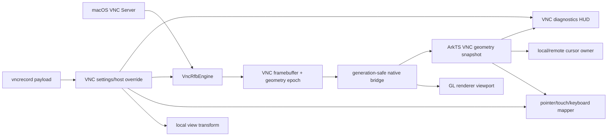

# VNC macOS 画面、输入、显示设置与性能看板完整修复计划

- 日期：2026-07-29
- 当前实施基线：本地 `main@6277705c9`（P0 几何/输入同步已提交）
- 状态：P0、P1 和当前 RAW 能力范围内的 P2 已实施并通过自动化/独立复核；等待真机验收
- 实施分支：用户明确授权的本地 `main`；不推送、不创建 PR、不合并远端 `main`
- 优先级：P0 可用性 → P1 完整设置与诊断 → P2 编码、画质与能力式分辨率
- 云端约束：继续只使用一张 `vncrecord`；不增加云表，不增加物理字段

## 0. 实施前门禁

当前工作树存在另一任务的 RDP/native 未提交修改。VNC 实施开始前必须先由其所有者完成、
提交或明确归档；不得 stash、reset、覆盖或混入 VNC 提交。工作树干净后，严格按
`AGENTS.md` 执行：

1. 同步并确认 `main`、`origin/main` 和活动任务状态。
2. 从干净基线创建唯一活动分支 `codex/vnc-macos-display-input-settings-repair`。
3. 每个任务先补失败测试，再做最小实现；只暂存该任务列出的文件。
4. 每个里程碑分别运行 native、ArkTS、Hvigor、合规和实机门禁。
5. 独立 reviewer 复核通过后才能合并；不得直接把未复核代码留在 `main`。

本计划不重新审查已经通过的 VNC 主机 CRUD、密码持久化、AES-GCM/`plain-v1`、
`vncrecord` 云同步、Gateway/Repeater、FAB 或经典主机卡逻辑。只有新设置字段的版本化
payload、会话读取和同步兼容性属于本计划。

## 1. 已确认的现场证据

2026-07-29 API 23 真机、USB 设备 `3BKGK24B06000015` 的日志已经证明：

| 证据 | 现场值 | 结论 |
| --- | --- | --- |
| VNC 连接 | `state=2 VNC 已连接` | TCP、RFB 握手和认证不是当前主因 |
| 服务端 framebuffer | `2940x1912` | Mac 提供的是当前真实桌面尺寸 |
| 完整 Raw 帧大小 | `22485120` bytes | `2940 × 1912 × 4`，BGRA 尺寸正确 |
| 送显计数 | 至少从 1 持续到 5100 | 不是“服务端只发送第一帧” |
| native 呈现 | `result=0` | native 提交未被 Surface 拒绝 |
| ArkTS 输入几何 | `remote=1920x1080` | 输入层仍使用占位尺寸，和真实 framebuffer 脱节 |
| 系统光标 | 连接后 `system pointer visible=0` | 本地光标被隐藏 |
| 远端光标 | `remote-cursor polling stopped` | 当前 VNC 没有可见远端光标的可靠来源 |
| 鼠标输入 | 已产生 touchpad prediction，但 `remote echo not observed` | 输入进入客户端队列，但坐标和光标确认链路不成立 |

因此本轮不得再把根因归类为“Mac 没有持续推帧”或“网络断流”。P0 根因固定为：

1. native framebuffer 几何未成为 ArkTS、renderer、输入和画中画的唯一真源；
2. VNC 会话隐藏系统鼠标，却没有 Cursor pseudo-encoding 或稳定本地预测光标兜底；
3. VNC `scalingMode` 已保存但没有接入 `RemoteDesktop`；
4. 会话输入、浮动控制和组合键面板仍沿用共享占位几何或不准确的全局位置比例；
5. VNC 设置只具备密集的基础开关，没有形成显示、画质、输入和性能的完整产品模型。

## 2. 官方协议与产品边界

### 2.1 macOS 行为

Apple 屏幕共享打开后，VNC viewer 应能查看并控制 Mac 当前桌面；若使用 VNC 密码，
Mac 端必须开启“VNC 显示程序可以使用密码控制屏幕”。普通屏幕共享默认看到当前登录
用户正在使用的显示内容。Apple Remote Desktop 的“虚拟显示”是额外产品能力，不能
自动等同于普通密码 VNC：

- <https://support.apple.com/zh-cn/guide/mac-help/-mh11848/mac>
- <https://support.apple.com/en-ca/guide/remote-desktop/apd4f46319e/mac>

### 2.2 RFB 行为

RFB PointerEvent 使用 framebuffer 绝对 `x/y` 坐标，因此画面与输入必须共享同一
实际尺寸和变换。客户端可以用 `SetEncodings` 声明编码和 pseudo-encoding；服务端通过
FramebufferUpdate/DesktopSize 报告画面变化。远端分辨率改变只能在确认服务端支持相应
扩展后请求，不能把本地缩放包装成远端分辨率：

- RFC 6143：<https://datatracker.ietf.org/doc/rfc6143/>
- RFB 扩展注册：<https://github.com/rfbproto/rfbproto>

### 2.3 编码与安全

当前项目自有 RFB engine 只允许 Raw、CopyRect、DesktopSize、LastRect。P2 引入 ZRLE/
Tight 前必须固定安全实现、添加畸形输入测试并复核上游安全公告。不得直接启用一个
“画质”开关却继续只传 Raw。LibVNCServer 官方安全策略说明安全修复以 master 为主，
下游必须明确固定并审计节点：

- <https://github.com/LibVNC/libvncserver/security>

### 2.4 HarmonyOS 边界

- XComponent Surface 实际像素尺寸、ArkUI 本地 vp 坐标和远端 framebuffer 像素必须
  通过一个几何策略转换；不得按数值大小猜测单位。
- `bindSheet` 用于设置叶子项；面板内容使用实际可用窗口尺寸和安全区，避免固定高度
  内层滚动。
- native worker 不直接操作 ArkTS 对象；尺寸、帧和 cursor 事件继续走现有
  generation-safe N-API 边界。
- 本计划继续以 HarmonyOS NEXT API 23 编译为准，不使用更高 API 独占接口。

## 3. 目标体验与完成定义

### 3.1 Mac VNC 正常体验

连接成功后必须满足：

1. 首帧后持续显示 Mac 当前桌面；大面积变化、窗口移动、视频和小脏区均能刷新。
2. 默认“适应窗口”，保持远端宽高比；可切换 100%、整数缩放、自由缩放/平移。
3. 性能 HUD 显示实际远端尺寸 `2940×1912`，不能继续显示请求占位值 `1920×1080`。
4. 触控板模式始终存在本地预测指针；直接触控准确映射；键鼠模式使用系统指针。
5. 左/右/中键、按住拖动、滚轮、键盘、组合键和三指控制台均可用。
6. 服务器提供 Cursor pseudo-encoding 时显示远端真实 cursor；未提供时自动使用本地
   箭头/圆环，不能出现“两个光标都没有”。
7. 旋转、Surface 重建、前后台恢复、缩放改变和 DesktopSize 后，不继承旧坐标。
8. 组合键面板从当前悬浮胶囊附近展开，始终完整位于安全可视区；横竖屏位置独立。

### 3.2 设置页目标

VNC 顶级设置保持独立，叶子项使用 `bindSheet`，拆为：

1. **连接与安全**：传输、端口、超时、安全策略、TLS、只读默认。
2. **显示与画面**：本地缩放、画质预设、编码、色深、帧率上限、远端尺寸能力。
3. **输入与光标**：触控板/直触/键鼠、指针样式、速度、按钮交换、滚轮方向。
4. **性能监视**：显示 HUD、默认展开、刷新间隔、显示指标、位置恢复。
5. **剪贴板**：文本能力和只读限制。
6. **云同步**：继续使用现有 VNC 逻辑 scope，不增加物理表。

### 3.3 不在本计划中

- Apple High Performance Screen Sharing 私有协议；
- Apple 账户认证、ARD 管理功能或虚拟显示承诺；
- VNC 音频、文件传输；
- WebSocket Gateway、SSH tunnel 或公网 relay Phase 2；
- 对 RDP、RustDesk、SSH/SFTP 设置模型进行顺带重构。

## 4. 目标架构



核心约束：

- `framebufferWidth/framebufferHeight + geometryEpoch` 是远端几何唯一真源。
- renderer source、输入映射、cursor、HUD 和 PIP 读取同一个 snapshot。
- Surface 尺寸变化只改变本地 viewport；DesktopSize 才改变远端 framebuffer。
- 本地缩放不修改远端分辨率。
- VNC 设置和主机覆盖仍由 `VncSettingsService`/`VncHostService` 拥有。

## 5. 数据模型升级

### 5.1 新设置字段

在 `VncSettingsValues` 增加以下版本化字段；字段名在实施时固定后不得复用：

| 字段 | 类型/候选值 | 默认 | 所有者 |
| --- | --- | --- | --- |
| `displayScaleMode` | `fit/100/integer/custom` | `fit` | VNC settings |
| `customScalePercent` | 50–300 | 100 | VNC settings |
| `imageQualityPreset` | `speed/balanced/quality/custom` | `balanced` | VNC settings |
| `preferredEncoding` | `auto/zrle/tight/raw` | `auto` | VNC settings |
| `colorDepth` | `auto/32/16/8` | `auto` | VNC settings |
| `frameRateLimit` | `15/30/60/0` | 30 | VNC settings |
| `jpegQuality` | 0–9 | 6 | VNC settings，只有 Tight/JPEG 能力可用时生效 |
| `localCursorMode` | `auto/arrow/circle/hidden` | `auto` | VNC settings |
| `touchpadSpeed` | 50–200 | 100 | VNC settings |
| `reverseWheel` | boolean | false | VNC settings |
| `swapMouseButtons` | boolean | false | VNC settings |
| `showDiagnostics` | boolean | false | 已有，保留 |
| `diagnosticsExpanded` | boolean | false | VNC settings |
| `diagnosticsRefreshMs` | 250/500/1000 | 500 | VNC settings |
| `diagnosticsMetricMask` | bounded integer/string set | 默认核心指标 | VNC settings |

现有 `scalingMode=fit/integer/one_to_one/pan` 不能直接删除。迁移规则：

- `fit` → `displayScaleMode=fit`
- `one_to_one` → `displayScaleMode=100`
- `integer` → `displayScaleMode=integer`
- `pan` → `displayScaleMode=100`，保留允许平移
- 缺失/非法值 → `fit`

### 5.2 主机覆盖

主机只保存确有必要的 override，不复制整份全局设置：

- `displayOverrideEnabled`
- `displayScaleMode`
- `imageQualityOverrideEnabled`
- `imageQualityPreset`
- `inputOverrideEnabled`
- `controlMode`
- `viewOnly`
- `localCursorMode`

最终 effective config 必须由纯策略函数计算：

```text
effective = defaults
          + validated host overrides
          + runtime server capabilities
          + transient session choices
```

### 5.3 云同步

- 唯一云表仍为 `vncrecord`，19 个物理字段完全不变。
- `recordtype=settings` 和 `recordtype=host` 的 canonical JSON payload 升级 schemaVersion。
- 新设备读取旧 payload 时填入安全默认值，不回写云端，直到用户实际修改。
- 旧设备读取包含未知新字段的行时必须按现有 wire/payload 策略安全处理，不得清空整行。
- 画面设置均为非敏感数据；不得进入 `ciphertext`。
- 性能实时值、HUD 位置、当前 framebuffer、服务器能力和连接统计仅保存在本机，不上传。
- 横/竖屏组合键面板位置属于本地 UI 状态，不进入 `vncrecord`。

## 6. 分阶段任务

## P0：恢复真实画面几何和完整控制

### Task 1：锁定几何与输入失败测试

**修改/新增：**

- `entry/src/main/cpp/test/vnc_rfb_engine_test.cpp`
- `entry/src/main/cpp/test/rdp_native_test_main.cpp` 或当前 native test registry
- `entry/src/ohosTest/ets/test/VncGeometryPolicy.test.ets`
- `entry/src/ohosTest/ets/test/RemoteSurfaceTransformPolicy.test.ets`

**先写失败测试：**

1. ServerInit `2940×1912` 后 diagnostics/capability snapshot 返回相同尺寸。
2. DesktopSize 改为 `2560×1440` 时 geometryEpoch 单调递增。
3. `843×373vp`、renderer source `2940×1912` 下四角和中心点准确映射。
4. 旧 `1920×1080` snapshot 在 epoch 变化后不能继续发送输入。
5. 旋转、Surface generation 变化和断线重连清理旧 transform。

**提交：**

`test(vnc): lock framebuffer geometry and input mapping contract`

### Task 2：native 发布真实 framebuffer geometry

**修改：**

- `entry/src/main/cpp/vnc/vnc_rfb_engine.h`
- `entry/src/main/cpp/vnc/vnc_rfb_engine.cpp`
- `entry/src/main/cpp/vnc/vnc_adapter.h`
- `entry/src/main/cpp/vnc/vnc_adapter.cpp`
- `entry/src/main/cpp/extensions/protocol_adapter.h`
- `entry/src/main/cpp/extensions/extension_loader_napi.cpp`
- `entry/src/main/ets/services/ExtensionLoader.ets`

**实现要求：**

1. 增加只读 `VncGeometrySnapshot`：
   `width/height/geometryEpoch/frameSequence/lastFrameAtMs`。
2. ServerInit 初始化 epoch；DesktopSize 仅在合法尺寸变化时递增。
3. snapshot 绑定 sessionId + native generation；旧会话查询返回 unavailable。
4. 不在每一帧创建 ArkTS 对象回调风暴；复用 diagnostics poll 或有界事件。
5. 保持最大边长、像素数、stride 和字节数溢出校验。

**验收：**

- native tests 覆盖 ServerInit、DesktopSize、重连、畸形尺寸和 generation。
- RDP/RustDesk adapter ABI 和行为不变。

**提交：**

`feat(vnc): expose authoritative framebuffer geometry`

### Task 3：ArkTS 采用 VNC 几何唯一真源

**修改：**

- `entry/src/main/ets/pages/RemoteDesktop.ets`
- `entry/src/main/ets/services/RemoteSurfaceTransformPolicy.ets`
- `entry/src/main/ets/services/RemoteSessionPipService.ets`（仅必要时）

**实现要求：**

1. VNC 首个有效 geometry snapshot 到达后调用统一 `updateRemoteSize()`。
2. 更新 renderer source cache、PIP content size、cursor transform 和 diagnostics。
3. geometryEpoch 变化时：
   - 释放所有按键和鼠标按钮；
   - 取消旧触摸/拖动/双指 ownership；
   - 清理 touchpad anchor/prediction；
   - 失效 renderer viewport cache；
   - 重新居中或按用户 VNC 缩放设置恢复。
4. 输入发送前核对 transform epoch；不匹配时丢弃该事件并等待下一次有效几何。
5. 删除 VNC 会话对固定 `1920×1080` 的控制依赖；该尺寸只可作为首帧前渲染占位。

**设备判据：**

- 日志同时显示 `framebuffer=2940x1912` 和 `mapInput ... desktop=2940x1912`。
- 远端四角、菜单栏、Dock 和屏幕中心都可准确点击。

**提交：**

`fix(vnc): synchronize renderer and input to framebuffer geometry`

### Task 4：VNC 光标 ownership 和本地预测兜底

**修改：**

- `entry/src/main/cpp/vnc/vnc_rfb_engine.*`
- `entry/src/main/cpp/vnc/vnc_types.h`（如存在）
- `entry/src/main/ets/pages/RemoteDesktop.ets`
- `entry/src/main/ets/services/RemoteCursorStylePolicy.ets`
- `entry/src/main/ets/components/RemoteCursorOverlay.ets`
- 对应 native/ArkTS tests

**实现要求：**

1. `SetEncodings` 声明经过测试的 Cursor pseudo-encoding 和 pointer position 能力。
2. 有远端 cursor shape/position 时复用现有 `RemoteCursorStore`，但以 VNC capability
   标识来源。
3. 没有远端 cursor 时：
   - 触控板模式：显示本地预测箭头或圆环；
   - 直接触控：按设置短暂显示触点；
   - 键鼠模式：显示 HarmonyOS 系统指针。
4. 只有“另一个可见 cursor owner 已准备好”时才能隐藏系统指针。
5. `localCursorMode=hidden` 也必须保留可恢复入口，并在无远端 cursor 时给出明确风险提示。
6. VNC 不依赖 RustDesk/FreeRDP cursor polling 才能显示指针。

**测试：**

- cursor capability present/absent、shape change、hotspot、隐藏、断线、epoch 变化；
- 系统指针和 overlay 不能同时消失；
- viewOnly 只阻止发送，不应让本地指针消失。

**提交：**

`fix(vnc): guarantee visible cursor and pointer ownership`

### Task 5：键鼠、触控、虚拟键盘和三指控制回归

**修改：**

- `entry/src/main/ets/pages/RemoteDesktop.ets`
- `entry/src/main/ets/services/RemoteSessionCapabilityPolicy.ets`
- VNC input/native focused tests

**实现要求：**

1. `viewOnly=false` 时开放 PointerEvent、KeyEvent、滚轮和允许的 ClientCutText。
2. `viewOnly=true` 时控制面板仍可打开；键鼠发送明确禁用并显示原因。
3. 三指手势只打开本地控制面板，不向 Mac 发送鼠标事件。
4. 虚拟键盘、修饰键和快捷键统一走现有按键队列，断线/失焦释放全部按键。
5. VNC Ctrl/Alt/Shift/Meta 使用标准 keysym；不能复用 RDP scancode 语义。
6. 鼠标按钮状态在 DesktopSize、Surface 重建、后台和断线时归零。

**提交：**

`fix(vnc): restore complete remote control surface`

## P1：独立显示、输入、性能设置与面板布局

### Task 6：升级 VNC 设置/主机 payload 和迁移

**修改：**

- `entry/src/main/ets/services/VncModelPolicy.ets`
- `entry/src/main/ets/services/VncSettingsService.ets`
- `entry/src/main/ets/services/VncHostService.ets`
- `entry/src/main/ets/services/VncRecordPolicy.ets`
- `entry/src/main/ets/services/VncCloudSyncService.ets`（仅 schema 投影）
- 对应 ohosTest

**实现要求：**

1. 添加第 5 节字段、范围校验、canonical serialization 和纯函数 effective config。
2. 迁移旧 `scalingMode`，保留旧 payload 可读。
3. VNC 新主机默认值从 `VncSettingsService.get()` 获取，而不是再次调用静态默认值。
4. 默认 `viewOnly` 产品决策改为：
   - 新安装默认可控制；
   - 用户显式选择只读才阻止输入；
   - 旧主机保留已保存值，不静默改变。
5. 云端物理 schema、scope、加密和 tombstone 行为不变。

**测试：**

- v1/v2 payload 迁移、非法值、未知值、旧设备兼容、同步选择关闭；
- 主机 override 与全局默认组合；
- 设置同步失败回滚。

**提交：**

`feat(vnc): version display input and diagnostics settings`

### Task 7：VNC 会话只读取自己的 effective settings

**修改：**

- `entry/src/main/ets/pages/RemoteDesktop.ets`
- `entry/src/main/ets/services/VncSessionSettingsPolicy.ets`（新增）
- tests

**实现要求：**

1. 路由解析 VNC host 后一次性生成 immutable effective settings。
2. 接通显示缩放、cursor、速度、滚轮、按钮、HUD 和 native 质量配置。
3. 不读取 `rustdeskImageQuality`、`rustdeskCodec`、`rdpControlMode` 等协议设置。
4. 会话内临时调整只影响当前连接；用户明确“设为默认”后才写 VNC settings。
5. 设置写入失败不应断开当前会话。

**提交：**

`refactor(vnc): isolate effective session preferences`

### Task 8：重构 VNC 设置页为 bindSheet 叶子结构

**修改：**

- `entry/src/main/ets/pages/VncSettingsPage.ets`
- `entry/src/main/ets/services/SettingsSheetRoutePolicy.ets`（如路由需要）
- 可复用的 VNC settings components/builders
- UI policy tests

**页面结构：**

VNC 顶级页只显示六张摘要卡；点击卡片用 `bindSheet` 打开：

1. 连接与安全；
2. 显示与画面；
3. 输入与光标；
4. 性能监视；
5. 剪贴板；
6. 云同步。

**UI 要求：**

- 手机横屏优先 CENTER，空间不足时自适应；Phone 竖屏可使用 BOTTOM。
- Sheet 使用 `FIT_CONTENT`/可用高度约束，不嵌套固定高度滚动。
- 不出现一行四个拥挤按钮；用单选卡、列表行或二级 Sheet。
- 不支持的编码/远端分辨率显示能力原因，不显示可点击假开关。
- “性能监视”使用用户能理解的名称，不再只叫“连接诊断”。
- 保存动作固定可见，任何字段变更都能保存。

**提交：**

`feat(vnc): split settings into adaptive sheets`

### Task 9：完整 VNC 性能监视看板

**修改：**

- `entry/src/main/ets/components/RustDeskDiagnosticsHud.ets` 或拆出协议无关
  `RemoteSessionDiagnosticsHud.ets`
- `entry/src/main/ets/pages/RemoteDesktop.ets`
- `entry/src/main/ets/services/SessionDiagnosticsPolicy.ets`
- native diagnostics snapshot
- tests

**必须显示：**

- 远端实际分辨率；
- Surface/renderer 尺寸；
- 服务器帧更新率；
- native frame emitted；
- presented frame count；
- presentation rejected；
- 最后服务器帧年龄；
- 最后送显年龄；
- 当前编码；
- 接收速率和累计字节；
- dirty rect 尺寸/占比；
- geometryEpoch；
- 输入发送/丢弃计数；
- stall 分类：服务器停更、解码停滞、送显停滞、Surface 未就绪。

**隔离要求：**

- 可以复用视觉组件，数据源和文案必须按 protocol typed snapshot 注入。
- VNC 普通 HUD 不显示 RustDesk Pro 指标。
- HUD 位置只保存在本机；VNC 和 RustDesk 可共用通用 UI preference，但不得共享
  业务开关或错误状态。

**提交：**

`feat(vnc): add actionable performance diagnostics`

### Task 10：修复组合键悬浮面板展开位置

**修改：**

- `entry/src/main/ets/pages/RemoteDesktop.ets`
- `entry/src/main/ets/components/RemoteModifierPanel.ets`
- 新增 `RemoteFloatingPanelPlacementPolicy.ets`
- 对应测试

**实现要求：**

1. 面板通过 `onAreaChange` 获得实际宽高，不再只用 `260×238vp` 固定估算。
2. 首次打开以悬浮胶囊 anchor 为基准，按可用四象限选择遮挡最少的位置。
3. 使用 safe-area、状态栏、键盘区域和当前横竖屏计算 bounds。
4. 主修饰键面板和快捷键面板分别保存 portrait/landscape 本地位置。
5. 用户没有拖动时，旋转后重新锚定；用户拖动后按对应方向恢复并 clamp。
6. 展开/收起 Fn 层后重新测量和 clamp，不能让底部被裁切。
7. 清理旧的全局错误 ratio 时只做版本化迁移，不影响其他协议正在使用的正常位置。

**测试矩阵：**

- `373×843`、`843×373`、平板、PC；
- 左/右侧胶囊；
- 系统键盘打开/关闭；
- 主面板、快捷键面板、Fn 展开；
- 旋转两次不累计漂移。

**提交：**

`fix(remote-ui): anchor modifier panels to visible bounds`

## P2：画质、编码和能力式远端分辨率

### Task 11：建立编码 decoder 安全门

**候选修改：**

- `entry/src/main/cpp/vnc/vnc_rfb_engine.*`
- 新增 `vnc_zrle_decoder.*`
- 新增 `vnc_tight_decoder.*`（只有安全门通过才实施）
- `entry/src/main/cpp/CMakeLists.txt`
- focused fuzz/fixture tests
- NOTICE/SBOM/provenance（若引入第三方代码或库）

**实施顺序：**

1. 首先实现/引入 ZRLE，包含 zlib 边界、tile、palette、run length 和输出上限。
2. Tight 作为独立提交；在确认 2026 Tight/Gradient 安全修复后才能启用。
3. 每个 decoder 对畸形长度、整数溢出、短读、超大 tile 和取消进行测试。
4. `SetEncodings` 根据用户偏好和已编译能力动态排列：
   `CopyRect → ZRLE/Tight → Raw → pseudo encodings`。
5. 服务器选择未声明或未实现编码时明确失败，不静默解析。

**测试：**

- 官方/上游 fixture、随机截断、恶意长度、跨矩形流、断线恢复；
- arm64-v8a、x86_64；
- ASan/UBSan host test（可用时）；
- 真实 macOS Screen Sharing 互操作。

**提交拆分：**

- `feat(vnc): add bounded zrle decoding`
- `feat(vnc): add audited tight decoding`（条件满足时）

### Task 12：画质预设、色深和帧率策略

**修改：**

- VNC settings/model
- native connection config/N-API
- RFB SetPixelFormat/SetEncodings
- frame request/presentation pacing policy
- diagnostics
- tests

**预设定义：**

| 预设 | 编码 | 色深 | 帧率 | 用途 |
| --- | --- | --- | --- | --- |
| 速度 | ZRLE/Tight 优先 | 16 或 auto | 30/60 | 交互优先 |
| 平衡 | auto | 32/auto | 30 | 默认 |
| 画质 | Tight/ZRLE 高质量 | 32 | 30 | 文本/图像清晰 |
| 自定义 | 用户选择 | 用户选择 | 15/30/60 | 专家设置 |

**约束：**

- 服务端不支持时自动降级并在 HUD 展示“请求值/生效值”。
- frameRateLimit 控制客户端请求/呈现节奏，不丢失最终 dirty state。
- 不能通过重复提交同一小 rect 制造虚假 FPS。
- 大 Raw 帧不能在 ArkUI 线程复制。

**提交：**

`feat(vnc): add negotiated image quality policy`

### Task 13：远端分辨率能力探测

**修改：**

- VNC capability snapshot
- RFB engine（仅确认扩展契约后）
- VNC 显示 Sheet
- tests

**产品规则：**

1. 永远显示只读“远端当前分辨率”。
2. 普通 macOS VNC 未声明可变尺寸时，远端分辨率选择禁用，说明“请在 Mac 显示器
   设置中修改”。
3. 只有确认 ExtendedDesktopSize/SetDesktopSize capability 后显示可选分辨率。
4. 请求失败不修改本地 remote geometry；等服务端 DesktopSize 确认后才提交。
5. 超时、拒绝、部分屏幕和多显示器布局均明确处理。
6. 不宣称支持 Apple Remote Desktop 虚拟显示。

**提交：**

`feat(vnc): gate remote resolution by server capability`

## 7. 生命周期和并发要求

每个里程碑都必须覆盖：

- 首次连接和重复连接；
- 断开后立即重连；
- app 前台/后台；
- Surface 销毁/重建；
- 横竖屏旋转；
- PIP 进入/退出；
- 网络中断、超时和服务器主动关闭；
- DesktopSize 与帧更新并发；
- 旧 session callback 到达新页面；
- 键盘、鼠标按钮和 modifier 清理。

不变量：

1. 一个 session generation 只能更新自己的 Surface 和 geometry。
2. geometryEpoch 变化前的输入不能发送到新 framebuffer。
3. decoder 和 framebuffer 内存有硬上限。
4. disconnect 可取消阻塞读取并在规定时间 join。
5. VNC 故障不能停止 RDP、RustDesk、SSH/SFTP 服务。

## 8. 自动化验证门

每个代码任务至少执行与其范围匹配的定向测试。里程碑完成时统一执行：

```sh
cmake -S entry/src/main/cpp -B build/rdp-native-tests -DRDP_BUILD_TESTS=ON
cmake --build build/rdp-native-tests --target rdp_native_tests --config Release
./build/rdp-native-tests/rdp_native_tests

source scripts/macos_env.sh
hvigorw --mode module -p module=entry -p product=default \
  default@OhosTestCompileArkTS --analyze=normal --parallel --incremental --no-daemon
hvigorw --mode module -p module=entry -p product=default \
  assembleHap --analyze=normal --parallel --incremental --no-daemon
```

并执行：

- `ohosTest@OhosTestCompileArkTS`（任务注册修复后；当前 `00306054` 必须继续如实记录）
- `git diff --check`
- `git diff --cached --check`
- Light 开源合规门
- 双 ABI 构建（涉及 C/C++ decoder、依赖或 ABI 时）
- reviewer 独立只读复核

构建成功不能代替 Mac 真机验收。

## 9. 实机验收矩阵

### 9.1 Mac 端

- Apple Silicon Mac 当前用户桌面；
- 屏幕共享 + VNC 密码控制；
- Retina 实际尺寸（本次 `2940×1912`）；
- 至少再测试 1920×1080、2560×1440 或另一台 Mac；
- 静态桌面、窗口拖动、Mission Control、浏览器滚动、视频；
- 登录屏幕/锁屏（系统允许范围内）；
- Mac 显示器分辨率切换；
- Mac 睡眠/唤醒。

### 9.2 HarmonyOS 端

- Phone 小横屏、小竖屏；
- Pad；
- PC/外接键鼠；
- USB 和 Wi-Fi；
- 触控板、直接触控、键鼠；
- 圆环、箭头、远端 cursor；
- 虚拟键盘、组合键、三指控制台；
- 性能 HUD 展开/收起/拖动；
- 旋转、后台、PIP、网络切换。

### 9.3 必须保存的验收证据

- 安装的 signed HAP SHA-256；
- commit；
- 设备型号/API；
- Mac/macOS 版本和 VNC 设置；
- framebuffer、Surface、viewport 和 input mapping 日志；
- 至少 60 秒连续帧统计；
- 鼠标四角/中心点击结果；
- 设置保存、重启和同账号新设备同步结果；
- RDP/RustDesk/SSH 回归结果。

## 10. 回归矩阵

VNC 每个里程碑完成后必须确认：

| 协议 | 必测 |
| --- | --- |
| RDP | 连接、画面、输入、虚拟键盘、组合键、分辨率/缩放、性能 HUD |
| RustDesk | 直连/中继、画面、cursor、触控、显示切换、Pro HUD |
| SSH/SFTP | 终端输入、键盘、会话、文件页 |
| VNC | 直连 Mac、Repeater mode12 基础回归、主机保存/编辑/删除、云同步 |

尤其要防止：

- VNC geometry poll 覆盖 RDP/RustDesk remote size；
- VNC 设置读取通用/RustDesk 图像质量键；
- 通用 panel position 迁移破坏其他协议已有布局；
- 新 `vncrecord` payload 让旧 host/secret/trust 行失效；
- decoder 依赖改变 RDP/RustDesk native 链接。

## 11. 交付与提交序列

建议提交顺序固定为：

1. `test(vnc): lock framebuffer geometry and input mapping contract`
2. `feat(vnc): expose authoritative framebuffer geometry`
3. `fix(vnc): synchronize renderer and input to framebuffer geometry`
4. `fix(vnc): guarantee visible cursor and pointer ownership`
5. `fix(vnc): restore complete remote control surface`
6. `feat(vnc): version display input and diagnostics settings`
7. `refactor(vnc): isolate effective session preferences`
8. `feat(vnc): split settings into adaptive sheets`
9. `feat(vnc): add actionable performance diagnostics`
10. `fix(remote-ui): anchor modifier panels to visible bounds`
11. `feat(vnc): add bounded zrle decoding`
12. `feat(vnc): add audited tight decoding`（安全门满足时）
13. `feat(vnc): add negotiated image quality policy`
14. `feat(vnc): gate remote resolution by server capability`
15. reviewer 修复提交（如有）
16. 状态文档与最终验收记录

P0、P1、P2 必须能分别回滚。P2 decoder/画质不得和 P0 输入几何修复揉成一个提交。

## 12. 停止条件与回滚

出现下列任一情况立即停止对应能力启用：

- decoder 安全公告未确认或 fixture/fuzz 失败；
- Mac 不接受声明编码且无法安全回退 Raw；
- DesktopSize 后 input epoch 仍可能错配；
- 两种 cursor owner 可能同时不可见；
- 新设备同步会覆盖云端设置或破坏旧 payload；
- RDP/RustDesk/SSH 任一回归；
- Hvigor 任一强制门失败；
- signed HAP 不是本次 commit 的产物。

回滚策略：

- P0：feature flag 回到旧 VNC runtime，但保留日志；若旧 runtime 不可控则阻止发布。
- P1：读取新 payload，UI 回退安全默认；不删除云端新字段。
- P2：按编码 capability 单独关闭 ZRLE/Tight/远端分辨率，Raw 保底仍可连接。
- 不回滚或重建 `vncrecord`；不写逆向 tombstone。

## 13. 最终完成判据

只有全部满足才可宣称“VNC 到 Mac 画面和控制完整可用”：

- [ ] Mac 持续画面至少 30 分钟无首帧停滞；
- [ ] framebuffer、renderer、input 使用相同实际几何；
- [ ] 触控板、直触、键鼠均可控制；
- [ ] 本地/远端至少一个 cursor 始终可见；
- [ ] 三指控制台、虚拟键盘、组合键完整可用；
- [ ] 组合键面板横竖屏无漂移、无裁切；
- [ ] VNC 显示、输入、性能设置使用独立 bindSheet；
- [ ] 性能 HUD 可区分服务端、decoder、renderer 和 Surface 停滞；
- [ ] 画质设置与真实协商编码一致；
- [ ] 远端分辨率只在服务端 capability 明确支持时开放；
- [ ] `vncrecord` 物理 schema 不变，旧/新设备同步通过；
- [ ] RDP、RustDesk、SSH/SFTP 回归通过；
- [ ] native、ArkTS、Hvigor、双 ABI、合规和 reviewer 门全部通过；
- [ ] exact signed HAP 在 API 23 设备完成实机验收。

## 14. 2026-07-29 实施检查点

以下内容属于本计划本轮已完成的代码范围，后续 session 不得因上下文压缩重复审查
已经提交并通过的 P0：

1. P0 已提交为 `6277705c9 fix(vnc): synchronize input to framebuffer geometry`。
2. VNC 设置模型新增本地缩放、画质预设、实际可用编码、色深、帧率、输入/光标和
   性能看板字段；设置仍只写入唯一 `vncrecord` 的 `recordtype=settings` JSON payload，
   不增加云表或物理字段。
3. VNC 顶级设置已拆为连接与安全、显示与画面、输入与光标、性能监视、剪贴板、
   云同步、Trust、主机和 Gateway 叶子项，并继续使用现有 `bindSheet`。
4. Runtime 已应用 VNC 独立的适应窗口、100%、整数倍率和自定义缩放；触控板速度、
   滚轮方向、左右键交换、本地圆点/官方 Symbol 箭头兜底及诊断采样均不读取
   RDP/RustDesk/SSH 设置。
5. Native 仅对已经审计的 RAW/CopyRect 路径提供 8/16/32 位 true-color 协商和
   15/30/60/不限帧率请求节流；RFB 客户端写操作通过独立 mutex 保证控制包与刷新请求
   不会在 TCP 字节流中交错。
6. ZRLE、Tight/JPEG、远端分辨率修改继续保持禁用。UI 明确说明普通 macOS VNC 的
   framebuffer 尺寸来自 Mac 当前显示器设置，不能把本地缩放冒充远端分辨率。
7. 组合键浮动面板使用实际测量尺寸、可视区 clamp、主面板邻接定位和横竖屏独立位置；
   未改变其他协议的按键发送或会话所有权。
8. 主机显示策略新增显式 `displayOverrideEnabled`：新主机默认继承 VNC 全局显示设置，
   旧 payload 缺少该字段时按“保留旧主机缩放”迁移；全局默认变化不再改变覆盖语义。
   HostList 冷启动会先初始化 `VncSettingsService`，FAB 与经典编辑器读取同一默认快照。
9. 性能看板分别记录服务器帧到达和最后成功送显时间，并展示送显拒绝、dirty rect、
   请求/实际色深、直连/Repeater 路径和会话输入提交；完整 BGRA 累计量明确标为
   “帧缓冲处理量”，不再冒充 wire bytes。由此可区分服务器停更和本地送显停滞。
10. `quality` 在 Retina 大 framebuffer 上保持 32 位；15/30/60 FPS 间隔改为向上取整，
    refresh request 通过独立 mutex 串行化且等待期间不占用输入写 mutex。VNC `auto`
    光标不再读取共享 `virtualMouseStyle`，官方箭头增加深色描边层。
11. 组合键 companion 在无完全无重叠空间时按最小重叠面积选择位置；新增
    `373×843` 且软键盘占据底部的测试。最终自动化证据为 native `159/159`、
    `default@OhosTestCompileArkTS`、signed `assembleHap`、Light 合规和
    `git diff --check` 全部通过；同一独立 reviewer 对上一轮 8 项发现复查为 PASS。

本检查点只代表代码实现完成。最终“VNC 到 Mac 完整可用”仍须满足第 13 节的 API 23
实机、真实 Mac、连续帧、输入与多协议回归验收。
