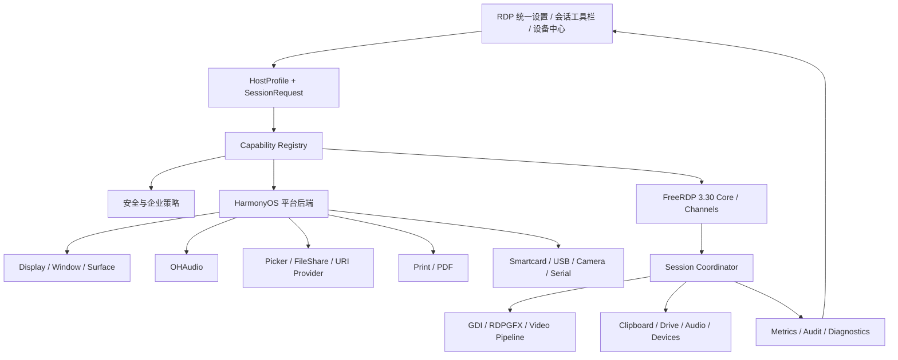

# RDP / FreeRDP / HarmonyOS 全功能对齐、用户全生命周期与统一 UX 升级主计划

- 计划日期：2026-07-30（Asia/Shanghai）
- 审计项目：`RemoteDeskHarmonyOS`
- 计划落盘基线：`codex/cloud-data-lifecycle-root-fix@7a07321a3`
- FreeRDP 当前 gitlink：`dae8276ac7361b8d14f7b87d41163fe03dbb944e`
- FreeRDP 当前官方目标基线：签名发布版 `3.30.0@6b107f0`
- 目标平台：HarmonyOS NEXT API 23，`arm64-v8a` 与 `x86_64`
- 文档状态：主计划已落盘，尚未开始模块实施
- 本轮约束：只新增本计划；不修改 ArkTS、C/C++、FreeRDP gitlink、构建配置、测试或产品数据
- 总体优先级：安全基线与能力真实性 → 会话生命周期与画面 → 动态分辨率与多屏 → 数据/音频/设备 → 企业能力 → 长尾通道

## 0. 结论先行

当前产品已经具备可工作的基础 RDP 客户端能力：真实 FreeRDP 链接、TLS/NLA、证书预检与
指纹约束、Restricted Admin、经典 Software GDI 画面、键鼠输入、远端音频播放、双向文本
剪贴板、本机到远端文件剪贴板，以及应用沙箱目录的 RDPDR 文件盘映射。

但它还不能被定义为“FreeRDP 官方完整功能对齐客户端”，主要原因不是缺少几个设置项，而是
以下四层没有形成一致闭环：

1. **上游与安全基线未对齐**：当前 OHOS fork 基于较早的官方提交并叠加 2 个本地提交，
   而 FreeRDP `3.30.0` 是包含重要安全修复的签名发布版。
2. **编译能力与产品能力混用**：RDPGFX/FFmpeg、AINPUT、RDPEI 已编译，但生产路径仍关闭；
   `supportsCodec()` 却对外宣称 RDP 支持 H264、H265，造成能力表述不可信。
3. **鸿蒙平台后端缺失**：打印、麦克风、智能卡、原始 USB、相机、串口等能力不能靠打开
   CMake 开关自动获得，需要各自的 HarmonyOS 后端、权限、设备生命周期和安全边界。
4. **用户生命周期没有按高风险设备能力建模**：连接前授权、服务端协商、热插拔、会话中撤销、
   后台/前台、断线重连、账号切换、升级迁移和数据清理必须是一套连续状态机，不能由零散开关
   和 Toast 组成。

本计划采用以下产品定义：

> “对齐”不是 FreeRDP 源码目录存在，也不是 CMake 开关为 ON；只有功能完成平台后端、
> 服务端协商、用户可理解的入口、失败/撤销/恢复生命周期、安全审计和真实设备验收后，
> 才能进入产品可用状态。

计划完成后的目标是：

- 普通用户获得稳定、清晰、可恢复的 Windows 远程桌面体验；
- 专业用户获得多屏、动态分辨率、文件盘、音频输入输出、打印和受控设备重定向；
- 企业用户获得完整 RD Gateway、RemoteApp、受控凭据与策略能力；
- 不支持或尚未验证的能力明确显示原因，不出现“开关可点但实际上无效”的伪功能；
- 任意新增通道失败都能隔离、降级或回退，不得把外设失败升级为整个 RDP 会话断开。

## 1. 计划范围、非目标与实施前门禁

### 1.1 本计划覆盖

- FreeRDP 上游升级、OHOS patch 整理、双 ABI 产物、SBOM、NOTICE、provenance 与哈希。
- RDP 会话连接、取消、断线、自动重连、前后台、Surface、窗口、账号与权限生命周期。
- Software GDI、RDPGFX Progressive、AVC420、AVC444、视频优化通道及可回退渲染。
- 动态分辨率、单屏、多远端显示器、组合画布、显示器切换和 PC 多窗口候选形态。
- 键盘、鼠标、相对鼠标、多点触控、手写笔、IME、光标与焦点管理。
- 远端音频播放、麦克风重定向、输入/输出设备变化和音频焦点。
- 文本剪贴板、双向文件剪贴板、文件传输、目录/移动硬盘文件系统重定向。
- 打印机、智能卡/PIV、安全密钥、原始 USB、串口、并口、摄像头等设备能力。
- TLS/NLA、证书、NTLM/Kerberos、Restricted Admin、Remote Credential Guard、AAD 候选能力。
- RD Gateway、代理、负载均衡、RemoteApp/RAIL、`.rdp` 导入导出和企业策略。
- 统一 UI 信息架构、人因工程、响应式布局、键鼠/触控/焦点/无障碍、错误与恢复设计。
- 单元、集成、互操作、真机、性能、安全、故障注入、升级迁移和发布灰度。

### 1.2 本计划不承诺

- 不承诺 FreeRDP `3.30.0` 没有现成实现的 Windows WebAuthn/FIDO 专用重定向。
- 不承诺 HarmonyOS API 23 普通三方应用一定能获得通用原始 USB 主机访问。
- 不承诺把移动硬盘作为原始 USB 块设备传给 Windows；默认只做用户授权目录的文件系统重定向。
- 不把 FreeRDP 实验性 AV1、旧 TSMF、Remote Assistance、并口等长尾能力设为首发必需项。
- 不在平台后端、权限和真机证据缺失时提前显示可操作的产品开关。
- 不把 Windows 服务端策略、RDS CAL、域策略或硬件固件问题伪装为客户端可修复问题。
- 不修改 RustDesk、SSH/SFTP、VNC 的协议 owner、数据模型或 UI 行为。

### 1.3 当前活动分支约束

本计划落盘时，仓库仍有未完成的 `codex/cloud-data-lifecycle-root-fix` 活动任务，以及用户自有的
SSH、Moonlight、RustDesk、VNC 计划修改。RDP 实施不得直接在当前状态开始。

实施前必须：

1. 完成或明确归档当前活动任务，保留所有用户修改。
2. 回到干净且与 `origin/main` 同步的本地 `main`。
3. 重新读取 `AGENTS.md`、`CURRENT.md`、`QUEUE.md`、`DECISIONS.md`、`HANDOFF.md`。
4. 为每个可独立验收的 RDP 模块创建唯一的 `codex/<task>` 分支；不在一个超大分支中同时
   修改视频、USB、打印、认证和 UI。
5. 每个源代码任务都执行 D-020 独立复核；计划文件本身不构成任何模块已实现的证据。

## 2. 官方依据与采用边界

### 2.1 FreeRDP 官方基线

- [FreeRDP 3.30.0 官方签名发布](https://github.com/FreeRDP/FreeRDP/releases/tag/3.30.0)：
  该版本是安全和缺陷修复发布，作为下一轮 rebase 目标，不继续在旧基线无限叠加补丁。
- [FreeRDP 官方编译说明](https://github.com/FreeRDP/FreeRDP/wiki/Compilation)：
  采用可复现 CMake 配置、显式依赖和通道选择，不依赖宿主机偶然探测结果。
- [FreeRDP 3.30.0 命令行能力定义](https://github.com/FreeRDP/FreeRDP/blob/3.30.0/client/common/cmdline.h)：
  用于核对 `/multimon`、`/monitors`、`/disp`、`/dynamic-resolution`、`/gfx`、`/video`、
  `/drive`、`/printer`、`/smartcard`、`/usb`、`/microphone`、`/gateway`、
  `/auto-reconnect`、`/remoteGuard`、`/app` 等官方能力。
- [RDPGFX 客户端实现](https://github.com/FreeRDP/FreeRDP/tree/3.30.0/channels/rdpgfx/client)：
  采用协议帧边界、surface、Progressive、AVC420/AVC444 与 ACK 语义。
- [Display Control 通道](https://github.com/FreeRDP/FreeRDP/tree/3.30.0/channels/disp/client)：
  动态分辨率与显示器布局更新必须通过正式通道协商，不等同于本地缩放画布。
- [RDPDR/Drive 通道](https://github.com/FreeRDP/FreeRDP/tree/3.30.0/channels/drive/client)：
  目录重定向是文件系统语义，不等同于原始 USB passthrough。
- [Printer 客户端](https://github.com/FreeRDP/FreeRDP/tree/3.30.0/channels/printer/client)：
  上游有 CUPS、Windows、Android 后端，但没有 OHOS 后端。
- [Audin 客户端](https://github.com/FreeRDP/FreeRDP/tree/3.30.0/channels/audin/client)：
  上游有 ALSA、Pulse、OSS、OpenSLES、iOS、macOS 等后端，但没有 OHAudio 后端。
- [Smartcard 客户端](https://github.com/FreeRDP/FreeRDP/tree/3.30.0/channels/smartcard/client)：
  可作为 PIV/CCID 智能卡路径，前提是 OHOS 可提供可靠 PC/SC 或等价适配层。
- [URBDRC/libusb 客户端](https://github.com/FreeRDP/FreeRDP/tree/3.30.0/channels/urbdrc/client)：
  原始 USB 重定向依赖 libusb 和平台 USB 主机能力，不能只开启 `CHANNEL_URBDRC`。
- [RDP 摄像头通道](https://github.com/FreeRDP/FreeRDP/tree/3.30.0/channels/rdpecam/client)：
  上游现有后端不能直接代表 HarmonyOS Camera Kit 已接入。
- [视频优化通道](https://github.com/FreeRDP/FreeRDP/tree/3.30.0/channels/video/client)：
  它是视频优化重定向，不是普通桌面 H264 开关，必须与 RDPGFX 分开建模。

采用边界：

- 优先 rebase 官方签名 tag；OHOS patch 保持最小、可解释、可提交上游。
- 上游存在通道只证明协议层可参考，不证明 HarmonyOS 产品已支持。
- 上游实验能力默认不进入普通用户界面。
- 不复制其他客户端的 UI；只采用协议语义、生命周期和互操作行为。

### 2.2 HarmonyOS 官方平台依据

- [HarmonyOS NEXT 设计指南](https://developer.huawei.com/consumer/cn/design)：
  统一使用系统化的视觉、组件、动效、多设备和输入设计，不另造一套 RDP 视觉语言。
- [应用 UX 体验标准](https://developer.huawei.com/consumer/cn/doc/design-guides/ux-guidelines-overview-0000001760867048)：
  将点击热区、可达性、可恢复性和多设备体验纳入正式验收。
- [焦点导航](https://developer.huawei.com/consumer/cn/doc/design-guides/hmi-focus-0000001748650376)：
  PC/平板必须支持 Tab、Shift+Tab、方向键、Enter、Space、Esc，焦点顺序与可交互状态一致。
- [光标交互](https://developer.huawei.com/consumer/cn/doc/design-guides/hmi-cursor-0000001795531205)：
  工具栏、卡片、拖拽区和调整区必须有正确 hover/光标/热区反馈。
- [设备兼容规则](https://developer.huawei.com/consumer/cn/doc/doccenter-architecture/device-compatible)：
  覆盖手机、平板、PC/2in1、折叠屏、多窗口、键盘、鼠标、触控板、触控和手写笔。
- [鸿蒙电脑应用开发入门](https://developer.huawei.com/consumer/cn/multidevice/pc/get-started/)：
  PC 支持全屏、分屏、自由多窗和悬浮窗，窗口变化必须保持任务连续。
- [FileShare URI 持久化授权](https://developer.huawei.com/consumer/cn/doc/HarmonyOS-Guides/native-fileshare-guidelines)：
  用户选择目录后应管理 URI 授权的持久化、激活、检查、停用和撤销。
- [应用隐私保护与 Picker 最小授权](https://developer.huawei.com/consumer/cn/doc/doccenter-architecture/bpta-app-privacy-protection)：
  外置存储和用户文件优先走 Picker，不申请或模拟“读取所有存储”。
- [OHAudio C/C++ 播放能力](https://developer.huawei.com/consumer/cn/doc/harmonyos-guides-V5/using-ohaudio-for-playback-V5)：
  远端播放与麦克风采集使用明确的 renderer/capturer 生命周期和 PCM 回调。
- [数据文件处理与 `@ohos.print`](https://developer.huawei.com/consumer/cn/doc/harmonyos-references-V5/data-file-processing-arkts-V5)：
  RDP 打印作业最终进入 HarmonyOS 文件/打印流程时必须遵守系统能力边界。
- [单次授权](https://developer.huawei.com/consumer/cn/doc/HarmonyOS-Guides/one-time-authorization)：
  剪贴板等敏感权限可能随前后台状态失效，运行时必须重新检查，不能只看安装时声明。
- [企业 USB 管理](https://developer.huawei.com/consumer/cn/doc/harmonyos-references/js-apis-enterprise-usbmanager)：
  该 API 面向设备管理应用和策略控制，不等同于普通应用的原始 USB 数据传输接口。

采用边界：

- 本项目以 API 23 为兼容上限；每个新增 API 必须先查本地 API 23 declaration。
- Picker/FileShare URI 与 POSIX path 是两种不同资源模型，不允许直接强转字符串冒充路径。
- 敏感权限按功能触发、即时解释、最小范围申请；拒绝后保留可继续使用的降级路径。
- PC、平板、手机使用同一信息架构，但允许按窗口宽度变换布局，不强求像素级相同。

## 3. 当前事实基线与差距总矩阵

### 3.1 上游与构建

| 能力 | 当前事实 | 官方/目标 | 优先级 |
| --- | --- | --- | --- |
| FreeRDP 基线 | gitlink `dae8276ac`，基于 `0f2b091c9` 加 2 个 OHOS commit | rebase 到签名 `3.30.0`，保留最小 OHOS patch | P0 |
| OHOS patch | 9 个文件，主要是 rdpsnd、通道加载、CredSSP/NLA/NTLM/transport 诊断 | 拆成可审计 patch；能上游则上游；release 不保留敏感高频诊断 | P0 |
| 双 ABI | 已有 arm64-v8a、x86_64 预编译链路和哈希 | 每次上游/依赖变更均重建、验符号、哈希、SBOM | P0 |
| 真实 FreeRDP | `entry/build-profile.json5` 当前传入 `USE_REAL_FREERDP=ON` | 保持真实实现，stub 只用于明确的测试边界 | P0 |
| 自动能力发现 | 当前主要靠静态设置和零散日志 | 建立编译/平台/策略/服务端/运行时五层能力注册表 | P0 |

### 3.2 画面、显示与输入

| 能力 | 当前产品状态 | FreeRDP 3.30.0 能力 | 目标 |
| --- | --- | --- | --- |
| Software GDI | 生产主路径，BGRA → 本地 GL | 支持 | 保留为永远可用的安全 fallback |
| RDPGFX Progressive | 编译但 `rdpGfxResetPathSafe()` 固定 false | 支持 | 完成 surface/resize/reconnect 后灰度 |
| AVC420/AVC444 | FFmpeg 构建，产品路径固定关闭 | 支持 | Progressive 后分级开放，按协商展示实际 codec |
| H265/HEVC | `supportsCodec()` 错误宣称支持 | RDPGFX 官方主路径不是 H265 | 立即移除 RDP H265 能力声明 |
| AV1 | 当前无产品实现 | 3.30.0 有实验构建分支 | 仅实验室评估，不进入近期 UI |
| Video channel | `CHANNEL_VIDEO=OFF` | 支持视频优化通道 | GFX 稳定后独立评估 |
| 动态分辨率 | 模型有字段，但未贯通；DISP 关闭 | `/disp`、`/dynamic-resolution` | 完整接线、节流、回退与窗口生命周期 |
| 多显示器 | ArkTS 和 native 各自强制降为单屏 | `/multimon`、`/monitors`、`/span` | 远端布局协商 + 组合/切换 UI；PC 多窗口后置 |
| 服务端 resize | `DesktopResize` 回调存在 | 支持 | 与本地主动 DISP 更新明确区分 |
| 键盘/鼠标/滚轮 | 已实现 | 支持 | 保持并补焦点、系统快捷键、按键释放恢复 |
| 相对鼠标 | 未形成产品路径 | 支持 | 游戏/CAD 专业模式，显式捕获与 Esc 释放 |
| 多点触控/手写笔 | RDPEI/AINPUT 编译，实际触控多映射为鼠标 | 支持相关输入通道 | 分设备、分服务端能力协商，保留触控板 fallback |

### 3.3 音频、剪贴板、文件与设备

| 能力 | 当前产品状态 | 官方能力/平台要求 | 目标 |
| --- | --- | --- | --- |
| 远端音频播放 | 自定义 rdpsnd fake → OHAudio，可用 | FreeRDP rdpsnd + OHOS 后端 | 正式化后端、设备切换、焦点、背压和指标 |
| 麦克风 | AUDIN 关闭；`audio_capturer.cpp` 为 TODO mock；无麦克风权限 | FreeRDP audin + OHAudio capturer | 新建 OHOS audin backend，按会话即时授权 |
| 文本剪贴板 | 双向 | CLIPRDR | 保留，增加方向、权限和敏感模式控制 |
| 文件剪贴板 | 仅本机到远端；每批最多 15 个；每文件最多 2GB | CLIPRDR 支持文件语义 | 增加远端到本机、冲突、取消、断点/失败清理 |
| RDP 文件盘 | 映射 `filesDir` 沙箱目录 | RDPDR drive | 用户授权目录、URI 生命周期与 provider backend |
| 移动硬盘 | 不能直接映射实际外置盘 | 应作为用户授权目录；原始 USB 是另一能力 | 首选文件系统重定向，热插拔安全处理 |
| 打印机 | 构建关闭，无 OHOS backend | FreeRDP 有协议和其他平台 backend | 先虚拟 PDF 打印，再评估系统打印设备映射 |
| 智能卡/PIV | 构建关闭，PCSC 关闭 | FreeRDP smartcard | 先验证 PC/SC/CCID 平台能力，再接 PIV |
| FIDO2/HID 安全密钥 | 无 | 无专用 WebAuthn 通道；可能依赖受控 USB | 独立可行性，不与 PIV 混称 |
| 原始 USB | URBDRC/libusb 关闭 | FreeRDP urbdrc + 平台 USB host | API 23 可行性通过后才实施白名单 |
| 串口/并口 | 关闭 | FreeRDP 支持 | 串口按真实需求后置；并口最低优先 |
| 摄像头 | App 有 CAMERA 权限，但无 RDP camera backend | FreeRDP rdpecam + OHOS Camera Kit | 独立模块；权限存在不等于功能存在 |

### 3.4 安全、企业与可靠性

| 能力 | 当前产品状态 | 目标 |
| --- | --- | --- |
| TLS/NLA | 启用，legacy RDP Security 关闭 | 保持 secure-by-default，补 TLS 版本/密码套件策略证据 |
| 证书 | 有预检、指纹、变更检测 | 统一首次信任、变更阻断、企业 CA 与会话例外 |
| 身份认证 | 固定 `AuthenticationPackageList="ntlm"` | 能力可用时按策略协商 NTLM/Kerberos；不静默降级 |
| Restricted Admin | 已有 | 补端到端矩阵、内存清理、政策说明 |
| Remote Credential Guard | 明确关闭 | 仅 rdpear/平台凭据链证明后开放 |
| AAD/AVD/FedAuth | 构建/产品关闭 | 企业专项，不与普通 RDP 首发绑定 |
| RD Gateway | 只有 host/port | 增加独立凭据、domain、token、usage、type、proxy、证书 |
| RemoteApp/RAIL | 关闭 | 桌面稳定后独立实现窗口/任务生命周期 |
| 自动重连 | 未发现 `freerdp_reconnect` 或 cookie 流程 | 有界指数退避、网络变化、用户取消、状态恢复 |
| 多传输 | 未实现 | 实证有收益后再开，不作为重连替代 |
| 日志 | 有大量 OHOS auth 诊断 patch | release 只保留非敏感、限流、可关联的状态码 |
| `host_locker.cpp` | 明确是 mock，HUKS/持久化未实现 | 证明无调用后删除/隔离，或接入统一安全存储；不得继续伪装 |
| 集成测试 | native 策略测试不编译 `freerdp_adapter.cpp` | 增加真实 adapter/FreeRDP/channel/Windows 互操作层 |

### 3.5 实施代码地图与 owner

下表是实施候选范围，不是允许一次性全部修改的清单。每个任务只选择该模块真正需要的最小集合。

| 责任 | 当前/候选文件 | 实施约束 |
| --- | --- | --- |
| FreeRDP 源码与 gitlink | `freerdp/` | 只在上游升级/平台 backend 任务修改；同步 provenance |
| FreeRDP 构建 | `scripts/build_freerdp_ohos.sh` | 双 ABI 参数一致，禁止依赖宿主机偶然发现 |
| 生产 native target | `entry/src/main/cpp/CMakeLists.txt` | 通道/依赖按模块独立接入 |
| RDP adapter | `entry/src/main/cpp/rdp/freerdp_adapter.h/.cpp` | 连接、settings、callback、channel；不直接拥有 ArkUI |
| RDP 纯策略 | `entry/src/main/cpp/rdp/rdp_*_policy.*` | 尽量把可测试判断从 adapter 剥离 |
| NAPI/协议 ABI | `entry/src/main/cpp/extensions/protocol_adapter.h`、`extension_loader_napi.cpp` | 版本化字段、严格校验、secret 最短驻留 |
| ArkTS native contract | `entry/src/main/ets/types/rdpnapi.d.ts` | 与 native 一次性同步，禁止声明不存在的字段 |
| 主机模型 | `entry/src/main/ets/model/RemoteHost.ets` | 保存请求值，不保存运行时协商为永久事实 |
| 主机添加/编辑 | `entry/src/main/ets/components/hostadd/RdpAddFlow.ets`、相关经典表单 | 两步核心流、渐进披露、owner 唯一 |
| RDP 默认设置 | `entry/src/main/ets/pages/HostListPage.ets` 及拆分后的 RDP settings components | 避免继续扩大单文件；新增模块优先拆 owner |
| 会话 UI/协调 | `entry/src/main/ets/pages/RemoteDesktop.ets` | 逐步拆 session/display/device controllers，不做跨协议重写 |
| 会话工具栏 | `entry/src/main/ets/components/RemoteSessionTopBar.ets` | capability 驱动、跨设备可达、RDP 状态真实 |
| 音频平台层 | `entry/src/main/cpp/audio/` 与新增 FreeRDP OHOS backend | 删除 mock 成功路径，实时回调不阻塞 |
| 权限 | `entry/src/main/module.json5` 与运行时权限 service | just-in-time；声明存在不等于能力完成 |
| 文件平台层 | 新增 Picker/FileShare/URI provider adapter，复用现有 transfer service | URI 与 POSIX path 严格分层 |
| 打印/智能卡/USB/Camera | 各自独立 platform backend 目录 | 每个 backend 独立 owner、feature gate 和 teardown |
| Native tests | `entry/src/main/cpp/test/`、`entry/src/main/cpp/CMakeLists.txt` | 补 production adapter/channel 集成层 |
| ArkTS tests | `entry/src/test/` | capability、lifecycle、UI policy 与迁移 |
| 合规 | `docs/compliance/`、SBOM/哈希生成脚本 | 依赖、gitlink、产物变化同步 |

隔离规则：

- RDP 新配置不得写入 RustDesk、VNC、SSH/SFTP owner。
- RDP 设备授权、证书 trust 和运行时 capability 保持 device-local。
- `RemoteDesktop.ets` 是当前共享会话宿主；新增 RDP 模块优先通过独立 controller/service 接入，
  不继续把所有协议和平台 IO 堆入页面。
- 任何需要改变共享 renderer、音频或文件任务组件的任务，必须先列出四协议回归面。

## 4. “功能对齐”成熟度模型与能力真实性

### 4.1 五级成熟度

| 级别 | 名称 | 定义 | 是否可出现在普通 UI |
| --- | --- | --- | --- |
| L0 | 不存在 | 未编译或上游无实现 | 否 |
| L1 | 协议存在 | 上游通道存在，但 OHOS 后端/权限缺失 | 只显示说明，不显示开关 |
| L2 | 实验接线 | 本地后端能运行，但缺真机/服务端/安全矩阵 | 仅开发者实验入口 |
| L3 | Beta 可用 | 核心生命周期、回退、安全和真机矩阵通过 | 可显示“Beta”，默认按风险关闭 |
| L4 | 正式可用 | 完整验收、升级/恢复、发布监控和回滚通过 | 普通 UI 可用 |

### 4.2 运行时能力注册表

每个 RDP 能力必须同时记录：

- `compiled`：通道、依赖和 ABI 是否真实编译进当前产物；
- `platformBackend`：OHOS 后端、权限和系统能力是否可用；
- `policyAllowed`：用户、主机、企业策略和安全策略是否允许；
- `serverNegotiated`：Windows/RDS 服务端是否实际协商；
- `runtimeActive`：本次会话是否已启动且未降级；
- `effectiveValue`：实际 codec、分辨率、显示器、音频格式、设备列表；
- `degradedReason`：为什么关闭、回退、断开或等待授权；
- `evidenceVersion`：FreeRDP、OHOS、服务端和本应用版本。

UI 不再读取“保存的请求值”冒充“当前生效值”。所有能力行使用统一状态：

- `可用`
- `本次会话已启用`
- `服务器不支持`
- `设备不支持`
- `需要授权`
- `被策略禁止`
- `实验功能`
- `已安全降级`

### 4.3 能力状态不变量

1. 只有 `compiled && platformBackend && policyAllowed` 才能尝试协商。
2. 只有 `serverNegotiated && runtimeActive` 才显示“已启用”。
3. 任一设备通道失败不得自动改写用户的持久设置。
4. 回退只作用于当前连接；下次连接重新按能力和策略判断。
5. 日志、HUD、设置页和错误页读取同一能力快照，避免四套说法。

## 5. 目标架构与模块边界



### 5.1 分层责任

| 层 | 唯一责任 | 禁止事项 |
| --- | --- | --- |
| UI | 表达意图、授权、状态、风险、恢复 | 不直接推断 CMake 或服务端能力 |
| Profile | 保存用户/主机请求和继承关系 | 不保存运行时协商结果为永久事实 |
| Capability Registry | 汇总五层能力和降级原因 | 不持有密码、PIN、token |
| Policy | 安全、企业、设备 allowlist/denylist | 不执行通道 IO |
| Platform Backend | 封装 OHOS 文件、音频、打印、设备、窗口 | 不侵入其他协议 owner |
| FreeRDP Adapter | 配置、连接、回调、通道和错误映射 | 不直接操作 ArkUI |
| Session Coordinator | generation、取消、重连、前后台、资源 teardown | 不在回调中做无限阻塞工作 |
| Renderer/Channel Worker | 有界处理帧、音频、文件和设备数据 | 不越过 generation 使用旧资源 |
| Observability | 非敏感指标、错误码、审计事件 | 不记录凭据、PIN、文件内容、USB payload |

### 5.2 配置三层继承

配置采用：

```text
应用安全默认值
  → 协议级默认值
    → 主机级覆盖
      → 本次会话临时选择
        → 服务端协商后的有效值
```

- 应用安全默认值不可被云端主机记录降低。
- 主机配置只保存“请求值”；有效值是会话临时状态。
- 高风险设备重定向默认不继承为“所有新主机开启”。
- 一次性授权和一次性设备选择不得进入云同步或便携备份。

## 6. 用户操作全生命周期

### 6.1 生命周期状态

统一会话状态至少包含：

```text
idle
→ preflighting
→ needs_user_action
→ resolving
→ connecting_transport
→ negotiating_security
→ authenticating
→ negotiating_capabilities
→ starting_channels
→ awaiting_first_frame
→ connected
→ degraded | reconnecting | suspended
→ disconnecting
→ disconnected | failed
```

任何旧 callback 必须带 `sessionId + generation`，不允许旧会话改变新会话 UI、音频、文件、
USB、证书或 renderer。

### 6.2 用户旅程矩阵

| 阶段 | 用户目标 | UI 行为 | 系统/协议行为 | 失败与恢复 |
| --- | --- | --- | --- | --- |
| 首次启动 | 了解产品和权限边界 | 不集中索取所有权限；展示最小引导 | 初始化无敏感能力 | 可跳过，不阻止基础连接 |
| 添加主机 | 快速保存可连接目标 | 两步核心流，高级项折叠 | 校验地址、端口、身份模式 | 字段内错误，不清空已填内容 |
| 能力预检 | 知道本设备可用什么 | 显示设备/构建/策略状态 | 检查 ABI、系统能力、权限状态 | 给出具体缺口，不显示伪开关 |
| 证书预检 | 确认正在连接正确主机 | 显示主机、证书主体、issuer、指纹变化 | TLS 预检、主机名和 pin 校验 | 变更默认阻断；允许明确查看详情 |
| 凭据输入 | 安全登录 | 区分 Windows 凭据、Gateway 凭据、PIN | 临时传递、最短驻留、用后清零 | 密码错误不清除证书或主机配置 |
| 权限申请 | 启用特定能力 | 在点击麦克风/目录/相机时解释并申请 | 运行时检查，不依赖旧授权 | 拒绝后关闭该能力，桌面继续连接 |
| 建连进度 | 知道当前在做什么 | 用阶段文本和取消按钮，不用无限转圈 | 可取消 DNS/TCP/TLS/NLA/channel/first frame | 取消应有界完成并清理资源 |
| 首帧进入 | 立即可理解会话状态 | 顶栏显示主机、控制模式、安全与降级摘要 | 首帧后才宣告 connected-ready | 无首帧给独立错误，不笼统称网络失败 |
| 稳态控制 | 键鼠/触控高效工作 | 可发现工具栏；模式切换有即时反馈 | 输入序列、焦点、按键释放正确 | 失焦/旋转/后台时释放按键 |
| 显示变化 | 改窗口、旋转、多屏 | 显示请求中/已生效/回退 | DISP debounce、RDPGFX/GDI resize generation | 拒绝后恢复上一有效布局 |
| 文件与剪贴板 | 安全传输内容 | 显示方向、文件名、进度、取消、目标 | URI/FD/沙箱生命周期、路径边界 | 失败项可重试；临时文件定期清理 |
| 音频/麦克风 | 听见远端或参与通话 | 设备选择、静音、授权状态可见 | 音频路由、焦点、采样格式、背压 | 设备拔出自动切换或静音，不断会话 |
| 打印 | 从远端安全输出文档 | 打印作业卡片，明确文件名/页数/目标 | spool 有界、PDF/系统打印 | 取消即删除临时作业并通知远端 |
| 外设重定向 | 选择本次要共享的设备 | “设备中心”逐个选择，显示风险 | allowlist、独占、attach/detach、通道状态 | 拔出/撤权只停止设备，不断桌面 |
| 网络中断 | 尽快恢复 | 明确倒计时、重试次数、立即重试/断开 | reconnect cookie、有界退避、网络变化触发 | 超限进入可操作错误页 |
| 前后台/多窗口 | 保持任务连续 | 状态与控制一致，不出现假在线 | Surface、音频、通道按策略暂停/恢复 | generation 防旧帧/旧设备回调 |
| 主动断开 | 确认数据已收尾 | 有进行中传输/打印时二次确认 | 停输入→通道→渲染→连接，设置超时 | 超时强制隔离资源并记录 |
| 再连接 | 快速恢复工作 | 使用上次主机意图，但重新核验权限/设备 | 不复用过期 URI、PIN、token 或 callback | 给出哪些能力未恢复及原因 |
| 账号切换/退出 | 隔离账号和敏感数据 | 提示正在进行的会话和设备 | 先 drain 会话/secret，再切 owner | 失败保持 fail-closed |
| 升级 | 无损延续已保存主机 | 只提示真正变更的能力/权限 | 配置 schema 迁移、能力重新探测 | 失败回滚旧配置，不自动开高风险功能 |
| 删除/卸载 | 清理本地访问 | 提供撤销目录授权和设备绑定入口 | FileShare revoke、临时文件、token/alias 清理 | 清理失败可重试并说明系统边界 |

### 6.3 连接中断与重连规则

- 只有 transport/network 类错误进入自动重连；认证失败、证书变化、策略拒绝、PIN 错误不得循环重试。
- 默认使用有上限的指数退避和随机抖动；UI 显示下一次尝试时间和当前次数。
- 用户任何时候可取消；取消后旧 reconnect callback 不能复活会话。
- 重连成功后重新协商显示、音频、剪贴板和设备；不假定原通道仍有效。
- 高风险设备默认要求重新确认，除非企业策略明确允许同一会话自动恢复。
- 传输和打印任务必须区分“可恢复”“需要用户重新选择 URI”“已失败”。

## 7. 统一信息架构与 UI 设计

### 7.1 RDP 设置分组

RDP 设置统一为以下顺序，避免同一字段出现在多个页面：

1. **连接与身份**
   - 地址、端口、Windows 用户名、domain、目标服务器名。
   - 密码、空密码、Restricted Admin、未来智能卡登录。
2. **显示与性能**
   - 分辨率、动态分辨率、显示器模式、色深、画面质量、帧率策略。
   - 只展示经过 capability registry 证明可用的 codec/通道。
3. **输入与控制**
   - 触控板、直接触控、键鼠、相对鼠标、多点触控、手写笔、键盘布局。
4. **音频与媒体**
   - 远端声音、本机麦克风、输入/输出设备、本次会话静音。
5. **剪贴板与存储**
   - 文本方向、文件方向、共享目录、移动硬盘/目录授权、临时文件策略。
6. **设备重定向**
   - 打印、智能卡/PIV、USB、串口、摄像头；每项有风险与成熟度。
7. **Gateway 与企业**
   - RD Gateway、proxy、load balance、RemoteApp、Kerberos/AAD 候选项。
8. **安全与信任**
   - TLS 策略、证书 pin、首次信任、变更记录、设备 allowlist。
9. **诊断**
   - 协商后的有效能力、错误码、性能摘要、导出脱敏诊断。

### 7.2 添加/编辑主机的人因规则

- 添加主机保持两步核心流：
  1. 主机与身份；
  2. 连接前复核。
- 显示、设备、Gateway、安全高级项放在可展开区域，不要求普通用户理解通道名。
- 编辑页使用与 RDP 设置相同的分组和词汇，不再维护第二套字段命名。
- 每项继承状态明确显示“使用 RDP 默认值”或“此主机覆盖”。
- 高风险开关不因复制主机、云同步、导入 `.rdp` 而自动开启。
- 保存不等于能力已生效；复核页显示“请求配置”，会话页显示“实际配置”。

### 7.3 会话内统一工具栏

RDP 会话工具栏固定包含：

- 连接/安全状态；
- 键盘；
- 鼠标/触控模式；
- 显示器与缩放；
- 剪贴板/文件；
- 音频/麦克风；
- 设备中心；
- 性能与诊断；
- 断开。

设计规则：

- 手机默认自动收起，但边缘入口可发现；PC 可使用紧凑顶栏。
- 三指手势、侧边胶囊和快捷键只能是加速入口，不能是唯一入口。
- 当前控制模式、只读/可控制、麦克风共享、USB/智能卡共享必须持续可见或一键可查。
- 连接降级用非阻塞状态条说明；证书变化、设备高风险授权使用阻塞确认。
- 工具栏关闭时，所有按键、拖拽、相对鼠标 capture 必须安全释放。

### 7.4 设备中心

设备中心是所有 RDP 外设的唯一会话 UI owner：

| 卡片 | 主要信息 | 主要动作 |
| --- | --- | --- |
| 本机目录/移动硬盘 | 名称、授权范围、读写、在线状态 | 选择、暂停、撤销 |
| 打印 | 作业数、当前作业、输出模式 | 打开队列、取消、选择打印机 |
| 麦克风 | 设备、静音、授权 | 开关、选择输入、跳转系统权限 |
| 智能卡/PIV | reader/card、登录/重定向状态 | 本次启用、停止；PIN 不在列表显示 |
| USB 实验 | VID/PID、类别、风险、独占状态 | 本次附加、分离 |
| 串口/摄像头 | 设备与能力状态 | 本次启用、停止 |

禁止：

- 使用一个“共享所有设备”总开关。
- 默认重定向新插入设备。
- 把“安全密钥”作为不区分 PIV、FIDO、HID、WebAuthn 的单一开关。
- 把应用沙箱目录命名成“移动硬盘”。

### 7.5 多设备响应式布局

| 形态 | 主机/设置 | RDP 会话 | 多显示器交互 |
| --- | --- | --- | --- |
| 手机 | 单列、全屏/大 Sheet、固定 footer | 沉浸画布 + 自动收起工具栏 | 默认单远端屏切换，缩略图选择 |
| 折叠屏 | 折叠态同手机，展开态双栏 | 画布 + 可停靠侧栏 | 单屏切换或组合画布 |
| 平板 | 列表/详情双栏 | 大画布 + 浮动/侧栏控制 | 组合画布 + 快速聚焦 |
| PC/2in1 | 侧栏 + 详情 + 键盘快捷键 | 窗口化/全屏，hover 与右键完整 | 组合画布；多窗口为后续可选 |

窗口改变、旋转、折叠态变化和多窗口切换不得重启认证；只更新本地布局或经 DISP 更新远端布局。

### 7.6 视觉与组件一致性

- 复用现有主题 token、HarmonyOS Sans、SymbolGlyph、圆角、间距和明暗色体系。
- 不在 RDP 新页面散落硬编码色值、字体和阴影。
- 状态颜色同时配合文字/图标，不只靠红绿区分。
- 长 Sheet 使用“固定标题 + 可滚动正文 + 固定安全区 footer”。
- destructive 动作与普通主操作分离；取消始终可达。
- loading、空态、无权限、无设备、不支持、被策略禁用、运行失败是不同状态。
- 动效只帮助理解状态变化；遵循系统减少动态效果偏好。

### 7.7 键鼠、焦点、触控与无障碍

- 所有可交互项可被 Tab/Shift+Tab 访问；Enter/Space 激活；Esc 关闭顶层 Sheet/菜单。
- 焦点顺序遵循视觉顺序；打开 Sheet 后焦点进入标题或首个字段，关闭后返回触发项。
- PC hover 使用系统指针和背板反馈；resize、drag、text、link 使用正确光标。
- 触控热区不因图标视觉尺寸变小；误触风险高的断开/分离设备保留安全间距。
- 图标按钮有可读标签；远端画布状态、连接进度、设备共享状态提供无障碍文本。
- 字体放大后正文可滚动、footer 不消失、错误信息不遮挡输入。
- 远端画布与本地工具栏的焦点域分开；用户进入“发送系统快捷键”模式时必须有退出方式。

### 7.8 文案规则

- 用用户语言：`共享本机文件夹`，而不是 `RDPDR drive`。
- 能力描述区分：
  - “请求启用”
  - “本次会话已启用”
  - “服务器不支持”
  - “当前设备不支持”
- 错误文案由“发生了什么 + 哪一层失败 + 用户可做什么 + 错误码”组成。
- 不把认证失败写成网络失败，不把权限拒绝写成设备不存在，不把服务端拒绝写成客户端不支持。
- 所有新增可见文案进入资源文件，至少验证中文、英文、长文本和 RTL 布局安全性；不得继续在
  新模块散落不可本地化的硬编码句子。

### 7.9 人因研究与可用性验收

每个面向用户的新模块在 L3 前安排一次小规模形成性测试，参与者至少覆盖：

- 首次使用远程桌面的普通用户；
- 熟悉 Windows/RDP 的专业用户；
- 管理 Gateway、证书、智能卡或外设的企业管理员；
- 使用触控/触控板/键鼠的不同设备用户；
- 至少一轮字体放大、低视力或精细操作受限场景。

核心任务：

1. 从主机列表添加并首次连接 Windows。
2. 识别证书首次信任与证书变化的区别。
3. 在网络中断后恢复或主动停止重连。
4. 切换远端显示器并解释“本地缩放”和“远端分辨率”的区别。
5. 只共享一个指定目录，并在会话中撤销。
6. 打开麦克风并确认共享状态；随后停止共享。
7. 从远端打印为 PDF/系统打印并找到作业。
8. 区分 PIV 智能卡、USB 安全密钥和移动硬盘三种能力。
9. 在外设拔出或权限拒绝后继续使用远程桌面。
10. 查看实际协商能力并理解降级原因。

记录：

- 无提示首试完成率；
- 完成时间和回退次数；
- 错点、误开高风险能力、找不到取消/断开/释放鼠标的次数；
- 对证书、目录授权、麦克风、打印、智能卡、USB 风险的理解；
- 错误发生后是否能找到下一步；
- 手机、平板、PC 之间迁移时的重新学习成本。

验收原则：

- 安全关键任务不得依赖猜测隐藏手势。
- 用户不能把“保存请求值”误认为“服务端已启用”。
- 用户不能把“共享目录”误解为“应用可访问整块硬盘”。
- 用户必须能在一个动作内找到麦克风静音、USB/智能卡分离、相对鼠标释放和断开。
- 常用连接任务应保持短路径；专家能力通过高级设置可发现，但不压迫普通用户。
- 测试发现系统性误解时先调整信息架构/文案，再增加确认弹窗；不以连续警告替代清晰设计。

## 8. 模块化实施计划

## 8.1 M0：FreeRDP 3.30.0 安全基线与 OHOS patch 整理

**目标：** 在任何新通道实施前，先建立可维护、安全、可复现的上游基线。

实施任务：

- [ ] 获取并验证 `3.30.0` tag、commit 和签名；记录官方 archive/hash。
- [ ] 从当前 gitlink 创建临时 rebase/merge 验证，逐项审查 2 个 OHOS commit。
- [ ] 重点人工解决 `credssp_auth.c` 冲突，禁止以“保留 ours/theirs”粗暴覆盖安全修复。
- [ ] 把 rdpsnd OHOS backend、通道加载修复、诊断增强拆分成独立 patch。
- [ ] 删除或 release 编译关闭过量 NLA/NTLM/transport ERROR 日志。
- [ ] 检查 3.30.0 新增/变化的 channel ABI、settings、FFmpeg API 和 WinPR 行为。
- [ ] 重建 arm64-v8a、x86_64；验证静态库架构、未定义符号和导出契约。
- [ ] 更新 gitlink、provenance、SBOM、NOTICE、artifact hash、构建文档。
- [ ] 做 clean clone + recursive submodule + 双 ABI 可复现构建。
- [ ] 运行当前基础 RDP 真机回归，确认升级本身没有改变证书、NLA、输入、音频和文件盘。

退出门：

- 3.30.0 安全修复保留；
- OHOS patch 每个都有目的、测试和上游去向；
- 双 ABI 和合规完整；
- 基础 RDP 与升级前基线等价或更好。

回滚：

- gitlink 和预编译产物作为一个原子提交回退；
- 旧 gitlink 只用于回滚，不继续接受新功能。

## 8.2 M1：能力注册表与产品表述纠偏

**目标：** 先让产品说真话，再增加功能。

实施任务：

- [ ] 定义统一的 capability snapshot 和状态枚举。
- [ ] Native 返回编译能力、依赖版本、平台 backend、服务端协商和当前有效值。
- [ ] ArkTS 只消费 capability snapshot，不用本地设置推断已启用状态。
- [ ] 移除 RDP H265/HEVC 支持声明；H264 只有 AVC420/AVC444 实际生效时才显示。
- [ ] 区分 RDPGFX codec 与 Video optimized channel。
- [ ] 设置页对 L0/L1 显示解释，对 L2 只在实验模式显示，对 L3/L4 显示操作。
- [ ] 会话诊断页展示“请求值 vs 有效值 vs 降级原因”。
- [ ] 为每个 capability 状态和 UI 映射增加策略测试。

退出门：

- 任意功能的 UI、日志、HUD、native 状态一致；
- 不再出现无法工作的 H265、多屏、麦克风、打印或 USB 正常开关。

## 8.3 M2：会话协调器、取消、重连与资源生命周期

**目标：** 所有后续通道共享可靠的会话根。

实施任务：

- [ ] 将连接阶段映射为统一状态机和稳定错误码。
- [ ] 所有异步回调携带 session generation。
- [ ] 每个连接阶段支持用户取消和有界 teardown。
- [ ] 实现 FreeRDP 官方 reconnect cookie/`freerdp_reconnect` 路径。
- [ ] 区分可重连与不可重连错误；实现有上限退避和网络恢复触发。
- [ ] 前后台、锁屏、多窗口、Surface detach/recreate 使用同一 generation fencing。
- [ ] 重连后重新协商通道；设备和权限按风险恢复。
- [ ] 连接、重连、断开过程中清理按键、鼠标 capture、音频、文件、打印和设备状态。
- [ ] 增加 crash/process-kill、网络切换、休眠/唤醒、重复连接/取消压力测试。

退出门：

- 100 次连接/取消/断开无旧 callback、泄漏、死锁或“幽灵重连”；
- 外设模块可以独立 attach/detach；
- 重连不跳过证书变化和策略检查。

## 8.4 M3：RDPGFX、桌面视频与渲染

**目标：** 建立“GDI 永远可回退、GFX 分层开放”的视频架构。

实施顺序：

1. GDI 现有视觉提交基线与真机验收。
2. RDPGFX Progressive。
3. AVC420。
4. AVC444。
5. OH_AVCodec 硬解候选。
6. Video optimized channel。
7. AV1 实验研究。

实施任务：

- [ ] 完成 RDPGFX StartFrame/EndFrame、surface、invalid region、frame ACK 接线。
- [ ] 将 GFX surface 内容安全转换或直接交给现有 renderer。
- [ ] resize、重连、Surface recreation 时原子重建 surface/decoder。
- [ ] Progressive 失败时当前连接回退 GDI；不重试认证。
- [ ] 先以 FreeRDP/FFmpeg 软件解 AVC420，建立正确性和生命周期基线。
- [ ] AVC444 通过颜色、文字边缘、带宽和多显示器矩阵后再开放。
- [ ] 只有软件路径稳定后，评估 OH_AVCodec 零拷贝/低拷贝硬解。
- [ ] 解码器检测到格式/尺寸变化时使用新 generation，禁止旧帧进入新 Surface。
- [ ] `CHANNEL_VIDEO` 作为独立 feature gate，不与桌面 H264 共用设置。
- [ ] 记录 decode、upload、present、queue、drop、fallback、frame ACK 指标。
- [ ] 做恶意尺寸、stride、surface id、codec payload、内存压力和断流测试。

UI：

- 普通用户只见“自动/兼容/清晰/低带宽”等策略，不直接选择内部 codec。
- 高级诊断显示实际 `GDI / Progressive / AVC420 / AVC444`。
- 发生降级时显示非阻塞说明，并允许复制脱敏诊断。

退出门：

- 首帧、整页刷新、滚动、视频、窗口拖动无扫描和旧帧；
- 任意 GFX/codec 失败能回到 GDI；
- 1080p/2K/4K、横竖屏、前后台、重连、动态分辨率完整通过；
- 不再宣称 H265。

## 8.5 M4：动态分辨率与多显示器

**目标：** 支持真正的 RDP display layout，而不仅是本地画布缩放。

### 动态分辨率

- [ ] 将 `dynamicResolution` 从 model 贯通 ArkTS → NAPI → ConnectionConfig → FreeRDP settings。
- [ ] 构建并加载 DISP client。
- [ ] 在窗口稳定后发送 display update；resize 使用 debounce 和最小变化阈值。
- [ ] 用户持续拖动窗口时不向服务器发送风暴。
- [ ] 服务端拒绝或超时时保留本地 smart sizing，不断会话。
- [ ] 区分“本地缩放”“远端分辨率请求”“服务端 resize 通知”三种事件。
- [ ] 旋转、折叠、多窗口、PIP、Surface recreation 不互相覆盖。

### 多显示器

- [ ] 定义 monitor descriptor：id、x、y、width、height、primary、orientation、scale、physical size。
- [ ] 从 HarmonyOS display/window 能力获取可证明的数据；API 23 缺失字段使用安全默认，不伪造。
- [ ] 贯通 monitor layout 到 FreeRDP 的 multimon/monitor definition settings。
- [ ] 支持负坐标、非等高、不同 DPI、竖屏和主屏不在左上角。
- [ ] 处理服务端 monitor cap、拒绝、自动修正和回退。
- [ ] 一个 RDP session 只维护一个远端桌面布局；不得为每个显示器启动独立认证会话。

产品形态：

- 手机：默认显示一个远端显示器，可通过缩略图切换；不默认展示超宽组合画布。
- 平板/折叠展开：支持“聚焦一个”与“组合画布”。
- PC：先支持组合画布；独立窗口模式必须单独验证窗口/Suface/输入焦点后再开放。
- “使用本机所有显示器”只在本机多显示器真实可用且服务端支持时显示。

退出门：

- 1/2/3 个远端显示器，横竖混排、负坐标、不同 DPI 通过；
- 热插拔/窗口变化不重认证；
- 点击、光标、缩放、剪贴板、工具栏在每个显示器坐标正确；
- 服务端不支持时安全回到单屏。

## 8.6 M5：输入、相对鼠标、多点触控与手写笔

**目标：** 按输入设备提供自然交互，同时保持远端语义可预测。

- [ ] 键盘扫描码、Unicode、IME、组合键和布局使用同一输入协调器。
- [ ] 窗口失焦、系统快捷键、Sheet 打开、断线时发送必要 key-up。
- [ ] 相对鼠标模式只在服务端支持且用户明确进入时启用。
- [ ] 相对鼠标 capture 有持续可见状态，Esc/工具栏可立即释放。
- [ ] RDPEI 多点触控使用真实 contact lifecycle，不把所有触摸继续降为鼠标。
- [ ] AINPUT/手写笔记录 pressure、tilt、contact、tool type 的可用性。
- [ ] 服务端不支持时回退触控板/鼠标，并在 UI 解释。
- [ ] 同一手势只能由本地缩放或远端触控拥有，不能双发。
- [ ] 屏幕旋转、分辨率、多显示器切换后重置旧几何和 contact。

退出门：

- 键鼠、触控板、触屏、手写笔分别通过；
- 无卡键、重复按钮、幽灵 contact；
- 相对鼠标退出可达且不与系统导航冲突。

## 8.7 M6：剪贴板、双向文件与用户授权目录

**目标：** 从“沙箱中转”升级为用户可理解、最小授权、双向可控的数据通路。

### 文本剪贴板

- [ ] 支持关闭、仅本机→远端、仅远端→本机、双向四种策略。
- [ ] 每次读取敏感系统剪贴板前检查当前授权状态。
- [ ] 大文本、HTML/RTF 等格式只有明确需求和安全解析后再加。
- [ ] 远端 clipboard storm 做去重、大小上限和频率限制。

### 文件剪贴板

- [ ] 保留当前本机→远端路径并补取消、重试、同名冲突和临时目录清理。
- [ ] 实现远端→本机：先展示文件清单，再由用户选择保存目录/文件。
- [ ] URI 授权失效时提示重新选择，不自动扩大权限。
- [ ] 文件大小、数量、总大小、路径、符号链接、稀疏文件和特殊文件均做边界检查。
- [ ] 传输任务进入统一实况/任务中心，但不把敏感文件名写入公共日志。

### 共享目录与移动硬盘

分两阶段：

1. **P1 安全中转模式**
   - 用户通过 Picker 选择目录；
   - FileShare 持久化授权；
   - 会话前检查并激活；
   - 将必要文件按需缓存/同步到沙箱 RDP drive；
   - 明确显示“中转目录”，不宣称实时直通。
2. **P2 URI filesystem backend**
   - 为 RDPDR 定义基于 URI/FD 的文件系统接口；
   - 实现 open/read/write/stat/list/rename/delete/flush；
   - 正确处理 provider 错误、权限撤销、慢设备、拔盘和文件变化；
   - 不要求把 URI 转换成全局 POSIX path。

热插拔：

- 新移动硬盘出现时只提示“可选择共享”，不自动重定向。
- 拔出时停止新 IO、等待/取消在途请求、flush、关闭 FD、标记 drive offline。
- 设备重新插入后重新验证 URI/设备身份，不按名称盲目恢复。

退出门：

- Documents Provider、内部目录、移动硬盘目录、只读目录、权限撤销、拔盘、低空间通过；
- 文件失败不影响桌面、输入和音频；
- 应用退出/账号切换/删除主机时按政策撤销或保留授权。

## 8.8 M7：远端音频播放与麦克风

### 播放正式化

- [ ] 将当前 rdpsnd fake bridge 整理为正式 OHOS backend。
- [ ] 支持实际协商的 PCM format、sample rate、channels。
- [ ] 使用有界音频队列、欠载/过载指标和设备路由变化处理。
- [ ] 蓝牙/有线/扬声器切换不中断 RDP 会话。
- [ ] 遵守音频焦点；来电/其他高优先级音频时暂停或 duck。

### 麦克风

- [ ] 启用 `CHANNEL_AUDIN` 前实现 OHAudio capturer backend。
- [ ] 删除或隔离 `audio_capturer.cpp` 的 TODO mock，禁止 mock 成功状态进入产品。
- [ ] 增加麦克风权限声明、按会话即时请求和拒绝降级。
- [ ] 选择 voice/video communication 合适 usage，验证系统路由策略。
- [ ] 处理静音、输入设备变化、后台、锁屏、来电、独占冲突。
- [ ] PCM 采集经过有界 ring buffer 进入 audin，不在实时回调阻塞。
- [ ] 麦克风共享有持续可见指示，断开/重连/后台时状态准确。

退出门：

- 播放/采集在内置、蓝牙、有线设备矩阵通过；
- 权限拒绝、撤销和设备拔出只降级音频；
- 不出现采集回调越界、无限缓冲或后台偷录。

## 8.9 M8：打印重定向

**推荐先做虚拟 PDF 打印，不直接承诺枚举所有本机打印机。**

阶段一：

- [ ] rebase 后启用 printer/rdpdr 协议代码。
- [ ] 参考 FreeRDP Android backend 的虚拟 PDF 模型实现 OHOS printer backend。
- [ ] Windows 侧看到明确命名的虚拟打印机，例如“RemoteDesk PDF”。
- [ ] 打印作业写入会话隔离的有界 spool。
- [ ] 作业完成后在设备中心展示文件名、页数、大小和操作。
- [ ] 用户可选择系统打印、保存到 Picker 目录、打开或删除。
- [ ] 作业取消、断线、低空间、格式错误时通知远端并清理临时数据。

阶段二：

- [ ] 评估 API 23 是否允许普通应用可靠枚举/选择系统打印服务和能力。
- [ ] 只有纸张、方向、份数、彩色、双面等双向能力映射完整后，才显示具体本机打印机。
- [ ] 若平台只支持系统打印面板，则保持虚拟 PDF → 系统打印的真实产品表述。

安全：

- spool 有单作业和会话总量上限；
- 文件名净化，禁止路径穿越和设备名；
- 打印预览不自动上传云端；
- 会话结束按用户策略删除。

退出门：

- 多页、取消、并发、断线、低空间、恶意名称和大作业通过；
- 打印失败不影响桌面；
- UI 对“虚拟 PDF”与“真实打印机”表述准确。

## 8.10 M9：智能卡、PIV 与安全密钥

### 产品分类

| 用户设备 | 协议路径 | 计划 |
| --- | --- | --- |
| PIV/CCID/YubiKey 智能卡模式 | FreeRDP smartcard/PCSC | 优先可行性与实现 |
| 通用 USB FIDO2/HID | 可能依赖 URBDRC/raw USB | 仅在 USB host 可行后实验 |
| Windows WebAuthn 重定向 | 3.30.0 未发现专用现成通道 | 上游/协议专项，不在近期承诺 |

### PIV/智能卡

- [ ] API 23 研究普通应用能否访问 reader/CCID，是否有 PC/SC 或等价接口。
- [ ] 若无系统接口，评估可审计的 PCSC-lite/CCID + USB backend；先解决授权与独占。
- [ ] 构建 `CHANNEL_SMARTCARD` 和 `WITH_PCSC` 所需适配。
- [ ] 枚举 reader/card，支持插拔和 card reset。
- [ ] PIN 使用安全输入，永不持久化、永不进入日志/云/备份，使用后清零。
- [ ] 分开验证“登录使用智能卡”和“会话内重定向智能卡”。
- [ ] 证书槽、PIV retired key 等行为按 FreeRDP 3.30.0 和真实 Windows 验证。

### FIDO/WebAuthn

- [ ] 创建协议调研记录：目标 Windows 版本、WebAuthn API、服务端/RDP 版本需求。
- [ ] 在 FreeRDP upstream 创建或跟踪明确 issue/design，不维护无规范的私有通道。
- [ ] 如果只可通过 raw USB，UI 必须标为“USB 设备重定向（实验）”，不宣称原生 WebAuthn。

退出门：

- 智能卡登录/重定向分别有真卡、真机、真 Windows/RDS 证据；
- PIN 和证书私钥不离开预期安全边界；
- FIDO 未通过时明确保持“不支持”，不提供误导开关。

## 8.11 M10：原始 USB、串口、并口、摄像头和其他硬件

### 原始 USB 可行性门

在写产品代码前必须完成：

- [ ] API 23 普通三方应用的 USB host 枚举、授权、claim interface、bulk/interrupt/control transfer。
- [ ] 后台/锁屏/拔插/权限撤销行为。
- [ ] libusb port 与 NDK、线程、poll/fd、hotplug 兼容性。
- [ ] AppGallery 权限与隐私合规。
- [ ] 目标 Windows 版本的 URBDRC 互操作。

若任何关键能力只能由系统/企业设备管理应用获得，普通版结论为 NO-GO；不得用企业
`usbManager` 策略 API 冒充数据通道。

### USB 安全策略

- 默认拒绝 mass storage、键盘、鼠标、网络卡等高风险类别的原始 passthrough。
- 优先使用文件系统重定向处理存储。
- 只允许用户逐个设备、本次会话确认。
- 显示厂商/产品/VID/PID/类别/风险和独占影响。
- 支持企业 allowlist；无 allowlist 时实验功能默认关闭。
- 设备拔出立即终止 transfer、释放 interface、通知 FreeRDP，桌面继续。

### 串口

- [ ] 先收集真实业务设备、baud/parity/flow control 需求。
- [ ] 建立 OHOS serial backend 可行性，再启用 FreeRDP serial。
- [ ] 串口独占、拔插和超时不得阻塞 RDP 主循环。

### 并口

- 仅在明确客户需求和可访问硬件存在时实施，默认 Later。

### 摄像头

- [ ] 将 CAMERA 权限与 RDP camera feature 解耦；当前权限不得被当作已实现。
- [ ] 实现 Camera Kit → rdpecam backend，处理分辨率、帧率、格式、旋转和前后摄像头。
- [ ] 会话中持续显示摄像头共享指示。
- [ ] 后台、锁屏、来电、权限撤销、摄像头被占用时停止采集但保持桌面。

退出门：

- 每个硬件模块都有单独 feasibility、权限、协议、真机和 Windows 证据；
- 任何模块失败不拖垮 RDP 核心。

## 8.12 M11：安全、认证、证书与凭据

### 上游与传输安全

- [ ] 跟踪 FreeRDP security advisories，定义季度和紧急升级 SLA。
- [ ] 默认只允许 TLS/NLA；legacy RDP Security 继续关闭。
- [ ] 明确 API 23/OpenSSL 可支持的 TLS 最低版本、cipher 与 security level。
- [ ] 弱算法仅限 NTLM 协议兼容内部实现，不得扩展到 TLS policy。
- [ ] hostname/SNI/SPN/CertificateName 使用一致目标身份。

### 证书体验

- 首次自签名/未知 CA：显示风险、主体、issuer、有效期和 SHA-256；允许本次或明确 pin。
- 已 pin 一致：静默通过并在安全详情可查。
- 指纹变化：默认阻断，不提供“一直忽略变化”。
- 主机名不匹配：默认阻断；企业例外必须由受控策略提供。
- 过期/未生效/弱签名分别显示，不合并为“证书错误”。
- Gateway 与目标主机证书分开验证和展示。

### 认证

- [ ] 当前 NTLM 路径做完整 Windows 本地账号、Microsoft/域账号、错误密码矩阵。
- [ ] Kerberos 只有在 KDC、ticket cache、SPN、时钟和安全存储可证明后启用。
- [ ] 不因 Kerberos 失败静默降为 NTLM；是否允许 fallback 由策略和 UI 明示。
- [ ] Restricted Admin 不保存明文密码；hash 只在本机安全边界、最短驻留。
- [ ] Remote Credential Guard 依赖 rdpear/凭据链证明；未满足时保持关闭。
- [ ] AAD/AVD/FedAuth token 使用专用 transient credential owner，不进入 host 普通密码字段。

### 本地凭据

- 统一使用项目已验证的 Asset Store/DataCrypto 安全边界。
- `host_locker.cpp` mock 必须证明无调用后删除/隔离，或完整接入 HUKS；不得继续返回假成功。
- PIN、密码、NTLM hash、Gateway token、OAuth token 不进入日志、云、便携备份或普通 Preferences。
- 账号切换、退出、删除主机、重置加密、卸载前定义 alias/授权清理。

### 日志与诊断

- release 默认 WARN/ERROR 只记录阶段、错误码、长度上限和脱敏标识。
- 不记录 NTLM fields、token、PIN、证书私钥、文件路径、USB payload。
- 诊断导出前二次脱敏，用户预览内容。
- 高速帧/音频/设备日志采样限流。

退出门：

- 完成 threat model、secret scan、日志审查、证书 MITM、凭据错误和策略矩阵；
- 无“信任所有证书”或静默认证降级。

## 8.13 M12：RD Gateway、代理、RemoteApp 与企业能力

### RD Gateway

- [ ] 独立建模 gateway host/port/user/domain/password/access token。
- [ ] 支持 usage method `direct/detect` 和官方可用 transport type。
- [ ] 目标主机与 Gateway 凭据默认分离，可显式选择复用。
- [ ] Gateway TLS 证书独立预检、pin 和错误显示。
- [ ] 支持 proxy 配置和脱敏诊断。
- [ ] 处理 Gateway auth challenge、token expiry、WebSocket fallback 和目标连接错误分层。

### 负载均衡与连接描述

- [ ] 支持 load balance info、preconnection blob/id、server name 等企业字段。
- [ ] `.rdp` 导入使用严格 parser、字段 allowlist、大小上限和预览。
- [ ] 导入内容不能自动启用 USB、drive、clipboard、证书忽略或明文凭据。
- [ ] `.rdp` 导出默认不含密码/token/hash/pin。

### RemoteApp/RAIL

- [ ] 启用 RAIL 前建立 window id、remote app lifecycle 与本地多窗口映射。
- [ ] 处理远端窗口创建、移动、resize、激活、最小化、关闭和图标。
- [ ] 输入焦点、剪贴板、文件、打印与单个 remote app 的用户预期一致。
- [ ] 手机/平板可先用“单画布 RemoteApp”，PC 原生多窗口后置。
- [ ] RemoteApp 失败可退回完整桌面需由用户明确选择，不静默切换。

### Kerberos/AAD/AVD

- 按独立企业里程碑实施，不阻塞普通 RDP L4。
- 每种 token/credential 有独立 owner、过期、刷新、撤销和日志策略。
- 没有真实租户、RDS/AVD 环境和身份团队评审，不进入正式发布。

## 8.14 M13：可观测性、错误模型与支持工具

- [ ] 统一错误域：配置、DNS、TCP、TLS、证书、Gateway、NLA/auth、capability、first frame、
  display、audio、clipboard、file、printer、smartcard、USB、camera、reconnect、teardown。
- [ ] 每个错误包含稳定 code、阶段、retryable、用户建议和内部非敏感 detail。
- [ ] 性能指标覆盖 connect、first frame、decode、present、input queue、audio queue、file rate、
  spool、device transfer、reconnect。
- [ ] 会话诊断显示当前 FreeRDP 版本、图形模式、显示布局、已启用通道和降级原因。
- [ ] 支持导出脱敏诊断包；默认不含屏幕截图、主机、用户名、文件名、token。
- [ ] 对频繁 fallback、证书变化、重连失败、设备通道崩溃建立灰度监控。

## 9. 分阶段路线图与依赖

### Phase 0：基线冻结与真相层

模块：M0、M1

目的：升级 FreeRDP，修复安全基线和能力虚假表述。

完成标志：

- `3.30.0` rebase、双 ABI、SBOM/哈希通过；
- H265 假声明消失；
- capability registry 可驱动 UI；
- 现有 RDP 功能无回归。

### Phase 1：可靠会话与基础安全

模块：M2、M11 的基础部分、M13

目的：让后续所有通道拥有可靠的取消、重连、generation 和错误根。

完成标志：

- 自动重连与取消可靠；
- 证书/Gateway/认证错误分层；
- release 日志不泄密；
- 100 次压力生命周期通过。

### Phase 2：画面与显示

模块：M3、M4、M5

顺序：GDI 验收 → Progressive → AVC420 → AVC444 → 动态分辨率 → 多显示器 → 高级输入。

完成标志：

- RDPGFX 可回退；
- 动态分辨率真实生效；
- 至少双远端显示器完成组合/切换体验；
- 多设备输入与坐标正确。

### Phase 3：数据与音频

模块：M6、M7

顺序：文本方向控制 → 远端到本机文件 → Picker 目录 → URI backend → 麦克风。

完成标志：

- 双向文件闭环；
- 用户授权目录可安全重定向；
- 麦克风具有权限、路由和后台生命周期。

### Phase 4：打印与 PIV

模块：M8、M9 的智能卡部分

顺序：虚拟 PDF 打印 → 系统打印 → PC/SC feasibility → 智能卡重定向/登录。

完成标志：

- 打印作业可控、可取消、可清理；
- PIV 有真卡证据，PIN 不落盘。

### Phase 5：受控硬件实验

模块：M10、M9 的 FIDO/USB 部分

目的：先做 API 23 feasibility，再决定是否进入产品。

完成标志：

- USB 得到明确 GO/NO-GO；
- GO 时仅白名单实验；
- NO-GO 时 UI 和产品文档准确说明替代路径。

### Phase 6：企业功能

模块：M12、M11 的 Kerberos/RCG/AAD 部分

完成标志：

- 完整 Gateway；
- `.rdp` 安全导入；
- RemoteApp 或企业认证按独立里程碑通过。

### Phase 7：长尾与持续对齐

- Video optimized channel、AV1 实验、摄像头、串口、并口、location、geometry、VMConnect、
  Remote Assistance 仅按真实客户价值排期。
- 每个 FreeRDP 新签名 release 触发安全/兼容 diff，而不是被动多年累积。

## 10. 推荐任务分支与提交拆分

每个编号是独立任务候选，不要求一个 release 全做完：

| 顺序 | 建议任务分支 | 主要交付 |
| --- | --- | --- |
| 1 | `codex/rdp-freerdp-330-rebase` | 上游、安全、双 ABI、合规 |
| 2 | `codex/rdp-capability-truth` | capability registry、H265 纠偏、UI 状态 |
| 3 | `codex/rdp-session-reconnect` | 状态机、取消、重连、generation |
| 4 | `codex/rdp-gfx-progressive` | RDPGFX Progressive + GDI fallback |
| 5 | `codex/rdp-gfx-avc` | AVC420/444、软件解码、回退 |
| 6 | `codex/rdp-dynamic-display` | DISP、动态分辨率 |
| 7 | `codex/rdp-multimon` | monitor layout、组合/切换 UI |
| 8 | `codex/rdp-advanced-input` | relative mouse、RDPEI、pen |
| 9 | `codex/rdp-file-redirection` | 远端文件、Picker、FileShare、URI backend |
| 10 | `codex/rdp-audin-ohaudio` | OHAudio capturer、AUDIN、权限 |
| 11 | `codex/rdp-printer-pdf` | printer backend、spool、系统打印 |
| 12 | `codex/rdp-smartcard-piv` | PCSC/PIV feasibility 与实现 |
| 13 | `codex/rdp-usb-feasibility` | API 23/libusb/URBDRC GO/NO-GO |
| 14 | `codex/rdp-gateway-enterprise` | Gateway 凭据、token、proxy、LB |
| 15 | `codex/rdp-remoteapp` | RAIL/RemoteApp |
| 16 | `codex/rdp-enterprise-auth` | Kerberos/RCG/AAD/AVD |

提交规则：

- 依赖/子模块、平台 backend、native adapter、ArkTS UI、测试/文档可拆提交，但同一阶段必须有
  可构建 checkpoint。
- 每个 commit 只处理一个清晰不变量。
- 不把 FreeRDP rebase、打印、USB、RemoteApp 和全局 UI 重构塞进同一提交。
- 任一阶段发现前置生命周期不可靠，先回到前置模块修复，不在新通道内复制 workaround。

## 11. 测试与验收体系

### 11.1 单元测试

必须覆盖：

- capability 五层状态与 UI 映射；
- session state/generation/cancel/reconnect policy；
- monitor layout、负坐标、DPI、旋转、debounce；
- codec fallback、frame/surface generation、queue 上限；
- 输入按键释放、relative capture、touch contact lifecycle；
- URI/path/文件名净化、大小/数量、冲突和权限失效；
- audio format/ring buffer/device change；
- printer spool、job state、cancel、quota；
- smartcard/USB allowlist、拔插、撤销和错误隔离；
- TLS/cert/auth/Gateway 错误分类；
- secret/log redaction。

### 11.2 Native 集成测试

当前 `rdp_native_tests` 不编译生产 `freerdp_adapter.cpp`。升级后至少增加：

- FreeRDP adapter 可编译/链接测试；
- settings/channel 注册快照测试；
- mock FreeRDP callbacks 驱动 PreConnect/PostConnect/Disconnect；
- GDI/GFX resize/reconnect 生命周期；
- rdpsnd/audin/drive/printer/smartcard/USB backend contract；
- 失败注入下主会话仍可 teardown。

不得把纯 policy tests 写成“真实 FreeRDP 握手已验证”。

### 11.3 Windows/RDS 互操作矩阵

至少覆盖：

- Windows 10、Windows 11；
- Windows Server 2019/2022/2025 或产品实际支持范围；
- 本地账号、域账号、错误密码、锁定账号；
- NLA、TLS、证书自签/受信/过期/变更/主机名不匹配；
- RD Gateway 直连/探测、独立凭据、token、proxy；
- 单屏、双屏、三屏、不同 DPI/方向；
- GDI、Progressive、AVC420、AVC444；
- clipboard、drive、audin、printer、smartcard、USB 分别开启和组合；
- 网络切换、服务端重启、session disconnect/logoff、reconnect cookie。

### 11.4 HarmonyOS 设备矩阵

- API 23 手机、平板、PC/2in1；条件允许时折叠屏。
- arm64-v8a 真实设备；x86_64 至少模拟/目标环境构建和运行证据。
- 触屏、鼠标、触控板、键盘、手写笔。
- 内置/蓝牙/有线音频。
- 内部存储、Documents Provider、外置移动硬盘。
- 打印服务、智能卡 reader、候选 USB 设备、摄像头。
- 全屏、分屏、自由窗口、旋转、折叠态、前后台、锁屏。

### 11.5 故障注入

- DNS 超时、TCP reset、TLS alert、NLA fail、Gateway token 过期。
- 首帧超时、GFX channel fail、codec corrupt、resize storm。
- 内存分配失败、低存储、只读目录、provider 卡顿/崩溃。
- 麦克风/摄像头被占用、音频设备拔出。
- 打印 spool 超限、作业取消、系统打印服务不可用。
- 智能卡拔出、PIN 错误、reader reset。
- USB 权限撤销、设备拔出、transfer timeout、恶意 descriptor。
- process kill/restart、升级、账号切换、断开期间 callback 迟到。

### 11.6 安全测试

- FreeRDP 官方单元/fuzz/CTest 可运行部分。
- ASan/UBSan host 测试；可用时增加 channel corpus/fuzz。
- 证书 MITM、指纹替换、错误 hostname、Gateway/target 身份混淆。
- 路径穿越、符号链接、特殊文件、超大元数据、压缩/稀疏文件。
- 恶意 printer job、smartcard APDU 长度、USB descriptor/transfer。
- secret scan、日志采样审查、crash dump 审查。
- 云/备份投影验证：设备授权、PIN、token、信任例外不得进入。

## 12. 性能与资源预算

性能验收先记录当前基线，再以相对预算约束；网络端到端时延不使用单一绝对值冒充客户端性能。

| 指标 | 目标 |
| --- | --- |
| 连接操作反馈 | 点击后立即进入明确阶段，取消始终可达 |
| 首帧 | 分 DNS/TCP/TLS/NLA/channel/first-frame 计时，避免只记录总耗时 |
| 输入队列 | 有界、latest-value-wins 只用于可安全合并的 move，不合并 key/button |
| 视频队列 | 有界，不因网络/decoder 抖动无限增长 |
| 音频队列 | 有界，分别记录 underrun/overrun |
| 动态分辨率 | resize debounce，拖动窗口不形成 DISP storm |
| 文件/打印 | 流式传输，不把 2GB 文件或打印作业整体载入内存 |
| 多显示器内存 | 按总 surface 像素和 codec buffer 明确预算，超限回退或拒绝 |
| 后台 | 不继续无意义高帧渲染；音频/设备按用户和系统策略运行 |
| teardown | 所有通道有上限等待，超时后隔离并释放 owner |

每个视频阶段记录：

- 协商模式；
- 分辨率/显示器总像素；
- ingress/decode/present FPS；
- decode、upload、present P50/P95/P99；
- queue depth/drop/replaced；
- CPU、RSS、温度/功耗趋势；
- 降级次数与原因。

## 13. 数据模型、迁移与兼容

### 13.1 配置 schema

- 为 RDP 新能力建立 versioned profile，不在一个无版本 JSON 中无限追加。
- 每个字段有默认值、合法范围、owner、是否云同步、是否敏感、迁移策略。
- 旧 `multiMonitor=true` 在功能正式前继续读取但显示“当前未启用”；功能上线后重新确认，不自动开启。
- 旧 `dynamicResolution=true` 不能因为模型默认值而在升级后突然改变远端桌面。
- 旧 H265 RDP 选择迁移为“自动/兼容”，并提示实际从未生效。
- 新增设备列表、URI 授权、PIN、token 不进入现有普通 host payload。

### 13.2 本地、云与备份边界

| 数据 | 本地 | 云 | 便携备份 |
| --- | --- | --- | --- |
| 主机显示/音频请求 | 是 | 按现有 scope | 可 |
| 运行时协商 capability | 临时 | 否 | 否 |
| FileShare URI/授权句柄 | 设备本地 | 否 | 否 |
| USB/smartcard 设备绑定 | 设备本地 | 否 | 否 |
| 一次性权限/本次设备选择 | 临时 | 否 | 否 |
| 密码/hash/token | 安全存储 | 按现有明确定义，默认否 | 默认否 |
| PIN | 不持久化 | 否 | 否 |
| 证书 pin | 设备本地 trust owner | 否 | 否 |
| 打印 spool/文件中转 | 临时文件 | 否 | 否 |

### 13.3 升级迁移验收

- 从已发布 `1.0.8`、候选 `1.0.9` 和历史可恢复版本升级。
- 主机、密码策略、证书 trust、文件中转目录不丢失或越权。
- 新版本不会自动启用麦克风、打印、智能卡、USB、目录写入。
- 回滚旧版本时未知字段被安全忽略，不损坏已有 host。
- 卸载/清数据与 FileShare 持久化授权的系统行为有真实设备证据。

## 14. 安全威胁模型摘要

| 威胁 | 控制 |
| --- | --- |
| 恶意 RDP 服务端发送畸形图形/通道数据 | 上游安全版、长度/尺寸上限、fuzz、隔离 worker |
| MITM/证书替换 | hostname、chain、pin、changed-cert 阻断 |
| NTLM 凭据暴露 | NLA/TLS、最短驻留、日志清理、Kerberos 可用时显式策略 |
| 恶意远端读写本机文件 | Picker 最小目录、方向控制、路径边界、默认关闭 |
| 打印作业耗尽磁盘 | spool quota、流式写、取消、自动清理 |
| 智能卡 PIN/私钥泄露 | PIN 不持久化/不记录、PCSC 边界、用后清零 |
| USB BadUSB/输入注入 | 类别 denylist、逐设备确认、默认关闭、企业 allowlist |
| 设备拔出导致 use-after-free | generation、cancel、FD/interface owner、迟到 callback fencing |
| 旧会话 callback 污染新会话 | sessionId + generation |
| 云同步传播本机 trust/设备授权 | device-local owner，projection 排除 |
| 诊断泄露主机和文件 | SafeLog、导出预览、默认不含路径/内容 |

任何新通道在 L3 前必须完成一次 STRIDE 风险评审和攻击面清单。

## 15. 发布、灰度与回滚

### 15.1 功能开关

- 开关必须是 RDP 专用、versioned、默认安全。
- L2 实验开关只在开发/内部渠道出现。
- L3 可按设备型号、OS、服务端能力灰度。
- server-negotiated failure 不写回永久设置。
- 远程 kill switch 不能降低证书或认证安全，只能关闭新功能并回退。

### 15.2 每阶段发布顺序

1. 内部 host/unit/integration。
2. API 23 实验设备。
3. 受控 Windows/RDS lab。
4. 团队 dogfood。
5. 小比例 Beta。
6. 扩大灰度。
7. L4 正式。

### 15.3 回滚要求

- GFX → GDI。
- AVC444 → AVC420 → Progressive → GDI。
- dynamic resolution → 上次有效固定分辨率 + 本地缩放。
- multimon → 单屏主显示器。
- URI drive → 沙箱中转模式或关闭 drive。
- audin/printer/smartcard/USB/camera → 只停止该通道。
- Gateway 新 transport → 已验证 transport 或显式失败，不绕过 Gateway 直连目标。
- 上游 rebase → 原子回滚 gitlink + 双 ABI 产物 + SBOM/hash。

## 16. 风险登记

| 风险 | 概率/影响 | 处理 |
| --- | --- | --- |
| 3.30.0 与 OHOS CredSSP patch 冲突 | 高/高 | 安全代码人工三方审查，不机械选边 |
| RDPGFX surface 生命周期破坏现有稳定 GDI | 中/高 | 独立 gate，GDI 永久 fallback |
| 多显示器总像素导致内存暴涨 | 高/高 | 总像素预算、能力上限、回退 |
| Harmony URI 无法满足 FreeRDP POSIX drive 假设 | 高/高 | 先中转，再自定义 filesystem backend |
| 普通应用无 raw USB host 能力 | 中高/高 | feasibility 先行，允许正式 NO-GO |
| PC/SC/CCID 缺平台路径 | 中高/高 | PIV 独立 feasibility，不承诺 WebAuthn |
| 打印平台只能拉系统面板 | 中/中 | 虚拟 PDF 路线，表述真实 |
| Kerberos/AAD 缺企业环境 | 高/中 | 独立企业里程碑，不阻塞普通版 |
| 新 UI 设置过多造成认知负担 | 高/中 | 两步添加、分组、渐进披露、有效值可见 |
| 权限集中申请导致用户拒绝 | 高/中 | just-in-time、按能力请求、拒绝可降级 |
| 大量通道同时启用难以定位问题 | 高/高 | 单模块分支、逐通道组合矩阵、feature gate |

## 17. 每个模块的 Definition of Ready

开始编码前必须具备：

- 明确用户问题和目标用户；
- 官方 FreeRDP 协议/实现依据；
- 本地 API 23 平台能力依据；
- 当前代码 owner 和允许触碰文件；
- 安全与权限边界；
- capability maturity 目标；
- Windows/RDS 测试端点；
- HarmonyOS 真机/外设；
- 失败与回退设计；
- 可判定验收表；
- SBOM/许可影响分析；
- 不与当前活动任务和用户修改冲突。

缺少平台原始能力、真设备或服务端时，先创建 feasibility 任务，不直接创建产品开关。

## 18. 每个模块的 Definition of Done

只有同时满足以下条件，模块才可宣称完成：

1. 上游、平台、策略、服务端和运行时五层能力状态正确。
2. 用户从发现、授权、启用、使用、失败、恢复到撤销形成闭环。
3. UI 在手机、平板、PC/2in1 的关键布局和输入方式可用。
4. 无障碍、键盘焦点、鼠标 hover、触控热区和字体放大通过。
5. 通道失败不拖垮桌面，且存在明确回退。
6. unit/native/integration/互操作/真机/故障注入按风险通过。
7. 没有凭据、PIN、token、路径、设备 payload 日志泄漏。
8. 双 ABI、SBOM、NOTICE、provenance、artifact hash 同步。
9. 当前任务分支完成：
   - `default@OhosTestCompileArkTS`
   - `assembleHap`
   - `git diff --check`
   - Light/对应级别合规
   - 受影响 native/FreeRDP/ABI 测试
10. 独立 reviewer 按 D-020 对照用户问题、计划、diff 和证据明确通过。
11. 真机证据与构建证据分开记录；没有真机证据不得写“真机已支持”。
12. 灰度、监控和回滚开关已准备。

## 19. 强制验证命令

每次代码、ArkTS、native、测试、配置或流程文档修改后：

```sh
source scripts/macos_env.sh
hvigorw --mode module -p module=entry -p product=default \
  default@OhosTestCompileArkTS --analyze=normal --parallel --incremental --no-daemon
hvigorw --mode module -p module=entry -p product=default \
  assembleHap --analyze=normal --parallel --incremental --no-daemon
git diff --check
```

并按变更范围增加：

- FreeRDP rebase：clean clone、recursive submodule、双 ABI、upstream tests、artifact/SBOM/hash。
- Native/channel：host native tests、受影响 ABI、sanitizer/fuzz。
- ArkTS/UI：策略测试编译、预览/真机、多设备/焦点/无障碍。
- 发布：Release compliance、签名 HAP、真实 Windows/RDS/HarmonyOS 矩阵。

`ohosTest@OhosTestCompileArkTS` 当前若仍未注册，只能记录为环境/任务 blocker，不能写成通过。

## 20. 最终产品验收清单

### 普通用户

- [ ] 可在不理解 RDP 通道名的情况下添加、连接、取消、重连和断开。
- [ ] 证书、密码、权限和错误提示可理解、可恢复。
- [ ] 画面、键鼠、音频、文本剪贴板稳定。
- [ ] 不支持功能不会以可点击开关误导。

### 专业用户

- [ ] 动态分辨率和多显示器真实生效。
- [ ] GFX/AVC 有实际协商和 GDI 回退。
- [ ] 相对鼠标、多点触控/手写笔按能力工作。
- [ ] 双向文件、用户授权目录、移动硬盘目录生命周期完整。
- [ ] 麦克风、打印、PIV/智能卡按模块成熟度可用。

### 企业用户

- [ ] Gateway 凭据、证书、token、proxy 与目标主机分层。
- [ ] `.rdp` 导入不自动降低安全或启用设备。
- [ ] Restricted Admin、Kerberos、RCG、AAD 的支持状态真实。
- [ ] RemoteApp 具备独立窗口/焦点/退出生命周期。
- [ ] 设备和数据重定向可由企业策略 allowlist/denylist。

### 工程与安全

- [ ] FreeRDP 保持在受支持的安全基线。
- [ ] OHOS patch 最小、可复现、可审计。
- [ ] 双 ABI、SBOM、NOTICE、provenance、hash 一致。
- [ ] 通道、内存、线程、FD、Surface、音频、URI、USB、smartcard 无泄漏。
- [ ] 日志和诊断无敏感数据。
- [ ] 每个模块都有真实设备/服务端证据和独立复核。

## 21. 执行建议

建议立即开始的不是多屏、USB 或打印，而是：

1. 完成当前云数据生命周期分支闭环。
2. 单独实施 `FreeRDP 3.30.0 rebase`。
3. 单独实施 `capability truth`，先消除 H265 和“编译即支持”的错误表述。
4. 单独实施 `session/reconnect`，为所有新通道建立生命周期根。
5. 再按 `RDPGFX → 动态分辨率 → 多显示器` 顺序升级核心体验。
6. 文件/目录、麦克风、打印、PIV 分别作为独立产品模块。
7. 原始 USB 和 WebAuthn 必须接受最终结论可能是 NO-GO；不能为了“功能列表对齐”破坏平台
   安全边界或向用户承诺并不存在的能力。

这一路线可以让每个阶段都产生独立可交付价值，同时保持现有稳定 GDI、基础音频、剪贴板和
文件盘路径可回退，避免一次性“大爆炸式”开启所有 FreeRDP 通道。
