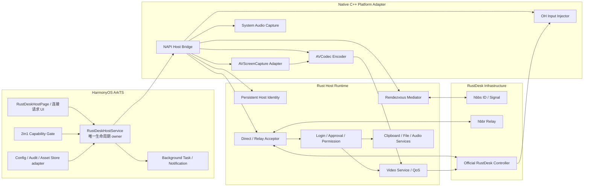

# RustDesk HarmonyOS 2in1 被控端完整升级计划

> 计划日期：2026-07-30（Asia/Shanghai）
>
> 计划版本：v1.0
>
> 计划性质：可执行的产品、架构、交互、测试与发布计划；本文件不修改产品代码
>
> 目标平台：HarmonyOS API 23，运行时设备类型必须精确为 `2in1`
>
> 产品称谓：面向用户统一称“鸿蒙电脑”或“2in1”；代码和验收使用系统值 `2in1`
>
> RustDesk 官方参照：客户端固定提交
> [`d412d198720aa56f6cfed2dfad262e8fb1322fb7`](https://github.com/rustdesk/rustdesk/tree/d412d198720aa56f6cfed2dfad262e8fb1322fb7)
>
> 审计起始基线：`codex/cloud-data-lifecycle-root-fix@7a07321a3`，本地
> `main@23940521a`，计划落盘前相对 `main` 为 `0 behind / 21 ahead`
>
> 交付复核基线：并行的 cloud lifecycle 任务已将同一分支推进到 `7fd53954b`，
> 相对 `main` 为 `0 behind / 24 ahead`；本计划没有修改或提交该任务代码
>
> 保护声明：计划落盘前工作区已有 10 个用户修改/新增文件。本计划只新增本文件，
> 不覆盖、不暂存、不回退、不格式化任何既有修改

## 0. 执行结论

### 0.1 一句话结论

在 **HarmonyOS API 23 的真实 `2in1` 设备、设备已解锁、用户主动启动被控服务、
明确授予屏幕捕获和输入注入授权、系统允许后台长时任务** 的前提下，将当前应用升级为
RustDesk 被控端，完成“远端看见屏幕并操控键盘鼠标”的核心远程协助闭环，具有工程可行性。

它不是桌面系统服务，也不能被描述为“开机即在线、锁屏可登录、完全无人值守”的传统
Windows RustDesk Host。任何超出普通 HarmonyOS 应用权限边界的能力都必须显式拒绝，
不能以按钮占位、静默降级或错误文案冒充支持。

### 0.2 最终可交付能力

本计划完成后的 2in1 被控端应支持：

1. 用户主动启用/停用本机远程协助；
2. 为当前选定的 RustDesk Server OSS/兼容服务建立稳定、持久的设备身份；
3. 持续向 hbbs 注册、心跳、处理直连打洞和 hbbr relay；
4. 接收入站连接并完成 RustDesk 官方兼容的加密、挑战、密码/手动批准流程；
5. 捕获用户通过系统界面选定的当前显示屏；
6. 以协商后的编码、分辨率和帧率发送屏幕画面；
7. 在用户授权后注入键盘、鼠标、滚轮和必要的触控事件；
8. 为每个入站会话建立独立权限快照；
9. 在前后台、窗口变化、网络变化、系统中断、隐私场景和权限撤回时正确收敛；
10. 以应用内状态、系统常驻通知和明确的停止入口持续告知用户；
11. 与固定版本的 RustDesk 官方 Windows、macOS、Linux 控制端互操作；
12. 在手机、平板和任何未知设备类型上完全不激活被控端。

### 0.3 必须明确排除的能力

以下能力不属于普通 HarmonyOS API 23 应用可承诺范围：

- 开机自启动并在用户未打开应用时自动注册；
- 锁屏、登录界面或首次解锁前接受远程控制；
- 远程输入锁屏密码；
- 屏蔽本地键盘鼠标、阻止本地用户结束会话；
- 远程重启、远程关机、远程锁机后继续控制；
- root、系统级终端、任意 TCP 隧道、远程打印；
- 绕过系统屏幕捕获选择器或输入授权；
- 捕获被系统标记为隐私/安全的窗口；
- 在 API 23 同时推流多个显示屏；
- 无授权读取完整文件系统或完整剪贴板历史；
- 在手机或平板上通过辅助功能、系统权限或私有 API 模拟同等能力。

上述项目在 UI、协议能力广告、日志、测试和发布说明中必须一致为“不支持”，不得出现
“开发中但可开启”的假开关。

### 0.4 可行性分级

| 能力 | 结论 | 发布口径 |
|---|---|---|
| 2in1 解锁态屏幕查看 | GO，需真机验证系统选择器与后台行为 | 核心能力 |
| 2in1 解锁态键鼠控制 | CONDITIONAL GO，依赖 `OH_Input_RequestInjection` 真机授权 | 核心能力，P0 试验门 |
| hbbs 注册、直连、relay | GO，工作量大 | 核心能力 |
| 密码/手动批准 | GO | 核心能力 |
| 系统音频 | CONDITIONAL GO，依赖 AVScreenCapture 音频配置和设备能力 | 可选能力 |
| 剪贴板同步 | CONDITIONAL GO，受 `READ_PASTEBOARD` ACL/单次授权限制 | 默认关闭、可裁剪 |
| 文件传输 | LIMITED GO，仅应用沙箱和用户 Picker/URI 授权范围 | 受限能力 |
| 多显示器 | LIMITED GO，API 23 一次只支持一个用户选择的显示屏 | 明确限制 |
| 开机/锁屏无人值守 | NO-GO | 不设计、不宣传 |
| 手机/平板被控 | NO-GO | 入口、服务、网络行为全部隐藏 |

## 1. 计划边界与执行原则

### 1.1 目标

1. 建立与现有“控制别人”RustDesk 客户端严格隔离的“本机被控”模块；
2. 以真实 2in1 能力试验作为编码前置门，不以 SDK 声明代替真机结果；
3. 对齐 RustDesk 官方 host 的协议角色和状态机，不把当前一次性
   `register_peer()` 包装成被控端；
4. 让用户从发现入口、授权、在线待机、处理入站请求、会话中控制到停止服务，
   始终知道“谁在连接、能做什么、如何立即停止”；
5. 复用项目现有主题、卡片、Sheet、双栏 PC 布局和设置路由；
6. 在每个边界 fail closed：不支持时不注册，不完整时不广告，授权失效时立即撤权；
7. 形成可按阶段、按模块、按提交实施的升级路线；
8. 每个阶段都包含自动化、真机证据、回滚点和发布阻断条件。

### 1.2 非目标

- 不把当前应用改造成系统服务、设备管理应用或预装特权应用；
- 不在本计划中修改任何代码、配置或资源；
- 不顺带修复现有控制端、中继保存、云同步、SSH、VNC 或 Moonlight 问题；
- 不用 RustDesk 官方 UI 逐像素覆盖现有 HarmonyOS 视觉；
- 不直接复制官方 RustDesk 源码实现；
- 不在未完成许可证决策前链接或打包官方 RustDesk core；
- 不把“协议可连接”等同于“产品可发布”；
- 不用模拟器结果替代 API 23 真实 2in1 验收。

### 1.3 执行原则

1. **设备类型是能力门，窗口宽度只是布局门。**
   即使 2in1 窗口缩小到 `sm/md/lg`，功能仍然存在并使用窄窗布局；即使平板窗口大于
   `1440vp`，也不能激活被控端。
2. **先授权、再后台、最后注册。**
   只有屏幕捕获成功且后台保活建立后，设备才允许对 hbbs 宣告在线。
3. **本地用户控制权最高。**
   本地拒绝、停止、锁屏、切换用户或撤销权限必须立即压过远端状态。
4. **每项权限独立。**
   屏幕、输入、音频、剪贴板和文件不是一个“全允许”布尔值。
5. **当前会话权限不可被远端静默扩大。**
   远端请求新增权限时，必须由本地用户再次确认。
6. **能力广告必须真实。**
   终端、重启、打印、TCP 隧道、完整磁盘等能力必须在协议层拒绝。
7. **默认安全。**
   默认手动批准、单会话、屏幕必需，输入需显式授权，其余敏感能力默认关闭。
8. **秘密只在本机。**
   host key、设备密码、临时密码、信任记录不进入云同步、普通备份、Toast 或日志。
9. **中断优先于自动恢复。**
   捕获被系统停止、输入授权撤回、锁屏或后台任务失效时，先停止对外服务，再考虑恢复。
10. **协议兼容以固定证据为准。**
    固定 commit、protobuf hash、fixture 和官方客户端黑盒结果，不追随浮动 `master`。

## 2. 当前仓库审计

### 2.1 项目现状

- `build-profile.json5` 的 `targetSdkVersion` 和 `compatibleSdkVersion` 均为 API 23；
- `entry/src/main/module.json5` 同时声明 `phone`、`tablet`、`2in1`；
- 当前 Ability 后台模式仅有 `dataTransfer`、`multiDeviceConnection`、`audioPlayback`；
- 当前没有被控端屏幕捕获、输入注入或 host 服务声明；
- 当前 RustDesk 产品角色是控制端；
- 当前 `RemoteSessionBackgroundTaskService.ets` 服务于“控制别人”的已连接会话；
- 当前 `audio_capturer.cpp` 仍含模拟/未完成路径，不能复用于被控端发布判断；
- 当前 `rustdesk_helper` 依赖 `/data/local/tmp` 和 hdc 手动启动，只是开发占位；
- 当前 `rustdesk_helper/src/ipc.rs` 对连接和输入主要记录日志，未实现真实 core；
- 当前 `rustdesk_ffi` 的 `RustDeskConnector` 每个实例生成临时 keypair；
- 当前 rendezvous `register_peer()` 是一次请求/响应，不是持续注册循环；
- 当前 `connector.rs` 已明确注明 `RegisterPeer` 属于被控端；
- 当前没有入站 listener、host login/auth、capture/encoder、input injector 或会话权限 owner。

### 2.2 现有设备判断不可直接作为安全门

`entry/src/main/ets/utils/BreakpointUtil.ets` 当前将 `deviceType === 'pc'` 或
`deviceType === '2in1'` 都投影为 `isDesktopDevice=true`。该值适合控制现有侧边栏、
键盘和鼠标布局，但不能作为被控端的授权依据：

- 官方 OpenHarmony API 23 输入注入实现检查的是 `2in1`；
- `isDesktopDevice` 是 UI 便利状态，会与断点和未来设备命名演进耦合；
- 被控端需要“未知即拒绝”的独立安全策略；
- 不能因 `breakpoint === 'xl'` 或 `isPC === true` 注册 host。

实施时必须新增唯一 `RustDeskHostCapabilityPolicy`，运行时只接受：

```text
deviceInfo.deviceType === "2in1"
```

如果商业真机实际返回 `pc`，必须用 API 23 真机证据、系统版本和官方工单/文档更新 ADR，
再有意识地扩展白名单；不得预先用 `pc || 2in1` 放宽。

### 2.3 现有 UI 基线

必须复用：

- `entry/src/main/ets/common/Theme.ets`
  - `Palette`：`bg/card/surface/divider/text/text2/text3/primary/success/danger`；
  - `AppTheme.spacing`：`4/8/12/16/20/32`；
  - `AppTheme.radius`：`4/8/12/16/20/24/full`；
  - `AppTheme.fontSize`：`12/15/17/19/24/30/34`；
  - `AppTheme.btnSm/btnMd/btnLg`：`36/44/56`；
  - `HarmonyOS Sans`、浅色/深色和用户主题色；
- 设置页的 Accordion 卡片、叶子 Sheet 路由和关闭生命周期；
- RustDesk 中继页在 PC `xl` 的左列表/右详情布局；
- 窄窗时的页面或居中 Sheet 适配；
- `SymbolGlyph` 和项目 `protocolIcon()`，不引入第三套图标语言；
- 已有卡片 `20/24vp` 圆角、半透明边框、背景材质和轻量阴影；
- 项目已存在的焦点申请、键盘处理、Sheet 替换防竞态策略。

现有页面仍散落的 `fontSize(11)`、`height(30)`、`borderRadius(7)` 等魔法数不能继续复制。
被控端组件先补齐语义 token，再由组件消费 token。

### 2.4 与既有 RustDesk 计划的关系

本计划与
`docs/superpowers/plans/2026-07-29-rustdesk-control-plane-official-parity-complete-plan-v3.md`
分工如下：

| 计划 | 角色 | owner |
|---|---|---|
| 既有 v3 | HarmonyOS 控制端连接远程 RustDesk Peer | outbound/controller |
| 本计划 | HarmonyOS 2in1 将本机注册为 RustDesk Peer | inbound/controlled-host |

两者可共享：

- RustDesk Server Profile 的地址、公钥和控制面类型；
- protobuf provenance、fixture 基础设施；
- 网络错误分类、脱敏日志规范；
- 主题和通用 UI 组件。

两者不得共享：

- controller 会话临时 keypair 与 host 持久身份；
- 远端设备密码与本机设备密码；
- outbound `RemoteSessionBackgroundTaskService` 状态；
- controller connection handle 与 host listener/session handle；
- 云同步中的远程主机记录与本机 host 注册状态；
- 错误码命名空间、通知 ID、epoch 和审计记录。

## 3. 官方依据与固定证据

### 3.1 RustDesk 官方产品依据

RustDesk 官方文档明确：

- Client 可用于发起或接收入站远程桌面；
- 首页展示本机 ID 和一次性密码；
- Security 设置包含入站权限和密码；
- Network 设置区分 ID Server、Relay Server、API Server 和服务器公钥；
- 入站批准模式包括密码、手动点击以及两者；
- 入站权限包括键鼠、剪贴板、文件、音频等独立开关；
- Android 被控端在每次启动服务时重新请求屏幕捕获和输入控制；
- 未得到屏幕捕获授权时不应接受控制请求；
- 用户可随时停止服务或关闭指定连接。

固定文档：

- [RustDesk Client](https://rustdesk.com/docs/en/client/)
- [RustDesk Android controlled-side flow](https://rustdesk.com/docs/en/client/android/)
- [RustDesk Client Configuration](https://rustdesk.com/docs/en/self-host/client-configuration/)
- [RustDesk Advanced Settings](https://rustdesk.com/docs/en/self-host/client-configuration/advanced-settings/)
- [RustDesk Server Pro Control Role](https://rustdesk.com/docs/en/self-host/rustdesk-server-pro/control-role/)

Android 文档只用于理解 RustDesk 的用户任务和权限拆分，不能用 Android
MediaProjection/AccessibilityService 证明 HarmonyOS 平台能力。

### 3.2 RustDesk 官方源码依据

固定提交：

```text
rustdesk/rustdesk
d412d198720aa56f6cfed2dfad262e8fb1322fb7
```

必须建立黑盒/fixture 的关键文件：

- [`src/rendezvous_mediator.rs`](https://github.com/rustdesk/rustdesk/blob/d412d198720aa56f6cfed2dfad262e8fb1322fb7/src/rendezvous_mediator.rs)
  - 多服务器注册；
  - UDP/TCP 注册和 heartbeat；
  - `register_peer`/`register_pk`；
  - punch hole、relay request、重连；
- [`src/server.rs`](https://github.com/rustdesk/rustdesk/blob/d412d198720aa56f6cfed2dfad262e8fb1322fb7/src/server.rs)
  - host 服务注册；
  - direct/relay 入站；
  - audio/display/clipboard/input/video service；
- [`src/server/connection.rs`](https://github.com/rustdesk/rustdesk/blob/d412d198720aa56f6cfed2dfad262e8fb1322fb7/src/server/connection.rs)
  - LoginRequest；
  - password/hash challenge；
  - click approval、2FA、trusted device；
  - session permissions；
- [`src/server/video_service.rs`](https://github.com/rustdesk/rustdesk/blob/d412d198720aa56f6cfed2dfad262e8fb1322fb7/src/server/video_service.rs)
  - capturer/display；
  - codec 协商；
  - QoS、FPS、背压、关键帧；
  - 多显示和光标。

Android 平台适配参考：

- [`AndroidManifest.xml`](https://github.com/rustdesk/rustdesk/blob/d412d198720aa56f6cfed2dfad262e8fb1322fb7/flutter/android/app/src/main/AndroidManifest.xml#L33-L91)
- [`MainService.kt`](https://github.com/rustdesk/rustdesk/blob/d412d198720aa56f6cfed2dfad262e8fb1322fb7/flutter/android/app/src/main/kotlin/com/carriez/flutter_hbb/MainService.kt)
- [`InputService.kt`](https://github.com/rustdesk/rustdesk/blob/d412d198720aa56f6cfed2dfad262e8fb1322fb7/flutter/android/app/src/main/kotlin/com/carriez/flutter_hbb/InputService.kt)
- [`BootReceiver.kt`](https://github.com/rustdesk/rustdesk/blob/d412d198720aa56f6cfed2dfad262e8fb1322fb7/flutter/android/app/src/main/kotlin/com/carriez/flutter_hbb/BootReceiver.kt)

这些文件证明 host 是“协议服务＋平台捕获＋平台输入＋操作系统生命周期”的组合，
不是给当前 controller 加一个注册调用。

### 3.3 HarmonyOS 输入注入依据

本机 API 23 SDK：

```text
/Applications/DevEco-Studio.app/Contents/sdk/default/openharmony/native/sysroot/usr/include/
  multimodalinput/oh_input_manager.h
```

已确认 API 20 起提供：

- `OH_Input_RequestInjection(callback)`；
- `OH_Input_QueryAuthorizedStatus(status)`；
- key/mouse/touch 注入 API。

OpenHarmony 6.1 Release 固定源码：

- [`RequestInjection` 与 `IsPC`](https://github.com/openharmony/multimodalinput_input/blob/c25655019c7f581112f86eaff2be2d68794e1ad9/service/message_handle/src/server_msg_handler.cpp#L1533-L1589)
- [`NativeInjectCheck`](https://github.com/openharmony/multimodalinput_input/blob/c25655019c7f581112f86eaff2be2d68794e1ad9/service/message_handle/src/server_msg_handler.cpp#L1752-L1770)

源码显示：

- 产品类型常量为 `2in1`；
- 非 2in1 返回设备不支持；
- 注入需要进程级用户授权；
- 锁屏时注入被拒绝。

官方 API 入口：

- [Input Kit C API reference](https://developer.huawei.com/consumer/en/doc/harmonyos-references-V13/input-headerfile-V13)

实施结论：

- 普通应用不得申请或依赖 system-core 的 `ohos.permission.INJECT_INPUT_EVENT`；
- 必须使用面向用户授权的 `OH_Input_RequestInjection`；
- 授权入口必须由用户在 2in1 上主动触发；
- 锁屏即视为控制能力丢失并停止会话；
- `QueryAuthorizedStatus` 只是状态信号，真实注入错误仍是最终事实。

### 3.4 HarmonyOS 屏幕捕获依据

本机 API 23 SDK：

```text
/Applications/DevEco-Studio.app/Contents/sdk/default/openharmony/native/sysroot/usr/include/
  multimedia/player_framework/native_avscreen_capture.h
/Applications/DevEco-Studio.app/Contents/sdk/default/openharmony/native/sysroot/usr/include/
  multimedia/player_framework/native_avscreen_capture_base.h
```

已确认 API 23 包含：

- create/init/start/stop；
- `AcquireVideoBuffer` 和 data callback；
- Surface 输出；
-最大帧率；
- display、selection、capture content changed callback；
- capture strategy 和系统 picker；
- privacy protect callback；
- `STOPPED_BY_USER`、`INTERRUPTED_BY_OTHER`、通话、隐私场景、用户切换等状态。

官方实践入口：

- [AVScreenCapture 屏幕录制实践](https://developer.huawei.com/consumer/cn/doc/doccenter-capabilities/avscreencapture-screen-recording-arkts)

API 24 才出现更完整的多显示 ID/能力接口，因此 API 23 的发布承诺为：

- 一次只捕获一个由用户选择的显示屏；
- 显示器切换需要安全重建 capture/encoder；
- 不承诺同时推送多个显示屏；
- 隐私窗口按系统黑屏/遮罩结果处理，应用不得绕过。

### 3.5 HarmonyOS 后台与通知依据

本机 API 23 SDK：

```text
/Applications/DevEco-Studio.app/Contents/sdk/default/openharmony/ets/api/
  @ohos.resourceschedule.backgroundTaskManager.d.ts
```

已确认：

- API 21 `MODE_MULTI_DEVICE_CONNECTION`；
- API 22 `MODE_AV_PLAYBACK_AND_RECORD`；
- API 22 `SUBMODE_SCREEN_RECORD_NORMAL_NOTIFICATION`；
- API 22 `SUBMODE_VIDEO_BROADCAST_NORMAL_NOTIFICATION`；
- 系统发布/管理连续任务通知，并可能取消、挂起或拒绝任务。

官方参考：

- [backgroundTaskManager API](https://developer.huawei.com/consumer/cn/doc/harmonyos-references/js-apis-backgroundtaskmanager)

本机 API 23 权限定义还表明：

- `KEEP_BACKGROUND_RUNNING` 为普通 system-grant；
- `RECEIVER_STARTUP_COMPLETED` 为 system-basic/SYSTEM；
- `CUSTOM_SCREEN_CAPTURE` 为 normal/user-grant；
- `READ_PASTEBOARD` 为 system-basic/user-grant；
- `INJECT_INPUT_EVENT` 为 system-core/SYSTEM。

实施结论：

- 可以为用户已启动的远程协助建立带系统通知的长时任务；
- 普通 HAP 不能把系统启动广播作为可靠开机 host；
- 后台任务建立失败时不得注册在线；
- 后台任务被系统终止时必须关闭入站和现有会话。

### 3.6 HarmonyOS 人因、隐私和多窗依据

固定官方参考：

- [鸿蒙电脑应用开发入门](https://developer.huawei.com/consumer/cn/multidevice/pc/get-started/)
- [设备兼容](https://developer.huawei.com/consumer/cn/doc/doccenter-architecture/device-compatible)
- [焦点导航](https://developer.huawei.com/consumer/cn/doc/design-guides/hmi-focus-0000001748650376)
- [光标交互](https://developer.huawei.com/consumer/cn/doc/design-guides/hmi-cursor-0000001795531205)
- [应用 UX 体验标准概述](https://developer.huawei.com/consumer/cn/doc/design-guides/ux-guidelines-overview-0000001760867048)
- [应用隐私保护](https://developer.huawei.com/consumer/cn/doc/doccenter-architecture/bpta-app-privacy-protection)
- [选择和同意](https://developer.huawei.com/consumer/cn/doc/doccenter-architecture/standard-privacy-user-consent)
- [向用户申请单次授权](https://developer.huawei.com/consumer/cn/doc/HarmonyOS-Guides/one-time-authorization)
- [Asset Store Kit](https://developer.huawei.com/consumer/cn/doc/harmonyos-guides-V14/asset-store-kit-overview-V14)
- [应用访问文件](https://developer.huawei.com/consumer/cn/doc/harmonyos-guides/file-processing-apps-startup)

设计与合规结论：

- 自由窗口、分屏和大小变化不能中断当前任务；
- PC/2in1 必须完整支持鼠标、触控板、Tab、Shift+Tab、方向键、Enter、Space、Esc；
- 选中态和获焦态不能混用；
- 可点击区域必须在 Hover 时给出视觉反馈；
- 状态不能只靠颜色表达；
- 敏感权限不得首次启动时批量索取；
- 权限需在用户触发相关功能时动态申请；
- 拒绝权限不能导致应用退出或其他控制端功能不可用；
- 用户必须能撤回同意和清除敏感数据；
- 密码、Token、host key 等短敏感数据应使用 Asset Store；
- 文件访问使用 Picker/URI 最小授权，不获得任意文件系统能力。

## 4. 2in1 激活与隔离合同

### 4.1 唯一资格模型

建议领域对象：

```text
RustDeskHostEligibility
  deviceType
  apiLevel
  targetApiLevel
  supported
  reasonCode
  evidenceVersion
```

稳定 reason code：

```text
ELIGIBLE_2IN1_API23
UNSUPPORTED_PHONE
UNSUPPORTED_TABLET
UNSUPPORTED_DEVICE_TYPE
UNSUPPORTED_API_LEVEL
DEVICE_TYPE_QUERY_FAILED
PLATFORM_CAPABILITY_PROBE_FAILED
```

### 4.2 四层 fail-closed

必须同时存在四层门：

1. **UI 门**
   - phone/tablet/unknown 不渲染入口；
   - 不渲染空卡、灰色开关或“即将推出”。
2. **ArkTS service 门**
   - 所有 `enable/start/resume/applyConfig` 首行重新校验资格；
   - AppStorage 的旧值不能绕过。
3. **NAPI/native 门**
   - capture/input/encoder bridge 接到调用时独立读取或接收经过签名/epoch 的资格结果；
   - 不接受普通布尔值长期缓存。
4. **Rust host 门**
   - 启动 rendezvous/listener 前必须收到当前 generation 的 `eligible=true`；
   - generation 改变立即取消注册、listener 和 session。

### 4.3 负向网络保证

在 phone、tablet、未知设备或资格查询失败时：

- 不生成 host identity；
- 不访问 Asset Store 中的 host secret；
- 不解析 host server profile；
- 不创建 capture/input 对象；
- 不申请权限；
- 不启动后台任务和通知；
- 不启动端口 listener；
- 不发送 hbbs 注册、heartbeat、PK 或 NAT 请求；
- 不恢复旧 host 状态；
- 不接受 deep link/Want 绕过；
- 不因云恢复、升级迁移或调试开关激活。

负向测试需要抓包证明“0 host packets”，不能只断言 UI 隐藏。

### 4.4 窗口断点合同

| 条件 | 能力 | 布局 |
|---|---|---|
| 2in1 + `xl` | 可用 | 左导航/状态区＋右详情/设置 |
| 2in1 + `lg/md/sm` | 可用 | 单列页面或居中 Sheet，任务连续 |
| tablet + `xl` | 不可用 | 无入口 |
| phone 任意断点 | 不可用 | 无入口 |
| unknown 任意断点 | 不可用 | 无入口 |

窗口缩放不能：

- 停止 host；
- 重置临时密码；
- 重建 Rust network runtime；
- 丢失待批准请求；
- 自动接受或拒绝；
- 让停止按钮消失；
- 将焦点跳到“接受”按钮。

## 5. 产品信息架构

### 5.1 用户心智模型

产品必须明确区分两个方向：

```text
RustDesk 远程主机
  我控制其他设备

本机远程协助
  其他设备在我允许后控制这台鸿蒙电脑
```

禁止使用含糊的“RustDesk 服务”“开启远程”“远程模式”。

### 5.2 入口设计

仅 2in1 渲染两个一致入口：

1. RustDesk 远程主机页顶部状态卡：
   - 标题：`本机远程协助`
   - 摘要：`未启用 / 需要授权 / 在线待机 / 控制中 / 已暂停`
   - 点击进入独立页面；
2. 设置 > RustDesk 内的动作行：
   - 标题：`本机远程协助`
   - 副标题：`允许受信任设备查看并控制这台鸿蒙电脑`
   - 点击同一路由。

不新增根侧边栏 tab，不改变现有 `curTab` 数字和“RustDesk 远程主机”信息架构。
独立页面承载被控端任务，避免 outbound 和 inbound 设置混在同一卡片。

### 5.3 页面结构

`RustDeskHostPage`：

1. 顶部导航：
   - 返回；
   - `本机远程协助`；
   - 右侧 `帮助` 或 `诊断`；
2. 主状态卡：
   - 状态 icon＋状态文字；
   - 本机 ID；
   - 一次性密码；
   - 主操作；
3. 授权检查卡：
   - 屏幕共享；
   - 键盘与鼠标；
   - 系统音频；
   - 剪贴板；
   - 文件；
4. 接入策略卡：
   - 每次手动批准；
   - 密码或批准；
   - 仅密码（高级、风险提示）；
5. 会话权限卡；
6. 网络与服务器卡；
7. 当前/最近连接卡；
8. 安全与数据卡：
   - 修改设备密码；
   - 清除本机身份；
   - 清除连接记录；
   - 完全停用并删除数据；
9. 能力边界说明：
   - 仅解锁状态；
   - 不支持开机/锁屏无人值守；
   - API 23 一次一个显示屏。

### 5.4 PC 宽窗布局

```text
┌────────────────────────────────────────────────────────────┐
│ 本机远程协助                                      帮助/诊断 │
├──────────────────────┬─────────────────────────────────────┤
│ 状态与设备身份       │ 当前状态详情                        │
│                      │                                     │
│ ● 在线待机           │ 屏幕共享      已授权                │
│ 设备 ID              │ 键盘与鼠标    已授权                │
│ 一次性密码           │ 系统音频      未启用                │
│ [停止接受连接]       │                                     │
│                      │ 接入策略 / 会话权限 / 服务器        │
│ 最近连接             │                                     │
└──────────────────────┴─────────────────────────────────────┘
```

- 左列宽度与 RustDesk 中继页列表/详情模式保持同一层级；
- 右侧详情允许滚动；
- 主停止操作在左列始终可见；
- 窗口高度不足时左列内部不隐藏停止按钮；
- 不使用无滚动的固定高度容纳所有设置。

### 5.5 窄窗布局

```text
顶部导航
主状态卡
立即停止/开始
授权检查
接入策略
会话权限
网络与服务器
安全与数据
```

- 单列滚动；
- 主操作在状态卡内；
- 有活动会话时底部可增加固定“结束会话”操作区，但不得覆盖系统安全区；
- Sheet 只用于短任务：批准连接、设置密码、选择服务器、确认删除；
- 长配置不塞入 `FIT_CONTENT` Sheet。

## 6. 人因工程与统一视觉规范

### 6.1 状态词典

UI、ArkTS、native 和 Rust 日志必须共享稳定状态语义：

| 稳定状态 | 用户文案 | 颜色/图标语义 | 主操作 |
|---|---|---|---|
| `UNAVAILABLE` | 当前设备不支持 | 不渲染给普通用户 | 无 |
| `DISABLED` | 未启用 | 中性 | 设置远程协助 |
| `AUTH_REQUIRED` | 需要完成授权 | 警示 | 继续授权 |
| `STARTING` | 正在启动 | 进度 | 取消 |
| `ONLINE_IDLE` | 在线待机 | 成功 | 停止接受连接 |
| `INCOMING_PENDING` | 有连接请求 | 警示/脉冲一次 | 查看请求 |
| `ACTIVE_VIEW` | 正在共享屏幕 | 强提示 | 立即结束 |
| `ACTIVE_CONTROL` | 正在被远程控制 | 强提示 | 立即结束 |
| `PAUSED_PRIVATE` | 隐私内容已遮挡 | 警示 | 结束/等待 |
| `PAUSED_LOCKED` | 设备已锁定，控制已停止 | 警示 | 解锁后重新启用 |
| `OFFLINE_NETWORK` | 网络不可用 | 中性警示 | 重试/停止 |
| `STOPPING` | 正在安全停止 | 进度 | 无重复操作 |
| `ERROR` | 远程协助未启动 | 危险 | 查看原因/重试 |

颜色只做强化；每个状态必须同时有 icon、文字和可访问描述。

### 6.2 视觉 token

被控端不得硬编码一套新色板。建议在 `Theme.ets` 后续新增语义 token：

```text
hostStatusIdle     -> palette.text3
hostStatusReady    -> palette.success
hostStatusPending  -> editColor / warning token
hostStatusActive   -> palette.primary
hostStatusPrivate  -> warning token
hostStatusError    -> palette.danger
hostControlHeight  -> AppTheme.btnMd (44)
hostCardRadius     -> AppTheme.radius.xl (20)
hostSectionGap     -> AppTheme.spacing.lg (16)
hostPagePadding    -> AppTheme.spacing.xl (20)
```

正式实施前需要补 `warning` 语义色，而不是借用 `editColor` 作为长期设计。

### 6.3 字体层级

- 页面标题：`AppTheme.fontSize.title`；
- 主状态：`bodyLarge/subtitle`，按状态卡密度选择；
- 卡片标题：`bodyLarge`；
- 正文：`body`；
- 辅助信息：`caption`；
- ID/错误码：等宽显示可选，但需保证可复制和读屏；
- 不新增低于 `caption` 的 9/10/11vp 核心文案；
- 系统字体缩放后不得截断主状态和停止按钮。

### 6.4 交互热区、Hover 与焦点

- 关键按钮高度不得小于 `AppTheme.btnMd=44vp`；
- 图标按钮可视觉 20/24vp，但热区至少 44×44vp；
- 鼠标 Hover 使用卡片背板高亮或系统组件默认效果；
- 所有点击目标使用适当 pointer style；
- Tab 顺序按“顶部导航 → 状态卡 → 主操作 → 授权 → 策略 → 权限 → 网络 → 安全”；
- `Shift+Tab` 完整反向；
- 方向键只在同一逻辑组内走焦；
- Enter 进入/确认，Space 激活开关，Esc 关闭最上层 Sheet/Dialog；
- 纯展示状态不可获焦；
- 选中态、获焦态、禁用态必须可区分；
- 模态出现时焦点被限制在模态内，关闭后回到触发控件；
- 从鼠标切回键盘时记住上一焦点。

### 6.5 安全默认焦点

入站连接 Dialog/Sheet：

- 首焦点为 `拒绝`，不是 `允许`；
- Enter 不得在模态刚出现时误接受；
- `允许` 必须是一次明确焦点移动或点击；
- 不提供自动接受倒计时；
- 超时只允许自动拒绝；
- 密码验证通过的“仅密码”策略也必须展示系统通知和会话状态；
- 活动会话中的“结束会话”不需要危险倒计时，但需要防重复点击；
- “清除身份/永久停用”使用危险确认并清楚说明后果。

### 6.6 文案规范

使用具体动词：

- `开始接受连接`
- `停止接受连接`
- `允许查看屏幕`
- `允许键盘与鼠标`
- `拒绝`
- `允许本次连接`
- `立即结束会话`
- `重新请求系统授权`

禁止：

- `开启服务`
- `全部允许`
- `无人值守`（平台不支持完整语义）
- `永久在线`
- `后台运行正常`（除非后台任务真实运行）
- `已授权`（仅凭本地缓存）
- `安全连接`（未完成服务器 key 验证时）

### 6.7 主状态卡

未启动：

```text
本机远程协助
让受信任设备在你允许后查看并控制这台鸿蒙电脑
[设置远程协助]
```

在线待机：

```text
● 在线待机
设备 ID  123 456 789    [复制]
一次性密码  ••••••••    [显示] [重新生成]
[停止接受连接]
```

控制中：

```text
● 正在被远程控制
控制方：设备名 / 脱敏 ID
已允许：屏幕、键盘与鼠标
开始于：14:32
[立即结束会话]
```

“复制”只写入剪贴板，不需要读取剪贴板权限；复制密码后给出短暂、非敏感 Toast，
并提示用户不要通过不可信渠道分享。

### 6.8 授权检查卡

每项呈现：

- 能力名称；
- 用途；
- 当前事实状态；
- 操作按钮；
- 影响范围。

例如：

```text
键盘与鼠标
允许本次远程协助操作窗口、输入文字和滚动
未授权
[请求系统授权]
```

权限申请的人因流程：

1. 用户先在页面看到用途和影响，不用自定义弹窗拦截；
2. 用户点击该能力操作；
3. 直接调用系统授权/选择器；
4. 回到页面后按真实结果更新；
5. 拒绝时保留页面和其他功能；
6. 第二次主动点击时使用半模态说明如何进入系统设置；
7. 不循环弹窗、不首次启动批量申请。

### 6.9 入站连接请求

必须显示：

- 对方设备名（如果协议可信提供）；
- 完整或合理分组后的 Peer ID；
- 连接来源：局域网直连/公网直连/中继；
- 当前服务器 profile；
- 请求类型：屏幕查看/控制/文件；
- 本次将授予的权限；
- “对方身份未经过账号验证”或对应可信级别；
- 超时自动拒绝的剩余时间；
- `拒绝` 与 `允许本次连接`。

不显示：

- 完整 IP 地址给普通用户；
- 服务器 Token、公钥、密码 hash；
- 诱导性绿色大按钮配灰色拒绝；
- 模糊的“有人想连接”。

### 6.10 活动会话控制

应用前台时：

- 页面状态卡持续显示控制方和会话时长；
- 顶部或页面内有高可见“正在被远程控制”状态；
- `立即结束会话` 始终在一屏或固定操作区可达；
- 用户可立即撤销输入、音频、剪贴板、文件；
- 撤销权限即时生效；
- 新增权限必须再次确认。

应用后台时：

- 系统持续任务通知标题：`本机正在进行远程协助`；
- 内容：脱敏控制方、已允许能力、开始时间；
- 点击通知回到 `RustDeskHostPage`；
- 若平台支持安全的通知 action，提供 `结束会话`；
- 若不支持，通知到结束页面最多两次操作；
- 通知不可滑动即消失或伪装普通信息通知。

### 6.11 可访问性

每个核心组件必须有：

- 可读的 `accessibilityText`；
- 状态变化播报；
- icon 的语义标签；
- 密码显示/隐藏状态；
- 错误和对应修复动作的关联；
- 不依赖动画的状态；
- Reduce Motion 时取消脉冲和大幅缩放；
- 高对比度/深色主题验证；
- 200% 字体缩放验证；
- 键盘全流程和读屏全流程验收。

## 7. 用户操作全生命周期

### 7.1 生命周期总图

```mermaid
stateDiagram-v2
    [*] --> "不支持/隐藏": "非 2in1 或能力查询失败"
    [*] --> "未启用": "2in1 首次安装/升级"
    "未启用" --> "授权准备": "用户点击设置远程协助"
    "授权准备" --> "启动中": "屏幕与必要能力授权完成"
    "启动中" --> "在线待机": "后台任务成功 + hbbs 注册成功"
    "启动中" --> "错误/已停止": "任一强门失败"
    "在线待机" --> "入站待批准": "收到连接请求"
    "入站待批准" --> "在线待机": "拒绝/超时/认证失败"
    "入站待批准" --> "共享屏幕": "批准且捕获可用"
    "共享屏幕" --> "远程控制中": "本次会话允许输入"
    "远程控制中" --> "共享屏幕": "本地撤销输入"
    "共享屏幕" --> "隐私暂停": "系统进入隐私场景"
    "隐私暂停" --> "共享屏幕": "系统退出隐私场景"
    "共享屏幕" --> "已停止": "锁屏/用户切换/后台失效/本地停止"
    "远程控制中" --> "已停止": "锁屏/用户切换/输入失效/本地停止"
    "在线待机" --> "已停止": "用户停用/系统终止"
    "已停止" --> "授权准备": "用户主动重新启动"
    "未启用" --> "完全删除": "用户删除被控端数据"
    "已停止" --> "完全删除": "用户删除被控端数据"
```

### 7.2 安装与首次启动

2in1：

1. 应用安装/升级；
2. 运行资格检查；
3. 不创建 host identity；
4. 不请求任何 host 权限；
5. 不启动 host 网络；
6. 在 RustDesk 页和设置页显示入口；
7. outbound 四协议功能照常工作。

phone/tablet/unknown：

1. 资格检查 fail closed；
2. 不显示入口；
3. 不迁移或读取 host 数据；
4. 不启动监听/注册；
5. outbound 功能不受影响。

### 7.3 首次启用向导

向导只在用户点击入口后开始：

#### Step 1：说明

- 本机屏幕会被发送给用户允许的远端；
- 本地用户可随时停止；
- 仅解锁状态有效；
- 不支持开机或锁屏无人值守；
- 链接到隐私说明；
- `继续` / `取消`。

#### Step 2：服务器与身份

- 默认复用用户选中的 RustDesk Server Profile；
- 显示 ID Server 和 Key fingerprint，不显示敏感值；
- 允许选择其他已保存 profile；
- 无 profile 时进入统一服务器配置流程；
- profile 变更必须在 host 停止状态完成；
- 此时才创建/读取该 profile 对应的 host identity。

#### Step 3：必需能力

- 屏幕共享为必需；
- 用户点击后直接进入系统捕获选择器；
- 用户取消则回到 `AUTH_REQUIRED`；
- 不注册在线；
- 不强迫同时申请输入、音频、剪贴板、文件。

#### Step 4：远程控制

- 解释键鼠注入范围；
- 默认建议启用，但由用户主动点击；
- 调用 `OH_Input_RequestInjection`；
- 拒绝时仍可选择“仅共享屏幕”；
- 只有用户明确目标为完整控制时，引导重新授权。

#### Step 5：接入策略

默认：

```text
每次手动批准
屏幕：允许
键盘与鼠标：按授权状态
音频：关闭
剪贴板：关闭
文件：关闭
单一活动会话
```

高级可选：

- 一次性密码＋手动批准；
- 密码或手动批准；
- 仅设备密码；
- 每次启动重新生成一次性密码；
- 仅密码也只在应用 host 已启动且设备解锁时有效。

#### Step 6：启动与完成

严格顺序：

1. 校验资格；
2. 校验 screen capture 实例处于可用状态；
3. 建立后台持续任务；
4. 启动 host runtime；
5. 绑定 listener；
6. 向 hbbs 注册；
7. 等待注册确认；
8. 显示 ID 和 `ONLINE_IDLE`；
9. 任何一步失败按相反顺序清理。

### 7.4 日常启动

用户再次点击 `开始接受连接`：

1. 重新检查设备类型和 API；
2. 重新读取平台真实授权状态；
3. 按系统要求重新获取屏幕捕获选择；
4. 输入授权若失效则提示用户；
5. 建立后台任务；
6. 启动网络；
7. 注册成功后才显示在线；
8. 失败保留结构化错误和修复动作。

禁止：

- 因上次 `enabled=true` 自动在线；
- App 启动时静默弹系统权限；
- 在捕获或后台失败时继续 heartbeat；
- 显示旧的一次性密码作为当前有效密码。

### 7.5 在线待机

在线待机时：

- capture 管线可以按平台允许的最低必要方式保持，或在入站前预热；
- 若平台不允许“授权后未推流待机”，P0 试验需确定可行顺序；
- host 每次 heartbeat 携带真实能力；
- 网络切换触发重注册；
- 不因为普通窗口缩放重注册；
- temporary password 只在当前 host generation 有效；
- 服务器 profile、密码或权限策略改变时生成新的 config generation；
- 当前配置变更只影响新会话；安全性撤权可立即影响现有会话。

### 7.6 收到入站请求

协议路径：

1. direct/relay stream 接入；
2. server key/peer crypto 校验；
3. 解析 `LoginRequest`；
4. 建立 `IncomingRequest`；
5. 计算设备本地策略与服务端策略后的有效权限；
6. 进入密码挑战或手动批准；
7. UI 展示请求；
8. 60 秒候选超时，产品可在可用性测试后冻结具体值；
9. 超时、UI 丢失或 app 状态不一致一律拒绝；
10. 批准后创建 session generation；
11. 再次确认 capture/input 状态；
12. 发送成功响应并开始媒体。

并发策略：

- v1 同时只允许一个活动控制会话；
- `INCOMING_PENDING` 时第二个请求返回 busy；
- `ACTIVE_*` 时新请求返回 busy；
- 后续若支持多观察者，必须单独 ADR，不复用控制 session。

### 7.7 会话中

媒体：

- 捕获帧进入 bounded queue；
- 编码器按协商输出；
- 网络拥塞时丢旧帧，不阻塞系统 capture callback；
- display/rotation/size 变化后重配置并请求关键帧；
- capture 停止时不能重复发送最后一帧冒充直播。

输入：

- 每个事件验证 session、permission、authorization、lock state、display generation；
- 键盘保持按下/释放顺序；
- 鼠标坐标按当前显示器和缩放转换；
- 输入队列有界；
- session 结束时合成释放所有仍按下修饰键和按钮；
- 本地输入永远不被屏蔽。

权限变更：

- 本地关闭输入：立即拒绝新输入并清空队列；
- 本地关闭音频/剪贴板/文件：立即终止相应 service；
- 本地新增权限：需要独立确认；
- 远端请求提高权限：默认拒绝并弹本地确认；
- 服务端 Control Role 只能进一步收紧；若允许放宽本地设置，必须由明确产品/安全 ADR 决定。

### 7.8 系统隐私场景

进入 private scene：

- 接收 AVScreenCapture privacy/state callback；
- 发送黑屏或协议支持的暂停状态；
- UI 显示 `隐私内容已遮挡`；
- 不切换到其他捕获方式；
- 不记录被遮挡窗口名称或画面；
- 输入是否继续由安全评审决定，默认暂停输入。

退出 private scene：

- 重新确认 capture generation；
- 请求关键帧；
- 恢复到之前权限级别；
- 不自动新增输入权限。

### 7.9 锁屏、睡眠和用户切换

任何锁屏、用户切换、输入返回 lock error 或平台相应 stop callback：

1. 立即拒绝输入；
2. 清空输入队列并释放按键；
3. 停止媒体；
4. 关闭所有 session；
5. 取消 listener 和 hbbs 在线注册；
6. 停止后台任务；
7. 清除 temporary password；
8. 状态为 `PAUSED_LOCKED` 或 `DISABLED`；
9. 解锁后不自动恢复；
10. 用户必须主动重新启动并按系统要求授权。

睡眠/唤醒：

- 睡眠按停止处理；
- 唤醒后旧 socket、capture handle、input authorization cache 全部作废；
- 不尝试“无感恢复”旧控制会话。

### 7.10 网络变化

网络断开：

- 当前会话进入短暂 reconnect grace 或立即结束，由协议能力决定；
- UI 必须显示离线；
- 超过 grace 关闭 session；
- heartbeat 停止；
- capture 可短暂保留但不得无限耗电。

网络恢复：

- 重新 NAT 探测；
- 重新注册；
- host ID 不变；
- 旧 session token/stream 不复用；
- 用户看到 `正在重新连接` 到 `在线待机`；
- 不能自动恢复已结束远控会话。

### 7.11 后台任务被拒绝或取消

`startBackgroundRunning` 失败：

- 不启动/保留 hbbs 在线；
- 不把普通通知当作保活替代；
- 显示 `无法在后台保持远程协助`；
- 提供重试和系统设置指导。

运行中被系统取消：

- 以系统 callback/reason 为事实；
- 立即停止 session、capture、listener 和注册；
- 记录脱敏 reason code；
- 下次前台显示恢复建议；
- 不使用 `dataTransfer` 伪装。

### 7.12 用户停止服务

用户点击 `停止接受连接`：

1. 按钮进入 `STOPPING`，防重复点击；
2. 拒绝新入站；
3. 通知活动控制方本地终止；
4. 关闭 session；
5. 释放输入；
6. 停止 capture/audio/clipboard/file；
7. 停止 listener；
8. 向 hbbs 下线或让注册租约失效；
9. 终止后台任务和通知；
10. 清除 temporary password 和帧缓冲；
11. 保留 host identity、服务器配置和长期偏好；
12. 状态回到 `DISABLED`。

停止必须是幂等操作，任一步失败继续执行其余清理。

### 7.13 完全停用并删除数据

危险操作 `停用并删除本机远程协助数据`：

- 必须先停止；
- 删除 host identity；
- 删除设备密码、trusted peer、temporary password；
- 删除 host-only server binding；
- 删除本地审计记录；
- 清除 host preferences/RDB 行；
- 不删除 outbound RustDesk 主机、中继、账号；
- 不删除其他协议数据；
- 说明再次启用会生成新身份，设备 ID 可能改变；
- 结果做强一致回读。

### 7.14 账号退出、云同步、备份与恢复

- Host identity 是设备级本地数据，不随 Huawei ID/产品账号云同步；
- 账号退出不会在后台留下 host 在线；
- 账号退出前必须停止 host；
- 普通备份不含 host key、密码、temporary password、trusted peer；
- 若备份非敏感 host 偏好，恢复后仍保持 `disabled`；
- phone/tablet 恢复到 host 偏好也不激活；
- 恢复到另一台 2in1 不复用原设备身份；
- RustDesk Pro 账号与 host 注册若有关联，必须显式重新登录/绑定。

### 7.15 应用升级与迁移

升级前：

- 记录 schema/config generation；
- 不改变 identity 格式时保持 ID；
- 改变 identity 或 crypto 结构需双写/可回滚迁移。

升级后首次启动：

- 不自动启动 host；
- 检查 schema；
- 迁移非敏感设置；
- 迁移 Asset Store 条目要原子化；
- 旧授权状态只作提示，重新查询平台；
- migration 失败不删除旧数据；
- 显示可操作错误，不注册半迁移身份。

降级：

- 新 schema 必须由旧版本拒绝而不是误读；
- 回滚包不得使用不兼容的 host key format；
- 每个发布阶段保留迁移前快照和回滚说明。

## 8. 目标系统架构

### 8.1 总体架构



### 8.2 owner 边界

| owner | 负责 | 不负责 |
|---|---|---|
| `RustDeskHostService` | 用户意图、平台资格、授权编排、前后台、状态投影、停止顺序 | protobuf、帧编码、输入坐标 |
| `HostRuntime`（Rust） | identity、rendezvous、listener、crypto、auth、session、服务能力 | 系统权限 UI、通知 |
| `OhosScreenCapture` | capture 生命周期、buffer、privacy/display callback | RustDesk 协议 |
| `OhosVideoEncoder` | codec 能力、编码、关键帧、动态码率 | 网络选择 |
| `OhosInputInjector` | 输入授权、转换、队列、注入、释放 | 用户批准策略 |
| `HostBackgroundTaskService` | 连续任务、通知和系统取消原因 | outbound 会话保活 |
| `HostIdentityStore` | 每个 server binding 的身份与关键资产 | 云同步、远端主机密码 |
| `HostAuditStore` | 脱敏本地事件和用户清除 | 视频帧、密码、完整 IP |

任何逻辑不得出现两个 owner。例如：

- ArkTS 和 Rust 不能各自生成 temporary password；
- UI 和 Rust 不能各自判定有效权限；
- outbound background service 不能顺带管理 host；
- `BreakpointUtil.isDesktopDevice` 不能与 Host capability policy 各自扩白名单。

### 8.3 进程与部署决策

推荐首选：

- 在当前 HAP 内通过可审计的 Rust staticlib/NAPI host runtime 运行；
- 使用应用沙箱内的资源和 socket；
- 不依赖 `/data/local/tmp`、hdc、chmod 或用户手工启动 helper；
- host 代码与 controller 代码在 Rust crate 内分模块、分 handle、分 feature；
- frame 使用 native buffer/ring buffer，不通过 ArkTS 大对象复制。

当前 `rustdesk_helper`：

- 仅保留为历史实验；
- 不作为发布依赖；
- 不继续基于其“IPC 即许可证隔离”描述做产品决策；
- 若未来选择独立进程，必须先证明 HarmonyOS HAP 打包、启动、沙箱、签名、
  后台生命周期和加密 IPC 都可发布，再提交单独 ADR。

### 8.4 线程模型

```text
ArkUI main thread
  仅 UI、用户动作、状态渲染

ArkTS service/task
  生命周期编排、后台任务、持久化

Native capture callback thread
  快速引用/复制必要 buffer -> bounded queue -> 立即返回

Native encoder worker
  色彩转换、缩放、硬编/软编 fallback、关键帧

Rust async runtime
  hbbs、listener、relay、session、keepalive、QoS

Input ordered worker
  session/generation 校验 -> 映射 -> 注入

Audit worker
  有界、批量、脱敏落盘
```

禁止：

- 在 ArkUI 主线程读 socket、编码或等待 capture；
- 在 capture callback 阻塞等待 Rust 网络；
- 在网络线程同步写 RDB/Asset Store；
- 在 session 结束后仍持有 NativeBuffer；
- 用无界 channel 缓冲帧或输入。

## 9. 领域模型与状态合同

### 9.1 HostConfig

```text
RustDeskHostConfig
  schemaVersion
  enabledIntent              // 用户是否完成配置，不代表当前在线
  serverProfileId
  approvalMode               // click | password_click | password
  verificationMethod         // temporary | permanent | both
  allowScreen
  allowInput
  allowAudio
  allowClipboard
  allowFileTransfer
  captureDisplayPreference   // API23 只保存提示，不绕过系统 picker
  maxFps
  preferredCodec
  autoDisconnectEnabled
  autoDisconnectMinutes
  configGeneration
  updatedAt
```

约束：

- `allowScreen=false` 时不能启动 host；
- `allowInput=true` 不等于系统已授权；
- `enabledIntent=true` 不等于自动启动；
- `serverProfileId` 只引用非敏感服务器 profile；
- `captureDisplayPreference` 不能让应用静默捕获；
- config 每次修改 generation 单调增加；
- 对当前会话只能收紧，放宽在下一会话生效。

### 9.2 HostRuntimeState

```text
RustDeskHostRuntimeState
  lifecycleState
  eligibility
  configGeneration
  runtimeGeneration
  identityGeneration
  captureGeneration
  registrationGeneration
  activeSessionGeneration
  backgroundTaskState
  captureState
  inputAuthorizationState
  registrationState
  networkPath
  publicPeerId
  temporaryPasswordAvailable
  activePeerSummary
  effectivePermissions
  errorCode
  recoveryAction
  changedAt
```

UI 只消费不可变 snapshot；不直接组合多个 service 的瞬时布尔值。

### 9.3 HostIdentity

```text
RustDeskHostIdentity
  schemaVersion
  identityId
  serverBindingFingerprint
  peerId
  signingPublicKey
  signingPrivateKeyAssetAlias
  deviceUuidAssetAlias
  identityGeneration
  createdAt
  lastRegisteredAt
```

决策要求：

- private key/uuid 存 Asset Store；
- public metadata 可在本地 RDB/Preferences；
- identity 以 canonical server binding 隔离，避免跨服务器无意关联；
- 是否与官方“切服务器保持同一 keypair”完全一致，需要协议 fixture 验证；
- peer ID 由服务器响应和协议规则管理，不能 UI 随机生成；
- 当前 connector 临时 keypair 不能迁移为 host identity；
- key rotation 需要显式用户动作和可回滚事务；
- Asset Store 删除与 metadata 删除必须有 tombstone/reconcile。

### 9.4 Secret 分类

| 数据 | 存储 | 云/备份 | 日志 |
|---|---|---|---|
| host private key | Asset Store | 禁止 | 禁止 |
| device UUID/secret | Asset Store | 禁止 | 禁止 |
| permanent device password/兼容 secret | Asset Store | 禁止 | 禁止 |
| temporary password | 内存，可选短期安全对象 | 禁止 | 禁止 |
| trusted peer secret | Asset Store | 禁止 | 禁止 |
| server public key | 非敏感配置 | 可按既有策略 | fingerprint only |
| public peer ID | 本地 metadata | 默认不云同步 | 可脱敏 |
| session token/challenge | session 内存 | 禁止 | 长度/fingerprint |
| connection audit | 本地 RDB | 默认禁止 | 本身即脱敏记录 |

若 RustDesk wire challenge 需要从长期密码派生响应，不得擅自改为只保存不可逆 hash 导致
协议不兼容。实现需在“协议最小必需秘密”和“Asset Store 访问控制”之间做安全设计，
并记录 ADR。

### 9.5 IncomingRequest

```text
RustDeskIncomingRequest
  requestId
  runtimeGeneration
  connectionId
  peerId
  peerName
  peerPlatform
  transport                 // lan_direct | wan_direct | relay
  serverProfileId
  requestedSessionType
  requestedPermissions
  locallyAllowedPermissions
  effectivePermissions
  authStage
  trustLevel
  receivedAt
  expiresAt
```

约束：

- requestId 不可预测；
- generation 不一致立即拒绝；
- UI 丢失或 request 过期不能接受；
- remote supplied peerName 视为非可信展示内容；
- effective permission 使用交集或已批准策略；
- 不把完整远端地址传给 UI；
- 同一 request 只能决策一次。

### 9.6 SessionPermission

稳定权限：

```text
screen_view
keyboard_mouse
system_audio
clipboard_read_local
clipboard_write_local
file_read_selected
file_write_selected
chat
```

必须明确广告为 false：

```text
terminal
remote_restart
remote_shutdown
remote_lock_and_reconnect
remote_printer
tcp_tunnel
camera
block_local_input
full_filesystem
multi_display_simultaneous
```

### 9.7 Error contract

错误层次：

```text
E-HOST-CAP-*       设备资格/平台能力
E-HOST-PERM-*      系统授权
E-HOST-BG-*        后台任务/通知
E-HOST-ID-*        identity/Asset Store
E-HOST-CAPTURE-*   屏幕捕获
E-HOST-ENC-*       编码
E-HOST-INPUT-*     输入注入
E-HOST-RV-*        hbbs 注册
E-HOST-NET-*       direct/relay/listener
E-HOST-AUTH-*      login/password/approval/2FA
E-HOST-SESSION-*   活动会话
E-HOST-CLIP-*      剪贴板
E-HOST-FILE-*      文件
E-HOST-AUDIO-*     音频
E-HOST-STOP-*      清理
```

每个错误包含：

- stable code；
- stage；
- retryable；
- user action；
- safe diagnostic；
- generation；
- root cause chain（仅脱敏）。

UI 文案不能直接显示 Rust/OS 原始英文；诊断页可显示 stable code 和脱敏阶段。

## 10. RustDesk Host 协议设计

### 10.1 HostRuntime API

NAPI/Rust 边界建议：

```text
hostCreate(eligibilityToken, configSnapshot) -> hostHandle
hostLoadOrCreateIdentity(hostHandle, serverBinding) -> identitySummary
hostStart(hostHandle, runtimeGeneration) -> async start result
hostStop(hostHandle, reason, runtimeGeneration) -> async stop result
hostUpdatePolicy(hostHandle, policy, configGeneration)
hostResolveIncoming(hostHandle, requestId, decision)
hostRevokePermission(hostHandle, sessionId, permission)
hostRegenerateTemporaryPassword(hostHandle)
hostGetSnapshot(hostHandle) -> immutable snapshot
hostSetEventCallback(hostHandle, callback)
hostDestroy(hostHandle)
```

要求：

- handle 不是裸指针给 ArkTS；
- 任何调用校验 handle、runtime generation、thread；
- callback 只传结构化、脱敏数据；
- stop/destroy 幂等；
- start/stop 不以布尔值吞掉错误；
- Rust panic 不能越过 FFI；
- string/byte buffer 所有权写入 ABI 文档。

### 10.2 RendezvousMediator

需要实现：

- 多地址 DNS 解析和 IPv4/IPv6 candidate；
- UDP 注册和 heartbeat；
- TCP/secure TCP fallback；
- server public key 验证；
- `RegisterPeer`；
- server 要求时 `RegisterPk`；
- serial/uuid/key generation；
- 租约续期；
- hbbs 地址/网络变化重连；
- backoff＋jitter；
- PunchHole/RequestRelay 入站协调；
- relay server 广告优先，配置端口 fallback；
- stop 时取消所有 future/timer/socket；
- 结构化状态回调。

当前 one-shot `register_peer()` 只可作为 wire builder 参考，不能成为 mediator。

### 10.3 Listener 与连接接入

支持：

- direct listener；
- hbbs punch hole 协调；
- hbbr relay；
- secure stream 建立；
- 每连接独立 connection ID/epoch；
- pre-auth 读取上限和超时；
- 全局/每 IP/每 Peer 并发限制；
- busy/refuse；
- 恶意大包和慢速连接保护；
- listener stop 后不再接受回调。

默认不开放未经配置的直接 IP 端口。若加入 `direct-access`：

- 作为高级功能；
- 明示端口、风险和防火墙影响；
- 默认关闭；
- 独立测试；
- 不绕过本地审批/密码。

### 10.4 Crypto 与 identity

需要对齐：

- hbbs signed public key；
- peer key exchange；
- challenge/response；
- 每会话密钥；
- replay 防护；
- server key mismatch；
- identity rotation；
- secure TCP 判定；
- key fingerprint 诊断。

测试必须包含：

- 固定官方客户端生成的成功 fixture；
- 错误 server key；
- 重放 challenge；
- identity 改变；
- 跨 server profile 误用；
- stale generation；
- relay 中间人篡改。

### 10.5 Login 与批准

认证状态：

```text
PRE_AUTH
CHALLENGE_SENT
PASSWORD_PENDING
CLICK_PENDING
TWO_FACTOR_PENDING
AUTHENTICATED
REFUSED
EXPIRED
```

支持顺序：

1. 手动批准；
2. temporary password；
3. permanent password；
4. password-or-click；
5. 错误次数限制；
6. trusted peer；
7. 2FA（若固定协议/服务端真实要求）。

安全规则：

- 每个 challenge 只使用一次；
- temporary password 只属于当前 runtime generation；
- 成功使用后是否立即轮换按官方行为 fixture 决定，默认更安全地轮换；
- permanent password 不出 Asset Store 明文到 ArkTS；
- 连续失败指数退避；
- 达阈值后仅本地用户可恢复；
- 失败文案不泄露 ID/密码哪一项正确；
- click approval UI 消失即拒绝；
- trusted peer 默认关闭并可逐项撤销。

### 10.6 权限计算

统一函数：

```text
effective =
  platformCapability
  ∩ platformAuthorization
  ∩ localHostPolicy
  ∩ localPerRequestDecision
  ∩ serverControlPolicy
  ∩ protocolNegotiation
```

任何一层未知按 deny。

权限快照必须带：

- config generation；
- platform authorization generation；
- incoming request ID；
- session generation；
- 计算原因。

协议请求未支持权限时返回明确的 unsupported/refused，不静默执行部分高风险动作。

### 10.7 服务注册

第一阶段可广告：

```text
display = true
video = true
cursor = capability-dependent
keyboard_mouse = authorization-dependent
audio = false until real implementation
clipboard = false until ACL/flow complete
file_transfer = false until Picker/URI flow complete
terminal = false
restart = false
tunnel = false
printer = false
```

后续只有对应模块通过独立 DoD 后才能变 true。

### 10.8 Pro/控制面边界

- OSS host 注册和官方客户端互操作是首个发布基线；
- Server Pro 设备注册、账号、策略、Access Control/Control Role 必须另做真实环境矩阵；
- API login token 不能默认等同于 hbbs host registration token；
- 服务端策略覆盖本地权限的精确规则必须依据官方 Pro 文档和真实 server；
- Pro 不可用不能破坏 OSS；
- 第三方兼容控制面使用 adapter，不按错误字符串猜测；
- 未购买/未具备真实 Pro 测试环境时不得宣称 Pro host 完整兼容。

## 11. HarmonyOS 平台适配设计

### 11.1 2in1 capability probe

probe 分两层：

1. 静态/运行时资格：
   - API 23；
   - device type exact `2in1`；
   - 所需 syscap；
2. 用户触发后的动态能力：
   - screen capture create/init；
   - input request/query；
   - encoder capability；
   - background mode。

probe 结果：

- 只在本地缓存安全摘要；
- 包含 OS build、API、capability version；
- OS 升级后失效；
- 不把“上次通过”当本次授权；
- 诊断页可导出脱敏报告。

### 11.2 屏幕捕获适配器

职责：

- 创建/销毁 `OH_AVScreenCapture`；
- 由用户动作进入系统 picker；
- 配置一个 display；
- 设置 video/audio config；
- 注册 state/data/error/display/selection/privacy callback；
- 将 NativeBuffer 和 timestamp 投递到 bounded queue；
- release buffer；
- display/rotation/size 改变；
- stop/interruption/user switch/private scene；
- capture generation。

状态：

```text
IDLE
REQUESTING_SELECTION
READY
CAPTURING
PRIVATE
INTERRUPTED
STOPPED_BY_USER
ERROR
DESTROYED
```

关键规则：

- 不持久化 picker 的授权结果冒充永久权限；
- 不自行截取 secure/private 内容；
- `STOPPED_BY_USER` 是最终用户撤回；
- `INTERRUPTED_BY_OTHER` 不自动抢回；
- user switch/lock 走全量停止；
- callback 可能晚到，必须校验 generation；
- stop 后所有 buffer 释放；
- 黑屏不等同于 capture 正常，需结合 state callback。

### 11.3 视频编码适配器

首发必须：

- 硬件 H.264 能力查询；
- 官方控制端协商；
- 1080p/30fps 基线；
- 动态 bitrate/fps；
- 关键帧请求；
- NV12/RGBA 等颜色格式确认；
- rotation/stride/crop；
- 编码错误恢复；
- 软件 fallback 的上限和降分辨率策略；
- EOS/flush/reconfigure；
- 不把 decoder 代码误当 encoder。

候选后续：

- H.265（双方能力和许可证/兼容性确认后）；
- VP8/VP9/AV1 只有 API 23 encoder 能力和 RustDesk wire 均验证后；
- 多档分辨率；
- ROI/damage。

背压：

- capture queue 建议 2–3 帧；
- 网络拥塞优先丢旧未编码帧；
- 编码输出队列有界；
- QoS 根据 RTT/loss/ack 调整；
- 严禁累积数秒延迟；
- 每次重配置立即请求 IDR。

### 11.4 光标

必须决定：

- 系统捕获是否已合成光标；
- 若未合成，是否能查询本地 pointer position/shape；
- 官方 CursorData/CursorId 兼容；
- DPI 和多显示坐标；
- 光标隐藏/锁定状态。

若无法独立发送光标：

- 首发允许 capture 内嵌光标；
- 协议能力不广告独立 cursor；
- 不能发送错误形状或双光标。

### 11.5 输入注入适配器

授权：

- 只由 2in1 用户动作调用 `OH_Input_RequestInjection`；
- 使用 `OH_Input_QueryAuthorizedStatus` 展示当前状态；
- 每次注入处理具体返回码；
- 不声明 system-core `INJECT_INPUT_EVENT`；
- 授权撤销或 lock error 立即停止。

映射范围：

- 左/右/中键；
- 按下/释放；
- 绝对坐标；
- 相对移动（若 API/协议可验证）；
- 垂直/水平滚轮；
- 常用键、功能键、导航键；
- 左右修饰键；
- Caps/Num/Scroll Lock；
- 组合键；
- 文本输入/IME 的协议兼容路径；
- 触控事件只在必要场景启用。

坐标转换：

```text
remote logical point
  -> negotiated display logical size
  -> crop/letterbox reverse transform
  -> rotation transform
  -> device display physical/logical coordinates
  -> OH Input event
```

安全：

- 每事件校验 active session；
- permission off 立即拒绝；
- display generation 不匹配丢弃；
- 输入 rate limit；
- pointer ID 白名单；
- 异常坐标 clamp 但记录计数；
- session 结束释放所有 key/button；
- 不注入到锁屏；
- 不提供阻止本地输入。

### 11.6 键盘与 IME

测试并选择：

- RustDesk legacy key event；
- Windows/macOS/Linux map mode；
- Unicode text event；
- HarmonyOS keycode 到目标语义；
- 本机中文输入法状态与远端发送文本；
- dead key、AltGr、快捷键；
- Ctrl+Alt+Del 等系统安全序列必须明确拒绝或按平台事实处理。

输入法语义不得靠 controller 现有 outbound keymap 反向猜测。Host adapter 使用独立映射和
官方 fixture。

### 11.7 系统音频

音频独立阶段：

- 只捕获系统播放音频，不默认录麦克风；
- 用户显式启用；
- UI 明确“远端可听到本机正在播放的声音”；
- 复用 AVScreenCapture audio source 或官方允许的系统音频路径；
- Opus 参数与 RustDesk 协商；
- 无音频时不保留无意义 background submode；
- 通话/私密场景按系统 callback 暂停；
- 当前 mock audio capturer 不可进入发布；
- 失败时禁用 audio service，不影响视频控制。

### 11.8 剪贴板

受限策略：

- 默认关闭；
- 分 `远端写入本机` 与 `读取本机发送远端`；
- 写入不代表允许读取；
- 读取前判断是否存在需要的数据；
- 触发系统单次授权；
- 只在活动且已批准的 session 读取；
- 后台权限失效后不循环申请；
- 支持文本作为首发，文件/富文本后置；
- 最大长度和频率限制；
- 剪贴板内容不记日志；
- 没有 ACL/签名条件时协议广告 false。

### 11.9 文件传输

普通应用边界：

- 只访问应用沙箱；
- 或用户通过系统 Picker 选择的文件/目录 URI；
- 不暴露 `/`、其他应用沙箱、系统目录；
- 不使用路径字符串绕过 URI grant；
- grant 失效立即停止；
- 每个会话单独确认；
- 路径显示使用用户可理解的逻辑名称；
- 防目录穿越、符号链接、覆盖和超大文件；
- 上传/下载有进度、取消、冲突策略和剩余空间检查；
- 文件 service 未完整前广告 false。

对 RustDesk 官方“完整文件系统”请求：

- 返回平台受限能力；
- 不伪造 home 目录；
- 若官方控制端无法良好呈现受限 root，首发关闭文件传输。

### 11.10 后台任务和通知

新建独立 `RustDeskHostBackgroundTaskService`：

- 与 outbound `RemoteSessionBackgroundTaskService` 分开；
- 使用独立通知 ID 范围；
- 根据真实状态选择
  `MODE_MULTI_DEVICE_CONNECTION`/`MODE_AV_PLAYBACK_AND_RECORD` 及 submode；
- 屏幕 capture 时使用真实 screen/video submode；
- 音频开启后更新模式；
- stop 时严格停止；
- 系统 reason callback 映射 stable code；
- 通知由真实 runtime snapshot 生成；
- 不泄露密码/完整 peer ID/IP；
- 通知点击进入 host 页面；
- active session 和 idle online 的通知文案不同。

必须由 API 23 真机确认：

- 允许的 mode 组合；
- idle online 是否可持续；
- active screen capture 的 notification 行为；
- app 窗口关闭后的寿命；
- 系统清理和省电策略；
- 通知 action 可用性。

### 11.11 Ability、窗口和进程生命周期

事件矩阵：

| 事件 | host 行为 |
|---|---|
| `onForeground` | 刷新 snapshot，不自动请求权限 |
| `onBackground` | 仅后台任务成功时继续 |
| 窗口关闭 | 按真实 Ability 状态决定；不得仅靠 UI 消失判停 |
| 进程被杀 | 所有注册/会话失效；不自动重启 |
| `onDestroy` | best-effort stop；协议依靠租约收敛 |
| 多窗口实例 | 只有一个 process-wide owner；其他窗口只订阅 |
| 页面销毁 | 不销毁 host runtime |
| 多实例并发 start | compare-and-set，只允许一个 generation |

如果 HarmonyOS 2in1 支持同应用多实例：

- 主实例拥有 host；
- 其他实例展示只读镜像；
- 所有停止操作路由到唯一 owner；
- 不创建第二个 listener/capture；
- 入站审批只出现一次；
- owner UI 不可用时自动拒绝 click approval。

## 12. 安全、隐私与许可证

### 12.1 威胁模型

必须覆盖：

- 冒充 hbbs/hbbr；
- 未认证远端尝试控制；
- 密码猜测和 credential stuffing；
- 重放 challenge；
- stale approval；
- UI clickjacking/误触接受；
- 恶意输入洪泛；
- 视频/音频/剪贴板/文件越权；
- relay 中间人；
- 本地日志泄密；
- 云同步误上传 host secret；
- 锁屏后旧 session 继续；
- process restart 复用 stale handle；
- 非 2in1 deep link 激活；
- 配置降级绕过权限；
- 恶意超大 protobuf/文件；
- 供应链和上游变更。

### 12.2 默认安全策略

```text
设备资格             exact 2in1
启动方式             用户主动
锁屏                 立即停止
审批                 每次手动批准
并发                 单会话
屏幕                 必需且系统选择
输入                 显式系统授权
音频                 默认关闭
剪贴板               默认关闭
文件                  默认关闭
terminal/restart/...  不支持
审计                 本地脱敏
secret 云同步         禁止
```

### 12.3 密码和防爆破

- temporary password 使用系统安全随机源；
- 视觉上分组但不降低熵；
- 复制后不写日志；
- 默认每次 host start 生成；
- 成功连接/手动重新生成后的轮换策略通过官方互操作确定；
- permanent password 有强度检查和常见密码拒绝；
- 不强制复杂到不可输入，优先长度和 passphrase；
- 失败次数按 Peer/连接/全局多维限流；
- 锁定时间指数增长；
- 本地用户可看到“已阻止多次失败尝试”；
- 不向攻击者区分不存在的 ID 和错误密码；
- Asset Store 可选择“解锁时可访问”保护级别；
- host 启动读取密码失败则禁用密码模式，不回退明文。

### 12.4 审计

默认记录：

- host start/stop；
- 注册成功/失败；
- 入站请求；
- 批准/拒绝/超时；
- 认证失败计数；
- 会话开始/结束和结束原因；
- 权限变更；
- lock/private/background/system interrupt；
- identity rotation/delete；
- 配置 generation。

不记录：

- 屏幕帧/截图；
- 输入内容/按键文本；
- 剪贴板内容；
- 文件内容；
- 密码/challenge/token/private key；
- 完整远端 IP；
- 未脱敏完整 Peer ID。

保留策略：

- 初始默认本地 7 天或最多固定条数；
- 用户可清除；
- 不默认云上传；
- 导出诊断需二次确认并再次脱敏；
- 保留期和法务要求在发布前冻结。

### 12.5 隐私说明

远程协助隐私说明必须独立覆盖：

- 收集/传输的数据类型；
- 使用目的；
- 传输到用户配置的 RustDesk 服务器和控制方；
- 屏幕、音频、剪贴板、文件分别说明；
- 本地审计；
- 保留期；
- 如何停止、撤权、删除；
- 第三方服务器责任边界；
- 不默认云同步 host secret；
- private scene/系统遮挡；
- 联系和投诉渠道。

启用前用户能访问，设置页长期可访问，停用后仍能查看。

### 12.6 RustDesk 许可证门

官方 RustDesk 客户端仓库采用 AGPL-3.0：

- [RustDesk LICENCE](https://github.com/rustdesk/rustdesk/blob/master/LICENCE)

当前仓库和 `rustdesk_ffi` 也存在 AGPL 标识，但不能据此自动得出所有发布方式已经合规。
实施前必须完成并签署 ADR：

1. 继续既有“独立协议实现”路线；
2. 或直接链接/派生官方 core 并按 AGPL 完整履约；
3. 或采用经法务确认的其他集成方式。

本计划推荐继承既有 v3 的独立协议实现路线：

- 固定 protobuf；
- 用官方代码理解状态机；
- 用 fixture/黑盒验证行为；
- 不逐行复制实现；
- 记录 provenance、NOTICE、SBOM；
- 所有依赖许可证扫描。

`rustdesk_helper/README.md` 中“IPC 即 aggregate、不触发 copyleft”的文字不是法律结论，
不得作为发布批准依据。

## 13. 性能与质量预算

### 13.1 首发参考场景

```text
设备：真实 HarmonyOS API 23 2in1
显示：1920×1080，系统常用缩放
帧率：30fps 目标
编码：H.264 hardware preferred
网络：同 LAN 及 hbbr relay
会话：单控制方
时长：30 分钟功能回归，8 小时稳定性 soak
```

### 13.2 量化指标

Phase 1 先在指定参考机建立基线，Phase 4 冻结最终预算。候选发布门：

- 首次点击启动到可注册：系统授权完成后 P95 ≤ 3 秒；
- 在线重注册：网络恢复后 P95 ≤ 10 秒；
- 1080p30 LAN 端到端视觉延迟 P95 ≤ 150ms；
- LAN 输入到画面反馈 P95 ≤ 180ms；
- relay 指标以 RTT 归一，客户端额外处理 P95 ≤ 100ms；
- 正常网络下不出现超过 2 秒的视频冻结；
- capture/encode queue 不超过既定上限；
- 8 小时无崩溃、无 handle 增长、无持续内存爬升；
- stop 后 2 秒内停止发送媒体和接受输入；
- lock callback 后立即拒绝输入，目标 ≤ 100ms；
- 非 2in1 抓包为 0 host registration packet；
- 密码失败限流在服务端/客户端双层可观测。

若参考硬件无法稳定达到候选值：

- 先用证据调整分辨率/帧率/预算；
- 不通过删除指标或隐藏诊断发布；
- 将设备型号、系统 build、网络 RTT 和编码器能力写入结果。

### 13.3 资源与热管理

- idle online 不持续满帧编码；
- active capture 依据 remote ack/QoS 调帧；
- app 后台和屏幕状态变化采用平台允许策略；
- encoder 优先硬件；
- 软件 fallback 自动降分辨率/帧率；
- 高温、低电量、系统资源压力产生可解释降级；
- 降级不影响停止、拒绝和权限撤销；
- Profiler 记录 CPU/GPU/内存/帧率/能耗；
- 具体资源预算在 Phase 1 参考机基线后冻结。

## 14. 分阶段实施计划

### 14.0 实施前分支门禁

当前活动分支是 `codex/cloud-data-lifecycle-root-fix`，且工作区含用户未提交代码和文档。
正式实现本计划前必须：

1. 完成或明确交接当前活动分支；
2. 不 stash、不 reset、不覆盖当前用户修改；
3. 按 `scripts/sync_workspace.sh` 同步并确认 `main`；
4. 从最新 `main` 建立独立 `codex/rustdesk-2in1-host-*` 任务分支；
5. 在 `docs/codex/QUEUE.md` 登记；
6. 记录初始 commit、SDK build、真实 2in1 型号和系统版本；
7. 每个 Phase 独立提交；
8. 每次进入下一 Phase 前满足退出条件；
9. 任何 P0 能力试验失败，停止后续实现并回写本计划/ADR。

### Phase HOST-0：证据、协议和许可证冻结

#### 目标

在写 host 产品代码前，把“允许实现什么、按哪条许可证路线、如何判断兼容”冻结为可审计
事实，避免后期因为系统权限或 AGPL 路线推翻架构。

#### 任务

1. 固定 RustDesk 客户端 commit；
2. 固定 hbb_common protobuf commit/blob SHA；
3. 固定 OSS hbbs/hbbr commit；
4. 记录本机 API 23 SDK 头文件 SHA256；
5. 记录 OpenHarmony input service 固定 commit；
6. 建立 `docs/provenance/rustdesk-host/UPSTREAM.yml`；
7. 建立 `docs/architecture/RUSTDESK_HOST_ADR.md`，至少决策：
   - 独立协议实现/官方 core；
   - HAP 内 staticlib/独立进程；
   - identity per server binding；
   - Pro 是否首发；
   - 文件传输是否首发；
   - 服务端 Control Role 是否可放宽本地权限；
8. 法务审阅 AGPL、protobuf、依赖和发布义务；
9. 建立首个能力/非能力表；
10. 确认内部测试服务器和官方客户端版本；
11. 明确产品隐私责任人和安全评审人；
12. 建立可复现 upstream fixture 生成说明；
13. 把所有浮动网页/commit 记录日期和 hash。

#### 建议产物

- `docs/architecture/RUSTDESK_HOST_ADR.md`
- `docs/provenance/rustdesk-host/UPSTREAM.yml`
- `docs/provenance/rustdesk-host/LICENSE_DECISION.md`
- `docs/test-results/rustdesk-host-api23-evidence-<date>.md`
- `rustdesk_vendor/.../host-fixtures/README.md`

#### 自动化

- provenance schema test；
- protobuf input hash test；
- 依赖许可证扫描；
- fixture regeneration hash check；
- SBOM 生成 smoke test。

#### 退出条件

- [ ] 固定版本和 hash 可由第二人复核；
- [ ] 许可证路线有明确签字/批准；
- [ ] 不存在“先复制 core、以后再决定”的临时代码；
- [ ] P0 真机实验清单已准备；
- [ ] 公开发布声明不会承诺无人值守。

#### 回滚

仅文档/fixture 变更，可整阶段回退；不进入产品功能。

### Phase HOST-1：API 23 真实 2in1 能力试验

#### 目标

用最小、隔离、不可发布的实验验证屏幕捕获、输入授权、锁屏、后台任务和显示变化。
这是全项目的 P0 GO/NO-GO 门。

#### 试验 A：设备类型

验证：

- `deviceInfo.deviceType` 的真实值；
- API/system build；
- 自由窗口不同断点不改变 device type；
- 平板大窗口仍不是 2in1；
- 应用多实例的 device type 一致。

通过条件：

- 商业目标设备返回 `2in1`；
- 或官方书面证据允许扩展值并更新 ADR。

#### 试验 B：屏幕捕获

验证：

- 系统 picker；
- 用户允许/取消；
- 全屏捕获；
- app 前台/后台；
- 窗口关闭；
- display size/rotation/scaling；
- 多显示器选择；
- private scene；
- 另一应用抢占；
- 通话；
- user switch；
- stop by user；
- buffer format/stride/timestamp；
- 30 分钟稳定性。

通过条件：

- 1080p 可持续捕获；
- 用户取消和系统中断可判定；
- 不捕获隐私内容；
- stop 后无 buffer 泄漏；
- 后台行为符合产品生命周期。

#### 试验 C：输入授权和注入

验证：

- `OH_Input_RequestInjection` 在普通签名 HAP 可调用；
- 系统授权 UI；
- allow/deny；
- `QueryAuthorizedStatus`；
- 鼠标移动、左右键、滚轮；
- 键盘按下/释放和修饰键；
- 中文/Unicode 最小路径；
- 自由窗口；
- 锁屏；
- 授权撤销；
- process restart；
- 频率上限和错误码。

通过条件：

- 目标 2in1 可由用户授权；
- 解锁态键鼠注入稳定；
- 锁屏明确拒绝；
- 普通 HAP 不需要 system-core permission；
- 撤权和错误可立即到达产品层。

若失败：

- 无输入授权：产品降级为 view-only 方案，需用户重新确认目标；不得继续宣称完整远控；
- 只有特权签名可用：普通上架版 NO-GO；
- 锁屏仍可注入：安全评审，不以此扩展产品范围。

#### 试验 D：后台任务

验证：

- `MODE_MULTI_DEVICE_CONNECTION`；
- `MODE_AV_PLAYBACK_AND_RECORD`；
- screen/video submode；
- idle online；
- active capture；
- audio off/on 更新；
- app 后台；
- 窗口关闭；
- 系统通知；
- 用户停止；
- 省电/低电量/资源压力；
- 系统取消 reason；
- 30 分钟与 8 小时。

通过条件：

- active session 能被系统允许并持续；
- 通知不可被伪装隐藏；
- 系统取消可触发全量停止；
- 不使用 dataTransfer 替代。

#### 试验 E：编码

验证：

- H.264 encoder capability；
- 输入像素格式；
- NativeBuffer/Surface 连接；
- 1080p30；
- IDR；
- 动态码率；
- reconfigure；
- 硬件失败；
- 软件 fallback；
- 资源与温度。

#### 建议文件

- `entry/src/ohosTest/ets/test/RustDeskHostApi23Probe.test.ets`
- `entry/src/main/cpp/rustdesk_host_probe/*`
- `entry/src/main/ets/services/RustDeskHostProbeService.ets`
- `docs/test-results/rustdesk-host-api23-real-device-<date>.md`

所有 probe 代码必须由编译 feature/debug gate 隔离，不进入 release UI。

#### 退出条件

- [ ] exact `2in1` 证据；
- [ ] screen capture GO；
- [ ] input injection GO；
- [ ] lock/user switch 证据；
- [ ] background active session GO；
- [ ] H.264 1080p 基线；
- [ ] 真机日志和录屏已脱敏归档；
- [ ] 产品、安全、开发共同签署 GO；
- [ ] 任一硬门失败均已停止后续 Phase。

#### 回滚

删除/关闭 debug probe；不迁移数据、不注册真实 Peer。

### Phase HOST-2：能力门、领域模型和 UI 壳

#### 目标

先建立没有网络副作用的 host 产品壳：exact 2in1 gate、唯一状态机、路由、统一视觉和
负向隔离。

#### 任务

1. 新增 `RustDeskHostCapabilityPolicy`；
2. exact `2in1`；
3. 建立 stable reason code；
4. 建立 `RustDeskHostConfig`、runtime snapshot、incoming/session model；
5. 建立 reducer/state machine；
6. 建立唯一 `RustDeskHostService` shell；
7. 新增 `RustDeskHostPage`；
8. 2in1 RustDesk 页顶部状态卡；
9. 2in1 设置 > RustDesk 动作行；
10. phone/tablet/unknown 完全不渲染；
11. 建立宽窗双栏和窄窗单列；
12. 使用 `AppTheme` token；
13. 补 warning/status 语义色；
14. 建立 focus group、Tab 顺序和 accessibility；
15. 完成首次向导静态流程；
16. 所有 start 操作暂返回 `E-HOST-NOT-IMPLEMENTED`，不发网络；
17. deep link/Want 也通过 capability gate；
18. snapshot 支持多窗口只读订阅。

#### 建议文件

- `entry/src/main/ets/model/RustDeskHostModels.ets`
- `entry/src/main/ets/services/RustDeskHostCapabilityPolicy.ets`
- `entry/src/main/ets/services/RustDeskHostLifecyclePolicy.ets`
- `entry/src/main/ets/services/RustDeskHostService.ets`
- `entry/src/main/ets/pages/RustDeskHostPage.ets`
- `entry/src/main/ets/components/rustdeskhost/HostStatusCard.ets`
- `entry/src/main/ets/components/rustdeskhost/HostPermissionCard.ets`
- `entry/src/main/ets/components/rustdeskhost/HostOnboarding.ets`
- `entry/src/main/ets/components/rustdeskhost/IncomingRequestSheet.ets`
- `entry/src/main/resources/base/element/string.json`
- `entry/src/test/RustDeskHostCapabilityPolicy.test.ets`
- `entry/src/test/RustDeskHostLifecyclePolicy.test.ets`

#### 自动化

- device type table；
- unknown/error fail closed；
- breakpoint 与 eligibility 正交；
- phone/tablet UI snapshot；
- deep link rejection；
- state transition exhaustive table；
- stale generation；
- concurrent start/stop；
- window resize keeps task；
- focus order policy；
- status text/icon/color triple。

#### 人因验收

- [ ] 用户可清楚区分“控制别人”和“本机被控”；
- [ ] 2in1 从 RustDesk 页一步进入；
- [ ] 窄窗仍可使用；
- [ ] `拒绝` 是连接请求首焦点；
- [ ] 停止动作 2 次操作以内；
- [ ] 无核心文案低于 caption token；
- [ ] 状态不只靠颜色；
- [ ] 200% 字体不截断主操作。

#### 退出条件

- [ ] 负向平台 0 host network；
- [ ] 所有 reducer 单测通过；
- [ ] UI 设计评审通过；
- [ ] 仍无真实 registration；
- [ ] build gates 通过。

#### 回滚

关闭/删除 2in1 UI entry；无身份和服务器数据。

### Phase HOST-3：持久身份、服务器绑定和持续注册

#### 目标

建立真实但暂不接受控制的 headless host registration。

#### 任务

1. Rust `host` 模块骨架；
2. `HostIdentityStore`；
3. Asset Store adapter；
4. identity metadata/secret 原子事务；
5. canonical server binding；
6. peer ID/register PK；
7. persistent UDP/TCP registration；
8. heartbeat/lease；
9. server key verification；
10. DNS、IPv4/IPv6；
11. backoff/jitter；
12. network change re-register；
13. runtime/config/identity generation；
14. stop/destroy 幂等；
15. ArkTS immutable snapshot；
16. 注册成功后显示 ID；
17. 仍不启动 capture、listener 或接受 session；
18. phone/tablet 二次 native/Rust gate；
19. 非敏感注册诊断；
20. profile 切换 stop-first。

#### 建议 Rust 文件

- `rustdesk_ffi/src/host/mod.rs`
- `rustdesk_ffi/src/host/runtime.rs`
- `rustdesk_ffi/src/host/identity.rs`
- `rustdesk_ffi/src/host/rendezvous.rs`
- `rustdesk_ffi/src/host/config.rs`
- `rustdesk_ffi/src/host/error.rs`
- `rustdesk_ffi/src/host/event.rs`
- `rustdesk_ffi/src/host/test_support.rs`

#### 建议 native/ArkTS 文件

- `entry/src/main/cpp/rustdesk_host/host_bridge.h`
- `entry/src/main/cpp/rustdesk_host/host_bridge.cpp`
- `entry/src/main/ets/napi/RustDeskHostBridge.ets`
- `entry/src/main/ets/services/RustDeskHostIdentityStore.ets`
- `entry/src/main/ets/services/RustDeskHostServerBindingPolicy.ets`
- `entry/src/main/cpp/types/librdpnapi/index.d.ts`

#### 自动化

Rust：

- identity create/load/rotate/delete；
- Asset adapter fault injection；
- register/register_pk fixture；
- heartbeat；
- lease timeout；
- UDP->TCP fallback；
- wrong server key；
- DNS multi-address；
- IPv6；
- network rebind；
- backoff jitter bounds；
- stop during connect；
- stale callback；
- two concurrent start；
- unsupported capability token。

ArkTS：

- profile projection；
- start ordering；
- failed identity does not register；
- stop clears runtime snapshot；
- account/cloud events force stop；
- restore never auto-starts。

#### 真实环境

- OSS hbbs fixed version；
- self-host DNS 和 IP；
- server key correct/wrong；
- network off/on；
- Wi-Fi 切换；
- public ID stable across restart；
- profile A/B identity isolation；
- server restart；
- 8 小时 registration soak。

#### 退出条件

- [ ] 官方/固定 hbbs 可看到稳定设备注册；
- [ ] 停止后设备在租约期内离线；
- [ ] identity 重启稳定；
- [ ] identity secret 不在普通存储/日志；
- [ ] 非 2in1 native/Rust 拒绝；
- [ ] 仍不能接受真实 session；
- [ ] provenance/SBOM 更新；
- [ ] build gates 通过。

#### 回滚

- feature disabled；
- stop registration；
- 保留 identity 以便回滚恢复；
- 不自动删除 key；
- server 端依赖租约下线。

### Phase HOST-4：direct/relay 入站、加密、认证和批准

#### 目标

在还没有视频/输入前完成官方控制端可以发起、看到批准、通过认证并进入受控的
“session shell”。

#### 任务

1. direct listener；
2. punch hole；
3. relay accept；
4. secure stream；
5. protobuf size/deadline；
6. LoginRequest；
7. challenge/response；
8. temporary password；
9. permanent password；
10. click/password-click/password mode；
11. failure rate limit；
12. `IncomingRequest` 投影；
13. approval UI；
14. 60 秒候选超时；
15. single-session busy；
16. effective permission 计算；
17. session generation；
18. auth success 后返回“video not ready”测试服务；
19. trusted peer/2FA 先保持关闭，除非首发需求冻结；
20. stop/lock/background failure 取消 pending approval。

#### 建议文件

- `rustdesk_ffi/src/host/acceptor.rs`
- `rustdesk_ffi/src/host/connection.rs`
- `rustdesk_ffi/src/host/auth.rs`
- `rustdesk_ffi/src/host/permissions.rs`
- `rustdesk_ffi/src/host/rate_limit.rs`
- `entry/src/main/ets/services/RustDeskHostIncomingPolicy.ets`
- `entry/src/main/ets/services/RustDeskHostApprovalService.ets`
- `entry/src/main/ets/components/rustdeskhost/IncomingRequestSheet.ets`
- `entry/src/test/RustDeskHostIncomingPolicy.test.ets`

#### 自动化

- official protobuf auth fixtures；
- wrong password；
- replay；
- stale request；
- accept twice；
- cancel/timeout race；
- UI destroyed；
- second connection busy；
- stop during pending；
- lock during pending；
- large/slow input；
- rate limit；
- permission intersection；
- server key mismatch；
- relay/direct parity；
- malicious peer name escaping；
- password not logged。

#### 真实互操作

- Windows official client；
- macOS official client；
- Linux official client；
- manual approval；
- one-time password；
- permanent password；
- direct LAN；
- forced relay；
- failed attempts；
- simultaneous second client。

#### 退出条件

- [ ] 官方客户端完成入站认证；
- [ ] click approval 从 UI 到 Rust 只决策一次；
- [ ] 首焦点为拒绝；
- [ ] timeout 自动拒绝；
- [ ] 错误密码限流；
- [ ] secret 不出 ArkTS/log；
- [ ] active shell 能被本地立即结束；
- [ ] build gates 通过。

#### 回滚

关闭 listener/registration feature；identity 保留；所有 session shell 强制拒绝。

### Phase HOST-5：屏幕捕获、编码和视频服务

#### 目标

实现官方控制端稳定看到用户选择的 2in1 屏幕，先完成 view-only 发布级链路。

#### 任务

1. AVScreenCapture adapter 产品化；
2. system picker；
3. NativeBuffer lifecycle；
4. H.264 encoder；
5. codec negotiation；
6. frame timestamp；
7. Rust video service；
8. bounded queue；
9. QoS/bitrate/fps；
10. IDR/keyframe；
11. display info；
12. capture size/rotation；
13. cursor 策略；
14. private scene；
15. capture interrupted/stopped；
16. black/frozen frame detection；
17. session start/stop ordering；
18. capture 与 registration 的启动依赖；
19. 用户取消 picker 时不在线；
20. 1080p30、4K 降级；
21. capture/encoder event 诊断；
22. active view notification。

#### 建议 native 文件

- `entry/src/main/cpp/rustdesk_host/ohos_screen_capture.h`
- `entry/src/main/cpp/rustdesk_host/ohos_screen_capture.cpp`
- `entry/src/main/cpp/rustdesk_host/ohos_video_encoder.h`
- `entry/src/main/cpp/rustdesk_host/ohos_video_encoder.cpp`
- `entry/src/main/cpp/rustdesk_host/host_frame_queue.h`
- `entry/src/main/cpp/rustdesk_host/host_video_metrics.h`

#### 建议 Rust 文件

- `rustdesk_ffi/src/host/video.rs`
- `rustdesk_ffi/src/host/video_qos.rs`
- `rustdesk_ffi/src/host/display.rs`
- `rustdesk_ffi/src/host/cursor.rs`

#### 自动化

Native：

- buffer acquire/release；
- queue overflow；
- stop during callback；
- stale capture generation；
- stride/crop/rotation；
- encoder reconfigure；
- IDR；
- EOS；
- hardware failure fallback；
- privacy transition；
- display change。

Rust：

- codec negotiation；
- frame ordering；
- keyframe request；
- ack/QoS；
- slow peer；
- session stop；
- no frame timeout；
- unsupported codec。

#### 真机矩阵

- 1366×768；
- 1920×1080；
- 2560×1600；
- 4K 外接屏；
- 100/150/200% 缩放；
- 自由窗口改变；
- 单显示/双显示选择；
- 系统 private scene；
- 另一录屏应用；
- app 前后台；
- 30 分钟和 8 小时；
- LAN/relay；
- controller 缩放和全屏。

#### 退出条件

- [ ] 官方客户端可稳定 view-only；
- [ ] 用户取消捕获则不注册；
- [ ] private scene 不泄漏；
- [ ] capture stop 不发送旧帧；
- [ ] 1080p30 达到冻结预算；
- [ ] stop 后无 buffer/encoder/network 泄漏；
- [ ] API23 单显示限制在 UI 和 release note；
- [ ] build gates 通过。

#### 回滚

保留 registration 诊断但关闭对用户启动；协议不广告 display/video。

### Phase HOST-6：键盘、鼠标和完整控制

#### 目标

在 view-only 稳定后接入用户授权的系统输入注入，完成“完整远程操控”的核心定义。

#### 任务

1. 产品化 `OH_Input_RequestInjection`；
2. authorization query/callback；
3. NAPI input adapter；
4. ordered bounded queue；
5. mouse absolute/relative；
6. buttons/wheel；
7. keyboard down/up；
8. modifiers/lock keys；
9. text/IME；
10. coordinate transform；
11. rotation/scaling/display generation；
12. rate limit；
13. release all on teardown；
14. permission revoke；
15. lock error；
16. input metrics；
17. session permission UI；
18. view-only/control transition；
19. protocol capability advertisement；
20. reject unsupported secure sequences；
21. remote app cannot change local host configuration。

#### 建议文件

- `entry/src/main/cpp/rustdesk_host/ohos_input_injector.h`
- `entry/src/main/cpp/rustdesk_host/ohos_input_injector.cpp`
- `entry/src/main/cpp/rustdesk_host/host_input_mapper.h`
- `entry/src/main/cpp/rustdesk_host/host_input_queue.h`
- `rustdesk_ffi/src/host/input.rs`
- `rustdesk_ffi/src/host/input_state.rs`
- `entry/src/main/ets/services/RustDeskHostInputAuthorizationService.ets`
- `entry/src/test/RustDeskHostInputPolicy.test.ets`

#### 自动化

- every event type；
- ordered down/up；
- stuck modifier cleanup；
- button cleanup；
- wheel directions；
- coordinate corner/center；
- rotation；
- stale display；
- stale session；
- permission off；
- auth revoked；
- lock；
- queue overflow；
- input flood；
- concurrent stop；
- Unicode/IME fixture；
- unsupported key；
- local stop priority。

#### 真实控制用例

- 打开/关闭窗口；
- 单击、双击、右键、拖拽；
- 滚动长页面；
- 选中文本；
- 英文输入；
- 中文输入；
- Shift/Ctrl/Alt/Meta；
- 常用快捷键；
- F1–F12；
- Home/End/PageUp/PageDown；
- 多显示边界；
- 窗口缩放；
- 授权中途撤销；
- 锁屏；
- 本地鼠标和远端同时使用；
- 30 分钟高频输入。

#### 退出条件

- [ ] 官方三桌面客户端可完成核心操作；
- [ ] 锁屏后 0 输入成功；
- [ ] 本地撤销立即生效；
- [ ] session 结束无卡键；
- [ ] 坐标在不同缩放下正确；
- [ ] 输入洪泛不会卡 UI/停止；
- [ ] 不声明 system-core permission；
- [ ] build gates 通过。

#### 回滚

协议 `keyboard_mouse=false`，保留 view-only；UI 明确“仅共享屏幕”。

### Phase HOST-7：生命周期、通知和完整人因 UI

#### 目标

把前面技术模块组装为可以被普通用户安全理解和控制的完整产品。

#### 任务

1. 首次启用向导接真实状态；
2. 授权卡；
3. 服务器选择；
4. temporary/permanent password 管理；
5. 入站批准；
6. active session；
7. background task；
8. notification；
9. stop action；
10. lock/sleep/user switch；
11. network recovery；
12. process death；
13. multi-window single owner；
14. private scene；
15. permission revoke；
16. system cancel；
17. error recovery actions；
18. audit page；
19. diagnostics export；
20. complete disable/delete；
21. privacy statement；
22. release notes；
23. keyboard/focus/hover；
24. read screen；
25. theme/font scaling；
26. small PC window；
27. no mobile/tablet UI。

#### 建议文件

- `entry/src/main/ets/services/RustDeskHostBackgroundTaskService.ets`
- `entry/src/main/ets/services/RustDeskHostNotificationService.ets`
- `entry/src/main/ets/services/RustDeskHostAuditStore.ets`
- `entry/src/main/ets/services/RustDeskHostDiagnosticsService.ets`
- `entry/src/main/ets/services/RustDeskHostPrivacyPolicy.ets`
- `entry/src/main/ets/components/rustdeskhost/HostSessionCard.ets`
- `entry/src/main/ets/components/rustdeskhost/HostSecuritySheet.ets`
- `entry/src/main/ets/components/rustdeskhost/HostServerSheet.ets`
- `entry/src/main/ets/components/rustdeskhost/HostDeleteDialog.ets`
- `entry/src/main/ets/components/rustdeskhost/HostAuditSheet.ets`

#### 生命周期自动化

- start order；
- background rejection；
- notification publication failure；
- stop order and best-effort cleanup；
- lock while idle/approval/active；
- user switch；
- screen off/on；
- network loss/recovery；
- process restart；
- config change；
- profile change；
- password rotation；
- identity deletion；
- account logout；
- cloud restore；
- app update/downgrade；
- multi-window；
- UI page destroy；
- notification deep link；
- rapid start-stop-start；
- duplicate callbacks。

#### 人因可用性测试

至少 8 名目标用户，覆盖：

- 熟悉 RustDesk；
- 不熟悉远程桌面；
- 主要键盘；
- 主要触控板；
- 低视力/放大字体；
- 企业 IT 管理者。

任务：

1. 找到本机被控入口；
2. 解释功能边界；
3. 首次启动；
4. 拒绝一次权限后恢复；
5. 判断一个入站请求是否可信；
6. 只允许查看；
7. 允许完整控制；
8. 会话中撤销输入；
9. 从后台通知停止；
10. 删除 host 数据。

候选指标：

- 90% 用户不把“本机远程协助”误认为“连接远程主机”；
- 100% 用户能在 10 秒内找到活动会话停止入口；
- 0 次 Enter 默认误接受；
- 90% 用户能说出锁屏不支持；
- 权限拒绝后 90% 用户能在提示下恢复；
- 读屏用户可完成批准与停止。

#### 退出条件

- [ ] 状态词典在 UI/日志/协议一致；
- [ ] 所有中断都有确定收敛；
- [ ] active session 持续通知；
- [ ] 停止最多两次操作；
- [ ] UX 测试达到指标；
- [ ] 无障碍检查通过；
- [ ] 隐私文案评审通过；
- [ ] build gates 通过。

#### 回滚

关闭用户入口并 stop host；保留 identity/config 供后续版本恢复；通知和后台不得残留。

### Phase HOST-8：音频、剪贴板和受限文件

#### 原则

三个能力各自独立 feature、独立权限、独立发布门。任何一项不完成都不阻塞核心
screen+input 发布，但必须协议广告 false。

#### HOST-8A 系统音频

任务：

- 替换 mock capture；
- AVScreenCapture/官方系统音频；
- Opus；
- audio/video sync；
- mute；
- background mode update；
- call/private interruption；
- audio permission UI；
- official client interop。

退出：

- [ ] 无麦克风误采集；
- [ ] mute 立即生效；
- [ ] 音频失败不影响视频；
- [ ] 通知注明音频；
- [ ] 30 分钟无漂移/爆音；
- [ ] build gates 通过。

#### HOST-8B 剪贴板

任务：

- ACL/签名确认；
- 单次授权；
- read/write split；
- active-session only；
- text-only first；
- size/rate limits；
- loop prevention；
- permission revoke；
- sensitive logging test。

退出：

- [ ] 未授权 0 读取；
- [ ] session 结束 0 读取；
- [ ] 不循环系统弹窗；
- [ ] 内容不落日志；
- [ ] 官方 client 文本互操作；
- [ ] ACL 不可得则维持 false。

#### HOST-8C 文件

任务：

- Picker/URI root；
- grant lifecycle；
- RustDesk virtual root adapter；
- traversal protection；
- conflict；
- progress/cancel；
- disk space；
- upload/download；
- session permission；
- audit metadata；
- official client UX。

退出：

- [ ] 只能访问用户选择范围；
- [ ] URI grant 失效即停止；
- [ ] traversal/symlink/overwrite 防护；
- [ ] 大文件取消和恢复策略；
- [ ] 官方 client 能正确理解受限 root；
- [ ] 若不能理解则不开启 service。

### Phase HOST-9：安全、隐私、供应链和故障注入

#### 目标

在发布候选前按攻击面而不是正常路径验证。

#### 任务

1. 完整 threat model；
2. crypto review；
3. Asset Store review；
4. password policy；
5. rate limit；
6. protobuf fuzz；
7. listener fuzz；
8. file/clipboard fuzz；
9. NAPI fuzz/invalid handle；
10. capture/input generation race；
11. lock race；
12. stop fault injection；
13. memory/secret scan；
14. log redaction scan；
15. cloud/backup leak scan；
16. SBOM/NOTICE；
17. dependency CVE；
18. AGPL fulfillment；
19. privacy label；
20. AppGallery review preflight；
21. penetration test；
22. incident disable switch设计。

#### 禁止的“远程开关”

可有本地/发布级 kill switch，但不能：

- 在 phone/tablet 远程打开；
- 绕过系统授权；
- 无用户动作自动启动；
- 改成锁屏允许；
- 动态下载未审计 host core。

#### 故障注入

- Asset Store read/write/delete failure；
- RDB full/corrupt；
- hbbs malformed response；
- hbbr disconnect；
- wrong signature；
- packet loss/reorder；
- capture callback after destroy；
- encoder callback after stop；
- input callback after revoke；
- background cancel at every start step；
- notification publish failure；
- UI process/page disappearance；
- system time jump；
- disk full；
- low memory；
- 10,000 auth attempts；
- oversized clipboard/file metadata。

#### 退出条件

- [ ] P0/P1 安全问题为 0；
- [ ] fuzz 结果归档；
- [ ] secret/log/cloud 扫描为 0 泄漏；
- [ ] 法务/隐私/安全签署；
- [ ] incident runbook；
- [ ] kill switch 不扩大权限；
- [ ] build gates 通过。

### Phase HOST-10：官方互操作、灰度和 GA

#### 目标

用正式签名候选 HAP、真实服务器、真实网络和真实用户完成发布闭环。

#### 官方控制端矩阵

| 控制端 | 最低要求 |
|---|---|
| Windows RustDesk fixed version | view/control/password/click/direct/relay |
| macOS RustDesk fixed version | view/control/password/click/direct/relay |
| Linux RustDesk fixed version | view/control/password/click/direct/relay |
| HarmonyOS 当前 outbound client | 若协议计划要求，至少 smoke；不能自证全部兼容 |

#### 服务器矩阵

- fixed OSS hbbs/hbbr；
- 当前支持的最新 OSS release；
- Server Pro 真实环境（若宣称）；
- 用户实际兼容托管环境（单独 adapter）；
- correct/wrong key；
- DNS/IP；
- IPv4/IPv6；
- single/multi relay；
- server restart；
- expired/missing account token。

#### 网络矩阵

- 同 LAN；
- 普通家庭 NAT；
- symmetric NAT；
- 企业 Wi-Fi；
- 手机热点；
- IPv6；
- 高 RTT；
- 1/5/10% loss；
- 抖动；
- 带宽限制；
- Wi-Fi 切换；
- offline/online；
- forced relay。

#### 灰度

1. 内部实验：view-only；
2. 内部实验：screen+input；
3. 受控 2in1 测试用户；
4. 5% 2in1 灰度；
5. 25% 2in1 灰度；
6. 100% 2in1；
7. phone/tablet 始终 0% 且无入口。

每级观察：

- start success；
- registration success；
- inbound auth success；
- capture/input failure；
- lock/background stop；
- crash/ANR；
- session duration；
- user stop success；
- battery/thermal；
- permission rejection；
- auth attack；
- support ticket。

遥测必须：

- 用户同意；
- 不含 ID、密码、IP、屏幕内容、按键、剪贴板、文件名；
- 可关闭；
- 聚合；
- 保留期明确。

#### GA 退出条件

- [ ] fixed OSS 官方互操作全绿；
- [ ] 宣称的 Pro/第三方矩阵全绿；
- [ ] 真实 2in1 API23；
- [ ] phone/tablet 负向全绿；
- [ ] 8 小时 soak；
- [ ] 生命周期矩阵全绿；
- [ ] UX/无障碍全绿；
- [ ] P0/P1 缺陷 0；
- [ ] 两项 Hvigor 门禁；
- [ ] Rust/native/ArkTS 测试；
- [ ] 安全/隐私/许可证签署；
- [ ] release note 明示限制；
- [ ] rollback HAP/runbook 已演练。

## 15. 测试架构

### 15.1 ArkTS 单元测试

必须覆盖：

- device eligibility；
- exact device type；
- breakpoint independence；
- lifecycle reducer；
- start/stop ordering；
- config migration；
- server binding；
- permission intersection；
- incoming approval；
- timeout；
- error mapping；
- notification projection；
- audit redaction；
- cloud/backup exclusion；
- account logout；
- multi-window owner；
- UI route；
- focus policy；
- settings visibility；
- destructive confirmation。

纯策略优先做成无 UI/Kit 副作用函数，便于穷举。

### 15.2 Rust 单元与集成测试

必须覆盖：

- identity；
- config generation；
- rendezvous wire；
- registration loop；
- heartbeat；
- listener；
- direct/relay；
- crypto；
- auth；
- password challenge；
- approval；
- rate limit；
- permissions；
- session state；
- video QoS；
- input state；
- optional service；
- stop/destroy；
- stale callback；
- fault injection；
- fuzz target。

命令至少：

```sh
cargo fmt --check
cargo test --manifest-path rustdesk_ffi/Cargo.toml
cargo clippy --manifest-path rustdesk_ffi/Cargo.toml --all-targets -- -D warnings
```

OHOS 双 ABI：

- `aarch64-unknown-linux-ohos`；
- `x86_64-unknown-linux-ohos`（若项目当前发布/模拟器仍要求）。

### 15.3 Native C++ 测试

建议沿用当前 test runner，新增：

- capability gate；
- handle registry；
- frame queue；
- input queue；
- coordinate mapper；
- key state cleanup；
- capture lifecycle policy；
- encoder lifecycle；
- stop executor；
- metrics/redaction；
- NAPI invalid args；
- generation gate。

平台 API 难以在 host unit test 直接调用时，使用接口注入/fake，不把真实 Kit 调用藏在
不可测静态函数中。

### 15.4 fake hbbs/hbbr/peer

建立可控 fixture：

- register response；
- request PK；
- heartbeat timeout；
- punch hole；
- relay；
- malformed protobuf；
- wrong signed key；
- slow stream；
- peer LoginRequest；
- password challenge；
- approval；
- permission request；
- video ack/keyframe；
- input flood；
- disconnect；
- reconnect。

fake 只证明本地状态机，不替代官方客户端黑盒。

### 15.5 官方黑盒互操作

每次记录：

- RustDesk client version/commit；
- server version/commit；
- controller OS；
- host HAP version/commit；
- HarmonyOS build/device；
- server profile；
- transport；
- codec；
- permissions；
- expected/actual；
- stable error；
- 脱敏日志 hash；
- 录屏/证据位置。

不得用“能连一次”代表完整：

- 三控制端；
- direct/relay；
- click/password；
- view/control；
- stop/lock/reconnect；
- 30 分钟。

### 15.6 设备负向矩阵

| 设备 | UI | Asset Store host read | host packet | permission prompt | background |
|---|---:|---:|---:|---:|---:|
| phone API23 | 0 | 0 | 0 | 0 | 0 |
| tablet API23 | 0 | 0 | 0 | 0 | 0 |
| unknown | 0 | 0 | 0 | 0 | 0 |
| query exception | 0 | 0 | 0 | 0 | 0 |
| tablet `xl` | 0 | 0 | 0 | 0 | 0 |
| restored host prefs on phone | 0 | 0 | 0 | 0 | 0 |

抓包、日志和 mock call counter 三种证据至少两种。

### 15.7 生命周期矩阵

每一行在以下状态执行：

```text
DISABLED
AUTH_REQUIRED
STARTING
ONLINE_IDLE
INCOMING_PENDING
ACTIVE_VIEW
ACTIVE_CONTROL
PAUSED_PRIVATE
STOPPING
ERROR
```

事件：

- app foreground/background；
- page destroy；
- window resize；
- window close；
- second window；
- process kill；
- network loss；
- server restart；
- permission revoke；
- capture cancel；
- capture interruption；
- lock；
- sleep；
- user switch；
- call；
- private scene；
- config update；
- profile switch；
- logout；
- uninstall/reinstall；
- upgrade/downgrade。

每个组合断言：

- session；
- input；
- capture；
- listener；
- registration；
- background；
- notification；
- identity；
- UI state；
- audit；
- recovery。

### 15.8 UI 与人因矩阵

断点：

- `sm`；
- `md`；
- `lg`；
- `xl`；
- resize during incoming；
- resize during active。

输入：

- mouse；
- touchpad；
- touch；
- keyboard；
- screen reader。

主题：

- light；
- dark；
- custom accent；
- high contrast；
- reduce motion；
- 100/150/200% font。

任务：

- discover；
- start；
- reject permission；
- recover；
- approve；
- revoke；
- stop；
- delete。

### 15.9 安全测试

- MITM wrong key；
- replay；
- password brute force；
- approval request spoof；
- stale request；
- remote permission escalation；
- input after revoke；
- input after lock；
- file traversal；
- clipboard loop/exfiltration；
- secret grep；
- log export；
- backup/cloud inspection；
- memory dump under permitted lab conditions；
- fuzz；
- dependency scan；
- malformed UTF-8/peer name；
- notification redaction；
- clickjacking/overlay review。

### 15.10 性能测试

指标：

- capture fps；
- encode latency；
- frame queue depth；
- send bitrate；
- RTT/loss；
- end-to-end latency；
- input queue/latency；
- dropped frames；
- IDR frequency；
- CPU/GPU/memory；
- energy/thermal；
- start/stop time；
- registration time；
- resource cleanup；
- 8-hour drift。

不得记录屏幕内容或输入内容作为指标。

## 16. 预计代码影响范围

### 16.1 ArkTS

新建候选：

```text
entry/src/main/ets/model/RustDeskHostModels.ets
entry/src/main/ets/napi/RustDeskHostBridge.ets
entry/src/main/ets/pages/RustDeskHostPage.ets
entry/src/main/ets/services/RustDeskHostCapabilityPolicy.ets
entry/src/main/ets/services/RustDeskHostLifecyclePolicy.ets
entry/src/main/ets/services/RustDeskHostService.ets
entry/src/main/ets/services/RustDeskHostIdentityStore.ets
entry/src/main/ets/services/RustDeskHostServerBindingPolicy.ets
entry/src/main/ets/services/RustDeskHostIncomingPolicy.ets
entry/src/main/ets/services/RustDeskHostApprovalService.ets
entry/src/main/ets/services/RustDeskHostInputAuthorizationService.ets
entry/src/main/ets/services/RustDeskHostBackgroundTaskService.ets
entry/src/main/ets/services/RustDeskHostNotificationService.ets
entry/src/main/ets/services/RustDeskHostAuditStore.ets
entry/src/main/ets/services/RustDeskHostDiagnosticsService.ets
entry/src/main/ets/services/RustDeskHostPrivacyPolicy.ets
entry/src/main/ets/components/rustdeskhost/*
```

修改候选：

```text
entry/src/main/ets/pages/HostListPage.ets
entry/src/main/ets/entryability/EntryAbility.ets
entry/src/main/ets/common/Theme.ets
entry/src/main/ets/services/SettingsAccordionPolicy.ets
entry/src/main/ets/services/SettingsLeafSheetLifecyclePolicy.ets
entry/src/main/ets/services/ReleaseNotesRegistry.ets
entry/src/main/resources/base/element/string.json
entry/src/main/resources/dark/element/color.json
entry/src/main/resources/base/profile/main_pages.json
entry/src/main/module.json5
```

说明：

- `HostListPage.ets` 已很大；只接路由/状态卡，不继续把 host 业务写入该文件；
- host page 必须独立；
- `module.json5` 只在 Phase 1 证据确定后增加必要后台模式/normal permission；
- 不声明 system-core input permission。

### 16.2 Native C++

新建候选：

```text
entry/src/main/cpp/rustdesk_host/host_bridge.*
entry/src/main/cpp/rustdesk_host/host_handle_registry.*
entry/src/main/cpp/rustdesk_host/ohos_screen_capture.*
entry/src/main/cpp/rustdesk_host/ohos_video_encoder.*
entry/src/main/cpp/rustdesk_host/ohos_input_injector.*
entry/src/main/cpp/rustdesk_host/ohos_audio_capture.*
entry/src/main/cpp/rustdesk_host/host_frame_queue.*
entry/src/main/cpp/rustdesk_host/host_input_queue.*
entry/src/main/cpp/rustdesk_host/host_input_mapper.*
entry/src/main/cpp/rustdesk_host/host_metrics.*
entry/src/main/cpp/test/rustdesk_host_*.cpp
```

修改候选：

```text
entry/src/main/cpp/CMakeLists.txt
entry/src/main/cpp/napi_init.cpp
entry/src/main/cpp/types/librdpnapi/index.d.ts
entry/src/main/cpp/test/test_main.cpp
```

不要：

- 把 host capture 塞进 outbound `rustdesk_bridge.cpp`；
- 复用当前 decoder handle 作为 encoder；
- 复用 outbound audio player/capturer 的模拟状态；
- 用全局裸指针管理 host。

### 16.3 Rust

新建候选：

```text
rustdesk_ffi/src/host/mod.rs
rustdesk_ffi/src/host/runtime.rs
rustdesk_ffi/src/host/config.rs
rustdesk_ffi/src/host/error.rs
rustdesk_ffi/src/host/event.rs
rustdesk_ffi/src/host/identity.rs
rustdesk_ffi/src/host/rendezvous.rs
rustdesk_ffi/src/host/acceptor.rs
rustdesk_ffi/src/host/connection.rs
rustdesk_ffi/src/host/crypto.rs
rustdesk_ffi/src/host/auth.rs
rustdesk_ffi/src/host/rate_limit.rs
rustdesk_ffi/src/host/permissions.rs
rustdesk_ffi/src/host/display.rs
rustdesk_ffi/src/host/video.rs
rustdesk_ffi/src/host/video_qos.rs
rustdesk_ffi/src/host/cursor.rs
rustdesk_ffi/src/host/input.rs
rustdesk_ffi/src/host/input_state.rs
rustdesk_ffi/src/host/audio.rs
rustdesk_ffi/src/host/clipboard.rs
rustdesk_ffi/src/host/file_transfer.rs
rustdesk_ffi/src/host/audit.rs
rustdesk_ffi/src/host/test_support.rs
```

修改候选：

```text
rustdesk_ffi/src/lib.rs
rustdesk_ffi/Cargo.toml
rustdesk_ffi/build.rs
rustdesk_ffi/cbindgen.toml
```

原则：

- controller 与 host module 单向共享 wire/crypto primitive；
- 不共享 lifecycle/state；
- feature 分层；
- optional audio/clipboard/file 默认不编译或不广告；
- no panic across FFI；
- zeroize secret；
- bounded async channel。

### 16.4 测试与文档

```text
entry/src/test/RustDeskHost*.test.ets
entry/src/ohosTest/ets/test/RustDeskHost*.test.ets
entry/src/main/cpp/test/rustdesk_host_*.cpp
rustdesk_ffi/tests/host_*.rs
rustdesk_ffi/fuzz/*
docs/architecture/RUSTDESK_HOST_ADR.md
docs/provenance/rustdesk-host/*
docs/test-results/rustdesk-host-*.md
docs/privacy/RUSTDESK_HOST_PRIVACY.md
docs/runbooks/RUSTDESK_HOST_INCIDENT.md
docs/runbooks/RUSTDESK_HOST_ROLLBACK.md
```

## 17. 提交与模块升级顺序

建议提交：

1. `docs(rustdesk-host): freeze API23 and upstream evidence`
2. `test(rustdesk-host): add API23 2in1 capability probes`
3. `feat(rustdesk-host): add exact 2in1 eligibility and state model`
4. `feat(rustdesk-host): add responsive host product shell`
5. `feat(rustdesk-host): persist device identity securely`
6. `feat(rustdesk-host): add persistent rendezvous registration`
7. `feat(rustdesk-host): accept direct and relay connections`
8. `feat(rustdesk-host): add login and local approval`
9. `feat(rustdesk-host): capture and encode selected display`
10. `feat(rustdesk-host): stream RustDesk video with QoS`
11. `feat(rustdesk-host): inject authorized 2in1 input`
12. `feat(rustdesk-host): complete lifecycle and background notification`
13. `feat(rustdesk-host): add local audit and secure deletion`
14. `feat(rustdesk-host): add optional system audio`
15. `feat(rustdesk-host): add optional clipboard`
16. `feat(rustdesk-host): add scoped file transfer`
17. `test(rustdesk-host): complete official interoperability matrix`
18. `docs(rustdesk-host): publish privacy limits and rollback runbook`

每个提交：

- 单一 owner；
- 带测试；
- 不混云/VNC/SSH；
- 更新 CURRENT/QUEUE；
- 通过两项 Hvigor；
- Rust/native 有对应门禁；
- 可单独回滚；
- 由独立 reviewer 复核。

## 18. 发布路线

### Release H0：实验 HAP

范围：

- capability probe；
- 无正式 UI；
- 无真实用户数据；
- 仅指定设备。

不发布。

### Release H1：内部 view-only

范围：

- exact 2in1；
- user start；
- identity/register；
- click/password；
- selected display；
- H.264；
- stop/lock/background；
- no input/audio/clipboard/file。

发布口径：内部“屏幕共享实验”，不能称完整远控。

### Release H2：内部完整控制

新增：

- input authorization；
- mouse/keyboard；
- permission revoke；
- official client matrix；
- complete notification。

发布口径：受控测试“2in1 解锁态远程协助”。

### Release H3：2in1 Beta

新增：

- UX/无障碍；
- audit/privacy；
- security hardening；
- lifecycle full matrix；
- optional audio（若完成）。

仍明确：

- no boot；
- no lock screen；
- one display at a time；
- optional clipboard/file status。

### Release H4：GA

只在 HOST-10 全部门禁通过后。

## 19. 风险登记

| ID | 风险 | 概率 | 影响 | 预防/缓解 | 发布阻断 |
|---|---|---:|---:|---|---|
| R1 | 商业 2in1 普通 HAP 无法获得输入授权 | 中 | 极高 | HOST-1 真机 P0；view-only fallback | 是 |
| R2 | `deviceType` 商业值与源码 `2in1` 不一致 | 中 | 高 | exact 记录＋官方工单＋ADR | 是 |
| R3 | 屏幕捕获不能满足后台/窗口关闭 | 中 | 极高 | HOST-1 生命周期试验 | 是 |
| R4 | 后台任务被系统频繁终止 | 中 | 高 | active-only、通知、系统 reason | 是 |
| R5 | API23 多显示不足 | 高 | 中 | 单显示承诺、用户重选 | 否，需披露 |
| R6 | capture buffer 与 encoder 格式不兼容 | 中 | 高 | 早期 encoder probe、fallback | 是 |
| R7 | RustDesk host 协议工作量被低估 | 高 | 高 | 固定源码分模块、fixture、阶段退出 | 是 |
| R8 | 官方客户端版本漂移 | 中 | 高 | fixed+current 双矩阵 | 是 |
| R9 | Server Pro token/策略与 OSS 不同 | 高 | 高 | Pro adapter、真实环境、首发可不宣称 | 仅宣称时 |
| R10 | AGPL 路线不清 | 中 | 极高 | HOST-0 法务 ADR | 是 |
| R11 | host secret 进入云/备份/log | 中 | 极高 | store isolation、扫描、fault test | 是 |
| R12 | 密码爆破/approval spoof | 中 | 极高 | rate limit、challenge、trusted UI | 是 |
| R13 | lock race 中仍有输入/画面 | 中 | 极高 | generation gate、立即 stop、真机 | 是 |
| R14 | 输入卡键或坐标错误 | 中 | 高 | ordered queue、release-all、矩阵 | 是 |
| R15 | UI 混淆 inbound/outbound | 中 | 高 | 独立页面、用户测试 | 是 |
| R16 | 活动会话不易停止 | 低 | 极高 | 固定主操作、通知、两步内 | 是 |
| R17 | 系统音频仍是 mock | 高 | 中 | 独立 HOST-8A，默认 false | 否 |
| R18 | 剪贴板 ACL 不可获得 | 高 | 中 | read/write split、默认 false | 否 |
| R19 | RustDesk 文件 UI 不接受受限 root | 高 | 中 | 黑盒验证，不行则 false | 否 |
| R20 | 8 小时资源泄漏/发热 | 中 | 高 | bounded queue、Profiler、soak | 是 |
| R21 | 多窗口重复 host owner | 中 | 高 | process singleton/generation | 是 |
| R22 | 用户把设备密码理解为锁屏无人值守 | 中 | 高 | 文案禁用“无人值守”、边界卡 | 是 |
| R23 | private scene 画面泄漏 | 低 | 极高 | 系统 callback、黑屏、security test | 是 |
| R24 | 签名/权限配置不可上架 | 中 | 极高 | AppGallery preflight | 是 |
| R25 | 当前其他任务修改冲突 | 高 | 中 | 独立分支、owner 小提交、不 stash | 是 |

## 20. 发布门禁

### 20.1 每个实现提交

```sh
git diff --check

cargo fmt --check
cargo test --manifest-path rustdesk_ffi/Cargo.toml
cargo clippy --manifest-path rustdesk_ffi/Cargo.toml --all-targets -- -D warnings
```

按实际项目脚本执行：

- ArkTS unit；
- Native unit；
- Rust OHOS 双 ABI；
- provenance/SBOM；
- secret/log scan。

### 20.2 工作区强制 DevEco 门禁

任何代码、ArkTS、native、Rust、测试、配置或流程文件改动完成前：

```sh
cd /Users/mydestiny/Desktop/RemoteDesktop/RemoteDeskHarmonyOS
source scripts/macos_env.sh
hvigorw --mode module -p module=entry -p product=default \
  default@OhosTestCompileArkTS \
  --analyze=normal --parallel --incremental --no-daemon

hvigorw --mode module -p module=entry -p product=default \
  assembleHap \
  --analyze=normal --parallel --incremental --no-daemon
```

两项必须是当前提交、当前 session 的成功退出；旧日志不算。

### 20.3 Phase review

每个 Phase：

1. 主实现者自检；
2. 独立 reviewer 审查；
3. 安全关键 Phase 由安全 reviewer；
4. UI Phase 由设计/可访问性 reviewer；
5. 真机 evidence review；
6. 修复后重跑门禁；
7. 更新 CURRENT/QUEUE/HANDOFF；
8. 才能合并回 main。

### 20.4 发布 NO-GO

任一条件直接 NO-GO：

- 非 2in1 发生 host 网络或权限行为；
- input 需要未批准的 system-core 权限；
- 锁屏仍能输入；
- capture private scene 泄漏；
- 活动会话无持续通知；
- 用户无法立即停止；
- identity/password/token 泄漏；
- 许可证未签署；
- fixed official interop 未通过；
- P0/P1 bug 未清零；
- 任一 Hvigor 门失败；
- 只在模拟器通过；
- 只测同一 HarmonyOS 客户端自连；
- 自动恢复旧 session；
- 发布文案出现开机/锁屏无人值守承诺。

## 21. 需求—验收追踪

| Requirement | 验收证据 |
|---|---|
| HREQ-001 只在 2in1 激活 | device matrix＋抓包 0 packet |
| HREQ-002 phone/tablet 无入口 | UI snapshot＋route test |
| HREQ-003 用户主动启动 | cold start/upgrade 0 registration |
| HREQ-004 屏幕系统授权 | picker allow/cancel 真机 |
| HREQ-005 输入系统授权 | request/query/inject 真机 |
| HREQ-006 锁屏停止 | lock race test＋input counter 0 |
| HREQ-007 RustDesk 稳定 ID | restart/server registration |
| HREQ-008 direct/relay | official client network matrix |
| HREQ-009 password/click | official interop auth matrix |
| HREQ-010 独立权限 | permission intersection tests |
| HREQ-011 持续通知 | background/active UI evidence |
| HREQ-012 随时停止 | UX task＋stop teardown metrics |
| HREQ-013 单显示边界 | multi-display selection tests |
| HREQ-014 privacy scene | black/pause security evidence |
| HREQ-015 secret 本地安全 | Asset Store review＋scan |
| HREQ-016 不云同步 | cloud/backup inspection |
| HREQ-017 统一 UI | token audit＋design review |
| HREQ-018 键盘/无障碍 | focus/read screen matrix |
| HREQ-019 生命周期完整 | state/event cross matrix |
| HREQ-020 官方兼容 | Windows/macOS/Linux fixed client |
| HREQ-021 性能稳定 | 30m/8h metrics |
| HREQ-022 可回滚 | rollback drill |
| HREQ-023 许可证合规 | signed ADR＋SBOM/NOTICE |
| HREQ-024 受限能力不广告 | protocol capability assertions |

## 22. Definition of Done

### 22.1 平台与资格

- [ ] target/compatible API 23；
- [ ] 真实目标设备返回 `2in1`；
- [ ] exact gate 四层完成；
- [ ] phone/tablet/unknown 0 行为；
- [ ] 断点不决定能力；
- [ ] 深链、恢复、升级不能绕过。

### 22.2 Host 协议

- [ ] persistent identity；
- [ ] register/register PK/heartbeat；
- [ ] secure server key；
- [ ] direct；
- [ ] relay；
- [ ] stop/down lease；
- [ ] official LoginRequest；
- [ ] click；
- [ ] temporary password；
- [ ] permanent password；
- [ ] rate limit；
- [ ] single-session；
- [ ] capability advertisement truthful。

### 22.3 画面和控制

- [ ] system screen picker；
- [ ] one selected display；
- [ ] H.264 negotiation；
- [ ] 1080p30 reference；
- [ ] keyframe/QoS/backpressure；
- [ ] display/rotation/scaling；
- [ ] private scene；
- [ ] input request/query；
- [ ] mouse/buttons/wheel；
- [ ] keyboard/modifiers/text；
- [ ] revoke；
- [ ] lock stop；
- [ ] release all keys/buttons。

### 22.4 生命周期

- [ ] first enable；
- [ ] daily start；
- [ ] online idle；
- [ ] incoming；
- [ ] active；
- [ ] background；
- [ ] network loss；
- [ ] capture interruption；
- [ ] private scene；
- [ ] lock/sleep/user switch；
- [ ] process death；
- [ ] multi-window；
- [ ] stop；
- [ ] disable/delete；
- [ ] logout；
- [ ] backup/restore；
- [ ] upgrade/downgrade。

### 22.5 UI 与人因

- [ ] inbound/outbound 清晰分开；
- [ ] 2in1 双入口同一路由；
- [ ] wide/narrow layout；
- [ ] AppTheme token；
- [ ] status icon+text+color；
- [ ] reject first focus；
- [ ] stop two actions max；
- [ ] hover/pointer；
- [ ] keyboard complete；
- [ ] screen reader；
- [ ] 200% font；
- [ ] light/dark/custom accent；
- [ ] reduce motion；
- [ ] UX study passes。

### 22.6 安全与隐私

- [ ] threat model；
- [ ] Asset Store；
- [ ] zero secret logs；
- [ ] zero secret cloud/backup；
- [ ] no screen/input content audit；
- [ ] brute force protection；
- [ ] replay protection；
- [ ] stale generation protection；
- [ ] privacy notice；
- [ ] consent withdrawal；
- [ ] secure delete；
- [ ] penetration/fuzz；
- [ ] license decision；
- [ ] SBOM/NOTICE/provenance。

### 22.7 质量与发布

- [ ] ArkTS tests；
- [ ] Rust tests/clippy/fmt；
- [ ] native tests；
- [ ] OHOS ABI builds；
- [ ] fake hbbs/hbbr/peer；
- [ ] official client matrix；
- [ ] real device matrix；
- [ ] 30-minute regression；
- [ ] 8-hour soak；
- [ ] performance budget；
- [ ] no P0/P1；
- [ ] two Hvigor gates；
- [ ] independent review；
- [ ] rollback drill；
- [ ] release notes clearly disclose limits。

只有以上与本次发布声明相关的全部项目完成，才能称：

> “HarmonyOS API 23 2in1 在用户主动启动、设备解锁并完成系统授权后，
> 可作为 RustDesk 被控端接受远程屏幕查看和键盘鼠标控制。”

不能缩写为：

> “HarmonyOS 已完整支持 RustDesk 无人值守被控。”

## 23. 首轮实施顺序

下一轮代码工作严格按以下顺序，不并行绕过硬门：

1. 完成当前 cloud lifecycle 分支；
2. 同步 main、建 host 专用分支；
3. HOST-0 上游/许可证 ADR；
4. HOST-1 真实 2in1 输入/捕获/后台/编码 P0 probe；
5. 若全部 GO，HOST-2 exact gate 和 state model；
6. 完成 UI 壳但保持无网络；
7. HOST-3 identity/registration；
8. HOST-4 inbound/auth；
9. HOST-5 view-only video；
10. view-only 官方三端和完整生命周期；
11. HOST-6 input；
12. screen+input 官方三端；
13. HOST-7 完整 UI/通知/生命周期；
14. HOST-9 安全硬化；
15. 核心 Beta；
16. HOST-8 可选能力逐个加入；
17. HOST-10 灰度/GA。

任何阶段不得因为“后面会补”而提前广告未实现能力。

## 24. 本计划落盘边界

本次只新增：

```text
docs/superpowers/plans/
  2026-07-30-rustdesk-harmonyos-2in1-controlled-host-complete-upgrade-plan.md
```

本次不修改：

- ArkTS；
- C/C++；
- Rust；
- `module.json5`；
- build 配置；
- 测试；
- 当前用户修改的其他计划；
- Git 分支和提交历史。

本次落盘的验证结果在交付答复中记录；不得把构建开始写成构建成功。
